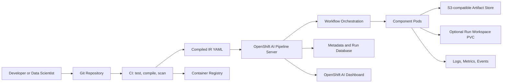

# 22. Pipeline pod troubleshooting
> **Level:** Red Hat OpenShift AI Corporate/L3 — designed for an engineer with 10+ years of Linux, Kubernetes, OpenShift, DevOps, SRE, storage, and security experience.
>
> **Documentation baseline:** Red Hat OpenShift AI Self-Managed 3.5 and Kubeflow Pipelines 2.x. Validate exact CRD fields and supported versions on your installed cluster before production change.
>
> **Line-count design:** This chapter is intentionally expanded into architecture, build, security, operations, failure analysis, labs, drills, and production checklists.
## 1. Executive definition
Troubleshoot outside-in: user/API, pipeline server, workflow/run, task pod, scheduler, admission, node, network, storage, registry, and application. Preserve evidence before retrying or deleting.
In this chapter, **Pipeline pod troubleshooting** is treated as a production platform capability rather than a dashboard feature.
The practical project goal is: Diagnose pipeline task pods by events, status, scheduling, security context, networking, storage, logs, and node conditions.
### 1.1 Outcome
- Explain Pipeline pod troubleshooting in architectural, operational, security, and troubleshooting terms.
- Build a reproducible implementation from an empty OpenShift AI data science project.
- Use Git, Python, KFP SDK, container images, OpenShift resources, object storage, and a metadata database appropriately.
- Validate behavior through CLI evidence rather than relying only on dashboard status.
- Produce an L3 runbook with symptoms, evidence, root cause, corrective action, and prevention.
- Apply enterprise controls for least privilege, immutable delivery, observability, retention, and disaster recovery.
## 2. Product and version context
- OpenShift AI pipelines are KFP-based machine-learning workflows executed on OpenShift.
- A project-scoped pipeline server is represented by a `DataSciencePipelinesApplication` (DSPA).
- Red Hat OpenShift AI 3.5 documents KFP SDK 2.14.3 or later and Python 3.11 or later for its compile workflow.
- KFP v2 compilation produces Intermediate Representation YAML, a serialized `PipelineSpec`.
- Pipeline definitions can be stored as Kubernetes resources, supporting GitOps-oriented management.
- S3-compatible object storage stores definitions and run artifacts; metadata and run records use a database.
- Red Hat recommends an external MySQL or MariaDB database for production pipeline workloads.
- Workspaces can provide ephemeral shared PVC-backed storage for components within a run where supported and configured.
- Version-specific behavior can change. Always inspect installed CSVs, CRDs, DSPA status, and release notes.
### 2.1 Mandatory discovery commands
```bash
oc version
oc get csv -A | grep -Ei 'opendatahub|openshift-ai|rhods'
oc api-resources | grep -Ei 'datasciencepipeline|pipelineversion|pipelines'
oc get crd | grep -Ei 'datasciencepipelines|pipelines.kubeflow'
oc explain datasciencepipelinesapplication.spec
oc get dspa -A
oc get datasciencecluster -A -o yaml
oc get dscinitialization -A -o yaml
```
## 3. Architecture
### 3.1 Logical flow

### 3.2 Control plane
- **oc describe:** determine ownership, lifecycle, availability, permissions, and evidence paths for this resource.
- **events:** determine ownership, lifecycle, availability, permissions, and evidence paths for this resource.
- **pod status:** determine ownership, lifecycle, availability, permissions, and evidence paths for this resource.
- **logs:** determine ownership, lifecycle, availability, permissions, and evidence paths for this resource.
- **DSPA status:** determine ownership, lifecycle, availability, permissions, and evidence paths for this resource.
- **operator logs:** determine ownership, lifecycle, availability, permissions, and evidence paths for this resource.
- **routes:** determine ownership, lifecycle, availability, permissions, and evidence paths for this resource.
- **secrets:** determine ownership, lifecycle, availability, permissions, and evidence paths for this resource.
- **PVCs:** determine ownership, lifecycle, availability, permissions, and evidence paths for this resource.
### 3.3 Data plane
- Input parameters are small values serialized into the run specification.
- Artifacts are larger typed objects whose payloads are stored externally and whose metadata is tracked.
- Component containers execute isolated units of work.
- Workspace PVCs can exchange large intermediate data within one run without repeated object-store transfers.
- Container registries distribute immutable runtime images.
- Network paths connect task pods to APIs, registries, databases, and object storage.
### 3.4 Trust boundaries
- Human user to OpenShift OAuth and OpenShift AI dashboard.
- CI identity to registry, Git, cluster API, and pipeline API.
- Pipeline server to database and S3-compatible object storage.
- Task service account to Kubernetes API and project resources.
- Task pod to external data services through controlled egress.
- Object-store credential to a specific bucket and prefix where supported.
- Cluster trust bundle to external TLS endpoints.
## 4. From-scratch corporate project
### 4.1 Project name: `22-pipeline-pod-troubleshooting-lab`
**Goal:** Diagnose pipeline task pods by events, status, scheduling, security context, networking, storage, logs, and node conditions.
### 4.2 Repository layout
```text
rhoai-pipeline-lab/
├── README.md
├── pyproject.toml
├── requirements.lock
├── src/
│   ├── components/
│   │   ├── validate_data.py
│   │   ├── train_model.py
│   │   └── evaluate_model.py
│   └── pipelines/
│       └── training_pipeline.py
├── tests/
│   ├── unit/
│   └── integration/
├── compiled/
│   └── training-pipeline.yaml
├── images/
│   └── trainer/
│       ├── Containerfile
│       └── requirements.txt
├── manifests/
│   ├── namespace.yaml
│   ├── serviceaccount.yaml
│   ├── rbac.yaml
│   ├── secrets.example.yaml
│   ├── networkpolicy.yaml
│   └── pipeline-version.yaml
├── ci/
│   ├── tekton.yaml
│   └── github-actions.yaml
├── policy/
│   ├── conftest/
│   └── signatures/
└── docs/
    ├── architecture.md
    ├── operations.md
    └── troubleshooting.md
```
### 4.3 Create the OpenShift project
```bash
export PROJECT=rhoai-pipeline-lab
oc new-project "$PROJECT"
oc label namespace "$PROJECT"       app.kubernetes.io/part-of=rhoai-pipeline-platform       environment=lab       owner=ml-platform       data-classification=internal
```
### 4.4 Verify quota and defaults before creating workloads
```bash
oc get resourcequota,limitrange -n "$PROJECT" -o yaml
oc get storageclass
oc get networkpolicy -n "$PROJECT"
oc auth can-i create pods -n "$PROJECT"
oc auth can-i create secrets -n "$PROJECT"
oc auth can-i create datasciencepipelinesapplications.opendatahub.io -n "$PROJECT"
```
### 4.5 Configure the pipeline server
Use the OpenShift AI dashboard for the supported configuration workflow:
140. Open **Projects** and select the data science project.
141. Open the **Pipelines** area and select **Configure pipeline server**.
142. Provide S3 access key, secret key, endpoint, region, and bucket.
143. For production, select an external MySQL or MariaDB database rather than the development in-cluster database.
144. Keep pipeline-definition storage in Kubernetes when GitOps management is required.
145. Decide whether caching can be configured at pipeline and task level.
146. Submit the configuration and wait for DSPA readiness.
### 4.6 Validate DSPA and server resources
```bash
oc get dspa -n "$PROJECT"
oc get dspa -n "$PROJECT" -o yaml
oc get pods -n "$PROJECT" -o wide
oc get deploy,sts,svc,route -n "$PROJECT"
oc get events -n "$PROJECT" --sort-by=.lastTimestamp | tail -n 80
```
### 4.7 Create a controlled Python environment
```bash
python3.11 -m venv .venv
source .venv/bin/activate
python -m pip install --upgrade pip
python -m pip install "kfp>=2.14.3" pytest ruff mypy
python -m pip freeze > requirements.lock
kfp --help
```
### 4.8 Create a typed KFP pipeline
```python
from kfp import compiler, dsl
from kfp.dsl import Dataset, Input, Metrics, Model, Output

@dsl.component(
    base_image="registry.access.redhat.com/ubi9/python-311:latest",
    packages_to_install=["pandas==2.2.3"],
)
def validate_data(source_uri: str, validated: Output[Dataset]) -> int:
    import json
    from pathlib import Path
    Path(validated.path).write_text(
        json.dumps({"source_uri": source_uri, "status": "validated"})
    )
    validated.metadata["source_uri"] = source_uri
    validated.metadata["validation_status"] = "passed"
    return 1

@dsl.component(
    base_image="registry.access.redhat.com/ubi9/python-311:latest",
    packages_to_install=["scikit-learn==1.5.2", "joblib==1.4.2"],
)
def train_model(
    validated: Input[Dataset],
    n_estimators: int,
    model: Output[Model],
    metrics: Output[Metrics],
):
    import json
    from pathlib import Path
    Path(model.path).write_text(
        json.dumps({"algorithm": "RandomForest", "n_estimators": n_estimators})
    )
    model.metadata["framework"] = "scikit-learn"
    model.metadata["n_estimators"] = n_estimators
    metrics.log_metric("accuracy", 0.91)
    metrics.log_metric("f1", 0.89)

@dsl.pipeline(name="corporate-training-pipeline")
def training_pipeline(
    source_uri: str = "s3://example-bucket/datasets/train.csv",
    n_estimators: int = 100,
):
    validation = validate_data(source_uri=source_uri)
    training = train_model(
        validated=validation.outputs["validated"],
        n_estimators=n_estimators,
    )
    training.set_cpu_request("500m")
    training.set_memory_request("1Gi")
    training.set_memory_limit("2Gi")
    training.set_caching_options(enable_caching=True)

if __name__ == "__main__":
    compiler.Compiler().compile(
        pipeline_func=training_pipeline,
        package_path="compiled/training-pipeline.yaml",
    )
```
### 4.9 Compile and inspect
```bash
mkdir -p compiled
python src/pipelines/training_pipeline.py
test -s compiled/training-pipeline.yaml
head -n 40 compiled/training-pipeline.yaml
grep -nE 'pipelineInfo|sdkVersion|schemaVersion|components|deploymentSpec'       compiled/training-pipeline.yaml | head -n 40
sha256sum compiled/training-pipeline.yaml
```
### 4.10 Import, version, and run
- Import the compiled YAML as a pipeline definition in the selected project.
- Use a version name tied to the Git tag or release, for example `1.0.0+<short-sha>`.
- Create an experiment representing the business hypothesis or release validation.
- Create a run from the exact pipeline version.
- Enter explicit parameters; do not rely on hidden notebook state.
- Watch the graph, task status, pod status, logs, events, metrics, and output artifacts.
- Archive the run after evidence is captured; delete only according to retention policy.
## 5. Topic-specific engineering analysis
### 5.1 What makes **Pipeline pod troubleshooting** production grade
- Control **destroying evidence** through design-time validation, policy, observability, and a tested recovery procedure.
- Control **random changes** through design-time validation, policy, observability, and a tested recovery procedure.
- Control **misreading UI status** through design-time validation, policy, observability, and a tested recovery procedure.
- Control **ignoring events** through design-time validation, policy, observability, and a tested recovery procedure.
- Control **restarting before root cause** through design-time validation, policy, observability, and a tested recovery procedure.
- Control **scope confusion** through design-time validation, policy, observability, and a tested recovery procedure.
### 5.2 Design decisions
- **Source of truth:** Keep maintainable Python and component source in Git; treat compiled YAML as a generated release artifact.
- **Runtime identity:** Use a dedicated service account per trust boundary rather than the namespace default account.
- **Artifact identity:** Record dataset, model, code commit, image digest, compiler, parameters, and run identifiers.
- **Storage:** Separate artifact payloads from metadata, and define lifecycle policies for both.
- **Database:** Use a backed-up external MySQL/MariaDB design for production pipeline workloads.
- **Network:** Explicitly permit only required DNS, registry, S3, database, and API paths.
- **Images:** Pin production images by digest and require vulnerability and signature gates.
- **Retries:** Retry only idempotent operations or use deduplication and transactional guards.
- **Caching:** Enable only where the cache key represents every input that can change output.
- **Promotion:** Promote immutable definitions and images; never rebuild the same release version.
- **Rollback:** Test rollback with compatible input data, artifact schemas, and external service APIs.
- **Observability:** Correlate run, task, pod, image, node, storage request, and application request.
## 6. Detailed L3 engineering cards
### 6.1. Architecture Boundary
**Context for Pipeline pod troubleshooting:** Evaluate architecture boundary as part of the end-to-end operating contract. Keywords: pipeline, troubleshooting.
**Design objective:** Make architecture boundary explicit, testable, observable, and reviewable before the pipeline reaches production.
**Implementation approach:** Define the owner, configuration source, namespace scope, inputs, outputs, normal state, failure state, evidence command, corrective action, rollback, and preventive control for architecture boundary.
**OpenShift evidence:** Start with `oc get dspa -n <project> -o yaml` and correlate the result with DSPA status, run details, task pod events, and platform logs.
**Security check:** Ensure architecture boundary does not broaden privileges, expose credentials, bypass TLS validation, or permit cross-project access.
**Reliability check:** Verify behavior during retry, timeout, pod restart, node drain, API unavailability, object-store latency, and database interruption.
**Performance check:** Measure the effect of architecture boundary on startup latency, run duration, CPU, memory, network, storage operations, and concurrency.
**Governance check:** Record the approved configuration for architecture boundary in Git, assign an owner, and define review and expiry dates.
**Test case:** Introduce one controlled failure related to architecture boundary, capture evidence, restore service, and update the runbook with the verified cause.
**Production acceptance:** architecture boundary is acceptable only when the normal path, degraded path, failure alert, and recovery path are demonstrated.
### 6.2. Business Objective
**Context for Pipeline pod troubleshooting:** Evaluate business objective as part of the end-to-end operating contract. Keywords: pipeline, troubleshooting.
**Design objective:** Make business objective explicit, testable, observable, and reviewable before the pipeline reaches production.
**Implementation approach:** Define the owner, configuration source, namespace scope, inputs, outputs, normal state, failure state, evidence command, corrective action, rollback, and preventive control for business objective.
**OpenShift evidence:** Start with `oc get pods -n <project> -o wide` and correlate the result with DSPA status, run details, task pod events, and platform logs.
**Security check:** Ensure business objective does not broaden privileges, expose credentials, bypass TLS validation, or permit cross-project access.
**Reliability check:** Verify behavior during retry, timeout, pod restart, node drain, API unavailability, object-store latency, and database interruption.
**Performance check:** Measure the effect of business objective on startup latency, run duration, CPU, memory, network, storage operations, and concurrency.
**Governance check:** Record the approved configuration for business objective in Git, assign an owner, and define review and expiry dates.
**Test case:** Introduce one controlled failure related to business objective, capture evidence, restore service, and update the runbook with the verified cause.
**Production acceptance:** business objective is acceptable only when the normal path, degraded path, failure alert, and recovery path are demonstrated.
### 6.3. Data Contract
**Context for Pipeline pod troubleshooting:** Evaluate data contract as part of the end-to-end operating contract. Keywords: pipeline, troubleshooting.
**Design objective:** Make data contract explicit, testable, observable, and reviewable before the pipeline reaches production.
**Implementation approach:** Define the owner, configuration source, namespace scope, inputs, outputs, normal state, failure state, evidence command, corrective action, rollback, and preventive control for data contract.
**OpenShift evidence:** Start with `oc get events -n <project> --sort-by=.lastTimestamp` and correlate the result with DSPA status, run details, task pod events, and platform logs.
**Security check:** Ensure data contract does not broaden privileges, expose credentials, bypass TLS validation, or permit cross-project access.
**Reliability check:** Verify behavior during retry, timeout, pod restart, node drain, API unavailability, object-store latency, and database interruption.
**Performance check:** Measure the effect of data contract on startup latency, run duration, CPU, memory, network, storage operations, and concurrency.
**Governance check:** Record the approved configuration for data contract in Git, assign an owner, and define review and expiry dates.
**Test case:** Introduce one controlled failure related to data contract, capture evidence, restore service, and update the runbook with the verified cause.
**Production acceptance:** data contract is acceptable only when the normal path, degraded path, failure alert, and recovery path are demonstrated.
### 6.4. Input Validation
**Context for Pipeline pod troubleshooting:** Evaluate input validation as part of the end-to-end operating contract. Keywords: pipeline, troubleshooting.
**Design objective:** Make input validation explicit, testable, observable, and reviewable before the pipeline reaches production.
**Implementation approach:** Define the owner, configuration source, namespace scope, inputs, outputs, normal state, failure state, evidence command, corrective action, rollback, and preventive control for input validation.
**OpenShift evidence:** Start with `oc describe pod <pod> -n <project>` and correlate the result with DSPA status, run details, task pod events, and platform logs.
**Security check:** Ensure input validation does not broaden privileges, expose credentials, bypass TLS validation, or permit cross-project access.
**Reliability check:** Verify behavior during retry, timeout, pod restart, node drain, API unavailability, object-store latency, and database interruption.
**Performance check:** Measure the effect of input validation on startup latency, run duration, CPU, memory, network, storage operations, and concurrency.
**Governance check:** Record the approved configuration for input validation in Git, assign an owner, and define review and expiry dates.
**Test case:** Introduce one controlled failure related to input validation, capture evidence, restore service, and update the runbook with the verified cause.
**Production acceptance:** input validation is acceptable only when the normal path, degraded path, failure alert, and recovery path are demonstrated.
### 6.5. Output Validation
**Context for Pipeline pod troubleshooting:** Evaluate output validation as part of the end-to-end operating contract. Keywords: pipeline, troubleshooting.
**Design objective:** Make output validation explicit, testable, observable, and reviewable before the pipeline reaches production.
**Implementation approach:** Define the owner, configuration source, namespace scope, inputs, outputs, normal state, failure state, evidence command, corrective action, rollback, and preventive control for output validation.
**OpenShift evidence:** Start with `oc logs <pod> -n <project> --all-containers=true` and correlate the result with DSPA status, run details, task pod events, and platform logs.
**Security check:** Ensure output validation does not broaden privileges, expose credentials, bypass TLS validation, or permit cross-project access.
**Reliability check:** Verify behavior during retry, timeout, pod restart, node drain, API unavailability, object-store latency, and database interruption.
**Performance check:** Measure the effect of output validation on startup latency, run duration, CPU, memory, network, storage operations, and concurrency.
**Governance check:** Record the approved configuration for output validation in Git, assign an owner, and define review and expiry dates.
**Test case:** Introduce one controlled failure related to output validation, capture evidence, restore service, and update the runbook with the verified cause.
**Production acceptance:** output validation is acceptable only when the normal path, degraded path, failure alert, and recovery path are demonstrated.
### 6.6. Idempotency
**Context for Pipeline pod troubleshooting:** Evaluate idempotency as part of the end-to-end operating contract. Keywords: pipeline, troubleshooting.
**Design objective:** Make idempotency explicit, testable, observable, and reviewable before the pipeline reaches production.
**Implementation approach:** Define the owner, configuration source, namespace scope, inputs, outputs, normal state, failure state, evidence command, corrective action, rollback, and preventive control for idempotency.
**OpenShift evidence:** Start with `oc logs <pod> -n <project> --all-containers=true --previous` and correlate the result with DSPA status, run details, task pod events, and platform logs.
**Security check:** Ensure idempotency does not broaden privileges, expose credentials, bypass TLS validation, or permit cross-project access.
**Reliability check:** Verify behavior during retry, timeout, pod restart, node drain, API unavailability, object-store latency, and database interruption.
**Performance check:** Measure the effect of idempotency on startup latency, run duration, CPU, memory, network, storage operations, and concurrency.
**Governance check:** Record the approved configuration for idempotency in Git, assign an owner, and define review and expiry dates.
**Test case:** Introduce one controlled failure related to idempotency, capture evidence, restore service, and update the runbook with the verified cause.
**Production acceptance:** idempotency is acceptable only when the normal path, degraded path, failure alert, and recovery path are demonstrated.
### 6.7. Retry Safety
**Context for Pipeline pod troubleshooting:** Evaluate retry safety as part of the end-to-end operating contract. Keywords: pipeline, troubleshooting.
**Design objective:** Make retry safety explicit, testable, observable, and reviewable before the pipeline reaches production.
**Implementation approach:** Define the owner, configuration source, namespace scope, inputs, outputs, normal state, failure state, evidence command, corrective action, rollback, and preventive control for retry safety.
**OpenShift evidence:** Start with `oc get pvc -n <project>` and correlate the result with DSPA status, run details, task pod events, and platform logs.
**Security check:** Ensure retry safety does not broaden privileges, expose credentials, bypass TLS validation, or permit cross-project access.
**Reliability check:** Verify behavior during retry, timeout, pod restart, node drain, API unavailability, object-store latency, and database interruption.
**Performance check:** Measure the effect of retry safety on startup latency, run duration, CPU, memory, network, storage operations, and concurrency.
**Governance check:** Record the approved configuration for retry safety in Git, assign an owner, and define review and expiry dates.
**Test case:** Introduce one controlled failure related to retry safety, capture evidence, restore service, and update the runbook with the verified cause.
**Production acceptance:** retry safety is acceptable only when the normal path, degraded path, failure alert, and recovery path are demonstrated.
### 6.8. Timeout Strategy
**Context for Pipeline pod troubleshooting:** Evaluate timeout strategy as part of the end-to-end operating contract. Keywords: pipeline, troubleshooting.
**Design objective:** Make timeout strategy explicit, testable, observable, and reviewable before the pipeline reaches production.
**Implementation approach:** Define the owner, configuration source, namespace scope, inputs, outputs, normal state, failure state, evidence command, corrective action, rollback, and preventive control for timeout strategy.
**OpenShift evidence:** Start with `oc describe pvc <pvc> -n <project>` and correlate the result with DSPA status, run details, task pod events, and platform logs.
**Security check:** Ensure timeout strategy does not broaden privileges, expose credentials, bypass TLS validation, or permit cross-project access.
**Reliability check:** Verify behavior during retry, timeout, pod restart, node drain, API unavailability, object-store latency, and database interruption.
**Performance check:** Measure the effect of timeout strategy on startup latency, run duration, CPU, memory, network, storage operations, and concurrency.
**Governance check:** Record the approved configuration for timeout strategy in Git, assign an owner, and define review and expiry dates.
**Test case:** Introduce one controlled failure related to timeout strategy, capture evidence, restore service, and update the runbook with the verified cause.
**Production acceptance:** timeout strategy is acceptable only when the normal path, degraded path, failure alert, and recovery path are demonstrated.
### 6.9. Resource Requests
**Context for Pipeline pod troubleshooting:** Evaluate resource requests as part of the end-to-end operating contract. Keywords: pipeline, troubleshooting.
**Design objective:** Make resource requests explicit, testable, observable, and reviewable before the pipeline reaches production.
**Implementation approach:** Define the owner, configuration source, namespace scope, inputs, outputs, normal state, failure state, evidence command, corrective action, rollback, and preventive control for resource requests.
**OpenShift evidence:** Start with `oc get sa,role,rolebinding -n <project>` and correlate the result with DSPA status, run details, task pod events, and platform logs.
**Security check:** Ensure resource requests does not broaden privileges, expose credentials, bypass TLS validation, or permit cross-project access.
**Reliability check:** Verify behavior during retry, timeout, pod restart, node drain, API unavailability, object-store latency, and database interruption.
**Performance check:** Measure the effect of resource requests on startup latency, run duration, CPU, memory, network, storage operations, and concurrency.
**Governance check:** Record the approved configuration for resource requests in Git, assign an owner, and define review and expiry dates.
**Test case:** Introduce one controlled failure related to resource requests, capture evidence, restore service, and update the runbook with the verified cause.
**Production acceptance:** resource requests is acceptable only when the normal path, degraded path, failure alert, and recovery path are demonstrated.
### 6.10. Resource Limits
**Context for Pipeline pod troubleshooting:** Evaluate resource limits as part of the end-to-end operating contract. Keywords: pipeline, troubleshooting.
**Design objective:** Make resource limits explicit, testable, observable, and reviewable before the pipeline reaches production.
**Implementation approach:** Define the owner, configuration source, namespace scope, inputs, outputs, normal state, failure state, evidence command, corrective action, rollback, and preventive control for resource limits.
**OpenShift evidence:** Start with `oc auth can-i --as=system:serviceaccount:<project>:<sa> create pods -n <project>` and correlate the result with DSPA status, run details, task pod events, and platform logs.
**Security check:** Ensure resource limits does not broaden privileges, expose credentials, bypass TLS validation, or permit cross-project access.
**Reliability check:** Verify behavior during retry, timeout, pod restart, node drain, API unavailability, object-store latency, and database interruption.
**Performance check:** Measure the effect of resource limits on startup latency, run duration, CPU, memory, network, storage operations, and concurrency.
**Governance check:** Record the approved configuration for resource limits in Git, assign an owner, and define review and expiry dates.
**Test case:** Introduce one controlled failure related to resource limits, capture evidence, restore service, and update the runbook with the verified cause.
**Production acceptance:** resource limits is acceptable only when the normal path, degraded path, failure alert, and recovery path are demonstrated.
### 6.11. Cpu Sizing
**Context for Pipeline pod troubleshooting:** Evaluate CPU sizing as part of the end-to-end operating contract. Keywords: pipeline, troubleshooting.
**Design objective:** Make CPU sizing explicit, testable, observable, and reviewable before the pipeline reaches production.
**Implementation approach:** Define the owner, configuration source, namespace scope, inputs, outputs, normal state, failure state, evidence command, corrective action, rollback, and preventive control for CPU sizing.
**OpenShift evidence:** Start with `oc get secret -n <project>` and correlate the result with DSPA status, run details, task pod events, and platform logs.
**Security check:** Ensure CPU sizing does not broaden privileges, expose credentials, bypass TLS validation, or permit cross-project access.
**Reliability check:** Verify behavior during retry, timeout, pod restart, node drain, API unavailability, object-store latency, and database interruption.
**Performance check:** Measure the effect of CPU sizing on startup latency, run duration, CPU, memory, network, storage operations, and concurrency.
**Governance check:** Record the approved configuration for CPU sizing in Git, assign an owner, and define review and expiry dates.
**Test case:** Introduce one controlled failure related to CPU sizing, capture evidence, restore service, and update the runbook with the verified cause.
**Production acceptance:** CPU sizing is acceptable only when the normal path, degraded path, failure alert, and recovery path are demonstrated.
### 6.12. Memory Sizing
**Context for Pipeline pod troubleshooting:** Evaluate memory sizing as part of the end-to-end operating contract. Keywords: pipeline, troubleshooting.
**Design objective:** Make memory sizing explicit, testable, observable, and reviewable before the pipeline reaches production.
**Implementation approach:** Define the owner, configuration source, namespace scope, inputs, outputs, normal state, failure state, evidence command, corrective action, rollback, and preventive control for memory sizing.
**OpenShift evidence:** Start with `oc get route,svc,endpoints -n <project>` and correlate the result with DSPA status, run details, task pod events, and platform logs.
**Security check:** Ensure memory sizing does not broaden privileges, expose credentials, bypass TLS validation, or permit cross-project access.
**Reliability check:** Verify behavior during retry, timeout, pod restart, node drain, API unavailability, object-store latency, and database interruption.
**Performance check:** Measure the effect of memory sizing on startup latency, run duration, CPU, memory, network, storage operations, and concurrency.
**Governance check:** Record the approved configuration for memory sizing in Git, assign an owner, and define review and expiry dates.
**Test case:** Introduce one controlled failure related to memory sizing, capture evidence, restore service, and update the runbook with the verified cause.
**Production acceptance:** memory sizing is acceptable only when the normal path, degraded path, failure alert, and recovery path are demonstrated.
### 6.13. Gpu Scheduling
**Context for Pipeline pod troubleshooting:** Evaluate GPU scheduling as part of the end-to-end operating contract. Keywords: pipeline, troubleshooting.
**Design objective:** Make GPU scheduling explicit, testable, observable, and reviewable before the pipeline reaches production.
**Implementation approach:** Define the owner, configuration source, namespace scope, inputs, outputs, normal state, failure state, evidence command, corrective action, rollback, and preventive control for GPU scheduling.
**OpenShift evidence:** Start with `oc get resourcequota,limitrange -n <project> -o yaml` and correlate the result with DSPA status, run details, task pod events, and platform logs.
**Security check:** Ensure GPU scheduling does not broaden privileges, expose credentials, bypass TLS validation, or permit cross-project access.
**Reliability check:** Verify behavior during retry, timeout, pod restart, node drain, API unavailability, object-store latency, and database interruption.
**Performance check:** Measure the effect of GPU scheduling on startup latency, run duration, CPU, memory, network, storage operations, and concurrency.
**Governance check:** Record the approved configuration for GPU scheduling in Git, assign an owner, and define review and expiry dates.
**Test case:** Introduce one controlled failure related to GPU scheduling, capture evidence, restore service, and update the runbook with the verified cause.
**Production acceptance:** GPU scheduling is acceptable only when the normal path, degraded path, failure alert, and recovery path are demonstrated.
### 6.14. Node Placement
**Context for Pipeline pod troubleshooting:** Evaluate node placement as part of the end-to-end operating contract. Keywords: pipeline, troubleshooting.
**Design objective:** Make node placement explicit, testable, observable, and reviewable before the pipeline reaches production.
**Implementation approach:** Define the owner, configuration source, namespace scope, inputs, outputs, normal state, failure state, evidence command, corrective action, rollback, and preventive control for node placement.
**OpenShift evidence:** Start with `oc get nodes -o wide` and correlate the result with DSPA status, run details, task pod events, and platform logs.
**Security check:** Ensure node placement does not broaden privileges, expose credentials, bypass TLS validation, or permit cross-project access.
**Reliability check:** Verify behavior during retry, timeout, pod restart, node drain, API unavailability, object-store latency, and database interruption.
**Performance check:** Measure the effect of node placement on startup latency, run duration, CPU, memory, network, storage operations, and concurrency.
**Governance check:** Record the approved configuration for node placement in Git, assign an owner, and define review and expiry dates.
**Test case:** Introduce one controlled failure related to node placement, capture evidence, restore service, and update the runbook with the verified cause.
**Production acceptance:** node placement is acceptable only when the normal path, degraded path, failure alert, and recovery path are demonstrated.
### 6.15. Taints And Tolerations
**Context for Pipeline pod troubleshooting:** Evaluate taints and tolerations as part of the end-to-end operating contract. Keywords: pipeline, troubleshooting.
**Design objective:** Make taints and tolerations explicit, testable, observable, and reviewable before the pipeline reaches production.
**Implementation approach:** Define the owner, configuration source, namespace scope, inputs, outputs, normal state, failure state, evidence command, corrective action, rollback, and preventive control for taints and tolerations.
**OpenShift evidence:** Start with `oc describe node <node>` and correlate the result with DSPA status, run details, task pod events, and platform logs.
**Security check:** Ensure taints and tolerations does not broaden privileges, expose credentials, bypass TLS validation, or permit cross-project access.
**Reliability check:** Verify behavior during retry, timeout, pod restart, node drain, API unavailability, object-store latency, and database interruption.
**Performance check:** Measure the effect of taints and tolerations on startup latency, run duration, CPU, memory, network, storage operations, and concurrency.
**Governance check:** Record the approved configuration for taints and tolerations in Git, assign an owner, and define review and expiry dates.
**Test case:** Introduce one controlled failure related to taints and tolerations, capture evidence, restore service, and update the runbook with the verified cause.
**Production acceptance:** taints and tolerations is acceptable only when the normal path, degraded path, failure alert, and recovery path are demonstrated.
### 6.16. Topology
**Context for Pipeline pod troubleshooting:** Evaluate topology as part of the end-to-end operating contract. Keywords: pipeline, troubleshooting.
**Design objective:** Make topology explicit, testable, observable, and reviewable before the pipeline reaches production.
**Implementation approach:** Define the owner, configuration source, namespace scope, inputs, outputs, normal state, failure state, evidence command, corrective action, rollback, and preventive control for topology.
**OpenShift evidence:** Start with `oc get networkpolicy -n <project> -o yaml` and correlate the result with DSPA status, run details, task pod events, and platform logs.
**Security check:** Ensure topology does not broaden privileges, expose credentials, bypass TLS validation, or permit cross-project access.
**Reliability check:** Verify behavior during retry, timeout, pod restart, node drain, API unavailability, object-store latency, and database interruption.
**Performance check:** Measure the effect of topology on startup latency, run duration, CPU, memory, network, storage operations, and concurrency.
**Governance check:** Record the approved configuration for topology in Git, assign an owner, and define review and expiry dates.
**Test case:** Introduce one controlled failure related to topology, capture evidence, restore service, and update the runbook with the verified cause.
**Production acceptance:** topology is acceptable only when the normal path, degraded path, failure alert, and recovery path are demonstrated.
### 6.17. Service Account
**Context for Pipeline pod troubleshooting:** Evaluate service account as part of the end-to-end operating contract. Keywords: pipeline, troubleshooting.
**Design objective:** Make service account explicit, testable, observable, and reviewable before the pipeline reaches production.
**Implementation approach:** Define the owner, configuration source, namespace scope, inputs, outputs, normal state, failure state, evidence command, corrective action, rollback, and preventive control for service account.
**OpenShift evidence:** Start with `oc get dspa -n <project> -o yaml` and correlate the result with DSPA status, run details, task pod events, and platform logs.
**Security check:** Ensure service account does not broaden privileges, expose credentials, bypass TLS validation, or permit cross-project access.
**Reliability check:** Verify behavior during retry, timeout, pod restart, node drain, API unavailability, object-store latency, and database interruption.
**Performance check:** Measure the effect of service account on startup latency, run duration, CPU, memory, network, storage operations, and concurrency.
**Governance check:** Record the approved configuration for service account in Git, assign an owner, and define review and expiry dates.
**Test case:** Introduce one controlled failure related to service account, capture evidence, restore service, and update the runbook with the verified cause.
**Production acceptance:** service account is acceptable only when the normal path, degraded path, failure alert, and recovery path are demonstrated.
### 6.18. Rbac
**Context for Pipeline pod troubleshooting:** Evaluate RBAC as part of the end-to-end operating contract. Keywords: pipeline, troubleshooting.
**Design objective:** Make RBAC explicit, testable, observable, and reviewable before the pipeline reaches production.
**Implementation approach:** Define the owner, configuration source, namespace scope, inputs, outputs, normal state, failure state, evidence command, corrective action, rollback, and preventive control for RBAC.
**OpenShift evidence:** Start with `oc get pods -n <project> -o wide` and correlate the result with DSPA status, run details, task pod events, and platform logs.
**Security check:** Ensure RBAC does not broaden privileges, expose credentials, bypass TLS validation, or permit cross-project access.
**Reliability check:** Verify behavior during retry, timeout, pod restart, node drain, API unavailability, object-store latency, and database interruption.
**Performance check:** Measure the effect of RBAC on startup latency, run duration, CPU, memory, network, storage operations, and concurrency.
**Governance check:** Record the approved configuration for RBAC in Git, assign an owner, and define review and expiry dates.
**Test case:** Introduce one controlled failure related to RBAC, capture evidence, restore service, and update the runbook with the verified cause.
**Production acceptance:** RBAC is acceptable only when the normal path, degraded path, failure alert, and recovery path are demonstrated.
### 6.19. Secret Handling
**Context for Pipeline pod troubleshooting:** Evaluate secret handling as part of the end-to-end operating contract. Keywords: pipeline, troubleshooting.
**Design objective:** Make secret handling explicit, testable, observable, and reviewable before the pipeline reaches production.
**Implementation approach:** Define the owner, configuration source, namespace scope, inputs, outputs, normal state, failure state, evidence command, corrective action, rollback, and preventive control for secret handling.
**OpenShift evidence:** Start with `oc get events -n <project> --sort-by=.lastTimestamp` and correlate the result with DSPA status, run details, task pod events, and platform logs.
**Security check:** Ensure secret handling does not broaden privileges, expose credentials, bypass TLS validation, or permit cross-project access.
**Reliability check:** Verify behavior during retry, timeout, pod restart, node drain, API unavailability, object-store latency, and database interruption.
**Performance check:** Measure the effect of secret handling on startup latency, run duration, CPU, memory, network, storage operations, and concurrency.
**Governance check:** Record the approved configuration for secret handling in Git, assign an owner, and define review and expiry dates.
**Test case:** Introduce one controlled failure related to secret handling, capture evidence, restore service, and update the runbook with the verified cause.
**Production acceptance:** secret handling is acceptable only when the normal path, degraded path, failure alert, and recovery path are demonstrated.
### 6.20. Token Lifetime
**Context for Pipeline pod troubleshooting:** Evaluate token lifetime as part of the end-to-end operating contract. Keywords: pipeline, troubleshooting.
**Design objective:** Make token lifetime explicit, testable, observable, and reviewable before the pipeline reaches production.
**Implementation approach:** Define the owner, configuration source, namespace scope, inputs, outputs, normal state, failure state, evidence command, corrective action, rollback, and preventive control for token lifetime.
**OpenShift evidence:** Start with `oc describe pod <pod> -n <project>` and correlate the result with DSPA status, run details, task pod events, and platform logs.
**Security check:** Ensure token lifetime does not broaden privileges, expose credentials, bypass TLS validation, or permit cross-project access.
**Reliability check:** Verify behavior during retry, timeout, pod restart, node drain, API unavailability, object-store latency, and database interruption.
**Performance check:** Measure the effect of token lifetime on startup latency, run duration, CPU, memory, network, storage operations, and concurrency.
**Governance check:** Record the approved configuration for token lifetime in Git, assign an owner, and define review and expiry dates.
**Test case:** Introduce one controlled failure related to token lifetime, capture evidence, restore service, and update the runbook with the verified cause.
**Production acceptance:** token lifetime is acceptable only when the normal path, degraded path, failure alert, and recovery path are demonstrated.
### 6.21. Network Policy
**Context for Pipeline pod troubleshooting:** Evaluate network policy as part of the end-to-end operating contract. Keywords: pipeline, troubleshooting.
**Design objective:** Make network policy explicit, testable, observable, and reviewable before the pipeline reaches production.
**Implementation approach:** Define the owner, configuration source, namespace scope, inputs, outputs, normal state, failure state, evidence command, corrective action, rollback, and preventive control for network policy.
**OpenShift evidence:** Start with `oc logs <pod> -n <project> --all-containers=true` and correlate the result with DSPA status, run details, task pod events, and platform logs.
**Security check:** Ensure network policy does not broaden privileges, expose credentials, bypass TLS validation, or permit cross-project access.
**Reliability check:** Verify behavior during retry, timeout, pod restart, node drain, API unavailability, object-store latency, and database interruption.
**Performance check:** Measure the effect of network policy on startup latency, run duration, CPU, memory, network, storage operations, and concurrency.
**Governance check:** Record the approved configuration for network policy in Git, assign an owner, and define review and expiry dates.
**Test case:** Introduce one controlled failure related to network policy, capture evidence, restore service, and update the runbook with the verified cause.
**Production acceptance:** network policy is acceptable only when the normal path, degraded path, failure alert, and recovery path are demonstrated.
### 6.22. Egress Control
**Context for Pipeline pod troubleshooting:** Evaluate egress control as part of the end-to-end operating contract. Keywords: pipeline, troubleshooting.
**Design objective:** Make egress control explicit, testable, observable, and reviewable before the pipeline reaches production.
**Implementation approach:** Define the owner, configuration source, namespace scope, inputs, outputs, normal state, failure state, evidence command, corrective action, rollback, and preventive control for egress control.
**OpenShift evidence:** Start with `oc logs <pod> -n <project> --all-containers=true --previous` and correlate the result with DSPA status, run details, task pod events, and platform logs.
**Security check:** Ensure egress control does not broaden privileges, expose credentials, bypass TLS validation, or permit cross-project access.
**Reliability check:** Verify behavior during retry, timeout, pod restart, node drain, API unavailability, object-store latency, and database interruption.
**Performance check:** Measure the effect of egress control on startup latency, run duration, CPU, memory, network, storage operations, and concurrency.
**Governance check:** Record the approved configuration for egress control in Git, assign an owner, and define review and expiry dates.
**Test case:** Introduce one controlled failure related to egress control, capture evidence, restore service, and update the runbook with the verified cause.
**Production acceptance:** egress control is acceptable only when the normal path, degraded path, failure alert, and recovery path are demonstrated.
### 6.23. Dns Dependency
**Context for Pipeline pod troubleshooting:** Evaluate DNS dependency as part of the end-to-end operating contract. Keywords: pipeline, troubleshooting.
**Design objective:** Make DNS dependency explicit, testable, observable, and reviewable before the pipeline reaches production.
**Implementation approach:** Define the owner, configuration source, namespace scope, inputs, outputs, normal state, failure state, evidence command, corrective action, rollback, and preventive control for DNS dependency.
**OpenShift evidence:** Start with `oc get pvc -n <project>` and correlate the result with DSPA status, run details, task pod events, and platform logs.
**Security check:** Ensure DNS dependency does not broaden privileges, expose credentials, bypass TLS validation, or permit cross-project access.
**Reliability check:** Verify behavior during retry, timeout, pod restart, node drain, API unavailability, object-store latency, and database interruption.
**Performance check:** Measure the effect of DNS dependency on startup latency, run duration, CPU, memory, network, storage operations, and concurrency.
**Governance check:** Record the approved configuration for DNS dependency in Git, assign an owner, and define review and expiry dates.
**Test case:** Introduce one controlled failure related to DNS dependency, capture evidence, restore service, and update the runbook with the verified cause.
**Production acceptance:** DNS dependency is acceptable only when the normal path, degraded path, failure alert, and recovery path are demonstrated.
### 6.24. Proxy Behavior
**Context for Pipeline pod troubleshooting:** Evaluate proxy behavior as part of the end-to-end operating contract. Keywords: pipeline, troubleshooting.
**Design objective:** Make proxy behavior explicit, testable, observable, and reviewable before the pipeline reaches production.
**Implementation approach:** Define the owner, configuration source, namespace scope, inputs, outputs, normal state, failure state, evidence command, corrective action, rollback, and preventive control for proxy behavior.
**OpenShift evidence:** Start with `oc describe pvc <pvc> -n <project>` and correlate the result with DSPA status, run details, task pod events, and platform logs.
**Security check:** Ensure proxy behavior does not broaden privileges, expose credentials, bypass TLS validation, or permit cross-project access.
**Reliability check:** Verify behavior during retry, timeout, pod restart, node drain, API unavailability, object-store latency, and database interruption.
**Performance check:** Measure the effect of proxy behavior on startup latency, run duration, CPU, memory, network, storage operations, and concurrency.
**Governance check:** Record the approved configuration for proxy behavior in Git, assign an owner, and define review and expiry dates.
**Test case:** Introduce one controlled failure related to proxy behavior, capture evidence, restore service, and update the runbook with the verified cause.
**Production acceptance:** proxy behavior is acceptable only when the normal path, degraded path, failure alert, and recovery path are demonstrated.
### 6.25. Tls Trust
**Context for Pipeline pod troubleshooting:** Evaluate TLS trust as part of the end-to-end operating contract. Keywords: pipeline, troubleshooting.
**Design objective:** Make TLS trust explicit, testable, observable, and reviewable before the pipeline reaches production.
**Implementation approach:** Define the owner, configuration source, namespace scope, inputs, outputs, normal state, failure state, evidence command, corrective action, rollback, and preventive control for TLS trust.
**OpenShift evidence:** Start with `oc get sa,role,rolebinding -n <project>` and correlate the result with DSPA status, run details, task pod events, and platform logs.
**Security check:** Ensure TLS trust does not broaden privileges, expose credentials, bypass TLS validation, or permit cross-project access.
**Reliability check:** Verify behavior during retry, timeout, pod restart, node drain, API unavailability, object-store latency, and database interruption.
**Performance check:** Measure the effect of TLS trust on startup latency, run duration, CPU, memory, network, storage operations, and concurrency.
**Governance check:** Record the approved configuration for TLS trust in Git, assign an owner, and define review and expiry dates.
**Test case:** Introduce one controlled failure related to TLS trust, capture evidence, restore service, and update the runbook with the verified cause.
**Production acceptance:** TLS trust is acceptable only when the normal path, degraded path, failure alert, and recovery path are demonstrated.
### 6.26. Certificate Rotation
**Context for Pipeline pod troubleshooting:** Evaluate certificate rotation as part of the end-to-end operating contract. Keywords: pipeline, troubleshooting.
**Design objective:** Make certificate rotation explicit, testable, observable, and reviewable before the pipeline reaches production.
**Implementation approach:** Define the owner, configuration source, namespace scope, inputs, outputs, normal state, failure state, evidence command, corrective action, rollback, and preventive control for certificate rotation.
**OpenShift evidence:** Start with `oc auth can-i --as=system:serviceaccount:<project>:<sa> create pods -n <project>` and correlate the result with DSPA status, run details, task pod events, and platform logs.
**Security check:** Ensure certificate rotation does not broaden privileges, expose credentials, bypass TLS validation, or permit cross-project access.
**Reliability check:** Verify behavior during retry, timeout, pod restart, node drain, API unavailability, object-store latency, and database interruption.
**Performance check:** Measure the effect of certificate rotation on startup latency, run duration, CPU, memory, network, storage operations, and concurrency.
**Governance check:** Record the approved configuration for certificate rotation in Git, assign an owner, and define review and expiry dates.
**Test case:** Introduce one controlled failure related to certificate rotation, capture evidence, restore service, and update the runbook with the verified cause.
**Production acceptance:** certificate rotation is acceptable only when the normal path, degraded path, failure alert, and recovery path are demonstrated.
### 6.27. Image Provenance
**Context for Pipeline pod troubleshooting:** Evaluate image provenance as part of the end-to-end operating contract. Keywords: pipeline, troubleshooting.
**Design objective:** Make image provenance explicit, testable, observable, and reviewable before the pipeline reaches production.
**Implementation approach:** Define the owner, configuration source, namespace scope, inputs, outputs, normal state, failure state, evidence command, corrective action, rollback, and preventive control for image provenance.
**OpenShift evidence:** Start with `oc get secret -n <project>` and correlate the result with DSPA status, run details, task pod events, and platform logs.
**Security check:** Ensure image provenance does not broaden privileges, expose credentials, bypass TLS validation, or permit cross-project access.
**Reliability check:** Verify behavior during retry, timeout, pod restart, node drain, API unavailability, object-store latency, and database interruption.
**Performance check:** Measure the effect of image provenance on startup latency, run duration, CPU, memory, network, storage operations, and concurrency.
**Governance check:** Record the approved configuration for image provenance in Git, assign an owner, and define review and expiry dates.
**Test case:** Introduce one controlled failure related to image provenance, capture evidence, restore service, and update the runbook with the verified cause.
**Production acceptance:** image provenance is acceptable only when the normal path, degraded path, failure alert, and recovery path are demonstrated.
### 6.28. Image Digest Pinning
**Context for Pipeline pod troubleshooting:** Evaluate image digest pinning as part of the end-to-end operating contract. Keywords: pipeline, troubleshooting.
**Design objective:** Make image digest pinning explicit, testable, observable, and reviewable before the pipeline reaches production.
**Implementation approach:** Define the owner, configuration source, namespace scope, inputs, outputs, normal state, failure state, evidence command, corrective action, rollback, and preventive control for image digest pinning.
**OpenShift evidence:** Start with `oc get route,svc,endpoints -n <project>` and correlate the result with DSPA status, run details, task pod events, and platform logs.
**Security check:** Ensure image digest pinning does not broaden privileges, expose credentials, bypass TLS validation, or permit cross-project access.
**Reliability check:** Verify behavior during retry, timeout, pod restart, node drain, API unavailability, object-store latency, and database interruption.
**Performance check:** Measure the effect of image digest pinning on startup latency, run duration, CPU, memory, network, storage operations, and concurrency.
**Governance check:** Record the approved configuration for image digest pinning in Git, assign an owner, and define review and expiry dates.
**Test case:** Introduce one controlled failure related to image digest pinning, capture evidence, restore service, and update the runbook with the verified cause.
**Production acceptance:** image digest pinning is acceptable only when the normal path, degraded path, failure alert, and recovery path are demonstrated.
### 6.29. Sbom
**Context for Pipeline pod troubleshooting:** Evaluate SBOM as part of the end-to-end operating contract. Keywords: pipeline, troubleshooting.
**Design objective:** Make SBOM explicit, testable, observable, and reviewable before the pipeline reaches production.
**Implementation approach:** Define the owner, configuration source, namespace scope, inputs, outputs, normal state, failure state, evidence command, corrective action, rollback, and preventive control for SBOM.
**OpenShift evidence:** Start with `oc get resourcequota,limitrange -n <project> -o yaml` and correlate the result with DSPA status, run details, task pod events, and platform logs.
**Security check:** Ensure SBOM does not broaden privileges, expose credentials, bypass TLS validation, or permit cross-project access.
**Reliability check:** Verify behavior during retry, timeout, pod restart, node drain, API unavailability, object-store latency, and database interruption.
**Performance check:** Measure the effect of SBOM on startup latency, run duration, CPU, memory, network, storage operations, and concurrency.
**Governance check:** Record the approved configuration for SBOM in Git, assign an owner, and define review and expiry dates.
**Test case:** Introduce one controlled failure related to SBOM, capture evidence, restore service, and update the runbook with the verified cause.
**Production acceptance:** SBOM is acceptable only when the normal path, degraded path, failure alert, and recovery path are demonstrated.
### 6.30. Vulnerability Scanning
**Context for Pipeline pod troubleshooting:** Evaluate vulnerability scanning as part of the end-to-end operating contract. Keywords: pipeline, troubleshooting.
**Design objective:** Make vulnerability scanning explicit, testable, observable, and reviewable before the pipeline reaches production.
**Implementation approach:** Define the owner, configuration source, namespace scope, inputs, outputs, normal state, failure state, evidence command, corrective action, rollback, and preventive control for vulnerability scanning.
**OpenShift evidence:** Start with `oc get nodes -o wide` and correlate the result with DSPA status, run details, task pod events, and platform logs.
**Security check:** Ensure vulnerability scanning does not broaden privileges, expose credentials, bypass TLS validation, or permit cross-project access.
**Reliability check:** Verify behavior during retry, timeout, pod restart, node drain, API unavailability, object-store latency, and database interruption.
**Performance check:** Measure the effect of vulnerability scanning on startup latency, run duration, CPU, memory, network, storage operations, and concurrency.
**Governance check:** Record the approved configuration for vulnerability scanning in Git, assign an owner, and define review and expiry dates.
**Test case:** Introduce one controlled failure related to vulnerability scanning, capture evidence, restore service, and update the runbook with the verified cause.
**Production acceptance:** vulnerability scanning is acceptable only when the normal path, degraded path, failure alert, and recovery path are demonstrated.
### 6.31. Signature Verification
**Context for Pipeline pod troubleshooting:** Evaluate signature verification as part of the end-to-end operating contract. Keywords: pipeline, troubleshooting.
**Design objective:** Make signature verification explicit, testable, observable, and reviewable before the pipeline reaches production.
**Implementation approach:** Define the owner, configuration source, namespace scope, inputs, outputs, normal state, failure state, evidence command, corrective action, rollback, and preventive control for signature verification.
**OpenShift evidence:** Start with `oc describe node <node>` and correlate the result with DSPA status, run details, task pod events, and platform logs.
**Security check:** Ensure signature verification does not broaden privileges, expose credentials, bypass TLS validation, or permit cross-project access.
**Reliability check:** Verify behavior during retry, timeout, pod restart, node drain, API unavailability, object-store latency, and database interruption.
**Performance check:** Measure the effect of signature verification on startup latency, run duration, CPU, memory, network, storage operations, and concurrency.
**Governance check:** Record the approved configuration for signature verification in Git, assign an owner, and define review and expiry dates.
**Test case:** Introduce one controlled failure related to signature verification, capture evidence, restore service, and update the runbook with the verified cause.
**Production acceptance:** signature verification is acceptable only when the normal path, degraded path, failure alert, and recovery path are demonstrated.
### 6.32. S3 Endpoint
**Context for Pipeline pod troubleshooting:** Evaluate S3 endpoint as part of the end-to-end operating contract. Keywords: pipeline, troubleshooting.
**Design objective:** Make S3 endpoint explicit, testable, observable, and reviewable before the pipeline reaches production.
**Implementation approach:** Define the owner, configuration source, namespace scope, inputs, outputs, normal state, failure state, evidence command, corrective action, rollback, and preventive control for S3 endpoint.
**OpenShift evidence:** Start with `oc get networkpolicy -n <project> -o yaml` and correlate the result with DSPA status, run details, task pod events, and platform logs.
**Security check:** Ensure S3 endpoint does not broaden privileges, expose credentials, bypass TLS validation, or permit cross-project access.
**Reliability check:** Verify behavior during retry, timeout, pod restart, node drain, API unavailability, object-store latency, and database interruption.
**Performance check:** Measure the effect of S3 endpoint on startup latency, run duration, CPU, memory, network, storage operations, and concurrency.
**Governance check:** Record the approved configuration for S3 endpoint in Git, assign an owner, and define review and expiry dates.
**Test case:** Introduce one controlled failure related to S3 endpoint, capture evidence, restore service, and update the runbook with the verified cause.
**Production acceptance:** S3 endpoint is acceptable only when the normal path, degraded path, failure alert, and recovery path are demonstrated.
### 6.33. Bucket Policy
**Context for Pipeline pod troubleshooting:** Evaluate bucket policy as part of the end-to-end operating contract. Keywords: pipeline, troubleshooting.
**Design objective:** Make bucket policy explicit, testable, observable, and reviewable before the pipeline reaches production.
**Implementation approach:** Define the owner, configuration source, namespace scope, inputs, outputs, normal state, failure state, evidence command, corrective action, rollback, and preventive control for bucket policy.
**OpenShift evidence:** Start with `oc get dspa -n <project> -o yaml` and correlate the result with DSPA status, run details, task pod events, and platform logs.
**Security check:** Ensure bucket policy does not broaden privileges, expose credentials, bypass TLS validation, or permit cross-project access.
**Reliability check:** Verify behavior during retry, timeout, pod restart, node drain, API unavailability, object-store latency, and database interruption.
**Performance check:** Measure the effect of bucket policy on startup latency, run duration, CPU, memory, network, storage operations, and concurrency.
**Governance check:** Record the approved configuration for bucket policy in Git, assign an owner, and define review and expiry dates.
**Test case:** Introduce one controlled failure related to bucket policy, capture evidence, restore service, and update the runbook with the verified cause.
**Production acceptance:** bucket policy is acceptable only when the normal path, degraded path, failure alert, and recovery path are demonstrated.
### 6.34. Object Prefix Design
**Context for Pipeline pod troubleshooting:** Evaluate object prefix design as part of the end-to-end operating contract. Keywords: pipeline, troubleshooting.
**Design objective:** Make object prefix design explicit, testable, observable, and reviewable before the pipeline reaches production.
**Implementation approach:** Define the owner, configuration source, namespace scope, inputs, outputs, normal state, failure state, evidence command, corrective action, rollback, and preventive control for object prefix design.
**OpenShift evidence:** Start with `oc get pods -n <project> -o wide` and correlate the result with DSPA status, run details, task pod events, and platform logs.
**Security check:** Ensure object prefix design does not broaden privileges, expose credentials, bypass TLS validation, or permit cross-project access.
**Reliability check:** Verify behavior during retry, timeout, pod restart, node drain, API unavailability, object-store latency, and database interruption.
**Performance check:** Measure the effect of object prefix design on startup latency, run duration, CPU, memory, network, storage operations, and concurrency.
**Governance check:** Record the approved configuration for object prefix design in Git, assign an owner, and define review and expiry dates.
**Test case:** Introduce one controlled failure related to object prefix design, capture evidence, restore service, and update the runbook with the verified cause.
**Production acceptance:** object prefix design is acceptable only when the normal path, degraded path, failure alert, and recovery path are demonstrated.
### 6.35. Artifact Lineage
**Context for Pipeline pod troubleshooting:** Evaluate artifact lineage as part of the end-to-end operating contract. Keywords: pipeline, troubleshooting.
**Design objective:** Make artifact lineage explicit, testable, observable, and reviewable before the pipeline reaches production.
**Implementation approach:** Define the owner, configuration source, namespace scope, inputs, outputs, normal state, failure state, evidence command, corrective action, rollback, and preventive control for artifact lineage.
**OpenShift evidence:** Start with `oc get events -n <project> --sort-by=.lastTimestamp` and correlate the result with DSPA status, run details, task pod events, and platform logs.
**Security check:** Ensure artifact lineage does not broaden privileges, expose credentials, bypass TLS validation, or permit cross-project access.
**Reliability check:** Verify behavior during retry, timeout, pod restart, node drain, API unavailability, object-store latency, and database interruption.
**Performance check:** Measure the effect of artifact lineage on startup latency, run duration, CPU, memory, network, storage operations, and concurrency.
**Governance check:** Record the approved configuration for artifact lineage in Git, assign an owner, and define review and expiry dates.
**Test case:** Introduce one controlled failure related to artifact lineage, capture evidence, restore service, and update the runbook with the verified cause.
**Production acceptance:** artifact lineage is acceptable only when the normal path, degraded path, failure alert, and recovery path are demonstrated.
### 6.36. Artifact Retention
**Context for Pipeline pod troubleshooting:** Evaluate artifact retention as part of the end-to-end operating contract. Keywords: pipeline, troubleshooting.
**Design objective:** Make artifact retention explicit, testable, observable, and reviewable before the pipeline reaches production.
**Implementation approach:** Define the owner, configuration source, namespace scope, inputs, outputs, normal state, failure state, evidence command, corrective action, rollback, and preventive control for artifact retention.
**OpenShift evidence:** Start with `oc describe pod <pod> -n <project>` and correlate the result with DSPA status, run details, task pod events, and platform logs.
**Security check:** Ensure artifact retention does not broaden privileges, expose credentials, bypass TLS validation, or permit cross-project access.
**Reliability check:** Verify behavior during retry, timeout, pod restart, node drain, API unavailability, object-store latency, and database interruption.
**Performance check:** Measure the effect of artifact retention on startup latency, run duration, CPU, memory, network, storage operations, and concurrency.
**Governance check:** Record the approved configuration for artifact retention in Git, assign an owner, and define review and expiry dates.
**Test case:** Introduce one controlled failure related to artifact retention, capture evidence, restore service, and update the runbook with the verified cause.
**Production acceptance:** artifact retention is acceptable only when the normal path, degraded path, failure alert, and recovery path are demonstrated.
### 6.37. Metadata Database
**Context for Pipeline pod troubleshooting:** Evaluate metadata database as part of the end-to-end operating contract. Keywords: pipeline, troubleshooting.
**Design objective:** Make metadata database explicit, testable, observable, and reviewable before the pipeline reaches production.
**Implementation approach:** Define the owner, configuration source, namespace scope, inputs, outputs, normal state, failure state, evidence command, corrective action, rollback, and preventive control for metadata database.
**OpenShift evidence:** Start with `oc logs <pod> -n <project> --all-containers=true` and correlate the result with DSPA status, run details, task pod events, and platform logs.
**Security check:** Ensure metadata database does not broaden privileges, expose credentials, bypass TLS validation, or permit cross-project access.
**Reliability check:** Verify behavior during retry, timeout, pod restart, node drain, API unavailability, object-store latency, and database interruption.
**Performance check:** Measure the effect of metadata database on startup latency, run duration, CPU, memory, network, storage operations, and concurrency.
**Governance check:** Record the approved configuration for metadata database in Git, assign an owner, and define review and expiry dates.
**Test case:** Introduce one controlled failure related to metadata database, capture evidence, restore service, and update the runbook with the verified cause.
**Production acceptance:** metadata database is acceptable only when the normal path, degraded path, failure alert, and recovery path are demonstrated.
### 6.38. Database Backup
**Context for Pipeline pod troubleshooting:** Evaluate database backup as part of the end-to-end operating contract. Keywords: pipeline, troubleshooting.
**Design objective:** Make database backup explicit, testable, observable, and reviewable before the pipeline reaches production.
**Implementation approach:** Define the owner, configuration source, namespace scope, inputs, outputs, normal state, failure state, evidence command, corrective action, rollback, and preventive control for database backup.
**OpenShift evidence:** Start with `oc logs <pod> -n <project> --all-containers=true --previous` and correlate the result with DSPA status, run details, task pod events, and platform logs.
**Security check:** Ensure database backup does not broaden privileges, expose credentials, bypass TLS validation, or permit cross-project access.
**Reliability check:** Verify behavior during retry, timeout, pod restart, node drain, API unavailability, object-store latency, and database interruption.
**Performance check:** Measure the effect of database backup on startup latency, run duration, CPU, memory, network, storage operations, and concurrency.
**Governance check:** Record the approved configuration for database backup in Git, assign an owner, and define review and expiry dates.
**Test case:** Introduce one controlled failure related to database backup, capture evidence, restore service, and update the runbook with the verified cause.
**Production acceptance:** database backup is acceptable only when the normal path, degraded path, failure alert, and recovery path are demonstrated.
### 6.39. Database Connection Pool
**Context for Pipeline pod troubleshooting:** Evaluate database connection pool as part of the end-to-end operating contract. Keywords: pipeline, troubleshooting.
**Design objective:** Make database connection pool explicit, testable, observable, and reviewable before the pipeline reaches production.
**Implementation approach:** Define the owner, configuration source, namespace scope, inputs, outputs, normal state, failure state, evidence command, corrective action, rollback, and preventive control for database connection pool.
**OpenShift evidence:** Start with `oc get pvc -n <project>` and correlate the result with DSPA status, run details, task pod events, and platform logs.
**Security check:** Ensure database connection pool does not broaden privileges, expose credentials, bypass TLS validation, or permit cross-project access.
**Reliability check:** Verify behavior during retry, timeout, pod restart, node drain, API unavailability, object-store latency, and database interruption.
**Performance check:** Measure the effect of database connection pool on startup latency, run duration, CPU, memory, network, storage operations, and concurrency.
**Governance check:** Record the approved configuration for database connection pool in Git, assign an owner, and define review and expiry dates.
**Test case:** Introduce one controlled failure related to database connection pool, capture evidence, restore service, and update the runbook with the verified cause.
**Production acceptance:** database connection pool is acceptable only when the normal path, degraded path, failure alert, and recovery path are demonstrated.
### 6.40. Workspace Pvc
**Context for Pipeline pod troubleshooting:** Evaluate workspace PVC as part of the end-to-end operating contract. Keywords: pipeline, troubleshooting.
**Design objective:** Make workspace PVC explicit, testable, observable, and reviewable before the pipeline reaches production.
**Implementation approach:** Define the owner, configuration source, namespace scope, inputs, outputs, normal state, failure state, evidence command, corrective action, rollback, and preventive control for workspace PVC.
**OpenShift evidence:** Start with `oc describe pvc <pvc> -n <project>` and correlate the result with DSPA status, run details, task pod events, and platform logs.
**Security check:** Ensure workspace PVC does not broaden privileges, expose credentials, bypass TLS validation, or permit cross-project access.
**Reliability check:** Verify behavior during retry, timeout, pod restart, node drain, API unavailability, object-store latency, and database interruption.
**Performance check:** Measure the effect of workspace PVC on startup latency, run duration, CPU, memory, network, storage operations, and concurrency.
**Governance check:** Record the approved configuration for workspace PVC in Git, assign an owner, and define review and expiry dates.
**Test case:** Introduce one controlled failure related to workspace PVC, capture evidence, restore service, and update the runbook with the verified cause.
**Production acceptance:** workspace PVC is acceptable only when the normal path, degraded path, failure alert, and recovery path are demonstrated.
### 6.41. Storage Class
**Context for Pipeline pod troubleshooting:** Evaluate storage class as part of the end-to-end operating contract. Keywords: pipeline, troubleshooting.
**Design objective:** Make storage class explicit, testable, observable, and reviewable before the pipeline reaches production.
**Implementation approach:** Define the owner, configuration source, namespace scope, inputs, outputs, normal state, failure state, evidence command, corrective action, rollback, and preventive control for storage class.
**OpenShift evidence:** Start with `oc get sa,role,rolebinding -n <project>` and correlate the result with DSPA status, run details, task pod events, and platform logs.
**Security check:** Ensure storage class does not broaden privileges, expose credentials, bypass TLS validation, or permit cross-project access.
**Reliability check:** Verify behavior during retry, timeout, pod restart, node drain, API unavailability, object-store latency, and database interruption.
**Performance check:** Measure the effect of storage class on startup latency, run duration, CPU, memory, network, storage operations, and concurrency.
**Governance check:** Record the approved configuration for storage class in Git, assign an owner, and define review and expiry dates.
**Test case:** Introduce one controlled failure related to storage class, capture evidence, restore service, and update the runbook with the verified cause.
**Production acceptance:** storage class is acceptable only when the normal path, degraded path, failure alert, and recovery path are demonstrated.
### 6.42. Access Mode
**Context for Pipeline pod troubleshooting:** Evaluate access mode as part of the end-to-end operating contract. Keywords: pipeline, troubleshooting.
**Design objective:** Make access mode explicit, testable, observable, and reviewable before the pipeline reaches production.
**Implementation approach:** Define the owner, configuration source, namespace scope, inputs, outputs, normal state, failure state, evidence command, corrective action, rollback, and preventive control for access mode.
**OpenShift evidence:** Start with `oc auth can-i --as=system:serviceaccount:<project>:<sa> create pods -n <project>` and correlate the result with DSPA status, run details, task pod events, and platform logs.
**Security check:** Ensure access mode does not broaden privileges, expose credentials, bypass TLS validation, or permit cross-project access.
**Reliability check:** Verify behavior during retry, timeout, pod restart, node drain, API unavailability, object-store latency, and database interruption.
**Performance check:** Measure the effect of access mode on startup latency, run duration, CPU, memory, network, storage operations, and concurrency.
**Governance check:** Record the approved configuration for access mode in Git, assign an owner, and define review and expiry dates.
**Test case:** Introduce one controlled failure related to access mode, capture evidence, restore service, and update the runbook with the verified cause.
**Production acceptance:** access mode is acceptable only when the normal path, degraded path, failure alert, and recovery path are demonstrated.
### 6.43. Capacity Planning
**Context for Pipeline pod troubleshooting:** Evaluate capacity planning as part of the end-to-end operating contract. Keywords: pipeline, troubleshooting.
**Design objective:** Make capacity planning explicit, testable, observable, and reviewable before the pipeline reaches production.
**Implementation approach:** Define the owner, configuration source, namespace scope, inputs, outputs, normal state, failure state, evidence command, corrective action, rollback, and preventive control for capacity planning.
**OpenShift evidence:** Start with `oc get secret -n <project>` and correlate the result with DSPA status, run details, task pod events, and platform logs.
**Security check:** Ensure capacity planning does not broaden privileges, expose credentials, bypass TLS validation, or permit cross-project access.
**Reliability check:** Verify behavior during retry, timeout, pod restart, node drain, API unavailability, object-store latency, and database interruption.
**Performance check:** Measure the effect of capacity planning on startup latency, run duration, CPU, memory, network, storage operations, and concurrency.
**Governance check:** Record the approved configuration for capacity planning in Git, assign an owner, and define review and expiry dates.
**Test case:** Introduce one controlled failure related to capacity planning, capture evidence, restore service, and update the runbook with the verified cause.
**Production acceptance:** capacity planning is acceptable only when the normal path, degraded path, failure alert, and recovery path are demonstrated.
### 6.44. Latency Budget
**Context for Pipeline pod troubleshooting:** Evaluate latency budget as part of the end-to-end operating contract. Keywords: pipeline, troubleshooting.
**Design objective:** Make latency budget explicit, testable, observable, and reviewable before the pipeline reaches production.
**Implementation approach:** Define the owner, configuration source, namespace scope, inputs, outputs, normal state, failure state, evidence command, corrective action, rollback, and preventive control for latency budget.
**OpenShift evidence:** Start with `oc get route,svc,endpoints -n <project>` and correlate the result with DSPA status, run details, task pod events, and platform logs.
**Security check:** Ensure latency budget does not broaden privileges, expose credentials, bypass TLS validation, or permit cross-project access.
**Reliability check:** Verify behavior during retry, timeout, pod restart, node drain, API unavailability, object-store latency, and database interruption.
**Performance check:** Measure the effect of latency budget on startup latency, run duration, CPU, memory, network, storage operations, and concurrency.
**Governance check:** Record the approved configuration for latency budget in Git, assign an owner, and define review and expiry dates.
**Test case:** Introduce one controlled failure related to latency budget, capture evidence, restore service, and update the runbook with the verified cause.
**Production acceptance:** latency budget is acceptable only when the normal path, degraded path, failure alert, and recovery path are demonstrated.
### 6.45. Throughput
**Context for Pipeline pod troubleshooting:** Evaluate throughput as part of the end-to-end operating contract. Keywords: pipeline, troubleshooting.
**Design objective:** Make throughput explicit, testable, observable, and reviewable before the pipeline reaches production.
**Implementation approach:** Define the owner, configuration source, namespace scope, inputs, outputs, normal state, failure state, evidence command, corrective action, rollback, and preventive control for throughput.
**OpenShift evidence:** Start with `oc get resourcequota,limitrange -n <project> -o yaml` and correlate the result with DSPA status, run details, task pod events, and platform logs.
**Security check:** Ensure throughput does not broaden privileges, expose credentials, bypass TLS validation, or permit cross-project access.
**Reliability check:** Verify behavior during retry, timeout, pod restart, node drain, API unavailability, object-store latency, and database interruption.
**Performance check:** Measure the effect of throughput on startup latency, run duration, CPU, memory, network, storage operations, and concurrency.
**Governance check:** Record the approved configuration for throughput in Git, assign an owner, and define review and expiry dates.
**Test case:** Introduce one controlled failure related to throughput, capture evidence, restore service, and update the runbook with the verified cause.
**Production acceptance:** throughput is acceptable only when the normal path, degraded path, failure alert, and recovery path are demonstrated.
### 6.46. Small-Object Performance
**Context for Pipeline pod troubleshooting:** Evaluate small-object performance as part of the end-to-end operating contract. Keywords: pipeline, troubleshooting.
**Design objective:** Make small-object performance explicit, testable, observable, and reviewable before the pipeline reaches production.
**Implementation approach:** Define the owner, configuration source, namespace scope, inputs, outputs, normal state, failure state, evidence command, corrective action, rollback, and preventive control for small-object performance.
**OpenShift evidence:** Start with `oc get nodes -o wide` and correlate the result with DSPA status, run details, task pod events, and platform logs.
**Security check:** Ensure small-object performance does not broaden privileges, expose credentials, bypass TLS validation, or permit cross-project access.
**Reliability check:** Verify behavior during retry, timeout, pod restart, node drain, API unavailability, object-store latency, and database interruption.
**Performance check:** Measure the effect of small-object performance on startup latency, run duration, CPU, memory, network, storage operations, and concurrency.
**Governance check:** Record the approved configuration for small-object performance in Git, assign an owner, and define review and expiry dates.
**Test case:** Introduce one controlled failure related to small-object performance, capture evidence, restore service, and update the runbook with the verified cause.
**Production acceptance:** small-object performance is acceptable only when the normal path, degraded path, failure alert, and recovery path are demonstrated.
### 6.47. Caching
**Context for Pipeline pod troubleshooting:** Evaluate caching as part of the end-to-end operating contract. Keywords: pipeline, troubleshooting.
**Design objective:** Make caching explicit, testable, observable, and reviewable before the pipeline reaches production.
**Implementation approach:** Define the owner, configuration source, namespace scope, inputs, outputs, normal state, failure state, evidence command, corrective action, rollback, and preventive control for caching.
**OpenShift evidence:** Start with `oc describe node <node>` and correlate the result with DSPA status, run details, task pod events, and platform logs.
**Security check:** Ensure caching does not broaden privileges, expose credentials, bypass TLS validation, or permit cross-project access.
**Reliability check:** Verify behavior during retry, timeout, pod restart, node drain, API unavailability, object-store latency, and database interruption.
**Performance check:** Measure the effect of caching on startup latency, run duration, CPU, memory, network, storage operations, and concurrency.
**Governance check:** Record the approved configuration for caching in Git, assign an owner, and define review and expiry dates.
**Test case:** Introduce one controlled failure related to caching, capture evidence, restore service, and update the runbook with the verified cause.
**Production acceptance:** caching is acceptable only when the normal path, degraded path, failure alert, and recovery path are demonstrated.
### 6.48. Cache Invalidation
**Context for Pipeline pod troubleshooting:** Evaluate cache invalidation as part of the end-to-end operating contract. Keywords: pipeline, troubleshooting.
**Design objective:** Make cache invalidation explicit, testable, observable, and reviewable before the pipeline reaches production.
**Implementation approach:** Define the owner, configuration source, namespace scope, inputs, outputs, normal state, failure state, evidence command, corrective action, rollback, and preventive control for cache invalidation.
**OpenShift evidence:** Start with `oc get networkpolicy -n <project> -o yaml` and correlate the result with DSPA status, run details, task pod events, and platform logs.
**Security check:** Ensure cache invalidation does not broaden privileges, expose credentials, bypass TLS validation, or permit cross-project access.
**Reliability check:** Verify behavior during retry, timeout, pod restart, node drain, API unavailability, object-store latency, and database interruption.
**Performance check:** Measure the effect of cache invalidation on startup latency, run duration, CPU, memory, network, storage operations, and concurrency.
**Governance check:** Record the approved configuration for cache invalidation in Git, assign an owner, and define review and expiry dates.
**Test case:** Introduce one controlled failure related to cache invalidation, capture evidence, restore service, and update the runbook with the verified cause.
**Production acceptance:** cache invalidation is acceptable only when the normal path, degraded path, failure alert, and recovery path are demonstrated.
### 6.49. Parameter Design
**Context for Pipeline pod troubleshooting:** Evaluate parameter design as part of the end-to-end operating contract. Keywords: pipeline, troubleshooting.
**Design objective:** Make parameter design explicit, testable, observable, and reviewable before the pipeline reaches production.
**Implementation approach:** Define the owner, configuration source, namespace scope, inputs, outputs, normal state, failure state, evidence command, corrective action, rollback, and preventive control for parameter design.
**OpenShift evidence:** Start with `oc get dspa -n <project> -o yaml` and correlate the result with DSPA status, run details, task pod events, and platform logs.
**Security check:** Ensure parameter design does not broaden privileges, expose credentials, bypass TLS validation, or permit cross-project access.
**Reliability check:** Verify behavior during retry, timeout, pod restart, node drain, API unavailability, object-store latency, and database interruption.
**Performance check:** Measure the effect of parameter design on startup latency, run duration, CPU, memory, network, storage operations, and concurrency.
**Governance check:** Record the approved configuration for parameter design in Git, assign an owner, and define review and expiry dates.
**Test case:** Introduce one controlled failure related to parameter design, capture evidence, restore service, and update the runbook with the verified cause.
**Production acceptance:** parameter design is acceptable only when the normal path, degraded path, failure alert, and recovery path are demonstrated.
### 6.50. Default Values
**Context for Pipeline pod troubleshooting:** Evaluate default values as part of the end-to-end operating contract. Keywords: pipeline, troubleshooting.
**Design objective:** Make default values explicit, testable, observable, and reviewable before the pipeline reaches production.
**Implementation approach:** Define the owner, configuration source, namespace scope, inputs, outputs, normal state, failure state, evidence command, corrective action, rollback, and preventive control for default values.
**OpenShift evidence:** Start with `oc get pods -n <project> -o wide` and correlate the result with DSPA status, run details, task pod events, and platform logs.
**Security check:** Ensure default values does not broaden privileges, expose credentials, bypass TLS validation, or permit cross-project access.
**Reliability check:** Verify behavior during retry, timeout, pod restart, node drain, API unavailability, object-store latency, and database interruption.
**Performance check:** Measure the effect of default values on startup latency, run duration, CPU, memory, network, storage operations, and concurrency.
**Governance check:** Record the approved configuration for default values in Git, assign an owner, and define review and expiry dates.
**Test case:** Introduce one controlled failure related to default values, capture evidence, restore service, and update the runbook with the verified cause.
**Production acceptance:** default values is acceptable only when the normal path, degraded path, failure alert, and recovery path are demonstrated.
### 6.51. Schema Evolution
**Context for Pipeline pod troubleshooting:** Evaluate schema evolution as part of the end-to-end operating contract. Keywords: pipeline, troubleshooting.
**Design objective:** Make schema evolution explicit, testable, observable, and reviewable before the pipeline reaches production.
**Implementation approach:** Define the owner, configuration source, namespace scope, inputs, outputs, normal state, failure state, evidence command, corrective action, rollback, and preventive control for schema evolution.
**OpenShift evidence:** Start with `oc get events -n <project> --sort-by=.lastTimestamp` and correlate the result with DSPA status, run details, task pod events, and platform logs.
**Security check:** Ensure schema evolution does not broaden privileges, expose credentials, bypass TLS validation, or permit cross-project access.
**Reliability check:** Verify behavior during retry, timeout, pod restart, node drain, API unavailability, object-store latency, and database interruption.
**Performance check:** Measure the effect of schema evolution on startup latency, run duration, CPU, memory, network, storage operations, and concurrency.
**Governance check:** Record the approved configuration for schema evolution in Git, assign an owner, and define review and expiry dates.
**Test case:** Introduce one controlled failure related to schema evolution, capture evidence, restore service, and update the runbook with the verified cause.
**Production acceptance:** schema evolution is acceptable only when the normal path, degraded path, failure alert, and recovery path are demonstrated.
### 6.52. Version Compatibility
**Context for Pipeline pod troubleshooting:** Evaluate version compatibility as part of the end-to-end operating contract. Keywords: pipeline, troubleshooting.
**Design objective:** Make version compatibility explicit, testable, observable, and reviewable before the pipeline reaches production.
**Implementation approach:** Define the owner, configuration source, namespace scope, inputs, outputs, normal state, failure state, evidence command, corrective action, rollback, and preventive control for version compatibility.
**OpenShift evidence:** Start with `oc describe pod <pod> -n <project>` and correlate the result with DSPA status, run details, task pod events, and platform logs.
**Security check:** Ensure version compatibility does not broaden privileges, expose credentials, bypass TLS validation, or permit cross-project access.
**Reliability check:** Verify behavior during retry, timeout, pod restart, node drain, API unavailability, object-store latency, and database interruption.
**Performance check:** Measure the effect of version compatibility on startup latency, run duration, CPU, memory, network, storage operations, and concurrency.
**Governance check:** Record the approved configuration for version compatibility in Git, assign an owner, and define review and expiry dates.
**Test case:** Introduce one controlled failure related to version compatibility, capture evidence, restore service, and update the runbook with the verified cause.
**Production acceptance:** version compatibility is acceptable only when the normal path, degraded path, failure alert, and recovery path are demonstrated.
### 6.53. Logging
**Context for Pipeline pod troubleshooting:** Evaluate logging as part of the end-to-end operating contract. Keywords: pipeline, troubleshooting.
**Design objective:** Make logging explicit, testable, observable, and reviewable before the pipeline reaches production.
**Implementation approach:** Define the owner, configuration source, namespace scope, inputs, outputs, normal state, failure state, evidence command, corrective action, rollback, and preventive control for logging.
**OpenShift evidence:** Start with `oc logs <pod> -n <project> --all-containers=true` and correlate the result with DSPA status, run details, task pod events, and platform logs.
**Security check:** Ensure logging does not broaden privileges, expose credentials, bypass TLS validation, or permit cross-project access.
**Reliability check:** Verify behavior during retry, timeout, pod restart, node drain, API unavailability, object-store latency, and database interruption.
**Performance check:** Measure the effect of logging on startup latency, run duration, CPU, memory, network, storage operations, and concurrency.
**Governance check:** Record the approved configuration for logging in Git, assign an owner, and define review and expiry dates.
**Test case:** Introduce one controlled failure related to logging, capture evidence, restore service, and update the runbook with the verified cause.
**Production acceptance:** logging is acceptable only when the normal path, degraded path, failure alert, and recovery path are demonstrated.
### 6.54. Metrics
**Context for Pipeline pod troubleshooting:** Evaluate metrics as part of the end-to-end operating contract. Keywords: pipeline, troubleshooting.
**Design objective:** Make metrics explicit, testable, observable, and reviewable before the pipeline reaches production.
**Implementation approach:** Define the owner, configuration source, namespace scope, inputs, outputs, normal state, failure state, evidence command, corrective action, rollback, and preventive control for metrics.
**OpenShift evidence:** Start with `oc logs <pod> -n <project> --all-containers=true --previous` and correlate the result with DSPA status, run details, task pod events, and platform logs.
**Security check:** Ensure metrics does not broaden privileges, expose credentials, bypass TLS validation, or permit cross-project access.
**Reliability check:** Verify behavior during retry, timeout, pod restart, node drain, API unavailability, object-store latency, and database interruption.
**Performance check:** Measure the effect of metrics on startup latency, run duration, CPU, memory, network, storage operations, and concurrency.
**Governance check:** Record the approved configuration for metrics in Git, assign an owner, and define review and expiry dates.
**Test case:** Introduce one controlled failure related to metrics, capture evidence, restore service, and update the runbook with the verified cause.
**Production acceptance:** metrics is acceptable only when the normal path, degraded path, failure alert, and recovery path are demonstrated.
### 6.55. Events
**Context for Pipeline pod troubleshooting:** Evaluate events as part of the end-to-end operating contract. Keywords: pipeline, troubleshooting.
**Design objective:** Make events explicit, testable, observable, and reviewable before the pipeline reaches production.
**Implementation approach:** Define the owner, configuration source, namespace scope, inputs, outputs, normal state, failure state, evidence command, corrective action, rollback, and preventive control for events.
**OpenShift evidence:** Start with `oc get pvc -n <project>` and correlate the result with DSPA status, run details, task pod events, and platform logs.
**Security check:** Ensure events does not broaden privileges, expose credentials, bypass TLS validation, or permit cross-project access.
**Reliability check:** Verify behavior during retry, timeout, pod restart, node drain, API unavailability, object-store latency, and database interruption.
**Performance check:** Measure the effect of events on startup latency, run duration, CPU, memory, network, storage operations, and concurrency.
**Governance check:** Record the approved configuration for events in Git, assign an owner, and define review and expiry dates.
**Test case:** Introduce one controlled failure related to events, capture evidence, restore service, and update the runbook with the verified cause.
**Production acceptance:** events is acceptable only when the normal path, degraded path, failure alert, and recovery path are demonstrated.
### 6.56. Audit Trail
**Context for Pipeline pod troubleshooting:** Evaluate audit trail as part of the end-to-end operating contract. Keywords: pipeline, troubleshooting.
**Design objective:** Make audit trail explicit, testable, observable, and reviewable before the pipeline reaches production.
**Implementation approach:** Define the owner, configuration source, namespace scope, inputs, outputs, normal state, failure state, evidence command, corrective action, rollback, and preventive control for audit trail.
**OpenShift evidence:** Start with `oc describe pvc <pvc> -n <project>` and correlate the result with DSPA status, run details, task pod events, and platform logs.
**Security check:** Ensure audit trail does not broaden privileges, expose credentials, bypass TLS validation, or permit cross-project access.
**Reliability check:** Verify behavior during retry, timeout, pod restart, node drain, API unavailability, object-store latency, and database interruption.
**Performance check:** Measure the effect of audit trail on startup latency, run duration, CPU, memory, network, storage operations, and concurrency.
**Governance check:** Record the approved configuration for audit trail in Git, assign an owner, and define review and expiry dates.
**Test case:** Introduce one controlled failure related to audit trail, capture evidence, restore service, and update the runbook with the verified cause.
**Production acceptance:** audit trail is acceptable only when the normal path, degraded path, failure alert, and recovery path are demonstrated.
### 6.57. Correlation Id
**Context for Pipeline pod troubleshooting:** Evaluate correlation ID as part of the end-to-end operating contract. Keywords: pipeline, troubleshooting.
**Design objective:** Make correlation ID explicit, testable, observable, and reviewable before the pipeline reaches production.
**Implementation approach:** Define the owner, configuration source, namespace scope, inputs, outputs, normal state, failure state, evidence command, corrective action, rollback, and preventive control for correlation ID.
**OpenShift evidence:** Start with `oc get sa,role,rolebinding -n <project>` and correlate the result with DSPA status, run details, task pod events, and platform logs.
**Security check:** Ensure correlation ID does not broaden privileges, expose credentials, bypass TLS validation, or permit cross-project access.
**Reliability check:** Verify behavior during retry, timeout, pod restart, node drain, API unavailability, object-store latency, and database interruption.
**Performance check:** Measure the effect of correlation ID on startup latency, run duration, CPU, memory, network, storage operations, and concurrency.
**Governance check:** Record the approved configuration for correlation ID in Git, assign an owner, and define review and expiry dates.
**Test case:** Introduce one controlled failure related to correlation ID, capture evidence, restore service, and update the runbook with the verified cause.
**Production acceptance:** correlation ID is acceptable only when the normal path, degraded path, failure alert, and recovery path are demonstrated.
### 6.58. Alerting
**Context for Pipeline pod troubleshooting:** Evaluate alerting as part of the end-to-end operating contract. Keywords: pipeline, troubleshooting.
**Design objective:** Make alerting explicit, testable, observable, and reviewable before the pipeline reaches production.
**Implementation approach:** Define the owner, configuration source, namespace scope, inputs, outputs, normal state, failure state, evidence command, corrective action, rollback, and preventive control for alerting.
**OpenShift evidence:** Start with `oc auth can-i --as=system:serviceaccount:<project>:<sa> create pods -n <project>` and correlate the result with DSPA status, run details, task pod events, and platform logs.
**Security check:** Ensure alerting does not broaden privileges, expose credentials, bypass TLS validation, or permit cross-project access.
**Reliability check:** Verify behavior during retry, timeout, pod restart, node drain, API unavailability, object-store latency, and database interruption.
**Performance check:** Measure the effect of alerting on startup latency, run duration, CPU, memory, network, storage operations, and concurrency.
**Governance check:** Record the approved configuration for alerting in Git, assign an owner, and define review and expiry dates.
**Test case:** Introduce one controlled failure related to alerting, capture evidence, restore service, and update the runbook with the verified cause.
**Production acceptance:** alerting is acceptable only when the normal path, degraded path, failure alert, and recovery path are demonstrated.
### 6.59. Slo
**Context for Pipeline pod troubleshooting:** Evaluate SLO as part of the end-to-end operating contract. Keywords: pipeline, troubleshooting.
**Design objective:** Make SLO explicit, testable, observable, and reviewable before the pipeline reaches production.
**Implementation approach:** Define the owner, configuration source, namespace scope, inputs, outputs, normal state, failure state, evidence command, corrective action, rollback, and preventive control for SLO.
**OpenShift evidence:** Start with `oc get secret -n <project>` and correlate the result with DSPA status, run details, task pod events, and platform logs.
**Security check:** Ensure SLO does not broaden privileges, expose credentials, bypass TLS validation, or permit cross-project access.
**Reliability check:** Verify behavior during retry, timeout, pod restart, node drain, API unavailability, object-store latency, and database interruption.
**Performance check:** Measure the effect of SLO on startup latency, run duration, CPU, memory, network, storage operations, and concurrency.
**Governance check:** Record the approved configuration for SLO in Git, assign an owner, and define review and expiry dates.
**Test case:** Introduce one controlled failure related to SLO, capture evidence, restore service, and update the runbook with the verified cause.
**Production acceptance:** SLO is acceptable only when the normal path, degraded path, failure alert, and recovery path are demonstrated.
### 6.60. Error Budget
**Context for Pipeline pod troubleshooting:** Evaluate error budget as part of the end-to-end operating contract. Keywords: pipeline, troubleshooting.
**Design objective:** Make error budget explicit, testable, observable, and reviewable before the pipeline reaches production.
**Implementation approach:** Define the owner, configuration source, namespace scope, inputs, outputs, normal state, failure state, evidence command, corrective action, rollback, and preventive control for error budget.
**OpenShift evidence:** Start with `oc get route,svc,endpoints -n <project>` and correlate the result with DSPA status, run details, task pod events, and platform logs.
**Security check:** Ensure error budget does not broaden privileges, expose credentials, bypass TLS validation, or permit cross-project access.
**Reliability check:** Verify behavior during retry, timeout, pod restart, node drain, API unavailability, object-store latency, and database interruption.
**Performance check:** Measure the effect of error budget on startup latency, run duration, CPU, memory, network, storage operations, and concurrency.
**Governance check:** Record the approved configuration for error budget in Git, assign an owner, and define review and expiry dates.
**Test case:** Introduce one controlled failure related to error budget, capture evidence, restore service, and update the runbook with the verified cause.
**Production acceptance:** error budget is acceptable only when the normal path, degraded path, failure alert, and recovery path are demonstrated.
### 6.61. Runbook
**Context for Pipeline pod troubleshooting:** Evaluate runbook as part of the end-to-end operating contract. Keywords: pipeline, troubleshooting.
**Design objective:** Make runbook explicit, testable, observable, and reviewable before the pipeline reaches production.
**Implementation approach:** Define the owner, configuration source, namespace scope, inputs, outputs, normal state, failure state, evidence command, corrective action, rollback, and preventive control for runbook.
**OpenShift evidence:** Start with `oc get resourcequota,limitrange -n <project> -o yaml` and correlate the result with DSPA status, run details, task pod events, and platform logs.
**Security check:** Ensure runbook does not broaden privileges, expose credentials, bypass TLS validation, or permit cross-project access.
**Reliability check:** Verify behavior during retry, timeout, pod restart, node drain, API unavailability, object-store latency, and database interruption.
**Performance check:** Measure the effect of runbook on startup latency, run duration, CPU, memory, network, storage operations, and concurrency.
**Governance check:** Record the approved configuration for runbook in Git, assign an owner, and define review and expiry dates.
**Test case:** Introduce one controlled failure related to runbook, capture evidence, restore service, and update the runbook with the verified cause.
**Production acceptance:** runbook is acceptable only when the normal path, degraded path, failure alert, and recovery path are demonstrated.
### 6.62. Incident Ownership
**Context for Pipeline pod troubleshooting:** Evaluate incident ownership as part of the end-to-end operating contract. Keywords: pipeline, troubleshooting.
**Design objective:** Make incident ownership explicit, testable, observable, and reviewable before the pipeline reaches production.
**Implementation approach:** Define the owner, configuration source, namespace scope, inputs, outputs, normal state, failure state, evidence command, corrective action, rollback, and preventive control for incident ownership.
**OpenShift evidence:** Start with `oc get nodes -o wide` and correlate the result with DSPA status, run details, task pod events, and platform logs.
**Security check:** Ensure incident ownership does not broaden privileges, expose credentials, bypass TLS validation, or permit cross-project access.
**Reliability check:** Verify behavior during retry, timeout, pod restart, node drain, API unavailability, object-store latency, and database interruption.
**Performance check:** Measure the effect of incident ownership on startup latency, run duration, CPU, memory, network, storage operations, and concurrency.
**Governance check:** Record the approved configuration for incident ownership in Git, assign an owner, and define review and expiry dates.
**Test case:** Introduce one controlled failure related to incident ownership, capture evidence, restore service, and update the runbook with the verified cause.
**Production acceptance:** incident ownership is acceptable only when the normal path, degraded path, failure alert, and recovery path are demonstrated.
### 6.63. Change Control
**Context for Pipeline pod troubleshooting:** Evaluate change control as part of the end-to-end operating contract. Keywords: pipeline, troubleshooting.
**Design objective:** Make change control explicit, testable, observable, and reviewable before the pipeline reaches production.
**Implementation approach:** Define the owner, configuration source, namespace scope, inputs, outputs, normal state, failure state, evidence command, corrective action, rollback, and preventive control for change control.
**OpenShift evidence:** Start with `oc describe node <node>` and correlate the result with DSPA status, run details, task pod events, and platform logs.
**Security check:** Ensure change control does not broaden privileges, expose credentials, bypass TLS validation, or permit cross-project access.
**Reliability check:** Verify behavior during retry, timeout, pod restart, node drain, API unavailability, object-store latency, and database interruption.
**Performance check:** Measure the effect of change control on startup latency, run duration, CPU, memory, network, storage operations, and concurrency.
**Governance check:** Record the approved configuration for change control in Git, assign an owner, and define review and expiry dates.
**Test case:** Introduce one controlled failure related to change control, capture evidence, restore service, and update the runbook with the verified cause.
**Production acceptance:** change control is acceptable only when the normal path, degraded path, failure alert, and recovery path are demonstrated.
### 6.64. Release Promotion
**Context for Pipeline pod troubleshooting:** Evaluate release promotion as part of the end-to-end operating contract. Keywords: pipeline, troubleshooting.
**Design objective:** Make release promotion explicit, testable, observable, and reviewable before the pipeline reaches production.
**Implementation approach:** Define the owner, configuration source, namespace scope, inputs, outputs, normal state, failure state, evidence command, corrective action, rollback, and preventive control for release promotion.
**OpenShift evidence:** Start with `oc get networkpolicy -n <project> -o yaml` and correlate the result with DSPA status, run details, task pod events, and platform logs.
**Security check:** Ensure release promotion does not broaden privileges, expose credentials, bypass TLS validation, or permit cross-project access.
**Reliability check:** Verify behavior during retry, timeout, pod restart, node drain, API unavailability, object-store latency, and database interruption.
**Performance check:** Measure the effect of release promotion on startup latency, run duration, CPU, memory, network, storage operations, and concurrency.
**Governance check:** Record the approved configuration for release promotion in Git, assign an owner, and define review and expiry dates.
**Test case:** Introduce one controlled failure related to release promotion, capture evidence, restore service, and update the runbook with the verified cause.
**Production acceptance:** release promotion is acceptable only when the normal path, degraded path, failure alert, and recovery path are demonstrated.
### 6.65. Rollback
**Context for Pipeline pod troubleshooting:** Evaluate rollback as part of the end-to-end operating contract. Keywords: pipeline, troubleshooting.
**Design objective:** Make rollback explicit, testable, observable, and reviewable before the pipeline reaches production.
**Implementation approach:** Define the owner, configuration source, namespace scope, inputs, outputs, normal state, failure state, evidence command, corrective action, rollback, and preventive control for rollback.
**OpenShift evidence:** Start with `oc get dspa -n <project> -o yaml` and correlate the result with DSPA status, run details, task pod events, and platform logs.
**Security check:** Ensure rollback does not broaden privileges, expose credentials, bypass TLS validation, or permit cross-project access.
**Reliability check:** Verify behavior during retry, timeout, pod restart, node drain, API unavailability, object-store latency, and database interruption.
**Performance check:** Measure the effect of rollback on startup latency, run duration, CPU, memory, network, storage operations, and concurrency.
**Governance check:** Record the approved configuration for rollback in Git, assign an owner, and define review and expiry dates.
**Test case:** Introduce one controlled failure related to rollback, capture evidence, restore service, and update the runbook with the verified cause.
**Production acceptance:** rollback is acceptable only when the normal path, degraded path, failure alert, and recovery path are demonstrated.
### 6.66. Disaster Recovery
**Context for Pipeline pod troubleshooting:** Evaluate disaster recovery as part of the end-to-end operating contract. Keywords: pipeline, troubleshooting.
**Design objective:** Make disaster recovery explicit, testable, observable, and reviewable before the pipeline reaches production.
**Implementation approach:** Define the owner, configuration source, namespace scope, inputs, outputs, normal state, failure state, evidence command, corrective action, rollback, and preventive control for disaster recovery.
**OpenShift evidence:** Start with `oc get pods -n <project> -o wide` and correlate the result with DSPA status, run details, task pod events, and platform logs.
**Security check:** Ensure disaster recovery does not broaden privileges, expose credentials, bypass TLS validation, or permit cross-project access.
**Reliability check:** Verify behavior during retry, timeout, pod restart, node drain, API unavailability, object-store latency, and database interruption.
**Performance check:** Measure the effect of disaster recovery on startup latency, run duration, CPU, memory, network, storage operations, and concurrency.
**Governance check:** Record the approved configuration for disaster recovery in Git, assign an owner, and define review and expiry dates.
**Test case:** Introduce one controlled failure related to disaster recovery, capture evidence, restore service, and update the runbook with the verified cause.
**Production acceptance:** disaster recovery is acceptable only when the normal path, degraded path, failure alert, and recovery path are demonstrated.
### 6.67. Multi-Tenancy
**Context for Pipeline pod troubleshooting:** Evaluate multi-tenancy as part of the end-to-end operating contract. Keywords: pipeline, troubleshooting.
**Design objective:** Make multi-tenancy explicit, testable, observable, and reviewable before the pipeline reaches production.
**Implementation approach:** Define the owner, configuration source, namespace scope, inputs, outputs, normal state, failure state, evidence command, corrective action, rollback, and preventive control for multi-tenancy.
**OpenShift evidence:** Start with `oc get events -n <project> --sort-by=.lastTimestamp` and correlate the result with DSPA status, run details, task pod events, and platform logs.
**Security check:** Ensure multi-tenancy does not broaden privileges, expose credentials, bypass TLS validation, or permit cross-project access.
**Reliability check:** Verify behavior during retry, timeout, pod restart, node drain, API unavailability, object-store latency, and database interruption.
**Performance check:** Measure the effect of multi-tenancy on startup latency, run duration, CPU, memory, network, storage operations, and concurrency.
**Governance check:** Record the approved configuration for multi-tenancy in Git, assign an owner, and define review and expiry dates.
**Test case:** Introduce one controlled failure related to multi-tenancy, capture evidence, restore service, and update the runbook with the verified cause.
**Production acceptance:** multi-tenancy is acceptable only when the normal path, degraded path, failure alert, and recovery path are demonstrated.
### 6.68. Quota
**Context for Pipeline pod troubleshooting:** Evaluate quota as part of the end-to-end operating contract. Keywords: pipeline, troubleshooting.
**Design objective:** Make quota explicit, testable, observable, and reviewable before the pipeline reaches production.
**Implementation approach:** Define the owner, configuration source, namespace scope, inputs, outputs, normal state, failure state, evidence command, corrective action, rollback, and preventive control for quota.
**OpenShift evidence:** Start with `oc describe pod <pod> -n <project>` and correlate the result with DSPA status, run details, task pod events, and platform logs.
**Security check:** Ensure quota does not broaden privileges, expose credentials, bypass TLS validation, or permit cross-project access.
**Reliability check:** Verify behavior during retry, timeout, pod restart, node drain, API unavailability, object-store latency, and database interruption.
**Performance check:** Measure the effect of quota on startup latency, run duration, CPU, memory, network, storage operations, and concurrency.
**Governance check:** Record the approved configuration for quota in Git, assign an owner, and define review and expiry dates.
**Test case:** Introduce one controlled failure related to quota, capture evidence, restore service, and update the runbook with the verified cause.
**Production acceptance:** quota is acceptable only when the normal path, degraded path, failure alert, and recovery path are demonstrated.
### 6.69. Cost Allocation
**Context for Pipeline pod troubleshooting:** Evaluate cost allocation as part of the end-to-end operating contract. Keywords: pipeline, troubleshooting.
**Design objective:** Make cost allocation explicit, testable, observable, and reviewable before the pipeline reaches production.
**Implementation approach:** Define the owner, configuration source, namespace scope, inputs, outputs, normal state, failure state, evidence command, corrective action, rollback, and preventive control for cost allocation.
**OpenShift evidence:** Start with `oc logs <pod> -n <project> --all-containers=true` and correlate the result with DSPA status, run details, task pod events, and platform logs.
**Security check:** Ensure cost allocation does not broaden privileges, expose credentials, bypass TLS validation, or permit cross-project access.
**Reliability check:** Verify behavior during retry, timeout, pod restart, node drain, API unavailability, object-store latency, and database interruption.
**Performance check:** Measure the effect of cost allocation on startup latency, run duration, CPU, memory, network, storage operations, and concurrency.
**Governance check:** Record the approved configuration for cost allocation in Git, assign an owner, and define review and expiry dates.
**Test case:** Introduce one controlled failure related to cost allocation, capture evidence, restore service, and update the runbook with the verified cause.
**Production acceptance:** cost allocation is acceptable only when the normal path, degraded path, failure alert, and recovery path are demonstrated.
### 6.70. Cleanup
**Context for Pipeline pod troubleshooting:** Evaluate cleanup as part of the end-to-end operating contract. Keywords: pipeline, troubleshooting.
**Design objective:** Make cleanup explicit, testable, observable, and reviewable before the pipeline reaches production.
**Implementation approach:** Define the owner, configuration source, namespace scope, inputs, outputs, normal state, failure state, evidence command, corrective action, rollback, and preventive control for cleanup.
**OpenShift evidence:** Start with `oc logs <pod> -n <project> --all-containers=true --previous` and correlate the result with DSPA status, run details, task pod events, and platform logs.
**Security check:** Ensure cleanup does not broaden privileges, expose credentials, bypass TLS validation, or permit cross-project access.
**Reliability check:** Verify behavior during retry, timeout, pod restart, node drain, API unavailability, object-store latency, and database interruption.
**Performance check:** Measure the effect of cleanup on startup latency, run duration, CPU, memory, network, storage operations, and concurrency.
**Governance check:** Record the approved configuration for cleanup in Git, assign an owner, and define review and expiry dates.
**Test case:** Introduce one controlled failure related to cleanup, capture evidence, restore service, and update the runbook with the verified cause.
**Production acceptance:** cleanup is acceptable only when the normal path, degraded path, failure alert, and recovery path are demonstrated.
### 6.71. Legal Hold
**Context for Pipeline pod troubleshooting:** Evaluate legal hold as part of the end-to-end operating contract. Keywords: pipeline, troubleshooting.
**Design objective:** Make legal hold explicit, testable, observable, and reviewable before the pipeline reaches production.
**Implementation approach:** Define the owner, configuration source, namespace scope, inputs, outputs, normal state, failure state, evidence command, corrective action, rollback, and preventive control for legal hold.
**OpenShift evidence:** Start with `oc get pvc -n <project>` and correlate the result with DSPA status, run details, task pod events, and platform logs.
**Security check:** Ensure legal hold does not broaden privileges, expose credentials, bypass TLS validation, or permit cross-project access.
**Reliability check:** Verify behavior during retry, timeout, pod restart, node drain, API unavailability, object-store latency, and database interruption.
**Performance check:** Measure the effect of legal hold on startup latency, run duration, CPU, memory, network, storage operations, and concurrency.
**Governance check:** Record the approved configuration for legal hold in Git, assign an owner, and define review and expiry dates.
**Test case:** Introduce one controlled failure related to legal hold, capture evidence, restore service, and update the runbook with the verified cause.
**Production acceptance:** legal hold is acceptable only when the normal path, degraded path, failure alert, and recovery path are demonstrated.
### 6.72. Testing
**Context for Pipeline pod troubleshooting:** Evaluate testing as part of the end-to-end operating contract. Keywords: pipeline, troubleshooting.
**Design objective:** Make testing explicit, testable, observable, and reviewable before the pipeline reaches production.
**Implementation approach:** Define the owner, configuration source, namespace scope, inputs, outputs, normal state, failure state, evidence command, corrective action, rollback, and preventive control for testing.
**OpenShift evidence:** Start with `oc describe pvc <pvc> -n <project>` and correlate the result with DSPA status, run details, task pod events, and platform logs.
**Security check:** Ensure testing does not broaden privileges, expose credentials, bypass TLS validation, or permit cross-project access.
**Reliability check:** Verify behavior during retry, timeout, pod restart, node drain, API unavailability, object-store latency, and database interruption.
**Performance check:** Measure the effect of testing on startup latency, run duration, CPU, memory, network, storage operations, and concurrency.
**Governance check:** Record the approved configuration for testing in Git, assign an owner, and define review and expiry dates.
**Test case:** Introduce one controlled failure related to testing, capture evidence, restore service, and update the runbook with the verified cause.
**Production acceptance:** testing is acceptable only when the normal path, degraded path, failure alert, and recovery path are demonstrated.
### 6.73. Unit Test
**Context for Pipeline pod troubleshooting:** Evaluate unit test as part of the end-to-end operating contract. Keywords: pipeline, troubleshooting.
**Design objective:** Make unit test explicit, testable, observable, and reviewable before the pipeline reaches production.
**Implementation approach:** Define the owner, configuration source, namespace scope, inputs, outputs, normal state, failure state, evidence command, corrective action, rollback, and preventive control for unit test.
**OpenShift evidence:** Start with `oc get sa,role,rolebinding -n <project>` and correlate the result with DSPA status, run details, task pod events, and platform logs.
**Security check:** Ensure unit test does not broaden privileges, expose credentials, bypass TLS validation, or permit cross-project access.
**Reliability check:** Verify behavior during retry, timeout, pod restart, node drain, API unavailability, object-store latency, and database interruption.
**Performance check:** Measure the effect of unit test on startup latency, run duration, CPU, memory, network, storage operations, and concurrency.
**Governance check:** Record the approved configuration for unit test in Git, assign an owner, and define review and expiry dates.
**Test case:** Introduce one controlled failure related to unit test, capture evidence, restore service, and update the runbook with the verified cause.
**Production acceptance:** unit test is acceptable only when the normal path, degraded path, failure alert, and recovery path are demonstrated.
### 6.74. Integration Test
**Context for Pipeline pod troubleshooting:** Evaluate integration test as part of the end-to-end operating contract. Keywords: pipeline, troubleshooting.
**Design objective:** Make integration test explicit, testable, observable, and reviewable before the pipeline reaches production.
**Implementation approach:** Define the owner, configuration source, namespace scope, inputs, outputs, normal state, failure state, evidence command, corrective action, rollback, and preventive control for integration test.
**OpenShift evidence:** Start with `oc auth can-i --as=system:serviceaccount:<project>:<sa> create pods -n <project>` and correlate the result with DSPA status, run details, task pod events, and platform logs.
**Security check:** Ensure integration test does not broaden privileges, expose credentials, bypass TLS validation, or permit cross-project access.
**Reliability check:** Verify behavior during retry, timeout, pod restart, node drain, API unavailability, object-store latency, and database interruption.
**Performance check:** Measure the effect of integration test on startup latency, run duration, CPU, memory, network, storage operations, and concurrency.
**Governance check:** Record the approved configuration for integration test in Git, assign an owner, and define review and expiry dates.
**Test case:** Introduce one controlled failure related to integration test, capture evidence, restore service, and update the runbook with the verified cause.
**Production acceptance:** integration test is acceptable only when the normal path, degraded path, failure alert, and recovery path are demonstrated.
### 6.75. Failure Injection
**Context for Pipeline pod troubleshooting:** Evaluate failure injection as part of the end-to-end operating contract. Keywords: pipeline, troubleshooting.
**Design objective:** Make failure injection explicit, testable, observable, and reviewable before the pipeline reaches production.
**Implementation approach:** Define the owner, configuration source, namespace scope, inputs, outputs, normal state, failure state, evidence command, corrective action, rollback, and preventive control for failure injection.
**OpenShift evidence:** Start with `oc get secret -n <project>` and correlate the result with DSPA status, run details, task pod events, and platform logs.
**Security check:** Ensure failure injection does not broaden privileges, expose credentials, bypass TLS validation, or permit cross-project access.
**Reliability check:** Verify behavior during retry, timeout, pod restart, node drain, API unavailability, object-store latency, and database interruption.
**Performance check:** Measure the effect of failure injection on startup latency, run duration, CPU, memory, network, storage operations, and concurrency.
**Governance check:** Record the approved configuration for failure injection in Git, assign an owner, and define review and expiry dates.
**Test case:** Introduce one controlled failure related to failure injection, capture evidence, restore service, and update the runbook with the verified cause.
**Production acceptance:** failure injection is acceptable only when the normal path, degraded path, failure alert, and recovery path are demonstrated.
### 6.76. Load Test
**Context for Pipeline pod troubleshooting:** Evaluate load test as part of the end-to-end operating contract. Keywords: pipeline, troubleshooting.
**Design objective:** Make load test explicit, testable, observable, and reviewable before the pipeline reaches production.
**Implementation approach:** Define the owner, configuration source, namespace scope, inputs, outputs, normal state, failure state, evidence command, corrective action, rollback, and preventive control for load test.
**OpenShift evidence:** Start with `oc get route,svc,endpoints -n <project>` and correlate the result with DSPA status, run details, task pod events, and platform logs.
**Security check:** Ensure load test does not broaden privileges, expose credentials, bypass TLS validation, or permit cross-project access.
**Reliability check:** Verify behavior during retry, timeout, pod restart, node drain, API unavailability, object-store latency, and database interruption.
**Performance check:** Measure the effect of load test on startup latency, run duration, CPU, memory, network, storage operations, and concurrency.
**Governance check:** Record the approved configuration for load test in Git, assign an owner, and define review and expiry dates.
**Test case:** Introduce one controlled failure related to load test, capture evidence, restore service, and update the runbook with the verified cause.
**Production acceptance:** load test is acceptable only when the normal path, degraded path, failure alert, and recovery path are demonstrated.
### 6.77. Gitops
**Context for Pipeline pod troubleshooting:** Evaluate GitOps as part of the end-to-end operating contract. Keywords: pipeline, troubleshooting.
**Design objective:** Make GitOps explicit, testable, observable, and reviewable before the pipeline reaches production.
**Implementation approach:** Define the owner, configuration source, namespace scope, inputs, outputs, normal state, failure state, evidence command, corrective action, rollback, and preventive control for GitOps.
**OpenShift evidence:** Start with `oc get resourcequota,limitrange -n <project> -o yaml` and correlate the result with DSPA status, run details, task pod events, and platform logs.
**Security check:** Ensure GitOps does not broaden privileges, expose credentials, bypass TLS validation, or permit cross-project access.
**Reliability check:** Verify behavior during retry, timeout, pod restart, node drain, API unavailability, object-store latency, and database interruption.
**Performance check:** Measure the effect of GitOps on startup latency, run duration, CPU, memory, network, storage operations, and concurrency.
**Governance check:** Record the approved configuration for GitOps in Git, assign an owner, and define review and expiry dates.
**Test case:** Introduce one controlled failure related to GitOps, capture evidence, restore service, and update the runbook with the verified cause.
**Production acceptance:** GitOps is acceptable only when the normal path, degraded path, failure alert, and recovery path are demonstrated.
### 6.78. Ci Validation
**Context for Pipeline pod troubleshooting:** Evaluate CI validation as part of the end-to-end operating contract. Keywords: pipeline, troubleshooting.
**Design objective:** Make CI validation explicit, testable, observable, and reviewable before the pipeline reaches production.
**Implementation approach:** Define the owner, configuration source, namespace scope, inputs, outputs, normal state, failure state, evidence command, corrective action, rollback, and preventive control for CI validation.
**OpenShift evidence:** Start with `oc get nodes -o wide` and correlate the result with DSPA status, run details, task pod events, and platform logs.
**Security check:** Ensure CI validation does not broaden privileges, expose credentials, bypass TLS validation, or permit cross-project access.
**Reliability check:** Verify behavior during retry, timeout, pod restart, node drain, API unavailability, object-store latency, and database interruption.
**Performance check:** Measure the effect of CI validation on startup latency, run duration, CPU, memory, network, storage operations, and concurrency.
**Governance check:** Record the approved configuration for CI validation in Git, assign an owner, and define review and expiry dates.
**Test case:** Introduce one controlled failure related to CI validation, capture evidence, restore service, and update the runbook with the verified cause.
**Production acceptance:** CI validation is acceptable only when the normal path, degraded path, failure alert, and recovery path are demonstrated.
### 6.79. Policy As Code
**Context for Pipeline pod troubleshooting:** Evaluate policy as code as part of the end-to-end operating contract. Keywords: pipeline, troubleshooting.
**Design objective:** Make policy as code explicit, testable, observable, and reviewable before the pipeline reaches production.
**Implementation approach:** Define the owner, configuration source, namespace scope, inputs, outputs, normal state, failure state, evidence command, corrective action, rollback, and preventive control for policy as code.
**OpenShift evidence:** Start with `oc describe node <node>` and correlate the result with DSPA status, run details, task pod events, and platform logs.
**Security check:** Ensure policy as code does not broaden privileges, expose credentials, bypass TLS validation, or permit cross-project access.
**Reliability check:** Verify behavior during retry, timeout, pod restart, node drain, API unavailability, object-store latency, and database interruption.
**Performance check:** Measure the effect of policy as code on startup latency, run duration, CPU, memory, network, storage operations, and concurrency.
**Governance check:** Record the approved configuration for policy as code in Git, assign an owner, and define review and expiry dates.
**Test case:** Introduce one controlled failure related to policy as code, capture evidence, restore service, and update the runbook with the verified cause.
**Production acceptance:** policy as code is acceptable only when the normal path, degraded path, failure alert, and recovery path are demonstrated.
### 6.80. Documentation
**Context for Pipeline pod troubleshooting:** Evaluate documentation as part of the end-to-end operating contract. Keywords: pipeline, troubleshooting.
**Design objective:** Make documentation explicit, testable, observable, and reviewable before the pipeline reaches production.
**Implementation approach:** Define the owner, configuration source, namespace scope, inputs, outputs, normal state, failure state, evidence command, corrective action, rollback, and preventive control for documentation.
**OpenShift evidence:** Start with `oc get networkpolicy -n <project> -o yaml` and correlate the result with DSPA status, run details, task pod events, and platform logs.
**Security check:** Ensure documentation does not broaden privileges, expose credentials, bypass TLS validation, or permit cross-project access.
**Reliability check:** Verify behavior during retry, timeout, pod restart, node drain, API unavailability, object-store latency, and database interruption.
**Performance check:** Measure the effect of documentation on startup latency, run duration, CPU, memory, network, storage operations, and concurrency.
**Governance check:** Record the approved configuration for documentation in Git, assign an owner, and define review and expiry dates.
**Test case:** Introduce one controlled failure related to documentation, capture evidence, restore service, and update the runbook with the verified cause.
**Production acceptance:** documentation is acceptable only when the normal path, degraded path, failure alert, and recovery path are demonstrated.
### 6.81. Support Model
**Context for Pipeline pod troubleshooting:** Evaluate support model as part of the end-to-end operating contract. Keywords: pipeline, troubleshooting.
**Design objective:** Make support model explicit, testable, observable, and reviewable before the pipeline reaches production.
**Implementation approach:** Define the owner, configuration source, namespace scope, inputs, outputs, normal state, failure state, evidence command, corrective action, rollback, and preventive control for support model.
**OpenShift evidence:** Start with `oc get dspa -n <project> -o yaml` and correlate the result with DSPA status, run details, task pod events, and platform logs.
**Security check:** Ensure support model does not broaden privileges, expose credentials, bypass TLS validation, or permit cross-project access.
**Reliability check:** Verify behavior during retry, timeout, pod restart, node drain, API unavailability, object-store latency, and database interruption.
**Performance check:** Measure the effect of support model on startup latency, run duration, CPU, memory, network, storage operations, and concurrency.
**Governance check:** Record the approved configuration for support model in Git, assign an owner, and define review and expiry dates.
**Test case:** Introduce one controlled failure related to support model, capture evidence, restore service, and update the runbook with the verified cause.
**Production acceptance:** support model is acceptable only when the normal path, degraded path, failure alert, and recovery path are demonstrated.
## 7. Security implementation
### 7.1 Dedicated service account
```yaml
apiVersion: v1
kind: ServiceAccount
metadata:
  name: pipeline-task
  namespace: rhoai-pipeline-lab
  labels:
    app.kubernetes.io/part-of: rhoai-pipeline-platform
automountServiceAccountToken: false
```
Set `automountServiceAccountToken: true` only for components that genuinely call the Kubernetes API, then bind the smallest Role required.
### 7.2 Example least-privilege role
```yaml
apiVersion: rbac.authorization.k8s.io/v1
kind: Role
metadata:
  name: pipeline-config-reader
  namespace: rhoai-pipeline-lab
rules:
- apiGroups: [""]
  resources: ["configmaps"]
  resourceNames: ["pipeline-runtime-config"]
  verbs: ["get"]
---
apiVersion: rbac.authorization.k8s.io/v1
kind: RoleBinding
metadata:
  name: pipeline-config-reader
  namespace: rhoai-pipeline-lab
subjects:
- kind: ServiceAccount
  name: pipeline-task
  namespace: rhoai-pipeline-lab
roleRef:
  apiGroup: rbac.authorization.k8s.io
  kind: Role
  name: pipeline-config-reader
```
### 7.3 Secret rules
- Never embed access keys, tokens, passwords, private certificates, or kubeconfigs in Python source or compiled YAML.
- Prefer external identity federation or short-lived credentials when supported.
- Scope object-store credentials to the required bucket and actions.
- Separate image pull credentials from application credentials.
- Mount secrets only into tasks that need them.
- Do not print environment variables or full exception objects that may contain credentials.
- Rotate credentials and test rotation without restarting the whole platform where possible.
- Audit Secret read permissions with `oc auth can-i` impersonation tests.
- Use sealed/encrypted Git workflows if declarative secret management is required.
- Treat pipeline logs and artifacts as potential sensitive-data channels.
### 7.4 NetworkPolicy baseline
```yaml
apiVersion: networking.k8s.io/v1
kind: NetworkPolicy
metadata:
  name: pipeline-default-deny
  namespace: rhoai-pipeline-lab
spec:
  podSelector: {}
  policyTypes: [Ingress, Egress]
---
apiVersion: networking.k8s.io/v1
kind: NetworkPolicy
metadata:
  name: allow-dns
  namespace: rhoai-pipeline-lab
spec:
  podSelector: {}
  policyTypes: [Egress]
  egress:
  - to:
    - namespaceSelector:
        matchLabels:
          kubernetes.io/metadata.name: openshift-dns
    ports:
    - protocol: UDP
      port: 53
    - protocol: TCP
      port: 53
```
Add precise egress rules for the actual S3, database, registry, OAuth, and API destinations. Test policies in a non-production project first.
## 8. Observability and SRE
| SLI/SLO area | Measurement | Example target |
|---|---|---|
| Pipeline API availability | Successful authenticated API requests / total API requests | 99.9% monthly |
| Run start latency | Time from accepted run request to first task start | p95 under the agreed platform target |
| Run success rate | Successful runs / completed runs, segmented by pipeline version | business-specific |
| Task retry rate | Retried tasks / executed tasks | trend and alert on deviation |
| Artifact write success | Successful artifact uploads / attempted uploads | 99.9% or higher |
| Schedule freshness | Expected scheduled runs that started within tolerance | 99.9% |
| Metadata durability | Recoverable metadata within RPO | meets documented RPO |
| Recovery time | Time to restore service after tested failure | meets documented RTO |
### 8.1 Evidence collection bundle
```bash
export PROJECT=rhoai-pipeline-lab
export TS=$(date -u +%Y%m%dT%H%M%SZ)
mkdir -p evidence/$TS

oc get dspa -n "$PROJECT" -o yaml > evidence/$TS/dspa.yaml
oc get pods -n "$PROJECT" -o wide > evidence/$TS/pods.txt
oc get events -n "$PROJECT" --sort-by=.lastTimestamp > evidence/$TS/events.txt
oc get deploy,sts,svc,route,endpoints -n "$PROJECT" -o yaml > evidence/$TS/platform.yaml
oc get sa,role,rolebinding,secret,networkpolicy -n "$PROJECT" -o yaml > evidence/$TS/security.yaml
oc get pvc -n "$PROJECT" -o yaml > evidence/$TS/pvc.yaml
oc get resourcequota,limitrange -n "$PROJECT" -o yaml > evidence/$TS/quota.yaml
tar -czf evidence-$TS.tgz evidence/$TS
```
Review and redact the bundle before sharing because Secret objects, environment references, routes, and logs can disclose sensitive information.
## 9. Troubleshooting decision tree
1. Confirm the exact failing object and namespace.
2. Record the run, pipeline version, parameters, start time, user, and recent change.
3. Check DSPA status and pipeline server health.
4. Check run state and identify the first failed or blocked task.
5. Map the task to the actual pod.
6. Inspect pod phase, conditions, container states, reason, message, and events.
7. Read current and previous container logs.
8. Check admission, SCC, quota, LimitRange, scheduling, taints, affinity, and node pressure.
9. Check PVC binding, mounts, S3 access, DNS, proxy, routes, TLS, database, and registry.
10. Reproduce with the smallest safe input and preserve evidence before retry or deletion.
## 10. Fifty L3 failure scenarios
### 10.1. Scenario: run remains queued
- **Primary hypothesis:** invalid endpoint.
- **Scope question:** Determine whether the failure affects one task, one run, one pipeline version, one project, one node, or the entire pipeline platform.
- **Evidence command 1:** `oc describe pvc <pvc> -n <project>`
- **Evidence command 2:** `oc get resourcequota,limitrange -n <project> -o yaml`
- **Expected normal evidence:** Ready platform components, accepted run, scheduled pod, successful container start, and reachable dependencies.
- **Do not do first:** Do not delete the run or pod before saving events, status, logs, YAML, and timestamps.
- **Corrective action:** Fix the smallest verified failing layer; avoid unrelated configuration changes.
- **Validation:** Re-run with the same immutable version and controlled parameters, then compare evidence.
- **Prevention:** Add a preflight check, policy gate, alert, documentation update, or capacity control for the verified cause.
- **Escalation package:** Include version, namespace, resource YAML, events, logs, change history, and impact.
### 10.2. Scenario: task pod stays Pending
- **Primary hypothesis:** untrusted certificate chain.
- **Scope question:** Determine whether the failure affects one task, one run, one pipeline version, one project, one node, or the entire pipeline platform.
- **Evidence command 1:** `oc get sa,role,rolebinding -n <project>`
- **Evidence command 2:** `oc get nodes -o wide`
- **Expected normal evidence:** Ready platform components, accepted run, scheduled pod, successful container start, and reachable dependencies.
- **Do not do first:** Do not delete the run or pod before saving events, status, logs, YAML, and timestamps.
- **Corrective action:** Fix the smallest verified failing layer; avoid unrelated configuration changes.
- **Validation:** Re-run with the same immutable version and controlled parameters, then compare evidence.
- **Prevention:** Add a preflight check, policy gate, alert, documentation update, or capacity control for the verified cause.
- **Escalation package:** Include version, namespace, resource YAML, events, logs, change history, and impact.
### 10.3. Scenario: task exits with code 1
- **Primary hypothesis:** resource shortage.
- **Scope question:** Determine whether the failure affects one task, one run, one pipeline version, one project, one node, or the entire pipeline platform.
- **Evidence command 1:** `oc auth can-i --as=system:serviceaccount:<project>:<sa> create pods -n <project>`
- **Evidence command 2:** `oc describe node <node>`
- **Expected normal evidence:** Ready platform components, accepted run, scheduled pod, successful container start, and reachable dependencies.
- **Do not do first:** Do not delete the run or pod before saving events, status, logs, YAML, and timestamps.
- **Corrective action:** Fix the smallest verified failing layer; avoid unrelated configuration changes.
- **Validation:** Re-run with the same immutable version and controlled parameters, then compare evidence.
- **Prevention:** Add a preflight check, policy gate, alert, documentation update, or capacity control for the verified cause.
- **Escalation package:** Include version, namespace, resource YAML, events, logs, change history, and impact.
### 10.4. Scenario: task is OOMKilled
- **Primary hypothesis:** quota exhaustion.
- **Scope question:** Determine whether the failure affects one task, one run, one pipeline version, one project, one node, or the entire pipeline platform.
- **Evidence command 1:** `oc get secret -n <project>`
- **Evidence command 2:** `oc get networkpolicy -n <project> -o yaml`
- **Expected normal evidence:** Ready platform components, accepted run, scheduled pod, successful container start, and reachable dependencies.
- **Do not do first:** Do not delete the run or pod before saving events, status, logs, YAML, and timestamps.
- **Corrective action:** Fix the smallest verified failing layer; avoid unrelated configuration changes.
- **Validation:** Re-run with the same immutable version and controlled parameters, then compare evidence.
- **Prevention:** Add a preflight check, policy gate, alert, documentation update, or capacity control for the verified cause.
- **Escalation package:** Include version, namespace, resource YAML, events, logs, change history, and impact.
### 10.5. Scenario: task is Evicted
- **Primary hypothesis:** admission denial.
- **Scope question:** Determine whether the failure affects one task, one run, one pipeline version, one project, one node, or the entire pipeline platform.
- **Evidence command 1:** `oc get route,svc,endpoints -n <project>`
- **Evidence command 2:** `oc get dspa -n <project> -o yaml`
- **Expected normal evidence:** Ready platform components, accepted run, scheduled pod, successful container start, and reachable dependencies.
- **Do not do first:** Do not delete the run or pod before saving events, status, logs, YAML, and timestamps.
- **Corrective action:** Fix the smallest verified failing layer; avoid unrelated configuration changes.
- **Validation:** Re-run with the same immutable version and controlled parameters, then compare evidence.
- **Prevention:** Add a preflight check, policy gate, alert, documentation update, or capacity control for the verified cause.
- **Escalation package:** Include version, namespace, resource YAML, events, logs, change history, and impact.
### 10.6. Scenario: run graph shows no progress
- **Primary hypothesis:** incompatible version.
- **Scope question:** Determine whether the failure affects one task, one run, one pipeline version, one project, one node, or the entire pipeline platform.
- **Evidence command 1:** `oc get resourcequota,limitrange -n <project> -o yaml`
- **Evidence command 2:** `oc get pods -n <project> -o wide`
- **Expected normal evidence:** Ready platform components, accepted run, scheduled pod, successful container start, and reachable dependencies.
- **Do not do first:** Do not delete the run or pod before saving events, status, logs, YAML, and timestamps.
- **Corrective action:** Fix the smallest verified failing layer; avoid unrelated configuration changes.
- **Validation:** Re-run with the same immutable version and controlled parameters, then compare evidence.
- **Prevention:** Add a preflight check, policy gate, alert, documentation update, or capacity control for the verified cause.
- **Escalation package:** Include version, namespace, resource YAML, events, logs, change history, and impact.
### 10.7. Scenario: artifact is missing
- **Primary hypothesis:** mutable image tag.
- **Scope question:** Determine whether the failure affects one task, one run, one pipeline version, one project, one node, or the entire pipeline platform.
- **Evidence command 1:** `oc get nodes -o wide`
- **Evidence command 2:** `oc get events -n <project> --sort-by=.lastTimestamp`
- **Expected normal evidence:** Ready platform components, accepted run, scheduled pod, successful container start, and reachable dependencies.
- **Do not do first:** Do not delete the run or pod before saving events, status, logs, YAML, and timestamps.
- **Corrective action:** Fix the smallest verified failing layer; avoid unrelated configuration changes.
- **Validation:** Re-run with the same immutable version and controlled parameters, then compare evidence.
- **Prevention:** Add a preflight check, policy gate, alert, documentation update, or capacity control for the verified cause.
- **Escalation package:** Include version, namespace, resource YAML, events, logs, change history, and impact.
### 10.8. Scenario: artifact URI is inaccessible
- **Primary hypothesis:** network isolation.
- **Scope question:** Determine whether the failure affects one task, one run, one pipeline version, one project, one node, or the entire pipeline platform.
- **Evidence command 1:** `oc describe node <node>`
- **Evidence command 2:** `oc describe pod <pod> -n <project>`
- **Expected normal evidence:** Ready platform components, accepted run, scheduled pod, successful container start, and reachable dependencies.
- **Do not do first:** Do not delete the run or pod before saving events, status, logs, YAML, and timestamps.
- **Corrective action:** Fix the smallest verified failing layer; avoid unrelated configuration changes.
- **Validation:** Re-run with the same immutable version and controlled parameters, then compare evidence.
- **Prevention:** Add a preflight check, policy gate, alert, documentation update, or capacity control for the verified cause.
- **Escalation package:** Include version, namespace, resource YAML, events, logs, change history, and impact.
### 10.9. Scenario: S3 returns AccessDenied
- **Primary hypothesis:** database saturation.
- **Scope question:** Determine whether the failure affects one task, one run, one pipeline version, one project, one node, or the entire pipeline platform.
- **Evidence command 1:** `oc get networkpolicy -n <project> -o yaml`
- **Evidence command 2:** `oc logs <pod> -n <project> --all-containers=true`
- **Expected normal evidence:** Ready platform components, accepted run, scheduled pod, successful container start, and reachable dependencies.
- **Do not do first:** Do not delete the run or pod before saving events, status, logs, YAML, and timestamps.
- **Corrective action:** Fix the smallest verified failing layer; avoid unrelated configuration changes.
- **Validation:** Re-run with the same immutable version and controlled parameters, then compare evidence.
- **Prevention:** Add a preflight check, policy gate, alert, documentation update, or capacity control for the verified cause.
- **Escalation package:** Include version, namespace, resource YAML, events, logs, change history, and impact.
### 10.10. Scenario: S3 returns certificate error
- **Primary hypothesis:** object-store latency.
- **Scope question:** Determine whether the failure affects one task, one run, one pipeline version, one project, one node, or the entire pipeline platform.
- **Evidence command 1:** `oc get dspa -n <project> -o yaml`
- **Evidence command 2:** `oc logs <pod> -n <project> --all-containers=true --previous`
- **Expected normal evidence:** Ready platform components, accepted run, scheduled pod, successful container start, and reachable dependencies.
- **Do not do first:** Do not delete the run or pod before saving events, status, logs, YAML, and timestamps.
- **Corrective action:** Fix the smallest verified failing layer; avoid unrelated configuration changes.
- **Validation:** Re-run with the same immutable version and controlled parameters, then compare evidence.
- **Prevention:** Add a preflight check, policy gate, alert, documentation update, or capacity control for the verified cause.
- **Escalation package:** Include version, namespace, resource YAML, events, logs, change history, and impact.
### 10.11. Scenario: S3 request times out
- **Primary hypothesis:** bad parameter.
- **Scope question:** Determine whether the failure affects one task, one run, one pipeline version, one project, one node, or the entire pipeline platform.
- **Evidence command 1:** `oc get pods -n <project> -o wide`
- **Evidence command 2:** `oc get pvc -n <project>`
- **Expected normal evidence:** Ready platform components, accepted run, scheduled pod, successful container start, and reachable dependencies.
- **Do not do first:** Do not delete the run or pod before saving events, status, logs, YAML, and timestamps.
- **Corrective action:** Fix the smallest verified failing layer; avoid unrelated configuration changes.
- **Validation:** Re-run with the same immutable version and controlled parameters, then compare evidence.
- **Prevention:** Add a preflight check, policy gate, alert, documentation update, or capacity control for the verified cause.
- **Escalation package:** Include version, namespace, resource YAML, events, logs, change history, and impact.
### 10.12. Scenario: pipeline import fails
- **Primary hypothesis:** non-idempotent application code.
- **Scope question:** Determine whether the failure affects one task, one run, one pipeline version, one project, one node, or the entire pipeline platform.
- **Evidence command 1:** `oc get events -n <project> --sort-by=.lastTimestamp`
- **Evidence command 2:** `oc describe pvc <pvc> -n <project>`
- **Expected normal evidence:** Ready platform components, accepted run, scheduled pod, successful container start, and reachable dependencies.
- **Do not do first:** Do not delete the run or pod before saving events, status, logs, YAML, and timestamps.
- **Corrective action:** Fix the smallest verified failing layer; avoid unrelated configuration changes.
- **Validation:** Re-run with the same immutable version and controlled parameters, then compare evidence.
- **Prevention:** Add a preflight check, policy gate, alert, documentation update, or capacity control for the verified cause.
- **Escalation package:** Include version, namespace, resource YAML, events, logs, change history, and impact.
### 10.13. Scenario: compiled YAML is rejected
- **Primary hypothesis:** incorrect storage class.
- **Scope question:** Determine whether the failure affects one task, one run, one pipeline version, one project, one node, or the entire pipeline platform.
- **Evidence command 1:** `oc describe pod <pod> -n <project>`
- **Evidence command 2:** `oc get sa,role,rolebinding -n <project>`
- **Expected normal evidence:** Ready platform components, accepted run, scheduled pod, successful container start, and reachable dependencies.
- **Do not do first:** Do not delete the run or pod before saving events, status, logs, YAML, and timestamps.
- **Corrective action:** Fix the smallest verified failing layer; avoid unrelated configuration changes.
- **Validation:** Re-run with the same immutable version and controlled parameters, then compare evidence.
- **Prevention:** Add a preflight check, policy gate, alert, documentation update, or capacity control for the verified cause.
- **Escalation package:** Include version, namespace, resource YAML, events, logs, change history, and impact.
### 10.14. Scenario: parameter type validation fails
- **Primary hypothesis:** wrong namespace.
- **Scope question:** Determine whether the failure affects one task, one run, one pipeline version, one project, one node, or the entire pipeline platform.
- **Evidence command 1:** `oc logs <pod> -n <project> --all-containers=true`
- **Evidence command 2:** `oc auth can-i --as=system:serviceaccount:<project>:<sa> create pods -n <project>`
- **Expected normal evidence:** Ready platform components, accepted run, scheduled pod, successful container start, and reachable dependencies.
- **Do not do first:** Do not delete the run or pod before saving events, status, logs, YAML, and timestamps.
- **Corrective action:** Fix the smallest verified failing layer; avoid unrelated configuration changes.
- **Validation:** Re-run with the same immutable version and controlled parameters, then compare evidence.
- **Prevention:** Add a preflight check, policy gate, alert, documentation update, or capacity control for the verified cause.
- **Escalation package:** Include version, namespace, resource YAML, events, logs, change history, and impact.
### 10.15. Scenario: schedule does not trigger
- **Primary hypothesis:** missing image pull secret.
- **Scope question:** Determine whether the failure affects one task, one run, one pipeline version, one project, one node, or the entire pipeline platform.
- **Evidence command 1:** `oc logs <pod> -n <project> --all-containers=true --previous`
- **Evidence command 2:** `oc get secret -n <project>`
- **Expected normal evidence:** Ready platform components, accepted run, scheduled pod, successful container start, and reachable dependencies.
- **Do not do first:** Do not delete the run or pod before saving events, status, logs, YAML, and timestamps.
- **Corrective action:** Fix the smallest verified failing layer; avoid unrelated configuration changes.
- **Validation:** Re-run with the same immutable version and controlled parameters, then compare evidence.
- **Prevention:** Add a preflight check, policy gate, alert, documentation update, or capacity control for the verified cause.
- **Escalation package:** Include version, namespace, resource YAML, events, logs, change history, and impact.
### 10.16. Scenario: schedule triggers twice
- **Primary hypothesis:** proxy or NO_PROXY error.
- **Scope question:** Determine whether the failure affects one task, one run, one pipeline version, one project, one node, or the entire pipeline platform.
- **Evidence command 1:** `oc get pvc -n <project>`
- **Evidence command 2:** `oc get route,svc,endpoints -n <project>`
- **Expected normal evidence:** Ready platform components, accepted run, scheduled pod, successful container start, and reachable dependencies.
- **Do not do first:** Do not delete the run or pod before saving events, status, logs, YAML, and timestamps.
- **Corrective action:** Fix the smallest verified failing layer; avoid unrelated configuration changes.
- **Validation:** Re-run with the same immutable version and controlled parameters, then compare evidence.
- **Prevention:** Add a preflight check, policy gate, alert, documentation update, or capacity control for the verified cause.
- **Escalation package:** Include version, namespace, resource YAML, events, logs, change history, and impact.
### 10.17. Scenario: backfill creates many runs
- **Primary hypothesis:** DNS or service discovery failure.
- **Scope question:** Determine whether the failure affects one task, one run, one pipeline version, one project, one node, or the entire pipeline platform.
- **Evidence command 1:** `oc describe pvc <pvc> -n <project>`
- **Evidence command 2:** `oc get resourcequota,limitrange -n <project> -o yaml`
- **Expected normal evidence:** Ready platform components, accepted run, scheduled pod, successful container start, and reachable dependencies.
- **Do not do first:** Do not delete the run or pod before saving events, status, logs, YAML, and timestamps.
- **Corrective action:** Fix the smallest verified failing layer; avoid unrelated configuration changes.
- **Validation:** Re-run with the same immutable version and controlled parameters, then compare evidence.
- **Prevention:** Add a preflight check, policy gate, alert, documentation update, or capacity control for the verified cause.
- **Escalation package:** Include version, namespace, resource YAML, events, logs, change history, and impact.
### 10.18. Scenario: pipeline server route returns 403
- **Primary hypothesis:** incorrect configuration.
- **Scope question:** Determine whether the failure affects one task, one run, one pipeline version, one project, one node, or the entire pipeline platform.
- **Evidence command 1:** `oc get sa,role,rolebinding -n <project>`
- **Evidence command 2:** `oc get nodes -o wide`
- **Expected normal evidence:** Ready platform components, accepted run, scheduled pod, successful container start, and reachable dependencies.
- **Do not do first:** Do not delete the run or pod before saving events, status, logs, YAML, and timestamps.
- **Corrective action:** Fix the smallest verified failing layer; avoid unrelated configuration changes.
- **Validation:** Re-run with the same immutable version and controlled parameters, then compare evidence.
- **Prevention:** Add a preflight check, policy gate, alert, documentation update, or capacity control for the verified cause.
- **Escalation package:** Include version, namespace, resource YAML, events, logs, change history, and impact.
### 10.19. Scenario: pipeline server route returns 503
- **Primary hypothesis:** missing permission.
- **Scope question:** Determine whether the failure affects one task, one run, one pipeline version, one project, one node, or the entire pipeline platform.
- **Evidence command 1:** `oc auth can-i --as=system:serviceaccount:<project>:<sa> create pods -n <project>`
- **Evidence command 2:** `oc describe node <node>`
- **Expected normal evidence:** Ready platform components, accepted run, scheduled pod, successful container start, and reachable dependencies.
- **Do not do first:** Do not delete the run or pod before saving events, status, logs, YAML, and timestamps.
- **Corrective action:** Fix the smallest verified failing layer; avoid unrelated configuration changes.
- **Validation:** Re-run with the same immutable version and controlled parameters, then compare evidence.
- **Prevention:** Add a preflight check, policy gate, alert, documentation update, or capacity control for the verified cause.
- **Escalation package:** Include version, namespace, resource YAML, events, logs, change history, and impact.
### 10.20. Scenario: metadata query fails
- **Primary hypothesis:** stale credential.
- **Scope question:** Determine whether the failure affects one task, one run, one pipeline version, one project, one node, or the entire pipeline platform.
- **Evidence command 1:** `oc get secret -n <project>`
- **Evidence command 2:** `oc get networkpolicy -n <project> -o yaml`
- **Expected normal evidence:** Ready platform components, accepted run, scheduled pod, successful container start, and reachable dependencies.
- **Do not do first:** Do not delete the run or pod before saving events, status, logs, YAML, and timestamps.
- **Corrective action:** Fix the smallest verified failing layer; avoid unrelated configuration changes.
- **Validation:** Re-run with the same immutable version and controlled parameters, then compare evidence.
- **Prevention:** Add a preflight check, policy gate, alert, documentation update, or capacity control for the verified cause.
- **Escalation package:** Include version, namespace, resource YAML, events, logs, change history, and impact.
### 10.21. Scenario: database connection is refused
- **Primary hypothesis:** invalid endpoint.
- **Scope question:** Determine whether the failure affects one task, one run, one pipeline version, one project, one node, or the entire pipeline platform.
- **Evidence command 1:** `oc get route,svc,endpoints -n <project>`
- **Evidence command 2:** `oc get dspa -n <project> -o yaml`
- **Expected normal evidence:** Ready platform components, accepted run, scheduled pod, successful container start, and reachable dependencies.
- **Do not do first:** Do not delete the run or pod before saving events, status, logs, YAML, and timestamps.
- **Corrective action:** Fix the smallest verified failing layer; avoid unrelated configuration changes.
- **Validation:** Re-run with the same immutable version and controlled parameters, then compare evidence.
- **Prevention:** Add a preflight check, policy gate, alert, documentation update, or capacity control for the verified cause.
- **Escalation package:** Include version, namespace, resource YAML, events, logs, change history, and impact.
### 10.22. Scenario: database authentication fails
- **Primary hypothesis:** untrusted certificate chain.
- **Scope question:** Determine whether the failure affects one task, one run, one pipeline version, one project, one node, or the entire pipeline platform.
- **Evidence command 1:** `oc get resourcequota,limitrange -n <project> -o yaml`
- **Evidence command 2:** `oc get pods -n <project> -o wide`
- **Expected normal evidence:** Ready platform components, accepted run, scheduled pod, successful container start, and reachable dependencies.
- **Do not do first:** Do not delete the run or pod before saving events, status, logs, YAML, and timestamps.
- **Corrective action:** Fix the smallest verified failing layer; avoid unrelated configuration changes.
- **Validation:** Re-run with the same immutable version and controlled parameters, then compare evidence.
- **Prevention:** Add a preflight check, policy gate, alert, documentation update, or capacity control for the verified cause.
- **Escalation package:** Include version, namespace, resource YAML, events, logs, change history, and impact.
### 10.23. Scenario: image pull returns unauthorized
- **Primary hypothesis:** resource shortage.
- **Scope question:** Determine whether the failure affects one task, one run, one pipeline version, one project, one node, or the entire pipeline platform.
- **Evidence command 1:** `oc get nodes -o wide`
- **Evidence command 2:** `oc get events -n <project> --sort-by=.lastTimestamp`
- **Expected normal evidence:** Ready platform components, accepted run, scheduled pod, successful container start, and reachable dependencies.
- **Do not do first:** Do not delete the run or pod before saving events, status, logs, YAML, and timestamps.
- **Corrective action:** Fix the smallest verified failing layer; avoid unrelated configuration changes.
- **Validation:** Re-run with the same immutable version and controlled parameters, then compare evidence.
- **Prevention:** Add a preflight check, policy gate, alert, documentation update, or capacity control for the verified cause.
- **Escalation package:** Include version, namespace, resource YAML, events, logs, change history, and impact.
### 10.24. Scenario: image pull times out
- **Primary hypothesis:** quota exhaustion.
- **Scope question:** Determine whether the failure affects one task, one run, one pipeline version, one project, one node, or the entire pipeline platform.
- **Evidence command 1:** `oc describe node <node>`
- **Evidence command 2:** `oc describe pod <pod> -n <project>`
- **Expected normal evidence:** Ready platform components, accepted run, scheduled pod, successful container start, and reachable dependencies.
- **Do not do first:** Do not delete the run or pod before saving events, status, logs, YAML, and timestamps.
- **Corrective action:** Fix the smallest verified failing layer; avoid unrelated configuration changes.
- **Validation:** Re-run with the same immutable version and controlled parameters, then compare evidence.
- **Prevention:** Add a preflight check, policy gate, alert, documentation update, or capacity control for the verified cause.
- **Escalation package:** Include version, namespace, resource YAML, events, logs, change history, and impact.
### 10.25. Scenario: image architecture is incompatible
- **Primary hypothesis:** admission denial.
- **Scope question:** Determine whether the failure affects one task, one run, one pipeline version, one project, one node, or the entire pipeline platform.
- **Evidence command 1:** `oc get networkpolicy -n <project> -o yaml`
- **Evidence command 2:** `oc logs <pod> -n <project> --all-containers=true`
- **Expected normal evidence:** Ready platform components, accepted run, scheduled pod, successful container start, and reachable dependencies.
- **Do not do first:** Do not delete the run or pod before saving events, status, logs, YAML, and timestamps.
- **Corrective action:** Fix the smallest verified failing layer; avoid unrelated configuration changes.
- **Validation:** Re-run with the same immutable version and controlled parameters, then compare evidence.
- **Prevention:** Add a preflight check, policy gate, alert, documentation update, or capacity control for the verified cause.
- **Escalation package:** Include version, namespace, resource YAML, events, logs, change history, and impact.
### 10.26. Scenario: service account token is rejected
- **Primary hypothesis:** incompatible version.
- **Scope question:** Determine whether the failure affects one task, one run, one pipeline version, one project, one node, or the entire pipeline platform.
- **Evidence command 1:** `oc get dspa -n <project> -o yaml`
- **Evidence command 2:** `oc logs <pod> -n <project> --all-containers=true --previous`
- **Expected normal evidence:** Ready platform components, accepted run, scheduled pod, successful container start, and reachable dependencies.
- **Do not do first:** Do not delete the run or pod before saving events, status, logs, YAML, and timestamps.
- **Corrective action:** Fix the smallest verified failing layer; avoid unrelated configuration changes.
- **Validation:** Re-run with the same immutable version and controlled parameters, then compare evidence.
- **Prevention:** Add a preflight check, policy gate, alert, documentation update, or capacity control for the verified cause.
- **Escalation package:** Include version, namespace, resource YAML, events, logs, change history, and impact.
### 10.27. Scenario: RBAC returns forbidden
- **Primary hypothesis:** mutable image tag.
- **Scope question:** Determine whether the failure affects one task, one run, one pipeline version, one project, one node, or the entire pipeline platform.
- **Evidence command 1:** `oc get pods -n <project> -o wide`
- **Evidence command 2:** `oc get pvc -n <project>`
- **Expected normal evidence:** Ready platform components, accepted run, scheduled pod, successful container start, and reachable dependencies.
- **Do not do first:** Do not delete the run or pod before saving events, status, logs, YAML, and timestamps.
- **Corrective action:** Fix the smallest verified failing layer; avoid unrelated configuration changes.
- **Validation:** Re-run with the same immutable version and controlled parameters, then compare evidence.
- **Prevention:** Add a preflight check, policy gate, alert, documentation update, or capacity control for the verified cause.
- **Escalation package:** Include version, namespace, resource YAML, events, logs, change history, and impact.
### 10.28. Scenario: SCC admission rejects the pod
- **Primary hypothesis:** network isolation.
- **Scope question:** Determine whether the failure affects one task, one run, one pipeline version, one project, one node, or the entire pipeline platform.
- **Evidence command 1:** `oc get events -n <project> --sort-by=.lastTimestamp`
- **Evidence command 2:** `oc describe pvc <pvc> -n <project>`
- **Expected normal evidence:** Ready platform components, accepted run, scheduled pod, successful container start, and reachable dependencies.
- **Do not do first:** Do not delete the run or pod before saving events, status, logs, YAML, and timestamps.
- **Corrective action:** Fix the smallest verified failing layer; avoid unrelated configuration changes.
- **Validation:** Re-run with the same immutable version and controlled parameters, then compare evidence.
- **Prevention:** Add a preflight check, policy gate, alert, documentation update, or capacity control for the verified cause.
- **Escalation package:** Include version, namespace, resource YAML, events, logs, change history, and impact.
### 10.29. Scenario: PVC remains Pending
- **Primary hypothesis:** database saturation.
- **Scope question:** Determine whether the failure affects one task, one run, one pipeline version, one project, one node, or the entire pipeline platform.
- **Evidence command 1:** `oc describe pod <pod> -n <project>`
- **Evidence command 2:** `oc get sa,role,rolebinding -n <project>`
- **Expected normal evidence:** Ready platform components, accepted run, scheduled pod, successful container start, and reachable dependencies.
- **Do not do first:** Do not delete the run or pod before saving events, status, logs, YAML, and timestamps.
- **Corrective action:** Fix the smallest verified failing layer; avoid unrelated configuration changes.
- **Validation:** Re-run with the same immutable version and controlled parameters, then compare evidence.
- **Prevention:** Add a preflight check, policy gate, alert, documentation update, or capacity control for the verified cause.
- **Escalation package:** Include version, namespace, resource YAML, events, logs, change history, and impact.
### 10.30. Scenario: workspace mount fails
- **Primary hypothesis:** object-store latency.
- **Scope question:** Determine whether the failure affects one task, one run, one pipeline version, one project, one node, or the entire pipeline platform.
- **Evidence command 1:** `oc logs <pod> -n <project> --all-containers=true`
- **Evidence command 2:** `oc auth can-i --as=system:serviceaccount:<project>:<sa> create pods -n <project>`
- **Expected normal evidence:** Ready platform components, accepted run, scheduled pod, successful container start, and reachable dependencies.
- **Do not do first:** Do not delete the run or pod before saving events, status, logs, YAML, and timestamps.
- **Corrective action:** Fix the smallest verified failing layer; avoid unrelated configuration changes.
- **Validation:** Re-run with the same immutable version and controlled parameters, then compare evidence.
- **Prevention:** Add a preflight check, policy gate, alert, documentation update, or capacity control for the verified cause.
- **Escalation package:** Include version, namespace, resource YAML, events, logs, change history, and impact.
### 10.31. Scenario: DNS resolution fails
- **Primary hypothesis:** bad parameter.
- **Scope question:** Determine whether the failure affects one task, one run, one pipeline version, one project, one node, or the entire pipeline platform.
- **Evidence command 1:** `oc logs <pod> -n <project> --all-containers=true --previous`
- **Evidence command 2:** `oc get secret -n <project>`
- **Expected normal evidence:** Ready platform components, accepted run, scheduled pod, successful container start, and reachable dependencies.
- **Do not do first:** Do not delete the run or pod before saving events, status, logs, YAML, and timestamps.
- **Corrective action:** Fix the smallest verified failing layer; avoid unrelated configuration changes.
- **Validation:** Re-run with the same immutable version and controlled parameters, then compare evidence.
- **Prevention:** Add a preflight check, policy gate, alert, documentation update, or capacity control for the verified cause.
- **Escalation package:** Include version, namespace, resource YAML, events, logs, change history, and impact.
### 10.32. Scenario: proxy blocks registry access
- **Primary hypothesis:** non-idempotent application code.
- **Scope question:** Determine whether the failure affects one task, one run, one pipeline version, one project, one node, or the entire pipeline platform.
- **Evidence command 1:** `oc get pvc -n <project>`
- **Evidence command 2:** `oc get route,svc,endpoints -n <project>`
- **Expected normal evidence:** Ready platform components, accepted run, scheduled pod, successful container start, and reachable dependencies.
- **Do not do first:** Do not delete the run or pod before saving events, status, logs, YAML, and timestamps.
- **Corrective action:** Fix the smallest verified failing layer; avoid unrelated configuration changes.
- **Validation:** Re-run with the same immutable version and controlled parameters, then compare evidence.
- **Prevention:** Add a preflight check, policy gate, alert, documentation update, or capacity control for the verified cause.
- **Escalation package:** Include version, namespace, resource YAML, events, logs, change history, and impact.
### 10.33. Scenario: custom CA is not trusted
- **Primary hypothesis:** incorrect storage class.
- **Scope question:** Determine whether the failure affects one task, one run, one pipeline version, one project, one node, or the entire pipeline platform.
- **Evidence command 1:** `oc describe pvc <pvc> -n <project>`
- **Evidence command 2:** `oc get resourcequota,limitrange -n <project> -o yaml`
- **Expected normal evidence:** Ready platform components, accepted run, scheduled pod, successful container start, and reachable dependencies.
- **Do not do first:** Do not delete the run or pod before saving events, status, logs, YAML, and timestamps.
- **Corrective action:** Fix the smallest verified failing layer; avoid unrelated configuration changes.
- **Validation:** Re-run with the same immutable version and controlled parameters, then compare evidence.
- **Prevention:** Add a preflight check, policy gate, alert, documentation update, or capacity control for the verified cause.
- **Escalation package:** Include version, namespace, resource YAML, events, logs, change history, and impact.
### 10.34. Scenario: component cannot write output
- **Primary hypothesis:** wrong namespace.
- **Scope question:** Determine whether the failure affects one task, one run, one pipeline version, one project, one node, or the entire pipeline platform.
- **Evidence command 1:** `oc get sa,role,rolebinding -n <project>`
- **Evidence command 2:** `oc get nodes -o wide`
- **Expected normal evidence:** Ready platform components, accepted run, scheduled pod, successful container start, and reachable dependencies.
- **Do not do first:** Do not delete the run or pod before saving events, status, logs, YAML, and timestamps.
- **Corrective action:** Fix the smallest verified failing layer; avoid unrelated configuration changes.
- **Validation:** Re-run with the same immutable version and controlled parameters, then compare evidence.
- **Prevention:** Add a preflight check, policy gate, alert, documentation update, or capacity control for the verified cause.
- **Escalation package:** Include version, namespace, resource YAML, events, logs, change history, and impact.
### 10.35. Scenario: component input path is empty
- **Primary hypothesis:** missing image pull secret.
- **Scope question:** Determine whether the failure affects one task, one run, one pipeline version, one project, one node, or the entire pipeline platform.
- **Evidence command 1:** `oc auth can-i --as=system:serviceaccount:<project>:<sa> create pods -n <project>`
- **Evidence command 2:** `oc describe node <node>`
- **Expected normal evidence:** Ready platform components, accepted run, scheduled pod, successful container start, and reachable dependencies.
- **Do not do first:** Do not delete the run or pod before saving events, status, logs, YAML, and timestamps.
- **Corrective action:** Fix the smallest verified failing layer; avoid unrelated configuration changes.
- **Validation:** Re-run with the same immutable version and controlled parameters, then compare evidence.
- **Prevention:** Add a preflight check, policy gate, alert, documentation update, or capacity control for the verified cause.
- **Escalation package:** Include version, namespace, resource YAML, events, logs, change history, and impact.
### 10.36. Scenario: cache returns an unexpected result
- **Primary hypothesis:** proxy or NO_PROXY error.
- **Scope question:** Determine whether the failure affects one task, one run, one pipeline version, one project, one node, or the entire pipeline platform.
- **Evidence command 1:** `oc get secret -n <project>`
- **Evidence command 2:** `oc get networkpolicy -n <project> -o yaml`
- **Expected normal evidence:** Ready platform components, accepted run, scheduled pod, successful container start, and reachable dependencies.
- **Do not do first:** Do not delete the run or pod before saving events, status, logs, YAML, and timestamps.
- **Corrective action:** Fix the smallest verified failing layer; avoid unrelated configuration changes.
- **Validation:** Re-run with the same immutable version and controlled parameters, then compare evidence.
- **Prevention:** Add a preflight check, policy gate, alert, documentation update, or capacity control for the verified cause.
- **Escalation package:** Include version, namespace, resource YAML, events, logs, change history, and impact.
### 10.37. Scenario: log stream is empty
- **Primary hypothesis:** DNS or service discovery failure.
- **Scope question:** Determine whether the failure affects one task, one run, one pipeline version, one project, one node, or the entire pipeline platform.
- **Evidence command 1:** `oc get route,svc,endpoints -n <project>`
- **Evidence command 2:** `oc get dspa -n <project> -o yaml`
- **Expected normal evidence:** Ready platform components, accepted run, scheduled pod, successful container start, and reachable dependencies.
- **Do not do first:** Do not delete the run or pod before saving events, status, logs, YAML, and timestamps.
- **Corrective action:** Fix the smallest verified failing layer; avoid unrelated configuration changes.
- **Validation:** Re-run with the same immutable version and controlled parameters, then compare evidence.
- **Prevention:** Add a preflight check, policy gate, alert, documentation update, or capacity control for the verified cause.
- **Escalation package:** Include version, namespace, resource YAML, events, logs, change history, and impact.
### 10.38. Scenario: logs expose a secret
- **Primary hypothesis:** incorrect configuration.
- **Scope question:** Determine whether the failure affects one task, one run, one pipeline version, one project, one node, or the entire pipeline platform.
- **Evidence command 1:** `oc get resourcequota,limitrange -n <project> -o yaml`
- **Evidence command 2:** `oc get pods -n <project> -o wide`
- **Expected normal evidence:** Ready platform components, accepted run, scheduled pod, successful container start, and reachable dependencies.
- **Do not do first:** Do not delete the run or pod before saving events, status, logs, YAML, and timestamps.
- **Corrective action:** Fix the smallest verified failing layer; avoid unrelated configuration changes.
- **Validation:** Re-run with the same immutable version and controlled parameters, then compare evidence.
- **Prevention:** Add a preflight check, policy gate, alert, documentation update, or capacity control for the verified cause.
- **Escalation package:** Include version, namespace, resource YAML, events, logs, change history, and impact.
### 10.39. Scenario: node pressure interrupts the task
- **Primary hypothesis:** missing permission.
- **Scope question:** Determine whether the failure affects one task, one run, one pipeline version, one project, one node, or the entire pipeline platform.
- **Evidence command 1:** `oc get nodes -o wide`
- **Evidence command 2:** `oc get events -n <project> --sort-by=.lastTimestamp`
- **Expected normal evidence:** Ready platform components, accepted run, scheduled pod, successful container start, and reachable dependencies.
- **Do not do first:** Do not delete the run or pod before saving events, status, logs, YAML, and timestamps.
- **Corrective action:** Fix the smallest verified failing layer; avoid unrelated configuration changes.
- **Validation:** Re-run with the same immutable version and controlled parameters, then compare evidence.
- **Prevention:** Add a preflight check, policy gate, alert, documentation update, or capacity control for the verified cause.
- **Escalation package:** Include version, namespace, resource YAML, events, logs, change history, and impact.
### 10.40. Scenario: quota blocks creation
- **Primary hypothesis:** stale credential.
- **Scope question:** Determine whether the failure affects one task, one run, one pipeline version, one project, one node, or the entire pipeline platform.
- **Evidence command 1:** `oc describe node <node>`
- **Evidence command 2:** `oc describe pod <pod> -n <project>`
- **Expected normal evidence:** Ready platform components, accepted run, scheduled pod, successful container start, and reachable dependencies.
- **Do not do first:** Do not delete the run or pod before saving events, status, logs, YAML, and timestamps.
- **Corrective action:** Fix the smallest verified failing layer; avoid unrelated configuration changes.
- **Validation:** Re-run with the same immutable version and controlled parameters, then compare evidence.
- **Prevention:** Add a preflight check, policy gate, alert, documentation update, or capacity control for the verified cause.
- **Escalation package:** Include version, namespace, resource YAML, events, logs, change history, and impact.
### 10.41. Scenario: LimitRange changes requests
- **Primary hypothesis:** invalid endpoint.
- **Scope question:** Determine whether the failure affects one task, one run, one pipeline version, one project, one node, or the entire pipeline platform.
- **Evidence command 1:** `oc get networkpolicy -n <project> -o yaml`
- **Evidence command 2:** `oc logs <pod> -n <project> --all-containers=true`
- **Expected normal evidence:** Ready platform components, accepted run, scheduled pod, successful container start, and reachable dependencies.
- **Do not do first:** Do not delete the run or pod before saving events, status, logs, YAML, and timestamps.
- **Corrective action:** Fix the smallest verified failing layer; avoid unrelated configuration changes.
- **Validation:** Re-run with the same immutable version and controlled parameters, then compare evidence.
- **Prevention:** Add a preflight check, policy gate, alert, documentation update, or capacity control for the verified cause.
- **Escalation package:** Include version, namespace, resource YAML, events, logs, change history, and impact.
### 10.42. Scenario: GPU is unavailable
- **Primary hypothesis:** untrusted certificate chain.
- **Scope question:** Determine whether the failure affects one task, one run, one pipeline version, one project, one node, or the entire pipeline platform.
- **Evidence command 1:** `oc get dspa -n <project> -o yaml`
- **Evidence command 2:** `oc logs <pod> -n <project> --all-containers=true --previous`
- **Expected normal evidence:** Ready platform components, accepted run, scheduled pod, successful container start, and reachable dependencies.
- **Do not do first:** Do not delete the run or pod before saving events, status, logs, YAML, and timestamps.
- **Corrective action:** Fix the smallest verified failing layer; avoid unrelated configuration changes.
- **Validation:** Re-run with the same immutable version and controlled parameters, then compare evidence.
- **Prevention:** Add a preflight check, policy gate, alert, documentation update, or capacity control for the verified cause.
- **Escalation package:** Include version, namespace, resource YAML, events, logs, change history, and impact.
### 10.43. Scenario: affinity prevents scheduling
- **Primary hypothesis:** resource shortage.
- **Scope question:** Determine whether the failure affects one task, one run, one pipeline version, one project, one node, or the entire pipeline platform.
- **Evidence command 1:** `oc get pods -n <project> -o wide`
- **Evidence command 2:** `oc get pvc -n <project>`
- **Expected normal evidence:** Ready platform components, accepted run, scheduled pod, successful container start, and reachable dependencies.
- **Do not do first:** Do not delete the run or pod before saving events, status, logs, YAML, and timestamps.
- **Corrective action:** Fix the smallest verified failing layer; avoid unrelated configuration changes.
- **Validation:** Re-run with the same immutable version and controlled parameters, then compare evidence.
- **Prevention:** Add a preflight check, policy gate, alert, documentation update, or capacity control for the verified cause.
- **Escalation package:** Include version, namespace, resource YAML, events, logs, change history, and impact.
### 10.44. Scenario: taint is not tolerated
- **Primary hypothesis:** quota exhaustion.
- **Scope question:** Determine whether the failure affects one task, one run, one pipeline version, one project, one node, or the entire pipeline platform.
- **Evidence command 1:** `oc get events -n <project> --sort-by=.lastTimestamp`
- **Evidence command 2:** `oc describe pvc <pvc> -n <project>`
- **Expected normal evidence:** Ready platform components, accepted run, scheduled pod, successful container start, and reachable dependencies.
- **Do not do first:** Do not delete the run or pod before saving events, status, logs, YAML, and timestamps.
- **Corrective action:** Fix the smallest verified failing layer; avoid unrelated configuration changes.
- **Validation:** Re-run with the same immutable version and controlled parameters, then compare evidence.
- **Prevention:** Add a preflight check, policy gate, alert, documentation update, or capacity control for the verified cause.
- **Escalation package:** Include version, namespace, resource YAML, events, logs, change history, and impact.
### 10.45. Scenario: NetworkPolicy blocks egress
- **Primary hypothesis:** admission denial.
- **Scope question:** Determine whether the failure affects one task, one run, one pipeline version, one project, one node, or the entire pipeline platform.
- **Evidence command 1:** `oc describe pod <pod> -n <project>`
- **Evidence command 2:** `oc get sa,role,rolebinding -n <project>`
- **Expected normal evidence:** Ready platform components, accepted run, scheduled pod, successful container start, and reachable dependencies.
- **Do not do first:** Do not delete the run or pod before saving events, status, logs, YAML, and timestamps.
- **Corrective action:** Fix the smallest verified failing layer; avoid unrelated configuration changes.
- **Validation:** Re-run with the same immutable version and controlled parameters, then compare evidence.
- **Prevention:** Add a preflight check, policy gate, alert, documentation update, or capacity control for the verified cause.
- **Escalation package:** Include version, namespace, resource YAML, events, logs, change history, and impact.
### 10.46. Scenario: run cannot be stopped
- **Primary hypothesis:** incompatible version.
- **Scope question:** Determine whether the failure affects one task, one run, one pipeline version, one project, one node, or the entire pipeline platform.
- **Evidence command 1:** `oc logs <pod> -n <project> --all-containers=true`
- **Evidence command 2:** `oc auth can-i --as=system:serviceaccount:<project>:<sa> create pods -n <project>`
- **Expected normal evidence:** Ready platform components, accepted run, scheduled pod, successful container start, and reachable dependencies.
- **Do not do first:** Do not delete the run or pod before saving events, status, logs, YAML, and timestamps.
- **Corrective action:** Fix the smallest verified failing layer; avoid unrelated configuration changes.
- **Validation:** Re-run with the same immutable version and controlled parameters, then compare evidence.
- **Prevention:** Add a preflight check, policy gate, alert, documentation update, or capacity control for the verified cause.
- **Escalation package:** Include version, namespace, resource YAML, events, logs, change history, and impact.
### 10.47. Scenario: archived run cannot be found
- **Primary hypothesis:** mutable image tag.
- **Scope question:** Determine whether the failure affects one task, one run, one pipeline version, one project, one node, or the entire pipeline platform.
- **Evidence command 1:** `oc logs <pod> -n <project> --all-containers=true --previous`
- **Evidence command 2:** `oc get secret -n <project>`
- **Expected normal evidence:** Ready platform components, accepted run, scheduled pod, successful container start, and reachable dependencies.
- **Do not do first:** Do not delete the run or pod before saving events, status, logs, YAML, and timestamps.
- **Corrective action:** Fix the smallest verified failing layer; avoid unrelated configuration changes.
- **Validation:** Re-run with the same immutable version and controlled parameters, then compare evidence.
- **Prevention:** Add a preflight check, policy gate, alert, documentation update, or capacity control for the verified cause.
- **Escalation package:** Include version, namespace, resource YAML, events, logs, change history, and impact.
### 10.48. Scenario: pipeline version promotion fails
- **Primary hypothesis:** network isolation.
- **Scope question:** Determine whether the failure affects one task, one run, one pipeline version, one project, one node, or the entire pipeline platform.
- **Evidence command 1:** `oc get pvc -n <project>`
- **Evidence command 2:** `oc get route,svc,endpoints -n <project>`
- **Expected normal evidence:** Ready platform components, accepted run, scheduled pod, successful container start, and reachable dependencies.
- **Do not do first:** Do not delete the run or pod before saving events, status, logs, YAML, and timestamps.
- **Corrective action:** Fix the smallest verified failing layer; avoid unrelated configuration changes.
- **Validation:** Re-run with the same immutable version and controlled parameters, then compare evidence.
- **Prevention:** Add a preflight check, policy gate, alert, documentation update, or capacity control for the verified cause.
- **Escalation package:** Include version, namespace, resource YAML, events, logs, change history, and impact.
### 10.49. Scenario: GitOps reports drift
- **Primary hypothesis:** database saturation.
- **Scope question:** Determine whether the failure affects one task, one run, one pipeline version, one project, one node, or the entire pipeline platform.
- **Evidence command 1:** `oc describe pvc <pvc> -n <project>`
- **Evidence command 2:** `oc get resourcequota,limitrange -n <project> -o yaml`
- **Expected normal evidence:** Ready platform components, accepted run, scheduled pod, successful container start, and reachable dependencies.
- **Do not do first:** Do not delete the run or pod before saving events, status, logs, YAML, and timestamps.
- **Corrective action:** Fix the smallest verified failing layer; avoid unrelated configuration changes.
- **Validation:** Re-run with the same immutable version and controlled parameters, then compare evidence.
- **Prevention:** Add a preflight check, policy gate, alert, documentation update, or capacity control for the verified cause.
- **Escalation package:** Include version, namespace, resource YAML, events, logs, change history, and impact.
### 10.50. Scenario: cleanup deletes too much
- **Primary hypothesis:** object-store latency.
- **Scope question:** Determine whether the failure affects one task, one run, one pipeline version, one project, one node, or the entire pipeline platform.
- **Evidence command 1:** `oc get sa,role,rolebinding -n <project>`
- **Evidence command 2:** `oc get nodes -o wide`
- **Expected normal evidence:** Ready platform components, accepted run, scheduled pod, successful container start, and reachable dependencies.
- **Do not do first:** Do not delete the run or pod before saving events, status, logs, YAML, and timestamps.
- **Corrective action:** Fix the smallest verified failing layer; avoid unrelated configuration changes.
- **Validation:** Re-run with the same immutable version and controlled parameters, then compare evidence.
- **Prevention:** Add a preflight check, policy gate, alert, documentation update, or capacity control for the verified cause.
- **Escalation package:** Include version, namespace, resource YAML, events, logs, change history, and impact.
## 11. CI/CD and GitOps controls
### 11.1 Recommended stages
1. Lint python and yaml.
2. Type-check component interfaces.
3. Run unit tests.
4. Run component contract tests.
5. Build container images.
6. Generate sbom.
7. Scan dependencies and images.
8. Sign images.
9. Compile pipeline ir yaml with pinned kfp sdk.
10. Validate generated yaml and policy.
11. Calculate sha-256 provenance.
12. Publish immutable images.
13. Publish compiled definition.
14. Open promotion pull request.
15. Apply or upload the approved pipeline version.
16. Run smoke experiment.
17. Evaluate quality and operational gates.
18. Promote or roll back.
### 11.2 Example compile gate
```bash
set -euo pipefail
python3.11 -m venv .venv
. .venv/bin/activate
pip install --require-hashes -r requirements.lock
ruff check src tests
pytest -q
python src/pipelines/training_pipeline.py
test -s compiled/training-pipeline.yaml
grep -q "pipelineInfo" compiled/training-pipeline.yaml
sha256sum compiled/training-pipeline.yaml > compiled/training-pipeline.yaml.sha256
```
### 11.3 Promotion metadata
```yaml
release:
  pipeline_name: corporate-training-pipeline
  pipeline_version: 1.0.0
  git_commit: "<full-commit-sha>"
  kfp_sdk: "2.14.3-or-approved-later"
  compiler_python: "3.11"
  compiled_sha256: "<sha256>"
  component_images:
    validate: "registry.example.com/ml/validate@sha256:<digest>"
    train: "registry.example.com/ml/train@sha256:<digest>"
  sbom: "oci://registry.example.com/ml/sbom:<digest>"
  approvals:
    engineering: "<ticket>"
    security: "<ticket>"
    model_risk: "<ticket>"
```
## 12. Production readiness checklist
- [ ] architecture boundary: owner is named.
- [ ] architecture boundary: configuration is stored in an approved source of truth.
- [ ] architecture boundary: least-privilege access is verified.
- [ ] architecture boundary: success and failure evidence is documented.
- [ ] architecture boundary: rollback or recovery is tested.
- [ ] business objective: owner is named.
- [ ] business objective: configuration is stored in an approved source of truth.
- [ ] business objective: least-privilege access is verified.
- [ ] business objective: success and failure evidence is documented.
- [ ] business objective: rollback or recovery is tested.
- [ ] data contract: owner is named.
- [ ] data contract: configuration is stored in an approved source of truth.
- [ ] data contract: least-privilege access is verified.
- [ ] data contract: success and failure evidence is documented.
- [ ] data contract: rollback or recovery is tested.
- [ ] input validation: owner is named.
- [ ] input validation: configuration is stored in an approved source of truth.
- [ ] input validation: least-privilege access is verified.
- [ ] input validation: success and failure evidence is documented.
- [ ] input validation: rollback or recovery is tested.
- [ ] output validation: owner is named.
- [ ] output validation: configuration is stored in an approved source of truth.
- [ ] output validation: least-privilege access is verified.
- [ ] output validation: success and failure evidence is documented.
- [ ] output validation: rollback or recovery is tested.
- [ ] idempotency: owner is named.
- [ ] idempotency: configuration is stored in an approved source of truth.
- [ ] idempotency: least-privilege access is verified.
- [ ] idempotency: success and failure evidence is documented.
- [ ] idempotency: rollback or recovery is tested.
- [ ] retry safety: owner is named.
- [ ] retry safety: configuration is stored in an approved source of truth.
- [ ] retry safety: least-privilege access is verified.
- [ ] retry safety: success and failure evidence is documented.
- [ ] retry safety: rollback or recovery is tested.
- [ ] timeout strategy: owner is named.
- [ ] timeout strategy: configuration is stored in an approved source of truth.
- [ ] timeout strategy: least-privilege access is verified.
- [ ] timeout strategy: success and failure evidence is documented.
- [ ] timeout strategy: rollback or recovery is tested.
- [ ] resource requests: owner is named.
- [ ] resource requests: configuration is stored in an approved source of truth.
- [ ] resource requests: least-privilege access is verified.
- [ ] resource requests: success and failure evidence is documented.
- [ ] resource requests: rollback or recovery is tested.
- [ ] resource limits: owner is named.
- [ ] resource limits: configuration is stored in an approved source of truth.
- [ ] resource limits: least-privilege access is verified.
- [ ] resource limits: success and failure evidence is documented.
- [ ] resource limits: rollback or recovery is tested.
- [ ] CPU sizing: owner is named.
- [ ] CPU sizing: configuration is stored in an approved source of truth.
- [ ] CPU sizing: least-privilege access is verified.
- [ ] CPU sizing: success and failure evidence is documented.
- [ ] CPU sizing: rollback or recovery is tested.
- [ ] memory sizing: owner is named.
- [ ] memory sizing: configuration is stored in an approved source of truth.
- [ ] memory sizing: least-privilege access is verified.
- [ ] memory sizing: success and failure evidence is documented.
- [ ] memory sizing: rollback or recovery is tested.
- [ ] GPU scheduling: owner is named.
- [ ] GPU scheduling: configuration is stored in an approved source of truth.
- [ ] GPU scheduling: least-privilege access is verified.
- [ ] GPU scheduling: success and failure evidence is documented.
- [ ] GPU scheduling: rollback or recovery is tested.
- [ ] node placement: owner is named.
- [ ] node placement: configuration is stored in an approved source of truth.
- [ ] node placement: least-privilege access is verified.
- [ ] node placement: success and failure evidence is documented.
- [ ] node placement: rollback or recovery is tested.
- [ ] taints and tolerations: owner is named.
- [ ] taints and tolerations: configuration is stored in an approved source of truth.
- [ ] taints and tolerations: least-privilege access is verified.
- [ ] taints and tolerations: success and failure evidence is documented.
- [ ] taints and tolerations: rollback or recovery is tested.
- [ ] topology: owner is named.
- [ ] topology: configuration is stored in an approved source of truth.
- [ ] topology: least-privilege access is verified.
- [ ] topology: success and failure evidence is documented.
- [ ] topology: rollback or recovery is tested.
- [ ] service account: owner is named.
- [ ] service account: configuration is stored in an approved source of truth.
- [ ] service account: least-privilege access is verified.
- [ ] service account: success and failure evidence is documented.
- [ ] service account: rollback or recovery is tested.
- [ ] RBAC: owner is named.
- [ ] RBAC: configuration is stored in an approved source of truth.
- [ ] RBAC: least-privilege access is verified.
- [ ] RBAC: success and failure evidence is documented.
- [ ] RBAC: rollback or recovery is tested.
- [ ] secret handling: owner is named.
- [ ] secret handling: configuration is stored in an approved source of truth.
- [ ] secret handling: least-privilege access is verified.
- [ ] secret handling: success and failure evidence is documented.
- [ ] secret handling: rollback or recovery is tested.
- [ ] token lifetime: owner is named.
- [ ] token lifetime: configuration is stored in an approved source of truth.
- [ ] token lifetime: least-privilege access is verified.
- [ ] token lifetime: success and failure evidence is documented.
- [ ] token lifetime: rollback or recovery is tested.
- [ ] network policy: owner is named.
- [ ] network policy: configuration is stored in an approved source of truth.
- [ ] network policy: least-privilege access is verified.
- [ ] network policy: success and failure evidence is documented.
- [ ] network policy: rollback or recovery is tested.
- [ ] egress control: owner is named.
- [ ] egress control: configuration is stored in an approved source of truth.
- [ ] egress control: least-privilege access is verified.
- [ ] egress control: success and failure evidence is documented.
- [ ] egress control: rollback or recovery is tested.
- [ ] DNS dependency: owner is named.
- [ ] DNS dependency: configuration is stored in an approved source of truth.
- [ ] DNS dependency: least-privilege access is verified.
- [ ] DNS dependency: success and failure evidence is documented.
- [ ] DNS dependency: rollback or recovery is tested.
- [ ] proxy behavior: owner is named.
- [ ] proxy behavior: configuration is stored in an approved source of truth.
- [ ] proxy behavior: least-privilege access is verified.
- [ ] proxy behavior: success and failure evidence is documented.
- [ ] proxy behavior: rollback or recovery is tested.
- [ ] TLS trust: owner is named.
- [ ] TLS trust: configuration is stored in an approved source of truth.
- [ ] TLS trust: least-privilege access is verified.
- [ ] TLS trust: success and failure evidence is documented.
- [ ] TLS trust: rollback or recovery is tested.
- [ ] certificate rotation: owner is named.
- [ ] certificate rotation: configuration is stored in an approved source of truth.
- [ ] certificate rotation: least-privilege access is verified.
- [ ] certificate rotation: success and failure evidence is documented.
- [ ] certificate rotation: rollback or recovery is tested.
- [ ] image provenance: owner is named.
- [ ] image provenance: configuration is stored in an approved source of truth.
- [ ] image provenance: least-privilege access is verified.
- [ ] image provenance: success and failure evidence is documented.
- [ ] image provenance: rollback or recovery is tested.
- [ ] image digest pinning: owner is named.
- [ ] image digest pinning: configuration is stored in an approved source of truth.
- [ ] image digest pinning: least-privilege access is verified.
- [ ] image digest pinning: success and failure evidence is documented.
- [ ] image digest pinning: rollback or recovery is tested.
- [ ] SBOM: owner is named.
- [ ] SBOM: configuration is stored in an approved source of truth.
- [ ] SBOM: least-privilege access is verified.
- [ ] SBOM: success and failure evidence is documented.
- [ ] SBOM: rollback or recovery is tested.
- [ ] vulnerability scanning: owner is named.
- [ ] vulnerability scanning: configuration is stored in an approved source of truth.
- [ ] vulnerability scanning: least-privilege access is verified.
- [ ] vulnerability scanning: success and failure evidence is documented.
- [ ] vulnerability scanning: rollback or recovery is tested.
- [ ] signature verification: owner is named.
- [ ] signature verification: configuration is stored in an approved source of truth.
- [ ] signature verification: least-privilege access is verified.
- [ ] signature verification: success and failure evidence is documented.
- [ ] signature verification: rollback or recovery is tested.
- [ ] S3 endpoint: owner is named.
- [ ] S3 endpoint: configuration is stored in an approved source of truth.
- [ ] S3 endpoint: least-privilege access is verified.
- [ ] S3 endpoint: success and failure evidence is documented.
- [ ] S3 endpoint: rollback or recovery is tested.
- [ ] bucket policy: owner is named.
- [ ] bucket policy: configuration is stored in an approved source of truth.
- [ ] bucket policy: least-privilege access is verified.
- [ ] bucket policy: success and failure evidence is documented.
- [ ] bucket policy: rollback or recovery is tested.
- [ ] object prefix design: owner is named.
- [ ] object prefix design: configuration is stored in an approved source of truth.
- [ ] object prefix design: least-privilege access is verified.
- [ ] object prefix design: success and failure evidence is documented.
- [ ] object prefix design: rollback or recovery is tested.
- [ ] artifact lineage: owner is named.
- [ ] artifact lineage: configuration is stored in an approved source of truth.
- [ ] artifact lineage: least-privilege access is verified.
- [ ] artifact lineage: success and failure evidence is documented.
- [ ] artifact lineage: rollback or recovery is tested.
- [ ] artifact retention: owner is named.
- [ ] artifact retention: configuration is stored in an approved source of truth.
- [ ] artifact retention: least-privilege access is verified.
- [ ] artifact retention: success and failure evidence is documented.
- [ ] artifact retention: rollback or recovery is tested.
- [ ] metadata database: owner is named.
- [ ] metadata database: configuration is stored in an approved source of truth.
- [ ] metadata database: least-privilege access is verified.
- [ ] metadata database: success and failure evidence is documented.
- [ ] metadata database: rollback or recovery is tested.
- [ ] database backup: owner is named.
- [ ] database backup: configuration is stored in an approved source of truth.
- [ ] database backup: least-privilege access is verified.
- [ ] database backup: success and failure evidence is documented.
- [ ] database backup: rollback or recovery is tested.
- [ ] database connection pool: owner is named.
- [ ] database connection pool: configuration is stored in an approved source of truth.
- [ ] database connection pool: least-privilege access is verified.
- [ ] database connection pool: success and failure evidence is documented.
- [ ] database connection pool: rollback or recovery is tested.
- [ ] workspace PVC: owner is named.
- [ ] workspace PVC: configuration is stored in an approved source of truth.
- [ ] workspace PVC: least-privilege access is verified.
- [ ] workspace PVC: success and failure evidence is documented.
- [ ] workspace PVC: rollback or recovery is tested.
- [ ] storage class: owner is named.
- [ ] storage class: configuration is stored in an approved source of truth.
- [ ] storage class: least-privilege access is verified.
- [ ] storage class: success and failure evidence is documented.
- [ ] storage class: rollback or recovery is tested.
- [ ] access mode: owner is named.
- [ ] access mode: configuration is stored in an approved source of truth.
- [ ] access mode: least-privilege access is verified.
- [ ] access mode: success and failure evidence is documented.
- [ ] access mode: rollback or recovery is tested.
- [ ] capacity planning: owner is named.
- [ ] capacity planning: configuration is stored in an approved source of truth.
- [ ] capacity planning: least-privilege access is verified.
- [ ] capacity planning: success and failure evidence is documented.
- [ ] capacity planning: rollback or recovery is tested.
- [ ] latency budget: owner is named.
- [ ] latency budget: configuration is stored in an approved source of truth.
- [ ] latency budget: least-privilege access is verified.
- [ ] latency budget: success and failure evidence is documented.
- [ ] latency budget: rollback or recovery is tested.
- [ ] throughput: owner is named.
- [ ] throughput: configuration is stored in an approved source of truth.
- [ ] throughput: least-privilege access is verified.
- [ ] throughput: success and failure evidence is documented.
- [ ] throughput: rollback or recovery is tested.
- [ ] small-object performance: owner is named.
- [ ] small-object performance: configuration is stored in an approved source of truth.
- [ ] small-object performance: least-privilege access is verified.
- [ ] small-object performance: success and failure evidence is documented.
- [ ] small-object performance: rollback or recovery is tested.
- [ ] caching: owner is named.
- [ ] caching: configuration is stored in an approved source of truth.
- [ ] caching: least-privilege access is verified.
- [ ] caching: success and failure evidence is documented.
- [ ] caching: rollback or recovery is tested.
- [ ] cache invalidation: owner is named.
- [ ] cache invalidation: configuration is stored in an approved source of truth.
- [ ] cache invalidation: least-privilege access is verified.
- [ ] cache invalidation: success and failure evidence is documented.
- [ ] cache invalidation: rollback or recovery is tested.
- [ ] parameter design: owner is named.
- [ ] parameter design: configuration is stored in an approved source of truth.
- [ ] parameter design: least-privilege access is verified.
- [ ] parameter design: success and failure evidence is documented.
- [ ] parameter design: rollback or recovery is tested.
- [ ] default values: owner is named.
- [ ] default values: configuration is stored in an approved source of truth.
- [ ] default values: least-privilege access is verified.
- [ ] default values: success and failure evidence is documented.
- [ ] default values: rollback or recovery is tested.
- [ ] schema evolution: owner is named.
- [ ] schema evolution: configuration is stored in an approved source of truth.
- [ ] schema evolution: least-privilege access is verified.
- [ ] schema evolution: success and failure evidence is documented.
- [ ] schema evolution: rollback or recovery is tested.
- [ ] version compatibility: owner is named.
- [ ] version compatibility: configuration is stored in an approved source of truth.
- [ ] version compatibility: least-privilege access is verified.
- [ ] version compatibility: success and failure evidence is documented.
- [ ] version compatibility: rollback or recovery is tested.
- [ ] logging: owner is named.
- [ ] logging: configuration is stored in an approved source of truth.
- [ ] logging: least-privilege access is verified.
- [ ] logging: success and failure evidence is documented.
- [ ] logging: rollback or recovery is tested.
- [ ] metrics: owner is named.
- [ ] metrics: configuration is stored in an approved source of truth.
- [ ] metrics: least-privilege access is verified.
- [ ] metrics: success and failure evidence is documented.
- [ ] metrics: rollback or recovery is tested.
- [ ] events: owner is named.
- [ ] events: configuration is stored in an approved source of truth.
- [ ] events: least-privilege access is verified.
- [ ] events: success and failure evidence is documented.
- [ ] events: rollback or recovery is tested.
- [ ] audit trail: owner is named.
- [ ] audit trail: configuration is stored in an approved source of truth.
- [ ] audit trail: least-privilege access is verified.
- [ ] audit trail: success and failure evidence is documented.
- [ ] audit trail: rollback or recovery is tested.
- [ ] correlation ID: owner is named.
- [ ] correlation ID: configuration is stored in an approved source of truth.
- [ ] correlation ID: least-privilege access is verified.
- [ ] correlation ID: success and failure evidence is documented.
- [ ] correlation ID: rollback or recovery is tested.
- [ ] alerting: owner is named.
- [ ] alerting: configuration is stored in an approved source of truth.
- [ ] alerting: least-privilege access is verified.
- [ ] alerting: success and failure evidence is documented.
- [ ] alerting: rollback or recovery is tested.
- [ ] SLO: owner is named.
- [ ] SLO: configuration is stored in an approved source of truth.
- [ ] SLO: least-privilege access is verified.
- [ ] SLO: success and failure evidence is documented.
- [ ] SLO: rollback or recovery is tested.
- [ ] error budget: owner is named.
- [ ] error budget: configuration is stored in an approved source of truth.
- [ ] error budget: least-privilege access is verified.
- [ ] error budget: success and failure evidence is documented.
- [ ] error budget: rollback or recovery is tested.
- [ ] runbook: owner is named.
- [ ] runbook: configuration is stored in an approved source of truth.
- [ ] runbook: least-privilege access is verified.
- [ ] runbook: success and failure evidence is documented.
- [ ] runbook: rollback or recovery is tested.
- [ ] incident ownership: owner is named.
- [ ] incident ownership: configuration is stored in an approved source of truth.
- [ ] incident ownership: least-privilege access is verified.
- [ ] incident ownership: success and failure evidence is documented.
- [ ] incident ownership: rollback or recovery is tested.
- [ ] change control: owner is named.
- [ ] change control: configuration is stored in an approved source of truth.
- [ ] change control: least-privilege access is verified.
- [ ] change control: success and failure evidence is documented.
- [ ] change control: rollback or recovery is tested.
- [ ] release promotion: owner is named.
- [ ] release promotion: configuration is stored in an approved source of truth.
- [ ] release promotion: least-privilege access is verified.
- [ ] release promotion: success and failure evidence is documented.
- [ ] release promotion: rollback or recovery is tested.
- [ ] rollback: owner is named.
- [ ] rollback: configuration is stored in an approved source of truth.
- [ ] rollback: least-privilege access is verified.
- [ ] rollback: success and failure evidence is documented.
- [ ] rollback: rollback or recovery is tested.
- [ ] disaster recovery: owner is named.
- [ ] disaster recovery: configuration is stored in an approved source of truth.
- [ ] disaster recovery: least-privilege access is verified.
- [ ] disaster recovery: success and failure evidence is documented.
- [ ] disaster recovery: rollback or recovery is tested.
- [ ] multi-tenancy: owner is named.
- [ ] multi-tenancy: configuration is stored in an approved source of truth.
- [ ] multi-tenancy: least-privilege access is verified.
- [ ] multi-tenancy: success and failure evidence is documented.
- [ ] multi-tenancy: rollback or recovery is tested.
- [ ] quota: owner is named.
- [ ] quota: configuration is stored in an approved source of truth.
- [ ] quota: least-privilege access is verified.
- [ ] quota: success and failure evidence is documented.
- [ ] quota: rollback or recovery is tested.
- [ ] cost allocation: owner is named.
- [ ] cost allocation: configuration is stored in an approved source of truth.
- [ ] cost allocation: least-privilege access is verified.
- [ ] cost allocation: success and failure evidence is documented.
- [ ] cost allocation: rollback or recovery is tested.
- [ ] cleanup: owner is named.
- [ ] cleanup: configuration is stored in an approved source of truth.
- [ ] cleanup: least-privilege access is verified.
- [ ] cleanup: success and failure evidence is documented.
- [ ] cleanup: rollback or recovery is tested.
- [ ] legal hold: owner is named.
- [ ] legal hold: configuration is stored in an approved source of truth.
- [ ] legal hold: least-privilege access is verified.
- [ ] legal hold: success and failure evidence is documented.
- [ ] legal hold: rollback or recovery is tested.
- [ ] testing: owner is named.
- [ ] testing: configuration is stored in an approved source of truth.
- [ ] testing: least-privilege access is verified.
- [ ] testing: success and failure evidence is documented.
- [ ] testing: rollback or recovery is tested.
- [ ] unit test: owner is named.
- [ ] unit test: configuration is stored in an approved source of truth.
- [ ] unit test: least-privilege access is verified.
- [ ] unit test: success and failure evidence is documented.
- [ ] unit test: rollback or recovery is tested.
- [ ] integration test: owner is named.
- [ ] integration test: configuration is stored in an approved source of truth.
- [ ] integration test: least-privilege access is verified.
- [ ] integration test: success and failure evidence is documented.
- [ ] integration test: rollback or recovery is tested.
- [ ] failure injection: owner is named.
- [ ] failure injection: configuration is stored in an approved source of truth.
- [ ] failure injection: least-privilege access is verified.
- [ ] failure injection: success and failure evidence is documented.
- [ ] failure injection: rollback or recovery is tested.
- [ ] load test: owner is named.
- [ ] load test: configuration is stored in an approved source of truth.
- [ ] load test: least-privilege access is verified.
- [ ] load test: success and failure evidence is documented.
- [ ] load test: rollback or recovery is tested.
- [ ] GitOps: owner is named.
- [ ] GitOps: configuration is stored in an approved source of truth.
- [ ] GitOps: least-privilege access is verified.
- [ ] GitOps: success and failure evidence is documented.
- [ ] GitOps: rollback or recovery is tested.
- [ ] CI validation: owner is named.
- [ ] CI validation: configuration is stored in an approved source of truth.
- [ ] CI validation: least-privilege access is verified.
- [ ] CI validation: success and failure evidence is documented.
- [ ] CI validation: rollback or recovery is tested.
- [ ] policy as code: owner is named.
- [ ] policy as code: configuration is stored in an approved source of truth.
- [ ] policy as code: least-privilege access is verified.
- [ ] policy as code: success and failure evidence is documented.
- [ ] policy as code: rollback or recovery is tested.
- [ ] documentation: owner is named.
- [ ] documentation: configuration is stored in an approved source of truth.
- [ ] documentation: least-privilege access is verified.
- [ ] documentation: success and failure evidence is documented.
- [ ] documentation: rollback or recovery is tested.
- [ ] support model: owner is named.
- [ ] support model: configuration is stored in an approved source of truth.
- [ ] support model: least-privilege access is verified.
- [ ] support model: success and failure evidence is documented.
- [ ] support model: rollback or recovery is tested.
## 13. Hands-on drills
### 13.1. Drill
- **Task:** Create a new project and inventory all default access before adding the pipeline server.
- **Success evidence:** Save commands, outputs, timestamps, run ID, task/pod mapping, and the final validation.
- **Failure evidence:** Record the first failed layer and the exact reason/message before remediation.
- **Deliverable:** Add a concise runbook entry and a preventive control.
### 13.2. Drill
- **Task:** Configure an S3 endpoint with a deliberately incorrect CA and prove the failure evidence.
- **Success evidence:** Save commands, outputs, timestamps, run ID, task/pod mapping, and the final validation.
- **Failure evidence:** Record the first failed layer and the exact reason/message before remediation.
- **Deliverable:** Add a concise runbook entry and a preventive control.
### 13.3. Drill
- **Task:** Correct the trust chain and verify both pipeline server and task-level access.
- **Success evidence:** Save commands, outputs, timestamps, run ID, task/pod mapping, and the final validation.
- **Failure evidence:** Record the first failed layer and the exact reason/message before remediation.
- **Deliverable:** Add a concise runbook entry and a preventive control.
### 13.4. Drill
- **Task:** Compile the same source with two KFP SDK versions and compare the IR safely.
- **Success evidence:** Save commands, outputs, timestamps, run ID, task/pod mapping, and the final validation.
- **Failure evidence:** Record the first failed layer and the exact reason/message before remediation.
- **Deliverable:** Add a concise runbook entry and a preventive control.
### 13.5. Drill
- **Task:** Create a component that writes a Dataset artifact and another that consumes it.
- **Success evidence:** Save commands, outputs, timestamps, run ID, task/pod mapping, and the final validation.
- **Failure evidence:** Record the first failed layer and the exact reason/message before remediation.
- **Deliverable:** Add a concise runbook entry and a preventive control.
### 13.6. Drill
- **Task:** Add a Metrics artifact and confirm the values in the UI.
- **Success evidence:** Save commands, outputs, timestamps, run ID, task/pod mapping, and the final validation.
- **Failure evidence:** Record the first failed layer and the exact reason/message before remediation.
- **Deliverable:** Add a concise runbook entry and a preventive control.
### 13.7. Drill
- **Task:** Pin a component image by digest and prove which digest executed.
- **Success evidence:** Save commands, outputs, timestamps, run ID, task/pod mapping, and the final validation.
- **Failure evidence:** Record the first failed layer and the exact reason/message before remediation.
- **Deliverable:** Add a concise runbook entry and a preventive control.
### 13.8. Drill
- **Task:** Set a task memory limit low enough to trigger OOMKilled, then tune it from evidence.
- **Success evidence:** Save commands, outputs, timestamps, run ID, task/pod mapping, and the final validation.
- **Failure evidence:** Record the first failed layer and the exact reason/message before remediation.
- **Deliverable:** Add a concise runbook entry and a preventive control.
### 13.9. Drill
- **Task:** Create a quota that prevents pod creation and identify the exact event.
- **Success evidence:** Save commands, outputs, timestamps, run ID, task/pod mapping, and the final validation.
- **Failure evidence:** Record the first failed layer and the exact reason/message before remediation.
- **Deliverable:** Add a concise runbook entry and a preventive control.
### 13.10. Drill
- **Task:** Create a Pending pod through impossible affinity and resolve it.
- **Success evidence:** Save commands, outputs, timestamps, run ID, task/pod mapping, and the final validation.
- **Failure evidence:** Record the first failed layer and the exact reason/message before remediation.
- **Deliverable:** Add a concise runbook entry and a preventive control.
### 13.11. Drill
- **Task:** Create a private registry image and test the image pull secret path.
- **Success evidence:** Save commands, outputs, timestamps, run ID, task/pod mapping, and the final validation.
- **Failure evidence:** Record the first failed layer and the exact reason/message before remediation.
- **Deliverable:** Add a concise runbook entry and a preventive control.
### 13.12. Drill
- **Task:** Break DNS or egress in a lab NetworkPolicy and trace the failure.
- **Success evidence:** Save commands, outputs, timestamps, run ID, task/pod mapping, and the final validation.
- **Failure evidence:** Record the first failed layer and the exact reason/message before remediation.
- **Deliverable:** Add a concise runbook entry and a preventive control.
### 13.13. Drill
- **Task:** Create a non-idempotent step, demonstrate unsafe retry, then redesign it.
- **Success evidence:** Save commands, outputs, timestamps, run ID, task/pod mapping, and the final validation.
- **Failure evidence:** Record the first failed layer and the exact reason/message before remediation.
- **Deliverable:** Add a concise runbook entry and a preventive control.
### 13.14. Drill
- **Task:** Enable caching, change an unrepresented external input, and explain stale-cache risk.
- **Success evidence:** Save commands, outputs, timestamps, run ID, task/pod mapping, and the final validation.
- **Failure evidence:** Record the first failed layer and the exact reason/message before remediation.
- **Deliverable:** Add a concise runbook entry and a preventive control.
### 13.15. Drill
- **Task:** Disable caching at the proper control layer and validate the change.
- **Success evidence:** Save commands, outputs, timestamps, run ID, task/pod mapping, and the final validation.
- **Failure evidence:** Record the first failed layer and the exact reason/message before remediation.
- **Deliverable:** Add a concise runbook entry and a preventive control.
### 13.16. Drill
- **Task:** Create two pipeline versions and execute both in one experiment.
- **Success evidence:** Save commands, outputs, timestamps, run ID, task/pod mapping, and the final validation.
- **Failure evidence:** Record the first failed layer and the exact reason/message before remediation.
- **Deliverable:** Add a concise runbook entry and a preventive control.
### 13.17. Drill
- **Task:** Archive and restore a run while preserving its evidence.
- **Success evidence:** Save commands, outputs, timestamps, run ID, task/pod mapping, and the final validation.
- **Failure evidence:** Record the first failed layer and the exact reason/message before remediation.
- **Deliverable:** Add a concise runbook entry and a preventive control.
### 13.18. Drill
- **Task:** Create a cron schedule with a safe concurrency limit.
- **Success evidence:** Save commands, outputs, timestamps, run ID, task/pod mapping, and the final validation.
- **Failure evidence:** Record the first failed layer and the exact reason/message before remediation.
- **Deliverable:** Add a concise runbook entry and a preventive control.
### 13.19. Drill
- **Task:** Pause a recurring run and test catch-up behavior in a non-production project.
- **Success evidence:** Save commands, outputs, timestamps, run ID, task/pod mapping, and the final validation.
- **Failure evidence:** Record the first failed layer and the exact reason/message before remediation.
- **Deliverable:** Add a concise runbook entry and a preventive control.
### 13.20. Drill
- **Task:** Build a CI job that refuses mutable image tags.
- **Success evidence:** Save commands, outputs, timestamps, run ID, task/pod mapping, and the final validation.
- **Failure evidence:** Record the first failed layer and the exact reason/message before remediation.
- **Deliverable:** Add a concise runbook entry and a preventive control.
### 13.21. Drill
- **Task:** Generate an SBOM and attach its digest to release metadata.
- **Success evidence:** Save commands, outputs, timestamps, run ID, task/pod mapping, and the final validation.
- **Failure evidence:** Record the first failed layer and the exact reason/message before remediation.
- **Deliverable:** Add a concise runbook entry and a preventive control.
### 13.22. Drill
- **Task:** Sign a component image and verify it in a policy gate.
- **Success evidence:** Save commands, outputs, timestamps, run ID, task/pod mapping, and the final validation.
- **Failure evidence:** Record the first failed layer and the exact reason/message before remediation.
- **Deliverable:** Add a concise runbook entry and a preventive control.
### 13.23. Drill
- **Task:** Create a minimal Role and prove allowed and denied operations with impersonation.
- **Success evidence:** Save commands, outputs, timestamps, run ID, task/pod mapping, and the final validation.
- **Failure evidence:** Record the first failed layer and the exact reason/message before remediation.
- **Deliverable:** Add a concise runbook entry and a preventive control.
### 13.24. Drill
- **Task:** Rotate an S3 secret and confirm no secret value appears in logs.
- **Success evidence:** Save commands, outputs, timestamps, run ID, task/pod mapping, and the final validation.
- **Failure evidence:** Record the first failed layer and the exact reason/message before remediation.
- **Deliverable:** Add a concise runbook entry and a preventive control.
### 13.25. Drill
- **Task:** Test external database loss and document RPO/RTO behavior.
- **Success evidence:** Save commands, outputs, timestamps, run ID, task/pod mapping, and the final validation.
- **Failure evidence:** Record the first failed layer and the exact reason/message before remediation.
- **Deliverable:** Add a concise runbook entry and a preventive control.
### 13.26. Drill
- **Task:** Fill the object store near capacity in a lab and observe failure behavior.
- **Success evidence:** Save commands, outputs, timestamps, run ID, task/pod mapping, and the final validation.
- **Failure evidence:** Record the first failed layer and the exact reason/message before remediation.
- **Deliverable:** Add a concise runbook entry and a preventive control.
### 13.27. Drill
- **Task:** Measure artifact upload latency for small and large objects.
- **Success evidence:** Save commands, outputs, timestamps, run ID, task/pod mapping, and the final validation.
- **Failure evidence:** Record the first failed layer and the exact reason/message before remediation.
- **Deliverable:** Add a concise runbook entry and a preventive control.
### 13.28. Drill
- **Task:** Use a workspace PVC for intermediate data and compare object-store operations.
- **Success evidence:** Save commands, outputs, timestamps, run ID, task/pod mapping, and the final validation.
- **Failure evidence:** Record the first failed layer and the exact reason/message before remediation.
- **Deliverable:** Add a concise runbook entry and a preventive control.
### 13.29. Drill
- **Task:** Collect a sanitized incident bundle for a failed run.
- **Success evidence:** Save commands, outputs, timestamps, run ID, task/pod mapping, and the final validation.
- **Failure evidence:** Record the first failed layer and the exact reason/message before remediation.
- **Deliverable:** Add a concise runbook entry and a preventive control.
### 13.30. Drill
- **Task:** Run a game day covering registry, S3, database, and node failure.
- **Success evidence:** Save commands, outputs, timestamps, run ID, task/pod mapping, and the final validation.
- **Failure evidence:** Record the first failed layer and the exact reason/message before remediation.
- **Deliverable:** Add a concise runbook entry and a preventive control.
## 14. Interview and design-review questions
### 14.1. How would you explain Pipeline pod troubleshooting to a platform architect?
**Expected L3 answer:** Address architecture, security, data, reliability, evidence, ownership, rollback, and version-specific validation for **Pipeline pod troubleshooting**.
### 14.2. What is the source of truth: Python, compiled YAML, database, or Kubernetes CR?
**Expected L3 answer:** Address architecture, security, data, reliability, evidence, ownership, rollback, and version-specific validation for **Pipeline pod troubleshooting**.
### 14.3. What is stored in S3 and what is stored in the metadata database?
**Expected L3 answer:** Address architecture, security, data, reliability, evidence, ownership, rollback, and version-specific validation for **Pipeline pod troubleshooting**.
### 14.4. How does a task pod obtain identity and credentials?
**Expected L3 answer:** Address architecture, security, data, reliability, evidence, ownership, rollback, and version-specific validation for **Pipeline pod troubleshooting**.
### 14.5. Why is the default service account a poor enterprise design?
**Expected L3 answer:** Address architecture, security, data, reliability, evidence, ownership, rollback, and version-specific validation for **Pipeline pod troubleshooting**.
### 14.6. How do you prove which image digest executed?
**Expected L3 answer:** Address architecture, security, data, reliability, evidence, ownership, rollback, and version-specific validation for **Pipeline pod troubleshooting**.
### 14.7. How do parameters differ from artifacts?
**Expected L3 answer:** Address architecture, security, data, reliability, evidence, ownership, rollback, and version-specific validation for **Pipeline pod troubleshooting**.
### 14.8. How do you make a component idempotent?
**Expected L3 answer:** Address architecture, security, data, reliability, evidence, ownership, rollback, and version-specific validation for **Pipeline pod troubleshooting**.
### 14.9. When is caching unsafe?
**Expected L3 answer:** Address architecture, security, data, reliability, evidence, ownership, rollback, and version-specific validation for **Pipeline pod troubleshooting**.
### 14.10. How do you prevent overlapping scheduled runs?
**Expected L3 answer:** Address architecture, security, data, reliability, evidence, ownership, rollback, and version-specific validation for **Pipeline pod troubleshooting**.
### 14.11. How do catch-up runs affect capacity?
**Expected L3 answer:** Address architecture, security, data, reliability, evidence, ownership, rollback, and version-specific validation for **Pipeline pod troubleshooting**.
### 14.12. How do you identify the pod for a failed task?
**Expected L3 answer:** Address architecture, security, data, reliability, evidence, ownership, rollback, and version-specific validation for **Pipeline pod troubleshooting**.
### 14.13. Which events distinguish quota failure from scheduler failure?
**Expected L3 answer:** Address architecture, security, data, reliability, evidence, ownership, rollback, and version-specific validation for **Pipeline pod troubleshooting**.
### 14.14. How do SCC and RBAC failures differ?
**Expected L3 answer:** Address architecture, security, data, reliability, evidence, ownership, rollback, and version-specific validation for **Pipeline pod troubleshooting**.
### 14.15. How do you troubleshoot an S3 certificate error?
**Expected L3 answer:** Address architecture, security, data, reliability, evidence, ownership, rollback, and version-specific validation for **Pipeline pod troubleshooting**.
### 14.16. How do you rotate S3 credentials without exposing values?
**Expected L3 answer:** Address architecture, security, data, reliability, evidence, ownership, rollback, and version-specific validation for **Pipeline pod troubleshooting**.
### 14.17. Why is an external production database recommended?
**Expected L3 answer:** Address architecture, security, data, reliability, evidence, ownership, rollback, and version-specific validation for **Pipeline pod troubleshooting**.
### 14.18. How do you back up and restore pipeline metadata?
**Expected L3 answer:** Address architecture, security, data, reliability, evidence, ownership, rollback, and version-specific validation for **Pipeline pod troubleshooting**.
### 14.19. How do you prevent orphaned artifacts?
**Expected L3 answer:** Address architecture, security, data, reliability, evidence, ownership, rollback, and version-specific validation for **Pipeline pod troubleshooting**.
### 14.20. How do you implement retention without violating legal hold?
**Expected L3 answer:** Address architecture, security, data, reliability, evidence, ownership, rollback, and version-specific validation for **Pipeline pod troubleshooting**.
### 14.21. How do you version reusable components?
**Expected L3 answer:** Address architecture, security, data, reliability, evidence, ownership, rollback, and version-specific validation for **Pipeline pod troubleshooting**.
### 14.22. How do you prevent breaking component consumers?
**Expected L3 answer:** Address architecture, security, data, reliability, evidence, ownership, rollback, and version-specific validation for **Pipeline pod troubleshooting**.
### 14.23. How do you compile and validate IR YAML?
**Expected L3 answer:** Address architecture, security, data, reliability, evidence, ownership, rollback, and version-specific validation for **Pipeline pod troubleshooting**.
### 14.24. Why should generated IR generally not be hand edited?
**Expected L3 answer:** Address architecture, security, data, reliability, evidence, ownership, rollback, and version-specific validation for **Pipeline pod troubleshooting**.
### 14.25. How does GitOps change pipeline-definition storage?
**Expected L3 answer:** Address architecture, security, data, reliability, evidence, ownership, rollback, and version-specific validation for **Pipeline pod troubleshooting**.
### 14.26. How would you design CI and CD boundaries?
**Expected L3 answer:** Address architecture, security, data, reliability, evidence, ownership, rollback, and version-specific validation for **Pipeline pod troubleshooting**.
### 14.27. What evidence belongs in an L3 escalation?
**Expected L3 answer:** Address architecture, security, data, reliability, evidence, ownership, rollback, and version-specific validation for **Pipeline pod troubleshooting**.
### 14.28. How do you define an SLO for pipeline start latency?
**Expected L3 answer:** Address architecture, security, data, reliability, evidence, ownership, rollback, and version-specific validation for **Pipeline pod troubleshooting**.
### 14.29. How do you capacity-plan task concurrency?
**Expected L3 answer:** Address architecture, security, data, reliability, evidence, ownership, rollback, and version-specific validation for **Pipeline pod troubleshooting**.
### 14.30. How do you run a failure-injection game day safely?
**Expected L3 answer:** Address architecture, security, data, reliability, evidence, ownership, rollback, and version-specific validation for **Pipeline pod troubleshooting**.
## 15. Command reference
- **Command 001:** `oc describe pvc <pvc> -n <project>`
- Purpose: collect evidence related to proxy behavior.
- Safety: read the command, namespace, and output destination before execution.
- Record: timestamp, user, cluster, namespace, run, pipeline version, and change ticket.
- **Command 002:** `oc get sa,role,rolebinding -n <project>`
- Purpose: collect evidence related to TLS trust.
- Safety: read the command, namespace, and output destination before execution.
- Record: timestamp, user, cluster, namespace, run, pipeline version, and change ticket.
- **Command 003:** `oc auth can-i --as=system:serviceaccount:<project>:<sa> create pods -n <project>`
- Purpose: collect evidence related to certificate rotation.
- Safety: read the command, namespace, and output destination before execution.
- Record: timestamp, user, cluster, namespace, run, pipeline version, and change ticket.
- **Command 004:** `oc get secret -n <project>`
- Purpose: collect evidence related to image provenance.
- Safety: read the command, namespace, and output destination before execution.
- Record: timestamp, user, cluster, namespace, run, pipeline version, and change ticket.
- **Command 005:** `oc get route,svc,endpoints -n <project>`
- Purpose: collect evidence related to image digest pinning.
- Safety: read the command, namespace, and output destination before execution.
- Record: timestamp, user, cluster, namespace, run, pipeline version, and change ticket.
- **Command 006:** `oc get resourcequota,limitrange -n <project> -o yaml`
- Purpose: collect evidence related to SBOM.
- Safety: read the command, namespace, and output destination before execution.
- Record: timestamp, user, cluster, namespace, run, pipeline version, and change ticket.
- **Command 007:** `oc get nodes -o wide`
- Purpose: collect evidence related to vulnerability scanning.
- Safety: read the command, namespace, and output destination before execution.
- Record: timestamp, user, cluster, namespace, run, pipeline version, and change ticket.
- **Command 008:** `oc describe node <node>`
- Purpose: collect evidence related to signature verification.
- Safety: read the command, namespace, and output destination before execution.
- Record: timestamp, user, cluster, namespace, run, pipeline version, and change ticket.
- **Command 009:** `oc get networkpolicy -n <project> -o yaml`
- Purpose: collect evidence related to S3 endpoint.
- Safety: read the command, namespace, and output destination before execution.
- Record: timestamp, user, cluster, namespace, run, pipeline version, and change ticket.
- **Command 010:** `oc get dspa -n <project> -o yaml`
- Purpose: collect evidence related to bucket policy.
- Safety: read the command, namespace, and output destination before execution.
- Record: timestamp, user, cluster, namespace, run, pipeline version, and change ticket.
- **Command 011:** `oc get pods -n <project> -o wide`
- Purpose: collect evidence related to object prefix design.
- Safety: read the command, namespace, and output destination before execution.
- Record: timestamp, user, cluster, namespace, run, pipeline version, and change ticket.
- **Command 012:** `oc get events -n <project> --sort-by=.lastTimestamp`
- Purpose: collect evidence related to artifact lineage.
- Safety: read the command, namespace, and output destination before execution.
- Record: timestamp, user, cluster, namespace, run, pipeline version, and change ticket.
- **Command 013:** `oc describe pod <pod> -n <project>`
- Purpose: collect evidence related to artifact retention.
- Safety: read the command, namespace, and output destination before execution.
- Record: timestamp, user, cluster, namespace, run, pipeline version, and change ticket.
- **Command 014:** `oc logs <pod> -n <project> --all-containers=true`
- Purpose: collect evidence related to metadata database.
- Safety: read the command, namespace, and output destination before execution.
- Record: timestamp, user, cluster, namespace, run, pipeline version, and change ticket.
- **Command 015:** `oc logs <pod> -n <project> --all-containers=true --previous`
- Purpose: collect evidence related to database backup.
- Safety: read the command, namespace, and output destination before execution.
- Record: timestamp, user, cluster, namespace, run, pipeline version, and change ticket.
- **Command 016:** `oc get pvc -n <project>`
- Purpose: collect evidence related to database connection pool.
- Safety: read the command, namespace, and output destination before execution.
- Record: timestamp, user, cluster, namespace, run, pipeline version, and change ticket.
- **Command 017:** `oc describe pvc <pvc> -n <project>`
- Purpose: collect evidence related to workspace PVC.
- Safety: read the command, namespace, and output destination before execution.
- Record: timestamp, user, cluster, namespace, run, pipeline version, and change ticket.
- **Command 018:** `oc get sa,role,rolebinding -n <project>`
- Purpose: collect evidence related to storage class.
- Safety: read the command, namespace, and output destination before execution.
- Record: timestamp, user, cluster, namespace, run, pipeline version, and change ticket.
- **Command 019:** `oc auth can-i --as=system:serviceaccount:<project>:<sa> create pods -n <project>`
- Purpose: collect evidence related to access mode.
- Safety: read the command, namespace, and output destination before execution.
- Record: timestamp, user, cluster, namespace, run, pipeline version, and change ticket.
- **Command 020:** `oc get secret -n <project>`
- Purpose: collect evidence related to capacity planning.
- Safety: read the command, namespace, and output destination before execution.
- Record: timestamp, user, cluster, namespace, run, pipeline version, and change ticket.
- **Command 021:** `oc get route,svc,endpoints -n <project>`
- Purpose: collect evidence related to latency budget.
- Safety: read the command, namespace, and output destination before execution.
- Record: timestamp, user, cluster, namespace, run, pipeline version, and change ticket.
- **Command 022:** `oc get resourcequota,limitrange -n <project> -o yaml`
- Purpose: collect evidence related to throughput.
- Safety: read the command, namespace, and output destination before execution.
- Record: timestamp, user, cluster, namespace, run, pipeline version, and change ticket.
- **Command 023:** `oc get nodes -o wide`
- Purpose: collect evidence related to small-object performance.
- Safety: read the command, namespace, and output destination before execution.
- Record: timestamp, user, cluster, namespace, run, pipeline version, and change ticket.
- **Command 024:** `oc describe node <node>`
- Purpose: collect evidence related to caching.
- Safety: read the command, namespace, and output destination before execution.
- Record: timestamp, user, cluster, namespace, run, pipeline version, and change ticket.
- **Command 025:** `oc get networkpolicy -n <project> -o yaml`
- Purpose: collect evidence related to cache invalidation.
- Safety: read the command, namespace, and output destination before execution.
- Record: timestamp, user, cluster, namespace, run, pipeline version, and change ticket.
- **Command 026:** `oc get dspa -n <project> -o yaml`
- Purpose: collect evidence related to parameter design.
- Safety: read the command, namespace, and output destination before execution.
- Record: timestamp, user, cluster, namespace, run, pipeline version, and change ticket.
- **Command 027:** `oc get pods -n <project> -o wide`
- Purpose: collect evidence related to default values.
- Safety: read the command, namespace, and output destination before execution.
- Record: timestamp, user, cluster, namespace, run, pipeline version, and change ticket.
- **Command 028:** `oc get events -n <project> --sort-by=.lastTimestamp`
- Purpose: collect evidence related to schema evolution.
- Safety: read the command, namespace, and output destination before execution.
- Record: timestamp, user, cluster, namespace, run, pipeline version, and change ticket.
- **Command 029:** `oc describe pod <pod> -n <project>`
- Purpose: collect evidence related to version compatibility.
- Safety: read the command, namespace, and output destination before execution.
- Record: timestamp, user, cluster, namespace, run, pipeline version, and change ticket.
- **Command 030:** `oc logs <pod> -n <project> --all-containers=true`
- Purpose: collect evidence related to logging.
- Safety: read the command, namespace, and output destination before execution.
- Record: timestamp, user, cluster, namespace, run, pipeline version, and change ticket.
- **Command 031:** `oc logs <pod> -n <project> --all-containers=true --previous`
- Purpose: collect evidence related to metrics.
- Safety: read the command, namespace, and output destination before execution.
- Record: timestamp, user, cluster, namespace, run, pipeline version, and change ticket.
- **Command 032:** `oc get pvc -n <project>`
- Purpose: collect evidence related to events.
- Safety: read the command, namespace, and output destination before execution.
- Record: timestamp, user, cluster, namespace, run, pipeline version, and change ticket.
- **Command 033:** `oc describe pvc <pvc> -n <project>`
- Purpose: collect evidence related to audit trail.
- Safety: read the command, namespace, and output destination before execution.
- Record: timestamp, user, cluster, namespace, run, pipeline version, and change ticket.
- **Command 034:** `oc get sa,role,rolebinding -n <project>`
- Purpose: collect evidence related to correlation ID.
- Safety: read the command, namespace, and output destination before execution.
- Record: timestamp, user, cluster, namespace, run, pipeline version, and change ticket.
- **Command 035:** `oc auth can-i --as=system:serviceaccount:<project>:<sa> create pods -n <project>`
- Purpose: collect evidence related to alerting.
- Safety: read the command, namespace, and output destination before execution.
- Record: timestamp, user, cluster, namespace, run, pipeline version, and change ticket.
- **Command 036:** `oc get secret -n <project>`
- Purpose: collect evidence related to SLO.
- Safety: read the command, namespace, and output destination before execution.
- Record: timestamp, user, cluster, namespace, run, pipeline version, and change ticket.
- **Command 037:** `oc get route,svc,endpoints -n <project>`
- Purpose: collect evidence related to error budget.
- Safety: read the command, namespace, and output destination before execution.
- Record: timestamp, user, cluster, namespace, run, pipeline version, and change ticket.
- **Command 038:** `oc get resourcequota,limitrange -n <project> -o yaml`
- Purpose: collect evidence related to runbook.
- Safety: read the command, namespace, and output destination before execution.
- Record: timestamp, user, cluster, namespace, run, pipeline version, and change ticket.
- **Command 039:** `oc get nodes -o wide`
- Purpose: collect evidence related to incident ownership.
- Safety: read the command, namespace, and output destination before execution.
- Record: timestamp, user, cluster, namespace, run, pipeline version, and change ticket.
- **Command 040:** `oc describe node <node>`
- Purpose: collect evidence related to change control.
- Safety: read the command, namespace, and output destination before execution.
- Record: timestamp, user, cluster, namespace, run, pipeline version, and change ticket.
- **Command 041:** `oc get networkpolicy -n <project> -o yaml`
- Purpose: collect evidence related to release promotion.
- Safety: read the command, namespace, and output destination before execution.
- Record: timestamp, user, cluster, namespace, run, pipeline version, and change ticket.
- **Command 042:** `oc get dspa -n <project> -o yaml`
- Purpose: collect evidence related to rollback.
- Safety: read the command, namespace, and output destination before execution.
- Record: timestamp, user, cluster, namespace, run, pipeline version, and change ticket.
- **Command 043:** `oc get pods -n <project> -o wide`
- Purpose: collect evidence related to disaster recovery.
- Safety: read the command, namespace, and output destination before execution.
- Record: timestamp, user, cluster, namespace, run, pipeline version, and change ticket.
- **Command 044:** `oc get events -n <project> --sort-by=.lastTimestamp`
- Purpose: collect evidence related to multi-tenancy.
- Safety: read the command, namespace, and output destination before execution.
- Record: timestamp, user, cluster, namespace, run, pipeline version, and change ticket.
- **Command 045:** `oc describe pod <pod> -n <project>`
- Purpose: collect evidence related to quota.
- Safety: read the command, namespace, and output destination before execution.
- Record: timestamp, user, cluster, namespace, run, pipeline version, and change ticket.
- **Command 046:** `oc logs <pod> -n <project> --all-containers=true`
- Purpose: collect evidence related to cost allocation.
- Safety: read the command, namespace, and output destination before execution.
- Record: timestamp, user, cluster, namespace, run, pipeline version, and change ticket.
- **Command 047:** `oc logs <pod> -n <project> --all-containers=true --previous`
- Purpose: collect evidence related to cleanup.
- Safety: read the command, namespace, and output destination before execution.
- Record: timestamp, user, cluster, namespace, run, pipeline version, and change ticket.
- **Command 048:** `oc get pvc -n <project>`
- Purpose: collect evidence related to legal hold.
- Safety: read the command, namespace, and output destination before execution.
- Record: timestamp, user, cluster, namespace, run, pipeline version, and change ticket.
- **Command 049:** `oc describe pvc <pvc> -n <project>`
- Purpose: collect evidence related to testing.
- Safety: read the command, namespace, and output destination before execution.
- Record: timestamp, user, cluster, namespace, run, pipeline version, and change ticket.
- **Command 050:** `oc get sa,role,rolebinding -n <project>`
- Purpose: collect evidence related to unit test.
- Safety: read the command, namespace, and output destination before execution.
- Record: timestamp, user, cluster, namespace, run, pipeline version, and change ticket.
- **Command 051:** `oc auth can-i --as=system:serviceaccount:<project>:<sa> create pods -n <project>`
- Purpose: collect evidence related to integration test.
- Safety: read the command, namespace, and output destination before execution.
- Record: timestamp, user, cluster, namespace, run, pipeline version, and change ticket.
- **Command 052:** `oc get secret -n <project>`
- Purpose: collect evidence related to failure injection.
- Safety: read the command, namespace, and output destination before execution.
- Record: timestamp, user, cluster, namespace, run, pipeline version, and change ticket.
- **Command 053:** `oc get route,svc,endpoints -n <project>`
- Purpose: collect evidence related to load test.
- Safety: read the command, namespace, and output destination before execution.
- Record: timestamp, user, cluster, namespace, run, pipeline version, and change ticket.
- **Command 054:** `oc get resourcequota,limitrange -n <project> -o yaml`
- Purpose: collect evidence related to GitOps.
- Safety: read the command, namespace, and output destination before execution.
- Record: timestamp, user, cluster, namespace, run, pipeline version, and change ticket.
- **Command 055:** `oc get nodes -o wide`
- Purpose: collect evidence related to CI validation.
- Safety: read the command, namespace, and output destination before execution.
- Record: timestamp, user, cluster, namespace, run, pipeline version, and change ticket.
- **Command 056:** `oc describe node <node>`
- Purpose: collect evidence related to policy as code.
- Safety: read the command, namespace, and output destination before execution.
- Record: timestamp, user, cluster, namespace, run, pipeline version, and change ticket.
- **Command 057:** `oc get networkpolicy -n <project> -o yaml`
- Purpose: collect evidence related to documentation.
- Safety: read the command, namespace, and output destination before execution.
- Record: timestamp, user, cluster, namespace, run, pipeline version, and change ticket.
- **Command 058:** `oc get dspa -n <project> -o yaml`
- Purpose: collect evidence related to support model.
- Safety: read the command, namespace, and output destination before execution.
- Record: timestamp, user, cluster, namespace, run, pipeline version, and change ticket.
- **Command 059:** `oc get pods -n <project> -o wide`
- Purpose: collect evidence related to architecture boundary.
- Safety: read the command, namespace, and output destination before execution.
- Record: timestamp, user, cluster, namespace, run, pipeline version, and change ticket.
- **Command 060:** `oc get events -n <project> --sort-by=.lastTimestamp`
- Purpose: collect evidence related to business objective.
- Safety: read the command, namespace, and output destination before execution.
- Record: timestamp, user, cluster, namespace, run, pipeline version, and change ticket.
- **Command 061:** `oc describe pod <pod> -n <project>`
- Purpose: collect evidence related to data contract.
- Safety: read the command, namespace, and output destination before execution.
- Record: timestamp, user, cluster, namespace, run, pipeline version, and change ticket.
- **Command 062:** `oc logs <pod> -n <project> --all-containers=true`
- Purpose: collect evidence related to input validation.
- Safety: read the command, namespace, and output destination before execution.
- Record: timestamp, user, cluster, namespace, run, pipeline version, and change ticket.
- **Command 063:** `oc logs <pod> -n <project> --all-containers=true --previous`
- Purpose: collect evidence related to output validation.
- Safety: read the command, namespace, and output destination before execution.
- Record: timestamp, user, cluster, namespace, run, pipeline version, and change ticket.
- **Command 064:** `oc get pvc -n <project>`
- Purpose: collect evidence related to idempotency.
- Safety: read the command, namespace, and output destination before execution.
- Record: timestamp, user, cluster, namespace, run, pipeline version, and change ticket.
- **Command 065:** `oc describe pvc <pvc> -n <project>`
- Purpose: collect evidence related to retry safety.
- Safety: read the command, namespace, and output destination before execution.
- Record: timestamp, user, cluster, namespace, run, pipeline version, and change ticket.
- **Command 066:** `oc get sa,role,rolebinding -n <project>`
- Purpose: collect evidence related to timeout strategy.
- Safety: read the command, namespace, and output destination before execution.
- Record: timestamp, user, cluster, namespace, run, pipeline version, and change ticket.
- **Command 067:** `oc auth can-i --as=system:serviceaccount:<project>:<sa> create pods -n <project>`
- Purpose: collect evidence related to resource requests.
- Safety: read the command, namespace, and output destination before execution.
- Record: timestamp, user, cluster, namespace, run, pipeline version, and change ticket.
- **Command 068:** `oc get secret -n <project>`
- Purpose: collect evidence related to resource limits.
- Safety: read the command, namespace, and output destination before execution.
- Record: timestamp, user, cluster, namespace, run, pipeline version, and change ticket.
- **Command 069:** `oc get route,svc,endpoints -n <project>`
- Purpose: collect evidence related to CPU sizing.
- Safety: read the command, namespace, and output destination before execution.
- Record: timestamp, user, cluster, namespace, run, pipeline version, and change ticket.
- **Command 070:** `oc get resourcequota,limitrange -n <project> -o yaml`
- Purpose: collect evidence related to memory sizing.
- Safety: read the command, namespace, and output destination before execution.
- Record: timestamp, user, cluster, namespace, run, pipeline version, and change ticket.
- **Command 071:** `oc get nodes -o wide`
- Purpose: collect evidence related to GPU scheduling.
- Safety: read the command, namespace, and output destination before execution.
- Record: timestamp, user, cluster, namespace, run, pipeline version, and change ticket.
- **Command 072:** `oc describe node <node>`
- Purpose: collect evidence related to node placement.
- Safety: read the command, namespace, and output destination before execution.
- Record: timestamp, user, cluster, namespace, run, pipeline version, and change ticket.
- **Command 073:** `oc get networkpolicy -n <project> -o yaml`
- Purpose: collect evidence related to taints and tolerations.
- Safety: read the command, namespace, and output destination before execution.
- Record: timestamp, user, cluster, namespace, run, pipeline version, and change ticket.
- **Command 074:** `oc get dspa -n <project> -o yaml`
- Purpose: collect evidence related to topology.
- Safety: read the command, namespace, and output destination before execution.
- Record: timestamp, user, cluster, namespace, run, pipeline version, and change ticket.
- **Command 075:** `oc get pods -n <project> -o wide`
- Purpose: collect evidence related to service account.
- Safety: read the command, namespace, and output destination before execution.
- Record: timestamp, user, cluster, namespace, run, pipeline version, and change ticket.
- **Command 076:** `oc get events -n <project> --sort-by=.lastTimestamp`
- Purpose: collect evidence related to RBAC.
- Safety: read the command, namespace, and output destination before execution.
- Record: timestamp, user, cluster, namespace, run, pipeline version, and change ticket.
- **Command 077:** `oc describe pod <pod> -n <project>`
- Purpose: collect evidence related to secret handling.
- Safety: read the command, namespace, and output destination before execution.
- Record: timestamp, user, cluster, namespace, run, pipeline version, and change ticket.
- **Command 078:** `oc logs <pod> -n <project> --all-containers=true`
- Purpose: collect evidence related to token lifetime.
- Safety: read the command, namespace, and output destination before execution.
- Record: timestamp, user, cluster, namespace, run, pipeline version, and change ticket.
- **Command 079:** `oc logs <pod> -n <project> --all-containers=true --previous`
- Purpose: collect evidence related to network policy.
- Safety: read the command, namespace, and output destination before execution.
- Record: timestamp, user, cluster, namespace, run, pipeline version, and change ticket.
- **Command 080:** `oc get pvc -n <project>`
- Purpose: collect evidence related to egress control.
- Safety: read the command, namespace, and output destination before execution.
- Record: timestamp, user, cluster, namespace, run, pipeline version, and change ticket.
- **Command 081:** `oc describe pvc <pvc> -n <project>`
- Purpose: collect evidence related to DNS dependency.
- Safety: read the command, namespace, and output destination before execution.
- Record: timestamp, user, cluster, namespace, run, pipeline version, and change ticket.
- **Command 082:** `oc get sa,role,rolebinding -n <project>`
- Purpose: collect evidence related to proxy behavior.
- Safety: read the command, namespace, and output destination before execution.
- Record: timestamp, user, cluster, namespace, run, pipeline version, and change ticket.
- **Command 083:** `oc auth can-i --as=system:serviceaccount:<project>:<sa> create pods -n <project>`
- Purpose: collect evidence related to TLS trust.
- Safety: read the command, namespace, and output destination before execution.
- Record: timestamp, user, cluster, namespace, run, pipeline version, and change ticket.
- **Command 084:** `oc get secret -n <project>`
- Purpose: collect evidence related to certificate rotation.
- Safety: read the command, namespace, and output destination before execution.
- Record: timestamp, user, cluster, namespace, run, pipeline version, and change ticket.
- **Command 085:** `oc get route,svc,endpoints -n <project>`
- Purpose: collect evidence related to image provenance.
- Safety: read the command, namespace, and output destination before execution.
- Record: timestamp, user, cluster, namespace, run, pipeline version, and change ticket.
- **Command 086:** `oc get resourcequota,limitrange -n <project> -o yaml`
- Purpose: collect evidence related to image digest pinning.
- Safety: read the command, namespace, and output destination before execution.
- Record: timestamp, user, cluster, namespace, run, pipeline version, and change ticket.
- **Command 087:** `oc get nodes -o wide`
- Purpose: collect evidence related to SBOM.
- Safety: read the command, namespace, and output destination before execution.
- Record: timestamp, user, cluster, namespace, run, pipeline version, and change ticket.
- **Command 088:** `oc describe node <node>`
- Purpose: collect evidence related to vulnerability scanning.
- Safety: read the command, namespace, and output destination before execution.
- Record: timestamp, user, cluster, namespace, run, pipeline version, and change ticket.
- **Command 089:** `oc get networkpolicy -n <project> -o yaml`
- Purpose: collect evidence related to signature verification.
- Safety: read the command, namespace, and output destination before execution.
- Record: timestamp, user, cluster, namespace, run, pipeline version, and change ticket.
- **Command 090:** `oc get dspa -n <project> -o yaml`
- Purpose: collect evidence related to S3 endpoint.
- Safety: read the command, namespace, and output destination before execution.
- Record: timestamp, user, cluster, namespace, run, pipeline version, and change ticket.
- **Command 091:** `oc get pods -n <project> -o wide`
- Purpose: collect evidence related to bucket policy.
- Safety: read the command, namespace, and output destination before execution.
- Record: timestamp, user, cluster, namespace, run, pipeline version, and change ticket.
- **Command 092:** `oc get events -n <project> --sort-by=.lastTimestamp`
- Purpose: collect evidence related to object prefix design.
- Safety: read the command, namespace, and output destination before execution.
- Record: timestamp, user, cluster, namespace, run, pipeline version, and change ticket.
- **Command 093:** `oc describe pod <pod> -n <project>`
- Purpose: collect evidence related to artifact lineage.
- Safety: read the command, namespace, and output destination before execution.
- Record: timestamp, user, cluster, namespace, run, pipeline version, and change ticket.
- **Command 094:** `oc logs <pod> -n <project> --all-containers=true`
- Purpose: collect evidence related to artifact retention.
- Safety: read the command, namespace, and output destination before execution.
- Record: timestamp, user, cluster, namespace, run, pipeline version, and change ticket.
- **Command 095:** `oc logs <pod> -n <project> --all-containers=true --previous`
- Purpose: collect evidence related to metadata database.
- Safety: read the command, namespace, and output destination before execution.
- Record: timestamp, user, cluster, namespace, run, pipeline version, and change ticket.
- **Command 096:** `oc get pvc -n <project>`
- Purpose: collect evidence related to database backup.
- Safety: read the command, namespace, and output destination before execution.
- Record: timestamp, user, cluster, namespace, run, pipeline version, and change ticket.
- **Command 097:** `oc describe pvc <pvc> -n <project>`
- Purpose: collect evidence related to database connection pool.
- Safety: read the command, namespace, and output destination before execution.
- Record: timestamp, user, cluster, namespace, run, pipeline version, and change ticket.
- **Command 098:** `oc get sa,role,rolebinding -n <project>`
- Purpose: collect evidence related to workspace PVC.
- Safety: read the command, namespace, and output destination before execution.
- Record: timestamp, user, cluster, namespace, run, pipeline version, and change ticket.
- **Command 099:** `oc auth can-i --as=system:serviceaccount:<project>:<sa> create pods -n <project>`
- Purpose: collect evidence related to storage class.
- Safety: read the command, namespace, and output destination before execution.
- Record: timestamp, user, cluster, namespace, run, pipeline version, and change ticket.
- **Command 100:** `oc get secret -n <project>`
- Purpose: collect evidence related to access mode.
- Safety: read the command, namespace, and output destination before execution.
- Record: timestamp, user, cluster, namespace, run, pipeline version, and change ticket.
- **Command 101:** `oc get route,svc,endpoints -n <project>`
- Purpose: collect evidence related to capacity planning.
- Safety: read the command, namespace, and output destination before execution.
- Record: timestamp, user, cluster, namespace, run, pipeline version, and change ticket.
- **Command 102:** `oc get resourcequota,limitrange -n <project> -o yaml`
- Purpose: collect evidence related to latency budget.
- Safety: read the command, namespace, and output destination before execution.
- Record: timestamp, user, cluster, namespace, run, pipeline version, and change ticket.
- **Command 103:** `oc get nodes -o wide`
- Purpose: collect evidence related to throughput.
- Safety: read the command, namespace, and output destination before execution.
- Record: timestamp, user, cluster, namespace, run, pipeline version, and change ticket.
- **Command 104:** `oc describe node <node>`
- Purpose: collect evidence related to small-object performance.
- Safety: read the command, namespace, and output destination before execution.
- Record: timestamp, user, cluster, namespace, run, pipeline version, and change ticket.
- **Command 105:** `oc get networkpolicy -n <project> -o yaml`
- Purpose: collect evidence related to caching.
- Safety: read the command, namespace, and output destination before execution.
- Record: timestamp, user, cluster, namespace, run, pipeline version, and change ticket.
- **Command 106:** `oc get dspa -n <project> -o yaml`
- Purpose: collect evidence related to cache invalidation.
- Safety: read the command, namespace, and output destination before execution.
- Record: timestamp, user, cluster, namespace, run, pipeline version, and change ticket.
- **Command 107:** `oc get pods -n <project> -o wide`
- Purpose: collect evidence related to parameter design.
- Safety: read the command, namespace, and output destination before execution.
- Record: timestamp, user, cluster, namespace, run, pipeline version, and change ticket.
- **Command 108:** `oc get events -n <project> --sort-by=.lastTimestamp`
- Purpose: collect evidence related to default values.
- Safety: read the command, namespace, and output destination before execution.
- Record: timestamp, user, cluster, namespace, run, pipeline version, and change ticket.
- **Command 109:** `oc describe pod <pod> -n <project>`
- Purpose: collect evidence related to schema evolution.
- Safety: read the command, namespace, and output destination before execution.
- Record: timestamp, user, cluster, namespace, run, pipeline version, and change ticket.
- **Command 110:** `oc logs <pod> -n <project> --all-containers=true`
- Purpose: collect evidence related to version compatibility.
- Safety: read the command, namespace, and output destination before execution.
- Record: timestamp, user, cluster, namespace, run, pipeline version, and change ticket.
- **Command 111:** `oc logs <pod> -n <project> --all-containers=true --previous`
- Purpose: collect evidence related to logging.
- Safety: read the command, namespace, and output destination before execution.
- Record: timestamp, user, cluster, namespace, run, pipeline version, and change ticket.
- **Command 112:** `oc get pvc -n <project>`
- Purpose: collect evidence related to metrics.
- Safety: read the command, namespace, and output destination before execution.
- Record: timestamp, user, cluster, namespace, run, pipeline version, and change ticket.
- **Command 113:** `oc describe pvc <pvc> -n <project>`
- Purpose: collect evidence related to events.
- Safety: read the command, namespace, and output destination before execution.
- Record: timestamp, user, cluster, namespace, run, pipeline version, and change ticket.
- **Command 114:** `oc get sa,role,rolebinding -n <project>`
- Purpose: collect evidence related to audit trail.
- Safety: read the command, namespace, and output destination before execution.
- Record: timestamp, user, cluster, namespace, run, pipeline version, and change ticket.
- **Command 115:** `oc auth can-i --as=system:serviceaccount:<project>:<sa> create pods -n <project>`
- Purpose: collect evidence related to correlation ID.
- Safety: read the command, namespace, and output destination before execution.
- Record: timestamp, user, cluster, namespace, run, pipeline version, and change ticket.
- **Command 116:** `oc get secret -n <project>`
- Purpose: collect evidence related to alerting.
- Safety: read the command, namespace, and output destination before execution.
- Record: timestamp, user, cluster, namespace, run, pipeline version, and change ticket.
- **Command 117:** `oc get route,svc,endpoints -n <project>`
- Purpose: collect evidence related to SLO.
- Safety: read the command, namespace, and output destination before execution.
- Record: timestamp, user, cluster, namespace, run, pipeline version, and change ticket.
- **Command 118:** `oc get resourcequota,limitrange -n <project> -o yaml`
- Purpose: collect evidence related to error budget.
- Safety: read the command, namespace, and output destination before execution.
- Record: timestamp, user, cluster, namespace, run, pipeline version, and change ticket.
- **Command 119:** `oc get nodes -o wide`
- Purpose: collect evidence related to runbook.
- Safety: read the command, namespace, and output destination before execution.
- Record: timestamp, user, cluster, namespace, run, pipeline version, and change ticket.
- **Command 120:** `oc describe node <node>`
- Purpose: collect evidence related to incident ownership.
- Safety: read the command, namespace, and output destination before execution.
- Record: timestamp, user, cluster, namespace, run, pipeline version, and change ticket.
## 16. Corporate operating standard
- **Standard 001:** For Pipeline pod troubleshooting, the failure injection control must explicitly reduce the risk of random changes; evidence must be reviewable by another engineer.
- **Standard 002:** For Pipeline pod troubleshooting, the load test control must explicitly reduce the risk of misreading UI status; evidence must be reviewable by another engineer.
- **Standard 003:** For Pipeline pod troubleshooting, the GitOps control must explicitly reduce the risk of ignoring events; evidence must be reviewable by another engineer.
- **Standard 004:** For Pipeline pod troubleshooting, the CI validation control must explicitly reduce the risk of restarting before root cause; evidence must be reviewable by another engineer.
- **Standard 005:** For Pipeline pod troubleshooting, the policy as code control must explicitly reduce the risk of scope confusion; evidence must be reviewable by another engineer.
- **Standard 006:** For Pipeline pod troubleshooting, the documentation control must explicitly reduce the risk of destroying evidence; evidence must be reviewable by another engineer.
- **Standard 007:** For Pipeline pod troubleshooting, the support model control must explicitly reduce the risk of random changes; evidence must be reviewable by another engineer.
- **Standard 008:** For Pipeline pod troubleshooting, the architecture boundary control must explicitly reduce the risk of misreading UI status; evidence must be reviewable by another engineer.
- **Standard 009:** For Pipeline pod troubleshooting, the business objective control must explicitly reduce the risk of ignoring events; evidence must be reviewable by another engineer.
- **Standard 010:** For Pipeline pod troubleshooting, the data contract control must explicitly reduce the risk of restarting before root cause; evidence must be reviewable by another engineer.
- **Standard 011:** For Pipeline pod troubleshooting, the input validation control must explicitly reduce the risk of scope confusion; evidence must be reviewable by another engineer.
- **Standard 012:** For Pipeline pod troubleshooting, the output validation control must explicitly reduce the risk of destroying evidence; evidence must be reviewable by another engineer.
- **Standard 013:** For Pipeline pod troubleshooting, the idempotency control must explicitly reduce the risk of random changes; evidence must be reviewable by another engineer.
- **Standard 014:** For Pipeline pod troubleshooting, the retry safety control must explicitly reduce the risk of misreading UI status; evidence must be reviewable by another engineer.
- **Standard 015:** For Pipeline pod troubleshooting, the timeout strategy control must explicitly reduce the risk of ignoring events; evidence must be reviewable by another engineer.
- **Standard 016:** For Pipeline pod troubleshooting, the resource requests control must explicitly reduce the risk of restarting before root cause; evidence must be reviewable by another engineer.
- **Standard 017:** For Pipeline pod troubleshooting, the resource limits control must explicitly reduce the risk of scope confusion; evidence must be reviewable by another engineer.
- **Standard 018:** For Pipeline pod troubleshooting, the CPU sizing control must explicitly reduce the risk of destroying evidence; evidence must be reviewable by another engineer.
- **Standard 019:** For Pipeline pod troubleshooting, the memory sizing control must explicitly reduce the risk of random changes; evidence must be reviewable by another engineer.
- **Standard 020:** For Pipeline pod troubleshooting, the GPU scheduling control must explicitly reduce the risk of misreading UI status; evidence must be reviewable by another engineer.
- **Standard 021:** For Pipeline pod troubleshooting, the node placement control must explicitly reduce the risk of ignoring events; evidence must be reviewable by another engineer.
- **Standard 022:** For Pipeline pod troubleshooting, the taints and tolerations control must explicitly reduce the risk of restarting before root cause; evidence must be reviewable by another engineer.
- **Standard 023:** For Pipeline pod troubleshooting, the topology control must explicitly reduce the risk of scope confusion; evidence must be reviewable by another engineer.
- **Standard 024:** For Pipeline pod troubleshooting, the service account control must explicitly reduce the risk of destroying evidence; evidence must be reviewable by another engineer.
- **Standard 025:** For Pipeline pod troubleshooting, the RBAC control must explicitly reduce the risk of random changes; evidence must be reviewable by another engineer.
- **Standard 026:** For Pipeline pod troubleshooting, the secret handling control must explicitly reduce the risk of misreading UI status; evidence must be reviewable by another engineer.
- **Standard 027:** For Pipeline pod troubleshooting, the token lifetime control must explicitly reduce the risk of ignoring events; evidence must be reviewable by another engineer.
- **Standard 028:** For Pipeline pod troubleshooting, the network policy control must explicitly reduce the risk of restarting before root cause; evidence must be reviewable by another engineer.
- **Standard 029:** For Pipeline pod troubleshooting, the egress control control must explicitly reduce the risk of scope confusion; evidence must be reviewable by another engineer.
- **Standard 030:** For Pipeline pod troubleshooting, the DNS dependency control must explicitly reduce the risk of destroying evidence; evidence must be reviewable by another engineer.
- **Standard 031:** For Pipeline pod troubleshooting, the proxy behavior control must explicitly reduce the risk of random changes; evidence must be reviewable by another engineer.
- **Standard 032:** For Pipeline pod troubleshooting, the TLS trust control must explicitly reduce the risk of misreading UI status; evidence must be reviewable by another engineer.
- **Standard 033:** For Pipeline pod troubleshooting, the certificate rotation control must explicitly reduce the risk of ignoring events; evidence must be reviewable by another engineer.
- **Standard 034:** For Pipeline pod troubleshooting, the image provenance control must explicitly reduce the risk of restarting before root cause; evidence must be reviewable by another engineer.
- **Standard 035:** For Pipeline pod troubleshooting, the image digest pinning control must explicitly reduce the risk of scope confusion; evidence must be reviewable by another engineer.
- **Standard 036:** For Pipeline pod troubleshooting, the SBOM control must explicitly reduce the risk of destroying evidence; evidence must be reviewable by another engineer.
- **Standard 037:** For Pipeline pod troubleshooting, the vulnerability scanning control must explicitly reduce the risk of random changes; evidence must be reviewable by another engineer.
- **Standard 038:** For Pipeline pod troubleshooting, the signature verification control must explicitly reduce the risk of misreading UI status; evidence must be reviewable by another engineer.
- **Standard 039:** For Pipeline pod troubleshooting, the S3 endpoint control must explicitly reduce the risk of ignoring events; evidence must be reviewable by another engineer.
- **Standard 040:** For Pipeline pod troubleshooting, the bucket policy control must explicitly reduce the risk of restarting before root cause; evidence must be reviewable by another engineer.
- **Standard 041:** For Pipeline pod troubleshooting, the object prefix design control must explicitly reduce the risk of scope confusion; evidence must be reviewable by another engineer.
- **Standard 042:** For Pipeline pod troubleshooting, the artifact lineage control must explicitly reduce the risk of destroying evidence; evidence must be reviewable by another engineer.
- **Standard 043:** For Pipeline pod troubleshooting, the artifact retention control must explicitly reduce the risk of random changes; evidence must be reviewable by another engineer.
- **Standard 044:** For Pipeline pod troubleshooting, the metadata database control must explicitly reduce the risk of misreading UI status; evidence must be reviewable by another engineer.
- **Standard 045:** For Pipeline pod troubleshooting, the database backup control must explicitly reduce the risk of ignoring events; evidence must be reviewable by another engineer.
- **Standard 046:** For Pipeline pod troubleshooting, the database connection pool control must explicitly reduce the risk of restarting before root cause; evidence must be reviewable by another engineer.
- **Standard 047:** For Pipeline pod troubleshooting, the workspace PVC control must explicitly reduce the risk of scope confusion; evidence must be reviewable by another engineer.
- **Standard 048:** For Pipeline pod troubleshooting, the storage class control must explicitly reduce the risk of destroying evidence; evidence must be reviewable by another engineer.
- **Standard 049:** For Pipeline pod troubleshooting, the access mode control must explicitly reduce the risk of random changes; evidence must be reviewable by another engineer.
- **Standard 050:** For Pipeline pod troubleshooting, the capacity planning control must explicitly reduce the risk of misreading UI status; evidence must be reviewable by another engineer.
- **Standard 051:** For Pipeline pod troubleshooting, the latency budget control must explicitly reduce the risk of ignoring events; evidence must be reviewable by another engineer.
- **Standard 052:** For Pipeline pod troubleshooting, the throughput control must explicitly reduce the risk of restarting before root cause; evidence must be reviewable by another engineer.
- **Standard 053:** For Pipeline pod troubleshooting, the small-object performance control must explicitly reduce the risk of scope confusion; evidence must be reviewable by another engineer.
- **Standard 054:** For Pipeline pod troubleshooting, the caching control must explicitly reduce the risk of destroying evidence; evidence must be reviewable by another engineer.
- **Standard 055:** For Pipeline pod troubleshooting, the cache invalidation control must explicitly reduce the risk of random changes; evidence must be reviewable by another engineer.
- **Standard 056:** For Pipeline pod troubleshooting, the parameter design control must explicitly reduce the risk of misreading UI status; evidence must be reviewable by another engineer.
- **Standard 057:** For Pipeline pod troubleshooting, the default values control must explicitly reduce the risk of ignoring events; evidence must be reviewable by another engineer.
- **Standard 058:** For Pipeline pod troubleshooting, the schema evolution control must explicitly reduce the risk of restarting before root cause; evidence must be reviewable by another engineer.
- **Standard 059:** For Pipeline pod troubleshooting, the version compatibility control must explicitly reduce the risk of scope confusion; evidence must be reviewable by another engineer.
- **Standard 060:** For Pipeline pod troubleshooting, the logging control must explicitly reduce the risk of destroying evidence; evidence must be reviewable by another engineer.
- **Standard 061:** For Pipeline pod troubleshooting, the metrics control must explicitly reduce the risk of random changes; evidence must be reviewable by another engineer.
- **Standard 062:** For Pipeline pod troubleshooting, the events control must explicitly reduce the risk of misreading UI status; evidence must be reviewable by another engineer.
- **Standard 063:** For Pipeline pod troubleshooting, the audit trail control must explicitly reduce the risk of ignoring events; evidence must be reviewable by another engineer.
- **Standard 064:** For Pipeline pod troubleshooting, the correlation ID control must explicitly reduce the risk of restarting before root cause; evidence must be reviewable by another engineer.
- **Standard 065:** For Pipeline pod troubleshooting, the alerting control must explicitly reduce the risk of scope confusion; evidence must be reviewable by another engineer.
- **Standard 066:** For Pipeline pod troubleshooting, the SLO control must explicitly reduce the risk of destroying evidence; evidence must be reviewable by another engineer.
- **Standard 067:** For Pipeline pod troubleshooting, the error budget control must explicitly reduce the risk of random changes; evidence must be reviewable by another engineer.
- **Standard 068:** For Pipeline pod troubleshooting, the runbook control must explicitly reduce the risk of misreading UI status; evidence must be reviewable by another engineer.
- **Standard 069:** For Pipeline pod troubleshooting, the incident ownership control must explicitly reduce the risk of ignoring events; evidence must be reviewable by another engineer.
- **Standard 070:** For Pipeline pod troubleshooting, the change control control must explicitly reduce the risk of restarting before root cause; evidence must be reviewable by another engineer.
- **Standard 071:** For Pipeline pod troubleshooting, the release promotion control must explicitly reduce the risk of scope confusion; evidence must be reviewable by another engineer.
- **Standard 072:** For Pipeline pod troubleshooting, the rollback control must explicitly reduce the risk of destroying evidence; evidence must be reviewable by another engineer.
- **Standard 073:** For Pipeline pod troubleshooting, the disaster recovery control must explicitly reduce the risk of random changes; evidence must be reviewable by another engineer.
- **Standard 074:** For Pipeline pod troubleshooting, the multi-tenancy control must explicitly reduce the risk of misreading UI status; evidence must be reviewable by another engineer.
- **Standard 075:** For Pipeline pod troubleshooting, the quota control must explicitly reduce the risk of ignoring events; evidence must be reviewable by another engineer.
- **Standard 076:** For Pipeline pod troubleshooting, the cost allocation control must explicitly reduce the risk of restarting before root cause; evidence must be reviewable by another engineer.
- **Standard 077:** For Pipeline pod troubleshooting, the cleanup control must explicitly reduce the risk of scope confusion; evidence must be reviewable by another engineer.
- **Standard 078:** For Pipeline pod troubleshooting, the legal hold control must explicitly reduce the risk of destroying evidence; evidence must be reviewable by another engineer.
- **Standard 079:** For Pipeline pod troubleshooting, the testing control must explicitly reduce the risk of random changes; evidence must be reviewable by another engineer.
- **Standard 080:** For Pipeline pod troubleshooting, the unit test control must explicitly reduce the risk of misreading UI status; evidence must be reviewable by another engineer.
- **Standard 081:** For Pipeline pod troubleshooting, the integration test control must explicitly reduce the risk of ignoring events; evidence must be reviewable by another engineer.
- **Standard 082:** For Pipeline pod troubleshooting, the failure injection control must explicitly reduce the risk of restarting before root cause; evidence must be reviewable by another engineer.
- **Standard 083:** For Pipeline pod troubleshooting, the load test control must explicitly reduce the risk of scope confusion; evidence must be reviewable by another engineer.
- **Standard 084:** For Pipeline pod troubleshooting, the GitOps control must explicitly reduce the risk of destroying evidence; evidence must be reviewable by another engineer.
- **Standard 085:** For Pipeline pod troubleshooting, the CI validation control must explicitly reduce the risk of random changes; evidence must be reviewable by another engineer.
- **Standard 086:** For Pipeline pod troubleshooting, the policy as code control must explicitly reduce the risk of misreading UI status; evidence must be reviewable by another engineer.
- **Standard 087:** For Pipeline pod troubleshooting, the documentation control must explicitly reduce the risk of ignoring events; evidence must be reviewable by another engineer.
- **Standard 088:** For Pipeline pod troubleshooting, the support model control must explicitly reduce the risk of restarting before root cause; evidence must be reviewable by another engineer.
- **Standard 089:** For Pipeline pod troubleshooting, the architecture boundary control must explicitly reduce the risk of scope confusion; evidence must be reviewable by another engineer.
- **Standard 090:** For Pipeline pod troubleshooting, the business objective control must explicitly reduce the risk of destroying evidence; evidence must be reviewable by another engineer.
- **Standard 091:** For Pipeline pod troubleshooting, the data contract control must explicitly reduce the risk of random changes; evidence must be reviewable by another engineer.
- **Standard 092:** For Pipeline pod troubleshooting, the input validation control must explicitly reduce the risk of misreading UI status; evidence must be reviewable by another engineer.
- **Standard 093:** For Pipeline pod troubleshooting, the output validation control must explicitly reduce the risk of ignoring events; evidence must be reviewable by another engineer.
- **Standard 094:** For Pipeline pod troubleshooting, the idempotency control must explicitly reduce the risk of restarting before root cause; evidence must be reviewable by another engineer.
- **Standard 095:** For Pipeline pod troubleshooting, the retry safety control must explicitly reduce the risk of scope confusion; evidence must be reviewable by another engineer.
- **Standard 096:** For Pipeline pod troubleshooting, the timeout strategy control must explicitly reduce the risk of destroying evidence; evidence must be reviewable by another engineer.
- **Standard 097:** For Pipeline pod troubleshooting, the resource requests control must explicitly reduce the risk of random changes; evidence must be reviewable by another engineer.
- **Standard 098:** For Pipeline pod troubleshooting, the resource limits control must explicitly reduce the risk of misreading UI status; evidence must be reviewable by another engineer.
- **Standard 099:** For Pipeline pod troubleshooting, the CPU sizing control must explicitly reduce the risk of ignoring events; evidence must be reviewable by another engineer.
- **Standard 100:** For Pipeline pod troubleshooting, the memory sizing control must explicitly reduce the risk of restarting before root cause; evidence must be reviewable by another engineer.
- **Standard 101:** For Pipeline pod troubleshooting, the GPU scheduling control must explicitly reduce the risk of scope confusion; evidence must be reviewable by another engineer.
- **Standard 102:** For Pipeline pod troubleshooting, the node placement control must explicitly reduce the risk of destroying evidence; evidence must be reviewable by another engineer.
- **Standard 103:** For Pipeline pod troubleshooting, the taints and tolerations control must explicitly reduce the risk of random changes; evidence must be reviewable by another engineer.
- **Standard 104:** For Pipeline pod troubleshooting, the topology control must explicitly reduce the risk of misreading UI status; evidence must be reviewable by another engineer.
- **Standard 105:** For Pipeline pod troubleshooting, the service account control must explicitly reduce the risk of ignoring events; evidence must be reviewable by another engineer.
- **Standard 106:** For Pipeline pod troubleshooting, the RBAC control must explicitly reduce the risk of restarting before root cause; evidence must be reviewable by another engineer.
- **Standard 107:** For Pipeline pod troubleshooting, the secret handling control must explicitly reduce the risk of scope confusion; evidence must be reviewable by another engineer.
- **Standard 108:** For Pipeline pod troubleshooting, the token lifetime control must explicitly reduce the risk of destroying evidence; evidence must be reviewable by another engineer.
- **Standard 109:** For Pipeline pod troubleshooting, the network policy control must explicitly reduce the risk of random changes; evidence must be reviewable by another engineer.
- **Standard 110:** For Pipeline pod troubleshooting, the egress control control must explicitly reduce the risk of misreading UI status; evidence must be reviewable by another engineer.
- **Standard 111:** For Pipeline pod troubleshooting, the DNS dependency control must explicitly reduce the risk of ignoring events; evidence must be reviewable by another engineer.
- **Standard 112:** For Pipeline pod troubleshooting, the proxy behavior control must explicitly reduce the risk of restarting before root cause; evidence must be reviewable by another engineer.
- **Standard 113:** For Pipeline pod troubleshooting, the TLS trust control must explicitly reduce the risk of scope confusion; evidence must be reviewable by another engineer.
- **Standard 114:** For Pipeline pod troubleshooting, the certificate rotation control must explicitly reduce the risk of destroying evidence; evidence must be reviewable by another engineer.
- **Standard 115:** For Pipeline pod troubleshooting, the image provenance control must explicitly reduce the risk of random changes; evidence must be reviewable by another engineer.
- **Standard 116:** For Pipeline pod troubleshooting, the image digest pinning control must explicitly reduce the risk of misreading UI status; evidence must be reviewable by another engineer.
- **Standard 117:** For Pipeline pod troubleshooting, the SBOM control must explicitly reduce the risk of ignoring events; evidence must be reviewable by another engineer.
- **Standard 118:** For Pipeline pod troubleshooting, the vulnerability scanning control must explicitly reduce the risk of restarting before root cause; evidence must be reviewable by another engineer.
- **Standard 119:** For Pipeline pod troubleshooting, the signature verification control must explicitly reduce the risk of scope confusion; evidence must be reviewable by another engineer.
- **Standard 120:** For Pipeline pod troubleshooting, the S3 endpoint control must explicitly reduce the risk of destroying evidence; evidence must be reviewable by another engineer.
- **Standard 121:** For Pipeline pod troubleshooting, the bucket policy control must explicitly reduce the risk of random changes; evidence must be reviewable by another engineer.
- **Standard 122:** For Pipeline pod troubleshooting, the object prefix design control must explicitly reduce the risk of misreading UI status; evidence must be reviewable by another engineer.
- **Standard 123:** For Pipeline pod troubleshooting, the artifact lineage control must explicitly reduce the risk of ignoring events; evidence must be reviewable by another engineer.
- **Standard 124:** For Pipeline pod troubleshooting, the artifact retention control must explicitly reduce the risk of restarting before root cause; evidence must be reviewable by another engineer.
- **Standard 125:** For Pipeline pod troubleshooting, the metadata database control must explicitly reduce the risk of scope confusion; evidence must be reviewable by another engineer.
- **Standard 126:** For Pipeline pod troubleshooting, the database backup control must explicitly reduce the risk of destroying evidence; evidence must be reviewable by another engineer.
- **Standard 127:** For Pipeline pod troubleshooting, the database connection pool control must explicitly reduce the risk of random changes; evidence must be reviewable by another engineer.
- **Standard 128:** For Pipeline pod troubleshooting, the workspace PVC control must explicitly reduce the risk of misreading UI status; evidence must be reviewable by another engineer.
- **Standard 129:** For Pipeline pod troubleshooting, the storage class control must explicitly reduce the risk of ignoring events; evidence must be reviewable by another engineer.
- **Standard 130:** For Pipeline pod troubleshooting, the access mode control must explicitly reduce the risk of restarting before root cause; evidence must be reviewable by another engineer.
- **Standard 131:** For Pipeline pod troubleshooting, the capacity planning control must explicitly reduce the risk of scope confusion; evidence must be reviewable by another engineer.
- **Standard 132:** For Pipeline pod troubleshooting, the latency budget control must explicitly reduce the risk of destroying evidence; evidence must be reviewable by another engineer.
- **Standard 133:** For Pipeline pod troubleshooting, the throughput control must explicitly reduce the risk of random changes; evidence must be reviewable by another engineer.
- **Standard 134:** For Pipeline pod troubleshooting, the small-object performance control must explicitly reduce the risk of misreading UI status; evidence must be reviewable by another engineer.
- **Standard 135:** For Pipeline pod troubleshooting, the caching control must explicitly reduce the risk of ignoring events; evidence must be reviewable by another engineer.
- **Standard 136:** For Pipeline pod troubleshooting, the cache invalidation control must explicitly reduce the risk of restarting before root cause; evidence must be reviewable by another engineer.
- **Standard 137:** For Pipeline pod troubleshooting, the parameter design control must explicitly reduce the risk of scope confusion; evidence must be reviewable by another engineer.
- **Standard 138:** For Pipeline pod troubleshooting, the default values control must explicitly reduce the risk of destroying evidence; evidence must be reviewable by another engineer.
- **Standard 139:** For Pipeline pod troubleshooting, the schema evolution control must explicitly reduce the risk of random changes; evidence must be reviewable by another engineer.
- **Standard 140:** For Pipeline pod troubleshooting, the version compatibility control must explicitly reduce the risk of misreading UI status; evidence must be reviewable by another engineer.
- **Standard 141:** For Pipeline pod troubleshooting, the logging control must explicitly reduce the risk of ignoring events; evidence must be reviewable by another engineer.
- **Standard 142:** For Pipeline pod troubleshooting, the metrics control must explicitly reduce the risk of restarting before root cause; evidence must be reviewable by another engineer.
- **Standard 143:** For Pipeline pod troubleshooting, the events control must explicitly reduce the risk of scope confusion; evidence must be reviewable by another engineer.
- **Standard 144:** For Pipeline pod troubleshooting, the audit trail control must explicitly reduce the risk of destroying evidence; evidence must be reviewable by another engineer.
- **Standard 145:** For Pipeline pod troubleshooting, the correlation ID control must explicitly reduce the risk of random changes; evidence must be reviewable by another engineer.
- **Standard 146:** For Pipeline pod troubleshooting, the alerting control must explicitly reduce the risk of misreading UI status; evidence must be reviewable by another engineer.
- **Standard 147:** For Pipeline pod troubleshooting, the SLO control must explicitly reduce the risk of ignoring events; evidence must be reviewable by another engineer.
- **Standard 148:** For Pipeline pod troubleshooting, the error budget control must explicitly reduce the risk of restarting before root cause; evidence must be reviewable by another engineer.
- **Standard 149:** For Pipeline pod troubleshooting, the runbook control must explicitly reduce the risk of scope confusion; evidence must be reviewable by another engineer.
- **Standard 150:** For Pipeline pod troubleshooting, the incident ownership control must explicitly reduce the risk of destroying evidence; evidence must be reviewable by another engineer.
- **Standard 151:** For Pipeline pod troubleshooting, the change control control must explicitly reduce the risk of random changes; evidence must be reviewable by another engineer.
- **Standard 152:** For Pipeline pod troubleshooting, the release promotion control must explicitly reduce the risk of misreading UI status; evidence must be reviewable by another engineer.
- **Standard 153:** For Pipeline pod troubleshooting, the rollback control must explicitly reduce the risk of ignoring events; evidence must be reviewable by another engineer.
- **Standard 154:** For Pipeline pod troubleshooting, the disaster recovery control must explicitly reduce the risk of restarting before root cause; evidence must be reviewable by another engineer.
- **Standard 155:** For Pipeline pod troubleshooting, the multi-tenancy control must explicitly reduce the risk of scope confusion; evidence must be reviewable by another engineer.
- **Standard 156:** For Pipeline pod troubleshooting, the quota control must explicitly reduce the risk of destroying evidence; evidence must be reviewable by another engineer.
- **Standard 157:** For Pipeline pod troubleshooting, the cost allocation control must explicitly reduce the risk of random changes; evidence must be reviewable by another engineer.
- **Standard 158:** For Pipeline pod troubleshooting, the cleanup control must explicitly reduce the risk of misreading UI status; evidence must be reviewable by another engineer.
- **Standard 159:** For Pipeline pod troubleshooting, the legal hold control must explicitly reduce the risk of ignoring events; evidence must be reviewable by another engineer.
- **Standard 160:** For Pipeline pod troubleshooting, the testing control must explicitly reduce the risk of restarting before root cause; evidence must be reviewable by another engineer.
- **Standard 161:** For Pipeline pod troubleshooting, the unit test control must explicitly reduce the risk of scope confusion; evidence must be reviewable by another engineer.
- **Standard 162:** For Pipeline pod troubleshooting, the integration test control must explicitly reduce the risk of destroying evidence; evidence must be reviewable by another engineer.
- **Standard 163:** For Pipeline pod troubleshooting, the failure injection control must explicitly reduce the risk of random changes; evidence must be reviewable by another engineer.
- **Standard 164:** For Pipeline pod troubleshooting, the load test control must explicitly reduce the risk of misreading UI status; evidence must be reviewable by another engineer.
- **Standard 165:** For Pipeline pod troubleshooting, the GitOps control must explicitly reduce the risk of ignoring events; evidence must be reviewable by another engineer.
- **Standard 166:** For Pipeline pod troubleshooting, the CI validation control must explicitly reduce the risk of restarting before root cause; evidence must be reviewable by another engineer.
- **Standard 167:** For Pipeline pod troubleshooting, the policy as code control must explicitly reduce the risk of scope confusion; evidence must be reviewable by another engineer.
- **Standard 168:** For Pipeline pod troubleshooting, the documentation control must explicitly reduce the risk of destroying evidence; evidence must be reviewable by another engineer.
- **Standard 169:** For Pipeline pod troubleshooting, the support model control must explicitly reduce the risk of random changes; evidence must be reviewable by another engineer.
- **Standard 170:** For Pipeline pod troubleshooting, the architecture boundary control must explicitly reduce the risk of misreading UI status; evidence must be reviewable by another engineer.
- **Standard 171:** For Pipeline pod troubleshooting, the business objective control must explicitly reduce the risk of ignoring events; evidence must be reviewable by another engineer.
- **Standard 172:** For Pipeline pod troubleshooting, the data contract control must explicitly reduce the risk of restarting before root cause; evidence must be reviewable by another engineer.
- **Standard 173:** For Pipeline pod troubleshooting, the input validation control must explicitly reduce the risk of scope confusion; evidence must be reviewable by another engineer.
- **Standard 174:** For Pipeline pod troubleshooting, the output validation control must explicitly reduce the risk of destroying evidence; evidence must be reviewable by another engineer.
- **Standard 175:** For Pipeline pod troubleshooting, the idempotency control must explicitly reduce the risk of random changes; evidence must be reviewable by another engineer.
- **Standard 176:** For Pipeline pod troubleshooting, the retry safety control must explicitly reduce the risk of misreading UI status; evidence must be reviewable by another engineer.
- **Standard 177:** For Pipeline pod troubleshooting, the timeout strategy control must explicitly reduce the risk of ignoring events; evidence must be reviewable by another engineer.
- **Standard 178:** For Pipeline pod troubleshooting, the resource requests control must explicitly reduce the risk of restarting before root cause; evidence must be reviewable by another engineer.
- **Standard 179:** For Pipeline pod troubleshooting, the resource limits control must explicitly reduce the risk of scope confusion; evidence must be reviewable by another engineer.
- **Standard 180:** For Pipeline pod troubleshooting, the CPU sizing control must explicitly reduce the risk of destroying evidence; evidence must be reviewable by another engineer.
- **Standard 181:** For Pipeline pod troubleshooting, the memory sizing control must explicitly reduce the risk of random changes; evidence must be reviewable by another engineer.
- **Standard 182:** For Pipeline pod troubleshooting, the GPU scheduling control must explicitly reduce the risk of misreading UI status; evidence must be reviewable by another engineer.
- **Standard 183:** For Pipeline pod troubleshooting, the node placement control must explicitly reduce the risk of ignoring events; evidence must be reviewable by another engineer.
- **Standard 184:** For Pipeline pod troubleshooting, the taints and tolerations control must explicitly reduce the risk of restarting before root cause; evidence must be reviewable by another engineer.
- **Standard 185:** For Pipeline pod troubleshooting, the topology control must explicitly reduce the risk of scope confusion; evidence must be reviewable by another engineer.
- **Standard 186:** For Pipeline pod troubleshooting, the service account control must explicitly reduce the risk of destroying evidence; evidence must be reviewable by another engineer.
- **Standard 187:** For Pipeline pod troubleshooting, the RBAC control must explicitly reduce the risk of random changes; evidence must be reviewable by another engineer.
- **Standard 188:** For Pipeline pod troubleshooting, the secret handling control must explicitly reduce the risk of misreading UI status; evidence must be reviewable by another engineer.
- **Standard 189:** For Pipeline pod troubleshooting, the token lifetime control must explicitly reduce the risk of ignoring events; evidence must be reviewable by another engineer.
- **Standard 190:** For Pipeline pod troubleshooting, the network policy control must explicitly reduce the risk of restarting before root cause; evidence must be reviewable by another engineer.
- **Standard 191:** For Pipeline pod troubleshooting, the egress control control must explicitly reduce the risk of scope confusion; evidence must be reviewable by another engineer.
- **Standard 192:** For Pipeline pod troubleshooting, the DNS dependency control must explicitly reduce the risk of destroying evidence; evidence must be reviewable by another engineer.
- **Standard 193:** For Pipeline pod troubleshooting, the proxy behavior control must explicitly reduce the risk of random changes; evidence must be reviewable by another engineer.
- **Standard 194:** For Pipeline pod troubleshooting, the TLS trust control must explicitly reduce the risk of misreading UI status; evidence must be reviewable by another engineer.
- **Standard 195:** For Pipeline pod troubleshooting, the certificate rotation control must explicitly reduce the risk of ignoring events; evidence must be reviewable by another engineer.
- **Standard 196:** For Pipeline pod troubleshooting, the image provenance control must explicitly reduce the risk of restarting before root cause; evidence must be reviewable by another engineer.
- **Standard 197:** For Pipeline pod troubleshooting, the image digest pinning control must explicitly reduce the risk of scope confusion; evidence must be reviewable by another engineer.
- **Standard 198:** For Pipeline pod troubleshooting, the SBOM control must explicitly reduce the risk of destroying evidence; evidence must be reviewable by another engineer.
- **Standard 199:** For Pipeline pod troubleshooting, the vulnerability scanning control must explicitly reduce the risk of random changes; evidence must be reviewable by another engineer.
- **Standard 200:** For Pipeline pod troubleshooting, the signature verification control must explicitly reduce the risk of misreading UI status; evidence must be reviewable by another engineer.
## 17. Definition of done
- [ ] Architecture diagram is current and names all external dependencies.
- [ ] Project, owner, data classification, and support model are recorded.
- [ ] DSPA and all platform components report healthy conditions.
- [ ] S3 write/read/delete behavior is validated with the intended identity.
- [ ] Production database connectivity, backup, restore, and monitoring are tested.
- [ ] Pipeline source, compiled YAML, and image digests are traceable.
- [ ] Component contracts are typed and tested.
- [ ] Secrets are scoped, rotated, and absent from source, YAML, logs, and artifacts.
- [ ] Service accounts and Roles pass positive and negative access tests.
- [ ] Network policies permit required paths and block unintended paths.
- [ ] Resource requests, limits, quotas, concurrency, and capacity are documented.
- [ ] Run, schedule, cache, workspace, and cleanup behavior are tested.
- [ ] Logs, metrics, events, and alert routes are usable by on-call staff.
- [ ] Failure scenarios have verified runbooks.
- [ ] RPO and RTO are tested, not merely documented.
- [ ] CI/CD gates reject unapproved code, images, dependencies, and definitions.
- [ ] Promotion and rollback use immutable release artifacts.
- [ ] Retention and legal-hold requirements are implemented.
- [ ] Operations documentation has an owner and review date.
- [ ] A second engineer can reproduce the project from an empty namespace.
## 18. References
- [Red Hat OpenShift AI Self-Managed 3.5 documentation index](https://docs.redhat.com/en/documentation/red_hat_openshift_ai_self-managed/3.5)
- [Working with AI pipelines — managing pipeline server and definitions](https://docs.redhat.com/en/documentation/red_hat_openshift_ai_self-managed/3.5/html/working_with_ai_pipelines/managing-ai-pipelines_ai-pipelines)
- [Working with AI pipelines — managing pipeline runs](https://docs.redhat.com/en/documentation/red_hat_openshift_ai_self-managed/3.5/html/working_with_ai_pipelines/managing-pipeline-runs_ai-pipelines)
- [Kubeflow Pipelines concepts — pipeline](https://www.kubeflow.org/docs/components/pipelines/concepts/pipeline/)
- [Kubeflow Pipelines concepts — component](https://www.kubeflow.org/docs/components/pipelines/concepts/component/)
- [Kubeflow Pipelines concepts — IR YAML](https://www.kubeflow.org/docs/components/pipelines/concepts/ir-yaml/)
- [Kubeflow Pipelines — compile a pipeline](https://www.kubeflow.org/docs/components/pipelines/user-guides/core-functions/compile-a-pipeline/)
- [Kubeflow Pipelines — artifacts](https://www.kubeflow.org/docs/components/pipelines/user-guides/data-handling/artifacts/)
- [Kubeflow Pipelines — pipeline root](https://www.kubeflow.org/docs/components/pipelines/concepts/pipeline-root/)
## 19. Version-sensitive cautions
- CRD API versions and fields can change; use `oc explain` on the installed cluster.
- Dashboard navigation labels can change between releases.
- KFP SDK behavior can change; pin and test the approved version.
- Pipeline-definition database versus Kubernetes storage behavior is release dependent.
- Workspace support and compiler options are release dependent.
- Do not copy a DSPA manifest from another release without schema validation.
- Do not assume internal deployment, service, secret, or service-account names.
- Use Red Hat support matrices and release notes for production decisions.
- Test upgrades with representative pipelines and retained rollback artifacts.
- Review known issues for disconnected, proxy, FIPS, custom CA, and registry environments.
### 20.1. Production verification record — quota
- **Topic:** Pipeline pod troubleshooting
- **Risk addressed:** scope confusion
- **Control objective:** Prove that quota is configured, authorized, observable, recoverable, and owned.
- **Evidence command:** `oc describe pvc <pvc> -n <project>`
- **Expected state:** Configuration matches Git and the approved release record; runtime status is healthy.
- **Negative test:** Attempt an unauthorized or invalid operation in a safe lab and confirm it fails clearly.
- **Recovery test:** Restore the last known-good state and verify the original business outcome.
- **Audit record:** Save timestamp, operator, commit, image digest, pipeline version, run identifier, and ticket.
- **Review:** A second engineer confirms the evidence and closes any gap.
### 20.2. Production verification record — cost allocation
- **Topic:** Pipeline pod troubleshooting
- **Risk addressed:** destroying evidence
- **Control objective:** Prove that cost allocation is configured, authorized, observable, recoverable, and owned.
- **Evidence command:** `oc get sa,role,rolebinding -n <project>`
- **Expected state:** Configuration matches Git and the approved release record; runtime status is healthy.
- **Negative test:** Attempt an unauthorized or invalid operation in a safe lab and confirm it fails clearly.
- **Recovery test:** Restore the last known-good state and verify the original business outcome.
- **Audit record:** Save timestamp, operator, commit, image digest, pipeline version, run identifier, and ticket.
- **Review:** A second engineer confirms the evidence and closes any gap.
### 20.3. Production verification record — cleanup
- **Topic:** Pipeline pod troubleshooting
- **Risk addressed:** random changes
- **Control objective:** Prove that cleanup is configured, authorized, observable, recoverable, and owned.
- **Evidence command:** `oc auth can-i --as=system:serviceaccount:<project>:<sa> create pods -n <project>`
- **Expected state:** Configuration matches Git and the approved release record; runtime status is healthy.
- **Negative test:** Attempt an unauthorized or invalid operation in a safe lab and confirm it fails clearly.
- **Recovery test:** Restore the last known-good state and verify the original business outcome.
- **Audit record:** Save timestamp, operator, commit, image digest, pipeline version, run identifier, and ticket.
- **Review:** A second engineer confirms the evidence and closes any gap.
### 20.4. Production verification record — legal hold
- **Topic:** Pipeline pod troubleshooting
- **Risk addressed:** misreading UI status
- **Control objective:** Prove that legal hold is configured, authorized, observable, recoverable, and owned.
- **Evidence command:** `oc get secret -n <project>`
- **Expected state:** Configuration matches Git and the approved release record; runtime status is healthy.
- **Negative test:** Attempt an unauthorized or invalid operation in a safe lab and confirm it fails clearly.
- **Recovery test:** Restore the last known-good state and verify the original business outcome.
- **Audit record:** Save timestamp, operator, commit, image digest, pipeline version, run identifier, and ticket.
- **Review:** A second engineer confirms the evidence and closes any gap.
### 20.5. Production verification record — testing
- **Topic:** Pipeline pod troubleshooting
- **Risk addressed:** ignoring events
- **Control objective:** Prove that testing is configured, authorized, observable, recoverable, and owned.
- **Evidence command:** `oc get route,svc,endpoints -n <project>`
- **Expected state:** Configuration matches Git and the approved release record; runtime status is healthy.
- **Negative test:** Attempt an unauthorized or invalid operation in a safe lab and confirm it fails clearly.
- **Recovery test:** Restore the last known-good state and verify the original business outcome.
- **Audit record:** Save timestamp, operator, commit, image digest, pipeline version, run identifier, and ticket.
- **Review:** A second engineer confirms the evidence and closes any gap.
### 20.6. Production verification record — unit test
- **Topic:** Pipeline pod troubleshooting
- **Risk addressed:** restarting before root cause
- **Control objective:** Prove that unit test is configured, authorized, observable, recoverable, and owned.
- **Evidence command:** `oc get resourcequota,limitrange -n <project> -o yaml`
- **Expected state:** Configuration matches Git and the approved release record; runtime status is healthy.
- **Negative test:** Attempt an unauthorized or invalid operation in a safe lab and confirm it fails clearly.
- **Recovery test:** Restore the last known-good state and verify the original business outcome.
- **Audit record:** Save timestamp, operator, commit, image digest, pipeline version, run identifier, and ticket.
- **Review:** A second engineer confirms the evidence and closes any gap.
### 20.7. Production verification record — integration test
- **Topic:** Pipeline pod troubleshooting
- **Risk addressed:** scope confusion
- **Control objective:** Prove that integration test is configured, authorized, observable, recoverable, and owned.
- **Evidence command:** `oc get nodes -o wide`
- **Expected state:** Configuration matches Git and the approved release record; runtime status is healthy.
- **Negative test:** Attempt an unauthorized or invalid operation in a safe lab and confirm it fails clearly.
- **Recovery test:** Restore the last known-good state and verify the original business outcome.
- **Audit record:** Save timestamp, operator, commit, image digest, pipeline version, run identifier, and ticket.
- **Review:** A second engineer confirms the evidence and closes any gap.
### 20.8. Production verification record — failure injection
- **Topic:** Pipeline pod troubleshooting
- **Risk addressed:** destroying evidence
- **Control objective:** Prove that failure injection is configured, authorized, observable, recoverable, and owned.
- **Evidence command:** `oc describe node <node>`
- **Expected state:** Configuration matches Git and the approved release record; runtime status is healthy.
- **Negative test:** Attempt an unauthorized or invalid operation in a safe lab and confirm it fails clearly.
- **Recovery test:** Restore the last known-good state and verify the original business outcome.
- **Audit record:** Save timestamp, operator, commit, image digest, pipeline version, run identifier, and ticket.
- **Review:** A second engineer confirms the evidence and closes any gap.
### 20.9. Production verification record — load test
- **Topic:** Pipeline pod troubleshooting
- **Risk addressed:** random changes
- **Control objective:** Prove that load test is configured, authorized, observable, recoverable, and owned.
- **Evidence command:** `oc get networkpolicy -n <project> -o yaml`
- **Expected state:** Configuration matches Git and the approved release record; runtime status is healthy.
- **Negative test:** Attempt an unauthorized or invalid operation in a safe lab and confirm it fails clearly.
- **Recovery test:** Restore the last known-good state and verify the original business outcome.
- **Audit record:** Save timestamp, operator, commit, image digest, pipeline version, run identifier, and ticket.
- **Review:** A second engineer confirms the evidence and closes any gap.
### 20.10. Production verification record — GitOps
- **Topic:** Pipeline pod troubleshooting
- **Risk addressed:** misreading UI status
- **Control objective:** Prove that GitOps is configured, authorized, observable, recoverable, and owned.
- **Evidence command:** `oc get dspa -n <project> -o yaml`
- **Expected state:** Configuration matches Git and the approved release record; runtime status is healthy.
- **Negative test:** Attempt an unauthorized or invalid operation in a safe lab and confirm it fails clearly.
- **Recovery test:** Restore the last known-good state and verify the original business outcome.
- **Audit record:** Save timestamp, operator, commit, image digest, pipeline version, run identifier, and ticket.
- **Review:** A second engineer confirms the evidence and closes any gap.
### 20.11. Production verification record — CI validation
- **Topic:** Pipeline pod troubleshooting
- **Risk addressed:** ignoring events
- **Control objective:** Prove that CI validation is configured, authorized, observable, recoverable, and owned.
- **Evidence command:** `oc get pods -n <project> -o wide`
- **Expected state:** Configuration matches Git and the approved release record; runtime status is healthy.
- **Negative test:** Attempt an unauthorized or invalid operation in a safe lab and confirm it fails clearly.
- **Recovery test:** Restore the last known-good state and verify the original business outcome.
- **Audit record:** Save timestamp, operator, commit, image digest, pipeline version, run identifier, and ticket.
- **Review:** A second engineer confirms the evidence and closes any gap.
### 20.12. Production verification record — policy as code
- **Topic:** Pipeline pod troubleshooting
- **Risk addressed:** restarting before root cause
- **Control objective:** Prove that policy as code is configured, authorized, observable, recoverable, and owned.
- **Evidence command:** `oc get events -n <project> --sort-by=.lastTimestamp`
- **Expected state:** Configuration matches Git and the approved release record; runtime status is healthy.
- **Negative test:** Attempt an unauthorized or invalid operation in a safe lab and confirm it fails clearly.
- **Recovery test:** Restore the last known-good state and verify the original business outcome.
- **Audit record:** Save timestamp, operator, commit, image digest, pipeline version, run identifier, and ticket.
- **Review:** A second engineer confirms the evidence and closes any gap.
### 20.13. Production verification record — documentation
- **Topic:** Pipeline pod troubleshooting
- **Risk addressed:** scope confusion
- **Control objective:** Prove that documentation is configured, authorized, observable, recoverable, and owned.
- **Evidence command:** `oc describe pod <pod> -n <project>`
- **Expected state:** Configuration matches Git and the approved release record; runtime status is healthy.
- **Negative test:** Attempt an unauthorized or invalid operation in a safe lab and confirm it fails clearly.
- **Recovery test:** Restore the last known-good state and verify the original business outcome.
- **Audit record:** Save timestamp, operator, commit, image digest, pipeline version, run identifier, and ticket.
- **Review:** A second engineer confirms the evidence and closes any gap.
### 20.14. Production verification record — support model
- **Topic:** Pipeline pod troubleshooting
- **Risk addressed:** destroying evidence
- **Control objective:** Prove that support model is configured, authorized, observable, recoverable, and owned.
- **Evidence command:** `oc logs <pod> -n <project> --all-containers=true`
- **Expected state:** Configuration matches Git and the approved release record; runtime status is healthy.
- **Negative test:** Attempt an unauthorized or invalid operation in a safe lab and confirm it fails clearly.
- **Recovery test:** Restore the last known-good state and verify the original business outcome.
- **Audit record:** Save timestamp, operator, commit, image digest, pipeline version, run identifier, and ticket.
- **Review:** A second engineer confirms the evidence and closes any gap.
### 20.15. Production verification record — architecture boundary
- **Topic:** Pipeline pod troubleshooting
- **Risk addressed:** random changes
- **Control objective:** Prove that architecture boundary is configured, authorized, observable, recoverable, and owned.
- **Evidence command:** `oc logs <pod> -n <project> --all-containers=true --previous`
- **Expected state:** Configuration matches Git and the approved release record; runtime status is healthy.
- **Negative test:** Attempt an unauthorized or invalid operation in a safe lab and confirm it fails clearly.
- **Recovery test:** Restore the last known-good state and verify the original business outcome.
- **Audit record:** Save timestamp, operator, commit, image digest, pipeline version, run identifier, and ticket.
- **Review:** A second engineer confirms the evidence and closes any gap.
### 20.16. Production verification record — business objective
- **Topic:** Pipeline pod troubleshooting
- **Risk addressed:** misreading UI status
- **Control objective:** Prove that business objective is configured, authorized, observable, recoverable, and owned.
- **Evidence command:** `oc get pvc -n <project>`
- **Expected state:** Configuration matches Git and the approved release record; runtime status is healthy.
- **Negative test:** Attempt an unauthorized or invalid operation in a safe lab and confirm it fails clearly.
- **Recovery test:** Restore the last known-good state and verify the original business outcome.
- **Audit record:** Save timestamp, operator, commit, image digest, pipeline version, run identifier, and ticket.
- **Review:** A second engineer confirms the evidence and closes any gap.
### 20.17. Production verification record — data contract
- **Topic:** Pipeline pod troubleshooting
- **Risk addressed:** ignoring events
- **Control objective:** Prove that data contract is configured, authorized, observable, recoverable, and owned.
- **Evidence command:** `oc describe pvc <pvc> -n <project>`
- **Expected state:** Configuration matches Git and the approved release record; runtime status is healthy.
- **Negative test:** Attempt an unauthorized or invalid operation in a safe lab and confirm it fails clearly.
- **Recovery test:** Restore the last known-good state and verify the original business outcome.
- **Audit record:** Save timestamp, operator, commit, image digest, pipeline version, run identifier, and ticket.
- **Review:** A second engineer confirms the evidence and closes any gap.
### 20.18. Production verification record — input validation
- **Topic:** Pipeline pod troubleshooting
- **Risk addressed:** restarting before root cause
- **Control objective:** Prove that input validation is configured, authorized, observable, recoverable, and owned.
- **Evidence command:** `oc get sa,role,rolebinding -n <project>`
- **Expected state:** Configuration matches Git and the approved release record; runtime status is healthy.
- **Negative test:** Attempt an unauthorized or invalid operation in a safe lab and confirm it fails clearly.
- **Recovery test:** Restore the last known-good state and verify the original business outcome.
- **Audit record:** Save timestamp, operator, commit, image digest, pipeline version, run identifier, and ticket.
- **Review:** A second engineer confirms the evidence and closes any gap.
### 20.19. Production verification record — output validation
- **Topic:** Pipeline pod troubleshooting
- **Risk addressed:** scope confusion
- **Control objective:** Prove that output validation is configured, authorized, observable, recoverable, and owned.
- **Evidence command:** `oc auth can-i --as=system:serviceaccount:<project>:<sa> create pods -n <project>`
- **Expected state:** Configuration matches Git and the approved release record; runtime status is healthy.
- **Negative test:** Attempt an unauthorized or invalid operation in a safe lab and confirm it fails clearly.
- **Recovery test:** Restore the last known-good state and verify the original business outcome.
- **Audit record:** Save timestamp, operator, commit, image digest, pipeline version, run identifier, and ticket.
- **Review:** A second engineer confirms the evidence and closes any gap.
### 20.20. Production verification record — idempotency
- **Topic:** Pipeline pod troubleshooting
- **Risk addressed:** destroying evidence
- **Control objective:** Prove that idempotency is configured, authorized, observable, recoverable, and owned.
- **Evidence command:** `oc get secret -n <project>`
- **Expected state:** Configuration matches Git and the approved release record; runtime status is healthy.
- **Negative test:** Attempt an unauthorized or invalid operation in a safe lab and confirm it fails clearly.
- **Recovery test:** Restore the last known-good state and verify the original business outcome.
- **Audit record:** Save timestamp, operator, commit, image digest, pipeline version, run identifier, and ticket.
- **Review:** A second engineer confirms the evidence and closes any gap.
### 20.21. Production verification record — retry safety
- **Topic:** Pipeline pod troubleshooting
- **Risk addressed:** random changes
- **Control objective:** Prove that retry safety is configured, authorized, observable, recoverable, and owned.
- **Evidence command:** `oc get route,svc,endpoints -n <project>`
- **Expected state:** Configuration matches Git and the approved release record; runtime status is healthy.
- **Negative test:** Attempt an unauthorized or invalid operation in a safe lab and confirm it fails clearly.
- **Recovery test:** Restore the last known-good state and verify the original business outcome.
- **Audit record:** Save timestamp, operator, commit, image digest, pipeline version, run identifier, and ticket.
- **Review:** A second engineer confirms the evidence and closes any gap.
### 20.22. Production verification record — timeout strategy
- **Topic:** Pipeline pod troubleshooting
- **Risk addressed:** misreading UI status
- **Control objective:** Prove that timeout strategy is configured, authorized, observable, recoverable, and owned.
- **Evidence command:** `oc get resourcequota,limitrange -n <project> -o yaml`
- **Expected state:** Configuration matches Git and the approved release record; runtime status is healthy.
- **Negative test:** Attempt an unauthorized or invalid operation in a safe lab and confirm it fails clearly.
- **Recovery test:** Restore the last known-good state and verify the original business outcome.
- **Audit record:** Save timestamp, operator, commit, image digest, pipeline version, run identifier, and ticket.
- **Review:** A second engineer confirms the evidence and closes any gap.
### 20.23. Production verification record — resource requests
- **Topic:** Pipeline pod troubleshooting
- **Risk addressed:** ignoring events
- **Control objective:** Prove that resource requests is configured, authorized, observable, recoverable, and owned.
- **Evidence command:** `oc get nodes -o wide`
- **Expected state:** Configuration matches Git and the approved release record; runtime status is healthy.
- **Negative test:** Attempt an unauthorized or invalid operation in a safe lab and confirm it fails clearly.
- **Recovery test:** Restore the last known-good state and verify the original business outcome.
- **Audit record:** Save timestamp, operator, commit, image digest, pipeline version, run identifier, and ticket.
- **Review:** A second engineer confirms the evidence and closes any gap.
### 20.24. Production verification record — resource limits
- **Topic:** Pipeline pod troubleshooting
- **Risk addressed:** restarting before root cause
- **Control objective:** Prove that resource limits is configured, authorized, observable, recoverable, and owned.
- **Evidence command:** `oc describe node <node>`
- **Expected state:** Configuration matches Git and the approved release record; runtime status is healthy.
- **Negative test:** Attempt an unauthorized or invalid operation in a safe lab and confirm it fails clearly.
- **Recovery test:** Restore the last known-good state and verify the original business outcome.
- **Audit record:** Save timestamp, operator, commit, image digest, pipeline version, run identifier, and ticket.
- **Review:** A second engineer confirms the evidence and closes any gap.
### 20.25. Production verification record — CPU sizing
- **Topic:** Pipeline pod troubleshooting
- **Risk addressed:** scope confusion
- **Control objective:** Prove that CPU sizing is configured, authorized, observable, recoverable, and owned.
- **Evidence command:** `oc get networkpolicy -n <project> -o yaml`
- **Expected state:** Configuration matches Git and the approved release record; runtime status is healthy.
- **Negative test:** Attempt an unauthorized or invalid operation in a safe lab and confirm it fails clearly.
- **Recovery test:** Restore the last known-good state and verify the original business outcome.
- **Audit record:** Save timestamp, operator, commit, image digest, pipeline version, run identifier, and ticket.
- **Review:** A second engineer confirms the evidence and closes any gap.
### 20.26. Production verification record — memory sizing
- **Topic:** Pipeline pod troubleshooting
- **Risk addressed:** destroying evidence
- **Control objective:** Prove that memory sizing is configured, authorized, observable, recoverable, and owned.
- **Evidence command:** `oc get dspa -n <project> -o yaml`
- **Expected state:** Configuration matches Git and the approved release record; runtime status is healthy.
- **Negative test:** Attempt an unauthorized or invalid operation in a safe lab and confirm it fails clearly.
- **Recovery test:** Restore the last known-good state and verify the original business outcome.
- **Audit record:** Save timestamp, operator, commit, image digest, pipeline version, run identifier, and ticket.
- **Review:** A second engineer confirms the evidence and closes any gap.
### 20.27. Production verification record — GPU scheduling
- **Topic:** Pipeline pod troubleshooting
- **Risk addressed:** random changes
- **Control objective:** Prove that GPU scheduling is configured, authorized, observable, recoverable, and owned.
- **Evidence command:** `oc get pods -n <project> -o wide`
- **Expected state:** Configuration matches Git and the approved release record; runtime status is healthy.
- **Negative test:** Attempt an unauthorized or invalid operation in a safe lab and confirm it fails clearly.
- **Recovery test:** Restore the last known-good state and verify the original business outcome.
- **Audit record:** Save timestamp, operator, commit, image digest, pipeline version, run identifier, and ticket.
- **Review:** A second engineer confirms the evidence and closes any gap.
### 20.28. Production verification record — node placement
- **Topic:** Pipeline pod troubleshooting
- **Risk addressed:** misreading UI status
- **Control objective:** Prove that node placement is configured, authorized, observable, recoverable, and owned.
- **Evidence command:** `oc get events -n <project> --sort-by=.lastTimestamp`
- **Expected state:** Configuration matches Git and the approved release record; runtime status is healthy.
- **Negative test:** Attempt an unauthorized or invalid operation in a safe lab and confirm it fails clearly.
- **Recovery test:** Restore the last known-good state and verify the original business outcome.
- **Audit record:** Save timestamp, operator, commit, image digest, pipeline version, run identifier, and ticket.
- **Review:** A second engineer confirms the evidence and closes any gap.
### 20.29. Production verification record — taints and tolerations
- **Topic:** Pipeline pod troubleshooting
- **Risk addressed:** ignoring events
- **Control objective:** Prove that taints and tolerations is configured, authorized, observable, recoverable, and owned.
- **Evidence command:** `oc describe pod <pod> -n <project>`
- **Expected state:** Configuration matches Git and the approved release record; runtime status is healthy.
- **Negative test:** Attempt an unauthorized or invalid operation in a safe lab and confirm it fails clearly.
- **Recovery test:** Restore the last known-good state and verify the original business outcome.
- **Audit record:** Save timestamp, operator, commit, image digest, pipeline version, run identifier, and ticket.
- **Review:** A second engineer confirms the evidence and closes any gap.
### 20.30. Production verification record — topology
- **Topic:** Pipeline pod troubleshooting
- **Risk addressed:** restarting before root cause
- **Control objective:** Prove that topology is configured, authorized, observable, recoverable, and owned.
- **Evidence command:** `oc logs <pod> -n <project> --all-containers=true`
- **Expected state:** Configuration matches Git and the approved release record; runtime status is healthy.
- **Negative test:** Attempt an unauthorized or invalid operation in a safe lab and confirm it fails clearly.
- **Recovery test:** Restore the last known-good state and verify the original business outcome.
- **Audit record:** Save timestamp, operator, commit, image digest, pipeline version, run identifier, and ticket.
- **Review:** A second engineer confirms the evidence and closes any gap.
### 20.31. Production verification record — service account
- **Topic:** Pipeline pod troubleshooting
- **Risk addressed:** scope confusion
- **Control objective:** Prove that service account is configured, authorized, observable, recoverable, and owned.
- **Evidence command:** `oc logs <pod> -n <project> --all-containers=true --previous`
- **Expected state:** Configuration matches Git and the approved release record; runtime status is healthy.
- **Negative test:** Attempt an unauthorized or invalid operation in a safe lab and confirm it fails clearly.
- **Recovery test:** Restore the last known-good state and verify the original business outcome.
- **Audit record:** Save timestamp, operator, commit, image digest, pipeline version, run identifier, and ticket.
- **Review:** A second engineer confirms the evidence and closes any gap.
### 20.32. Production verification record — RBAC
- **Topic:** Pipeline pod troubleshooting
- **Risk addressed:** destroying evidence
- **Control objective:** Prove that RBAC is configured, authorized, observable, recoverable, and owned.
- **Evidence command:** `oc get pvc -n <project>`
- **Expected state:** Configuration matches Git and the approved release record; runtime status is healthy.
- **Negative test:** Attempt an unauthorized or invalid operation in a safe lab and confirm it fails clearly.
- **Recovery test:** Restore the last known-good state and verify the original business outcome.
- **Audit record:** Save timestamp, operator, commit, image digest, pipeline version, run identifier, and ticket.
- **Review:** A second engineer confirms the evidence and closes any gap.
### 20.33. Production verification record — secret handling
- **Topic:** Pipeline pod troubleshooting
- **Risk addressed:** random changes
- **Control objective:** Prove that secret handling is configured, authorized, observable, recoverable, and owned.
- **Evidence command:** `oc describe pvc <pvc> -n <project>`
- **Expected state:** Configuration matches Git and the approved release record; runtime status is healthy.
- **Negative test:** Attempt an unauthorized or invalid operation in a safe lab and confirm it fails clearly.
- **Recovery test:** Restore the last known-good state and verify the original business outcome.
- **Audit record:** Save timestamp, operator, commit, image digest, pipeline version, run identifier, and ticket.
- **Review:** A second engineer confirms the evidence and closes any gap.
### 20.34. Production verification record — token lifetime
- **Topic:** Pipeline pod troubleshooting
- **Risk addressed:** misreading UI status
- **Control objective:** Prove that token lifetime is configured, authorized, observable, recoverable, and owned.
- **Evidence command:** `oc get sa,role,rolebinding -n <project>`
- **Expected state:** Configuration matches Git and the approved release record; runtime status is healthy.
- **Negative test:** Attempt an unauthorized or invalid operation in a safe lab and confirm it fails clearly.
- **Recovery test:** Restore the last known-good state and verify the original business outcome.
- **Audit record:** Save timestamp, operator, commit, image digest, pipeline version, run identifier, and ticket.
- **Review:** A second engineer confirms the evidence and closes any gap.
### 20.35. Production verification record — network policy
- **Topic:** Pipeline pod troubleshooting
- **Risk addressed:** ignoring events
- **Control objective:** Prove that network policy is configured, authorized, observable, recoverable, and owned.
- **Evidence command:** `oc auth can-i --as=system:serviceaccount:<project>:<sa> create pods -n <project>`
- **Expected state:** Configuration matches Git and the approved release record; runtime status is healthy.
- **Negative test:** Attempt an unauthorized or invalid operation in a safe lab and confirm it fails clearly.
- **Recovery test:** Restore the last known-good state and verify the original business outcome.
- **Audit record:** Save timestamp, operator, commit, image digest, pipeline version, run identifier, and ticket.
- **Review:** A second engineer confirms the evidence and closes any gap.
### 20.36. Production verification record — egress control
- **Topic:** Pipeline pod troubleshooting
- **Risk addressed:** restarting before root cause
- **Control objective:** Prove that egress control is configured, authorized, observable, recoverable, and owned.
- **Evidence command:** `oc get secret -n <project>`
- **Expected state:** Configuration matches Git and the approved release record; runtime status is healthy.
- **Negative test:** Attempt an unauthorized or invalid operation in a safe lab and confirm it fails clearly.
- **Recovery test:** Restore the last known-good state and verify the original business outcome.
- **Audit record:** Save timestamp, operator, commit, image digest, pipeline version, run identifier, and ticket.
- **Review:** A second engineer confirms the evidence and closes any gap.
### 20.37. Production verification record — DNS dependency
- **Topic:** Pipeline pod troubleshooting
- **Risk addressed:** scope confusion
- **Control objective:** Prove that DNS dependency is configured, authorized, observable, recoverable, and owned.
- **Evidence command:** `oc get route,svc,endpoints -n <project>`
- **Expected state:** Configuration matches Git and the approved release record; runtime status is healthy.
- **Negative test:** Attempt an unauthorized or invalid operation in a safe lab and confirm it fails clearly.
- **Recovery test:** Restore the last known-good state and verify the original business outcome.
- **Audit record:** Save timestamp, operator, commit, image digest, pipeline version, run identifier, and ticket.
- **Review:** A second engineer confirms the evidence and closes any gap.
### 20.38. Production verification record — proxy behavior
- **Topic:** Pipeline pod troubleshooting
- **Risk addressed:** destroying evidence
- **Control objective:** Prove that proxy behavior is configured, authorized, observable, recoverable, and owned.
- **Evidence command:** `oc get resourcequota,limitrange -n <project> -o yaml`
- **Expected state:** Configuration matches Git and the approved release record; runtime status is healthy.
- **Negative test:** Attempt an unauthorized or invalid operation in a safe lab and confirm it fails clearly.
- **Recovery test:** Restore the last known-good state and verify the original business outcome.
- **Audit record:** Save timestamp, operator, commit, image digest, pipeline version, run identifier, and ticket.
- **Review:** A second engineer confirms the evidence and closes any gap.
### 20.39. Production verification record — TLS trust
- **Topic:** Pipeline pod troubleshooting
- **Risk addressed:** random changes
- **Control objective:** Prove that TLS trust is configured, authorized, observable, recoverable, and owned.
- **Evidence command:** `oc get nodes -o wide`
- **Expected state:** Configuration matches Git and the approved release record; runtime status is healthy.
- **Negative test:** Attempt an unauthorized or invalid operation in a safe lab and confirm it fails clearly.
- **Recovery test:** Restore the last known-good state and verify the original business outcome.
- **Audit record:** Save timestamp, operator, commit, image digest, pipeline version, run identifier, and ticket.
- **Review:** A second engineer confirms the evidence and closes any gap.
