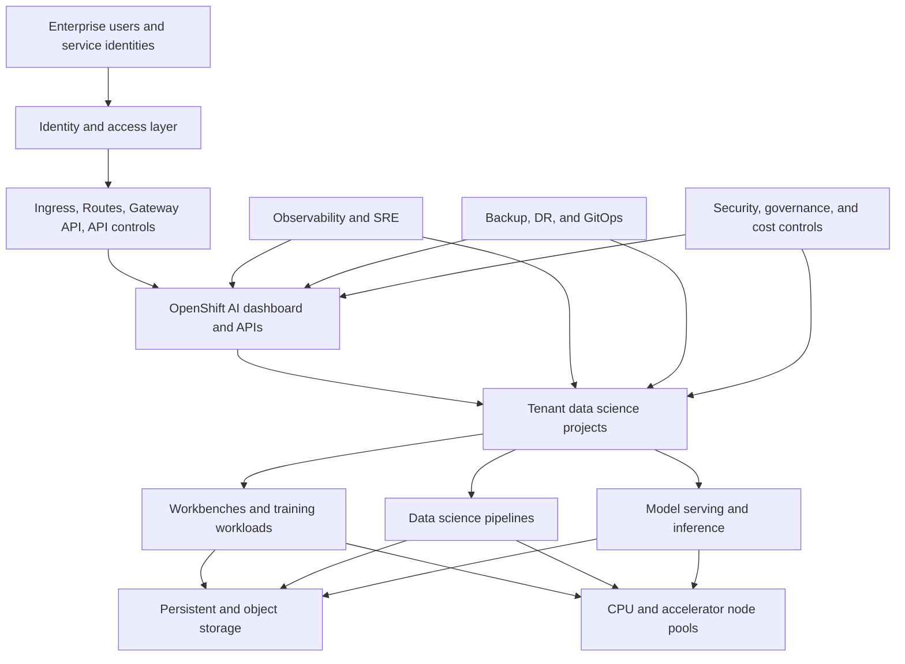

# 24. Disconnected environment design
> This guide is a production architecture workbook, implementation playbook, design-review checklist, and hands-on lab manual.
> Commands and YAML are reference examples. Replace placeholders and validate APIs, support status, and component versions in the exact installed environment.
## 1. Executive objective
This topic focuses on operating OpenShift AI without direct internet access by mirroring content, managing trust, updates, dependencies, and supply-chain evidence.
The goal is not only to deploy components, but to create an operable service with explicit ownership, measurable objectives, controlled change, and tested recovery.
A senior architect should be able to defend every major decision using business requirements, failure analysis, workload evidence, cost data, and support constraints.
### 1.1 Outcomes
- Produce a reviewed mirror architecture.
- Produce a reviewed ImageSetConfiguration.
- Produce a reviewed offline update runbook.
- Produce a reviewed content manifest.
- Establish Day-0, Day-1, and Day-2 responsibilities.
- Define acceptance criteria before implementation begins.
- Store the design, manifests, tests, and evidence in version control.
### 1.2 Scope boundaries
- In scope: OpenShift AI platform services, dependent OpenShift services, tenant integration, operations, security, reliability, and economics.
- Out of scope unless explicitly added: business model accuracy, application source code, source-data quality remediation, and enterprise processes outside the platform boundary.
- External dependencies must still be documented because they affect end-to-end availability and recovery.
## 2. Version and support baseline
- Use the Red Hat supported-configuration matrix as the final authority for compatible OpenShift AI, OpenShift Container Platform, accelerator, storage, and model-serving combinations.
- OpenShift AI components are managed through the Red Hat OpenShift AI Operator and DataScienceCluster-related custom resources.
- OpenShift AI 3.5 includes a centralized observability option using OpenTelemetry, Prometheus, and Tempo; enable it deliberately and size its retention.
- OpenShift AI 3.5 supports centralized authentication patterns for external OIDC in applicable OpenShift versions; keep authentication and authorization as separate design concerns.
- NVIDIA enablement depends on Node Feature Discovery and the NVIDIA GPU Operator lifecycle; accelerator support and responsibility must be documented.
- OADP protects Kubernetes applications and persistent data, but application-consistent recovery may also require database-native and object-store-native procedures.
- Disconnected operation requires a complete mirrored content supply chain, not only the OpenShift release payload.
## 3. Architecture principles
### Principle P-01: Supportability Before Novelty
- Meaning: apply **supportability before novelty** to every decision in Disconnected environment design.
- Design test: identify how the proposed architecture proves supportability before novelty.
- Evidence: capture the decision, owner, date, assumptions, alternatives, and validation result.
- Anti-pattern: accepting a component because it is easy to deploy without proving operational fitness.
- Review cadence: reassess after major version changes, incident lessons, or material workload growth.
### Principle P-02: Declarative Configuration
- Meaning: apply **declarative configuration** to every decision in Disconnected environment design.
- Design test: identify how the proposed architecture proves declarative configuration.
- Evidence: capture the decision, owner, date, assumptions, alternatives, and validation result.
- Anti-pattern: accepting a component because it is easy to deploy without proving operational fitness.
- Review cadence: reassess after major version changes, incident lessons, or material workload growth.
### Principle P-03: Separation Of Platform And Tenant Duties
- Meaning: apply **separation of platform and tenant duties** to every decision in Disconnected environment design.
- Design test: identify how the proposed architecture proves separation of platform and tenant duties.
- Evidence: capture the decision, owner, date, assumptions, alternatives, and validation result.
- Anti-pattern: accepting a component because it is easy to deploy without proving operational fitness.
- Review cadence: reassess after major version changes, incident lessons, or material workload growth.
### Principle P-04: Least Privilege
- Meaning: apply **least privilege** to every decision in Disconnected environment design.
- Design test: identify how the proposed architecture proves least privilege.
- Evidence: capture the decision, owner, date, assumptions, alternatives, and validation result.
- Anti-pattern: accepting a component because it is easy to deploy without proving operational fitness.
- Review cadence: reassess after major version changes, incident lessons, or material workload growth.
### Principle P-05: Default-Deny Isolation
- Meaning: apply **default-deny isolation** to every decision in Disconnected environment design.
- Design test: identify how the proposed architecture proves default-deny isolation.
- Evidence: capture the decision, owner, date, assumptions, alternatives, and validation result.
- Anti-pattern: accepting a component because it is easy to deploy without proving operational fitness.
- Review cadence: reassess after major version changes, incident lessons, or material workload growth.
### Principle P-06: Immutable Promotion
- Meaning: apply **immutable promotion** to every decision in Disconnected environment design.
- Design test: identify how the proposed architecture proves immutable promotion.
- Evidence: capture the decision, owner, date, assumptions, alternatives, and validation result.
- Anti-pattern: accepting a component because it is easy to deploy without proving operational fitness.
- Review cadence: reassess after major version changes, incident lessons, or material workload growth.
### Principle P-07: Measurable Service Objectives
- Meaning: apply **measurable service objectives** to every decision in Disconnected environment design.
- Design test: identify how the proposed architecture proves measurable service objectives.
- Evidence: capture the decision, owner, date, assumptions, alternatives, and validation result.
- Anti-pattern: accepting a component because it is easy to deploy without proving operational fitness.
- Review cadence: reassess after major version changes, incident lessons, or material workload growth.
### Principle P-08: Failure-Domain Awareness
- Meaning: apply **failure-domain awareness** to every decision in Disconnected environment design.
- Design test: identify how the proposed architecture proves failure-domain awareness.
- Evidence: capture the decision, owner, date, assumptions, alternatives, and validation result.
- Anti-pattern: accepting a component because it is easy to deploy without proving operational fitness.
- Review cadence: reassess after major version changes, incident lessons, or material workload growth.
### Principle P-09: Capacity Headroom
- Meaning: apply **capacity headroom** to every decision in Disconnected environment design.
- Design test: identify how the proposed architecture proves capacity headroom.
- Evidence: capture the decision, owner, date, assumptions, alternatives, and validation result.
- Anti-pattern: accepting a component because it is easy to deploy without proving operational fitness.
- Review cadence: reassess after major version changes, incident lessons, or material workload growth.
### Principle P-10: Cost Transparency
- Meaning: apply **cost transparency** to every decision in Disconnected environment design.
- Design test: identify how the proposed architecture proves cost transparency.
- Evidence: capture the decision, owner, date, assumptions, alternatives, and validation result.
- Anti-pattern: accepting a component because it is easy to deploy without proving operational fitness.
- Review cadence: reassess after major version changes, incident lessons, or material workload growth.
### Principle P-11: Data Locality
- Meaning: apply **data locality** to every decision in Disconnected environment design.
- Design test: identify how the proposed architecture proves data locality.
- Evidence: capture the decision, owner, date, assumptions, alternatives, and validation result.
- Anti-pattern: accepting a component because it is easy to deploy without proving operational fitness.
- Review cadence: reassess after major version changes, incident lessons, or material workload growth.
### Principle P-12: Portable Model Artifacts
- Meaning: apply **portable model artifacts** to every decision in Disconnected environment design.
- Design test: identify how the proposed architecture proves portable model artifacts.
- Evidence: capture the decision, owner, date, assumptions, alternatives, and validation result.
- Anti-pattern: accepting a component because it is easy to deploy without proving operational fitness.
- Review cadence: reassess after major version changes, incident lessons, or material workload growth.
### Principle P-13: Auditable Change
- Meaning: apply **auditable change** to every decision in Disconnected environment design.
- Design test: identify how the proposed architecture proves auditable change.
- Evidence: capture the decision, owner, date, assumptions, alternatives, and validation result.
- Anti-pattern: accepting a component because it is easy to deploy without proving operational fitness.
- Review cadence: reassess after major version changes, incident lessons, or material workload growth.
### Principle P-14: Version-Aware Automation
- Meaning: apply **version-aware automation** to every decision in Disconnected environment design.
- Design test: identify how the proposed architecture proves version-aware automation.
- Evidence: capture the decision, owner, date, assumptions, alternatives, and validation result.
- Anti-pattern: accepting a component because it is easy to deploy without proving operational fitness.
- Review cadence: reassess after major version changes, incident lessons, or material workload growth.
### Principle P-15: Tested Recovery
- Meaning: apply **tested recovery** to every decision in Disconnected environment design.
- Design test: identify how the proposed architecture proves tested recovery.
- Evidence: capture the decision, owner, date, assumptions, alternatives, and validation result.
- Anti-pattern: accepting a component because it is easy to deploy without proving operational fitness.
- Review cadence: reassess after major version changes, incident lessons, or material workload growth.
### Principle P-16: Standardized Golden Paths
- Meaning: apply **standardized golden paths** to every decision in Disconnected environment design.
- Design test: identify how the proposed architecture proves standardized golden paths.
- Evidence: capture the decision, owner, date, assumptions, alternatives, and validation result.
- Anti-pattern: accepting a component because it is easy to deploy without proving operational fitness.
- Review cadence: reassess after major version changes, incident lessons, or material workload growth.
### Principle P-17: Policy As Code
- Meaning: apply **policy as code** to every decision in Disconnected environment design.
- Design test: identify how the proposed architecture proves policy as code.
- Evidence: capture the decision, owner, date, assumptions, alternatives, and validation result.
- Anti-pattern: accepting a component because it is easy to deploy without proving operational fitness.
- Review cadence: reassess after major version changes, incident lessons, or material workload growth.
### Principle P-18: Operational Simplicity
- Meaning: apply **operational simplicity** to every decision in Disconnected environment design.
- Design test: identify how the proposed architecture proves operational simplicity.
- Evidence: capture the decision, owner, date, assumptions, alternatives, and validation result.
- Anti-pattern: accepting a component because it is easy to deploy without proving operational fitness.
- Review cadence: reassess after major version changes, incident lessons, or material workload growth.
### Principle P-19: Secure Supply Chain
- Meaning: apply **secure supply chain** to every decision in Disconnected environment design.
- Design test: identify how the proposed architecture proves secure supply chain.
- Evidence: capture the decision, owner, date, assumptions, alternatives, and validation result.
- Anti-pattern: accepting a component because it is easy to deploy without proving operational fitness.
- Review cadence: reassess after major version changes, incident lessons, or material workload growth.
### Principle P-20: Observable Dependencies
- Meaning: apply **observable dependencies** to every decision in Disconnected environment design.
- Design test: identify how the proposed architecture proves observable dependencies.
- Evidence: capture the decision, owner, date, assumptions, alternatives, and validation result.
- Anti-pattern: accepting a component because it is easy to deploy without proving operational fitness.
- Review cadence: reassess after major version changes, incident lessons, or material workload growth.
## 4. Stakeholders and responsibility model
| Stakeholder | Accountable question | Required evidence |
|---|---|---|
| executive sponsor | What must executive sponsor decide or operate for Disconnected environment design? | Approved requirements, runbook, SLO, and named escalation path |
| platform product owner | What must platform product owner decide or operate for Disconnected environment design? | Approved requirements, runbook, SLO, and named escalation path |
| OpenShift platform engineering | What must OpenShift platform engineering decide or operate for Disconnected environment design? | Approved requirements, runbook, SLO, and named escalation path |
| OpenShift AI engineering | What must OpenShift AI engineering decide or operate for Disconnected environment design? | Approved requirements, runbook, SLO, and named escalation path |
| SRE/on-call | What must SRE/on-call decide or operate for Disconnected environment design? | Approved requirements, runbook, SLO, and named escalation path |
| security architecture | What must security architecture decide or operate for Disconnected environment design? | Approved requirements, runbook, SLO, and named escalation path |
| identity team | What must identity team decide or operate for Disconnected environment design? | Approved requirements, runbook, SLO, and named escalation path |
| network team | What must network team decide or operate for Disconnected environment design? | Approved requirements, runbook, SLO, and named escalation path |
| storage team | What must storage team decide or operate for Disconnected environment design? | Approved requirements, runbook, SLO, and named escalation path |
| data governance | What must data governance decide or operate for Disconnected environment design? | Approved requirements, runbook, SLO, and named escalation path |
| ML engineering | What must ML engineering decide or operate for Disconnected environment design? | Approved requirements, runbook, SLO, and named escalation path |
| data science | What must data science decide or operate for Disconnected environment design? | Approved requirements, runbook, SLO, and named escalation path |
| application owner | What must application owner decide or operate for Disconnected environment design? | Approved requirements, runbook, SLO, and named escalation path |
| finance/FinOps | What must finance/FinOps decide or operate for Disconnected environment design? | Approved requirements, runbook, SLO, and named escalation path |
| risk and compliance | What must risk and compliance decide or operate for Disconnected environment design? | Approved requirements, runbook, SLO, and named escalation path |
| service desk | What must service desk decide or operate for Disconnected environment design? | Approved requirements, runbook, SLO, and named escalation path |
| vendor support | What must vendor support decide or operate for Disconnected environment design? | Approved requirements, runbook, SLO, and named escalation path |
## 5. Requirements discovery workbook
### Requirement R-001: Business Criticality
- Question: What is the measurable business criticality requirement for this platform?
- Capture: current value, forecast value, peak value, source of evidence, and confidence level.
- Owner: name the business and technical approvers.
- Architecture impact: identify affected components, cost, risk, and operational procedures.
- Acceptance: define a pass/fail test that can be executed before production approval.
### Requirement R-002: Number Of Tenants
- Question: What is the measurable number of tenants requirement for this platform?
- Capture: current value, forecast value, peak value, source of evidence, and confidence level.
- Owner: name the business and technical approvers.
- Architecture impact: identify affected components, cost, risk, and operational procedures.
- Acceptance: define a pass/fail test that can be executed before production approval.
### Requirement R-003: Number Of Users
- Question: What is the measurable number of users requirement for this platform?
- Capture: current value, forecast value, peak value, source of evidence, and confidence level.
- Owner: name the business and technical approvers.
- Architecture impact: identify affected components, cost, risk, and operational procedures.
- Acceptance: define a pass/fail test that can be executed before production approval.
### Requirement R-004: Interactive Workbench Concurrency
- Question: What is the measurable interactive workbench concurrency requirement for this platform?
- Capture: current value, forecast value, peak value, source of evidence, and confidence level.
- Owner: name the business and technical approvers.
- Architecture impact: identify affected components, cost, risk, and operational procedures.
- Acceptance: define a pass/fail test that can be executed before production approval.
### Requirement R-005: Daily Pipeline Runs
- Question: What is the measurable daily pipeline runs requirement for this platform?
- Capture: current value, forecast value, peak value, source of evidence, and confidence level.
- Owner: name the business and technical approvers.
- Architecture impact: identify affected components, cost, risk, and operational procedures.
- Acceptance: define a pass/fail test that can be executed before production approval.
### Requirement R-006: Training Job Concurrency
- Question: What is the measurable training job concurrency requirement for this platform?
- Capture: current value, forecast value, peak value, source of evidence, and confidence level.
- Owner: name the business and technical approvers.
- Architecture impact: identify affected components, cost, risk, and operational procedures.
- Acceptance: define a pass/fail test that can be executed before production approval.
### Requirement R-007: Model Count
- Question: What is the measurable model count requirement for this platform?
- Capture: current value, forecast value, peak value, source of evidence, and confidence level.
- Owner: name the business and technical approvers.
- Architecture impact: identify affected components, cost, risk, and operational procedures.
- Acceptance: define a pass/fail test that can be executed before production approval.
### Requirement R-008: Model Deployment Frequency
- Question: What is the measurable model deployment frequency requirement for this platform?
- Capture: current value, forecast value, peak value, source of evidence, and confidence level.
- Owner: name the business and technical approvers.
- Architecture impact: identify affected components, cost, risk, and operational procedures.
- Acceptance: define a pass/fail test that can be executed before production approval.
### Requirement R-009: Online Inference Request Rate
- Question: What is the measurable online inference request rate requirement for this platform?
- Capture: current value, forecast value, peak value, source of evidence, and confidence level.
- Owner: name the business and technical approvers.
- Architecture impact: identify affected components, cost, risk, and operational procedures.
- Acceptance: define a pass/fail test that can be executed before production approval.
### Requirement R-010: Batch Inference Volume
- Question: What is the measurable batch inference volume requirement for this platform?
- Capture: current value, forecast value, peak value, source of evidence, and confidence level.
- Owner: name the business and technical approvers.
- Architecture impact: identify affected components, cost, risk, and operational procedures.
- Acceptance: define a pass/fail test that can be executed before production approval.
### Requirement R-011: Llm Context Length
- Question: What is the measurable LLM context length requirement for this platform?
- Capture: current value, forecast value, peak value, source of evidence, and confidence level.
- Owner: name the business and technical approvers.
- Architecture impact: identify affected components, cost, risk, and operational procedures.
- Acceptance: define a pass/fail test that can be executed before production approval.
### Requirement R-012: Llm Token Throughput
- Question: What is the measurable LLM token throughput requirement for this platform?
- Capture: current value, forecast value, peak value, source of evidence, and confidence level.
- Owner: name the business and technical approvers.
- Architecture impact: identify affected components, cost, risk, and operational procedures.
- Acceptance: define a pass/fail test that can be executed before production approval.
### Requirement R-013: Accelerator Type
- Question: What is the measurable accelerator type requirement for this platform?
- Capture: current value, forecast value, peak value, source of evidence, and confidence level.
- Owner: name the business and technical approvers.
- Architecture impact: identify affected components, cost, risk, and operational procedures.
- Acceptance: define a pass/fail test that can be executed before production approval.
### Requirement R-014: Dataset Size
- Question: What is the measurable dataset size requirement for this platform?
- Capture: current value, forecast value, peak value, source of evidence, and confidence level.
- Owner: name the business and technical approvers.
- Architecture impact: identify affected components, cost, risk, and operational procedures.
- Acceptance: define a pass/fail test that can be executed before production approval.
### Requirement R-015: Model Artifact Size
- Question: What is the measurable model artifact size requirement for this platform?
- Capture: current value, forecast value, peak value, source of evidence, and confidence level.
- Owner: name the business and technical approvers.
- Architecture impact: identify affected components, cost, risk, and operational procedures.
- Acceptance: define a pass/fail test that can be executed before production approval.
### Requirement R-016: Checkpoint Frequency
- Question: What is the measurable checkpoint frequency requirement for this platform?
- Capture: current value, forecast value, peak value, source of evidence, and confidence level.
- Owner: name the business and technical approvers.
- Architecture impact: identify affected components, cost, risk, and operational procedures.
- Acceptance: define a pass/fail test that can be executed before production approval.
### Requirement R-017: Data Classification
- Question: What is the measurable data classification requirement for this platform?
- Capture: current value, forecast value, peak value, source of evidence, and confidence level.
- Owner: name the business and technical approvers.
- Architecture impact: identify affected components, cost, risk, and operational procedures.
- Acceptance: define a pass/fail test that can be executed before production approval.
### Requirement R-018: Data Residency
- Question: What is the measurable data residency requirement for this platform?
- Capture: current value, forecast value, peak value, source of evidence, and confidence level.
- Owner: name the business and technical approvers.
- Architecture impact: identify affected components, cost, risk, and operational procedures.
- Acceptance: define a pass/fail test that can be executed before production approval.
### Requirement R-019: External Connectivity
- Question: What is the measurable external connectivity requirement for this platform?
- Capture: current value, forecast value, peak value, source of evidence, and confidence level.
- Owner: name the business and technical approvers.
- Architecture impact: identify affected components, cost, risk, and operational procedures.
- Acceptance: define a pass/fail test that can be executed before production approval.
### Requirement R-020: Identity Source
- Question: What is the measurable identity source requirement for this platform?
- Capture: current value, forecast value, peak value, source of evidence, and confidence level.
- Owner: name the business and technical approvers.
- Architecture impact: identify affected components, cost, risk, and operational procedures.
- Acceptance: define a pass/fail test that can be executed before production approval.
### Requirement R-021: Mfa Requirement
- Question: What is the measurable MFA requirement requirement for this platform?
- Capture: current value, forecast value, peak value, source of evidence, and confidence level.
- Owner: name the business and technical approvers.
- Architecture impact: identify affected components, cost, risk, and operational procedures.
- Acceptance: define a pass/fail test that can be executed before production approval.
### Requirement R-022: Audit Retention
- Question: What is the measurable audit retention requirement for this platform?
- Capture: current value, forecast value, peak value, source of evidence, and confidence level.
- Owner: name the business and technical approvers.
- Architecture impact: identify affected components, cost, risk, and operational procedures.
- Acceptance: define a pass/fail test that can be executed before production approval.
### Requirement R-023: Backup Rpo
- Question: What is the measurable backup RPO requirement for this platform?
- Capture: current value, forecast value, peak value, source of evidence, and confidence level.
- Owner: name the business and technical approvers.
- Architecture impact: identify affected components, cost, risk, and operational procedures.
- Acceptance: define a pass/fail test that can be executed before production approval.
### Requirement R-024: Restore Rto
- Question: What is the measurable restore RTO requirement for this platform?
- Capture: current value, forecast value, peak value, source of evidence, and confidence level.
- Owner: name the business and technical approvers.
- Architecture impact: identify affected components, cost, risk, and operational procedures.
- Acceptance: define a pass/fail test that can be executed before production approval.
### Requirement R-025: Dr Rpo
- Question: What is the measurable DR RPO requirement for this platform?
- Capture: current value, forecast value, peak value, source of evidence, and confidence level.
- Owner: name the business and technical approvers.
- Architecture impact: identify affected components, cost, risk, and operational procedures.
- Acceptance: define a pass/fail test that can be executed before production approval.
### Requirement R-026: Dr Rto
- Question: What is the measurable DR RTO requirement for this platform?
- Capture: current value, forecast value, peak value, source of evidence, and confidence level.
- Owner: name the business and technical approvers.
- Architecture impact: identify affected components, cost, risk, and operational procedures.
- Acceptance: define a pass/fail test that can be executed before production approval.
### Requirement R-027: Maintenance Window
- Question: What is the measurable maintenance window requirement for this platform?
- Capture: current value, forecast value, peak value, source of evidence, and confidence level.
- Owner: name the business and technical approvers.
- Architecture impact: identify affected components, cost, risk, and operational procedures.
- Acceptance: define a pass/fail test that can be executed before production approval.
### Requirement R-028: Upgrade Frequency
- Question: What is the measurable upgrade frequency requirement for this platform?
- Capture: current value, forecast value, peak value, source of evidence, and confidence level.
- Owner: name the business and technical approvers.
- Architecture impact: identify affected components, cost, risk, and operational procedures.
- Acceptance: define a pass/fail test that can be executed before production approval.
### Requirement R-029: Growth Rate
- Question: What is the measurable growth rate requirement for this platform?
- Capture: current value, forecast value, peak value, source of evidence, and confidence level.
- Owner: name the business and technical approvers.
- Architecture impact: identify affected components, cost, risk, and operational procedures.
- Acceptance: define a pass/fail test that can be executed before production approval.
### Requirement R-030: Budget Envelope
- Question: What is the measurable budget envelope requirement for this platform?
- Capture: current value, forecast value, peak value, source of evidence, and confidence level.
- Owner: name the business and technical approvers.
- Architecture impact: identify affected components, cost, risk, and operational procedures.
- Acceptance: define a pass/fail test that can be executed before production approval.
### Requirement R-031: Support Hours
- Question: What is the measurable support hours requirement for this platform?
- Capture: current value, forecast value, peak value, source of evidence, and confidence level.
- Owner: name the business and technical approvers.
- Architecture impact: identify affected components, cost, risk, and operational procedures.
- Acceptance: define a pass/fail test that can be executed before production approval.
### Requirement R-032: On-Call Coverage
- Question: What is the measurable on-call coverage requirement for this platform?
- Capture: current value, forecast value, peak value, source of evidence, and confidence level.
- Owner: name the business and technical approvers.
- Architecture impact: identify affected components, cost, risk, and operational procedures.
- Acceptance: define a pass/fail test that can be executed before production approval.
### Requirement R-033: Compliance Scope
- Question: What is the measurable compliance scope requirement for this platform?
- Capture: current value, forecast value, peak value, source of evidence, and confidence level.
- Owner: name the business and technical approvers.
- Architecture impact: identify affected components, cost, risk, and operational procedures.
- Acceptance: define a pass/fail test that can be executed before production approval.
### Requirement R-034: Encryption Requirement
- Question: What is the measurable encryption requirement requirement for this platform?
- Capture: current value, forecast value, peak value, source of evidence, and confidence level.
- Owner: name the business and technical approvers.
- Architecture impact: identify affected components, cost, risk, and operational procedures.
- Acceptance: define a pass/fail test that can be executed before production approval.
### Requirement R-035: Key-Management Model
- Question: What is the measurable key-management model requirement for this platform?
- Capture: current value, forecast value, peak value, source of evidence, and confidence level.
- Owner: name the business and technical approvers.
- Architecture impact: identify affected components, cost, risk, and operational procedures.
- Acceptance: define a pass/fail test that can be executed before production approval.
### Requirement R-036: Network Latency Target
- Question: What is the measurable network latency target requirement for this platform?
- Capture: current value, forecast value, peak value, source of evidence, and confidence level.
- Owner: name the business and technical approvers.
- Architecture impact: identify affected components, cost, risk, and operational procedures.
- Acceptance: define a pass/fail test that can be executed before production approval.
### Requirement R-037: Storage Latency Target
- Question: What is the measurable storage latency target requirement for this platform?
- Capture: current value, forecast value, peak value, source of evidence, and confidence level.
- Owner: name the business and technical approvers.
- Architecture impact: identify affected components, cost, risk, and operational procedures.
- Acceptance: define a pass/fail test that can be executed before production approval.
### Requirement R-038: Availability Target
- Question: What is the measurable availability target requirement for this platform?
- Capture: current value, forecast value, peak value, source of evidence, and confidence level.
- Owner: name the business and technical approvers.
- Architecture impact: identify affected components, cost, risk, and operational procedures.
- Acceptance: define a pass/fail test that can be executed before production approval.
### Requirement R-039: Change Approval
- Question: What is the measurable change approval requirement for this platform?
- Capture: current value, forecast value, peak value, source of evidence, and confidence level.
- Owner: name the business and technical approvers.
- Architecture impact: identify affected components, cost, risk, and operational procedures.
- Acceptance: define a pass/fail test that can be executed before production approval.
### Requirement R-040: Platform Exit Requirement
- Question: What is the measurable platform exit requirement requirement for this platform?
- Capture: current value, forecast value, peak value, source of evidence, and confidence level.
- Owner: name the business and technical approvers.
- Architecture impact: identify affected components, cost, risk, and operational procedures.
- Acceptance: define a pass/fail test that can be executed before production approval.
## 6. Reference architecture

### 6.1 Topic-specific component map
#### Component 01: connected mirror host
- Role in this design: connected mirror host contributes directly to operating OpenShift AI without direct internet access by mirroring content, managing trust, updates, dependencies, and supply-chain evidence.
- Inputs: configuration, identity, network, storage, images, credentials, and policy.
- Outputs: a supported service endpoint, workload capability, metric stream, or recovery artifact.
- Availability: document replicas, quorum, failure domains, and external dependencies.
- Capacity: define saturation signals, scaling unit, lead time, and reserved headroom.
- Security: define trust boundary, service account, secret source, network flows, and audit events.
- Operations: define owner, SLO, alerts, logs, runbook, backup, upgrade, and support path.
- Validation: prove normal operation, degraded operation, and recovery.
- Cost: map direct and shared costs to the service or tenant.
- Exit criteria: define how the component can be replaced or retired without losing required data.
#### Component 02: mirror registry
- Role in this design: mirror registry contributes directly to operating OpenShift AI without direct internet access by mirroring content, managing trust, updates, dependencies, and supply-chain evidence.
- Inputs: configuration, identity, network, storage, images, credentials, and policy.
- Outputs: a supported service endpoint, workload capability, metric stream, or recovery artifact.
- Availability: document replicas, quorum, failure domains, and external dependencies.
- Capacity: define saturation signals, scaling unit, lead time, and reserved headroom.
- Security: define trust boundary, service account, secret source, network flows, and audit events.
- Operations: define owner, SLO, alerts, logs, runbook, backup, upgrade, and support path.
- Validation: prove normal operation, degraded operation, and recovery.
- Cost: map direct and shared costs to the service or tenant.
- Exit criteria: define how the component can be replaced or retired without losing required data.
#### Component 03: oc-mirror v2
- Role in this design: oc-mirror v2 contributes directly to operating OpenShift AI without direct internet access by mirroring content, managing trust, updates, dependencies, and supply-chain evidence.
- Inputs: configuration, identity, network, storage, images, credentials, and policy.
- Outputs: a supported service endpoint, workload capability, metric stream, or recovery artifact.
- Availability: document replicas, quorum, failure domains, and external dependencies.
- Capacity: define saturation signals, scaling unit, lead time, and reserved headroom.
- Security: define trust boundary, service account, secret source, network flows, and audit events.
- Operations: define owner, SLO, alerts, logs, runbook, backup, upgrade, and support path.
- Validation: prove normal operation, degraded operation, and recovery.
- Cost: map direct and shared costs to the service or tenant.
- Exit criteria: define how the component can be replaced or retired without losing required data.
#### Component 04: release payload mirror
- Role in this design: release payload mirror contributes directly to operating OpenShift AI without direct internet access by mirroring content, managing trust, updates, dependencies, and supply-chain evidence.
- Inputs: configuration, identity, network, storage, images, credentials, and policy.
- Outputs: a supported service endpoint, workload capability, metric stream, or recovery artifact.
- Availability: document replicas, quorum, failure domains, and external dependencies.
- Capacity: define saturation signals, scaling unit, lead time, and reserved headroom.
- Security: define trust boundary, service account, secret source, network flows, and audit events.
- Operations: define owner, SLO, alerts, logs, runbook, backup, upgrade, and support path.
- Validation: prove normal operation, degraded operation, and recovery.
- Cost: map direct and shared costs to the service or tenant.
- Exit criteria: define how the component can be replaced or retired without losing required data.
#### Component 05: operator catalogs
- Role in this design: operator catalogs contributes directly to operating OpenShift AI without direct internet access by mirroring content, managing trust, updates, dependencies, and supply-chain evidence.
- Inputs: configuration, identity, network, storage, images, credentials, and policy.
- Outputs: a supported service endpoint, workload capability, metric stream, or recovery artifact.
- Availability: document replicas, quorum, failure domains, and external dependencies.
- Capacity: define saturation signals, scaling unit, lead time, and reserved headroom.
- Security: define trust boundary, service account, secret source, network flows, and audit events.
- Operations: define owner, SLO, alerts, logs, runbook, backup, upgrade, and support path.
- Validation: prove normal operation, degraded operation, and recovery.
- Cost: map direct and shared costs to the service or tenant.
- Exit criteria: define how the component can be replaced or retired without losing required data.
#### Component 06: OpenShift AI images
- Role in this design: OpenShift AI images contributes directly to operating OpenShift AI without direct internet access by mirroring content, managing trust, updates, dependencies, and supply-chain evidence.
- Inputs: configuration, identity, network, storage, images, credentials, and policy.
- Outputs: a supported service endpoint, workload capability, metric stream, or recovery artifact.
- Availability: document replicas, quorum, failure domains, and external dependencies.
- Capacity: define saturation signals, scaling unit, lead time, and reserved headroom.
- Security: define trust boundary, service account, secret source, network flows, and audit events.
- Operations: define owner, SLO, alerts, logs, runbook, backup, upgrade, and support path.
- Validation: prove normal operation, degraded operation, and recovery.
- Cost: map direct and shared costs to the service or tenant.
- Exit criteria: define how the component can be replaced or retired without losing required data.
#### Component 07: GPU operator images
- Role in this design: GPU operator images contributes directly to operating OpenShift AI without direct internet access by mirroring content, managing trust, updates, dependencies, and supply-chain evidence.
- Inputs: configuration, identity, network, storage, images, credentials, and policy.
- Outputs: a supported service endpoint, workload capability, metric stream, or recovery artifact.
- Availability: document replicas, quorum, failure domains, and external dependencies.
- Capacity: define saturation signals, scaling unit, lead time, and reserved headroom.
- Security: define trust boundary, service account, secret source, network flows, and audit events.
- Operations: define owner, SLO, alerts, logs, runbook, backup, upgrade, and support path.
- Validation: prove normal operation, degraded operation, and recovery.
- Cost: map direct and shared costs to the service or tenant.
- Exit criteria: define how the component can be replaced or retired without losing required data.
#### Component 08: model artifacts
- Role in this design: model artifacts contributes directly to operating OpenShift AI without direct internet access by mirroring content, managing trust, updates, dependencies, and supply-chain evidence.
- Inputs: configuration, identity, network, storage, images, credentials, and policy.
- Outputs: a supported service endpoint, workload capability, metric stream, or recovery artifact.
- Availability: document replicas, quorum, failure domains, and external dependencies.
- Capacity: define saturation signals, scaling unit, lead time, and reserved headroom.
- Security: define trust boundary, service account, secret source, network flows, and audit events.
- Operations: define owner, SLO, alerts, logs, runbook, backup, upgrade, and support path.
- Validation: prove normal operation, degraded operation, and recovery.
- Cost: map direct and shared costs to the service or tenant.
- Exit criteria: define how the component can be replaced or retired without losing required data.
#### Component 09: internal certificates
- Role in this design: internal certificates contributes directly to operating OpenShift AI without direct internet access by mirroring content, managing trust, updates, dependencies, and supply-chain evidence.
- Inputs: configuration, identity, network, storage, images, credentials, and policy.
- Outputs: a supported service endpoint, workload capability, metric stream, or recovery artifact.
- Availability: document replicas, quorum, failure domains, and external dependencies.
- Capacity: define saturation signals, scaling unit, lead time, and reserved headroom.
- Security: define trust boundary, service account, secret source, network flows, and audit events.
- Operations: define owner, SLO, alerts, logs, runbook, backup, upgrade, and support path.
- Validation: prove normal operation, degraded operation, and recovery.
- Cost: map direct and shared costs to the service or tenant.
- Exit criteria: define how the component can be replaced or retired without losing required data.
#### Component 10: offline update workflow
- Role in this design: offline update workflow contributes directly to operating OpenShift AI without direct internet access by mirroring content, managing trust, updates, dependencies, and supply-chain evidence.
- Inputs: configuration, identity, network, storage, images, credentials, and policy.
- Outputs: a supported service endpoint, workload capability, metric stream, or recovery artifact.
- Availability: document replicas, quorum, failure domains, and external dependencies.
- Capacity: define saturation signals, scaling unit, lead time, and reserved headroom.
- Security: define trust boundary, service account, secret source, network flows, and audit events.
- Operations: define owner, SLO, alerts, logs, runbook, backup, upgrade, and support path.
- Validation: prove normal operation, degraded operation, and recovery.
- Cost: map direct and shared costs to the service or tenant.
- Exit criteria: define how the component can be replaced or retired without losing required data.
#### Component 11: OpenShift control plane
- Role in this design: OpenShift control plane contributes directly to operating OpenShift AI without direct internet access by mirroring content, managing trust, updates, dependencies, and supply-chain evidence.
- Inputs: configuration, identity, network, storage, images, credentials, and policy.
- Outputs: a supported service endpoint, workload capability, metric stream, or recovery artifact.
- Availability: document replicas, quorum, failure domains, and external dependencies.
- Capacity: define saturation signals, scaling unit, lead time, and reserved headroom.
- Security: define trust boundary, service account, secret source, network flows, and audit events.
- Operations: define owner, SLO, alerts, logs, runbook, backup, upgrade, and support path.
- Validation: prove normal operation, degraded operation, and recovery.
- Cost: map direct and shared costs to the service or tenant.
- Exit criteria: define how the component can be replaced or retired without losing required data.
#### Component 12: OpenShift AI Operator
- Role in this design: OpenShift AI Operator contributes directly to operating OpenShift AI without direct internet access by mirroring content, managing trust, updates, dependencies, and supply-chain evidence.
- Inputs: configuration, identity, network, storage, images, credentials, and policy.
- Outputs: a supported service endpoint, workload capability, metric stream, or recovery artifact.
- Availability: document replicas, quorum, failure domains, and external dependencies.
- Capacity: define saturation signals, scaling unit, lead time, and reserved headroom.
- Security: define trust boundary, service account, secret source, network flows, and audit events.
- Operations: define owner, SLO, alerts, logs, runbook, backup, upgrade, and support path.
- Validation: prove normal operation, degraded operation, and recovery.
- Cost: map direct and shared costs to the service or tenant.
- Exit criteria: define how the component can be replaced or retired without losing required data.
#### Component 13: DataScienceCluster and DSCI
- Role in this design: DataScienceCluster and DSCI contributes directly to operating OpenShift AI without direct internet access by mirroring content, managing trust, updates, dependencies, and supply-chain evidence.
- Inputs: configuration, identity, network, storage, images, credentials, and policy.
- Outputs: a supported service endpoint, workload capability, metric stream, or recovery artifact.
- Availability: document replicas, quorum, failure domains, and external dependencies.
- Capacity: define saturation signals, scaling unit, lead time, and reserved headroom.
- Security: define trust boundary, service account, secret source, network flows, and audit events.
- Operations: define owner, SLO, alerts, logs, runbook, backup, upgrade, and support path.
- Validation: prove normal operation, degraded operation, and recovery.
- Cost: map direct and shared costs to the service or tenant.
- Exit criteria: define how the component can be replaced or retired without losing required data.
#### Component 14: OpenShift AI dashboard
- Role in this design: OpenShift AI dashboard contributes directly to operating OpenShift AI without direct internet access by mirroring content, managing trust, updates, dependencies, and supply-chain evidence.
- Inputs: configuration, identity, network, storage, images, credentials, and policy.
- Outputs: a supported service endpoint, workload capability, metric stream, or recovery artifact.
- Availability: document replicas, quorum, failure domains, and external dependencies.
- Capacity: define saturation signals, scaling unit, lead time, and reserved headroom.
- Security: define trust boundary, service account, secret source, network flows, and audit events.
- Operations: define owner, SLO, alerts, logs, runbook, backup, upgrade, and support path.
- Validation: prove normal operation, degraded operation, and recovery.
- Cost: map direct and shared costs to the service or tenant.
- Exit criteria: define how the component can be replaced or retired without losing required data.
#### Component 15: data science projects
- Role in this design: data science projects contributes directly to operating OpenShift AI without direct internet access by mirroring content, managing trust, updates, dependencies, and supply-chain evidence.
- Inputs: configuration, identity, network, storage, images, credentials, and policy.
- Outputs: a supported service endpoint, workload capability, metric stream, or recovery artifact.
- Availability: document replicas, quorum, failure domains, and external dependencies.
- Capacity: define saturation signals, scaling unit, lead time, and reserved headroom.
- Security: define trust boundary, service account, secret source, network flows, and audit events.
- Operations: define owner, SLO, alerts, logs, runbook, backup, upgrade, and support path.
- Validation: prove normal operation, degraded operation, and recovery.
- Cost: map direct and shared costs to the service or tenant.
- Exit criteria: define how the component can be replaced or retired without losing required data.
#### Component 16: workbenches
- Role in this design: workbenches contributes directly to operating OpenShift AI without direct internet access by mirroring content, managing trust, updates, dependencies, and supply-chain evidence.
- Inputs: configuration, identity, network, storage, images, credentials, and policy.
- Outputs: a supported service endpoint, workload capability, metric stream, or recovery artifact.
- Availability: document replicas, quorum, failure domains, and external dependencies.
- Capacity: define saturation signals, scaling unit, lead time, and reserved headroom.
- Security: define trust boundary, service account, secret source, network flows, and audit events.
- Operations: define owner, SLO, alerts, logs, runbook, backup, upgrade, and support path.
- Validation: prove normal operation, degraded operation, and recovery.
- Cost: map direct and shared costs to the service or tenant.
- Exit criteria: define how the component can be replaced or retired without losing required data.
#### Component 17: data science pipelines
- Role in this design: data science pipelines contributes directly to operating OpenShift AI without direct internet access by mirroring content, managing trust, updates, dependencies, and supply-chain evidence.
- Inputs: configuration, identity, network, storage, images, credentials, and policy.
- Outputs: a supported service endpoint, workload capability, metric stream, or recovery artifact.
- Availability: document replicas, quorum, failure domains, and external dependencies.
- Capacity: define saturation signals, scaling unit, lead time, and reserved headroom.
- Security: define trust boundary, service account, secret source, network flows, and audit events.
- Operations: define owner, SLO, alerts, logs, runbook, backup, upgrade, and support path.
- Validation: prove normal operation, degraded operation, and recovery.
- Cost: map direct and shared costs to the service or tenant.
- Exit criteria: define how the component can be replaced or retired without losing required data.
#### Component 18: model registry
- Role in this design: model registry contributes directly to operating OpenShift AI without direct internet access by mirroring content, managing trust, updates, dependencies, and supply-chain evidence.
- Inputs: configuration, identity, network, storage, images, credentials, and policy.
- Outputs: a supported service endpoint, workload capability, metric stream, or recovery artifact.
- Availability: document replicas, quorum, failure domains, and external dependencies.
- Capacity: define saturation signals, scaling unit, lead time, and reserved headroom.
- Security: define trust boundary, service account, secret source, network flows, and audit events.
- Operations: define owner, SLO, alerts, logs, runbook, backup, upgrade, and support path.
- Validation: prove normal operation, degraded operation, and recovery.
- Cost: map direct and shared costs to the service or tenant.
- Exit criteria: define how the component can be replaced or retired without losing required data.
## 7. Architecture decision records
### ADR-001: Decide disconnection level
- Context: Disconnected environment design requires an explicit decision for **disconnection level**.
- Decision question: which option best supports operating OpenShift AI without direct internet access by mirroring content, managing trust, updates, dependencies, and supply-chain evidence?
- Option A: centralized, standardized, and platform-owned.
- Option B: tenant-dedicated or environment-dedicated.
- Option C: federated with common policy and local execution.
- Evaluation criteria: supportability, availability, security, latency, cost, scale, and operational skill.
- Required evidence: benchmark, failure test, cost estimate, and stakeholder approval.
- Consequences: document positive outcomes, trade-offs, new dependencies, and technical debt.
- Reversal plan: identify data migration, configuration migration, and service interruption.
- Review trigger: version change, demand threshold, incident, or regulatory change.
- Status: Proposed / Accepted / Superseded / Rejected.
### ADR-002: Decide mirror topology
- Context: Disconnected environment design requires an explicit decision for **mirror topology**.
- Decision question: which option best supports operating OpenShift AI without direct internet access by mirroring content, managing trust, updates, dependencies, and supply-chain evidence?
- Option A: centralized, standardized, and platform-owned.
- Option B: tenant-dedicated or environment-dedicated.
- Option C: federated with common policy and local execution.
- Evaluation criteria: supportability, availability, security, latency, cost, scale, and operational skill.
- Required evidence: benchmark, failure test, cost estimate, and stakeholder approval.
- Consequences: document positive outcomes, trade-offs, new dependencies, and technical debt.
- Reversal plan: identify data migration, configuration migration, and service interruption.
- Review trigger: version change, demand threshold, incident, or regulatory change.
- Status: Proposed / Accepted / Superseded / Rejected.
### ADR-003: Decide content scope
- Context: Disconnected environment design requires an explicit decision for **content scope**.
- Decision question: which option best supports operating OpenShift AI without direct internet access by mirroring content, managing trust, updates, dependencies, and supply-chain evidence?
- Option A: centralized, standardized, and platform-owned.
- Option B: tenant-dedicated or environment-dedicated.
- Option C: federated with common policy and local execution.
- Evaluation criteria: supportability, availability, security, latency, cost, scale, and operational skill.
- Required evidence: benchmark, failure test, cost estimate, and stakeholder approval.
- Consequences: document positive outcomes, trade-offs, new dependencies, and technical debt.
- Reversal plan: identify data migration, configuration migration, and service interruption.
- Review trigger: version change, demand threshold, incident, or regulatory change.
- Status: Proposed / Accepted / Superseded / Rejected.
### ADR-004: Decide transfer method
- Context: Disconnected environment design requires an explicit decision for **transfer method**.
- Decision question: which option best supports operating OpenShift AI without direct internet access by mirroring content, managing trust, updates, dependencies, and supply-chain evidence?
- Option A: centralized, standardized, and platform-owned.
- Option B: tenant-dedicated or environment-dedicated.
- Option C: federated with common policy and local execution.
- Evaluation criteria: supportability, availability, security, latency, cost, scale, and operational skill.
- Required evidence: benchmark, failure test, cost estimate, and stakeholder approval.
- Consequences: document positive outcomes, trade-offs, new dependencies, and technical debt.
- Reversal plan: identify data migration, configuration migration, and service interruption.
- Review trigger: version change, demand threshold, incident, or regulatory change.
- Status: Proposed / Accepted / Superseded / Rejected.
### ADR-005: Decide registry capacity
- Context: Disconnected environment design requires an explicit decision for **registry capacity**.
- Decision question: which option best supports operating OpenShift AI without direct internet access by mirroring content, managing trust, updates, dependencies, and supply-chain evidence?
- Option A: centralized, standardized, and platform-owned.
- Option B: tenant-dedicated or environment-dedicated.
- Option C: federated with common policy and local execution.
- Evaluation criteria: supportability, availability, security, latency, cost, scale, and operational skill.
- Required evidence: benchmark, failure test, cost estimate, and stakeholder approval.
- Consequences: document positive outcomes, trade-offs, new dependencies, and technical debt.
- Reversal plan: identify data migration, configuration migration, and service interruption.
- Review trigger: version change, demand threshold, incident, or regulatory change.
- Status: Proposed / Accepted / Superseded / Rejected.
### ADR-006: Decide certificate trust
- Context: Disconnected environment design requires an explicit decision for **certificate trust**.
- Decision question: which option best supports operating OpenShift AI without direct internet access by mirroring content, managing trust, updates, dependencies, and supply-chain evidence?
- Option A: centralized, standardized, and platform-owned.
- Option B: tenant-dedicated or environment-dedicated.
- Option C: federated with common policy and local execution.
- Evaluation criteria: supportability, availability, security, latency, cost, scale, and operational skill.
- Required evidence: benchmark, failure test, cost estimate, and stakeholder approval.
- Consequences: document positive outcomes, trade-offs, new dependencies, and technical debt.
- Reversal plan: identify data migration, configuration migration, and service interruption.
- Review trigger: version change, demand threshold, incident, or regulatory change.
- Status: Proposed / Accepted / Superseded / Rejected.
### ADR-007: Decide catalog strategy
- Context: Disconnected environment design requires an explicit decision for **catalog strategy**.
- Decision question: which option best supports operating OpenShift AI without direct internet access by mirroring content, managing trust, updates, dependencies, and supply-chain evidence?
- Option A: centralized, standardized, and platform-owned.
- Option B: tenant-dedicated or environment-dedicated.
- Option C: federated with common policy and local execution.
- Evaluation criteria: supportability, availability, security, latency, cost, scale, and operational skill.
- Required evidence: benchmark, failure test, cost estimate, and stakeholder approval.
- Consequences: document positive outcomes, trade-offs, new dependencies, and technical debt.
- Reversal plan: identify data migration, configuration migration, and service interruption.
- Review trigger: version change, demand threshold, incident, or regulatory change.
- Status: Proposed / Accepted / Superseded / Rejected.
### ADR-008: Decide update cadence
- Context: Disconnected environment design requires an explicit decision for **update cadence**.
- Decision question: which option best supports operating OpenShift AI without direct internet access by mirroring content, managing trust, updates, dependencies, and supply-chain evidence?
- Option A: centralized, standardized, and platform-owned.
- Option B: tenant-dedicated or environment-dedicated.
- Option C: federated with common policy and local execution.
- Evaluation criteria: supportability, availability, security, latency, cost, scale, and operational skill.
- Required evidence: benchmark, failure test, cost estimate, and stakeholder approval.
- Consequences: document positive outcomes, trade-offs, new dependencies, and technical debt.
- Reversal plan: identify data migration, configuration migration, and service interruption.
- Review trigger: version change, demand threshold, incident, or regulatory change.
- Status: Proposed / Accepted / Superseded / Rejected.
### ADR-009: Decide model intake
- Context: Disconnected environment design requires an explicit decision for **model intake**.
- Decision question: which option best supports operating OpenShift AI without direct internet access by mirroring content, managing trust, updates, dependencies, and supply-chain evidence?
- Option A: centralized, standardized, and platform-owned.
- Option B: tenant-dedicated or environment-dedicated.
- Option C: federated with common policy and local execution.
- Evaluation criteria: supportability, availability, security, latency, cost, scale, and operational skill.
- Required evidence: benchmark, failure test, cost estimate, and stakeholder approval.
- Consequences: document positive outcomes, trade-offs, new dependencies, and technical debt.
- Reversal plan: identify data migration, configuration migration, and service interruption.
- Review trigger: version change, demand threshold, incident, or regulatory change.
- Status: Proposed / Accepted / Superseded / Rejected.
### ADR-010: Decide vulnerability feed
- Context: Disconnected environment design requires an explicit decision for **vulnerability feed**.
- Decision question: which option best supports operating OpenShift AI without direct internet access by mirroring content, managing trust, updates, dependencies, and supply-chain evidence?
- Option A: centralized, standardized, and platform-owned.
- Option B: tenant-dedicated or environment-dedicated.
- Option C: federated with common policy and local execution.
- Evaluation criteria: supportability, availability, security, latency, cost, scale, and operational skill.
- Required evidence: benchmark, failure test, cost estimate, and stakeholder approval.
- Consequences: document positive outcomes, trade-offs, new dependencies, and technical debt.
- Reversal plan: identify data migration, configuration migration, and service interruption.
- Review trigger: version change, demand threshold, incident, or regulatory change.
- Status: Proposed / Accepted / Superseded / Rejected.
### ADR-011: Decide availability
- Context: Disconnected environment design requires an explicit decision for **availability**.
- Decision question: which option best supports operating OpenShift AI without direct internet access by mirroring content, managing trust, updates, dependencies, and supply-chain evidence?
- Option A: centralized, standardized, and platform-owned.
- Option B: tenant-dedicated or environment-dedicated.
- Option C: federated with common policy and local execution.
- Evaluation criteria: supportability, availability, security, latency, cost, scale, and operational skill.
- Required evidence: benchmark, failure test, cost estimate, and stakeholder approval.
- Consequences: document positive outcomes, trade-offs, new dependencies, and technical debt.
- Reversal plan: identify data migration, configuration migration, and service interruption.
- Review trigger: version change, demand threshold, incident, or regulatory change.
- Status: Proposed / Accepted / Superseded / Rejected.
### ADR-012: Decide recoverability
- Context: Disconnected environment design requires an explicit decision for **recoverability**.
- Decision question: which option best supports operating OpenShift AI without direct internet access by mirroring content, managing trust, updates, dependencies, and supply-chain evidence?
- Option A: centralized, standardized, and platform-owned.
- Option B: tenant-dedicated or environment-dedicated.
- Option C: federated with common policy and local execution.
- Evaluation criteria: supportability, availability, security, latency, cost, scale, and operational skill.
- Required evidence: benchmark, failure test, cost estimate, and stakeholder approval.
- Consequences: document positive outcomes, trade-offs, new dependencies, and technical debt.
- Reversal plan: identify data migration, configuration migration, and service interruption.
- Review trigger: version change, demand threshold, incident, or regulatory change.
- Status: Proposed / Accepted / Superseded / Rejected.
### ADR-013: Decide performance
- Context: Disconnected environment design requires an explicit decision for **performance**.
- Decision question: which option best supports operating OpenShift AI without direct internet access by mirroring content, managing trust, updates, dependencies, and supply-chain evidence?
- Option A: centralized, standardized, and platform-owned.
- Option B: tenant-dedicated or environment-dedicated.
- Option C: federated with common policy and local execution.
- Evaluation criteria: supportability, availability, security, latency, cost, scale, and operational skill.
- Required evidence: benchmark, failure test, cost estimate, and stakeholder approval.
- Consequences: document positive outcomes, trade-offs, new dependencies, and technical debt.
- Reversal plan: identify data migration, configuration migration, and service interruption.
- Review trigger: version change, demand threshold, incident, or regulatory change.
- Status: Proposed / Accepted / Superseded / Rejected.
### ADR-014: Decide scalability
- Context: Disconnected environment design requires an explicit decision for **scalability**.
- Decision question: which option best supports operating OpenShift AI without direct internet access by mirroring content, managing trust, updates, dependencies, and supply-chain evidence?
- Option A: centralized, standardized, and platform-owned.
- Option B: tenant-dedicated or environment-dedicated.
- Option C: federated with common policy and local execution.
- Evaluation criteria: supportability, availability, security, latency, cost, scale, and operational skill.
- Required evidence: benchmark, failure test, cost estimate, and stakeholder approval.
- Consequences: document positive outcomes, trade-offs, new dependencies, and technical debt.
- Reversal plan: identify data migration, configuration migration, and service interruption.
- Review trigger: version change, demand threshold, incident, or regulatory change.
- Status: Proposed / Accepted / Superseded / Rejected.
### ADR-015: Decide security
- Context: Disconnected environment design requires an explicit decision for **security**.
- Decision question: which option best supports operating OpenShift AI without direct internet access by mirroring content, managing trust, updates, dependencies, and supply-chain evidence?
- Option A: centralized, standardized, and platform-owned.
- Option B: tenant-dedicated or environment-dedicated.
- Option C: federated with common policy and local execution.
- Evaluation criteria: supportability, availability, security, latency, cost, scale, and operational skill.
- Required evidence: benchmark, failure test, cost estimate, and stakeholder approval.
- Consequences: document positive outcomes, trade-offs, new dependencies, and technical debt.
- Reversal plan: identify data migration, configuration migration, and service interruption.
- Review trigger: version change, demand threshold, incident, or regulatory change.
- Status: Proposed / Accepted / Superseded / Rejected.
### ADR-016: Decide privacy
- Context: Disconnected environment design requires an explicit decision for **privacy**.
- Decision question: which option best supports operating OpenShift AI without direct internet access by mirroring content, managing trust, updates, dependencies, and supply-chain evidence?
- Option A: centralized, standardized, and platform-owned.
- Option B: tenant-dedicated or environment-dedicated.
- Option C: federated with common policy and local execution.
- Evaluation criteria: supportability, availability, security, latency, cost, scale, and operational skill.
- Required evidence: benchmark, failure test, cost estimate, and stakeholder approval.
- Consequences: document positive outcomes, trade-offs, new dependencies, and technical debt.
- Reversal plan: identify data migration, configuration migration, and service interruption.
- Review trigger: version change, demand threshold, incident, or regulatory change.
- Status: Proposed / Accepted / Superseded / Rejected.
### ADR-017: Decide auditability
- Context: Disconnected environment design requires an explicit decision for **auditability**.
- Decision question: which option best supports operating OpenShift AI without direct internet access by mirroring content, managing trust, updates, dependencies, and supply-chain evidence?
- Option A: centralized, standardized, and platform-owned.
- Option B: tenant-dedicated or environment-dedicated.
- Option C: federated with common policy and local execution.
- Evaluation criteria: supportability, availability, security, latency, cost, scale, and operational skill.
- Required evidence: benchmark, failure test, cost estimate, and stakeholder approval.
- Consequences: document positive outcomes, trade-offs, new dependencies, and technical debt.
- Reversal plan: identify data migration, configuration migration, and service interruption.
- Review trigger: version change, demand threshold, incident, or regulatory change.
- Status: Proposed / Accepted / Superseded / Rejected.
### ADR-018: Decide maintainability
- Context: Disconnected environment design requires an explicit decision for **maintainability**.
- Decision question: which option best supports operating OpenShift AI without direct internet access by mirroring content, managing trust, updates, dependencies, and supply-chain evidence?
- Option A: centralized, standardized, and platform-owned.
- Option B: tenant-dedicated or environment-dedicated.
- Option C: federated with common policy and local execution.
- Evaluation criteria: supportability, availability, security, latency, cost, scale, and operational skill.
- Required evidence: benchmark, failure test, cost estimate, and stakeholder approval.
- Consequences: document positive outcomes, trade-offs, new dependencies, and technical debt.
- Reversal plan: identify data migration, configuration migration, and service interruption.
- Review trigger: version change, demand threshold, incident, or regulatory change.
- Status: Proposed / Accepted / Superseded / Rejected.
### ADR-019: Decide supportability
- Context: Disconnected environment design requires an explicit decision for **supportability**.
- Decision question: which option best supports operating OpenShift AI without direct internet access by mirroring content, managing trust, updates, dependencies, and supply-chain evidence?
- Option A: centralized, standardized, and platform-owned.
- Option B: tenant-dedicated or environment-dedicated.
- Option C: federated with common policy and local execution.
- Evaluation criteria: supportability, availability, security, latency, cost, scale, and operational skill.
- Required evidence: benchmark, failure test, cost estimate, and stakeholder approval.
- Consequences: document positive outcomes, trade-offs, new dependencies, and technical debt.
- Reversal plan: identify data migration, configuration migration, and service interruption.
- Review trigger: version change, demand threshold, incident, or regulatory change.
- Status: Proposed / Accepted / Superseded / Rejected.
### ADR-020: Decide portability
- Context: Disconnected environment design requires an explicit decision for **portability**.
- Decision question: which option best supports operating OpenShift AI without direct internet access by mirroring content, managing trust, updates, dependencies, and supply-chain evidence?
- Option A: centralized, standardized, and platform-owned.
- Option B: tenant-dedicated or environment-dedicated.
- Option C: federated with common policy and local execution.
- Evaluation criteria: supportability, availability, security, latency, cost, scale, and operational skill.
- Required evidence: benchmark, failure test, cost estimate, and stakeholder approval.
- Consequences: document positive outcomes, trade-offs, new dependencies, and technical debt.
- Reversal plan: identify data migration, configuration migration, and service interruption.
- Review trigger: version change, demand threshold, incident, or regulatory change.
- Status: Proposed / Accepted / Superseded / Rejected.
### ADR-021: Decide support boundary
- Context: Disconnected environment design requires an explicit decision for **support boundary**.
- Decision question: which option best supports operating OpenShift AI without direct internet access by mirroring content, managing trust, updates, dependencies, and supply-chain evidence?
- Option A: centralized, standardized, and platform-owned.
- Option B: tenant-dedicated or environment-dedicated.
- Option C: federated with common policy and local execution.
- Evaluation criteria: supportability, availability, security, latency, cost, scale, and operational skill.
- Required evidence: benchmark, failure test, cost estimate, and stakeholder approval.
- Consequences: document positive outcomes, trade-offs, new dependencies, and technical debt.
- Reversal plan: identify data migration, configuration migration, and service interruption.
- Review trigger: version change, demand threshold, incident, or regulatory change.
- Status: Proposed / Accepted / Superseded / Rejected.
### ADR-022: Decide automation ownership
- Context: Disconnected environment design requires an explicit decision for **automation ownership**.
- Decision question: which option best supports operating OpenShift AI without direct internet access by mirroring content, managing trust, updates, dependencies, and supply-chain evidence?
- Option A: centralized, standardized, and platform-owned.
- Option B: tenant-dedicated or environment-dedicated.
- Option C: federated with common policy and local execution.
- Evaluation criteria: supportability, availability, security, latency, cost, scale, and operational skill.
- Required evidence: benchmark, failure test, cost estimate, and stakeholder approval.
- Consequences: document positive outcomes, trade-offs, new dependencies, and technical debt.
- Reversal plan: identify data migration, configuration migration, and service interruption.
- Review trigger: version change, demand threshold, incident, or regulatory change.
- Status: Proposed / Accepted / Superseded / Rejected.
### ADR-023: Decide operational acceptance
- Context: Disconnected environment design requires an explicit decision for **operational acceptance**.
- Decision question: which option best supports operating OpenShift AI without direct internet access by mirroring content, managing trust, updates, dependencies, and supply-chain evidence?
- Option A: centralized, standardized, and platform-owned.
- Option B: tenant-dedicated or environment-dedicated.
- Option C: federated with common policy and local execution.
- Evaluation criteria: supportability, availability, security, latency, cost, scale, and operational skill.
- Required evidence: benchmark, failure test, cost estimate, and stakeholder approval.
- Consequences: document positive outcomes, trade-offs, new dependencies, and technical debt.
- Reversal plan: identify data migration, configuration migration, and service interruption.
- Review trigger: version change, demand threshold, incident, or regulatory change.
- Status: Proposed / Accepted / Superseded / Rejected.
### ADR-024: Decide evidence retention
- Context: Disconnected environment design requires an explicit decision for **evidence retention**.
- Decision question: which option best supports operating OpenShift AI without direct internet access by mirroring content, managing trust, updates, dependencies, and supply-chain evidence?
- Option A: centralized, standardized, and platform-owned.
- Option B: tenant-dedicated or environment-dedicated.
- Option C: federated with common policy and local execution.
- Evaluation criteria: supportability, availability, security, latency, cost, scale, and operational skill.
- Required evidence: benchmark, failure test, cost estimate, and stakeholder approval.
- Consequences: document positive outcomes, trade-offs, new dependencies, and technical debt.
- Reversal plan: identify data migration, configuration migration, and service interruption.
- Review trigger: version change, demand threshold, incident, or regulatory change.
- Status: Proposed / Accepted / Superseded / Rejected.
### ADR-025: Decide capacity trigger
- Context: Disconnected environment design requires an explicit decision for **capacity trigger**.
- Decision question: which option best supports operating OpenShift AI without direct internet access by mirroring content, managing trust, updates, dependencies, and supply-chain evidence?
- Option A: centralized, standardized, and platform-owned.
- Option B: tenant-dedicated or environment-dedicated.
- Option C: federated with common policy and local execution.
- Evaluation criteria: supportability, availability, security, latency, cost, scale, and operational skill.
- Required evidence: benchmark, failure test, cost estimate, and stakeholder approval.
- Consequences: document positive outcomes, trade-offs, new dependencies, and technical debt.
- Reversal plan: identify data migration, configuration migration, and service interruption.
- Review trigger: version change, demand threshold, incident, or regulatory change.
- Status: Proposed / Accepted / Superseded / Rejected.
### ADR-026: Decide exception expiry
- Context: Disconnected environment design requires an explicit decision for **exception expiry**.
- Decision question: which option best supports operating OpenShift AI without direct internet access by mirroring content, managing trust, updates, dependencies, and supply-chain evidence?
- Option A: centralized, standardized, and platform-owned.
- Option B: tenant-dedicated or environment-dedicated.
- Option C: federated with common policy and local execution.
- Evaluation criteria: supportability, availability, security, latency, cost, scale, and operational skill.
- Required evidence: benchmark, failure test, cost estimate, and stakeholder approval.
- Consequences: document positive outcomes, trade-offs, new dependencies, and technical debt.
- Reversal plan: identify data migration, configuration migration, and service interruption.
- Review trigger: version change, demand threshold, incident, or regulatory change.
- Status: Proposed / Accepted / Superseded / Rejected.
### ADR-027: Decide dependency failure behavior
- Context: Disconnected environment design requires an explicit decision for **dependency failure behavior**.
- Decision question: which option best supports operating OpenShift AI without direct internet access by mirroring content, managing trust, updates, dependencies, and supply-chain evidence?
- Option A: centralized, standardized, and platform-owned.
- Option B: tenant-dedicated or environment-dedicated.
- Option C: federated with common policy and local execution.
- Evaluation criteria: supportability, availability, security, latency, cost, scale, and operational skill.
- Required evidence: benchmark, failure test, cost estimate, and stakeholder approval.
- Consequences: document positive outcomes, trade-offs, new dependencies, and technical debt.
- Reversal plan: identify data migration, configuration migration, and service interruption.
- Review trigger: version change, demand threshold, incident, or regulatory change.
- Status: Proposed / Accepted / Superseded / Rejected.
### ADR-028: Decide upgrade sequencing
- Context: Disconnected environment design requires an explicit decision for **upgrade sequencing**.
- Decision question: which option best supports operating OpenShift AI without direct internet access by mirroring content, managing trust, updates, dependencies, and supply-chain evidence?
- Option A: centralized, standardized, and platform-owned.
- Option B: tenant-dedicated or environment-dedicated.
- Option C: federated with common policy and local execution.
- Evaluation criteria: supportability, availability, security, latency, cost, scale, and operational skill.
- Required evidence: benchmark, failure test, cost estimate, and stakeholder approval.
- Consequences: document positive outcomes, trade-offs, new dependencies, and technical debt.
- Reversal plan: identify data migration, configuration migration, and service interruption.
- Review trigger: version change, demand threshold, incident, or regulatory change.
- Status: Proposed / Accepted / Superseded / Rejected.
### ADR-029: Decide rollback authority
- Context: Disconnected environment design requires an explicit decision for **rollback authority**.
- Decision question: which option best supports operating OpenShift AI without direct internet access by mirroring content, managing trust, updates, dependencies, and supply-chain evidence?
- Option A: centralized, standardized, and platform-owned.
- Option B: tenant-dedicated or environment-dedicated.
- Option C: federated with common policy and local execution.
- Evaluation criteria: supportability, availability, security, latency, cost, scale, and operational skill.
- Required evidence: benchmark, failure test, cost estimate, and stakeholder approval.
- Consequences: document positive outcomes, trade-offs, new dependencies, and technical debt.
- Reversal plan: identify data migration, configuration migration, and service interruption.
- Review trigger: version change, demand threshold, incident, or regulatory change.
- Status: Proposed / Accepted / Superseded / Rejected.
### ADR-030: Decide data deletion
- Context: Disconnected environment design requires an explicit decision for **data deletion**.
- Decision question: which option best supports operating OpenShift AI without direct internet access by mirroring content, managing trust, updates, dependencies, and supply-chain evidence?
- Option A: centralized, standardized, and platform-owned.
- Option B: tenant-dedicated or environment-dedicated.
- Option C: federated with common policy and local execution.
- Evaluation criteria: supportability, availability, security, latency, cost, scale, and operational skill.
- Required evidence: benchmark, failure test, cost estimate, and stakeholder approval.
- Consequences: document positive outcomes, trade-offs, new dependencies, and technical debt.
- Reversal plan: identify data migration, configuration migration, and service interruption.
- Review trigger: version change, demand threshold, incident, or regulatory change.
- Status: Proposed / Accepted / Superseded / Rejected.
## 8. Build from scratch: implementation phases
### Phase 01: Business And Workload Discovery
1.1. Name an accountable owner for business and workload discovery.
1.2. Collect requirements and assumptions specifically affecting Disconnected environment design.
1.3. Validate prerequisites against the installed OpenShift and OpenShift AI versions.
1.4. Create or update the logical and physical architecture diagrams.
1.5. Define security boundaries and required network flows.
1.6. Define data classes, retention, encryption, and recovery requirements.
1.7. Create declarative manifests or automation rather than relying on undocumented console changes.
1.8. Perform change review and peer review.
1.9. Deploy first to a non-production environment.
1.10. Run functional, performance, security, and failure tests.
1.11. Capture commands, logs, screenshots, metrics, and test evidence.
1.12. Compare observed capacity and latency with the sizing assumptions.
1.13. Resolve gaps or create time-bound, approved exceptions.
1.14. Update runbooks, alerts, dashboards, and service documentation.
1.15. Obtain operational acceptance from SRE and service owners.
1.16. Record rollback conditions and the exact rollback procedure.
1.17. Promote immutable artifacts and reviewed configuration to the next environment.
1.18. Verify backup and restore coverage after deployment.
1.19. Schedule post-implementation review.
1.20. Add lessons learned to the platform backlog.
### Phase 02: Support And Compatibility Validation
2.1. Name an accountable owner for support and compatibility validation.
2.2. Collect requirements and assumptions specifically affecting Disconnected environment design.
2.3. Validate prerequisites against the installed OpenShift and OpenShift AI versions.
2.4. Create or update the logical and physical architecture diagrams.
2.5. Define security boundaries and required network flows.
2.6. Define data classes, retention, encryption, and recovery requirements.
2.7. Create declarative manifests or automation rather than relying on undocumented console changes.
2.8. Perform change review and peer review.
2.9. Deploy first to a non-production environment.
2.10. Run functional, performance, security, and failure tests.
2.11. Capture commands, logs, screenshots, metrics, and test evidence.
2.12. Compare observed capacity and latency with the sizing assumptions.
2.13. Resolve gaps or create time-bound, approved exceptions.
2.14. Update runbooks, alerts, dashboards, and service documentation.
2.15. Obtain operational acceptance from SRE and service owners.
2.16. Record rollback conditions and the exact rollback procedure.
2.17. Promote immutable artifacts and reviewed configuration to the next environment.
2.18. Verify backup and restore coverage after deployment.
2.19. Schedule post-implementation review.
2.20. Add lessons learned to the platform backlog.
### Phase 03: Landing-Zone Preparation
3.1. Name an accountable owner for landing-zone preparation.
3.2. Collect requirements and assumptions specifically affecting Disconnected environment design.
3.3. Validate prerequisites against the installed OpenShift and OpenShift AI versions.
3.4. Create or update the logical and physical architecture diagrams.
3.5. Define security boundaries and required network flows.
3.6. Define data classes, retention, encryption, and recovery requirements.
3.7. Create declarative manifests or automation rather than relying on undocumented console changes.
3.8. Perform change review and peer review.
3.9. Deploy first to a non-production environment.
3.10. Run functional, performance, security, and failure tests.
3.11. Capture commands, logs, screenshots, metrics, and test evidence.
3.12. Compare observed capacity and latency with the sizing assumptions.
3.13. Resolve gaps or create time-bound, approved exceptions.
3.14. Update runbooks, alerts, dashboards, and service documentation.
3.15. Obtain operational acceptance from SRE and service owners.
3.16. Record rollback conditions and the exact rollback procedure.
3.17. Promote immutable artifacts and reviewed configuration to the next environment.
3.18. Verify backup and restore coverage after deployment.
3.19. Schedule post-implementation review.
3.20. Add lessons learned to the platform backlog.
### Phase 04: Identity Integration
4.1. Name an accountable owner for identity integration.
4.2. Collect requirements and assumptions specifically affecting Disconnected environment design.
4.3. Validate prerequisites against the installed OpenShift and OpenShift AI versions.
4.4. Create or update the logical and physical architecture diagrams.
4.5. Define security boundaries and required network flows.
4.6. Define data classes, retention, encryption, and recovery requirements.
4.7. Create declarative manifests or automation rather than relying on undocumented console changes.
4.8. Perform change review and peer review.
4.9. Deploy first to a non-production environment.
4.10. Run functional, performance, security, and failure tests.
4.11. Capture commands, logs, screenshots, metrics, and test evidence.
4.12. Compare observed capacity and latency with the sizing assumptions.
4.13. Resolve gaps or create time-bound, approved exceptions.
4.14. Update runbooks, alerts, dashboards, and service documentation.
4.15. Obtain operational acceptance from SRE and service owners.
4.16. Record rollback conditions and the exact rollback procedure.
4.17. Promote immutable artifacts and reviewed configuration to the next environment.
4.18. Verify backup and restore coverage after deployment.
4.19. Schedule post-implementation review.
4.20. Add lessons learned to the platform backlog.
### Phase 05: Network Foundation
5.1. Name an accountable owner for network foundation.
5.2. Collect requirements and assumptions specifically affecting Disconnected environment design.
5.3. Validate prerequisites against the installed OpenShift and OpenShift AI versions.
5.4. Create or update the logical and physical architecture diagrams.
5.5. Define security boundaries and required network flows.
5.6. Define data classes, retention, encryption, and recovery requirements.
5.7. Create declarative manifests or automation rather than relying on undocumented console changes.
5.8. Perform change review and peer review.
5.9. Deploy first to a non-production environment.
5.10. Run functional, performance, security, and failure tests.
5.11. Capture commands, logs, screenshots, metrics, and test evidence.
5.12. Compare observed capacity and latency with the sizing assumptions.
5.13. Resolve gaps or create time-bound, approved exceptions.
5.14. Update runbooks, alerts, dashboards, and service documentation.
5.15. Obtain operational acceptance from SRE and service owners.
5.16. Record rollback conditions and the exact rollback procedure.
5.17. Promote immutable artifacts and reviewed configuration to the next environment.
5.18. Verify backup and restore coverage after deployment.
5.19. Schedule post-implementation review.
5.20. Add lessons learned to the platform backlog.
### Phase 06: Storage And Object Storage
6.1. Name an accountable owner for storage and object storage.
6.2. Collect requirements and assumptions specifically affecting Disconnected environment design.
6.3. Validate prerequisites against the installed OpenShift and OpenShift AI versions.
6.4. Create or update the logical and physical architecture diagrams.
6.5. Define security boundaries and required network flows.
6.6. Define data classes, retention, encryption, and recovery requirements.
6.7. Create declarative manifests or automation rather than relying on undocumented console changes.
6.8. Perform change review and peer review.
6.9. Deploy first to a non-production environment.
6.10. Run functional, performance, security, and failure tests.
6.11. Capture commands, logs, screenshots, metrics, and test evidence.
6.12. Compare observed capacity and latency with the sizing assumptions.
6.13. Resolve gaps or create time-bound, approved exceptions.
6.14. Update runbooks, alerts, dashboards, and service documentation.
6.15. Obtain operational acceptance from SRE and service owners.
6.16. Record rollback conditions and the exact rollback procedure.
6.17. Promote immutable artifacts and reviewed configuration to the next environment.
6.18. Verify backup and restore coverage after deployment.
6.19. Schedule post-implementation review.
6.20. Add lessons learned to the platform backlog.
### Phase 07: Operator Installation
7.1. Name an accountable owner for operator installation.
7.2. Collect requirements and assumptions specifically affecting Disconnected environment design.
7.3. Validate prerequisites against the installed OpenShift and OpenShift AI versions.
7.4. Create or update the logical and physical architecture diagrams.
7.5. Define security boundaries and required network flows.
7.6. Define data classes, retention, encryption, and recovery requirements.
7.7. Create declarative manifests or automation rather than relying on undocumented console changes.
7.8. Perform change review and peer review.
7.9. Deploy first to a non-production environment.
7.10. Run functional, performance, security, and failure tests.
7.11. Capture commands, logs, screenshots, metrics, and test evidence.
7.12. Compare observed capacity and latency with the sizing assumptions.
7.13. Resolve gaps or create time-bound, approved exceptions.
7.14. Update runbooks, alerts, dashboards, and service documentation.
7.15. Obtain operational acceptance from SRE and service owners.
7.16. Record rollback conditions and the exact rollback procedure.
7.17. Promote immutable artifacts and reviewed configuration to the next environment.
7.18. Verify backup and restore coverage after deployment.
7.19. Schedule post-implementation review.
7.20. Add lessons learned to the platform backlog.
### Phase 08: Openshift Ai Component Configuration
8.1. Name an accountable owner for OpenShift AI component configuration.
8.2. Collect requirements and assumptions specifically affecting Disconnected environment design.
8.3. Validate prerequisites against the installed OpenShift and OpenShift AI versions.
8.4. Create or update the logical and physical architecture diagrams.
8.5. Define security boundaries and required network flows.
8.6. Define data classes, retention, encryption, and recovery requirements.
8.7. Create declarative manifests or automation rather than relying on undocumented console changes.
8.8. Perform change review and peer review.
8.9. Deploy first to a non-production environment.
8.10. Run functional, performance, security, and failure tests.
8.11. Capture commands, logs, screenshots, metrics, and test evidence.
8.12. Compare observed capacity and latency with the sizing assumptions.
8.13. Resolve gaps or create time-bound, approved exceptions.
8.14. Update runbooks, alerts, dashboards, and service documentation.
8.15. Obtain operational acceptance from SRE and service owners.
8.16. Record rollback conditions and the exact rollback procedure.
8.17. Promote immutable artifacts and reviewed configuration to the next environment.
8.18. Verify backup and restore coverage after deployment.
8.19. Schedule post-implementation review.
8.20. Add lessons learned to the platform backlog.
### Phase 09: Cpu And Gpu Node Pools
9.1. Name an accountable owner for CPU and GPU node pools.
9.2. Collect requirements and assumptions specifically affecting Disconnected environment design.
9.3. Validate prerequisites against the installed OpenShift and OpenShift AI versions.
9.4. Create or update the logical and physical architecture diagrams.
9.5. Define security boundaries and required network flows.
9.6. Define data classes, retention, encryption, and recovery requirements.
9.7. Create declarative manifests or automation rather than relying on undocumented console changes.
9.8. Perform change review and peer review.
9.9. Deploy first to a non-production environment.
9.10. Run functional, performance, security, and failure tests.
9.11. Capture commands, logs, screenshots, metrics, and test evidence.
9.12. Compare observed capacity and latency with the sizing assumptions.
9.13. Resolve gaps or create time-bound, approved exceptions.
9.14. Update runbooks, alerts, dashboards, and service documentation.
9.15. Obtain operational acceptance from SRE and service owners.
9.16. Record rollback conditions and the exact rollback procedure.
9.17. Promote immutable artifacts and reviewed configuration to the next environment.
9.18. Verify backup and restore coverage after deployment.
9.19. Schedule post-implementation review.
9.20. Add lessons learned to the platform backlog.
### Phase 10: Tenant Guardrails
10.1. Name an accountable owner for tenant guardrails.
10.2. Collect requirements and assumptions specifically affecting Disconnected environment design.
10.3. Validate prerequisites against the installed OpenShift and OpenShift AI versions.
10.4. Create or update the logical and physical architecture diagrams.
10.5. Define security boundaries and required network flows.
10.6. Define data classes, retention, encryption, and recovery requirements.
10.7. Create declarative manifests or automation rather than relying on undocumented console changes.
10.8. Perform change review and peer review.
10.9. Deploy first to a non-production environment.
10.10. Run functional, performance, security, and failure tests.
10.11. Capture commands, logs, screenshots, metrics, and test evidence.
10.12. Compare observed capacity and latency with the sizing assumptions.
10.13. Resolve gaps or create time-bound, approved exceptions.
10.14. Update runbooks, alerts, dashboards, and service documentation.
10.15. Obtain operational acceptance from SRE and service owners.
10.16. Record rollback conditions and the exact rollback procedure.
10.17. Promote immutable artifacts and reviewed configuration to the next environment.
10.18. Verify backup and restore coverage after deployment.
10.19. Schedule post-implementation review.
10.20. Add lessons learned to the platform backlog.
### Phase 11: Gitops And Policy Automation
11.1. Name an accountable owner for GitOps and policy automation.
11.2. Collect requirements and assumptions specifically affecting Disconnected environment design.
11.3. Validate prerequisites against the installed OpenShift and OpenShift AI versions.
11.4. Create or update the logical and physical architecture diagrams.
11.5. Define security boundaries and required network flows.
11.6. Define data classes, retention, encryption, and recovery requirements.
11.7. Create declarative manifests or automation rather than relying on undocumented console changes.
11.8. Perform change review and peer review.
11.9. Deploy first to a non-production environment.
11.10. Run functional, performance, security, and failure tests.
11.11. Capture commands, logs, screenshots, metrics, and test evidence.
11.12. Compare observed capacity and latency with the sizing assumptions.
11.13. Resolve gaps or create time-bound, approved exceptions.
11.14. Update runbooks, alerts, dashboards, and service documentation.
11.15. Obtain operational acceptance from SRE and service owners.
11.16. Record rollback conditions and the exact rollback procedure.
11.17. Promote immutable artifacts and reviewed configuration to the next environment.
11.18. Verify backup and restore coverage after deployment.
11.19. Schedule post-implementation review.
11.20. Add lessons learned to the platform backlog.
### Phase 12: Observability And Slos
12.1. Name an accountable owner for observability and SLOs.
12.2. Collect requirements and assumptions specifically affecting Disconnected environment design.
12.3. Validate prerequisites against the installed OpenShift and OpenShift AI versions.
12.4. Create or update the logical and physical architecture diagrams.
12.5. Define security boundaries and required network flows.
12.6. Define data classes, retention, encryption, and recovery requirements.
12.7. Create declarative manifests or automation rather than relying on undocumented console changes.
12.8. Perform change review and peer review.
12.9. Deploy first to a non-production environment.
12.10. Run functional, performance, security, and failure tests.
12.11. Capture commands, logs, screenshots, metrics, and test evidence.
12.12. Compare observed capacity and latency with the sizing assumptions.
12.13. Resolve gaps or create time-bound, approved exceptions.
12.14. Update runbooks, alerts, dashboards, and service documentation.
12.15. Obtain operational acceptance from SRE and service owners.
12.16. Record rollback conditions and the exact rollback procedure.
12.17. Promote immutable artifacts and reviewed configuration to the next environment.
12.18. Verify backup and restore coverage after deployment.
12.19. Schedule post-implementation review.
12.20. Add lessons learned to the platform backlog.
### Phase 13: Backup And Recovery
13.1. Name an accountable owner for backup and recovery.
13.2. Collect requirements and assumptions specifically affecting Disconnected environment design.
13.3. Validate prerequisites against the installed OpenShift and OpenShift AI versions.
13.4. Create or update the logical and physical architecture diagrams.
13.5. Define security boundaries and required network flows.
13.6. Define data classes, retention, encryption, and recovery requirements.
13.7. Create declarative manifests or automation rather than relying on undocumented console changes.
13.8. Perform change review and peer review.
13.9. Deploy first to a non-production environment.
13.10. Run functional, performance, security, and failure tests.
13.11. Capture commands, logs, screenshots, metrics, and test evidence.
13.12. Compare observed capacity and latency with the sizing assumptions.
13.13. Resolve gaps or create time-bound, approved exceptions.
13.14. Update runbooks, alerts, dashboards, and service documentation.
13.15. Obtain operational acceptance from SRE and service owners.
13.16. Record rollback conditions and the exact rollback procedure.
13.17. Promote immutable artifacts and reviewed configuration to the next environment.
13.18. Verify backup and restore coverage after deployment.
13.19. Schedule post-implementation review.
13.20. Add lessons learned to the platform backlog.
### Phase 14: Performance And Failure Testing
14.1. Name an accountable owner for performance and failure testing.
14.2. Collect requirements and assumptions specifically affecting Disconnected environment design.
14.3. Validate prerequisites against the installed OpenShift and OpenShift AI versions.
14.4. Create or update the logical and physical architecture diagrams.
14.5. Define security boundaries and required network flows.
14.6. Define data classes, retention, encryption, and recovery requirements.
14.7. Create declarative manifests or automation rather than relying on undocumented console changes.
14.8. Perform change review and peer review.
14.9. Deploy first to a non-production environment.
14.10. Run functional, performance, security, and failure tests.
14.11. Capture commands, logs, screenshots, metrics, and test evidence.
14.12. Compare observed capacity and latency with the sizing assumptions.
14.13. Resolve gaps or create time-bound, approved exceptions.
14.14. Update runbooks, alerts, dashboards, and service documentation.
14.15. Obtain operational acceptance from SRE and service owners.
14.16. Record rollback conditions and the exact rollback procedure.
14.17. Promote immutable artifacts and reviewed configuration to the next environment.
14.18. Verify backup and restore coverage after deployment.
14.19. Schedule post-implementation review.
14.20. Add lessons learned to the platform backlog.
### Phase 15: Production Acceptance And Handover
15.1. Name an accountable owner for production acceptance and handover.
15.2. Collect requirements and assumptions specifically affecting Disconnected environment design.
15.3. Validate prerequisites against the installed OpenShift and OpenShift AI versions.
15.4. Create or update the logical and physical architecture diagrams.
15.5. Define security boundaries and required network flows.
15.6. Define data classes, retention, encryption, and recovery requirements.
15.7. Create declarative manifests or automation rather than relying on undocumented console changes.
15.8. Perform change review and peer review.
15.9. Deploy first to a non-production environment.
15.10. Run functional, performance, security, and failure tests.
15.11. Capture commands, logs, screenshots, metrics, and test evidence.
15.12. Compare observed capacity and latency with the sizing assumptions.
15.13. Resolve gaps or create time-bound, approved exceptions.
15.14. Update runbooks, alerts, dashboards, and service documentation.
15.15. Obtain operational acceptance from SRE and service owners.
15.16. Record rollback conditions and the exact rollback procedure.
15.17. Promote immutable artifacts and reviewed configuration to the next environment.
15.18. Verify backup and restore coverage after deployment.
15.19. Schedule post-implementation review.
15.20. Add lessons learned to the platform backlog.
## 9. Example manifests and commands
> Treat every example as a pattern. Do not apply it unchanged to production.
### 9.1 Project baseline
```yaml
apiVersion: project.openshift.io/v1
kind: Project
metadata:
  name: ds-team-a-dev
  labels:
    platform.example.com/tenant: team-a
    platform.example.com/environment: dev
    platform.example.com/cost-center: CC-0000
```
- Validation: use `oc apply --dry-run=server`, policy checks, and peer review before deployment.
- Rollback: keep the prior manifest revision and verify that rollback does not delete required data.
### 9.2 ResourceQuota baseline
```yaml
apiVersion: v1
kind: ResourceQuota
metadata:
  name: tenant-compute-quota
  namespace: ds-team-a-dev
spec:
  hard:
    requests.cpu: "40"
    requests.memory: 160Gi
    limits.cpu: "80"
    limits.memory: 320Gi
    requests.nvidia.com/gpu: "2"
    persistentvolumeclaims: "20"
    requests.storage: 5Ti
```
- Validation: use `oc apply --dry-run=server`, policy checks, and peer review before deployment.
- Rollback: keep the prior manifest revision and verify that rollback does not delete required data.
### 9.3 Default deny NetworkPolicy
```yaml
apiVersion: networking.k8s.io/v1
kind: NetworkPolicy
metadata:
  name: default-deny-all
  namespace: ds-team-a-dev
spec:
  podSelector: {}
  policyTypes:
  - Ingress
  - Egress
```
- Validation: use `oc apply --dry-run=server`, policy checks, and peer review before deployment.
- Rollback: keep the prior manifest revision and verify that rollback does not delete required data.
### 9.4 Allow DNS egress
```yaml
apiVersion: networking.k8s.io/v1
kind: NetworkPolicy
metadata:
  name: allow-dns
  namespace: ds-team-a-dev
spec:
  podSelector: {}
  policyTypes: [Egress]
  egress:
  - to:
    - namespaceSelector:
        matchLabels:
          kubernetes.io/metadata.name: openshift-dns
    ports:
    - protocol: UDP
      port: 53
    - protocol: TCP
      port: 53
```
- Validation: use `oc apply --dry-run=server`, policy checks, and peer review before deployment.
- Rollback: keep the prior manifest revision and verify that rollback does not delete required data.
### 9.5 GPU workload placement
```yaml
apiVersion: apps/v1
kind: Deployment
metadata:
  name: gpu-validation
  namespace: ds-team-a-dev
spec:
  replicas: 1
  selector:
    matchLabels: {app: gpu-validation}
  template:
    metadata:
      labels: {app: gpu-validation}
    spec:
      nodeSelector:
        node-role.kubernetes.io/gpu: ""
      tolerations:
      - key: nvidia.com/gpu
        operator: Exists
        effect: NoSchedule
      containers:
      - name: validator
        image: <approved-cuda-image-by-digest>
        command: ["bash", "-lc", "nvidia-smi && sleep 3600"]
        resources:
          limits:
            nvidia.com/gpu: "1"
```
- Validation: use `oc apply --dry-run=server`, policy checks, and peer review before deployment.
- Rollback: keep the prior manifest revision and verify that rollback does not delete required data.
### 9.6 Pod disruption budget
```yaml
apiVersion: policy/v1
kind: PodDisruptionBudget
metadata:
  name: model-api-pdb
  namespace: ds-team-a-prod
spec:
  minAvailable: 1
  selector:
    matchLabels:
      app: model-api
```
- Validation: use `oc apply --dry-run=server`, policy checks, and peer review before deployment.
- Rollback: keep the prior manifest revision and verify that rollback does not delete required data.
### 9.7 Topology spread
```yaml
topologySpreadConstraints:
- maxSkew: 1
  topologyKey: topology.kubernetes.io/zone
  whenUnsatisfiable: DoNotSchedule
  labelSelector:
    matchLabels:
      app: model-api
- maxSkew: 1
  topologyKey: kubernetes.io/hostname
  whenUnsatisfiable: ScheduleAnyway
  labelSelector:
    matchLabels:
      app: model-api
```
- Validation: use `oc apply --dry-run=server`, policy checks, and peer review before deployment.
- Rollback: keep the prior manifest revision and verify that rollback does not delete required data.
### 9.8 ServiceMonitor skeleton
```yaml
apiVersion: monitoring.coreos.com/v1
kind: ServiceMonitor
metadata:
  name: model-api
  namespace: ds-team-a-prod
  labels:
    monitoring: user-workload
spec:
  selector:
    matchLabels:
      app: model-api
  endpoints:
  - port: metrics
    interval: 30s
    scrapeTimeout: 10s
```
- Validation: use `oc apply --dry-run=server`, policy checks, and peer review before deployment.
- Rollback: keep the prior manifest revision and verify that rollback does not delete required data.
### 9.9 PrometheusRule skeleton
```yaml
apiVersion: monitoring.coreos.com/v1
kind: PrometheusRule
metadata:
  name: model-serving-slo
  namespace: ds-team-a-prod
spec:
  groups:
  - name: model-serving.rules
    rules:
    - alert: ModelEndpointHighErrorRate
      expr: |
        sum(rate(http_requests_total{status=~"5.."}[5m]))
        /
        clamp_min(sum(rate(http_requests_total[5m])), 1)
        > 0.02
      for: 10m
      labels:
        severity: warning
      annotations:
        summary: Model endpoint error rate exceeds 2 percent
```
- Validation: use `oc apply --dry-run=server`, policy checks, and peer review before deployment.
- Rollback: keep the prior manifest revision and verify that rollback does not delete required data.
### 9.10 OADP backup skeleton
```yaml
apiVersion: velero.io/v1
kind: Backup
metadata:
  name: ds-team-a-prod-on-demand
  namespace: openshift-adp
spec:
  includedNamespaces:
  - ds-team-a-prod
  snapshotMoveData: true
  ttl: 720h0m0s
  storageLocation: default
```
- Validation: use `oc apply --dry-run=server`, policy checks, and peer review before deployment.
- Rollback: keep the prior manifest revision and verify that rollback does not delete required data.
### 9.11 Argo CD Application skeleton
```yaml
apiVersion: argoproj.io/v1alpha1
kind: Application
metadata:
  name: ds-team-a-platform-config
  namespace: openshift-gitops
spec:
  project: default
  source:
    repoURL: https://git.example.com/platform/rhoai-config.git
    targetRevision: main
    path: environments/prod
  destination:
    server: https://kubernetes.default.svc
    namespace: ds-team-a-prod
  syncPolicy:
    automated:
      prune: true
      selfHeal: true
    syncOptions:
    - CreateNamespace=true
```
- Validation: use `oc apply --dry-run=server`, policy checks, and peer review before deployment.
- Rollback: keep the prior manifest revision and verify that rollback does not delete required data.
### 9.12 MachineSet intent excerpt
```yaml
# Patch an existing compute MachineSet only after validating platform-specific fields.
spec:
  replicas: 3
  template:
    metadata:
      labels:
        node-role.kubernetes.io/gpu: ""
        platform.example.com/accelerator-class: gpu-large
    spec:
      metadata:
        labels:
          node-role.kubernetes.io/gpu: ""
          platform.example.com/accelerator-class: gpu-large
```
- Validation: use `oc apply --dry-run=server`, policy checks, and peer review before deployment.
- Rollback: keep the prior manifest revision and verify that rollback does not delete required data.
### 9.99 Discovery and health commands
```bash
oc get clusterversion
oc get clusteroperators
oc get nodes -L node-role.kubernetes.io/gpu,nvidia.com/gpu.present,topology.kubernetes.io/zone
oc get csv -A
oc get datasciencecluster -A -o yaml
oc get dscinitialization -A -o yaml
oc get pods -A --field-selector=status.phase!=Running,status.phase!=Succeeded
oc get events -A --sort-by=.lastTimestamp | tail -n 200
oc adm top nodes
oc get resourcequota,limitrange -A
oc get networkpolicy -A
oc get pvc,pv -A
oc get servicemonitor,podmonitor,prometheusrule -A
oc get backup,restore -A
oc adm must-gather --image=registry.redhat.io/rhoai/odh-must-gather-rhel9:<supported-tag>
```
## 10. Detailed design control catalog
### Control DC-001: Operations control for connected mirror host
- Objective: Transfer connected mirror host so that operations requirements are explicit and testable.
- Design rule: apply immutable promotion; do not depend on undocumented defaults.
- Implementation: define configuration, ownership, dependencies, limits, and lifecycle for connected mirror host.
- Evidence: store the manifest, review record, diagram, and test result in the architecture repository.
- Metric: track **idle accelerator hours** with an owner, target, warning threshold, and critical threshold.
- Failure mode: test behavior when **capacity saturation** occurs.
- Recovery: document detection, containment, restoration, validation, and communication steps.
- Review: reassess quarterly and after major incidents, upgrades, or workload changes.
### Control DC-002: Operations control for mirror registry
- Objective: Verify mirror registry so that operations requirements are explicit and testable.
- Design rule: apply measurable service objectives; do not depend on undocumented defaults.
- Implementation: define configuration, ownership, dependencies, limits, and lifecycle for mirror registry.
- Evidence: store the manifest, review record, diagram, and test result in the architecture repository.
- Metric: track **mean time to recover** with an owner, target, warning threshold, and critical threshold.
- Failure mode: test behavior when **certificate mismatch** occurs.
- Recovery: document detection, containment, restoration, validation, and communication steps.
- Review: reassess quarterly and after major incidents, upgrades, or workload changes.
### Control DC-003: Operations control for oc-mirror v2
- Objective: Update oc-mirror v2 so that operations requirements are explicit and testable.
- Design rule: apply failure-domain awareness; do not depend on undocumented defaults.
- Implementation: define configuration, ownership, dependencies, limits, and lifecycle for oc-mirror v2.
- Evidence: store the manifest, review record, diagram, and test result in the architecture repository.
- Metric: track **workbench startup time** with an owner, target, warning threshold, and critical threshold.
- Failure mode: test behavior when **unschedulable pod** occurs.
- Recovery: document detection, containment, restoration, validation, and communication steps.
- Review: reassess quarterly and after major incidents, upgrades, or workload changes.
### Control DC-004: Operations control for release payload mirror
- Objective: Mirror release payload mirror so that operations requirements are explicit and testable.
- Design rule: apply capacity headroom; do not depend on undocumented defaults.
- Implementation: define configuration, ownership, dependencies, limits, and lifecycle for release payload mirror.
- Evidence: store the manifest, review record, diagram, and test result in the architecture repository.
- Metric: track **model deployment lead time** with an owner, target, warning threshold, and critical threshold.
- Failure mode: test behavior when **PVC mount failure** occurs.
- Recovery: document detection, containment, restoration, validation, and communication steps.
- Review: reassess quarterly and after major incidents, upgrades, or workload changes.
### Control DC-005: Operations control for operator catalogs
- Objective: Transfer operator catalogs so that operations requirements are explicit and testable.
- Design rule: apply cost transparency; do not depend on undocumented defaults.
- Implementation: define configuration, ownership, dependencies, limits, and lifecycle for operator catalogs.
- Evidence: store the manifest, review record, diagram, and test result in the architecture repository.
- Metric: track **p95 inference latency** with an owner, target, warning threshold, and critical threshold.
- Failure mode: test behavior when **OIDC login failure** occurs.
- Recovery: document detection, containment, restoration, validation, and communication steps.
- Review: reassess quarterly and after major incidents, upgrades, or workload changes.
### Control DC-006: Operations control for OpenShift AI images
- Objective: Verify OpenShift AI images so that operations requirements are explicit and testable.
- Design rule: apply data locality; do not depend on undocumented defaults.
- Implementation: define configuration, ownership, dependencies, limits, and lifecycle for OpenShift AI images.
- Evidence: store the manifest, review record, diagram, and test result in the architecture repository.
- Metric: track **request error rate** with an owner, target, warning threshold, and critical threshold.
- Failure mode: test behavior when **registry database failure** occurs.
- Recovery: document detection, containment, restoration, validation, and communication steps.
- Review: reassess quarterly and after major incidents, upgrades, or workload changes.
### Control DC-007: Operations control for GPU operator images
- Objective: Update GPU operator images so that operations requirements are explicit and testable.
- Design rule: apply portable model artifacts; do not depend on undocumented defaults.
- Implementation: define configuration, ownership, dependencies, limits, and lifecycle for GPU operator images.
- Evidence: store the manifest, review record, diagram, and test result in the architecture repository.
- Metric: track **GPU queue depth** with an owner, target, warning threshold, and critical threshold.
- Failure mode: test behavior when **configuration drift** occurs.
- Recovery: document detection, containment, restoration, validation, and communication steps.
- Review: reassess quarterly and after major incidents, upgrades, or workload changes.
### Control DC-008: Operations control for model artifacts
- Objective: Mirror model artifacts so that operations requirements are explicit and testable.
- Design rule: apply auditable change; do not depend on undocumented defaults.
- Implementation: define configuration, ownership, dependencies, limits, and lifecycle for model artifacts.
- Evidence: store the manifest, review record, diagram, and test result in the architecture repository.
- Metric: track **PVC utilization** with an owner, target, warning threshold, and critical threshold.
- Failure mode: test behavior when **registry outage** occurs.
- Recovery: document detection, containment, restoration, validation, and communication steps.
- Review: reassess quarterly and after major incidents, upgrades, or workload changes.
### Control DC-009: Operations control for internal certificates
- Objective: Transfer internal certificates so that operations requirements are explicit and testable.
- Design rule: apply version-aware automation; do not depend on undocumented defaults.
- Implementation: define configuration, ownership, dependencies, limits, and lifecycle for internal certificates.
- Evidence: store the manifest, review record, diagram, and test result in the architecture repository.
- Metric: track **network packet loss** with an owner, target, warning threshold, and critical threshold.
- Failure mode: test behavior when **image pull failure** occurs.
- Recovery: document detection, containment, restoration, validation, and communication steps.
- Review: reassess quarterly and after major incidents, upgrades, or workload changes.
### Control DC-010: Operations control for offline update workflow
- Objective: Verify offline update workflow so that operations requirements are explicit and testable.
- Design rule: apply tested recovery; do not depend on undocumented defaults.
- Implementation: define configuration, ownership, dependencies, limits, and lifecycle for offline update workflow.
- Evidence: store the manifest, review record, diagram, and test result in the architecture repository.
- Metric: track **restore duration** with an owner, target, warning threshold, and critical threshold.
- Failure mode: test behavior when **PVC pending** occurs.
- Recovery: document detection, containment, restoration, validation, and communication steps.
- Review: reassess quarterly and after major incidents, upgrades, or workload changes.
### Control DC-011: Operations control for OpenShift control plane
- Objective: Update OpenShift control plane so that operations requirements are explicit and testable.
- Design rule: apply standardized golden paths; do not depend on undocumented defaults.
- Implementation: define configuration, ownership, dependencies, limits, and lifecycle for OpenShift control plane.
- Evidence: store the manifest, review record, diagram, and test result in the architecture repository.
- Metric: track **cost per model** with an owner, target, warning threshold, and critical threshold.
- Failure mode: test behavior when **TLS validation failure** occurs.
- Recovery: document detection, containment, restoration, validation, and communication steps.
- Review: reassess quarterly and after major incidents, upgrades, or workload changes.
### Control DC-012: Operations control for OpenShift AI Operator
- Objective: Mirror OpenShift AI Operator so that operations requirements are explicit and testable.
- Design rule: apply policy as code; do not depend on undocumented defaults.
- Implementation: define configuration, ownership, dependencies, limits, and lifecycle for OpenShift AI Operator.
- Evidence: store the manifest, review record, diagram, and test result in the architecture repository.
- Metric: track **mean time to detect** with an owner, target, warning threshold, and critical threshold.
- Failure mode: test behavior when **pipeline artifact failure** occurs.
- Recovery: document detection, containment, restoration, validation, and communication steps.
- Review: reassess quarterly and after major incidents, upgrades, or workload changes.
### Control DC-013: Operations control for DataScienceCluster and DSCI
- Objective: Transfer DataScienceCluster and DSCI so that operations requirements are explicit and testable.
- Design rule: apply operational simplicity; do not depend on undocumented defaults.
- Implementation: define configuration, ownership, dependencies, limits, and lifecycle for DataScienceCluster and DSCI.
- Evidence: store the manifest, review record, diagram, and test result in the architecture repository.
- Metric: track **dashboard availability** with an owner, target, warning threshold, and critical threshold.
- Failure mode: test behavior when **restore conflict** occurs.
- Recovery: document detection, containment, restoration, validation, and communication steps.
- Review: reassess quarterly and after major incidents, upgrades, or workload changes.
### Control DC-014: Operations control for OpenShift AI dashboard
- Objective: Verify OpenShift AI dashboard so that operations requirements are explicit and testable.
- Design rule: apply secure supply chain; do not depend on undocumented defaults.
- Implementation: define configuration, ownership, dependencies, limits, and lifecycle for OpenShift AI dashboard.
- Evidence: store the manifest, review record, diagram, and test result in the architecture repository.
- Metric: track **pipeline success rate** with an owner, target, warning threshold, and critical threshold.
- Failure mode: test behavior when **stale catalog** occurs.
- Recovery: document detection, containment, restoration, validation, and communication steps.
- Review: reassess quarterly and after major incidents, upgrades, or workload changes.
### Control DC-015: Operations control for data science projects
- Objective: Update data science projects so that operations requirements are explicit and testable.
- Design rule: apply observable dependencies; do not depend on undocumented defaults.
- Implementation: define configuration, ownership, dependencies, limits, and lifecycle for data science projects.
- Evidence: store the manifest, review record, diagram, and test result in the architecture repository.
- Metric: track **p50 inference latency** with an owner, target, warning threshold, and critical threshold.
- Failure mode: test behavior when **operator degradation** occurs.
- Recovery: document detection, containment, restoration, validation, and communication steps.
- Review: reassess quarterly and after major incidents, upgrades, or workload changes.
### Control DC-016: Operations control for workbenches
- Objective: Mirror workbenches so that operations requirements are explicit and testable.
- Design rule: apply supportability before novelty; do not depend on undocumented defaults.
- Implementation: define configuration, ownership, dependencies, limits, and lifecycle for workbenches.
- Evidence: store the manifest, review record, diagram, and test result in the architecture repository.
- Metric: track **tokens per second** with an owner, target, warning threshold, and critical threshold.
- Failure mode: test behavior when **driver mismatch** occurs.
- Recovery: document detection, containment, restoration, validation, and communication steps.
- Review: reassess quarterly and after major incidents, upgrades, or workload changes.
### Control DC-017: Operations control for data science pipelines
- Objective: Transfer data science pipelines so that operations requirements are explicit and testable.
- Design rule: apply declarative configuration; do not depend on undocumented defaults.
- Implementation: define configuration, ownership, dependencies, limits, and lifecycle for data science pipelines.
- Evidence: store the manifest, review record, diagram, and test result in the architecture repository.
- Metric: track **GPU memory utilization** with an owner, target, warning threshold, and critical threshold.
- Failure mode: test behavior when **route unavailable** occurs.
- Recovery: document detection, containment, restoration, validation, and communication steps.
- Review: reassess quarterly and after major incidents, upgrades, or workload changes.
### Control DC-018: Operations control for model registry
- Objective: Verify model registry so that operations requirements are explicit and testable.
- Design rule: apply separation of platform and tenant duties; do not depend on undocumented defaults.
- Implementation: define configuration, ownership, dependencies, limits, and lifecycle for model registry.
- Evidence: store the manifest, review record, diagram, and test result in the architecture repository.
- Metric: track **memory working set** with an owner, target, warning threshold, and critical threshold.
- Failure mode: test behavior when **model loading failure** occurs.
- Recovery: document detection, containment, restoration, validation, and communication steps.
- Review: reassess quarterly and after major incidents, upgrades, or workload changes.
### Control DC-019: Operations control for KServe model serving
- Objective: Update KServe model serving so that operations requirements are explicit and testable.
- Design rule: apply least privilege; do not depend on undocumented defaults.
- Implementation: define configuration, ownership, dependencies, limits, and lifecycle for KServe model serving.
- Evidence: store the manifest, review record, diagram, and test result in the architecture repository.
- Metric: track **object-store error rate** with an owner, target, warning threshold, and critical threshold.
- Failure mode: test behavior when **backup partial failure** occurs.
- Recovery: document detection, containment, restoration, validation, and communication steps.
- Review: reassess quarterly and after major incidents, upgrades, or workload changes.
### Control DC-020: Operations control for distributed inference
- Objective: Mirror distributed inference so that operations requirements are explicit and testable.
- Design rule: apply default-deny isolation; do not depend on undocumented defaults.
- Implementation: define configuration, ownership, dependencies, limits, and lifecycle for distributed inference.
- Evidence: store the manifest, review record, diagram, and test result in the architecture repository.
- Metric: track **backup success rate** with an owner, target, warning threshold, and critical threshold.
- Failure mode: test behavior when **missing image** occurs.
- Recovery: document detection, containment, restoration, validation, and communication steps.
- Review: reassess quarterly and after major incidents, upgrades, or workload changes.
### Control DC-021: Operations control for hardware profiles
- Objective: Transfer hardware profiles so that operations requirements are explicit and testable.
- Design rule: apply immutable promotion; do not depend on undocumented defaults.
- Implementation: define configuration, ownership, dependencies, limits, and lifecycle for hardware profiles.
- Evidence: store the manifest, review record, diagram, and test result in the architecture repository.
- Metric: track **cost per tenant** with an owner, target, warning threshold, and critical threshold.
- Failure mode: test behavior when **unscanned model intake** occurs.
- Recovery: document detection, containment, restoration, validation, and communication steps.
- Review: reassess quarterly and after major incidents, upgrades, or workload changes.
### Control DC-022: Operations control for GPU Operator and NFD
- Objective: Verify GPU Operator and NFD so that operations requirements are explicit and testable.
- Design rule: apply measurable service objectives; do not depend on undocumented defaults.
- Implementation: define configuration, ownership, dependencies, limits, and lifecycle for GPU Operator and NFD.
- Evidence: store the manifest, review record, diagram, and test result in the architecture repository.
- Metric: track **change failure rate** with an owner, target, warning threshold, and critical threshold.
- Failure mode: test behavior when **GPU not allocatable** occurs.
- Recovery: document detection, containment, restoration, validation, and communication steps.
- Review: reassess quarterly and after major incidents, upgrades, or workload changes.
### Control DC-023: Operations control for persistent storage
- Objective: Update persistent storage so that operations requirements are explicit and testable.
- Design rule: apply failure-domain awareness; do not depend on undocumented defaults.
- Implementation: define configuration, ownership, dependencies, limits, and lifecycle for persistent storage.
- Evidence: store the manifest, review record, diagram, and test result in the architecture repository.
- Metric: track **API availability** with an owner, target, warning threshold, and critical threshold.
- Failure mode: test behavior when **DNS failure** occurs.
- Recovery: document detection, containment, restoration, validation, and communication steps.
- Review: reassess quarterly and after major incidents, upgrades, or workload changes.
### Control DC-024: Operations control for S3-compatible object storage
- Objective: Mirror S3-compatible object storage so that operations requirements are explicit and testable.
- Design rule: apply capacity headroom; do not depend on undocumented defaults.
- Implementation: define configuration, ownership, dependencies, limits, and lifecycle for S3-compatible object storage.
- Evidence: store the manifest, review record, diagram, and test result in the architecture repository.
- Metric: track **pipeline queue time** with an owner, target, warning threshold, and critical threshold.
- Failure mode: test behavior when **NetworkPolicy block** occurs.
- Recovery: document detection, containment, restoration, validation, and communication steps.
- Review: reassess quarterly and after major incidents, upgrades, or workload changes.
### Control DC-025: Operations control for identity provider
- Objective: Transfer identity provider so that operations requirements are explicit and testable.
- Design rule: apply cost transparency; do not depend on undocumented defaults.
- Implementation: define configuration, ownership, dependencies, limits, and lifecycle for identity provider.
- Evidence: store the manifest, review record, diagram, and test result in the architecture repository.
- Metric: track **model endpoint availability** with an owner, target, warning threshold, and critical threshold.
- Failure mode: test behavior when **alert routing failure** occurs.
- Recovery: document detection, containment, restoration, validation, and communication steps.
- Review: reassess quarterly and after major incidents, upgrades, or workload changes.
### Control DC-026: Operations control for RBAC and service accounts
- Objective: Verify RBAC and service accounts so that operations requirements are explicit and testable.
- Design rule: apply data locality; do not depend on undocumented defaults.
- Implementation: define configuration, ownership, dependencies, limits, and lifecycle for RBAC and service accounts.
- Evidence: store the manifest, review record, diagram, and test result in the architecture repository.
- Metric: track **p99 inference latency** with an owner, target, warning threshold, and critical threshold.
- Failure mode: test behavior when **cost anomaly** occurs.
- Recovery: document detection, containment, restoration, validation, and communication steps.
- Review: reassess quarterly and after major incidents, upgrades, or workload changes.
### Control DC-027: Operations control for OVN-Kubernetes networking
- Objective: Update OVN-Kubernetes networking so that operations requirements are explicit and testable.
- Design rule: apply portable model artifacts; do not depend on undocumented defaults.
- Implementation: define configuration, ownership, dependencies, limits, and lifecycle for OVN-Kubernetes networking.
- Evidence: store the manifest, review record, diagram, and test result in the architecture repository.
- Metric: track **GPU utilization** with an owner, target, warning threshold, and critical threshold.
- Failure mode: test behavior when **dependency omission** occurs.
- Recovery: document detection, containment, restoration, validation, and communication steps.
- Review: reassess quarterly and after major incidents, upgrades, or workload changes.
### Control DC-028: Operations control for OpenShift monitoring
- Objective: Mirror OpenShift monitoring so that operations requirements are explicit and testable.
- Design rule: apply auditable change; do not depend on undocumented defaults.
- Implementation: define configuration, ownership, dependencies, limits, and lifecycle for OpenShift monitoring.
- Evidence: store the manifest, review record, diagram, and test result in the architecture repository.
- Metric: track **CPU saturation** with an owner, target, warning threshold, and critical threshold.
- Failure mode: test behavior when **quota exhaustion** occurs.
- Recovery: document detection, containment, restoration, validation, and communication steps.
- Review: reassess quarterly and after major incidents, upgrades, or workload changes.
### Control DC-029: Operations control for OpenShift AI observability stack
- Objective: Transfer OpenShift AI observability stack so that operations requirements are explicit and testable.
- Design rule: apply version-aware automation; do not depend on undocumented defaults.
- Implementation: define configuration, ownership, dependencies, limits, and lifecycle for OpenShift AI observability stack.
- Evidence: store the manifest, review record, diagram, and test result in the architecture repository.
- Metric: track **object-store request latency** with an owner, target, warning threshold, and critical threshold.
- Failure mode: test behavior when **S3 timeout** occurs.
- Recovery: document detection, containment, restoration, validation, and communication steps.
- Review: reassess quarterly and after major incidents, upgrades, or workload changes.
### Control DC-030: Operations control for OpenShift GitOps
- Objective: Verify OpenShift GitOps so that operations requirements are explicit and testable.
- Design rule: apply tested recovery; do not depend on undocumented defaults.
- Implementation: define configuration, ownership, dependencies, limits, and lifecycle for OpenShift GitOps.
- Evidence: store the manifest, review record, diagram, and test result in the architecture repository.
- Metric: track **route TLS expiry** with an owner, target, warning threshold, and critical threshold.
- Failure mode: test behavior when **RBAC denial** occurs.
- Recovery: document detection, containment, restoration, validation, and communication steps.
- Review: reassess quarterly and after major incidents, upgrades, or workload changes.
### Control DC-031: Operations control for OpenShift Pipelines
- Objective: Update OpenShift Pipelines so that operations requirements are explicit and testable.
- Design rule: apply standardized golden paths; do not depend on undocumented defaults.
- Implementation: define configuration, ownership, dependencies, limits, and lifecycle for OpenShift Pipelines.
- Evidence: store the manifest, review record, diagram, and test result in the architecture repository.
- Metric: track **policy compliance rate** with an owner, target, warning threshold, and critical threshold.
- Failure mode: test behavior when **monitoring target down** occurs.
- Recovery: document detection, containment, restoration, validation, and communication steps.
- Review: reassess quarterly and after major incidents, upgrades, or workload changes.
### Control DC-032: Operations control for Advanced Cluster Management
- Objective: Mirror Advanced Cluster Management so that operations requirements are explicit and testable.
- Design rule: apply policy as code; do not depend on undocumented defaults.
- Implementation: define configuration, ownership, dependencies, limits, and lifecycle for Advanced Cluster Management.
- Evidence: store the manifest, review record, diagram, and test result in the architecture repository.
- Metric: track **idle accelerator hours** with an owner, target, warning threshold, and critical threshold.
- Failure mode: test behavior when **capacity saturation** occurs.
- Recovery: document detection, containment, restoration, validation, and communication steps.
- Review: reassess quarterly and after major incidents, upgrades, or workload changes.
### Control DC-033: Operations control for OADP
- Objective: Transfer OADP so that operations requirements are explicit and testable.
- Design rule: apply operational simplicity; do not depend on undocumented defaults.
- Implementation: define configuration, ownership, dependencies, limits, and lifecycle for OADP.
- Evidence: store the manifest, review record, diagram, and test result in the architecture repository.
- Metric: track **mean time to recover** with an owner, target, warning threshold, and critical threshold.
- Failure mode: test behavior when **certificate mismatch** occurs.
- Recovery: document detection, containment, restoration, validation, and communication steps.
- Review: reassess quarterly and after major incidents, upgrades, or workload changes.
### Control DC-034: Operations control for Red Hat Advanced Cluster Security
- Objective: Verify Red Hat Advanced Cluster Security so that operations requirements are explicit and testable.
- Design rule: apply secure supply chain; do not depend on undocumented defaults.
- Implementation: define configuration, ownership, dependencies, limits, and lifecycle for Red Hat Advanced Cluster Security.
- Evidence: store the manifest, review record, diagram, and test result in the architecture repository.
- Metric: track **workbench startup time** with an owner, target, warning threshold, and critical threshold.
- Failure mode: test behavior when **unschedulable pod** occurs.
- Recovery: document detection, containment, restoration, validation, and communication steps.
- Review: reassess quarterly and after major incidents, upgrades, or workload changes.
### Control DC-035: Availability control for connected mirror host
- Objective: Update connected mirror host so that availability requirements are explicit and testable.
- Design rule: apply observable dependencies; do not depend on undocumented defaults.
- Implementation: define configuration, ownership, dependencies, limits, and lifecycle for connected mirror host.
- Evidence: store the manifest, review record, diagram, and test result in the architecture repository.
- Metric: track **model deployment lead time** with an owner, target, warning threshold, and critical threshold.
- Failure mode: test behavior when **PVC mount failure** occurs.
- Recovery: document detection, containment, restoration, validation, and communication steps.
- Review: reassess quarterly and after major incidents, upgrades, or workload changes.
### Control DC-036: Availability control for mirror registry
- Objective: Mirror mirror registry so that availability requirements are explicit and testable.
- Design rule: apply supportability before novelty; do not depend on undocumented defaults.
- Implementation: define configuration, ownership, dependencies, limits, and lifecycle for mirror registry.
- Evidence: store the manifest, review record, diagram, and test result in the architecture repository.
- Metric: track **p95 inference latency** with an owner, target, warning threshold, and critical threshold.
- Failure mode: test behavior when **OIDC login failure** occurs.
- Recovery: document detection, containment, restoration, validation, and communication steps.
- Review: reassess quarterly and after major incidents, upgrades, or workload changes.
### Control DC-037: Availability control for oc-mirror v2
- Objective: Transfer oc-mirror v2 so that availability requirements are explicit and testable.
- Design rule: apply declarative configuration; do not depend on undocumented defaults.
- Implementation: define configuration, ownership, dependencies, limits, and lifecycle for oc-mirror v2.
- Evidence: store the manifest, review record, diagram, and test result in the architecture repository.
- Metric: track **request error rate** with an owner, target, warning threshold, and critical threshold.
- Failure mode: test behavior when **registry database failure** occurs.
- Recovery: document detection, containment, restoration, validation, and communication steps.
- Review: reassess quarterly and after major incidents, upgrades, or workload changes.
### Control DC-038: Availability control for release payload mirror
- Objective: Verify release payload mirror so that availability requirements are explicit and testable.
- Design rule: apply separation of platform and tenant duties; do not depend on undocumented defaults.
- Implementation: define configuration, ownership, dependencies, limits, and lifecycle for release payload mirror.
- Evidence: store the manifest, review record, diagram, and test result in the architecture repository.
- Metric: track **GPU queue depth** with an owner, target, warning threshold, and critical threshold.
- Failure mode: test behavior when **configuration drift** occurs.
- Recovery: document detection, containment, restoration, validation, and communication steps.
- Review: reassess quarterly and after major incidents, upgrades, or workload changes.
### Control DC-039: Availability control for operator catalogs
- Objective: Update operator catalogs so that availability requirements are explicit and testable.
- Design rule: apply least privilege; do not depend on undocumented defaults.
- Implementation: define configuration, ownership, dependencies, limits, and lifecycle for operator catalogs.
- Evidence: store the manifest, review record, diagram, and test result in the architecture repository.
- Metric: track **PVC utilization** with an owner, target, warning threshold, and critical threshold.
- Failure mode: test behavior when **registry outage** occurs.
- Recovery: document detection, containment, restoration, validation, and communication steps.
- Review: reassess quarterly and after major incidents, upgrades, or workload changes.
### Control DC-040: Availability control for OpenShift AI images
- Objective: Mirror OpenShift AI images so that availability requirements are explicit and testable.
- Design rule: apply default-deny isolation; do not depend on undocumented defaults.
- Implementation: define configuration, ownership, dependencies, limits, and lifecycle for OpenShift AI images.
- Evidence: store the manifest, review record, diagram, and test result in the architecture repository.
- Metric: track **network packet loss** with an owner, target, warning threshold, and critical threshold.
- Failure mode: test behavior when **image pull failure** occurs.
- Recovery: document detection, containment, restoration, validation, and communication steps.
- Review: reassess quarterly and after major incidents, upgrades, or workload changes.
### Control DC-041: Availability control for GPU operator images
- Objective: Transfer GPU operator images so that availability requirements are explicit and testable.
- Design rule: apply immutable promotion; do not depend on undocumented defaults.
- Implementation: define configuration, ownership, dependencies, limits, and lifecycle for GPU operator images.
- Evidence: store the manifest, review record, diagram, and test result in the architecture repository.
- Metric: track **restore duration** with an owner, target, warning threshold, and critical threshold.
- Failure mode: test behavior when **PVC pending** occurs.
- Recovery: document detection, containment, restoration, validation, and communication steps.
- Review: reassess quarterly and after major incidents, upgrades, or workload changes.
### Control DC-042: Availability control for model artifacts
- Objective: Verify model artifacts so that availability requirements are explicit and testable.
- Design rule: apply measurable service objectives; do not depend on undocumented defaults.
- Implementation: define configuration, ownership, dependencies, limits, and lifecycle for model artifacts.
- Evidence: store the manifest, review record, diagram, and test result in the architecture repository.
- Metric: track **cost per model** with an owner, target, warning threshold, and critical threshold.
- Failure mode: test behavior when **TLS validation failure** occurs.
- Recovery: document detection, containment, restoration, validation, and communication steps.
- Review: reassess quarterly and after major incidents, upgrades, or workload changes.
### Control DC-043: Availability control for internal certificates
- Objective: Update internal certificates so that availability requirements are explicit and testable.
- Design rule: apply failure-domain awareness; do not depend on undocumented defaults.
- Implementation: define configuration, ownership, dependencies, limits, and lifecycle for internal certificates.
- Evidence: store the manifest, review record, diagram, and test result in the architecture repository.
- Metric: track **mean time to detect** with an owner, target, warning threshold, and critical threshold.
- Failure mode: test behavior when **pipeline artifact failure** occurs.
- Recovery: document detection, containment, restoration, validation, and communication steps.
- Review: reassess quarterly and after major incidents, upgrades, or workload changes.
### Control DC-044: Availability control for offline update workflow
- Objective: Mirror offline update workflow so that availability requirements are explicit and testable.
- Design rule: apply capacity headroom; do not depend on undocumented defaults.
- Implementation: define configuration, ownership, dependencies, limits, and lifecycle for offline update workflow.
- Evidence: store the manifest, review record, diagram, and test result in the architecture repository.
- Metric: track **dashboard availability** with an owner, target, warning threshold, and critical threshold.
- Failure mode: test behavior when **restore conflict** occurs.
- Recovery: document detection, containment, restoration, validation, and communication steps.
- Review: reassess quarterly and after major incidents, upgrades, or workload changes.
### Control DC-045: Availability control for OpenShift control plane
- Objective: Transfer OpenShift control plane so that availability requirements are explicit and testable.
- Design rule: apply cost transparency; do not depend on undocumented defaults.
- Implementation: define configuration, ownership, dependencies, limits, and lifecycle for OpenShift control plane.
- Evidence: store the manifest, review record, diagram, and test result in the architecture repository.
- Metric: track **pipeline success rate** with an owner, target, warning threshold, and critical threshold.
- Failure mode: test behavior when **stale catalog** occurs.
- Recovery: document detection, containment, restoration, validation, and communication steps.
- Review: reassess quarterly and after major incidents, upgrades, or workload changes.
### Control DC-046: Availability control for OpenShift AI Operator
- Objective: Verify OpenShift AI Operator so that availability requirements are explicit and testable.
- Design rule: apply data locality; do not depend on undocumented defaults.
- Implementation: define configuration, ownership, dependencies, limits, and lifecycle for OpenShift AI Operator.
- Evidence: store the manifest, review record, diagram, and test result in the architecture repository.
- Metric: track **p50 inference latency** with an owner, target, warning threshold, and critical threshold.
- Failure mode: test behavior when **operator degradation** occurs.
- Recovery: document detection, containment, restoration, validation, and communication steps.
- Review: reassess quarterly and after major incidents, upgrades, or workload changes.
### Control DC-047: Availability control for DataScienceCluster and DSCI
- Objective: Update DataScienceCluster and DSCI so that availability requirements are explicit and testable.
- Design rule: apply portable model artifacts; do not depend on undocumented defaults.
- Implementation: define configuration, ownership, dependencies, limits, and lifecycle for DataScienceCluster and DSCI.
- Evidence: store the manifest, review record, diagram, and test result in the architecture repository.
- Metric: track **tokens per second** with an owner, target, warning threshold, and critical threshold.
- Failure mode: test behavior when **driver mismatch** occurs.
- Recovery: document detection, containment, restoration, validation, and communication steps.
- Review: reassess quarterly and after major incidents, upgrades, or workload changes.
### Control DC-048: Availability control for OpenShift AI dashboard
- Objective: Mirror OpenShift AI dashboard so that availability requirements are explicit and testable.
- Design rule: apply auditable change; do not depend on undocumented defaults.
- Implementation: define configuration, ownership, dependencies, limits, and lifecycle for OpenShift AI dashboard.
- Evidence: store the manifest, review record, diagram, and test result in the architecture repository.
- Metric: track **GPU memory utilization** with an owner, target, warning threshold, and critical threshold.
- Failure mode: test behavior when **route unavailable** occurs.
- Recovery: document detection, containment, restoration, validation, and communication steps.
- Review: reassess quarterly and after major incidents, upgrades, or workload changes.
### Control DC-049: Availability control for data science projects
- Objective: Transfer data science projects so that availability requirements are explicit and testable.
- Design rule: apply version-aware automation; do not depend on undocumented defaults.
- Implementation: define configuration, ownership, dependencies, limits, and lifecycle for data science projects.
- Evidence: store the manifest, review record, diagram, and test result in the architecture repository.
- Metric: track **memory working set** with an owner, target, warning threshold, and critical threshold.
- Failure mode: test behavior when **model loading failure** occurs.
- Recovery: document detection, containment, restoration, validation, and communication steps.
- Review: reassess quarterly and after major incidents, upgrades, or workload changes.
### Control DC-050: Availability control for workbenches
- Objective: Verify workbenches so that availability requirements are explicit and testable.
- Design rule: apply tested recovery; do not depend on undocumented defaults.
- Implementation: define configuration, ownership, dependencies, limits, and lifecycle for workbenches.
- Evidence: store the manifest, review record, diagram, and test result in the architecture repository.
- Metric: track **object-store error rate** with an owner, target, warning threshold, and critical threshold.
- Failure mode: test behavior when **backup partial failure** occurs.
- Recovery: document detection, containment, restoration, validation, and communication steps.
- Review: reassess quarterly and after major incidents, upgrades, or workload changes.
### Control DC-051: Availability control for data science pipelines
- Objective: Update data science pipelines so that availability requirements are explicit and testable.
- Design rule: apply standardized golden paths; do not depend on undocumented defaults.
- Implementation: define configuration, ownership, dependencies, limits, and lifecycle for data science pipelines.
- Evidence: store the manifest, review record, diagram, and test result in the architecture repository.
- Metric: track **backup success rate** with an owner, target, warning threshold, and critical threshold.
- Failure mode: test behavior when **missing image** occurs.
- Recovery: document detection, containment, restoration, validation, and communication steps.
- Review: reassess quarterly and after major incidents, upgrades, or workload changes.
### Control DC-052: Availability control for model registry
- Objective: Mirror model registry so that availability requirements are explicit and testable.
- Design rule: apply policy as code; do not depend on undocumented defaults.
- Implementation: define configuration, ownership, dependencies, limits, and lifecycle for model registry.
- Evidence: store the manifest, review record, diagram, and test result in the architecture repository.
- Metric: track **cost per tenant** with an owner, target, warning threshold, and critical threshold.
- Failure mode: test behavior when **unscanned model intake** occurs.
- Recovery: document detection, containment, restoration, validation, and communication steps.
- Review: reassess quarterly and after major incidents, upgrades, or workload changes.
### Control DC-053: Availability control for KServe model serving
- Objective: Transfer KServe model serving so that availability requirements are explicit and testable.
- Design rule: apply operational simplicity; do not depend on undocumented defaults.
- Implementation: define configuration, ownership, dependencies, limits, and lifecycle for KServe model serving.
- Evidence: store the manifest, review record, diagram, and test result in the architecture repository.
- Metric: track **change failure rate** with an owner, target, warning threshold, and critical threshold.
- Failure mode: test behavior when **GPU not allocatable** occurs.
- Recovery: document detection, containment, restoration, validation, and communication steps.
- Review: reassess quarterly and after major incidents, upgrades, or workload changes.
### Control DC-054: Availability control for distributed inference
- Objective: Verify distributed inference so that availability requirements are explicit and testable.
- Design rule: apply secure supply chain; do not depend on undocumented defaults.
- Implementation: define configuration, ownership, dependencies, limits, and lifecycle for distributed inference.
- Evidence: store the manifest, review record, diagram, and test result in the architecture repository.
- Metric: track **API availability** with an owner, target, warning threshold, and critical threshold.
- Failure mode: test behavior when **DNS failure** occurs.
- Recovery: document detection, containment, restoration, validation, and communication steps.
- Review: reassess quarterly and after major incidents, upgrades, or workload changes.
### Control DC-055: Availability control for hardware profiles
- Objective: Update hardware profiles so that availability requirements are explicit and testable.
- Design rule: apply observable dependencies; do not depend on undocumented defaults.
- Implementation: define configuration, ownership, dependencies, limits, and lifecycle for hardware profiles.
- Evidence: store the manifest, review record, diagram, and test result in the architecture repository.
- Metric: track **pipeline queue time** with an owner, target, warning threshold, and critical threshold.
- Failure mode: test behavior when **NetworkPolicy block** occurs.
- Recovery: document detection, containment, restoration, validation, and communication steps.
- Review: reassess quarterly and after major incidents, upgrades, or workload changes.
### Control DC-056: Availability control for GPU Operator and NFD
- Objective: Mirror GPU Operator and NFD so that availability requirements are explicit and testable.
- Design rule: apply supportability before novelty; do not depend on undocumented defaults.
- Implementation: define configuration, ownership, dependencies, limits, and lifecycle for GPU Operator and NFD.
- Evidence: store the manifest, review record, diagram, and test result in the architecture repository.
- Metric: track **model endpoint availability** with an owner, target, warning threshold, and critical threshold.
- Failure mode: test behavior when **alert routing failure** occurs.
- Recovery: document detection, containment, restoration, validation, and communication steps.
- Review: reassess quarterly and after major incidents, upgrades, or workload changes.
### Control DC-057: Availability control for persistent storage
- Objective: Transfer persistent storage so that availability requirements are explicit and testable.
- Design rule: apply declarative configuration; do not depend on undocumented defaults.
- Implementation: define configuration, ownership, dependencies, limits, and lifecycle for persistent storage.
- Evidence: store the manifest, review record, diagram, and test result in the architecture repository.
- Metric: track **p99 inference latency** with an owner, target, warning threshold, and critical threshold.
- Failure mode: test behavior when **cost anomaly** occurs.
- Recovery: document detection, containment, restoration, validation, and communication steps.
- Review: reassess quarterly and after major incidents, upgrades, or workload changes.
### Control DC-058: Availability control for S3-compatible object storage
- Objective: Verify S3-compatible object storage so that availability requirements are explicit and testable.
- Design rule: apply separation of platform and tenant duties; do not depend on undocumented defaults.
- Implementation: define configuration, ownership, dependencies, limits, and lifecycle for S3-compatible object storage.
- Evidence: store the manifest, review record, diagram, and test result in the architecture repository.
- Metric: track **GPU utilization** with an owner, target, warning threshold, and critical threshold.
- Failure mode: test behavior when **dependency omission** occurs.
- Recovery: document detection, containment, restoration, validation, and communication steps.
- Review: reassess quarterly and after major incidents, upgrades, or workload changes.
### Control DC-059: Availability control for identity provider
- Objective: Update identity provider so that availability requirements are explicit and testable.
- Design rule: apply least privilege; do not depend on undocumented defaults.
- Implementation: define configuration, ownership, dependencies, limits, and lifecycle for identity provider.
- Evidence: store the manifest, review record, diagram, and test result in the architecture repository.
- Metric: track **CPU saturation** with an owner, target, warning threshold, and critical threshold.
- Failure mode: test behavior when **quota exhaustion** occurs.
- Recovery: document detection, containment, restoration, validation, and communication steps.
- Review: reassess quarterly and after major incidents, upgrades, or workload changes.
### Control DC-060: Availability control for RBAC and service accounts
- Objective: Mirror RBAC and service accounts so that availability requirements are explicit and testable.
- Design rule: apply default-deny isolation; do not depend on undocumented defaults.
- Implementation: define configuration, ownership, dependencies, limits, and lifecycle for RBAC and service accounts.
- Evidence: store the manifest, review record, diagram, and test result in the architecture repository.
- Metric: track **object-store request latency** with an owner, target, warning threshold, and critical threshold.
- Failure mode: test behavior when **S3 timeout** occurs.
- Recovery: document detection, containment, restoration, validation, and communication steps.
- Review: reassess quarterly and after major incidents, upgrades, or workload changes.
### Control DC-061: Availability control for OVN-Kubernetes networking
- Objective: Transfer OVN-Kubernetes networking so that availability requirements are explicit and testable.
- Design rule: apply immutable promotion; do not depend on undocumented defaults.
- Implementation: define configuration, ownership, dependencies, limits, and lifecycle for OVN-Kubernetes networking.
- Evidence: store the manifest, review record, diagram, and test result in the architecture repository.
- Metric: track **route TLS expiry** with an owner, target, warning threshold, and critical threshold.
- Failure mode: test behavior when **RBAC denial** occurs.
- Recovery: document detection, containment, restoration, validation, and communication steps.
- Review: reassess quarterly and after major incidents, upgrades, or workload changes.
### Control DC-062: Availability control for OpenShift monitoring
- Objective: Verify OpenShift monitoring so that availability requirements are explicit and testable.
- Design rule: apply measurable service objectives; do not depend on undocumented defaults.
- Implementation: define configuration, ownership, dependencies, limits, and lifecycle for OpenShift monitoring.
- Evidence: store the manifest, review record, diagram, and test result in the architecture repository.
- Metric: track **policy compliance rate** with an owner, target, warning threshold, and critical threshold.
- Failure mode: test behavior when **monitoring target down** occurs.
- Recovery: document detection, containment, restoration, validation, and communication steps.
- Review: reassess quarterly and after major incidents, upgrades, or workload changes.
### Control DC-063: Availability control for OpenShift AI observability stack
- Objective: Update OpenShift AI observability stack so that availability requirements are explicit and testable.
- Design rule: apply failure-domain awareness; do not depend on undocumented defaults.
- Implementation: define configuration, ownership, dependencies, limits, and lifecycle for OpenShift AI observability stack.
- Evidence: store the manifest, review record, diagram, and test result in the architecture repository.
- Metric: track **idle accelerator hours** with an owner, target, warning threshold, and critical threshold.
- Failure mode: test behavior when **capacity saturation** occurs.
- Recovery: document detection, containment, restoration, validation, and communication steps.
- Review: reassess quarterly and after major incidents, upgrades, or workload changes.
### Control DC-064: Availability control for OpenShift GitOps
- Objective: Mirror OpenShift GitOps so that availability requirements are explicit and testable.
- Design rule: apply capacity headroom; do not depend on undocumented defaults.
- Implementation: define configuration, ownership, dependencies, limits, and lifecycle for OpenShift GitOps.
- Evidence: store the manifest, review record, diagram, and test result in the architecture repository.
- Metric: track **mean time to recover** with an owner, target, warning threshold, and critical threshold.
- Failure mode: test behavior when **certificate mismatch** occurs.
- Recovery: document detection, containment, restoration, validation, and communication steps.
- Review: reassess quarterly and after major incidents, upgrades, or workload changes.
### Control DC-065: Availability control for OpenShift Pipelines
- Objective: Transfer OpenShift Pipelines so that availability requirements are explicit and testable.
- Design rule: apply cost transparency; do not depend on undocumented defaults.
- Implementation: define configuration, ownership, dependencies, limits, and lifecycle for OpenShift Pipelines.
- Evidence: store the manifest, review record, diagram, and test result in the architecture repository.
- Metric: track **workbench startup time** with an owner, target, warning threshold, and critical threshold.
- Failure mode: test behavior when **unschedulable pod** occurs.
- Recovery: document detection, containment, restoration, validation, and communication steps.
- Review: reassess quarterly and after major incidents, upgrades, or workload changes.
### Control DC-066: Availability control for Advanced Cluster Management
- Objective: Verify Advanced Cluster Management so that availability requirements are explicit and testable.
- Design rule: apply data locality; do not depend on undocumented defaults.
- Implementation: define configuration, ownership, dependencies, limits, and lifecycle for Advanced Cluster Management.
- Evidence: store the manifest, review record, diagram, and test result in the architecture repository.
- Metric: track **model deployment lead time** with an owner, target, warning threshold, and critical threshold.
- Failure mode: test behavior when **PVC mount failure** occurs.
- Recovery: document detection, containment, restoration, validation, and communication steps.
- Review: reassess quarterly and after major incidents, upgrades, or workload changes.
### Control DC-067: Availability control for OADP
- Objective: Update OADP so that availability requirements are explicit and testable.
- Design rule: apply portable model artifacts; do not depend on undocumented defaults.
- Implementation: define configuration, ownership, dependencies, limits, and lifecycle for OADP.
- Evidence: store the manifest, review record, diagram, and test result in the architecture repository.
- Metric: track **p95 inference latency** with an owner, target, warning threshold, and critical threshold.
- Failure mode: test behavior when **OIDC login failure** occurs.
- Recovery: document detection, containment, restoration, validation, and communication steps.
- Review: reassess quarterly and after major incidents, upgrades, or workload changes.
### Control DC-068: Availability control for Red Hat Advanced Cluster Security
- Objective: Mirror Red Hat Advanced Cluster Security so that availability requirements are explicit and testable.
- Design rule: apply auditable change; do not depend on undocumented defaults.
- Implementation: define configuration, ownership, dependencies, limits, and lifecycle for Red Hat Advanced Cluster Security.
- Evidence: store the manifest, review record, diagram, and test result in the architecture repository.
- Metric: track **request error rate** with an owner, target, warning threshold, and critical threshold.
- Failure mode: test behavior when **registry database failure** occurs.
- Recovery: document detection, containment, restoration, validation, and communication steps.
- Review: reassess quarterly and after major incidents, upgrades, or workload changes.
### Control DC-069: Capacity control for connected mirror host
- Objective: Transfer connected mirror host so that capacity requirements are explicit and testable.
- Design rule: apply version-aware automation; do not depend on undocumented defaults.
- Implementation: define configuration, ownership, dependencies, limits, and lifecycle for connected mirror host.
- Evidence: store the manifest, review record, diagram, and test result in the architecture repository.
- Metric: track **GPU queue depth** with an owner, target, warning threshold, and critical threshold.
- Failure mode: test behavior when **configuration drift** occurs.
- Recovery: document detection, containment, restoration, validation, and communication steps.
- Review: reassess quarterly and after major incidents, upgrades, or workload changes.
### Control DC-070: Capacity control for mirror registry
- Objective: Verify mirror registry so that capacity requirements are explicit and testable.
- Design rule: apply tested recovery; do not depend on undocumented defaults.
- Implementation: define configuration, ownership, dependencies, limits, and lifecycle for mirror registry.
- Evidence: store the manifest, review record, diagram, and test result in the architecture repository.
- Metric: track **PVC utilization** with an owner, target, warning threshold, and critical threshold.
- Failure mode: test behavior when **registry outage** occurs.
- Recovery: document detection, containment, restoration, validation, and communication steps.
- Review: reassess quarterly and after major incidents, upgrades, or workload changes.
### Control DC-071: Capacity control for oc-mirror v2
- Objective: Update oc-mirror v2 so that capacity requirements are explicit and testable.
- Design rule: apply standardized golden paths; do not depend on undocumented defaults.
- Implementation: define configuration, ownership, dependencies, limits, and lifecycle for oc-mirror v2.
- Evidence: store the manifest, review record, diagram, and test result in the architecture repository.
- Metric: track **network packet loss** with an owner, target, warning threshold, and critical threshold.
- Failure mode: test behavior when **image pull failure** occurs.
- Recovery: document detection, containment, restoration, validation, and communication steps.
- Review: reassess quarterly and after major incidents, upgrades, or workload changes.
### Control DC-072: Capacity control for release payload mirror
- Objective: Mirror release payload mirror so that capacity requirements are explicit and testable.
- Design rule: apply policy as code; do not depend on undocumented defaults.
- Implementation: define configuration, ownership, dependencies, limits, and lifecycle for release payload mirror.
- Evidence: store the manifest, review record, diagram, and test result in the architecture repository.
- Metric: track **restore duration** with an owner, target, warning threshold, and critical threshold.
- Failure mode: test behavior when **PVC pending** occurs.
- Recovery: document detection, containment, restoration, validation, and communication steps.
- Review: reassess quarterly and after major incidents, upgrades, or workload changes.
### Control DC-073: Capacity control for operator catalogs
- Objective: Transfer operator catalogs so that capacity requirements are explicit and testable.
- Design rule: apply operational simplicity; do not depend on undocumented defaults.
- Implementation: define configuration, ownership, dependencies, limits, and lifecycle for operator catalogs.
- Evidence: store the manifest, review record, diagram, and test result in the architecture repository.
- Metric: track **cost per model** with an owner, target, warning threshold, and critical threshold.
- Failure mode: test behavior when **TLS validation failure** occurs.
- Recovery: document detection, containment, restoration, validation, and communication steps.
- Review: reassess quarterly and after major incidents, upgrades, or workload changes.
### Control DC-074: Capacity control for OpenShift AI images
- Objective: Verify OpenShift AI images so that capacity requirements are explicit and testable.
- Design rule: apply secure supply chain; do not depend on undocumented defaults.
- Implementation: define configuration, ownership, dependencies, limits, and lifecycle for OpenShift AI images.
- Evidence: store the manifest, review record, diagram, and test result in the architecture repository.
- Metric: track **mean time to detect** with an owner, target, warning threshold, and critical threshold.
- Failure mode: test behavior when **pipeline artifact failure** occurs.
- Recovery: document detection, containment, restoration, validation, and communication steps.
- Review: reassess quarterly and after major incidents, upgrades, or workload changes.
### Control DC-075: Capacity control for GPU operator images
- Objective: Update GPU operator images so that capacity requirements are explicit and testable.
- Design rule: apply observable dependencies; do not depend on undocumented defaults.
- Implementation: define configuration, ownership, dependencies, limits, and lifecycle for GPU operator images.
- Evidence: store the manifest, review record, diagram, and test result in the architecture repository.
- Metric: track **dashboard availability** with an owner, target, warning threshold, and critical threshold.
- Failure mode: test behavior when **restore conflict** occurs.
- Recovery: document detection, containment, restoration, validation, and communication steps.
- Review: reassess quarterly and after major incidents, upgrades, or workload changes.
### Control DC-076: Capacity control for model artifacts
- Objective: Mirror model artifacts so that capacity requirements are explicit and testable.
- Design rule: apply supportability before novelty; do not depend on undocumented defaults.
- Implementation: define configuration, ownership, dependencies, limits, and lifecycle for model artifacts.
- Evidence: store the manifest, review record, diagram, and test result in the architecture repository.
- Metric: track **pipeline success rate** with an owner, target, warning threshold, and critical threshold.
- Failure mode: test behavior when **stale catalog** occurs.
- Recovery: document detection, containment, restoration, validation, and communication steps.
- Review: reassess quarterly and after major incidents, upgrades, or workload changes.
### Control DC-077: Capacity control for internal certificates
- Objective: Transfer internal certificates so that capacity requirements are explicit and testable.
- Design rule: apply declarative configuration; do not depend on undocumented defaults.
- Implementation: define configuration, ownership, dependencies, limits, and lifecycle for internal certificates.
- Evidence: store the manifest, review record, diagram, and test result in the architecture repository.
- Metric: track **p50 inference latency** with an owner, target, warning threshold, and critical threshold.
- Failure mode: test behavior when **operator degradation** occurs.
- Recovery: document detection, containment, restoration, validation, and communication steps.
- Review: reassess quarterly and after major incidents, upgrades, or workload changes.
### Control DC-078: Capacity control for offline update workflow
- Objective: Verify offline update workflow so that capacity requirements are explicit and testable.
- Design rule: apply separation of platform and tenant duties; do not depend on undocumented defaults.
- Implementation: define configuration, ownership, dependencies, limits, and lifecycle for offline update workflow.
- Evidence: store the manifest, review record, diagram, and test result in the architecture repository.
- Metric: track **tokens per second** with an owner, target, warning threshold, and critical threshold.
- Failure mode: test behavior when **driver mismatch** occurs.
- Recovery: document detection, containment, restoration, validation, and communication steps.
- Review: reassess quarterly and after major incidents, upgrades, or workload changes.
### Control DC-079: Capacity control for OpenShift control plane
- Objective: Update OpenShift control plane so that capacity requirements are explicit and testable.
- Design rule: apply least privilege; do not depend on undocumented defaults.
- Implementation: define configuration, ownership, dependencies, limits, and lifecycle for OpenShift control plane.
- Evidence: store the manifest, review record, diagram, and test result in the architecture repository.
- Metric: track **GPU memory utilization** with an owner, target, warning threshold, and critical threshold.
- Failure mode: test behavior when **route unavailable** occurs.
- Recovery: document detection, containment, restoration, validation, and communication steps.
- Review: reassess quarterly and after major incidents, upgrades, or workload changes.
### Control DC-080: Capacity control for OpenShift AI Operator
- Objective: Mirror OpenShift AI Operator so that capacity requirements are explicit and testable.
- Design rule: apply default-deny isolation; do not depend on undocumented defaults.
- Implementation: define configuration, ownership, dependencies, limits, and lifecycle for OpenShift AI Operator.
- Evidence: store the manifest, review record, diagram, and test result in the architecture repository.
- Metric: track **memory working set** with an owner, target, warning threshold, and critical threshold.
- Failure mode: test behavior when **model loading failure** occurs.
- Recovery: document detection, containment, restoration, validation, and communication steps.
- Review: reassess quarterly and after major incidents, upgrades, or workload changes.
### Control DC-081: Capacity control for DataScienceCluster and DSCI
- Objective: Transfer DataScienceCluster and DSCI so that capacity requirements are explicit and testable.
- Design rule: apply immutable promotion; do not depend on undocumented defaults.
- Implementation: define configuration, ownership, dependencies, limits, and lifecycle for DataScienceCluster and DSCI.
- Evidence: store the manifest, review record, diagram, and test result in the architecture repository.
- Metric: track **object-store error rate** with an owner, target, warning threshold, and critical threshold.
- Failure mode: test behavior when **backup partial failure** occurs.
- Recovery: document detection, containment, restoration, validation, and communication steps.
- Review: reassess quarterly and after major incidents, upgrades, or workload changes.
### Control DC-082: Capacity control for OpenShift AI dashboard
- Objective: Verify OpenShift AI dashboard so that capacity requirements are explicit and testable.
- Design rule: apply measurable service objectives; do not depend on undocumented defaults.
- Implementation: define configuration, ownership, dependencies, limits, and lifecycle for OpenShift AI dashboard.
- Evidence: store the manifest, review record, diagram, and test result in the architecture repository.
- Metric: track **backup success rate** with an owner, target, warning threshold, and critical threshold.
- Failure mode: test behavior when **missing image** occurs.
- Recovery: document detection, containment, restoration, validation, and communication steps.
- Review: reassess quarterly and after major incidents, upgrades, or workload changes.
### Control DC-083: Capacity control for data science projects
- Objective: Update data science projects so that capacity requirements are explicit and testable.
- Design rule: apply failure-domain awareness; do not depend on undocumented defaults.
- Implementation: define configuration, ownership, dependencies, limits, and lifecycle for data science projects.
- Evidence: store the manifest, review record, diagram, and test result in the architecture repository.
- Metric: track **cost per tenant** with an owner, target, warning threshold, and critical threshold.
- Failure mode: test behavior when **unscanned model intake** occurs.
- Recovery: document detection, containment, restoration, validation, and communication steps.
- Review: reassess quarterly and after major incidents, upgrades, or workload changes.
### Control DC-084: Capacity control for workbenches
- Objective: Mirror workbenches so that capacity requirements are explicit and testable.
- Design rule: apply capacity headroom; do not depend on undocumented defaults.
- Implementation: define configuration, ownership, dependencies, limits, and lifecycle for workbenches.
- Evidence: store the manifest, review record, diagram, and test result in the architecture repository.
- Metric: track **change failure rate** with an owner, target, warning threshold, and critical threshold.
- Failure mode: test behavior when **GPU not allocatable** occurs.
- Recovery: document detection, containment, restoration, validation, and communication steps.
- Review: reassess quarterly and after major incidents, upgrades, or workload changes.
### Control DC-085: Capacity control for data science pipelines
- Objective: Transfer data science pipelines so that capacity requirements are explicit and testable.
- Design rule: apply cost transparency; do not depend on undocumented defaults.
- Implementation: define configuration, ownership, dependencies, limits, and lifecycle for data science pipelines.
- Evidence: store the manifest, review record, diagram, and test result in the architecture repository.
- Metric: track **API availability** with an owner, target, warning threshold, and critical threshold.
- Failure mode: test behavior when **DNS failure** occurs.
- Recovery: document detection, containment, restoration, validation, and communication steps.
- Review: reassess quarterly and after major incidents, upgrades, or workload changes.
### Control DC-086: Capacity control for model registry
- Objective: Verify model registry so that capacity requirements are explicit and testable.
- Design rule: apply data locality; do not depend on undocumented defaults.
- Implementation: define configuration, ownership, dependencies, limits, and lifecycle for model registry.
- Evidence: store the manifest, review record, diagram, and test result in the architecture repository.
- Metric: track **pipeline queue time** with an owner, target, warning threshold, and critical threshold.
- Failure mode: test behavior when **NetworkPolicy block** occurs.
- Recovery: document detection, containment, restoration, validation, and communication steps.
- Review: reassess quarterly and after major incidents, upgrades, or workload changes.
### Control DC-087: Capacity control for KServe model serving
- Objective: Update KServe model serving so that capacity requirements are explicit and testable.
- Design rule: apply portable model artifacts; do not depend on undocumented defaults.
- Implementation: define configuration, ownership, dependencies, limits, and lifecycle for KServe model serving.
- Evidence: store the manifest, review record, diagram, and test result in the architecture repository.
- Metric: track **model endpoint availability** with an owner, target, warning threshold, and critical threshold.
- Failure mode: test behavior when **alert routing failure** occurs.
- Recovery: document detection, containment, restoration, validation, and communication steps.
- Review: reassess quarterly and after major incidents, upgrades, or workload changes.
### Control DC-088: Capacity control for distributed inference
- Objective: Mirror distributed inference so that capacity requirements are explicit and testable.
- Design rule: apply auditable change; do not depend on undocumented defaults.
- Implementation: define configuration, ownership, dependencies, limits, and lifecycle for distributed inference.
- Evidence: store the manifest, review record, diagram, and test result in the architecture repository.
- Metric: track **p99 inference latency** with an owner, target, warning threshold, and critical threshold.
- Failure mode: test behavior when **cost anomaly** occurs.
- Recovery: document detection, containment, restoration, validation, and communication steps.
- Review: reassess quarterly and after major incidents, upgrades, or workload changes.
### Control DC-089: Capacity control for hardware profiles
- Objective: Transfer hardware profiles so that capacity requirements are explicit and testable.
- Design rule: apply version-aware automation; do not depend on undocumented defaults.
- Implementation: define configuration, ownership, dependencies, limits, and lifecycle for hardware profiles.
- Evidence: store the manifest, review record, diagram, and test result in the architecture repository.
- Metric: track **GPU utilization** with an owner, target, warning threshold, and critical threshold.
- Failure mode: test behavior when **dependency omission** occurs.
- Recovery: document detection, containment, restoration, validation, and communication steps.
- Review: reassess quarterly and after major incidents, upgrades, or workload changes.
### Control DC-090: Capacity control for GPU Operator and NFD
- Objective: Verify GPU Operator and NFD so that capacity requirements are explicit and testable.
- Design rule: apply tested recovery; do not depend on undocumented defaults.
- Implementation: define configuration, ownership, dependencies, limits, and lifecycle for GPU Operator and NFD.
- Evidence: store the manifest, review record, diagram, and test result in the architecture repository.
- Metric: track **CPU saturation** with an owner, target, warning threshold, and critical threshold.
- Failure mode: test behavior when **quota exhaustion** occurs.
- Recovery: document detection, containment, restoration, validation, and communication steps.
- Review: reassess quarterly and after major incidents, upgrades, or workload changes.
### Control DC-091: Capacity control for persistent storage
- Objective: Update persistent storage so that capacity requirements are explicit and testable.
- Design rule: apply standardized golden paths; do not depend on undocumented defaults.
- Implementation: define configuration, ownership, dependencies, limits, and lifecycle for persistent storage.
- Evidence: store the manifest, review record, diagram, and test result in the architecture repository.
- Metric: track **object-store request latency** with an owner, target, warning threshold, and critical threshold.
- Failure mode: test behavior when **S3 timeout** occurs.
- Recovery: document detection, containment, restoration, validation, and communication steps.
- Review: reassess quarterly and after major incidents, upgrades, or workload changes.
### Control DC-092: Capacity control for S3-compatible object storage
- Objective: Mirror S3-compatible object storage so that capacity requirements are explicit and testable.
- Design rule: apply policy as code; do not depend on undocumented defaults.
- Implementation: define configuration, ownership, dependencies, limits, and lifecycle for S3-compatible object storage.
- Evidence: store the manifest, review record, diagram, and test result in the architecture repository.
- Metric: track **route TLS expiry** with an owner, target, warning threshold, and critical threshold.
- Failure mode: test behavior when **RBAC denial** occurs.
- Recovery: document detection, containment, restoration, validation, and communication steps.
- Review: reassess quarterly and after major incidents, upgrades, or workload changes.
### Control DC-093: Capacity control for identity provider
- Objective: Transfer identity provider so that capacity requirements are explicit and testable.
- Design rule: apply operational simplicity; do not depend on undocumented defaults.
- Implementation: define configuration, ownership, dependencies, limits, and lifecycle for identity provider.
- Evidence: store the manifest, review record, diagram, and test result in the architecture repository.
- Metric: track **policy compliance rate** with an owner, target, warning threshold, and critical threshold.
- Failure mode: test behavior when **monitoring target down** occurs.
- Recovery: document detection, containment, restoration, validation, and communication steps.
- Review: reassess quarterly and after major incidents, upgrades, or workload changes.
### Control DC-094: Capacity control for RBAC and service accounts
- Objective: Verify RBAC and service accounts so that capacity requirements are explicit and testable.
- Design rule: apply secure supply chain; do not depend on undocumented defaults.
- Implementation: define configuration, ownership, dependencies, limits, and lifecycle for RBAC and service accounts.
- Evidence: store the manifest, review record, diagram, and test result in the architecture repository.
- Metric: track **idle accelerator hours** with an owner, target, warning threshold, and critical threshold.
- Failure mode: test behavior when **capacity saturation** occurs.
- Recovery: document detection, containment, restoration, validation, and communication steps.
- Review: reassess quarterly and after major incidents, upgrades, or workload changes.
### Control DC-095: Capacity control for OVN-Kubernetes networking
- Objective: Update OVN-Kubernetes networking so that capacity requirements are explicit and testable.
- Design rule: apply observable dependencies; do not depend on undocumented defaults.
- Implementation: define configuration, ownership, dependencies, limits, and lifecycle for OVN-Kubernetes networking.
- Evidence: store the manifest, review record, diagram, and test result in the architecture repository.
- Metric: track **mean time to recover** with an owner, target, warning threshold, and critical threshold.
- Failure mode: test behavior when **certificate mismatch** occurs.
- Recovery: document detection, containment, restoration, validation, and communication steps.
- Review: reassess quarterly and after major incidents, upgrades, or workload changes.
### Control DC-096: Capacity control for OpenShift monitoring
- Objective: Mirror OpenShift monitoring so that capacity requirements are explicit and testable.
- Design rule: apply supportability before novelty; do not depend on undocumented defaults.
- Implementation: define configuration, ownership, dependencies, limits, and lifecycle for OpenShift monitoring.
- Evidence: store the manifest, review record, diagram, and test result in the architecture repository.
- Metric: track **workbench startup time** with an owner, target, warning threshold, and critical threshold.
- Failure mode: test behavior when **unschedulable pod** occurs.
- Recovery: document detection, containment, restoration, validation, and communication steps.
- Review: reassess quarterly and after major incidents, upgrades, or workload changes.
### Control DC-097: Capacity control for OpenShift AI observability stack
- Objective: Transfer OpenShift AI observability stack so that capacity requirements are explicit and testable.
- Design rule: apply declarative configuration; do not depend on undocumented defaults.
- Implementation: define configuration, ownership, dependencies, limits, and lifecycle for OpenShift AI observability stack.
- Evidence: store the manifest, review record, diagram, and test result in the architecture repository.
- Metric: track **model deployment lead time** with an owner, target, warning threshold, and critical threshold.
- Failure mode: test behavior when **PVC mount failure** occurs.
- Recovery: document detection, containment, restoration, validation, and communication steps.
- Review: reassess quarterly and after major incidents, upgrades, or workload changes.
### Control DC-098: Capacity control for OpenShift GitOps
- Objective: Verify OpenShift GitOps so that capacity requirements are explicit and testable.
- Design rule: apply separation of platform and tenant duties; do not depend on undocumented defaults.
- Implementation: define configuration, ownership, dependencies, limits, and lifecycle for OpenShift GitOps.
- Evidence: store the manifest, review record, diagram, and test result in the architecture repository.
- Metric: track **p95 inference latency** with an owner, target, warning threshold, and critical threshold.
- Failure mode: test behavior when **OIDC login failure** occurs.
- Recovery: document detection, containment, restoration, validation, and communication steps.
- Review: reassess quarterly and after major incidents, upgrades, or workload changes.
### Control DC-099: Capacity control for OpenShift Pipelines
- Objective: Update OpenShift Pipelines so that capacity requirements are explicit and testable.
- Design rule: apply least privilege; do not depend on undocumented defaults.
- Implementation: define configuration, ownership, dependencies, limits, and lifecycle for OpenShift Pipelines.
- Evidence: store the manifest, review record, diagram, and test result in the architecture repository.
- Metric: track **request error rate** with an owner, target, warning threshold, and critical threshold.
- Failure mode: test behavior when **registry database failure** occurs.
- Recovery: document detection, containment, restoration, validation, and communication steps.
- Review: reassess quarterly and after major incidents, upgrades, or workload changes.
### Control DC-100: Capacity control for Advanced Cluster Management
- Objective: Mirror Advanced Cluster Management so that capacity requirements are explicit and testable.
- Design rule: apply default-deny isolation; do not depend on undocumented defaults.
- Implementation: define configuration, ownership, dependencies, limits, and lifecycle for Advanced Cluster Management.
- Evidence: store the manifest, review record, diagram, and test result in the architecture repository.
- Metric: track **GPU queue depth** with an owner, target, warning threshold, and critical threshold.
- Failure mode: test behavior when **configuration drift** occurs.
- Recovery: document detection, containment, restoration, validation, and communication steps.
- Review: reassess quarterly and after major incidents, upgrades, or workload changes.
### Control DC-101: Capacity control for OADP
- Objective: Transfer OADP so that capacity requirements are explicit and testable.
- Design rule: apply immutable promotion; do not depend on undocumented defaults.
- Implementation: define configuration, ownership, dependencies, limits, and lifecycle for OADP.
- Evidence: store the manifest, review record, diagram, and test result in the architecture repository.
- Metric: track **PVC utilization** with an owner, target, warning threshold, and critical threshold.
- Failure mode: test behavior when **registry outage** occurs.
- Recovery: document detection, containment, restoration, validation, and communication steps.
- Review: reassess quarterly and after major incidents, upgrades, or workload changes.
### Control DC-102: Capacity control for Red Hat Advanced Cluster Security
- Objective: Verify Red Hat Advanced Cluster Security so that capacity requirements are explicit and testable.
- Design rule: apply measurable service objectives; do not depend on undocumented defaults.
- Implementation: define configuration, ownership, dependencies, limits, and lifecycle for Red Hat Advanced Cluster Security.
- Evidence: store the manifest, review record, diagram, and test result in the architecture repository.
- Metric: track **network packet loss** with an owner, target, warning threshold, and critical threshold.
- Failure mode: test behavior when **image pull failure** occurs.
- Recovery: document detection, containment, restoration, validation, and communication steps.
- Review: reassess quarterly and after major incidents, upgrades, or workload changes.
### Control DC-103: Security control for connected mirror host
- Objective: Update connected mirror host so that security requirements are explicit and testable.
- Design rule: apply failure-domain awareness; do not depend on undocumented defaults.
- Implementation: define configuration, ownership, dependencies, limits, and lifecycle for connected mirror host.
- Evidence: store the manifest, review record, diagram, and test result in the architecture repository.
- Metric: track **restore duration** with an owner, target, warning threshold, and critical threshold.
- Failure mode: test behavior when **PVC pending** occurs.
- Recovery: document detection, containment, restoration, validation, and communication steps.
- Review: reassess quarterly and after major incidents, upgrades, or workload changes.
### Control DC-104: Security control for mirror registry
- Objective: Mirror mirror registry so that security requirements are explicit and testable.
- Design rule: apply capacity headroom; do not depend on undocumented defaults.
- Implementation: define configuration, ownership, dependencies, limits, and lifecycle for mirror registry.
- Evidence: store the manifest, review record, diagram, and test result in the architecture repository.
- Metric: track **cost per model** with an owner, target, warning threshold, and critical threshold.
- Failure mode: test behavior when **TLS validation failure** occurs.
- Recovery: document detection, containment, restoration, validation, and communication steps.
- Review: reassess quarterly and after major incidents, upgrades, or workload changes.
### Control DC-105: Security control for oc-mirror v2
- Objective: Transfer oc-mirror v2 so that security requirements are explicit and testable.
- Design rule: apply cost transparency; do not depend on undocumented defaults.
- Implementation: define configuration, ownership, dependencies, limits, and lifecycle for oc-mirror v2.
- Evidence: store the manifest, review record, diagram, and test result in the architecture repository.
- Metric: track **mean time to detect** with an owner, target, warning threshold, and critical threshold.
- Failure mode: test behavior when **pipeline artifact failure** occurs.
- Recovery: document detection, containment, restoration, validation, and communication steps.
- Review: reassess quarterly and after major incidents, upgrades, or workload changes.
### Control DC-106: Security control for release payload mirror
- Objective: Verify release payload mirror so that security requirements are explicit and testable.
- Design rule: apply data locality; do not depend on undocumented defaults.
- Implementation: define configuration, ownership, dependencies, limits, and lifecycle for release payload mirror.
- Evidence: store the manifest, review record, diagram, and test result in the architecture repository.
- Metric: track **dashboard availability** with an owner, target, warning threshold, and critical threshold.
- Failure mode: test behavior when **restore conflict** occurs.
- Recovery: document detection, containment, restoration, validation, and communication steps.
- Review: reassess quarterly and after major incidents, upgrades, or workload changes.
### Control DC-107: Security control for operator catalogs
- Objective: Update operator catalogs so that security requirements are explicit and testable.
- Design rule: apply portable model artifacts; do not depend on undocumented defaults.
- Implementation: define configuration, ownership, dependencies, limits, and lifecycle for operator catalogs.
- Evidence: store the manifest, review record, diagram, and test result in the architecture repository.
- Metric: track **pipeline success rate** with an owner, target, warning threshold, and critical threshold.
- Failure mode: test behavior when **stale catalog** occurs.
- Recovery: document detection, containment, restoration, validation, and communication steps.
- Review: reassess quarterly and after major incidents, upgrades, or workload changes.
### Control DC-108: Security control for OpenShift AI images
- Objective: Mirror OpenShift AI images so that security requirements are explicit and testable.
- Design rule: apply auditable change; do not depend on undocumented defaults.
- Implementation: define configuration, ownership, dependencies, limits, and lifecycle for OpenShift AI images.
- Evidence: store the manifest, review record, diagram, and test result in the architecture repository.
- Metric: track **p50 inference latency** with an owner, target, warning threshold, and critical threshold.
- Failure mode: test behavior when **operator degradation** occurs.
- Recovery: document detection, containment, restoration, validation, and communication steps.
- Review: reassess quarterly and after major incidents, upgrades, or workload changes.
### Control DC-109: Security control for GPU operator images
- Objective: Transfer GPU operator images so that security requirements are explicit and testable.
- Design rule: apply version-aware automation; do not depend on undocumented defaults.
- Implementation: define configuration, ownership, dependencies, limits, and lifecycle for GPU operator images.
- Evidence: store the manifest, review record, diagram, and test result in the architecture repository.
- Metric: track **tokens per second** with an owner, target, warning threshold, and critical threshold.
- Failure mode: test behavior when **driver mismatch** occurs.
- Recovery: document detection, containment, restoration, validation, and communication steps.
- Review: reassess quarterly and after major incidents, upgrades, or workload changes.
### Control DC-110: Security control for model artifacts
- Objective: Verify model artifacts so that security requirements are explicit and testable.
- Design rule: apply tested recovery; do not depend on undocumented defaults.
- Implementation: define configuration, ownership, dependencies, limits, and lifecycle for model artifacts.
- Evidence: store the manifest, review record, diagram, and test result in the architecture repository.
- Metric: track **GPU memory utilization** with an owner, target, warning threshold, and critical threshold.
- Failure mode: test behavior when **route unavailable** occurs.
- Recovery: document detection, containment, restoration, validation, and communication steps.
- Review: reassess quarterly and after major incidents, upgrades, or workload changes.
### Control DC-111: Security control for internal certificates
- Objective: Update internal certificates so that security requirements are explicit and testable.
- Design rule: apply standardized golden paths; do not depend on undocumented defaults.
- Implementation: define configuration, ownership, dependencies, limits, and lifecycle for internal certificates.
- Evidence: store the manifest, review record, diagram, and test result in the architecture repository.
- Metric: track **memory working set** with an owner, target, warning threshold, and critical threshold.
- Failure mode: test behavior when **model loading failure** occurs.
- Recovery: document detection, containment, restoration, validation, and communication steps.
- Review: reassess quarterly and after major incidents, upgrades, or workload changes.
### Control DC-112: Security control for offline update workflow
- Objective: Mirror offline update workflow so that security requirements are explicit and testable.
- Design rule: apply policy as code; do not depend on undocumented defaults.
- Implementation: define configuration, ownership, dependencies, limits, and lifecycle for offline update workflow.
- Evidence: store the manifest, review record, diagram, and test result in the architecture repository.
- Metric: track **object-store error rate** with an owner, target, warning threshold, and critical threshold.
- Failure mode: test behavior when **backup partial failure** occurs.
- Recovery: document detection, containment, restoration, validation, and communication steps.
- Review: reassess quarterly and after major incidents, upgrades, or workload changes.
### Control DC-113: Security control for OpenShift control plane
- Objective: Transfer OpenShift control plane so that security requirements are explicit and testable.
- Design rule: apply operational simplicity; do not depend on undocumented defaults.
- Implementation: define configuration, ownership, dependencies, limits, and lifecycle for OpenShift control plane.
- Evidence: store the manifest, review record, diagram, and test result in the architecture repository.
- Metric: track **backup success rate** with an owner, target, warning threshold, and critical threshold.
- Failure mode: test behavior when **missing image** occurs.
- Recovery: document detection, containment, restoration, validation, and communication steps.
- Review: reassess quarterly and after major incidents, upgrades, or workload changes.
### Control DC-114: Security control for OpenShift AI Operator
- Objective: Verify OpenShift AI Operator so that security requirements are explicit and testable.
- Design rule: apply secure supply chain; do not depend on undocumented defaults.
- Implementation: define configuration, ownership, dependencies, limits, and lifecycle for OpenShift AI Operator.
- Evidence: store the manifest, review record, diagram, and test result in the architecture repository.
- Metric: track **cost per tenant** with an owner, target, warning threshold, and critical threshold.
- Failure mode: test behavior when **unscanned model intake** occurs.
- Recovery: document detection, containment, restoration, validation, and communication steps.
- Review: reassess quarterly and after major incidents, upgrades, or workload changes.
### Control DC-115: Security control for DataScienceCluster and DSCI
- Objective: Update DataScienceCluster and DSCI so that security requirements are explicit and testable.
- Design rule: apply observable dependencies; do not depend on undocumented defaults.
- Implementation: define configuration, ownership, dependencies, limits, and lifecycle for DataScienceCluster and DSCI.
- Evidence: store the manifest, review record, diagram, and test result in the architecture repository.
- Metric: track **change failure rate** with an owner, target, warning threshold, and critical threshold.
- Failure mode: test behavior when **GPU not allocatable** occurs.
- Recovery: document detection, containment, restoration, validation, and communication steps.
- Review: reassess quarterly and after major incidents, upgrades, or workload changes.
### Control DC-116: Security control for OpenShift AI dashboard
- Objective: Mirror OpenShift AI dashboard so that security requirements are explicit and testable.
- Design rule: apply supportability before novelty; do not depend on undocumented defaults.
- Implementation: define configuration, ownership, dependencies, limits, and lifecycle for OpenShift AI dashboard.
- Evidence: store the manifest, review record, diagram, and test result in the architecture repository.
- Metric: track **API availability** with an owner, target, warning threshold, and critical threshold.
- Failure mode: test behavior when **DNS failure** occurs.
- Recovery: document detection, containment, restoration, validation, and communication steps.
- Review: reassess quarterly and after major incidents, upgrades, or workload changes.
### Control DC-117: Security control for data science projects
- Objective: Transfer data science projects so that security requirements are explicit and testable.
- Design rule: apply declarative configuration; do not depend on undocumented defaults.
- Implementation: define configuration, ownership, dependencies, limits, and lifecycle for data science projects.
- Evidence: store the manifest, review record, diagram, and test result in the architecture repository.
- Metric: track **pipeline queue time** with an owner, target, warning threshold, and critical threshold.
- Failure mode: test behavior when **NetworkPolicy block** occurs.
- Recovery: document detection, containment, restoration, validation, and communication steps.
- Review: reassess quarterly and after major incidents, upgrades, or workload changes.
### Control DC-118: Security control for workbenches
- Objective: Verify workbenches so that security requirements are explicit and testable.
- Design rule: apply separation of platform and tenant duties; do not depend on undocumented defaults.
- Implementation: define configuration, ownership, dependencies, limits, and lifecycle for workbenches.
- Evidence: store the manifest, review record, diagram, and test result in the architecture repository.
- Metric: track **model endpoint availability** with an owner, target, warning threshold, and critical threshold.
- Failure mode: test behavior when **alert routing failure** occurs.
- Recovery: document detection, containment, restoration, validation, and communication steps.
- Review: reassess quarterly and after major incidents, upgrades, or workload changes.
### Control DC-119: Security control for data science pipelines
- Objective: Update data science pipelines so that security requirements are explicit and testable.
- Design rule: apply least privilege; do not depend on undocumented defaults.
- Implementation: define configuration, ownership, dependencies, limits, and lifecycle for data science pipelines.
- Evidence: store the manifest, review record, diagram, and test result in the architecture repository.
- Metric: track **p99 inference latency** with an owner, target, warning threshold, and critical threshold.
- Failure mode: test behavior when **cost anomaly** occurs.
- Recovery: document detection, containment, restoration, validation, and communication steps.
- Review: reassess quarterly and after major incidents, upgrades, or workload changes.
### Control DC-120: Security control for model registry
- Objective: Mirror model registry so that security requirements are explicit and testable.
- Design rule: apply default-deny isolation; do not depend on undocumented defaults.
- Implementation: define configuration, ownership, dependencies, limits, and lifecycle for model registry.
- Evidence: store the manifest, review record, diagram, and test result in the architecture repository.
- Metric: track **GPU utilization** with an owner, target, warning threshold, and critical threshold.
- Failure mode: test behavior when **dependency omission** occurs.
- Recovery: document detection, containment, restoration, validation, and communication steps.
- Review: reassess quarterly and after major incidents, upgrades, or workload changes.
### Control DC-121: Security control for KServe model serving
- Objective: Transfer KServe model serving so that security requirements are explicit and testable.
- Design rule: apply immutable promotion; do not depend on undocumented defaults.
- Implementation: define configuration, ownership, dependencies, limits, and lifecycle for KServe model serving.
- Evidence: store the manifest, review record, diagram, and test result in the architecture repository.
- Metric: track **CPU saturation** with an owner, target, warning threshold, and critical threshold.
- Failure mode: test behavior when **quota exhaustion** occurs.
- Recovery: document detection, containment, restoration, validation, and communication steps.
- Review: reassess quarterly and after major incidents, upgrades, or workload changes.
### Control DC-122: Security control for distributed inference
- Objective: Verify distributed inference so that security requirements are explicit and testable.
- Design rule: apply measurable service objectives; do not depend on undocumented defaults.
- Implementation: define configuration, ownership, dependencies, limits, and lifecycle for distributed inference.
- Evidence: store the manifest, review record, diagram, and test result in the architecture repository.
- Metric: track **object-store request latency** with an owner, target, warning threshold, and critical threshold.
- Failure mode: test behavior when **S3 timeout** occurs.
- Recovery: document detection, containment, restoration, validation, and communication steps.
- Review: reassess quarterly and after major incidents, upgrades, or workload changes.
### Control DC-123: Security control for hardware profiles
- Objective: Update hardware profiles so that security requirements are explicit and testable.
- Design rule: apply failure-domain awareness; do not depend on undocumented defaults.
- Implementation: define configuration, ownership, dependencies, limits, and lifecycle for hardware profiles.
- Evidence: store the manifest, review record, diagram, and test result in the architecture repository.
- Metric: track **route TLS expiry** with an owner, target, warning threshold, and critical threshold.
- Failure mode: test behavior when **RBAC denial** occurs.
- Recovery: document detection, containment, restoration, validation, and communication steps.
- Review: reassess quarterly and after major incidents, upgrades, or workload changes.
### Control DC-124: Security control for GPU Operator and NFD
- Objective: Mirror GPU Operator and NFD so that security requirements are explicit and testable.
- Design rule: apply capacity headroom; do not depend on undocumented defaults.
- Implementation: define configuration, ownership, dependencies, limits, and lifecycle for GPU Operator and NFD.
- Evidence: store the manifest, review record, diagram, and test result in the architecture repository.
- Metric: track **policy compliance rate** with an owner, target, warning threshold, and critical threshold.
- Failure mode: test behavior when **monitoring target down** occurs.
- Recovery: document detection, containment, restoration, validation, and communication steps.
- Review: reassess quarterly and after major incidents, upgrades, or workload changes.
### Control DC-125: Security control for persistent storage
- Objective: Transfer persistent storage so that security requirements are explicit and testable.
- Design rule: apply cost transparency; do not depend on undocumented defaults.
- Implementation: define configuration, ownership, dependencies, limits, and lifecycle for persistent storage.
- Evidence: store the manifest, review record, diagram, and test result in the architecture repository.
- Metric: track **idle accelerator hours** with an owner, target, warning threshold, and critical threshold.
- Failure mode: test behavior when **capacity saturation** occurs.
- Recovery: document detection, containment, restoration, validation, and communication steps.
- Review: reassess quarterly and after major incidents, upgrades, or workload changes.
### Control DC-126: Security control for S3-compatible object storage
- Objective: Verify S3-compatible object storage so that security requirements are explicit and testable.
- Design rule: apply data locality; do not depend on undocumented defaults.
- Implementation: define configuration, ownership, dependencies, limits, and lifecycle for S3-compatible object storage.
- Evidence: store the manifest, review record, diagram, and test result in the architecture repository.
- Metric: track **mean time to recover** with an owner, target, warning threshold, and critical threshold.
- Failure mode: test behavior when **certificate mismatch** occurs.
- Recovery: document detection, containment, restoration, validation, and communication steps.
- Review: reassess quarterly and after major incidents, upgrades, or workload changes.
### Control DC-127: Security control for identity provider
- Objective: Update identity provider so that security requirements are explicit and testable.
- Design rule: apply portable model artifacts; do not depend on undocumented defaults.
- Implementation: define configuration, ownership, dependencies, limits, and lifecycle for identity provider.
- Evidence: store the manifest, review record, diagram, and test result in the architecture repository.
- Metric: track **workbench startup time** with an owner, target, warning threshold, and critical threshold.
- Failure mode: test behavior when **unschedulable pod** occurs.
- Recovery: document detection, containment, restoration, validation, and communication steps.
- Review: reassess quarterly and after major incidents, upgrades, or workload changes.
### Control DC-128: Security control for RBAC and service accounts
- Objective: Mirror RBAC and service accounts so that security requirements are explicit and testable.
- Design rule: apply auditable change; do not depend on undocumented defaults.
- Implementation: define configuration, ownership, dependencies, limits, and lifecycle for RBAC and service accounts.
- Evidence: store the manifest, review record, diagram, and test result in the architecture repository.
- Metric: track **model deployment lead time** with an owner, target, warning threshold, and critical threshold.
- Failure mode: test behavior when **PVC mount failure** occurs.
- Recovery: document detection, containment, restoration, validation, and communication steps.
- Review: reassess quarterly and after major incidents, upgrades, or workload changes.
### Control DC-129: Security control for OVN-Kubernetes networking
- Objective: Transfer OVN-Kubernetes networking so that security requirements are explicit and testable.
- Design rule: apply version-aware automation; do not depend on undocumented defaults.
- Implementation: define configuration, ownership, dependencies, limits, and lifecycle for OVN-Kubernetes networking.
- Evidence: store the manifest, review record, diagram, and test result in the architecture repository.
- Metric: track **p95 inference latency** with an owner, target, warning threshold, and critical threshold.
- Failure mode: test behavior when **OIDC login failure** occurs.
- Recovery: document detection, containment, restoration, validation, and communication steps.
- Review: reassess quarterly and after major incidents, upgrades, or workload changes.
### Control DC-130: Security control for OpenShift monitoring
- Objective: Verify OpenShift monitoring so that security requirements are explicit and testable.
- Design rule: apply tested recovery; do not depend on undocumented defaults.
- Implementation: define configuration, ownership, dependencies, limits, and lifecycle for OpenShift monitoring.
- Evidence: store the manifest, review record, diagram, and test result in the architecture repository.
- Metric: track **request error rate** with an owner, target, warning threshold, and critical threshold.
- Failure mode: test behavior when **registry database failure** occurs.
- Recovery: document detection, containment, restoration, validation, and communication steps.
- Review: reassess quarterly and after major incidents, upgrades, or workload changes.
### Control DC-131: Security control for OpenShift AI observability stack
- Objective: Update OpenShift AI observability stack so that security requirements are explicit and testable.
- Design rule: apply standardized golden paths; do not depend on undocumented defaults.
- Implementation: define configuration, ownership, dependencies, limits, and lifecycle for OpenShift AI observability stack.
- Evidence: store the manifest, review record, diagram, and test result in the architecture repository.
- Metric: track **GPU queue depth** with an owner, target, warning threshold, and critical threshold.
- Failure mode: test behavior when **configuration drift** occurs.
- Recovery: document detection, containment, restoration, validation, and communication steps.
- Review: reassess quarterly and after major incidents, upgrades, or workload changes.
### Control DC-132: Security control for OpenShift GitOps
- Objective: Mirror OpenShift GitOps so that security requirements are explicit and testable.
- Design rule: apply policy as code; do not depend on undocumented defaults.
- Implementation: define configuration, ownership, dependencies, limits, and lifecycle for OpenShift GitOps.
- Evidence: store the manifest, review record, diagram, and test result in the architecture repository.
- Metric: track **PVC utilization** with an owner, target, warning threshold, and critical threshold.
- Failure mode: test behavior when **registry outage** occurs.
- Recovery: document detection, containment, restoration, validation, and communication steps.
- Review: reassess quarterly and after major incidents, upgrades, or workload changes.
### Control DC-133: Security control for OpenShift Pipelines
- Objective: Transfer OpenShift Pipelines so that security requirements are explicit and testable.
- Design rule: apply operational simplicity; do not depend on undocumented defaults.
- Implementation: define configuration, ownership, dependencies, limits, and lifecycle for OpenShift Pipelines.
- Evidence: store the manifest, review record, diagram, and test result in the architecture repository.
- Metric: track **network packet loss** with an owner, target, warning threshold, and critical threshold.
- Failure mode: test behavior when **image pull failure** occurs.
- Recovery: document detection, containment, restoration, validation, and communication steps.
- Review: reassess quarterly and after major incidents, upgrades, or workload changes.
### Control DC-134: Security control for Advanced Cluster Management
- Objective: Verify Advanced Cluster Management so that security requirements are explicit and testable.
- Design rule: apply secure supply chain; do not depend on undocumented defaults.
- Implementation: define configuration, ownership, dependencies, limits, and lifecycle for Advanced Cluster Management.
- Evidence: store the manifest, review record, diagram, and test result in the architecture repository.
- Metric: track **restore duration** with an owner, target, warning threshold, and critical threshold.
- Failure mode: test behavior when **PVC pending** occurs.
- Recovery: document detection, containment, restoration, validation, and communication steps.
- Review: reassess quarterly and after major incidents, upgrades, or workload changes.
### Control DC-135: Security control for OADP
- Objective: Update OADP so that security requirements are explicit and testable.
- Design rule: apply observable dependencies; do not depend on undocumented defaults.
- Implementation: define configuration, ownership, dependencies, limits, and lifecycle for OADP.
- Evidence: store the manifest, review record, diagram, and test result in the architecture repository.
- Metric: track **cost per model** with an owner, target, warning threshold, and critical threshold.
- Failure mode: test behavior when **TLS validation failure** occurs.
- Recovery: document detection, containment, restoration, validation, and communication steps.
- Review: reassess quarterly and after major incidents, upgrades, or workload changes.
### Control DC-136: Security control for Red Hat Advanced Cluster Security
- Objective: Mirror Red Hat Advanced Cluster Security so that security requirements are explicit and testable.
- Design rule: apply supportability before novelty; do not depend on undocumented defaults.
- Implementation: define configuration, ownership, dependencies, limits, and lifecycle for Red Hat Advanced Cluster Security.
- Evidence: store the manifest, review record, diagram, and test result in the architecture repository.
- Metric: track **mean time to detect** with an owner, target, warning threshold, and critical threshold.
- Failure mode: test behavior when **pipeline artifact failure** occurs.
- Recovery: document detection, containment, restoration, validation, and communication steps.
- Review: reassess quarterly and after major incidents, upgrades, or workload changes.
### Control DC-137: Identity control for connected mirror host
- Objective: Transfer connected mirror host so that identity requirements are explicit and testable.
- Design rule: apply declarative configuration; do not depend on undocumented defaults.
- Implementation: define configuration, ownership, dependencies, limits, and lifecycle for connected mirror host.
- Evidence: store the manifest, review record, diagram, and test result in the architecture repository.
- Metric: track **dashboard availability** with an owner, target, warning threshold, and critical threshold.
- Failure mode: test behavior when **restore conflict** occurs.
- Recovery: document detection, containment, restoration, validation, and communication steps.
- Review: reassess quarterly and after major incidents, upgrades, or workload changes.
### Control DC-138: Identity control for mirror registry
- Objective: Verify mirror registry so that identity requirements are explicit and testable.
- Design rule: apply separation of platform and tenant duties; do not depend on undocumented defaults.
- Implementation: define configuration, ownership, dependencies, limits, and lifecycle for mirror registry.
- Evidence: store the manifest, review record, diagram, and test result in the architecture repository.
- Metric: track **pipeline success rate** with an owner, target, warning threshold, and critical threshold.
- Failure mode: test behavior when **stale catalog** occurs.
- Recovery: document detection, containment, restoration, validation, and communication steps.
- Review: reassess quarterly and after major incidents, upgrades, or workload changes.
### Control DC-139: Identity control for oc-mirror v2
- Objective: Update oc-mirror v2 so that identity requirements are explicit and testable.
- Design rule: apply least privilege; do not depend on undocumented defaults.
- Implementation: define configuration, ownership, dependencies, limits, and lifecycle for oc-mirror v2.
- Evidence: store the manifest, review record, diagram, and test result in the architecture repository.
- Metric: track **p50 inference latency** with an owner, target, warning threshold, and critical threshold.
- Failure mode: test behavior when **operator degradation** occurs.
- Recovery: document detection, containment, restoration, validation, and communication steps.
- Review: reassess quarterly and after major incidents, upgrades, or workload changes.
### Control DC-140: Identity control for release payload mirror
- Objective: Mirror release payload mirror so that identity requirements are explicit and testable.
- Design rule: apply default-deny isolation; do not depend on undocumented defaults.
- Implementation: define configuration, ownership, dependencies, limits, and lifecycle for release payload mirror.
- Evidence: store the manifest, review record, diagram, and test result in the architecture repository.
- Metric: track **tokens per second** with an owner, target, warning threshold, and critical threshold.
- Failure mode: test behavior when **driver mismatch** occurs.
- Recovery: document detection, containment, restoration, validation, and communication steps.
- Review: reassess quarterly and after major incidents, upgrades, or workload changes.
### Control DC-141: Identity control for operator catalogs
- Objective: Transfer operator catalogs so that identity requirements are explicit and testable.
- Design rule: apply immutable promotion; do not depend on undocumented defaults.
- Implementation: define configuration, ownership, dependencies, limits, and lifecycle for operator catalogs.
- Evidence: store the manifest, review record, diagram, and test result in the architecture repository.
- Metric: track **GPU memory utilization** with an owner, target, warning threshold, and critical threshold.
- Failure mode: test behavior when **route unavailable** occurs.
- Recovery: document detection, containment, restoration, validation, and communication steps.
- Review: reassess quarterly and after major incidents, upgrades, or workload changes.
### Control DC-142: Identity control for OpenShift AI images
- Objective: Verify OpenShift AI images so that identity requirements are explicit and testable.
- Design rule: apply measurable service objectives; do not depend on undocumented defaults.
- Implementation: define configuration, ownership, dependencies, limits, and lifecycle for OpenShift AI images.
- Evidence: store the manifest, review record, diagram, and test result in the architecture repository.
- Metric: track **memory working set** with an owner, target, warning threshold, and critical threshold.
- Failure mode: test behavior when **model loading failure** occurs.
- Recovery: document detection, containment, restoration, validation, and communication steps.
- Review: reassess quarterly and after major incidents, upgrades, or workload changes.
### Control DC-143: Identity control for GPU operator images
- Objective: Update GPU operator images so that identity requirements are explicit and testable.
- Design rule: apply failure-domain awareness; do not depend on undocumented defaults.
- Implementation: define configuration, ownership, dependencies, limits, and lifecycle for GPU operator images.
- Evidence: store the manifest, review record, diagram, and test result in the architecture repository.
- Metric: track **object-store error rate** with an owner, target, warning threshold, and critical threshold.
- Failure mode: test behavior when **backup partial failure** occurs.
- Recovery: document detection, containment, restoration, validation, and communication steps.
- Review: reassess quarterly and after major incidents, upgrades, or workload changes.
### Control DC-144: Identity control for model artifacts
- Objective: Mirror model artifacts so that identity requirements are explicit and testable.
- Design rule: apply capacity headroom; do not depend on undocumented defaults.
- Implementation: define configuration, ownership, dependencies, limits, and lifecycle for model artifacts.
- Evidence: store the manifest, review record, diagram, and test result in the architecture repository.
- Metric: track **backup success rate** with an owner, target, warning threshold, and critical threshold.
- Failure mode: test behavior when **missing image** occurs.
- Recovery: document detection, containment, restoration, validation, and communication steps.
- Review: reassess quarterly and after major incidents, upgrades, or workload changes.
### Control DC-145: Identity control for internal certificates
- Objective: Transfer internal certificates so that identity requirements are explicit and testable.
- Design rule: apply cost transparency; do not depend on undocumented defaults.
- Implementation: define configuration, ownership, dependencies, limits, and lifecycle for internal certificates.
- Evidence: store the manifest, review record, diagram, and test result in the architecture repository.
- Metric: track **cost per tenant** with an owner, target, warning threshold, and critical threshold.
- Failure mode: test behavior when **unscanned model intake** occurs.
- Recovery: document detection, containment, restoration, validation, and communication steps.
- Review: reassess quarterly and after major incidents, upgrades, or workload changes.
### Control DC-146: Identity control for offline update workflow
- Objective: Verify offline update workflow so that identity requirements are explicit and testable.
- Design rule: apply data locality; do not depend on undocumented defaults.
- Implementation: define configuration, ownership, dependencies, limits, and lifecycle for offline update workflow.
- Evidence: store the manifest, review record, diagram, and test result in the architecture repository.
- Metric: track **change failure rate** with an owner, target, warning threshold, and critical threshold.
- Failure mode: test behavior when **GPU not allocatable** occurs.
- Recovery: document detection, containment, restoration, validation, and communication steps.
- Review: reassess quarterly and after major incidents, upgrades, or workload changes.
### Control DC-147: Identity control for OpenShift control plane
- Objective: Update OpenShift control plane so that identity requirements are explicit and testable.
- Design rule: apply portable model artifacts; do not depend on undocumented defaults.
- Implementation: define configuration, ownership, dependencies, limits, and lifecycle for OpenShift control plane.
- Evidence: store the manifest, review record, diagram, and test result in the architecture repository.
- Metric: track **API availability** with an owner, target, warning threshold, and critical threshold.
- Failure mode: test behavior when **DNS failure** occurs.
- Recovery: document detection, containment, restoration, validation, and communication steps.
- Review: reassess quarterly and after major incidents, upgrades, or workload changes.
### Control DC-148: Identity control for OpenShift AI Operator
- Objective: Mirror OpenShift AI Operator so that identity requirements are explicit and testable.
- Design rule: apply auditable change; do not depend on undocumented defaults.
- Implementation: define configuration, ownership, dependencies, limits, and lifecycle for OpenShift AI Operator.
- Evidence: store the manifest, review record, diagram, and test result in the architecture repository.
- Metric: track **pipeline queue time** with an owner, target, warning threshold, and critical threshold.
- Failure mode: test behavior when **NetworkPolicy block** occurs.
- Recovery: document detection, containment, restoration, validation, and communication steps.
- Review: reassess quarterly and after major incidents, upgrades, or workload changes.
### Control DC-149: Identity control for DataScienceCluster and DSCI
- Objective: Transfer DataScienceCluster and DSCI so that identity requirements are explicit and testable.
- Design rule: apply version-aware automation; do not depend on undocumented defaults.
- Implementation: define configuration, ownership, dependencies, limits, and lifecycle for DataScienceCluster and DSCI.
- Evidence: store the manifest, review record, diagram, and test result in the architecture repository.
- Metric: track **model endpoint availability** with an owner, target, warning threshold, and critical threshold.
- Failure mode: test behavior when **alert routing failure** occurs.
- Recovery: document detection, containment, restoration, validation, and communication steps.
- Review: reassess quarterly and after major incidents, upgrades, or workload changes.
### Control DC-150: Identity control for OpenShift AI dashboard
- Objective: Verify OpenShift AI dashboard so that identity requirements are explicit and testable.
- Design rule: apply tested recovery; do not depend on undocumented defaults.
- Implementation: define configuration, ownership, dependencies, limits, and lifecycle for OpenShift AI dashboard.
- Evidence: store the manifest, review record, diagram, and test result in the architecture repository.
- Metric: track **p99 inference latency** with an owner, target, warning threshold, and critical threshold.
- Failure mode: test behavior when **cost anomaly** occurs.
- Recovery: document detection, containment, restoration, validation, and communication steps.
- Review: reassess quarterly and after major incidents, upgrades, or workload changes.
## 11. Capacity, sizing, and performance engineering
### 11.1 CPU request
- Starting formula: `sum(concurrent workload CPU requests) + platform overhead + failure reserve`.
- Use observed benchmarks from representative workloads, not vendor peak specifications.
- Model average, p95, peak, and failure-domain-degraded scenarios.
- Record assumptions and sensitivity ranges.
- Recalibrate monthly during early production and quarterly after stabilization.
### 11.2 Memory request
- Starting formula: `sum(working sets at target concurrency) + cache allowance + failure reserve`.
- Use observed benchmarks from representative workloads, not vendor peak specifications.
- Model average, p95, peak, and failure-domain-degraded scenarios.
- Record assumptions and sensitivity ranges.
- Recalibrate monthly during early production and quarterly after stabilization.
### 11.3 GPU count
- Starting formula: `ceil(peak concurrent accelerator demand / safe utilization target) + maintenance reserve`.
- Use observed benchmarks from representative workloads, not vendor peak specifications.
- Model average, p95, peak, and failure-domain-degraded scenarios.
- Record assumptions and sensitivity ranges.
- Recalibrate monthly during early production and quarterly after stabilization.
### 11.4 GPU memory
- Starting formula: `model weights + KV cache + activations + runtime overhead + fragmentation margin`.
- Use observed benchmarks from representative workloads, not vendor peak specifications.
- Model average, p95, peak, and failure-domain-degraded scenarios.
- Record assumptions and sensitivity ranges.
- Recalibrate monthly during early production and quarterly after stabilization.
### 11.5 Block capacity
- Starting formula: `active PVC data + snapshots + growth during procurement lead time + recovery reserve`.
- Use observed benchmarks from representative workloads, not vendor peak specifications.
- Model average, p95, peak, and failure-domain-degraded scenarios.
- Record assumptions and sensitivity ranges.
- Recalibrate monthly during early production and quarterly after stabilization.
### 11.6 Object capacity
- Starting formula: `datasets + models + checkpoints + pipeline artifacts + versions + retention overhead`.
- Use observed benchmarks from representative workloads, not vendor peak specifications.
- Model average, p95, peak, and failure-domain-degraded scenarios.
- Record assumptions and sensitivity ranges.
- Recalibrate monthly during early production and quarterly after stabilization.
### 11.7 Network throughput
- Starting formula: `ingest + artifact transfer + checkpoint traffic + inference payload + replication + headroom`.
- Use observed benchmarks from representative workloads, not vendor peak specifications.
- Model average, p95, peak, and failure-domain-degraded scenarios.
- Record assumptions and sensitivity ranges.
- Recalibrate monthly during early production and quarterly after stabilization.
### 11.8 Replica count
- Starting formula: `load-driven replicas + one failure-domain reserve, validated against quorum and disruption rules`.
- Use observed benchmarks from representative workloads, not vendor peak specifications.
- Model average, p95, peak, and failure-domain-degraded scenarios.
- Record assumptions and sensitivity ranges.
- Recalibrate monthly during early production and quarterly after stabilization.
### 11.9 Backup window
- Starting formula: `protected bytes / sustainable backup throughput, adjusted for incremental change and concurrency`.
- Use observed benchmarks from representative workloads, not vendor peak specifications.
- Model average, p95, peak, and failure-domain-degraded scenarios.
- Record assumptions and sensitivity ranges.
- Recalibrate monthly during early production and quarterly after stabilization.
### 11.10 Cost per unit
- Starting formula: `allocated direct cost + shared cost allocation divided by approved consumption unit`.
- Use observed benchmarks from representative workloads, not vendor peak specifications.
- Model average, p95, peak, and failure-domain-degraded scenarios.
- Record assumptions and sensitivity ranges.
- Recalibrate monthly during early production and quarterly after stabilization.
- Sizing signal S-01: trend API availability; define a threshold that triggers scaling, optimization, or demand management.
- Sizing signal S-02: trend dashboard availability; define a threshold that triggers scaling, optimization, or demand management.
- Sizing signal S-03: trend workbench startup time; define a threshold that triggers scaling, optimization, or demand management.
- Sizing signal S-04: trend pipeline queue time; define a threshold that triggers scaling, optimization, or demand management.
- Sizing signal S-05: trend pipeline success rate; define a threshold that triggers scaling, optimization, or demand management.
- Sizing signal S-06: trend model deployment lead time; define a threshold that triggers scaling, optimization, or demand management.
- Sizing signal S-07: trend model endpoint availability; define a threshold that triggers scaling, optimization, or demand management.
- Sizing signal S-08: trend p50 inference latency; define a threshold that triggers scaling, optimization, or demand management.
- Sizing signal S-09: trend p95 inference latency; define a threshold that triggers scaling, optimization, or demand management.
- Sizing signal S-10: trend p99 inference latency; define a threshold that triggers scaling, optimization, or demand management.
- Sizing signal S-11: trend tokens per second; define a threshold that triggers scaling, optimization, or demand management.
- Sizing signal S-12: trend request error rate; define a threshold that triggers scaling, optimization, or demand management.
- Sizing signal S-13: trend GPU utilization; define a threshold that triggers scaling, optimization, or demand management.
- Sizing signal S-14: trend GPU memory utilization; define a threshold that triggers scaling, optimization, or demand management.
- Sizing signal S-15: trend GPU queue depth; define a threshold that triggers scaling, optimization, or demand management.
- Sizing signal S-16: trend CPU saturation; define a threshold that triggers scaling, optimization, or demand management.
- Sizing signal S-17: trend memory working set; define a threshold that triggers scaling, optimization, or demand management.
- Sizing signal S-18: trend PVC utilization; define a threshold that triggers scaling, optimization, or demand management.
- Sizing signal S-19: trend object-store request latency; define a threshold that triggers scaling, optimization, or demand management.
- Sizing signal S-20: trend object-store error rate; define a threshold that triggers scaling, optimization, or demand management.
- Sizing signal S-21: trend network packet loss; define a threshold that triggers scaling, optimization, or demand management.
- Sizing signal S-22: trend route TLS expiry; define a threshold that triggers scaling, optimization, or demand management.
- Sizing signal S-23: trend backup success rate; define a threshold that triggers scaling, optimization, or demand management.
- Sizing signal S-24: trend restore duration; define a threshold that triggers scaling, optimization, or demand management.
- Sizing signal S-25: trend policy compliance rate; define a threshold that triggers scaling, optimization, or demand management.
- Sizing signal S-26: trend cost per tenant; define a threshold that triggers scaling, optimization, or demand management.
- Sizing signal S-27: trend cost per model; define a threshold that triggers scaling, optimization, or demand management.
- Sizing signal S-28: trend idle accelerator hours; define a threshold that triggers scaling, optimization, or demand management.
- Sizing signal S-29: trend change failure rate; define a threshold that triggers scaling, optimization, or demand management.
- Sizing signal S-30: trend mean time to detect; define a threshold that triggers scaling, optimization, or demand management.
- Sizing signal S-31: trend mean time to recover; define a threshold that triggers scaling, optimization, or demand management.
## 12. Security and compliance design
### Security control SC-01: Group-Based Rbac
- Requirement: implement group-based RBAC across the relevant trust boundaries for Disconnected environment design.
- Preventive evidence: policy or configuration in version control.
- Detective evidence: alert, report, audit event, or compliance scan.
- Corrective action: runbook with owner and remediation target.
- Test: attempt an authorized action and a deliberately unauthorized action.
### Security control SC-02: Least-Privilege Service Accounts
- Requirement: implement least-privilege service accounts across the relevant trust boundaries for Disconnected environment design.
- Preventive evidence: policy or configuration in version control.
- Detective evidence: alert, report, audit event, or compliance scan.
- Corrective action: runbook with owner and remediation target.
- Test: attempt an authorized action and a deliberately unauthorized action.
### Security control SC-03: Restricted Scc Posture
- Requirement: implement restricted SCC posture across the relevant trust boundaries for Disconnected environment design.
- Preventive evidence: policy or configuration in version control.
- Detective evidence: alert, report, audit event, or compliance scan.
- Corrective action: runbook with owner and remediation target.
- Test: attempt an authorized action and a deliberately unauthorized action.
### Security control SC-04: Namespace Default-Deny Policies
- Requirement: implement namespace default-deny policies across the relevant trust boundaries for Disconnected environment design.
- Preventive evidence: policy or configuration in version control.
- Detective evidence: alert, report, audit event, or compliance scan.
- Corrective action: runbook with owner and remediation target.
- Test: attempt an authorized action and a deliberately unauthorized action.
### Security control SC-05: Approved Egress Destinations
- Requirement: implement approved egress destinations across the relevant trust boundaries for Disconnected environment design.
- Preventive evidence: policy or configuration in version control.
- Detective evidence: alert, report, audit event, or compliance scan.
- Corrective action: runbook with owner and remediation target.
- Test: attempt an authorized action and a deliberately unauthorized action.
### Security control SC-06: Tls For North-South And Sensitive East-West Traffic
- Requirement: implement TLS for north-south and sensitive east-west traffic across the relevant trust boundaries for Disconnected environment design.
- Preventive evidence: policy or configuration in version control.
- Detective evidence: alert, report, audit event, or compliance scan.
- Corrective action: runbook with owner and remediation target.
- Test: attempt an authorized action and a deliberately unauthorized action.
### Security control SC-07: External Secret Management Or Controlled Kubernetes Secrets
- Requirement: implement external secret management or controlled Kubernetes Secrets across the relevant trust boundaries for Disconnected environment design.
- Preventive evidence: policy or configuration in version control.
- Detective evidence: alert, report, audit event, or compliance scan.
- Corrective action: runbook with owner and remediation target.
- Test: attempt an authorized action and a deliberately unauthorized action.
### Security control SC-08: Image Scanning
- Requirement: implement image scanning across the relevant trust boundaries for Disconnected environment design.
- Preventive evidence: policy or configuration in version control.
- Detective evidence: alert, report, audit event, or compliance scan.
- Corrective action: runbook with owner and remediation target.
- Test: attempt an authorized action and a deliberately unauthorized action.
### Security control SC-09: Signature Verification
- Requirement: implement signature verification across the relevant trust boundaries for Disconnected environment design.
- Preventive evidence: policy or configuration in version control.
- Detective evidence: alert, report, audit event, or compliance scan.
- Corrective action: runbook with owner and remediation target.
- Test: attempt an authorized action and a deliberately unauthorized action.
### Security control SC-10: Digest Pinning
- Requirement: implement digest pinning across the relevant trust boundaries for Disconnected environment design.
- Preventive evidence: policy or configuration in version control.
- Detective evidence: alert, report, audit event, or compliance scan.
- Corrective action: runbook with owner and remediation target.
- Test: attempt an authorized action and a deliberately unauthorized action.
### Security control SC-11: Sbom Retention
- Requirement: implement SBOM retention across the relevant trust boundaries for Disconnected environment design.
- Preventive evidence: policy or configuration in version control.
- Detective evidence: alert, report, audit event, or compliance scan.
- Corrective action: runbook with owner and remediation target.
- Test: attempt an authorized action and a deliberately unauthorized action.
### Security control SC-12: Model Checksum And Provenance
- Requirement: implement model checksum and provenance across the relevant trust boundaries for Disconnected environment design.
- Preventive evidence: policy or configuration in version control.
- Detective evidence: alert, report, audit event, or compliance scan.
- Corrective action: runbook with owner and remediation target.
- Test: attempt an authorized action and a deliberately unauthorized action.
### Security control SC-13: Dataset Access Approval
- Requirement: implement dataset access approval across the relevant trust boundaries for Disconnected environment design.
- Preventive evidence: policy or configuration in version control.
- Detective evidence: alert, report, audit event, or compliance scan.
- Corrective action: runbook with owner and remediation target.
- Test: attempt an authorized action and a deliberately unauthorized action.
### Security control SC-14: Encryption At Rest
- Requirement: implement encryption at rest across the relevant trust boundaries for Disconnected environment design.
- Preventive evidence: policy or configuration in version control.
- Detective evidence: alert, report, audit event, or compliance scan.
- Corrective action: runbook with owner and remediation target.
- Test: attempt an authorized action and a deliberately unauthorized action.
### Security control SC-15: Key Rotation
- Requirement: implement key rotation across the relevant trust boundaries for Disconnected environment design.
- Preventive evidence: policy or configuration in version control.
- Detective evidence: alert, report, audit event, or compliance scan.
- Corrective action: runbook with owner and remediation target.
- Test: attempt an authorized action and a deliberately unauthorized action.
### Security control SC-16: Audit Log Retention
- Requirement: implement audit log retention across the relevant trust boundaries for Disconnected environment design.
- Preventive evidence: policy or configuration in version control.
- Detective evidence: alert, report, audit event, or compliance scan.
- Corrective action: runbook with owner and remediation target.
- Test: attempt an authorized action and a deliberately unauthorized action.
### Security control SC-17: Privileged Access Management
- Requirement: implement privileged access management across the relevant trust boundaries for Disconnected environment design.
- Preventive evidence: policy or configuration in version control.
- Detective evidence: alert, report, audit event, or compliance scan.
- Corrective action: runbook with owner and remediation target.
- Test: attempt an authorized action and a deliberately unauthorized action.
### Security control SC-18: Break-Glass Monitoring
- Requirement: implement break-glass monitoring across the relevant trust boundaries for Disconnected environment design.
- Preventive evidence: policy or configuration in version control.
- Detective evidence: alert, report, audit event, or compliance scan.
- Corrective action: runbook with owner and remediation target.
- Test: attempt an authorized action and a deliberately unauthorized action.
### Security control SC-19: Periodic Access Reviews
- Requirement: implement periodic access reviews across the relevant trust boundaries for Disconnected environment design.
- Preventive evidence: policy or configuration in version control.
- Detective evidence: alert, report, audit event, or compliance scan.
- Corrective action: runbook with owner and remediation target.
- Test: attempt an authorized action and a deliberately unauthorized action.
### Security control SC-20: Time-Bound Exceptions
- Requirement: implement time-bound exceptions across the relevant trust boundaries for Disconnected environment design.
- Preventive evidence: policy or configuration in version control.
- Detective evidence: alert, report, audit event, or compliance scan.
- Corrective action: runbook with owner and remediation target.
- Test: attempt an authorized action and a deliberately unauthorized action.
### Security control SC-21: Incident Evidence Preservation
- Requirement: implement incident evidence preservation across the relevant trust boundaries for Disconnected environment design.
- Preventive evidence: policy or configuration in version control.
- Detective evidence: alert, report, audit event, or compliance scan.
- Corrective action: runbook with owner and remediation target.
- Test: attempt an authorized action and a deliberately unauthorized action.
### Security control SC-22: Secure Deletion
- Requirement: implement secure deletion across the relevant trust boundaries for Disconnected environment design.
- Preventive evidence: policy or configuration in version control.
- Detective evidence: alert, report, audit event, or compliance scan.
- Corrective action: runbook with owner and remediation target.
- Test: attempt an authorized action and a deliberately unauthorized action.
### Security control SC-23: Vulnerability Remediation Slo
- Requirement: implement vulnerability remediation SLO across the relevant trust boundaries for Disconnected environment design.
- Preventive evidence: policy or configuration in version control.
- Detective evidence: alert, report, audit event, or compliance scan.
- Corrective action: runbook with owner and remediation target.
- Test: attempt an authorized action and a deliberately unauthorized action.
### Security control SC-24: Compliance Evidence Automation
- Requirement: implement compliance evidence automation across the relevant trust boundaries for Disconnected environment design.
- Preventive evidence: policy or configuration in version control.
- Detective evidence: alert, report, audit event, or compliance scan.
- Corrective action: runbook with owner and remediation target.
- Test: attempt an authorized action and a deliberately unauthorized action.
## 13. Availability, backup, and disaster recovery
### Failure domain F-01: pod
- Identify which Disconnected environment design services are lost when the pod fails.
- Define automatic failover, manual recovery, and unacceptable correlated dependencies.
- Verify replica placement and data replication span the intended domain.
- Define monitoring that detects the failure before users report it.
- Execute a controlled test and record actual recovery time and data loss.
- Update the design when measured recovery differs from the target.
### Failure domain F-02: node
- Identify which Disconnected environment design services are lost when the node fails.
- Define automatic failover, manual recovery, and unacceptable correlated dependencies.
- Verify replica placement and data replication span the intended domain.
- Define monitoring that detects the failure before users report it.
- Execute a controlled test and record actual recovery time and data loss.
- Update the design when measured recovery differs from the target.
### Failure domain F-03: rack
- Identify which Disconnected environment design services are lost when the rack fails.
- Define automatic failover, manual recovery, and unacceptable correlated dependencies.
- Verify replica placement and data replication span the intended domain.
- Define monitoring that detects the failure before users report it.
- Execute a controlled test and record actual recovery time and data loss.
- Update the design when measured recovery differs from the target.
### Failure domain F-04: availability zone
- Identify which Disconnected environment design services are lost when the availability zone fails.
- Define automatic failover, manual recovery, and unacceptable correlated dependencies.
- Verify replica placement and data replication span the intended domain.
- Define monitoring that detects the failure before users report it.
- Execute a controlled test and record actual recovery time and data loss.
- Update the design when measured recovery differs from the target.
### Failure domain F-05: storage node
- Identify which Disconnected environment design services are lost when the storage node fails.
- Define automatic failover, manual recovery, and unacceptable correlated dependencies.
- Verify replica placement and data replication span the intended domain.
- Define monitoring that detects the failure before users report it.
- Execute a controlled test and record actual recovery time and data loss.
- Update the design when measured recovery differs from the target.
### Failure domain F-06: ingress endpoint
- Identify which Disconnected environment design services are lost when the ingress endpoint fails.
- Define automatic failover, manual recovery, and unacceptable correlated dependencies.
- Verify replica placement and data replication span the intended domain.
- Define monitoring that detects the failure before users report it.
- Execute a controlled test and record actual recovery time and data loss.
- Update the design when measured recovery differs from the target.
### Failure domain F-07: identity provider
- Identify which Disconnected environment design services are lost when the identity provider fails.
- Define automatic failover, manual recovery, and unacceptable correlated dependencies.
- Verify replica placement and data replication span the intended domain.
- Define monitoring that detects the failure before users report it.
- Execute a controlled test and record actual recovery time and data loss.
- Update the design when measured recovery differs from the target.
### Failure domain F-08: registry
- Identify which Disconnected environment design services are lost when the registry fails.
- Define automatic failover, manual recovery, and unacceptable correlated dependencies.
- Verify replica placement and data replication span the intended domain.
- Define monitoring that detects the failure before users report it.
- Execute a controlled test and record actual recovery time and data loss.
- Update the design when measured recovery differs from the target.
### Failure domain F-09: object store
- Identify which Disconnected environment design services are lost when the object store fails.
- Define automatic failover, manual recovery, and unacceptable correlated dependencies.
- Verify replica placement and data replication span the intended domain.
- Define monitoring that detects the failure before users report it.
- Execute a controlled test and record actual recovery time and data loss.
- Update the design when measured recovery differs from the target.
### Failure domain F-10: management hub
- Identify which Disconnected environment design services are lost when the management hub fails.
- Define automatic failover, manual recovery, and unacceptable correlated dependencies.
- Verify replica placement and data replication span the intended domain.
- Define monitoring that detects the failure before users report it.
- Execute a controlled test and record actual recovery time and data loss.
- Update the design when measured recovery differs from the target.
### Failure domain F-11: primary site
- Identify which Disconnected environment design services are lost when the primary site fails.
- Define automatic failover, manual recovery, and unacceptable correlated dependencies.
- Verify replica placement and data replication span the intended domain.
- Define monitoring that detects the failure before users report it.
- Execute a controlled test and record actual recovery time and data loss.
- Update the design when measured recovery differs from the target.
### Recovery sequence
1. Declare Incident.
2. Freeze Changes.
3. Assess Blast Radius.
4. Protect Evidence.
5. Restore Identity And Dns Dependencies.
6. Restore Cluster Management.
7. Restore Storage And Object Services.
8. Restore Openshift Ai Platform Services.
9. Restore Tenant Configuration.
10. Restore Stateful Application Data.
11. Validate Model Artifacts And Checksums.
12. Validate Endpoints.
13. Reconcile Gitops.
14. Resume Traffic Gradually.
15. Communicate Recovery.
16. Conduct Post-Incident Review.
## 14. Monitoring and SLO catalog
### Metric M-01: API availability
- Why it matters: API availability exposes user impact, saturation, reliability, or cost behavior relevant to Disconnected environment design.
- Source: identify the authoritative metric endpoint or recording rule.
- Dimensions: cluster, environment, tenant, namespace, workload, model, accelerator class, and failure domain where appropriate.
- Guardrail: set warning and critical thresholds based on baseline evidence and SLOs.
- Alert: page only when urgent human action is required; use tickets or dashboards for slower trends.
- Runbook: include query, diagnosis, containment, recovery, and escalation.
### Metric M-02: dashboard availability
- Why it matters: dashboard availability exposes user impact, saturation, reliability, or cost behavior relevant to Disconnected environment design.
- Source: identify the authoritative metric endpoint or recording rule.
- Dimensions: cluster, environment, tenant, namespace, workload, model, accelerator class, and failure domain where appropriate.
- Guardrail: set warning and critical thresholds based on baseline evidence and SLOs.
- Alert: page only when urgent human action is required; use tickets or dashboards for slower trends.
- Runbook: include query, diagnosis, containment, recovery, and escalation.
### Metric M-03: workbench startup time
- Why it matters: workbench startup time exposes user impact, saturation, reliability, or cost behavior relevant to Disconnected environment design.
- Source: identify the authoritative metric endpoint or recording rule.
- Dimensions: cluster, environment, tenant, namespace, workload, model, accelerator class, and failure domain where appropriate.
- Guardrail: set warning and critical thresholds based on baseline evidence and SLOs.
- Alert: page only when urgent human action is required; use tickets or dashboards for slower trends.
- Runbook: include query, diagnosis, containment, recovery, and escalation.
### Metric M-04: pipeline queue time
- Why it matters: pipeline queue time exposes user impact, saturation, reliability, or cost behavior relevant to Disconnected environment design.
- Source: identify the authoritative metric endpoint or recording rule.
- Dimensions: cluster, environment, tenant, namespace, workload, model, accelerator class, and failure domain where appropriate.
- Guardrail: set warning and critical thresholds based on baseline evidence and SLOs.
- Alert: page only when urgent human action is required; use tickets or dashboards for slower trends.
- Runbook: include query, diagnosis, containment, recovery, and escalation.
### Metric M-05: pipeline success rate
- Why it matters: pipeline success rate exposes user impact, saturation, reliability, or cost behavior relevant to Disconnected environment design.
- Source: identify the authoritative metric endpoint or recording rule.
- Dimensions: cluster, environment, tenant, namespace, workload, model, accelerator class, and failure domain where appropriate.
- Guardrail: set warning and critical thresholds based on baseline evidence and SLOs.
- Alert: page only when urgent human action is required; use tickets or dashboards for slower trends.
- Runbook: include query, diagnosis, containment, recovery, and escalation.
### Metric M-06: model deployment lead time
- Why it matters: model deployment lead time exposes user impact, saturation, reliability, or cost behavior relevant to Disconnected environment design.
- Source: identify the authoritative metric endpoint or recording rule.
- Dimensions: cluster, environment, tenant, namespace, workload, model, accelerator class, and failure domain where appropriate.
- Guardrail: set warning and critical thresholds based on baseline evidence and SLOs.
- Alert: page only when urgent human action is required; use tickets or dashboards for slower trends.
- Runbook: include query, diagnosis, containment, recovery, and escalation.
### Metric M-07: model endpoint availability
- Why it matters: model endpoint availability exposes user impact, saturation, reliability, or cost behavior relevant to Disconnected environment design.
- Source: identify the authoritative metric endpoint or recording rule.
- Dimensions: cluster, environment, tenant, namespace, workload, model, accelerator class, and failure domain where appropriate.
- Guardrail: set warning and critical thresholds based on baseline evidence and SLOs.
- Alert: page only when urgent human action is required; use tickets or dashboards for slower trends.
- Runbook: include query, diagnosis, containment, recovery, and escalation.
### Metric M-08: p50 inference latency
- Why it matters: p50 inference latency exposes user impact, saturation, reliability, or cost behavior relevant to Disconnected environment design.
- Source: identify the authoritative metric endpoint or recording rule.
- Dimensions: cluster, environment, tenant, namespace, workload, model, accelerator class, and failure domain where appropriate.
- Guardrail: set warning and critical thresholds based on baseline evidence and SLOs.
- Alert: page only when urgent human action is required; use tickets or dashboards for slower trends.
- Runbook: include query, diagnosis, containment, recovery, and escalation.
### Metric M-09: p95 inference latency
- Why it matters: p95 inference latency exposes user impact, saturation, reliability, or cost behavior relevant to Disconnected environment design.
- Source: identify the authoritative metric endpoint or recording rule.
- Dimensions: cluster, environment, tenant, namespace, workload, model, accelerator class, and failure domain where appropriate.
- Guardrail: set warning and critical thresholds based on baseline evidence and SLOs.
- Alert: page only when urgent human action is required; use tickets or dashboards for slower trends.
- Runbook: include query, diagnosis, containment, recovery, and escalation.
### Metric M-10: p99 inference latency
- Why it matters: p99 inference latency exposes user impact, saturation, reliability, or cost behavior relevant to Disconnected environment design.
- Source: identify the authoritative metric endpoint or recording rule.
- Dimensions: cluster, environment, tenant, namespace, workload, model, accelerator class, and failure domain where appropriate.
- Guardrail: set warning and critical thresholds based on baseline evidence and SLOs.
- Alert: page only when urgent human action is required; use tickets or dashboards for slower trends.
- Runbook: include query, diagnosis, containment, recovery, and escalation.
### Metric M-11: tokens per second
- Why it matters: tokens per second exposes user impact, saturation, reliability, or cost behavior relevant to Disconnected environment design.
- Source: identify the authoritative metric endpoint or recording rule.
- Dimensions: cluster, environment, tenant, namespace, workload, model, accelerator class, and failure domain where appropriate.
- Guardrail: set warning and critical thresholds based on baseline evidence and SLOs.
- Alert: page only when urgent human action is required; use tickets or dashboards for slower trends.
- Runbook: include query, diagnosis, containment, recovery, and escalation.
### Metric M-12: request error rate
- Why it matters: request error rate exposes user impact, saturation, reliability, or cost behavior relevant to Disconnected environment design.
- Source: identify the authoritative metric endpoint or recording rule.
- Dimensions: cluster, environment, tenant, namespace, workload, model, accelerator class, and failure domain where appropriate.
- Guardrail: set warning and critical thresholds based on baseline evidence and SLOs.
- Alert: page only when urgent human action is required; use tickets or dashboards for slower trends.
- Runbook: include query, diagnosis, containment, recovery, and escalation.
### Metric M-13: GPU utilization
- Why it matters: GPU utilization exposes user impact, saturation, reliability, or cost behavior relevant to Disconnected environment design.
- Source: identify the authoritative metric endpoint or recording rule.
- Dimensions: cluster, environment, tenant, namespace, workload, model, accelerator class, and failure domain where appropriate.
- Guardrail: set warning and critical thresholds based on baseline evidence and SLOs.
- Alert: page only when urgent human action is required; use tickets or dashboards for slower trends.
- Runbook: include query, diagnosis, containment, recovery, and escalation.
### Metric M-14: GPU memory utilization
- Why it matters: GPU memory utilization exposes user impact, saturation, reliability, or cost behavior relevant to Disconnected environment design.
- Source: identify the authoritative metric endpoint or recording rule.
- Dimensions: cluster, environment, tenant, namespace, workload, model, accelerator class, and failure domain where appropriate.
- Guardrail: set warning and critical thresholds based on baseline evidence and SLOs.
- Alert: page only when urgent human action is required; use tickets or dashboards for slower trends.
- Runbook: include query, diagnosis, containment, recovery, and escalation.
### Metric M-15: GPU queue depth
- Why it matters: GPU queue depth exposes user impact, saturation, reliability, or cost behavior relevant to Disconnected environment design.
- Source: identify the authoritative metric endpoint or recording rule.
- Dimensions: cluster, environment, tenant, namespace, workload, model, accelerator class, and failure domain where appropriate.
- Guardrail: set warning and critical thresholds based on baseline evidence and SLOs.
- Alert: page only when urgent human action is required; use tickets or dashboards for slower trends.
- Runbook: include query, diagnosis, containment, recovery, and escalation.
### Metric M-16: CPU saturation
- Why it matters: CPU saturation exposes user impact, saturation, reliability, or cost behavior relevant to Disconnected environment design.
- Source: identify the authoritative metric endpoint or recording rule.
- Dimensions: cluster, environment, tenant, namespace, workload, model, accelerator class, and failure domain where appropriate.
- Guardrail: set warning and critical thresholds based on baseline evidence and SLOs.
- Alert: page only when urgent human action is required; use tickets or dashboards for slower trends.
- Runbook: include query, diagnosis, containment, recovery, and escalation.
### Metric M-17: memory working set
- Why it matters: memory working set exposes user impact, saturation, reliability, or cost behavior relevant to Disconnected environment design.
- Source: identify the authoritative metric endpoint or recording rule.
- Dimensions: cluster, environment, tenant, namespace, workload, model, accelerator class, and failure domain where appropriate.
- Guardrail: set warning and critical thresholds based on baseline evidence and SLOs.
- Alert: page only when urgent human action is required; use tickets or dashboards for slower trends.
- Runbook: include query, diagnosis, containment, recovery, and escalation.
### Metric M-18: PVC utilization
- Why it matters: PVC utilization exposes user impact, saturation, reliability, or cost behavior relevant to Disconnected environment design.
- Source: identify the authoritative metric endpoint or recording rule.
- Dimensions: cluster, environment, tenant, namespace, workload, model, accelerator class, and failure domain where appropriate.
- Guardrail: set warning and critical thresholds based on baseline evidence and SLOs.
- Alert: page only when urgent human action is required; use tickets or dashboards for slower trends.
- Runbook: include query, diagnosis, containment, recovery, and escalation.
### Metric M-19: object-store request latency
- Why it matters: object-store request latency exposes user impact, saturation, reliability, or cost behavior relevant to Disconnected environment design.
- Source: identify the authoritative metric endpoint or recording rule.
- Dimensions: cluster, environment, tenant, namespace, workload, model, accelerator class, and failure domain where appropriate.
- Guardrail: set warning and critical thresholds based on baseline evidence and SLOs.
- Alert: page only when urgent human action is required; use tickets or dashboards for slower trends.
- Runbook: include query, diagnosis, containment, recovery, and escalation.
### Metric M-20: object-store error rate
- Why it matters: object-store error rate exposes user impact, saturation, reliability, or cost behavior relevant to Disconnected environment design.
- Source: identify the authoritative metric endpoint or recording rule.
- Dimensions: cluster, environment, tenant, namespace, workload, model, accelerator class, and failure domain where appropriate.
- Guardrail: set warning and critical thresholds based on baseline evidence and SLOs.
- Alert: page only when urgent human action is required; use tickets or dashboards for slower trends.
- Runbook: include query, diagnosis, containment, recovery, and escalation.
### Metric M-21: network packet loss
- Why it matters: network packet loss exposes user impact, saturation, reliability, or cost behavior relevant to Disconnected environment design.
- Source: identify the authoritative metric endpoint or recording rule.
- Dimensions: cluster, environment, tenant, namespace, workload, model, accelerator class, and failure domain where appropriate.
- Guardrail: set warning and critical thresholds based on baseline evidence and SLOs.
- Alert: page only when urgent human action is required; use tickets or dashboards for slower trends.
- Runbook: include query, diagnosis, containment, recovery, and escalation.
### Metric M-22: route TLS expiry
- Why it matters: route TLS expiry exposes user impact, saturation, reliability, or cost behavior relevant to Disconnected environment design.
- Source: identify the authoritative metric endpoint or recording rule.
- Dimensions: cluster, environment, tenant, namespace, workload, model, accelerator class, and failure domain where appropriate.
- Guardrail: set warning and critical thresholds based on baseline evidence and SLOs.
- Alert: page only when urgent human action is required; use tickets or dashboards for slower trends.
- Runbook: include query, diagnosis, containment, recovery, and escalation.
### Metric M-23: backup success rate
- Why it matters: backup success rate exposes user impact, saturation, reliability, or cost behavior relevant to Disconnected environment design.
- Source: identify the authoritative metric endpoint or recording rule.
- Dimensions: cluster, environment, tenant, namespace, workload, model, accelerator class, and failure domain where appropriate.
- Guardrail: set warning and critical thresholds based on baseline evidence and SLOs.
- Alert: page only when urgent human action is required; use tickets or dashboards for slower trends.
- Runbook: include query, diagnosis, containment, recovery, and escalation.
### Metric M-24: restore duration
- Why it matters: restore duration exposes user impact, saturation, reliability, or cost behavior relevant to Disconnected environment design.
- Source: identify the authoritative metric endpoint or recording rule.
- Dimensions: cluster, environment, tenant, namespace, workload, model, accelerator class, and failure domain where appropriate.
- Guardrail: set warning and critical thresholds based on baseline evidence and SLOs.
- Alert: page only when urgent human action is required; use tickets or dashboards for slower trends.
- Runbook: include query, diagnosis, containment, recovery, and escalation.
### Metric M-25: policy compliance rate
- Why it matters: policy compliance rate exposes user impact, saturation, reliability, or cost behavior relevant to Disconnected environment design.
- Source: identify the authoritative metric endpoint or recording rule.
- Dimensions: cluster, environment, tenant, namespace, workload, model, accelerator class, and failure domain where appropriate.
- Guardrail: set warning and critical thresholds based on baseline evidence and SLOs.
- Alert: page only when urgent human action is required; use tickets or dashboards for slower trends.
- Runbook: include query, diagnosis, containment, recovery, and escalation.
### Metric M-26: cost per tenant
- Why it matters: cost per tenant exposes user impact, saturation, reliability, or cost behavior relevant to Disconnected environment design.
- Source: identify the authoritative metric endpoint or recording rule.
- Dimensions: cluster, environment, tenant, namespace, workload, model, accelerator class, and failure domain where appropriate.
- Guardrail: set warning and critical thresholds based on baseline evidence and SLOs.
- Alert: page only when urgent human action is required; use tickets or dashboards for slower trends.
- Runbook: include query, diagnosis, containment, recovery, and escalation.
### Metric M-27: cost per model
- Why it matters: cost per model exposes user impact, saturation, reliability, or cost behavior relevant to Disconnected environment design.
- Source: identify the authoritative metric endpoint or recording rule.
- Dimensions: cluster, environment, tenant, namespace, workload, model, accelerator class, and failure domain where appropriate.
- Guardrail: set warning and critical thresholds based on baseline evidence and SLOs.
- Alert: page only when urgent human action is required; use tickets or dashboards for slower trends.
- Runbook: include query, diagnosis, containment, recovery, and escalation.
### Metric M-28: idle accelerator hours
- Why it matters: idle accelerator hours exposes user impact, saturation, reliability, or cost behavior relevant to Disconnected environment design.
- Source: identify the authoritative metric endpoint or recording rule.
- Dimensions: cluster, environment, tenant, namespace, workload, model, accelerator class, and failure domain where appropriate.
- Guardrail: set warning and critical thresholds based on baseline evidence and SLOs.
- Alert: page only when urgent human action is required; use tickets or dashboards for slower trends.
- Runbook: include query, diagnosis, containment, recovery, and escalation.
### Metric M-29: change failure rate
- Why it matters: change failure rate exposes user impact, saturation, reliability, or cost behavior relevant to Disconnected environment design.
- Source: identify the authoritative metric endpoint or recording rule.
- Dimensions: cluster, environment, tenant, namespace, workload, model, accelerator class, and failure domain where appropriate.
- Guardrail: set warning and critical thresholds based on baseline evidence and SLOs.
- Alert: page only when urgent human action is required; use tickets or dashboards for slower trends.
- Runbook: include query, diagnosis, containment, recovery, and escalation.
### Metric M-30: mean time to detect
- Why it matters: mean time to detect exposes user impact, saturation, reliability, or cost behavior relevant to Disconnected environment design.
- Source: identify the authoritative metric endpoint or recording rule.
- Dimensions: cluster, environment, tenant, namespace, workload, model, accelerator class, and failure domain where appropriate.
- Guardrail: set warning and critical thresholds based on baseline evidence and SLOs.
- Alert: page only when urgent human action is required; use tickets or dashboards for slower trends.
- Runbook: include query, diagnosis, containment, recovery, and escalation.
### Metric M-31: mean time to recover
- Why it matters: mean time to recover exposes user impact, saturation, reliability, or cost behavior relevant to Disconnected environment design.
- Source: identify the authoritative metric endpoint or recording rule.
- Dimensions: cluster, environment, tenant, namespace, workload, model, accelerator class, and failure domain where appropriate.
- Guardrail: set warning and critical thresholds based on baseline evidence and SLOs.
- Alert: page only when urgent human action is required; use tickets or dashboards for slower trends.
- Runbook: include query, diagnosis, containment, recovery, and escalation.
## 15. Cost and FinOps model
### Cost item C-01: OpenShift subscription
- Cost driver: identify the measurable quantity that changes OpenShift subscription.
- Allocation: define direct, shared, or unallocated treatment.
- Forecast: model baseline, expected, and high-growth cases.
- Optimization: define safe utilization or lifecycle actions without breaking SLOs.
- Evidence: reconcile monthly with finance or infrastructure billing data.
### Cost item C-02: OpenShift AI subscription
- Cost driver: identify the measurable quantity that changes OpenShift AI subscription.
- Allocation: define direct, shared, or unallocated treatment.
- Forecast: model baseline, expected, and high-growth cases.
- Optimization: define safe utilization or lifecycle actions without breaking SLOs.
- Evidence: reconcile monthly with finance or infrastructure billing data.
### Cost item C-03: ACM and security subscriptions
- Cost driver: identify the measurable quantity that changes ACM and security subscriptions.
- Allocation: define direct, shared, or unallocated treatment.
- Forecast: model baseline, expected, and high-growth cases.
- Optimization: define safe utilization or lifecycle actions without breaking SLOs.
- Evidence: reconcile monthly with finance or infrastructure billing data.
### Cost item C-04: control-plane infrastructure
- Cost driver: identify the measurable quantity that changes control-plane infrastructure.
- Allocation: define direct, shared, or unallocated treatment.
- Forecast: model baseline, expected, and high-growth cases.
- Optimization: define safe utilization or lifecycle actions without breaking SLOs.
- Evidence: reconcile monthly with finance or infrastructure billing data.
### Cost item C-05: CPU workers
- Cost driver: identify the measurable quantity that changes CPU workers.
- Allocation: define direct, shared, or unallocated treatment.
- Forecast: model baseline, expected, and high-growth cases.
- Optimization: define safe utilization or lifecycle actions without breaking SLOs.
- Evidence: reconcile monthly with finance or infrastructure billing data.
### Cost item C-06: GPU workers
- Cost driver: identify the measurable quantity that changes GPU workers.
- Allocation: define direct, shared, or unallocated treatment.
- Forecast: model baseline, expected, and high-growth cases.
- Optimization: define safe utilization or lifecycle actions without breaking SLOs.
- Evidence: reconcile monthly with finance or infrastructure billing data.
### Cost item C-07: GPU support
- Cost driver: identify the measurable quantity that changes GPU support.
- Allocation: define direct, shared, or unallocated treatment.
- Forecast: model baseline, expected, and high-growth cases.
- Optimization: define safe utilization or lifecycle actions without breaking SLOs.
- Evidence: reconcile monthly with finance or infrastructure billing data.
### Cost item C-08: block storage
- Cost driver: identify the measurable quantity that changes block storage.
- Allocation: define direct, shared, or unallocated treatment.
- Forecast: model baseline, expected, and high-growth cases.
- Optimization: define safe utilization or lifecycle actions without breaking SLOs.
- Evidence: reconcile monthly with finance or infrastructure billing data.
### Cost item C-09: file storage
- Cost driver: identify the measurable quantity that changes file storage.
- Allocation: define direct, shared, or unallocated treatment.
- Forecast: model baseline, expected, and high-growth cases.
- Optimization: define safe utilization or lifecycle actions without breaking SLOs.
- Evidence: reconcile monthly with finance or infrastructure billing data.
### Cost item C-10: object storage
- Cost driver: identify the measurable quantity that changes object storage.
- Allocation: define direct, shared, or unallocated treatment.
- Forecast: model baseline, expected, and high-growth cases.
- Optimization: define safe utilization or lifecycle actions without breaking SLOs.
- Evidence: reconcile monthly with finance or infrastructure billing data.
### Cost item C-11: backup storage
- Cost driver: identify the measurable quantity that changes backup storage.
- Allocation: define direct, shared, or unallocated treatment.
- Forecast: model baseline, expected, and high-growth cases.
- Optimization: define safe utilization or lifecycle actions without breaking SLOs.
- Evidence: reconcile monthly with finance or infrastructure billing data.
### Cost item C-12: network load balancers
- Cost driver: identify the measurable quantity that changes network load balancers.
- Allocation: define direct, shared, or unallocated treatment.
- Forecast: model baseline, expected, and high-growth cases.
- Optimization: define safe utilization or lifecycle actions without breaking SLOs.
- Evidence: reconcile monthly with finance or infrastructure billing data.
### Cost item C-13: network egress
- Cost driver: identify the measurable quantity that changes network egress.
- Allocation: define direct, shared, or unallocated treatment.
- Forecast: model baseline, expected, and high-growth cases.
- Optimization: define safe utilization or lifecycle actions without breaking SLOs.
- Evidence: reconcile monthly with finance or infrastructure billing data.
### Cost item C-14: observability storage
- Cost driver: identify the measurable quantity that changes observability storage.
- Allocation: define direct, shared, or unallocated treatment.
- Forecast: model baseline, expected, and high-growth cases.
- Optimization: define safe utilization or lifecycle actions without breaking SLOs.
- Evidence: reconcile monthly with finance or infrastructure billing data.
### Cost item C-15: registry storage
- Cost driver: identify the measurable quantity that changes registry storage.
- Allocation: define direct, shared, or unallocated treatment.
- Forecast: model baseline, expected, and high-growth cases.
- Optimization: define safe utilization or lifecycle actions without breaking SLOs.
- Evidence: reconcile monthly with finance or infrastructure billing data.
### Cost item C-16: power and cooling
- Cost driver: identify the measurable quantity that changes power and cooling.
- Allocation: define direct, shared, or unallocated treatment.
- Forecast: model baseline, expected, and high-growth cases.
- Optimization: define safe utilization or lifecycle actions without breaking SLOs.
- Evidence: reconcile monthly with finance or infrastructure billing data.
### Cost item C-17: data-center space
- Cost driver: identify the measurable quantity that changes data-center space.
- Allocation: define direct, shared, or unallocated treatment.
- Forecast: model baseline, expected, and high-growth cases.
- Optimization: define safe utilization or lifecycle actions without breaking SLOs.
- Evidence: reconcile monthly with finance or infrastructure billing data.
### Cost item C-18: operations labor
- Cost driver: identify the measurable quantity that changes operations labor.
- Allocation: define direct, shared, or unallocated treatment.
- Forecast: model baseline, expected, and high-growth cases.
- Optimization: define safe utilization or lifecycle actions without breaking SLOs.
- Evidence: reconcile monthly with finance or infrastructure billing data.
### Cost item C-19: support contracts
- Cost driver: identify the measurable quantity that changes support contracts.
- Allocation: define direct, shared, or unallocated treatment.
- Forecast: model baseline, expected, and high-growth cases.
- Optimization: define safe utilization or lifecycle actions without breaking SLOs.
- Evidence: reconcile monthly with finance or infrastructure billing data.
### Cost item C-20: DR reserved capacity
- Cost driver: identify the measurable quantity that changes DR reserved capacity.
- Allocation: define direct, shared, or unallocated treatment.
- Forecast: model baseline, expected, and high-growth cases.
- Optimization: define safe utilization or lifecycle actions without breaking SLOs.
- Evidence: reconcile monthly with finance or infrastructure billing data.
### Cost item C-21: training and enablement
- Cost driver: identify the measurable quantity that changes training and enablement.
- Allocation: define direct, shared, or unallocated treatment.
- Forecast: model baseline, expected, and high-growth cases.
- Optimization: define safe utilization or lifecycle actions without breaking SLOs.
- Evidence: reconcile monthly with finance or infrastructure billing data.
## 16. Production validation test catalog
### Test T-001: Observability validation for DataScienceCluster and DSCI
- Purpose: prove privacy for DataScienceCluster and DSCI under a representative observability scenario.
- Preconditions: approved configuration, representative data, monitoring enabled, and rollback available.
- Action: exercise normal load and inject or simulate **image pull failure** where safe.
- Expected result: service meets its SLO or degrades according to the documented policy.
- Evidence: commands, timestamps, logs, metrics, traces, screenshots, and approver.
- Exit: pass, fail, conditional pass with expiry, or retest required.
### Test T-002: Observability validation for OpenShift AI dashboard
- Purpose: prove auditability for OpenShift AI dashboard under a representative observability scenario.
- Preconditions: approved configuration, representative data, monitoring enabled, and rollback available.
- Action: exercise normal load and inject or simulate **quota exhaustion** where safe.
- Expected result: service meets its SLO or degrades according to the documented policy.
- Evidence: commands, timestamps, logs, metrics, traces, screenshots, and approver.
- Exit: pass, fail, conditional pass with expiry, or retest required.
### Test T-003: Observability validation for data science projects
- Purpose: prove maintainability for data science projects under a representative observability scenario.
- Preconditions: approved configuration, representative data, monitoring enabled, and rollback available.
- Action: exercise normal load and inject or simulate **driver mismatch** where safe.
- Expected result: service meets its SLO or degrades according to the documented policy.
- Evidence: commands, timestamps, logs, metrics, traces, screenshots, and approver.
- Exit: pass, fail, conditional pass with expiry, or retest required.
### Test T-004: Observability validation for workbenches
- Purpose: prove supportability for workbenches under a representative observability scenario.
- Preconditions: approved configuration, representative data, monitoring enabled, and rollback available.
- Action: exercise normal load and inject or simulate **PVC mount failure** where safe.
- Expected result: service meets its SLO or degrades according to the documented policy.
- Evidence: commands, timestamps, logs, metrics, traces, screenshots, and approver.
- Exit: pass, fail, conditional pass with expiry, or retest required.
### Test T-005: Observability validation for data science pipelines
- Purpose: prove portability for data science pipelines under a representative observability scenario.
- Preconditions: approved configuration, representative data, monitoring enabled, and rollback available.
- Action: exercise normal load and inject or simulate **DNS failure** where safe.
- Expected result: service meets its SLO or degrades according to the documented policy.
- Evidence: commands, timestamps, logs, metrics, traces, screenshots, and approver.
- Exit: pass, fail, conditional pass with expiry, or retest required.
### Test T-006: Observability validation for model registry
- Purpose: prove interoperability for model registry under a representative observability scenario.
- Preconditions: approved configuration, representative data, monitoring enabled, and rollback available.
- Action: exercise normal load and inject or simulate **TLS validation failure** where safe.
- Expected result: service meets its SLO or degrades according to the documented policy.
- Evidence: commands, timestamps, logs, metrics, traces, screenshots, and approver.
- Exit: pass, fail, conditional pass with expiry, or retest required.
### Test T-007: Observability validation for KServe model serving
- Purpose: prove cost efficiency for KServe model serving under a representative observability scenario.
- Preconditions: approved configuration, representative data, monitoring enabled, and rollback available.
- Action: exercise normal load and inject or simulate **RBAC denial** where safe.
- Expected result: service meets its SLO or degrades according to the documented policy.
- Evidence: commands, timestamps, logs, metrics, traces, screenshots, and approver.
- Exit: pass, fail, conditional pass with expiry, or retest required.
### Test T-008: Observability validation for distributed inference
- Purpose: prove capacity elasticity for distributed inference under a representative observability scenario.
- Preconditions: approved configuration, representative data, monitoring enabled, and rollback available.
- Action: exercise normal load and inject or simulate **model loading failure** where safe.
- Expected result: service meets its SLO or degrades according to the documented policy.
- Evidence: commands, timestamps, logs, metrics, traces, screenshots, and approver.
- Exit: pass, fail, conditional pass with expiry, or retest required.
### Test T-009: Observability validation for hardware profiles
- Purpose: prove tenant isolation for hardware profiles under a representative observability scenario.
- Preconditions: approved configuration, representative data, monitoring enabled, and rollback available.
- Action: exercise normal load and inject or simulate **registry database failure** where safe.
- Expected result: service meets its SLO or degrades according to the documented policy.
- Evidence: commands, timestamps, logs, metrics, traces, screenshots, and approver.
- Exit: pass, fail, conditional pass with expiry, or retest required.
### Test T-010: Observability validation for GPU Operator and NFD
- Purpose: prove data durability for GPU Operator and NFD under a representative observability scenario.
- Preconditions: approved configuration, representative data, monitoring enabled, and rollback available.
- Action: exercise normal load and inject or simulate **alert routing failure** where safe.
- Expected result: service meets its SLO or degrades according to the documented policy.
- Evidence: commands, timestamps, logs, metrics, traces, screenshots, and approver.
- Exit: pass, fail, conditional pass with expiry, or retest required.
### Test T-011: Observability validation for persistent storage
- Purpose: prove network reliability for persistent storage under a representative observability scenario.
- Preconditions: approved configuration, representative data, monitoring enabled, and rollback available.
- Action: exercise normal load and inject or simulate **restore conflict** where safe.
- Expected result: service meets its SLO or degrades according to the documented policy.
- Evidence: commands, timestamps, logs, metrics, traces, screenshots, and approver.
- Exit: pass, fail, conditional pass with expiry, or retest required.
### Test T-012: Observability validation for S3-compatible object storage
- Purpose: prove change safety for S3-compatible object storage under a representative observability scenario.
- Preconditions: approved configuration, representative data, monitoring enabled, and rollback available.
- Action: exercise normal load and inject or simulate **capacity saturation** where safe.
- Expected result: service meets its SLO or degrades according to the documented policy.
- Evidence: commands, timestamps, logs, metrics, traces, screenshots, and approver.
- Exit: pass, fail, conditional pass with expiry, or retest required.
### Test T-013: Observability validation for identity provider
- Purpose: prove operational readiness for identity provider under a representative observability scenario.
- Preconditions: approved configuration, representative data, monitoring enabled, and rollback available.
- Action: exercise normal load and inject or simulate **operator degradation** where safe.
- Expected result: service meets its SLO or degrades according to the documented policy.
- Evidence: commands, timestamps, logs, metrics, traces, screenshots, and approver.
- Exit: pass, fail, conditional pass with expiry, or retest required.
### Test T-014: Observability validation for RBAC and service accounts
- Purpose: prove compliance for RBAC and service accounts under a representative observability scenario.
- Preconditions: approved configuration, representative data, monitoring enabled, and rollback available.
- Action: exercise normal load and inject or simulate **unschedulable pod** where safe.
- Expected result: service meets its SLO or degrades according to the documented policy.
- Evidence: commands, timestamps, logs, metrics, traces, screenshots, and approver.
- Exit: pass, fail, conditional pass with expiry, or retest required.
### Test T-015: Observability validation for OVN-Kubernetes networking
- Purpose: prove user experience for OVN-Kubernetes networking under a representative observability scenario.
- Preconditions: approved configuration, representative data, monitoring enabled, and rollback available.
- Action: exercise normal load and inject or simulate **GPU not allocatable** where safe.
- Expected result: service meets its SLO or degrades according to the documented policy.
- Evidence: commands, timestamps, logs, metrics, traces, screenshots, and approver.
- Exit: pass, fail, conditional pass with expiry, or retest required.
### Test T-016: Observability validation for OpenShift monitoring
- Purpose: prove availability for OpenShift monitoring under a representative observability scenario.
- Preconditions: approved configuration, representative data, monitoring enabled, and rollback available.
- Action: exercise normal load and inject or simulate **PVC pending** where safe.
- Expected result: service meets its SLO or degrades according to the documented policy.
- Evidence: commands, timestamps, logs, metrics, traces, screenshots, and approver.
- Exit: pass, fail, conditional pass with expiry, or retest required.
### Test T-017: Observability validation for OpenShift AI observability stack
- Purpose: prove recoverability for OpenShift AI observability stack under a representative observability scenario.
- Preconditions: approved configuration, representative data, monitoring enabled, and rollback available.
- Action: exercise normal load and inject or simulate **S3 timeout** where safe.
- Expected result: service meets its SLO or degrades according to the documented policy.
- Evidence: commands, timestamps, logs, metrics, traces, screenshots, and approver.
- Exit: pass, fail, conditional pass with expiry, or retest required.
### Test T-018: Observability validation for OpenShift GitOps
- Purpose: prove performance for OpenShift GitOps under a representative observability scenario.
- Preconditions: approved configuration, representative data, monitoring enabled, and rollback available.
- Action: exercise normal load and inject or simulate **route unavailable** where safe.
- Expected result: service meets its SLO or degrades according to the documented policy.
- Evidence: commands, timestamps, logs, metrics, traces, screenshots, and approver.
- Exit: pass, fail, conditional pass with expiry, or retest required.
### Test T-019: Observability validation for OpenShift Pipelines
- Purpose: prove scalability for OpenShift Pipelines under a representative observability scenario.
- Preconditions: approved configuration, representative data, monitoring enabled, and rollback available.
- Action: exercise normal load and inject or simulate **OIDC login failure** where safe.
- Expected result: service meets its SLO or degrades according to the documented policy.
- Evidence: commands, timestamps, logs, metrics, traces, screenshots, and approver.
- Exit: pass, fail, conditional pass with expiry, or retest required.
### Test T-020: Observability validation for Advanced Cluster Management
- Purpose: prove security for Advanced Cluster Management under a representative observability scenario.
- Preconditions: approved configuration, representative data, monitoring enabled, and rollback available.
- Action: exercise normal load and inject or simulate **NetworkPolicy block** where safe.
- Expected result: service meets its SLO or degrades according to the documented policy.
- Evidence: commands, timestamps, logs, metrics, traces, screenshots, and approver.
- Exit: pass, fail, conditional pass with expiry, or retest required.
### Test T-021: Observability validation for OADP
- Purpose: prove privacy for OADP under a representative observability scenario.
- Preconditions: approved configuration, representative data, monitoring enabled, and rollback available.
- Action: exercise normal load and inject or simulate **pipeline artifact failure** where safe.
- Expected result: service meets its SLO or degrades according to the documented policy.
- Evidence: commands, timestamps, logs, metrics, traces, screenshots, and approver.
- Exit: pass, fail, conditional pass with expiry, or retest required.
### Test T-022: Observability validation for Red Hat Advanced Cluster Security
- Purpose: prove auditability for Red Hat Advanced Cluster Security under a representative observability scenario.
- Preconditions: approved configuration, representative data, monitoring enabled, and rollback available.
- Action: exercise normal load and inject or simulate **monitoring target down** where safe.
- Expected result: service meets its SLO or degrades according to the documented policy.
- Evidence: commands, timestamps, logs, metrics, traces, screenshots, and approver.
- Exit: pass, fail, conditional pass with expiry, or retest required.
### Test T-023: Backup validation for connected mirror host
- Purpose: prove maintainability for connected mirror host under a representative backup scenario.
- Preconditions: approved configuration, representative data, monitoring enabled, and rollback available.
- Action: exercise normal load and inject or simulate **backup partial failure** where safe.
- Expected result: service meets its SLO or degrades according to the documented policy.
- Evidence: commands, timestamps, logs, metrics, traces, screenshots, and approver.
- Exit: pass, fail, conditional pass with expiry, or retest required.
### Test T-024: Backup validation for mirror registry
- Purpose: prove supportability for mirror registry under a representative backup scenario.
- Preconditions: approved configuration, representative data, monitoring enabled, and rollback available.
- Action: exercise normal load and inject or simulate **configuration drift** where safe.
- Expected result: service meets its SLO or degrades according to the documented policy.
- Evidence: commands, timestamps, logs, metrics, traces, screenshots, and approver.
- Exit: pass, fail, conditional pass with expiry, or retest required.
### Test T-025: Backup validation for oc-mirror v2
- Purpose: prove portability for oc-mirror v2 under a representative backup scenario.
- Preconditions: approved configuration, representative data, monitoring enabled, and rollback available.
- Action: exercise normal load and inject or simulate **cost anomaly** where safe.
- Expected result: service meets its SLO or degrades according to the documented policy.
- Evidence: commands, timestamps, logs, metrics, traces, screenshots, and approver.
- Exit: pass, fail, conditional pass with expiry, or retest required.
### Test T-026: Backup validation for release payload mirror
- Purpose: prove interoperability for release payload mirror under a representative backup scenario.
- Preconditions: approved configuration, representative data, monitoring enabled, and rollback available.
- Action: exercise normal load and inject or simulate **image pull failure** where safe.
- Expected result: service meets its SLO or degrades according to the documented policy.
- Evidence: commands, timestamps, logs, metrics, traces, screenshots, and approver.
- Exit: pass, fail, conditional pass with expiry, or retest required.
### Test T-027: Backup validation for operator catalogs
- Purpose: prove cost efficiency for operator catalogs under a representative backup scenario.
- Preconditions: approved configuration, representative data, monitoring enabled, and rollback available.
- Action: exercise normal load and inject or simulate **quota exhaustion** where safe.
- Expected result: service meets its SLO or degrades according to the documented policy.
- Evidence: commands, timestamps, logs, metrics, traces, screenshots, and approver.
- Exit: pass, fail, conditional pass with expiry, or retest required.
### Test T-028: Backup validation for OpenShift AI images
- Purpose: prove capacity elasticity for OpenShift AI images under a representative backup scenario.
- Preconditions: approved configuration, representative data, monitoring enabled, and rollback available.
- Action: exercise normal load and inject or simulate **driver mismatch** where safe.
- Expected result: service meets its SLO or degrades according to the documented policy.
- Evidence: commands, timestamps, logs, metrics, traces, screenshots, and approver.
- Exit: pass, fail, conditional pass with expiry, or retest required.
### Test T-029: Backup validation for GPU operator images
- Purpose: prove tenant isolation for GPU operator images under a representative backup scenario.
- Preconditions: approved configuration, representative data, monitoring enabled, and rollback available.
- Action: exercise normal load and inject or simulate **PVC mount failure** where safe.
- Expected result: service meets its SLO or degrades according to the documented policy.
- Evidence: commands, timestamps, logs, metrics, traces, screenshots, and approver.
- Exit: pass, fail, conditional pass with expiry, or retest required.
### Test T-030: Backup validation for model artifacts
- Purpose: prove data durability for model artifacts under a representative backup scenario.
- Preconditions: approved configuration, representative data, monitoring enabled, and rollback available.
- Action: exercise normal load and inject or simulate **DNS failure** where safe.
- Expected result: service meets its SLO or degrades according to the documented policy.
- Evidence: commands, timestamps, logs, metrics, traces, screenshots, and approver.
- Exit: pass, fail, conditional pass with expiry, or retest required.
### Test T-031: Backup validation for internal certificates
- Purpose: prove network reliability for internal certificates under a representative backup scenario.
- Preconditions: approved configuration, representative data, monitoring enabled, and rollback available.
- Action: exercise normal load and inject or simulate **TLS validation failure** where safe.
- Expected result: service meets its SLO or degrades according to the documented policy.
- Evidence: commands, timestamps, logs, metrics, traces, screenshots, and approver.
- Exit: pass, fail, conditional pass with expiry, or retest required.
### Test T-032: Backup validation for offline update workflow
- Purpose: prove change safety for offline update workflow under a representative backup scenario.
- Preconditions: approved configuration, representative data, monitoring enabled, and rollback available.
- Action: exercise normal load and inject or simulate **RBAC denial** where safe.
- Expected result: service meets its SLO or degrades according to the documented policy.
- Evidence: commands, timestamps, logs, metrics, traces, screenshots, and approver.
- Exit: pass, fail, conditional pass with expiry, or retest required.
### Test T-033: Backup validation for OpenShift control plane
- Purpose: prove operational readiness for OpenShift control plane under a representative backup scenario.
- Preconditions: approved configuration, representative data, monitoring enabled, and rollback available.
- Action: exercise normal load and inject or simulate **model loading failure** where safe.
- Expected result: service meets its SLO or degrades according to the documented policy.
- Evidence: commands, timestamps, logs, metrics, traces, screenshots, and approver.
- Exit: pass, fail, conditional pass with expiry, or retest required.
### Test T-034: Backup validation for OpenShift AI Operator
- Purpose: prove compliance for OpenShift AI Operator under a representative backup scenario.
- Preconditions: approved configuration, representative data, monitoring enabled, and rollback available.
- Action: exercise normal load and inject or simulate **registry database failure** where safe.
- Expected result: service meets its SLO or degrades according to the documented policy.
- Evidence: commands, timestamps, logs, metrics, traces, screenshots, and approver.
- Exit: pass, fail, conditional pass with expiry, or retest required.
### Test T-035: Backup validation for DataScienceCluster and DSCI
- Purpose: prove user experience for DataScienceCluster and DSCI under a representative backup scenario.
- Preconditions: approved configuration, representative data, monitoring enabled, and rollback available.
- Action: exercise normal load and inject or simulate **alert routing failure** where safe.
- Expected result: service meets its SLO or degrades according to the documented policy.
- Evidence: commands, timestamps, logs, metrics, traces, screenshots, and approver.
- Exit: pass, fail, conditional pass with expiry, or retest required.
### Test T-036: Backup validation for OpenShift AI dashboard
- Purpose: prove availability for OpenShift AI dashboard under a representative backup scenario.
- Preconditions: approved configuration, representative data, monitoring enabled, and rollback available.
- Action: exercise normal load and inject or simulate **restore conflict** where safe.
- Expected result: service meets its SLO or degrades according to the documented policy.
- Evidence: commands, timestamps, logs, metrics, traces, screenshots, and approver.
- Exit: pass, fail, conditional pass with expiry, or retest required.
### Test T-037: Backup validation for data science projects
- Purpose: prove recoverability for data science projects under a representative backup scenario.
- Preconditions: approved configuration, representative data, monitoring enabled, and rollback available.
- Action: exercise normal load and inject or simulate **capacity saturation** where safe.
- Expected result: service meets its SLO or degrades according to the documented policy.
- Evidence: commands, timestamps, logs, metrics, traces, screenshots, and approver.
- Exit: pass, fail, conditional pass with expiry, or retest required.
### Test T-038: Backup validation for workbenches
- Purpose: prove performance for workbenches under a representative backup scenario.
- Preconditions: approved configuration, representative data, monitoring enabled, and rollback available.
- Action: exercise normal load and inject or simulate **operator degradation** where safe.
- Expected result: service meets its SLO or degrades according to the documented policy.
- Evidence: commands, timestamps, logs, metrics, traces, screenshots, and approver.
- Exit: pass, fail, conditional pass with expiry, or retest required.
### Test T-039: Backup validation for data science pipelines
- Purpose: prove scalability for data science pipelines under a representative backup scenario.
- Preconditions: approved configuration, representative data, monitoring enabled, and rollback available.
- Action: exercise normal load and inject or simulate **unschedulable pod** where safe.
- Expected result: service meets its SLO or degrades according to the documented policy.
- Evidence: commands, timestamps, logs, metrics, traces, screenshots, and approver.
- Exit: pass, fail, conditional pass with expiry, or retest required.
### Test T-040: Backup validation for model registry
- Purpose: prove security for model registry under a representative backup scenario.
- Preconditions: approved configuration, representative data, monitoring enabled, and rollback available.
- Action: exercise normal load and inject or simulate **GPU not allocatable** where safe.
- Expected result: service meets its SLO or degrades according to the documented policy.
- Evidence: commands, timestamps, logs, metrics, traces, screenshots, and approver.
- Exit: pass, fail, conditional pass with expiry, or retest required.
### Test T-041: Backup validation for KServe model serving
- Purpose: prove privacy for KServe model serving under a representative backup scenario.
- Preconditions: approved configuration, representative data, monitoring enabled, and rollback available.
- Action: exercise normal load and inject or simulate **PVC pending** where safe.
- Expected result: service meets its SLO or degrades according to the documented policy.
- Evidence: commands, timestamps, logs, metrics, traces, screenshots, and approver.
- Exit: pass, fail, conditional pass with expiry, or retest required.
### Test T-042: Backup validation for distributed inference
- Purpose: prove auditability for distributed inference under a representative backup scenario.
- Preconditions: approved configuration, representative data, monitoring enabled, and rollback available.
- Action: exercise normal load and inject or simulate **S3 timeout** where safe.
- Expected result: service meets its SLO or degrades according to the documented policy.
- Evidence: commands, timestamps, logs, metrics, traces, screenshots, and approver.
- Exit: pass, fail, conditional pass with expiry, or retest required.
### Test T-043: Backup validation for hardware profiles
- Purpose: prove maintainability for hardware profiles under a representative backup scenario.
- Preconditions: approved configuration, representative data, monitoring enabled, and rollback available.
- Action: exercise normal load and inject or simulate **route unavailable** where safe.
- Expected result: service meets its SLO or degrades according to the documented policy.
- Evidence: commands, timestamps, logs, metrics, traces, screenshots, and approver.
- Exit: pass, fail, conditional pass with expiry, or retest required.
### Test T-044: Backup validation for GPU Operator and NFD
- Purpose: prove supportability for GPU Operator and NFD under a representative backup scenario.
- Preconditions: approved configuration, representative data, monitoring enabled, and rollback available.
- Action: exercise normal load and inject or simulate **OIDC login failure** where safe.
- Expected result: service meets its SLO or degrades according to the documented policy.
- Evidence: commands, timestamps, logs, metrics, traces, screenshots, and approver.
- Exit: pass, fail, conditional pass with expiry, or retest required.
### Test T-045: Backup validation for persistent storage
- Purpose: prove portability for persistent storage under a representative backup scenario.
- Preconditions: approved configuration, representative data, monitoring enabled, and rollback available.
- Action: exercise normal load and inject or simulate **NetworkPolicy block** where safe.
- Expected result: service meets its SLO or degrades according to the documented policy.
- Evidence: commands, timestamps, logs, metrics, traces, screenshots, and approver.
- Exit: pass, fail, conditional pass with expiry, or retest required.
### Test T-046: Backup validation for S3-compatible object storage
- Purpose: prove interoperability for S3-compatible object storage under a representative backup scenario.
- Preconditions: approved configuration, representative data, monitoring enabled, and rollback available.
- Action: exercise normal load and inject or simulate **pipeline artifact failure** where safe.
- Expected result: service meets its SLO or degrades according to the documented policy.
- Evidence: commands, timestamps, logs, metrics, traces, screenshots, and approver.
- Exit: pass, fail, conditional pass with expiry, or retest required.
### Test T-047: Backup validation for identity provider
- Purpose: prove cost efficiency for identity provider under a representative backup scenario.
- Preconditions: approved configuration, representative data, monitoring enabled, and rollback available.
- Action: exercise normal load and inject or simulate **monitoring target down** where safe.
- Expected result: service meets its SLO or degrades according to the documented policy.
- Evidence: commands, timestamps, logs, metrics, traces, screenshots, and approver.
- Exit: pass, fail, conditional pass with expiry, or retest required.
### Test T-048: Backup validation for RBAC and service accounts
- Purpose: prove capacity elasticity for RBAC and service accounts under a representative backup scenario.
- Preconditions: approved configuration, representative data, monitoring enabled, and rollback available.
- Action: exercise normal load and inject or simulate **backup partial failure** where safe.
- Expected result: service meets its SLO or degrades according to the documented policy.
- Evidence: commands, timestamps, logs, metrics, traces, screenshots, and approver.
- Exit: pass, fail, conditional pass with expiry, or retest required.
### Test T-049: Backup validation for OVN-Kubernetes networking
- Purpose: prove tenant isolation for OVN-Kubernetes networking under a representative backup scenario.
- Preconditions: approved configuration, representative data, monitoring enabled, and rollback available.
- Action: exercise normal load and inject or simulate **configuration drift** where safe.
- Expected result: service meets its SLO or degrades according to the documented policy.
- Evidence: commands, timestamps, logs, metrics, traces, screenshots, and approver.
- Exit: pass, fail, conditional pass with expiry, or retest required.
### Test T-050: Backup validation for OpenShift monitoring
- Purpose: prove data durability for OpenShift monitoring under a representative backup scenario.
- Preconditions: approved configuration, representative data, monitoring enabled, and rollback available.
- Action: exercise normal load and inject or simulate **cost anomaly** where safe.
- Expected result: service meets its SLO or degrades according to the documented policy.
- Evidence: commands, timestamps, logs, metrics, traces, screenshots, and approver.
- Exit: pass, fail, conditional pass with expiry, or retest required.
### Test T-051: Backup validation for OpenShift AI observability stack
- Purpose: prove network reliability for OpenShift AI observability stack under a representative backup scenario.
- Preconditions: approved configuration, representative data, monitoring enabled, and rollback available.
- Action: exercise normal load and inject or simulate **image pull failure** where safe.
- Expected result: service meets its SLO or degrades according to the documented policy.
- Evidence: commands, timestamps, logs, metrics, traces, screenshots, and approver.
- Exit: pass, fail, conditional pass with expiry, or retest required.
### Test T-052: Backup validation for OpenShift GitOps
- Purpose: prove change safety for OpenShift GitOps under a representative backup scenario.
- Preconditions: approved configuration, representative data, monitoring enabled, and rollback available.
- Action: exercise normal load and inject or simulate **quota exhaustion** where safe.
- Expected result: service meets its SLO or degrades according to the documented policy.
- Evidence: commands, timestamps, logs, metrics, traces, screenshots, and approver.
- Exit: pass, fail, conditional pass with expiry, or retest required.
### Test T-053: Backup validation for OpenShift Pipelines
- Purpose: prove operational readiness for OpenShift Pipelines under a representative backup scenario.
- Preconditions: approved configuration, representative data, monitoring enabled, and rollback available.
- Action: exercise normal load and inject or simulate **driver mismatch** where safe.
- Expected result: service meets its SLO or degrades according to the documented policy.
- Evidence: commands, timestamps, logs, metrics, traces, screenshots, and approver.
- Exit: pass, fail, conditional pass with expiry, or retest required.
### Test T-054: Backup validation for Advanced Cluster Management
- Purpose: prove compliance for Advanced Cluster Management under a representative backup scenario.
- Preconditions: approved configuration, representative data, monitoring enabled, and rollback available.
- Action: exercise normal load and inject or simulate **PVC mount failure** where safe.
- Expected result: service meets its SLO or degrades according to the documented policy.
- Evidence: commands, timestamps, logs, metrics, traces, screenshots, and approver.
- Exit: pass, fail, conditional pass with expiry, or retest required.
### Test T-055: Backup validation for OADP
- Purpose: prove user experience for OADP under a representative backup scenario.
- Preconditions: approved configuration, representative data, monitoring enabled, and rollback available.
- Action: exercise normal load and inject or simulate **DNS failure** where safe.
- Expected result: service meets its SLO or degrades according to the documented policy.
- Evidence: commands, timestamps, logs, metrics, traces, screenshots, and approver.
- Exit: pass, fail, conditional pass with expiry, or retest required.
### Test T-056: Backup validation for Red Hat Advanced Cluster Security
- Purpose: prove availability for Red Hat Advanced Cluster Security under a representative backup scenario.
- Preconditions: approved configuration, representative data, monitoring enabled, and rollback available.
- Action: exercise normal load and inject or simulate **TLS validation failure** where safe.
- Expected result: service meets its SLO or degrades according to the documented policy.
- Evidence: commands, timestamps, logs, metrics, traces, screenshots, and approver.
- Exit: pass, fail, conditional pass with expiry, or retest required.
### Test T-057: Restore validation for connected mirror host
- Purpose: prove recoverability for connected mirror host under a representative restore scenario.
- Preconditions: approved configuration, representative data, monitoring enabled, and rollback available.
- Action: exercise normal load and inject or simulate **RBAC denial** where safe.
- Expected result: service meets its SLO or degrades according to the documented policy.
- Evidence: commands, timestamps, logs, metrics, traces, screenshots, and approver.
- Exit: pass, fail, conditional pass with expiry, or retest required.
### Test T-058: Restore validation for mirror registry
- Purpose: prove performance for mirror registry under a representative restore scenario.
- Preconditions: approved configuration, representative data, monitoring enabled, and rollback available.
- Action: exercise normal load and inject or simulate **model loading failure** where safe.
- Expected result: service meets its SLO or degrades according to the documented policy.
- Evidence: commands, timestamps, logs, metrics, traces, screenshots, and approver.
- Exit: pass, fail, conditional pass with expiry, or retest required.
### Test T-059: Restore validation for oc-mirror v2
- Purpose: prove scalability for oc-mirror v2 under a representative restore scenario.
- Preconditions: approved configuration, representative data, monitoring enabled, and rollback available.
- Action: exercise normal load and inject or simulate **registry database failure** where safe.
- Expected result: service meets its SLO or degrades according to the documented policy.
- Evidence: commands, timestamps, logs, metrics, traces, screenshots, and approver.
- Exit: pass, fail, conditional pass with expiry, or retest required.
### Test T-060: Restore validation for release payload mirror
- Purpose: prove security for release payload mirror under a representative restore scenario.
- Preconditions: approved configuration, representative data, monitoring enabled, and rollback available.
- Action: exercise normal load and inject or simulate **alert routing failure** where safe.
- Expected result: service meets its SLO or degrades according to the documented policy.
- Evidence: commands, timestamps, logs, metrics, traces, screenshots, and approver.
- Exit: pass, fail, conditional pass with expiry, or retest required.
### Test T-061: Restore validation for operator catalogs
- Purpose: prove privacy for operator catalogs under a representative restore scenario.
- Preconditions: approved configuration, representative data, monitoring enabled, and rollback available.
- Action: exercise normal load and inject or simulate **restore conflict** where safe.
- Expected result: service meets its SLO or degrades according to the documented policy.
- Evidence: commands, timestamps, logs, metrics, traces, screenshots, and approver.
- Exit: pass, fail, conditional pass with expiry, or retest required.
### Test T-062: Restore validation for OpenShift AI images
- Purpose: prove auditability for OpenShift AI images under a representative restore scenario.
- Preconditions: approved configuration, representative data, monitoring enabled, and rollback available.
- Action: exercise normal load and inject or simulate **capacity saturation** where safe.
- Expected result: service meets its SLO or degrades according to the documented policy.
- Evidence: commands, timestamps, logs, metrics, traces, screenshots, and approver.
- Exit: pass, fail, conditional pass with expiry, or retest required.
### Test T-063: Restore validation for GPU operator images
- Purpose: prove maintainability for GPU operator images under a representative restore scenario.
- Preconditions: approved configuration, representative data, monitoring enabled, and rollback available.
- Action: exercise normal load and inject or simulate **operator degradation** where safe.
- Expected result: service meets its SLO or degrades according to the documented policy.
- Evidence: commands, timestamps, logs, metrics, traces, screenshots, and approver.
- Exit: pass, fail, conditional pass with expiry, or retest required.
### Test T-064: Restore validation for model artifacts
- Purpose: prove supportability for model artifacts under a representative restore scenario.
- Preconditions: approved configuration, representative data, monitoring enabled, and rollback available.
- Action: exercise normal load and inject or simulate **unschedulable pod** where safe.
- Expected result: service meets its SLO or degrades according to the documented policy.
- Evidence: commands, timestamps, logs, metrics, traces, screenshots, and approver.
- Exit: pass, fail, conditional pass with expiry, or retest required.
### Test T-065: Restore validation for internal certificates
- Purpose: prove portability for internal certificates under a representative restore scenario.
- Preconditions: approved configuration, representative data, monitoring enabled, and rollback available.
- Action: exercise normal load and inject or simulate **GPU not allocatable** where safe.
- Expected result: service meets its SLO or degrades according to the documented policy.
- Evidence: commands, timestamps, logs, metrics, traces, screenshots, and approver.
- Exit: pass, fail, conditional pass with expiry, or retest required.
### Test T-066: Restore validation for offline update workflow
- Purpose: prove interoperability for offline update workflow under a representative restore scenario.
- Preconditions: approved configuration, representative data, monitoring enabled, and rollback available.
- Action: exercise normal load and inject or simulate **PVC pending** where safe.
- Expected result: service meets its SLO or degrades according to the documented policy.
- Evidence: commands, timestamps, logs, metrics, traces, screenshots, and approver.
- Exit: pass, fail, conditional pass with expiry, or retest required.
### Test T-067: Restore validation for OpenShift control plane
- Purpose: prove cost efficiency for OpenShift control plane under a representative restore scenario.
- Preconditions: approved configuration, representative data, monitoring enabled, and rollback available.
- Action: exercise normal load and inject or simulate **S3 timeout** where safe.
- Expected result: service meets its SLO or degrades according to the documented policy.
- Evidence: commands, timestamps, logs, metrics, traces, screenshots, and approver.
- Exit: pass, fail, conditional pass with expiry, or retest required.
### Test T-068: Restore validation for OpenShift AI Operator
- Purpose: prove capacity elasticity for OpenShift AI Operator under a representative restore scenario.
- Preconditions: approved configuration, representative data, monitoring enabled, and rollback available.
- Action: exercise normal load and inject or simulate **route unavailable** where safe.
- Expected result: service meets its SLO or degrades according to the documented policy.
- Evidence: commands, timestamps, logs, metrics, traces, screenshots, and approver.
- Exit: pass, fail, conditional pass with expiry, or retest required.
### Test T-069: Restore validation for DataScienceCluster and DSCI
- Purpose: prove tenant isolation for DataScienceCluster and DSCI under a representative restore scenario.
- Preconditions: approved configuration, representative data, monitoring enabled, and rollback available.
- Action: exercise normal load and inject or simulate **OIDC login failure** where safe.
- Expected result: service meets its SLO or degrades according to the documented policy.
- Evidence: commands, timestamps, logs, metrics, traces, screenshots, and approver.
- Exit: pass, fail, conditional pass with expiry, or retest required.
### Test T-070: Restore validation for OpenShift AI dashboard
- Purpose: prove data durability for OpenShift AI dashboard under a representative restore scenario.
- Preconditions: approved configuration, representative data, monitoring enabled, and rollback available.
- Action: exercise normal load and inject or simulate **NetworkPolicy block** where safe.
- Expected result: service meets its SLO or degrades according to the documented policy.
- Evidence: commands, timestamps, logs, metrics, traces, screenshots, and approver.
- Exit: pass, fail, conditional pass with expiry, or retest required.
### Test T-071: Restore validation for data science projects
- Purpose: prove network reliability for data science projects under a representative restore scenario.
- Preconditions: approved configuration, representative data, monitoring enabled, and rollback available.
- Action: exercise normal load and inject or simulate **pipeline artifact failure** where safe.
- Expected result: service meets its SLO or degrades according to the documented policy.
- Evidence: commands, timestamps, logs, metrics, traces, screenshots, and approver.
- Exit: pass, fail, conditional pass with expiry, or retest required.
### Test T-072: Restore validation for workbenches
- Purpose: prove change safety for workbenches under a representative restore scenario.
- Preconditions: approved configuration, representative data, monitoring enabled, and rollback available.
- Action: exercise normal load and inject or simulate **monitoring target down** where safe.
- Expected result: service meets its SLO or degrades according to the documented policy.
- Evidence: commands, timestamps, logs, metrics, traces, screenshots, and approver.
- Exit: pass, fail, conditional pass with expiry, or retest required.
### Test T-073: Restore validation for data science pipelines
- Purpose: prove operational readiness for data science pipelines under a representative restore scenario.
- Preconditions: approved configuration, representative data, monitoring enabled, and rollback available.
- Action: exercise normal load and inject or simulate **backup partial failure** where safe.
- Expected result: service meets its SLO or degrades according to the documented policy.
- Evidence: commands, timestamps, logs, metrics, traces, screenshots, and approver.
- Exit: pass, fail, conditional pass with expiry, or retest required.
### Test T-074: Restore validation for model registry
- Purpose: prove compliance for model registry under a representative restore scenario.
- Preconditions: approved configuration, representative data, monitoring enabled, and rollback available.
- Action: exercise normal load and inject or simulate **configuration drift** where safe.
- Expected result: service meets its SLO or degrades according to the documented policy.
- Evidence: commands, timestamps, logs, metrics, traces, screenshots, and approver.
- Exit: pass, fail, conditional pass with expiry, or retest required.
### Test T-075: Restore validation for KServe model serving
- Purpose: prove user experience for KServe model serving under a representative restore scenario.
- Preconditions: approved configuration, representative data, monitoring enabled, and rollback available.
- Action: exercise normal load and inject or simulate **cost anomaly** where safe.
- Expected result: service meets its SLO or degrades according to the documented policy.
- Evidence: commands, timestamps, logs, metrics, traces, screenshots, and approver.
- Exit: pass, fail, conditional pass with expiry, or retest required.
### Test T-076: Restore validation for distributed inference
- Purpose: prove availability for distributed inference under a representative restore scenario.
- Preconditions: approved configuration, representative data, monitoring enabled, and rollback available.
- Action: exercise normal load and inject or simulate **image pull failure** where safe.
- Expected result: service meets its SLO or degrades according to the documented policy.
- Evidence: commands, timestamps, logs, metrics, traces, screenshots, and approver.
- Exit: pass, fail, conditional pass with expiry, or retest required.
### Test T-077: Restore validation for hardware profiles
- Purpose: prove recoverability for hardware profiles under a representative restore scenario.
- Preconditions: approved configuration, representative data, monitoring enabled, and rollback available.
- Action: exercise normal load and inject or simulate **quota exhaustion** where safe.
- Expected result: service meets its SLO or degrades according to the documented policy.
- Evidence: commands, timestamps, logs, metrics, traces, screenshots, and approver.
- Exit: pass, fail, conditional pass with expiry, or retest required.
### Test T-078: Restore validation for GPU Operator and NFD
- Purpose: prove performance for GPU Operator and NFD under a representative restore scenario.
- Preconditions: approved configuration, representative data, monitoring enabled, and rollback available.
- Action: exercise normal load and inject or simulate **driver mismatch** where safe.
- Expected result: service meets its SLO or degrades according to the documented policy.
- Evidence: commands, timestamps, logs, metrics, traces, screenshots, and approver.
- Exit: pass, fail, conditional pass with expiry, or retest required.
### Test T-079: Restore validation for persistent storage
- Purpose: prove scalability for persistent storage under a representative restore scenario.
- Preconditions: approved configuration, representative data, monitoring enabled, and rollback available.
- Action: exercise normal load and inject or simulate **PVC mount failure** where safe.
- Expected result: service meets its SLO or degrades according to the documented policy.
- Evidence: commands, timestamps, logs, metrics, traces, screenshots, and approver.
- Exit: pass, fail, conditional pass with expiry, or retest required.
### Test T-080: Restore validation for S3-compatible object storage
- Purpose: prove security for S3-compatible object storage under a representative restore scenario.
- Preconditions: approved configuration, representative data, monitoring enabled, and rollback available.
- Action: exercise normal load and inject or simulate **DNS failure** where safe.
- Expected result: service meets its SLO or degrades according to the documented policy.
- Evidence: commands, timestamps, logs, metrics, traces, screenshots, and approver.
- Exit: pass, fail, conditional pass with expiry, or retest required.
### Test T-081: Restore validation for identity provider
- Purpose: prove privacy for identity provider under a representative restore scenario.
- Preconditions: approved configuration, representative data, monitoring enabled, and rollback available.
- Action: exercise normal load and inject or simulate **TLS validation failure** where safe.
- Expected result: service meets its SLO or degrades according to the documented policy.
- Evidence: commands, timestamps, logs, metrics, traces, screenshots, and approver.
- Exit: pass, fail, conditional pass with expiry, or retest required.
### Test T-082: Restore validation for RBAC and service accounts
- Purpose: prove auditability for RBAC and service accounts under a representative restore scenario.
- Preconditions: approved configuration, representative data, monitoring enabled, and rollback available.
- Action: exercise normal load and inject or simulate **RBAC denial** where safe.
- Expected result: service meets its SLO or degrades according to the documented policy.
- Evidence: commands, timestamps, logs, metrics, traces, screenshots, and approver.
- Exit: pass, fail, conditional pass with expiry, or retest required.
### Test T-083: Restore validation for OVN-Kubernetes networking
- Purpose: prove maintainability for OVN-Kubernetes networking under a representative restore scenario.
- Preconditions: approved configuration, representative data, monitoring enabled, and rollback available.
- Action: exercise normal load and inject or simulate **model loading failure** where safe.
- Expected result: service meets its SLO or degrades according to the documented policy.
- Evidence: commands, timestamps, logs, metrics, traces, screenshots, and approver.
- Exit: pass, fail, conditional pass with expiry, or retest required.
### Test T-084: Restore validation for OpenShift monitoring
- Purpose: prove supportability for OpenShift monitoring under a representative restore scenario.
- Preconditions: approved configuration, representative data, monitoring enabled, and rollback available.
- Action: exercise normal load and inject or simulate **registry database failure** where safe.
- Expected result: service meets its SLO or degrades according to the documented policy.
- Evidence: commands, timestamps, logs, metrics, traces, screenshots, and approver.
- Exit: pass, fail, conditional pass with expiry, or retest required.
### Test T-085: Restore validation for OpenShift AI observability stack
- Purpose: prove portability for OpenShift AI observability stack under a representative restore scenario.
- Preconditions: approved configuration, representative data, monitoring enabled, and rollback available.
- Action: exercise normal load and inject or simulate **alert routing failure** where safe.
- Expected result: service meets its SLO or degrades according to the documented policy.
- Evidence: commands, timestamps, logs, metrics, traces, screenshots, and approver.
- Exit: pass, fail, conditional pass with expiry, or retest required.
### Test T-086: Restore validation for OpenShift GitOps
- Purpose: prove interoperability for OpenShift GitOps under a representative restore scenario.
- Preconditions: approved configuration, representative data, monitoring enabled, and rollback available.
- Action: exercise normal load and inject or simulate **restore conflict** where safe.
- Expected result: service meets its SLO or degrades according to the documented policy.
- Evidence: commands, timestamps, logs, metrics, traces, screenshots, and approver.
- Exit: pass, fail, conditional pass with expiry, or retest required.
### Test T-087: Restore validation for OpenShift Pipelines
- Purpose: prove cost efficiency for OpenShift Pipelines under a representative restore scenario.
- Preconditions: approved configuration, representative data, monitoring enabled, and rollback available.
- Action: exercise normal load and inject or simulate **capacity saturation** where safe.
- Expected result: service meets its SLO or degrades according to the documented policy.
- Evidence: commands, timestamps, logs, metrics, traces, screenshots, and approver.
- Exit: pass, fail, conditional pass with expiry, or retest required.
### Test T-088: Restore validation for Advanced Cluster Management
- Purpose: prove capacity elasticity for Advanced Cluster Management under a representative restore scenario.
- Preconditions: approved configuration, representative data, monitoring enabled, and rollback available.
- Action: exercise normal load and inject or simulate **operator degradation** where safe.
- Expected result: service meets its SLO or degrades according to the documented policy.
- Evidence: commands, timestamps, logs, metrics, traces, screenshots, and approver.
- Exit: pass, fail, conditional pass with expiry, or retest required.
### Test T-089: Restore validation for OADP
- Purpose: prove tenant isolation for OADP under a representative restore scenario.
- Preconditions: approved configuration, representative data, monitoring enabled, and rollback available.
- Action: exercise normal load and inject or simulate **unschedulable pod** where safe.
- Expected result: service meets its SLO or degrades according to the documented policy.
- Evidence: commands, timestamps, logs, metrics, traces, screenshots, and approver.
- Exit: pass, fail, conditional pass with expiry, or retest required.
### Test T-090: Restore validation for Red Hat Advanced Cluster Security
- Purpose: prove data durability for Red Hat Advanced Cluster Security under a representative restore scenario.
- Preconditions: approved configuration, representative data, monitoring enabled, and rollback available.
- Action: exercise normal load and inject or simulate **GPU not allocatable** where safe.
- Expected result: service meets its SLO or degrades according to the documented policy.
- Evidence: commands, timestamps, logs, metrics, traces, screenshots, and approver.
- Exit: pass, fail, conditional pass with expiry, or retest required.
### Test T-091: Dr validation for connected mirror host
- Purpose: prove network reliability for connected mirror host under a representative DR scenario.
- Preconditions: approved configuration, representative data, monitoring enabled, and rollback available.
- Action: exercise normal load and inject or simulate **PVC pending** where safe.
- Expected result: service meets its SLO or degrades according to the documented policy.
- Evidence: commands, timestamps, logs, metrics, traces, screenshots, and approver.
- Exit: pass, fail, conditional pass with expiry, or retest required.
### Test T-092: Dr validation for mirror registry
- Purpose: prove change safety for mirror registry under a representative DR scenario.
- Preconditions: approved configuration, representative data, monitoring enabled, and rollback available.
- Action: exercise normal load and inject or simulate **S3 timeout** where safe.
- Expected result: service meets its SLO or degrades according to the documented policy.
- Evidence: commands, timestamps, logs, metrics, traces, screenshots, and approver.
- Exit: pass, fail, conditional pass with expiry, or retest required.
### Test T-093: Dr validation for oc-mirror v2
- Purpose: prove operational readiness for oc-mirror v2 under a representative DR scenario.
- Preconditions: approved configuration, representative data, monitoring enabled, and rollback available.
- Action: exercise normal load and inject or simulate **route unavailable** where safe.
- Expected result: service meets its SLO or degrades according to the documented policy.
- Evidence: commands, timestamps, logs, metrics, traces, screenshots, and approver.
- Exit: pass, fail, conditional pass with expiry, or retest required.
### Test T-094: Dr validation for release payload mirror
- Purpose: prove compliance for release payload mirror under a representative DR scenario.
- Preconditions: approved configuration, representative data, monitoring enabled, and rollback available.
- Action: exercise normal load and inject or simulate **OIDC login failure** where safe.
- Expected result: service meets its SLO or degrades according to the documented policy.
- Evidence: commands, timestamps, logs, metrics, traces, screenshots, and approver.
- Exit: pass, fail, conditional pass with expiry, or retest required.
### Test T-095: Dr validation for operator catalogs
- Purpose: prove user experience for operator catalogs under a representative DR scenario.
- Preconditions: approved configuration, representative data, monitoring enabled, and rollback available.
- Action: exercise normal load and inject or simulate **NetworkPolicy block** where safe.
- Expected result: service meets its SLO or degrades according to the documented policy.
- Evidence: commands, timestamps, logs, metrics, traces, screenshots, and approver.
- Exit: pass, fail, conditional pass with expiry, or retest required.
### Test T-096: Dr validation for OpenShift AI images
- Purpose: prove availability for OpenShift AI images under a representative DR scenario.
- Preconditions: approved configuration, representative data, monitoring enabled, and rollback available.
- Action: exercise normal load and inject or simulate **pipeline artifact failure** where safe.
- Expected result: service meets its SLO or degrades according to the documented policy.
- Evidence: commands, timestamps, logs, metrics, traces, screenshots, and approver.
- Exit: pass, fail, conditional pass with expiry, or retest required.
### Test T-097: Dr validation for GPU operator images
- Purpose: prove recoverability for GPU operator images under a representative DR scenario.
- Preconditions: approved configuration, representative data, monitoring enabled, and rollback available.
- Action: exercise normal load and inject or simulate **monitoring target down** where safe.
- Expected result: service meets its SLO or degrades according to the documented policy.
- Evidence: commands, timestamps, logs, metrics, traces, screenshots, and approver.
- Exit: pass, fail, conditional pass with expiry, or retest required.
### Test T-098: Dr validation for model artifacts
- Purpose: prove performance for model artifacts under a representative DR scenario.
- Preconditions: approved configuration, representative data, monitoring enabled, and rollback available.
- Action: exercise normal load and inject or simulate **backup partial failure** where safe.
- Expected result: service meets its SLO or degrades according to the documented policy.
- Evidence: commands, timestamps, logs, metrics, traces, screenshots, and approver.
- Exit: pass, fail, conditional pass with expiry, or retest required.
### Test T-099: Dr validation for internal certificates
- Purpose: prove scalability for internal certificates under a representative DR scenario.
- Preconditions: approved configuration, representative data, monitoring enabled, and rollback available.
- Action: exercise normal load and inject or simulate **configuration drift** where safe.
- Expected result: service meets its SLO or degrades according to the documented policy.
- Evidence: commands, timestamps, logs, metrics, traces, screenshots, and approver.
- Exit: pass, fail, conditional pass with expiry, or retest required.
### Test T-100: Dr validation for offline update workflow
- Purpose: prove security for offline update workflow under a representative DR scenario.
- Preconditions: approved configuration, representative data, monitoring enabled, and rollback available.
- Action: exercise normal load and inject or simulate **cost anomaly** where safe.
- Expected result: service meets its SLO or degrades according to the documented policy.
- Evidence: commands, timestamps, logs, metrics, traces, screenshots, and approver.
- Exit: pass, fail, conditional pass with expiry, or retest required.
## 17. Troubleshooting runbooks
### Runbook RB-001: Gpu Not Allocatable affecting OpenShift AI dashboard
- Symptom: users or monitoring report GPU not allocatable involving OpenShift AI dashboard.
- First action: preserve timestamps, request IDs, affected namespaces, nodes, and recent changes.
- Scope: determine cluster-wide, environment-wide, tenant-specific, node-specific, or workload-specific impact.
- Health checks: inspect ClusterOperators, CSVs, pods, events, routes, endpoints, PVCs, quotas, and policies as applicable.
- Logs: collect component logs and dependency logs for the same time window.
- Metrics: compare current behavior with baseline and correlate saturation or error signals.
- Containment: stop unsafe changes, reduce load, isolate a node, or route traffic only when the action is reversible.
- Recovery: restore desired state through the approved GitOps or operational procedure.
- Validation: repeat the failed transaction and confirm alert recovery and data integrity.
- Escalation: attach must-gather and the evidence timeline when opening a support case.
- Prevention: update capacity, policy, monitoring, automation, or documentation based on the root cause.
### Runbook RB-002: Gpu Not Allocatable affecting data science projects
- Symptom: users or monitoring report GPU not allocatable involving data science projects.
- First action: preserve timestamps, request IDs, affected namespaces, nodes, and recent changes.
- Scope: determine cluster-wide, environment-wide, tenant-specific, node-specific, or workload-specific impact.
- Health checks: inspect ClusterOperators, CSVs, pods, events, routes, endpoints, PVCs, quotas, and policies as applicable.
- Logs: collect component logs and dependency logs for the same time window.
- Metrics: compare current behavior with baseline and correlate saturation or error signals.
- Containment: stop unsafe changes, reduce load, isolate a node, or route traffic only when the action is reversible.
- Recovery: restore desired state through the approved GitOps or operational procedure.
- Validation: repeat the failed transaction and confirm alert recovery and data integrity.
- Escalation: attach must-gather and the evidence timeline when opening a support case.
- Prevention: update capacity, policy, monitoring, automation, or documentation based on the root cause.
### Runbook RB-003: Gpu Not Allocatable affecting workbenches
- Symptom: users or monitoring report GPU not allocatable involving workbenches.
- First action: preserve timestamps, request IDs, affected namespaces, nodes, and recent changes.
- Scope: determine cluster-wide, environment-wide, tenant-specific, node-specific, or workload-specific impact.
- Health checks: inspect ClusterOperators, CSVs, pods, events, routes, endpoints, PVCs, quotas, and policies as applicable.
- Logs: collect component logs and dependency logs for the same time window.
- Metrics: compare current behavior with baseline and correlate saturation or error signals.
- Containment: stop unsafe changes, reduce load, isolate a node, or route traffic only when the action is reversible.
- Recovery: restore desired state through the approved GitOps or operational procedure.
- Validation: repeat the failed transaction and confirm alert recovery and data integrity.
- Escalation: attach must-gather and the evidence timeline when opening a support case.
- Prevention: update capacity, policy, monitoring, automation, or documentation based on the root cause.
### Runbook RB-004: Gpu Not Allocatable affecting data science pipelines
- Symptom: users or monitoring report GPU not allocatable involving data science pipelines.
- First action: preserve timestamps, request IDs, affected namespaces, nodes, and recent changes.
- Scope: determine cluster-wide, environment-wide, tenant-specific, node-specific, or workload-specific impact.
- Health checks: inspect ClusterOperators, CSVs, pods, events, routes, endpoints, PVCs, quotas, and policies as applicable.
- Logs: collect component logs and dependency logs for the same time window.
- Metrics: compare current behavior with baseline and correlate saturation or error signals.
- Containment: stop unsafe changes, reduce load, isolate a node, or route traffic only when the action is reversible.
- Recovery: restore desired state through the approved GitOps or operational procedure.
- Validation: repeat the failed transaction and confirm alert recovery and data integrity.
- Escalation: attach must-gather and the evidence timeline when opening a support case.
- Prevention: update capacity, policy, monitoring, automation, or documentation based on the root cause.
### Runbook RB-005: Gpu Not Allocatable affecting model registry
- Symptom: users or monitoring report GPU not allocatable involving model registry.
- First action: preserve timestamps, request IDs, affected namespaces, nodes, and recent changes.
- Scope: determine cluster-wide, environment-wide, tenant-specific, node-specific, or workload-specific impact.
- Health checks: inspect ClusterOperators, CSVs, pods, events, routes, endpoints, PVCs, quotas, and policies as applicable.
- Logs: collect component logs and dependency logs for the same time window.
- Metrics: compare current behavior with baseline and correlate saturation or error signals.
- Containment: stop unsafe changes, reduce load, isolate a node, or route traffic only when the action is reversible.
- Recovery: restore desired state through the approved GitOps or operational procedure.
- Validation: repeat the failed transaction and confirm alert recovery and data integrity.
- Escalation: attach must-gather and the evidence timeline when opening a support case.
- Prevention: update capacity, policy, monitoring, automation, or documentation based on the root cause.
### Runbook RB-006: Gpu Not Allocatable affecting KServe model serving
- Symptom: users or monitoring report GPU not allocatable involving KServe model serving.
- First action: preserve timestamps, request IDs, affected namespaces, nodes, and recent changes.
- Scope: determine cluster-wide, environment-wide, tenant-specific, node-specific, or workload-specific impact.
- Health checks: inspect ClusterOperators, CSVs, pods, events, routes, endpoints, PVCs, quotas, and policies as applicable.
- Logs: collect component logs and dependency logs for the same time window.
- Metrics: compare current behavior with baseline and correlate saturation or error signals.
- Containment: stop unsafe changes, reduce load, isolate a node, or route traffic only when the action is reversible.
- Recovery: restore desired state through the approved GitOps or operational procedure.
- Validation: repeat the failed transaction and confirm alert recovery and data integrity.
- Escalation: attach must-gather and the evidence timeline when opening a support case.
- Prevention: update capacity, policy, monitoring, automation, or documentation based on the root cause.
### Runbook RB-007: Gpu Not Allocatable affecting distributed inference
- Symptom: users or monitoring report GPU not allocatable involving distributed inference.
- First action: preserve timestamps, request IDs, affected namespaces, nodes, and recent changes.
- Scope: determine cluster-wide, environment-wide, tenant-specific, node-specific, or workload-specific impact.
- Health checks: inspect ClusterOperators, CSVs, pods, events, routes, endpoints, PVCs, quotas, and policies as applicable.
- Logs: collect component logs and dependency logs for the same time window.
- Metrics: compare current behavior with baseline and correlate saturation or error signals.
- Containment: stop unsafe changes, reduce load, isolate a node, or route traffic only when the action is reversible.
- Recovery: restore desired state through the approved GitOps or operational procedure.
- Validation: repeat the failed transaction and confirm alert recovery and data integrity.
- Escalation: attach must-gather and the evidence timeline when opening a support case.
- Prevention: update capacity, policy, monitoring, automation, or documentation based on the root cause.
### Runbook RB-008: Gpu Not Allocatable affecting hardware profiles
- Symptom: users or monitoring report GPU not allocatable involving hardware profiles.
- First action: preserve timestamps, request IDs, affected namespaces, nodes, and recent changes.
- Scope: determine cluster-wide, environment-wide, tenant-specific, node-specific, or workload-specific impact.
- Health checks: inspect ClusterOperators, CSVs, pods, events, routes, endpoints, PVCs, quotas, and policies as applicable.
- Logs: collect component logs and dependency logs for the same time window.
- Metrics: compare current behavior with baseline and correlate saturation or error signals.
- Containment: stop unsafe changes, reduce load, isolate a node, or route traffic only when the action is reversible.
- Recovery: restore desired state through the approved GitOps or operational procedure.
- Validation: repeat the failed transaction and confirm alert recovery and data integrity.
- Escalation: attach must-gather and the evidence timeline when opening a support case.
- Prevention: update capacity, policy, monitoring, automation, or documentation based on the root cause.
### Runbook RB-009: Gpu Not Allocatable affecting GPU Operator and NFD
- Symptom: users or monitoring report GPU not allocatable involving GPU Operator and NFD.
- First action: preserve timestamps, request IDs, affected namespaces, nodes, and recent changes.
- Scope: determine cluster-wide, environment-wide, tenant-specific, node-specific, or workload-specific impact.
- Health checks: inspect ClusterOperators, CSVs, pods, events, routes, endpoints, PVCs, quotas, and policies as applicable.
- Logs: collect component logs and dependency logs for the same time window.
- Metrics: compare current behavior with baseline and correlate saturation or error signals.
- Containment: stop unsafe changes, reduce load, isolate a node, or route traffic only when the action is reversible.
- Recovery: restore desired state through the approved GitOps or operational procedure.
- Validation: repeat the failed transaction and confirm alert recovery and data integrity.
- Escalation: attach must-gather and the evidence timeline when opening a support case.
- Prevention: update capacity, policy, monitoring, automation, or documentation based on the root cause.
### Runbook RB-010: Gpu Not Allocatable affecting persistent storage
- Symptom: users or monitoring report GPU not allocatable involving persistent storage.
- First action: preserve timestamps, request IDs, affected namespaces, nodes, and recent changes.
- Scope: determine cluster-wide, environment-wide, tenant-specific, node-specific, or workload-specific impact.
- Health checks: inspect ClusterOperators, CSVs, pods, events, routes, endpoints, PVCs, quotas, and policies as applicable.
- Logs: collect component logs and dependency logs for the same time window.
- Metrics: compare current behavior with baseline and correlate saturation or error signals.
- Containment: stop unsafe changes, reduce load, isolate a node, or route traffic only when the action is reversible.
- Recovery: restore desired state through the approved GitOps or operational procedure.
- Validation: repeat the failed transaction and confirm alert recovery and data integrity.
- Escalation: attach must-gather and the evidence timeline when opening a support case.
- Prevention: update capacity, policy, monitoring, automation, or documentation based on the root cause.
### Runbook RB-011: Gpu Not Allocatable affecting S3-compatible object storage
- Symptom: users or monitoring report GPU not allocatable involving S3-compatible object storage.
- First action: preserve timestamps, request IDs, affected namespaces, nodes, and recent changes.
- Scope: determine cluster-wide, environment-wide, tenant-specific, node-specific, or workload-specific impact.
- Health checks: inspect ClusterOperators, CSVs, pods, events, routes, endpoints, PVCs, quotas, and policies as applicable.
- Logs: collect component logs and dependency logs for the same time window.
- Metrics: compare current behavior with baseline and correlate saturation or error signals.
- Containment: stop unsafe changes, reduce load, isolate a node, or route traffic only when the action is reversible.
- Recovery: restore desired state through the approved GitOps or operational procedure.
- Validation: repeat the failed transaction and confirm alert recovery and data integrity.
- Escalation: attach must-gather and the evidence timeline when opening a support case.
- Prevention: update capacity, policy, monitoring, automation, or documentation based on the root cause.
### Runbook RB-012: Gpu Not Allocatable affecting identity provider
- Symptom: users or monitoring report GPU not allocatable involving identity provider.
- First action: preserve timestamps, request IDs, affected namespaces, nodes, and recent changes.
- Scope: determine cluster-wide, environment-wide, tenant-specific, node-specific, or workload-specific impact.
- Health checks: inspect ClusterOperators, CSVs, pods, events, routes, endpoints, PVCs, quotas, and policies as applicable.
- Logs: collect component logs and dependency logs for the same time window.
- Metrics: compare current behavior with baseline and correlate saturation or error signals.
- Containment: stop unsafe changes, reduce load, isolate a node, or route traffic only when the action is reversible.
- Recovery: restore desired state through the approved GitOps or operational procedure.
- Validation: repeat the failed transaction and confirm alert recovery and data integrity.
- Escalation: attach must-gather and the evidence timeline when opening a support case.
- Prevention: update capacity, policy, monitoring, automation, or documentation based on the root cause.
### Runbook RB-013: Gpu Not Allocatable affecting RBAC and service accounts
- Symptom: users or monitoring report GPU not allocatable involving RBAC and service accounts.
- First action: preserve timestamps, request IDs, affected namespaces, nodes, and recent changes.
- Scope: determine cluster-wide, environment-wide, tenant-specific, node-specific, or workload-specific impact.
- Health checks: inspect ClusterOperators, CSVs, pods, events, routes, endpoints, PVCs, quotas, and policies as applicable.
- Logs: collect component logs and dependency logs for the same time window.
- Metrics: compare current behavior with baseline and correlate saturation or error signals.
- Containment: stop unsafe changes, reduce load, isolate a node, or route traffic only when the action is reversible.
- Recovery: restore desired state through the approved GitOps or operational procedure.
- Validation: repeat the failed transaction and confirm alert recovery and data integrity.
- Escalation: attach must-gather and the evidence timeline when opening a support case.
- Prevention: update capacity, policy, monitoring, automation, or documentation based on the root cause.
### Runbook RB-014: Gpu Not Allocatable affecting OVN-Kubernetes networking
- Symptom: users or monitoring report GPU not allocatable involving OVN-Kubernetes networking.
- First action: preserve timestamps, request IDs, affected namespaces, nodes, and recent changes.
- Scope: determine cluster-wide, environment-wide, tenant-specific, node-specific, or workload-specific impact.
- Health checks: inspect ClusterOperators, CSVs, pods, events, routes, endpoints, PVCs, quotas, and policies as applicable.
- Logs: collect component logs and dependency logs for the same time window.
- Metrics: compare current behavior with baseline and correlate saturation or error signals.
- Containment: stop unsafe changes, reduce load, isolate a node, or route traffic only when the action is reversible.
- Recovery: restore desired state through the approved GitOps or operational procedure.
- Validation: repeat the failed transaction and confirm alert recovery and data integrity.
- Escalation: attach must-gather and the evidence timeline when opening a support case.
- Prevention: update capacity, policy, monitoring, automation, or documentation based on the root cause.
### Runbook RB-015: Gpu Not Allocatable affecting OpenShift monitoring
- Symptom: users or monitoring report GPU not allocatable involving OpenShift monitoring.
- First action: preserve timestamps, request IDs, affected namespaces, nodes, and recent changes.
- Scope: determine cluster-wide, environment-wide, tenant-specific, node-specific, or workload-specific impact.
- Health checks: inspect ClusterOperators, CSVs, pods, events, routes, endpoints, PVCs, quotas, and policies as applicable.
- Logs: collect component logs and dependency logs for the same time window.
- Metrics: compare current behavior with baseline and correlate saturation or error signals.
- Containment: stop unsafe changes, reduce load, isolate a node, or route traffic only when the action is reversible.
- Recovery: restore desired state through the approved GitOps or operational procedure.
- Validation: repeat the failed transaction and confirm alert recovery and data integrity.
- Escalation: attach must-gather and the evidence timeline when opening a support case.
- Prevention: update capacity, policy, monitoring, automation, or documentation based on the root cause.
### Runbook RB-016: Gpu Not Allocatable affecting OpenShift AI observability stack
- Symptom: users or monitoring report GPU not allocatable involving OpenShift AI observability stack.
- First action: preserve timestamps, request IDs, affected namespaces, nodes, and recent changes.
- Scope: determine cluster-wide, environment-wide, tenant-specific, node-specific, or workload-specific impact.
- Health checks: inspect ClusterOperators, CSVs, pods, events, routes, endpoints, PVCs, quotas, and policies as applicable.
- Logs: collect component logs and dependency logs for the same time window.
- Metrics: compare current behavior with baseline and correlate saturation or error signals.
- Containment: stop unsafe changes, reduce load, isolate a node, or route traffic only when the action is reversible.
- Recovery: restore desired state through the approved GitOps or operational procedure.
- Validation: repeat the failed transaction and confirm alert recovery and data integrity.
- Escalation: attach must-gather and the evidence timeline when opening a support case.
- Prevention: update capacity, policy, monitoring, automation, or documentation based on the root cause.
### Runbook RB-017: Gpu Not Allocatable affecting OpenShift GitOps
- Symptom: users or monitoring report GPU not allocatable involving OpenShift GitOps.
- First action: preserve timestamps, request IDs, affected namespaces, nodes, and recent changes.
- Scope: determine cluster-wide, environment-wide, tenant-specific, node-specific, or workload-specific impact.
- Health checks: inspect ClusterOperators, CSVs, pods, events, routes, endpoints, PVCs, quotas, and policies as applicable.
- Logs: collect component logs and dependency logs for the same time window.
- Metrics: compare current behavior with baseline and correlate saturation or error signals.
- Containment: stop unsafe changes, reduce load, isolate a node, or route traffic only when the action is reversible.
- Recovery: restore desired state through the approved GitOps or operational procedure.
- Validation: repeat the failed transaction and confirm alert recovery and data integrity.
- Escalation: attach must-gather and the evidence timeline when opening a support case.
- Prevention: update capacity, policy, monitoring, automation, or documentation based on the root cause.
### Runbook RB-018: Gpu Not Allocatable affecting OpenShift Pipelines
- Symptom: users or monitoring report GPU not allocatable involving OpenShift Pipelines.
- First action: preserve timestamps, request IDs, affected namespaces, nodes, and recent changes.
- Scope: determine cluster-wide, environment-wide, tenant-specific, node-specific, or workload-specific impact.
- Health checks: inspect ClusterOperators, CSVs, pods, events, routes, endpoints, PVCs, quotas, and policies as applicable.
- Logs: collect component logs and dependency logs for the same time window.
- Metrics: compare current behavior with baseline and correlate saturation or error signals.
- Containment: stop unsafe changes, reduce load, isolate a node, or route traffic only when the action is reversible.
- Recovery: restore desired state through the approved GitOps or operational procedure.
- Validation: repeat the failed transaction and confirm alert recovery and data integrity.
- Escalation: attach must-gather and the evidence timeline when opening a support case.
- Prevention: update capacity, policy, monitoring, automation, or documentation based on the root cause.
### Runbook RB-019: Gpu Not Allocatable affecting Advanced Cluster Management
- Symptom: users or monitoring report GPU not allocatable involving Advanced Cluster Management.
- First action: preserve timestamps, request IDs, affected namespaces, nodes, and recent changes.
- Scope: determine cluster-wide, environment-wide, tenant-specific, node-specific, or workload-specific impact.
- Health checks: inspect ClusterOperators, CSVs, pods, events, routes, endpoints, PVCs, quotas, and policies as applicable.
- Logs: collect component logs and dependency logs for the same time window.
- Metrics: compare current behavior with baseline and correlate saturation or error signals.
- Containment: stop unsafe changes, reduce load, isolate a node, or route traffic only when the action is reversible.
- Recovery: restore desired state through the approved GitOps or operational procedure.
- Validation: repeat the failed transaction and confirm alert recovery and data integrity.
- Escalation: attach must-gather and the evidence timeline when opening a support case.
- Prevention: update capacity, policy, monitoring, automation, or documentation based on the root cause.
### Runbook RB-020: Gpu Not Allocatable affecting OADP
- Symptom: users or monitoring report GPU not allocatable involving OADP.
- First action: preserve timestamps, request IDs, affected namespaces, nodes, and recent changes.
- Scope: determine cluster-wide, environment-wide, tenant-specific, node-specific, or workload-specific impact.
- Health checks: inspect ClusterOperators, CSVs, pods, events, routes, endpoints, PVCs, quotas, and policies as applicable.
- Logs: collect component logs and dependency logs for the same time window.
- Metrics: compare current behavior with baseline and correlate saturation or error signals.
- Containment: stop unsafe changes, reduce load, isolate a node, or route traffic only when the action is reversible.
- Recovery: restore desired state through the approved GitOps or operational procedure.
- Validation: repeat the failed transaction and confirm alert recovery and data integrity.
- Escalation: attach must-gather and the evidence timeline when opening a support case.
- Prevention: update capacity, policy, monitoring, automation, or documentation based on the root cause.
### Runbook RB-021: Gpu Not Allocatable affecting Red Hat Advanced Cluster Security
- Symptom: users or monitoring report GPU not allocatable involving Red Hat Advanced Cluster Security.
- First action: preserve timestamps, request IDs, affected namespaces, nodes, and recent changes.
- Scope: determine cluster-wide, environment-wide, tenant-specific, node-specific, or workload-specific impact.
- Health checks: inspect ClusterOperators, CSVs, pods, events, routes, endpoints, PVCs, quotas, and policies as applicable.
- Logs: collect component logs and dependency logs for the same time window.
- Metrics: compare current behavior with baseline and correlate saturation or error signals.
- Containment: stop unsafe changes, reduce load, isolate a node, or route traffic only when the action is reversible.
- Recovery: restore desired state through the approved GitOps or operational procedure.
- Validation: repeat the failed transaction and confirm alert recovery and data integrity.
- Escalation: attach must-gather and the evidence timeline when opening a support case.
- Prevention: update capacity, policy, monitoring, automation, or documentation based on the root cause.
### Runbook RB-022: Driver Mismatch affecting connected mirror host
- Symptom: users or monitoring report driver mismatch involving connected mirror host.
- First action: preserve timestamps, request IDs, affected namespaces, nodes, and recent changes.
- Scope: determine cluster-wide, environment-wide, tenant-specific, node-specific, or workload-specific impact.
- Health checks: inspect ClusterOperators, CSVs, pods, events, routes, endpoints, PVCs, quotas, and policies as applicable.
- Logs: collect component logs and dependency logs for the same time window.
- Metrics: compare current behavior with baseline and correlate saturation or error signals.
- Containment: stop unsafe changes, reduce load, isolate a node, or route traffic only when the action is reversible.
- Recovery: restore desired state through the approved GitOps or operational procedure.
- Validation: repeat the failed transaction and confirm alert recovery and data integrity.
- Escalation: attach must-gather and the evidence timeline when opening a support case.
- Prevention: update capacity, policy, monitoring, automation, or documentation based on the root cause.
### Runbook RB-023: Driver Mismatch affecting mirror registry
- Symptom: users or monitoring report driver mismatch involving mirror registry.
- First action: preserve timestamps, request IDs, affected namespaces, nodes, and recent changes.
- Scope: determine cluster-wide, environment-wide, tenant-specific, node-specific, or workload-specific impact.
- Health checks: inspect ClusterOperators, CSVs, pods, events, routes, endpoints, PVCs, quotas, and policies as applicable.
- Logs: collect component logs and dependency logs for the same time window.
- Metrics: compare current behavior with baseline and correlate saturation or error signals.
- Containment: stop unsafe changes, reduce load, isolate a node, or route traffic only when the action is reversible.
- Recovery: restore desired state through the approved GitOps or operational procedure.
- Validation: repeat the failed transaction and confirm alert recovery and data integrity.
- Escalation: attach must-gather and the evidence timeline when opening a support case.
- Prevention: update capacity, policy, monitoring, automation, or documentation based on the root cause.
### Runbook RB-024: Driver Mismatch affecting oc-mirror v2
- Symptom: users or monitoring report driver mismatch involving oc-mirror v2.
- First action: preserve timestamps, request IDs, affected namespaces, nodes, and recent changes.
- Scope: determine cluster-wide, environment-wide, tenant-specific, node-specific, or workload-specific impact.
- Health checks: inspect ClusterOperators, CSVs, pods, events, routes, endpoints, PVCs, quotas, and policies as applicable.
- Logs: collect component logs and dependency logs for the same time window.
- Metrics: compare current behavior with baseline and correlate saturation or error signals.
- Containment: stop unsafe changes, reduce load, isolate a node, or route traffic only when the action is reversible.
- Recovery: restore desired state through the approved GitOps or operational procedure.
- Validation: repeat the failed transaction and confirm alert recovery and data integrity.
- Escalation: attach must-gather and the evidence timeline when opening a support case.
- Prevention: update capacity, policy, monitoring, automation, or documentation based on the root cause.
### Runbook RB-025: Driver Mismatch affecting release payload mirror
- Symptom: users or monitoring report driver mismatch involving release payload mirror.
- First action: preserve timestamps, request IDs, affected namespaces, nodes, and recent changes.
- Scope: determine cluster-wide, environment-wide, tenant-specific, node-specific, or workload-specific impact.
- Health checks: inspect ClusterOperators, CSVs, pods, events, routes, endpoints, PVCs, quotas, and policies as applicable.
- Logs: collect component logs and dependency logs for the same time window.
- Metrics: compare current behavior with baseline and correlate saturation or error signals.
- Containment: stop unsafe changes, reduce load, isolate a node, or route traffic only when the action is reversible.
- Recovery: restore desired state through the approved GitOps or operational procedure.
- Validation: repeat the failed transaction and confirm alert recovery and data integrity.
- Escalation: attach must-gather and the evidence timeline when opening a support case.
- Prevention: update capacity, policy, monitoring, automation, or documentation based on the root cause.
### Runbook RB-026: Driver Mismatch affecting operator catalogs
- Symptom: users or monitoring report driver mismatch involving operator catalogs.
- First action: preserve timestamps, request IDs, affected namespaces, nodes, and recent changes.
- Scope: determine cluster-wide, environment-wide, tenant-specific, node-specific, or workload-specific impact.
- Health checks: inspect ClusterOperators, CSVs, pods, events, routes, endpoints, PVCs, quotas, and policies as applicable.
- Logs: collect component logs and dependency logs for the same time window.
- Metrics: compare current behavior with baseline and correlate saturation or error signals.
- Containment: stop unsafe changes, reduce load, isolate a node, or route traffic only when the action is reversible.
- Recovery: restore desired state through the approved GitOps or operational procedure.
- Validation: repeat the failed transaction and confirm alert recovery and data integrity.
- Escalation: attach must-gather and the evidence timeline when opening a support case.
- Prevention: update capacity, policy, monitoring, automation, or documentation based on the root cause.
### Runbook RB-027: Driver Mismatch affecting OpenShift AI images
- Symptom: users or monitoring report driver mismatch involving OpenShift AI images.
- First action: preserve timestamps, request IDs, affected namespaces, nodes, and recent changes.
- Scope: determine cluster-wide, environment-wide, tenant-specific, node-specific, or workload-specific impact.
- Health checks: inspect ClusterOperators, CSVs, pods, events, routes, endpoints, PVCs, quotas, and policies as applicable.
- Logs: collect component logs and dependency logs for the same time window.
- Metrics: compare current behavior with baseline and correlate saturation or error signals.
- Containment: stop unsafe changes, reduce load, isolate a node, or route traffic only when the action is reversible.
- Recovery: restore desired state through the approved GitOps or operational procedure.
- Validation: repeat the failed transaction and confirm alert recovery and data integrity.
- Escalation: attach must-gather and the evidence timeline when opening a support case.
- Prevention: update capacity, policy, monitoring, automation, or documentation based on the root cause.
### Runbook RB-028: Driver Mismatch affecting GPU operator images
- Symptom: users or monitoring report driver mismatch involving GPU operator images.
- First action: preserve timestamps, request IDs, affected namespaces, nodes, and recent changes.
- Scope: determine cluster-wide, environment-wide, tenant-specific, node-specific, or workload-specific impact.
- Health checks: inspect ClusterOperators, CSVs, pods, events, routes, endpoints, PVCs, quotas, and policies as applicable.
- Logs: collect component logs and dependency logs for the same time window.
- Metrics: compare current behavior with baseline and correlate saturation or error signals.
- Containment: stop unsafe changes, reduce load, isolate a node, or route traffic only when the action is reversible.
- Recovery: restore desired state through the approved GitOps or operational procedure.
- Validation: repeat the failed transaction and confirm alert recovery and data integrity.
- Escalation: attach must-gather and the evidence timeline when opening a support case.
- Prevention: update capacity, policy, monitoring, automation, or documentation based on the root cause.
### Runbook RB-029: Driver Mismatch affecting model artifacts
- Symptom: users or monitoring report driver mismatch involving model artifacts.
- First action: preserve timestamps, request IDs, affected namespaces, nodes, and recent changes.
- Scope: determine cluster-wide, environment-wide, tenant-specific, node-specific, or workload-specific impact.
- Health checks: inspect ClusterOperators, CSVs, pods, events, routes, endpoints, PVCs, quotas, and policies as applicable.
- Logs: collect component logs and dependency logs for the same time window.
- Metrics: compare current behavior with baseline and correlate saturation or error signals.
- Containment: stop unsafe changes, reduce load, isolate a node, or route traffic only when the action is reversible.
- Recovery: restore desired state through the approved GitOps or operational procedure.
- Validation: repeat the failed transaction and confirm alert recovery and data integrity.
- Escalation: attach must-gather and the evidence timeline when opening a support case.
- Prevention: update capacity, policy, monitoring, automation, or documentation based on the root cause.
### Runbook RB-030: Driver Mismatch affecting internal certificates
- Symptom: users or monitoring report driver mismatch involving internal certificates.
- First action: preserve timestamps, request IDs, affected namespaces, nodes, and recent changes.
- Scope: determine cluster-wide, environment-wide, tenant-specific, node-specific, or workload-specific impact.
- Health checks: inspect ClusterOperators, CSVs, pods, events, routes, endpoints, PVCs, quotas, and policies as applicable.
- Logs: collect component logs and dependency logs for the same time window.
- Metrics: compare current behavior with baseline and correlate saturation or error signals.
- Containment: stop unsafe changes, reduce load, isolate a node, or route traffic only when the action is reversible.
- Recovery: restore desired state through the approved GitOps or operational procedure.
- Validation: repeat the failed transaction and confirm alert recovery and data integrity.
- Escalation: attach must-gather and the evidence timeline when opening a support case.
- Prevention: update capacity, policy, monitoring, automation, or documentation based on the root cause.
### Runbook RB-031: Driver Mismatch affecting offline update workflow
- Symptom: users or monitoring report driver mismatch involving offline update workflow.
- First action: preserve timestamps, request IDs, affected namespaces, nodes, and recent changes.
- Scope: determine cluster-wide, environment-wide, tenant-specific, node-specific, or workload-specific impact.
- Health checks: inspect ClusterOperators, CSVs, pods, events, routes, endpoints, PVCs, quotas, and policies as applicable.
- Logs: collect component logs and dependency logs for the same time window.
- Metrics: compare current behavior with baseline and correlate saturation or error signals.
- Containment: stop unsafe changes, reduce load, isolate a node, or route traffic only when the action is reversible.
- Recovery: restore desired state through the approved GitOps or operational procedure.
- Validation: repeat the failed transaction and confirm alert recovery and data integrity.
- Escalation: attach must-gather and the evidence timeline when opening a support case.
- Prevention: update capacity, policy, monitoring, automation, or documentation based on the root cause.
### Runbook RB-032: Driver Mismatch affecting OpenShift control plane
- Symptom: users or monitoring report driver mismatch involving OpenShift control plane.
- First action: preserve timestamps, request IDs, affected namespaces, nodes, and recent changes.
- Scope: determine cluster-wide, environment-wide, tenant-specific, node-specific, or workload-specific impact.
- Health checks: inspect ClusterOperators, CSVs, pods, events, routes, endpoints, PVCs, quotas, and policies as applicable.
- Logs: collect component logs and dependency logs for the same time window.
- Metrics: compare current behavior with baseline and correlate saturation or error signals.
- Containment: stop unsafe changes, reduce load, isolate a node, or route traffic only when the action is reversible.
- Recovery: restore desired state through the approved GitOps or operational procedure.
- Validation: repeat the failed transaction and confirm alert recovery and data integrity.
- Escalation: attach must-gather and the evidence timeline when opening a support case.
- Prevention: update capacity, policy, monitoring, automation, or documentation based on the root cause.
### Runbook RB-033: Driver Mismatch affecting OpenShift AI Operator
- Symptom: users or monitoring report driver mismatch involving OpenShift AI Operator.
- First action: preserve timestamps, request IDs, affected namespaces, nodes, and recent changes.
- Scope: determine cluster-wide, environment-wide, tenant-specific, node-specific, or workload-specific impact.
- Health checks: inspect ClusterOperators, CSVs, pods, events, routes, endpoints, PVCs, quotas, and policies as applicable.
- Logs: collect component logs and dependency logs for the same time window.
- Metrics: compare current behavior with baseline and correlate saturation or error signals.
- Containment: stop unsafe changes, reduce load, isolate a node, or route traffic only when the action is reversible.
- Recovery: restore desired state through the approved GitOps or operational procedure.
- Validation: repeat the failed transaction and confirm alert recovery and data integrity.
- Escalation: attach must-gather and the evidence timeline when opening a support case.
- Prevention: update capacity, policy, monitoring, automation, or documentation based on the root cause.
### Runbook RB-034: Driver Mismatch affecting DataScienceCluster and DSCI
- Symptom: users or monitoring report driver mismatch involving DataScienceCluster and DSCI.
- First action: preserve timestamps, request IDs, affected namespaces, nodes, and recent changes.
- Scope: determine cluster-wide, environment-wide, tenant-specific, node-specific, or workload-specific impact.
- Health checks: inspect ClusterOperators, CSVs, pods, events, routes, endpoints, PVCs, quotas, and policies as applicable.
- Logs: collect component logs and dependency logs for the same time window.
- Metrics: compare current behavior with baseline and correlate saturation or error signals.
- Containment: stop unsafe changes, reduce load, isolate a node, or route traffic only when the action is reversible.
- Recovery: restore desired state through the approved GitOps or operational procedure.
- Validation: repeat the failed transaction and confirm alert recovery and data integrity.
- Escalation: attach must-gather and the evidence timeline when opening a support case.
- Prevention: update capacity, policy, monitoring, automation, or documentation based on the root cause.
### Runbook RB-035: Driver Mismatch affecting OpenShift AI dashboard
- Symptom: users or monitoring report driver mismatch involving OpenShift AI dashboard.
- First action: preserve timestamps, request IDs, affected namespaces, nodes, and recent changes.
- Scope: determine cluster-wide, environment-wide, tenant-specific, node-specific, or workload-specific impact.
- Health checks: inspect ClusterOperators, CSVs, pods, events, routes, endpoints, PVCs, quotas, and policies as applicable.
- Logs: collect component logs and dependency logs for the same time window.
- Metrics: compare current behavior with baseline and correlate saturation or error signals.
- Containment: stop unsafe changes, reduce load, isolate a node, or route traffic only when the action is reversible.
- Recovery: restore desired state through the approved GitOps or operational procedure.
- Validation: repeat the failed transaction and confirm alert recovery and data integrity.
- Escalation: attach must-gather and the evidence timeline when opening a support case.
- Prevention: update capacity, policy, monitoring, automation, or documentation based on the root cause.
### Runbook RB-036: Driver Mismatch affecting data science projects
- Symptom: users or monitoring report driver mismatch involving data science projects.
- First action: preserve timestamps, request IDs, affected namespaces, nodes, and recent changes.
- Scope: determine cluster-wide, environment-wide, tenant-specific, node-specific, or workload-specific impact.
- Health checks: inspect ClusterOperators, CSVs, pods, events, routes, endpoints, PVCs, quotas, and policies as applicable.
- Logs: collect component logs and dependency logs for the same time window.
- Metrics: compare current behavior with baseline and correlate saturation or error signals.
- Containment: stop unsafe changes, reduce load, isolate a node, or route traffic only when the action is reversible.
- Recovery: restore desired state through the approved GitOps or operational procedure.
- Validation: repeat the failed transaction and confirm alert recovery and data integrity.
- Escalation: attach must-gather and the evidence timeline when opening a support case.
- Prevention: update capacity, policy, monitoring, automation, or documentation based on the root cause.
### Runbook RB-037: Driver Mismatch affecting workbenches
- Symptom: users or monitoring report driver mismatch involving workbenches.
- First action: preserve timestamps, request IDs, affected namespaces, nodes, and recent changes.
- Scope: determine cluster-wide, environment-wide, tenant-specific, node-specific, or workload-specific impact.
- Health checks: inspect ClusterOperators, CSVs, pods, events, routes, endpoints, PVCs, quotas, and policies as applicable.
- Logs: collect component logs and dependency logs for the same time window.
- Metrics: compare current behavior with baseline and correlate saturation or error signals.
- Containment: stop unsafe changes, reduce load, isolate a node, or route traffic only when the action is reversible.
- Recovery: restore desired state through the approved GitOps or operational procedure.
- Validation: repeat the failed transaction and confirm alert recovery and data integrity.
- Escalation: attach must-gather and the evidence timeline when opening a support case.
- Prevention: update capacity, policy, monitoring, automation, or documentation based on the root cause.
### Runbook RB-038: Driver Mismatch affecting data science pipelines
- Symptom: users or monitoring report driver mismatch involving data science pipelines.
- First action: preserve timestamps, request IDs, affected namespaces, nodes, and recent changes.
- Scope: determine cluster-wide, environment-wide, tenant-specific, node-specific, or workload-specific impact.
- Health checks: inspect ClusterOperators, CSVs, pods, events, routes, endpoints, PVCs, quotas, and policies as applicable.
- Logs: collect component logs and dependency logs for the same time window.
- Metrics: compare current behavior with baseline and correlate saturation or error signals.
- Containment: stop unsafe changes, reduce load, isolate a node, or route traffic only when the action is reversible.
- Recovery: restore desired state through the approved GitOps or operational procedure.
- Validation: repeat the failed transaction and confirm alert recovery and data integrity.
- Escalation: attach must-gather and the evidence timeline when opening a support case.
- Prevention: update capacity, policy, monitoring, automation, or documentation based on the root cause.
### Runbook RB-039: Driver Mismatch affecting model registry
- Symptom: users or monitoring report driver mismatch involving model registry.
- First action: preserve timestamps, request IDs, affected namespaces, nodes, and recent changes.
- Scope: determine cluster-wide, environment-wide, tenant-specific, node-specific, or workload-specific impact.
- Health checks: inspect ClusterOperators, CSVs, pods, events, routes, endpoints, PVCs, quotas, and policies as applicable.
- Logs: collect component logs and dependency logs for the same time window.
- Metrics: compare current behavior with baseline and correlate saturation or error signals.
- Containment: stop unsafe changes, reduce load, isolate a node, or route traffic only when the action is reversible.
- Recovery: restore desired state through the approved GitOps or operational procedure.
- Validation: repeat the failed transaction and confirm alert recovery and data integrity.
- Escalation: attach must-gather and the evidence timeline when opening a support case.
- Prevention: update capacity, policy, monitoring, automation, or documentation based on the root cause.
### Runbook RB-040: Driver Mismatch affecting KServe model serving
- Symptom: users or monitoring report driver mismatch involving KServe model serving.
- First action: preserve timestamps, request IDs, affected namespaces, nodes, and recent changes.
- Scope: determine cluster-wide, environment-wide, tenant-specific, node-specific, or workload-specific impact.
- Health checks: inspect ClusterOperators, CSVs, pods, events, routes, endpoints, PVCs, quotas, and policies as applicable.
- Logs: collect component logs and dependency logs for the same time window.
- Metrics: compare current behavior with baseline and correlate saturation or error signals.
- Containment: stop unsafe changes, reduce load, isolate a node, or route traffic only when the action is reversible.
- Recovery: restore desired state through the approved GitOps or operational procedure.
- Validation: repeat the failed transaction and confirm alert recovery and data integrity.
- Escalation: attach must-gather and the evidence timeline when opening a support case.
- Prevention: update capacity, policy, monitoring, automation, or documentation based on the root cause.
### Runbook RB-041: Driver Mismatch affecting distributed inference
- Symptom: users or monitoring report driver mismatch involving distributed inference.
- First action: preserve timestamps, request IDs, affected namespaces, nodes, and recent changes.
- Scope: determine cluster-wide, environment-wide, tenant-specific, node-specific, or workload-specific impact.
- Health checks: inspect ClusterOperators, CSVs, pods, events, routes, endpoints, PVCs, quotas, and policies as applicable.
- Logs: collect component logs and dependency logs for the same time window.
- Metrics: compare current behavior with baseline and correlate saturation or error signals.
- Containment: stop unsafe changes, reduce load, isolate a node, or route traffic only when the action is reversible.
- Recovery: restore desired state through the approved GitOps or operational procedure.
- Validation: repeat the failed transaction and confirm alert recovery and data integrity.
- Escalation: attach must-gather and the evidence timeline when opening a support case.
- Prevention: update capacity, policy, monitoring, automation, or documentation based on the root cause.
### Runbook RB-042: Driver Mismatch affecting hardware profiles
- Symptom: users or monitoring report driver mismatch involving hardware profiles.
- First action: preserve timestamps, request IDs, affected namespaces, nodes, and recent changes.
- Scope: determine cluster-wide, environment-wide, tenant-specific, node-specific, or workload-specific impact.
- Health checks: inspect ClusterOperators, CSVs, pods, events, routes, endpoints, PVCs, quotas, and policies as applicable.
- Logs: collect component logs and dependency logs for the same time window.
- Metrics: compare current behavior with baseline and correlate saturation or error signals.
- Containment: stop unsafe changes, reduce load, isolate a node, or route traffic only when the action is reversible.
- Recovery: restore desired state through the approved GitOps or operational procedure.
- Validation: repeat the failed transaction and confirm alert recovery and data integrity.
- Escalation: attach must-gather and the evidence timeline when opening a support case.
- Prevention: update capacity, policy, monitoring, automation, or documentation based on the root cause.
### Runbook RB-043: Driver Mismatch affecting GPU Operator and NFD
- Symptom: users or monitoring report driver mismatch involving GPU Operator and NFD.
- First action: preserve timestamps, request IDs, affected namespaces, nodes, and recent changes.
- Scope: determine cluster-wide, environment-wide, tenant-specific, node-specific, or workload-specific impact.
- Health checks: inspect ClusterOperators, CSVs, pods, events, routes, endpoints, PVCs, quotas, and policies as applicable.
- Logs: collect component logs and dependency logs for the same time window.
- Metrics: compare current behavior with baseline and correlate saturation or error signals.
- Containment: stop unsafe changes, reduce load, isolate a node, or route traffic only when the action is reversible.
- Recovery: restore desired state through the approved GitOps or operational procedure.
- Validation: repeat the failed transaction and confirm alert recovery and data integrity.
- Escalation: attach must-gather and the evidence timeline when opening a support case.
- Prevention: update capacity, policy, monitoring, automation, or documentation based on the root cause.
### Runbook RB-044: Driver Mismatch affecting persistent storage
- Symptom: users or monitoring report driver mismatch involving persistent storage.
- First action: preserve timestamps, request IDs, affected namespaces, nodes, and recent changes.
- Scope: determine cluster-wide, environment-wide, tenant-specific, node-specific, or workload-specific impact.
- Health checks: inspect ClusterOperators, CSVs, pods, events, routes, endpoints, PVCs, quotas, and policies as applicable.
- Logs: collect component logs and dependency logs for the same time window.
- Metrics: compare current behavior with baseline and correlate saturation or error signals.
- Containment: stop unsafe changes, reduce load, isolate a node, or route traffic only when the action is reversible.
- Recovery: restore desired state through the approved GitOps or operational procedure.
- Validation: repeat the failed transaction and confirm alert recovery and data integrity.
- Escalation: attach must-gather and the evidence timeline when opening a support case.
- Prevention: update capacity, policy, monitoring, automation, or documentation based on the root cause.
### Runbook RB-045: Driver Mismatch affecting S3-compatible object storage
- Symptom: users or monitoring report driver mismatch involving S3-compatible object storage.
- First action: preserve timestamps, request IDs, affected namespaces, nodes, and recent changes.
- Scope: determine cluster-wide, environment-wide, tenant-specific, node-specific, or workload-specific impact.
- Health checks: inspect ClusterOperators, CSVs, pods, events, routes, endpoints, PVCs, quotas, and policies as applicable.
- Logs: collect component logs and dependency logs for the same time window.
- Metrics: compare current behavior with baseline and correlate saturation or error signals.
- Containment: stop unsafe changes, reduce load, isolate a node, or route traffic only when the action is reversible.
- Recovery: restore desired state through the approved GitOps or operational procedure.
- Validation: repeat the failed transaction and confirm alert recovery and data integrity.
- Escalation: attach must-gather and the evidence timeline when opening a support case.
- Prevention: update capacity, policy, monitoring, automation, or documentation based on the root cause.
### Runbook RB-046: Driver Mismatch affecting identity provider
- Symptom: users or monitoring report driver mismatch involving identity provider.
- First action: preserve timestamps, request IDs, affected namespaces, nodes, and recent changes.
- Scope: determine cluster-wide, environment-wide, tenant-specific, node-specific, or workload-specific impact.
- Health checks: inspect ClusterOperators, CSVs, pods, events, routes, endpoints, PVCs, quotas, and policies as applicable.
- Logs: collect component logs and dependency logs for the same time window.
- Metrics: compare current behavior with baseline and correlate saturation or error signals.
- Containment: stop unsafe changes, reduce load, isolate a node, or route traffic only when the action is reversible.
- Recovery: restore desired state through the approved GitOps or operational procedure.
- Validation: repeat the failed transaction and confirm alert recovery and data integrity.
- Escalation: attach must-gather and the evidence timeline when opening a support case.
- Prevention: update capacity, policy, monitoring, automation, or documentation based on the root cause.
### Runbook RB-047: Driver Mismatch affecting RBAC and service accounts
- Symptom: users or monitoring report driver mismatch involving RBAC and service accounts.
- First action: preserve timestamps, request IDs, affected namespaces, nodes, and recent changes.
- Scope: determine cluster-wide, environment-wide, tenant-specific, node-specific, or workload-specific impact.
- Health checks: inspect ClusterOperators, CSVs, pods, events, routes, endpoints, PVCs, quotas, and policies as applicable.
- Logs: collect component logs and dependency logs for the same time window.
- Metrics: compare current behavior with baseline and correlate saturation or error signals.
- Containment: stop unsafe changes, reduce load, isolate a node, or route traffic only when the action is reversible.
- Recovery: restore desired state through the approved GitOps or operational procedure.
- Validation: repeat the failed transaction and confirm alert recovery and data integrity.
- Escalation: attach must-gather and the evidence timeline when opening a support case.
- Prevention: update capacity, policy, monitoring, automation, or documentation based on the root cause.
### Runbook RB-048: Driver Mismatch affecting OVN-Kubernetes networking
- Symptom: users or monitoring report driver mismatch involving OVN-Kubernetes networking.
- First action: preserve timestamps, request IDs, affected namespaces, nodes, and recent changes.
- Scope: determine cluster-wide, environment-wide, tenant-specific, node-specific, or workload-specific impact.
- Health checks: inspect ClusterOperators, CSVs, pods, events, routes, endpoints, PVCs, quotas, and policies as applicable.
- Logs: collect component logs and dependency logs for the same time window.
- Metrics: compare current behavior with baseline and correlate saturation or error signals.
- Containment: stop unsafe changes, reduce load, isolate a node, or route traffic only when the action is reversible.
- Recovery: restore desired state through the approved GitOps or operational procedure.
- Validation: repeat the failed transaction and confirm alert recovery and data integrity.
- Escalation: attach must-gather and the evidence timeline when opening a support case.
- Prevention: update capacity, policy, monitoring, automation, or documentation based on the root cause.
### Runbook RB-049: Driver Mismatch affecting OpenShift monitoring
- Symptom: users or monitoring report driver mismatch involving OpenShift monitoring.
- First action: preserve timestamps, request IDs, affected namespaces, nodes, and recent changes.
- Scope: determine cluster-wide, environment-wide, tenant-specific, node-specific, or workload-specific impact.
- Health checks: inspect ClusterOperators, CSVs, pods, events, routes, endpoints, PVCs, quotas, and policies as applicable.
- Logs: collect component logs and dependency logs for the same time window.
- Metrics: compare current behavior with baseline and correlate saturation or error signals.
- Containment: stop unsafe changes, reduce load, isolate a node, or route traffic only when the action is reversible.
- Recovery: restore desired state through the approved GitOps or operational procedure.
- Validation: repeat the failed transaction and confirm alert recovery and data integrity.
- Escalation: attach must-gather and the evidence timeline when opening a support case.
- Prevention: update capacity, policy, monitoring, automation, or documentation based on the root cause.
### Runbook RB-050: Driver Mismatch affecting OpenShift AI observability stack
- Symptom: users or monitoring report driver mismatch involving OpenShift AI observability stack.
- First action: preserve timestamps, request IDs, affected namespaces, nodes, and recent changes.
- Scope: determine cluster-wide, environment-wide, tenant-specific, node-specific, or workload-specific impact.
- Health checks: inspect ClusterOperators, CSVs, pods, events, routes, endpoints, PVCs, quotas, and policies as applicable.
- Logs: collect component logs and dependency logs for the same time window.
- Metrics: compare current behavior with baseline and correlate saturation or error signals.
- Containment: stop unsafe changes, reduce load, isolate a node, or route traffic only when the action is reversible.
- Recovery: restore desired state through the approved GitOps or operational procedure.
- Validation: repeat the failed transaction and confirm alert recovery and data integrity.
- Escalation: attach must-gather and the evidence timeline when opening a support case.
- Prevention: update capacity, policy, monitoring, automation, or documentation based on the root cause.
### Runbook RB-051: Driver Mismatch affecting OpenShift GitOps
- Symptom: users or monitoring report driver mismatch involving OpenShift GitOps.
- First action: preserve timestamps, request IDs, affected namespaces, nodes, and recent changes.
- Scope: determine cluster-wide, environment-wide, tenant-specific, node-specific, or workload-specific impact.
- Health checks: inspect ClusterOperators, CSVs, pods, events, routes, endpoints, PVCs, quotas, and policies as applicable.
- Logs: collect component logs and dependency logs for the same time window.
- Metrics: compare current behavior with baseline and correlate saturation or error signals.
- Containment: stop unsafe changes, reduce load, isolate a node, or route traffic only when the action is reversible.
- Recovery: restore desired state through the approved GitOps or operational procedure.
- Validation: repeat the failed transaction and confirm alert recovery and data integrity.
- Escalation: attach must-gather and the evidence timeline when opening a support case.
- Prevention: update capacity, policy, monitoring, automation, or documentation based on the root cause.
### Runbook RB-052: Driver Mismatch affecting OpenShift Pipelines
- Symptom: users or monitoring report driver mismatch involving OpenShift Pipelines.
- First action: preserve timestamps, request IDs, affected namespaces, nodes, and recent changes.
- Scope: determine cluster-wide, environment-wide, tenant-specific, node-specific, or workload-specific impact.
- Health checks: inspect ClusterOperators, CSVs, pods, events, routes, endpoints, PVCs, quotas, and policies as applicable.
- Logs: collect component logs and dependency logs for the same time window.
- Metrics: compare current behavior with baseline and correlate saturation or error signals.
- Containment: stop unsafe changes, reduce load, isolate a node, or route traffic only when the action is reversible.
- Recovery: restore desired state through the approved GitOps or operational procedure.
- Validation: repeat the failed transaction and confirm alert recovery and data integrity.
- Escalation: attach must-gather and the evidence timeline when opening a support case.
- Prevention: update capacity, policy, monitoring, automation, or documentation based on the root cause.
### Runbook RB-053: Driver Mismatch affecting Advanced Cluster Management
- Symptom: users or monitoring report driver mismatch involving Advanced Cluster Management.
- First action: preserve timestamps, request IDs, affected namespaces, nodes, and recent changes.
- Scope: determine cluster-wide, environment-wide, tenant-specific, node-specific, or workload-specific impact.
- Health checks: inspect ClusterOperators, CSVs, pods, events, routes, endpoints, PVCs, quotas, and policies as applicable.
- Logs: collect component logs and dependency logs for the same time window.
- Metrics: compare current behavior with baseline and correlate saturation or error signals.
- Containment: stop unsafe changes, reduce load, isolate a node, or route traffic only when the action is reversible.
- Recovery: restore desired state through the approved GitOps or operational procedure.
- Validation: repeat the failed transaction and confirm alert recovery and data integrity.
- Escalation: attach must-gather and the evidence timeline when opening a support case.
- Prevention: update capacity, policy, monitoring, automation, or documentation based on the root cause.
### Runbook RB-054: Driver Mismatch affecting OADP
- Symptom: users or monitoring report driver mismatch involving OADP.
- First action: preserve timestamps, request IDs, affected namespaces, nodes, and recent changes.
- Scope: determine cluster-wide, environment-wide, tenant-specific, node-specific, or workload-specific impact.
- Health checks: inspect ClusterOperators, CSVs, pods, events, routes, endpoints, PVCs, quotas, and policies as applicable.
- Logs: collect component logs and dependency logs for the same time window.
- Metrics: compare current behavior with baseline and correlate saturation or error signals.
- Containment: stop unsafe changes, reduce load, isolate a node, or route traffic only when the action is reversible.
- Recovery: restore desired state through the approved GitOps or operational procedure.
- Validation: repeat the failed transaction and confirm alert recovery and data integrity.
- Escalation: attach must-gather and the evidence timeline when opening a support case.
- Prevention: update capacity, policy, monitoring, automation, or documentation based on the root cause.
### Runbook RB-055: Driver Mismatch affecting Red Hat Advanced Cluster Security
- Symptom: users or monitoring report driver mismatch involving Red Hat Advanced Cluster Security.
- First action: preserve timestamps, request IDs, affected namespaces, nodes, and recent changes.
- Scope: determine cluster-wide, environment-wide, tenant-specific, node-specific, or workload-specific impact.
- Health checks: inspect ClusterOperators, CSVs, pods, events, routes, endpoints, PVCs, quotas, and policies as applicable.
- Logs: collect component logs and dependency logs for the same time window.
- Metrics: compare current behavior with baseline and correlate saturation or error signals.
- Containment: stop unsafe changes, reduce load, isolate a node, or route traffic only when the action is reversible.
- Recovery: restore desired state through the approved GitOps or operational procedure.
- Validation: repeat the failed transaction and confirm alert recovery and data integrity.
- Escalation: attach must-gather and the evidence timeline when opening a support case.
- Prevention: update capacity, policy, monitoring, automation, or documentation based on the root cause.
## 18. Hands-on corporate labs
### Lab 01: Requirements And Stakeholder Workshop
- Objective: apply Disconnected environment design principles through a requirements and stakeholder workshop.
- Environment: non-production OpenShift cluster with OpenShift AI, Git repository, approved images, test identity groups, and test storage.
- Inputs: architecture requirements, naming standard, quota profile, network flow matrix, and service catalog.
- Task 1: capture the current state and expected target state.
- Task 2: create or update the declarative configuration.
- Task 3: perform server-side dry run and policy validation.
- Task 4: deploy through the approved automation path.
- Task 5: validate functional behavior and negative access behavior.
- Task 6: observe metrics, logs, events, and audit records.
- Task 7: simulate one safe failure and recover.
- Task 8: capture evidence and compare with acceptance criteria.
- Deliverable: manifest, command log, result table, screenshots, risks, and remediation backlog.
- Senior-level extension: explain trade-offs and propose an alternative architecture.
### Lab 02: Logical Architecture Diagram
- Objective: apply Disconnected environment design principles through a logical architecture diagram.
- Environment: non-production OpenShift cluster with OpenShift AI, Git repository, approved images, test identity groups, and test storage.
- Inputs: architecture requirements, naming standard, quota profile, network flow matrix, and service catalog.
- Task 1: capture the current state and expected target state.
- Task 2: create or update the declarative configuration.
- Task 3: perform server-side dry run and policy validation.
- Task 4: deploy through the approved automation path.
- Task 5: validate functional behavior and negative access behavior.
- Task 6: observe metrics, logs, events, and audit records.
- Task 7: simulate one safe failure and recover.
- Task 8: capture evidence and compare with acceptance criteria.
- Deliverable: manifest, command log, result table, screenshots, risks, and remediation backlog.
- Senior-level extension: explain trade-offs and propose an alternative architecture.
### Lab 03: Physical Topology And Failure Domains
- Objective: apply Disconnected environment design principles through a physical topology and failure domains.
- Environment: non-production OpenShift cluster with OpenShift AI, Git repository, approved images, test identity groups, and test storage.
- Inputs: architecture requirements, naming standard, quota profile, network flow matrix, and service catalog.
- Task 1: capture the current state and expected target state.
- Task 2: create or update the declarative configuration.
- Task 3: perform server-side dry run and policy validation.
- Task 4: deploy through the approved automation path.
- Task 5: validate functional behavior and negative access behavior.
- Task 6: observe metrics, logs, events, and audit records.
- Task 7: simulate one safe failure and recover.
- Task 8: capture evidence and compare with acceptance criteria.
- Deliverable: manifest, command log, result table, screenshots, risks, and remediation backlog.
- Senior-level extension: explain trade-offs and propose an alternative architecture.
### Lab 04: Identity Group And Rbac Mapping
- Objective: apply Disconnected environment design principles through a identity group and RBAC mapping.
- Environment: non-production OpenShift cluster with OpenShift AI, Git repository, approved images, test identity groups, and test storage.
- Inputs: architecture requirements, naming standard, quota profile, network flow matrix, and service catalog.
- Task 1: capture the current state and expected target state.
- Task 2: create or update the declarative configuration.
- Task 3: perform server-side dry run and policy validation.
- Task 4: deploy through the approved automation path.
- Task 5: validate functional behavior and negative access behavior.
- Task 6: observe metrics, logs, events, and audit records.
- Task 7: simulate one safe failure and recover.
- Task 8: capture evidence and compare with acceptance criteria.
- Deliverable: manifest, command log, result table, screenshots, risks, and remediation backlog.
- Senior-level extension: explain trade-offs and propose an alternative architecture.
### Lab 05: Tenant Project Baseline
- Objective: apply Disconnected environment design principles through a tenant project baseline.
- Environment: non-production OpenShift cluster with OpenShift AI, Git repository, approved images, test identity groups, and test storage.
- Inputs: architecture requirements, naming standard, quota profile, network flow matrix, and service catalog.
- Task 1: capture the current state and expected target state.
- Task 2: create or update the declarative configuration.
- Task 3: perform server-side dry run and policy validation.
- Task 4: deploy through the approved automation path.
- Task 5: validate functional behavior and negative access behavior.
- Task 6: observe metrics, logs, events, and audit records.
- Task 7: simulate one safe failure and recover.
- Task 8: capture evidence and compare with acceptance criteria.
- Deliverable: manifest, command log, result table, screenshots, risks, and remediation backlog.
- Senior-level extension: explain trade-offs and propose an alternative architecture.
### Lab 06: Quota And Gpu Allocation
- Objective: apply Disconnected environment design principles through a quota and GPU allocation.
- Environment: non-production OpenShift cluster with OpenShift AI, Git repository, approved images, test identity groups, and test storage.
- Inputs: architecture requirements, naming standard, quota profile, network flow matrix, and service catalog.
- Task 1: capture the current state and expected target state.
- Task 2: create or update the declarative configuration.
- Task 3: perform server-side dry run and policy validation.
- Task 4: deploy through the approved automation path.
- Task 5: validate functional behavior and negative access behavior.
- Task 6: observe metrics, logs, events, and audit records.
- Task 7: simulate one safe failure and recover.
- Task 8: capture evidence and compare with acceptance criteria.
- Deliverable: manifest, command log, result table, screenshots, risks, and remediation backlog.
- Senior-level extension: explain trade-offs and propose an alternative architecture.
### Lab 07: Default-Deny Networking
- Objective: apply Disconnected environment design principles through a default-deny networking.
- Environment: non-production OpenShift cluster with OpenShift AI, Git repository, approved images, test identity groups, and test storage.
- Inputs: architecture requirements, naming standard, quota profile, network flow matrix, and service catalog.
- Task 1: capture the current state and expected target state.
- Task 2: create or update the declarative configuration.
- Task 3: perform server-side dry run and policy validation.
- Task 4: deploy through the approved automation path.
- Task 5: validate functional behavior and negative access behavior.
- Task 6: observe metrics, logs, events, and audit records.
- Task 7: simulate one safe failure and recover.
- Task 8: capture evidence and compare with acceptance criteria.
- Deliverable: manifest, command log, result table, screenshots, risks, and remediation backlog.
- Senior-level extension: explain trade-offs and propose an alternative architecture.
### Lab 08: Storage Performance Qualification
- Objective: apply Disconnected environment design principles through a storage performance qualification.
- Environment: non-production OpenShift cluster with OpenShift AI, Git repository, approved images, test identity groups, and test storage.
- Inputs: architecture requirements, naming standard, quota profile, network flow matrix, and service catalog.
- Task 1: capture the current state and expected target state.
- Task 2: create or update the declarative configuration.
- Task 3: perform server-side dry run and policy validation.
- Task 4: deploy through the approved automation path.
- Task 5: validate functional behavior and negative access behavior.
- Task 6: observe metrics, logs, events, and audit records.
- Task 7: simulate one safe failure and recover.
- Task 8: capture evidence and compare with acceptance criteria.
- Deliverable: manifest, command log, result table, screenshots, risks, and remediation backlog.
- Senior-level extension: explain trade-offs and propose an alternative architecture.
### Lab 09: S3 Data Connection Qualification
- Objective: apply Disconnected environment design principles through a S3 data connection qualification.
- Environment: non-production OpenShift cluster with OpenShift AI, Git repository, approved images, test identity groups, and test storage.
- Inputs: architecture requirements, naming standard, quota profile, network flow matrix, and service catalog.
- Task 1: capture the current state and expected target state.
- Task 2: create or update the declarative configuration.
- Task 3: perform server-side dry run and policy validation.
- Task 4: deploy through the approved automation path.
- Task 5: validate functional behavior and negative access behavior.
- Task 6: observe metrics, logs, events, and audit records.
- Task 7: simulate one safe failure and recover.
- Task 8: capture evidence and compare with acceptance criteria.
- Deliverable: manifest, command log, result table, screenshots, risks, and remediation backlog.
- Senior-level extension: explain trade-offs and propose an alternative architecture.
### Lab 10: Gpu Node Health Validation
- Objective: apply Disconnected environment design principles through a GPU node health validation.
- Environment: non-production OpenShift cluster with OpenShift AI, Git repository, approved images, test identity groups, and test storage.
- Inputs: architecture requirements, naming standard, quota profile, network flow matrix, and service catalog.
- Task 1: capture the current state and expected target state.
- Task 2: create or update the declarative configuration.
- Task 3: perform server-side dry run and policy validation.
- Task 4: deploy through the approved automation path.
- Task 5: validate functional behavior and negative access behavior.
- Task 6: observe metrics, logs, events, and audit records.
- Task 7: simulate one safe failure and recover.
- Task 8: capture evidence and compare with acceptance criteria.
- Deliverable: manifest, command log, result table, screenshots, risks, and remediation backlog.
- Senior-level extension: explain trade-offs and propose an alternative architecture.
### Lab 11: Gitops Deployment
- Objective: apply Disconnected environment design principles through a GitOps deployment.
- Environment: non-production OpenShift cluster with OpenShift AI, Git repository, approved images, test identity groups, and test storage.
- Inputs: architecture requirements, naming standard, quota profile, network flow matrix, and service catalog.
- Task 1: capture the current state and expected target state.
- Task 2: create or update the declarative configuration.
- Task 3: perform server-side dry run and policy validation.
- Task 4: deploy through the approved automation path.
- Task 5: validate functional behavior and negative access behavior.
- Task 6: observe metrics, logs, events, and audit records.
- Task 7: simulate one safe failure and recover.
- Task 8: capture evidence and compare with acceptance criteria.
- Deliverable: manifest, command log, result table, screenshots, risks, and remediation backlog.
- Senior-level extension: explain trade-offs and propose an alternative architecture.
### Lab 12: Policy Compliance
- Objective: apply Disconnected environment design principles through a policy compliance.
- Environment: non-production OpenShift cluster with OpenShift AI, Git repository, approved images, test identity groups, and test storage.
- Inputs: architecture requirements, naming standard, quota profile, network flow matrix, and service catalog.
- Task 1: capture the current state and expected target state.
- Task 2: create or update the declarative configuration.
- Task 3: perform server-side dry run and policy validation.
- Task 4: deploy through the approved automation path.
- Task 5: validate functional behavior and negative access behavior.
- Task 6: observe metrics, logs, events, and audit records.
- Task 7: simulate one safe failure and recover.
- Task 8: capture evidence and compare with acceptance criteria.
- Deliverable: manifest, command log, result table, screenshots, risks, and remediation backlog.
- Senior-level extension: explain trade-offs and propose an alternative architecture.
### Lab 13: Platform Observability
- Objective: apply Disconnected environment design principles through a platform observability.
- Environment: non-production OpenShift cluster with OpenShift AI, Git repository, approved images, test identity groups, and test storage.
- Inputs: architecture requirements, naming standard, quota profile, network flow matrix, and service catalog.
- Task 1: capture the current state and expected target state.
- Task 2: create or update the declarative configuration.
- Task 3: perform server-side dry run and policy validation.
- Task 4: deploy through the approved automation path.
- Task 5: validate functional behavior and negative access behavior.
- Task 6: observe metrics, logs, events, and audit records.
- Task 7: simulate one safe failure and recover.
- Task 8: capture evidence and compare with acceptance criteria.
- Deliverable: manifest, command log, result table, screenshots, risks, and remediation backlog.
- Senior-level extension: explain trade-offs and propose an alternative architecture.
### Lab 14: Slo Alerting
- Objective: apply Disconnected environment design principles through a SLO alerting.
- Environment: non-production OpenShift cluster with OpenShift AI, Git repository, approved images, test identity groups, and test storage.
- Inputs: architecture requirements, naming standard, quota profile, network flow matrix, and service catalog.
- Task 1: capture the current state and expected target state.
- Task 2: create or update the declarative configuration.
- Task 3: perform server-side dry run and policy validation.
- Task 4: deploy through the approved automation path.
- Task 5: validate functional behavior and negative access behavior.
- Task 6: observe metrics, logs, events, and audit records.
- Task 7: simulate one safe failure and recover.
- Task 8: capture evidence and compare with acceptance criteria.
- Deliverable: manifest, command log, result table, screenshots, risks, and remediation backlog.
- Senior-level extension: explain trade-offs and propose an alternative architecture.
### Lab 15: Backup Creation
- Objective: apply Disconnected environment design principles through a backup creation.
- Environment: non-production OpenShift cluster with OpenShift AI, Git repository, approved images, test identity groups, and test storage.
- Inputs: architecture requirements, naming standard, quota profile, network flow matrix, and service catalog.
- Task 1: capture the current state and expected target state.
- Task 2: create or update the declarative configuration.
- Task 3: perform server-side dry run and policy validation.
- Task 4: deploy through the approved automation path.
- Task 5: validate functional behavior and negative access behavior.
- Task 6: observe metrics, logs, events, and audit records.
- Task 7: simulate one safe failure and recover.
- Task 8: capture evidence and compare with acceptance criteria.
- Deliverable: manifest, command log, result table, screenshots, risks, and remediation backlog.
- Senior-level extension: explain trade-offs and propose an alternative architecture.
### Lab 16: Restore Rehearsal
- Objective: apply Disconnected environment design principles through a restore rehearsal.
- Environment: non-production OpenShift cluster with OpenShift AI, Git repository, approved images, test identity groups, and test storage.
- Inputs: architecture requirements, naming standard, quota profile, network flow matrix, and service catalog.
- Task 1: capture the current state and expected target state.
- Task 2: create or update the declarative configuration.
- Task 3: perform server-side dry run and policy validation.
- Task 4: deploy through the approved automation path.
- Task 5: validate functional behavior and negative access behavior.
- Task 6: observe metrics, logs, events, and audit records.
- Task 7: simulate one safe failure and recover.
- Task 8: capture evidence and compare with acceptance criteria.
- Deliverable: manifest, command log, result table, screenshots, risks, and remediation backlog.
- Senior-level extension: explain trade-offs and propose an alternative architecture.
### Lab 17: Dr Tabletop
- Objective: apply Disconnected environment design principles through a DR tabletop.
- Environment: non-production OpenShift cluster with OpenShift AI, Git repository, approved images, test identity groups, and test storage.
- Inputs: architecture requirements, naming standard, quota profile, network flow matrix, and service catalog.
- Task 1: capture the current state and expected target state.
- Task 2: create or update the declarative configuration.
- Task 3: perform server-side dry run and policy validation.
- Task 4: deploy through the approved automation path.
- Task 5: validate functional behavior and negative access behavior.
- Task 6: observe metrics, logs, events, and audit records.
- Task 7: simulate one safe failure and recover.
- Task 8: capture evidence and compare with acceptance criteria.
- Deliverable: manifest, command log, result table, screenshots, risks, and remediation backlog.
- Senior-level extension: explain trade-offs and propose an alternative architecture.
### Lab 18: Capacity Stress Test
- Objective: apply Disconnected environment design principles through a capacity stress test.
- Environment: non-production OpenShift cluster with OpenShift AI, Git repository, approved images, test identity groups, and test storage.
- Inputs: architecture requirements, naming standard, quota profile, network flow matrix, and service catalog.
- Task 1: capture the current state and expected target state.
- Task 2: create or update the declarative configuration.
- Task 3: perform server-side dry run and policy validation.
- Task 4: deploy through the approved automation path.
- Task 5: validate functional behavior and negative access behavior.
- Task 6: observe metrics, logs, events, and audit records.
- Task 7: simulate one safe failure and recover.
- Task 8: capture evidence and compare with acceptance criteria.
- Deliverable: manifest, command log, result table, screenshots, risks, and remediation backlog.
- Senior-level extension: explain trade-offs and propose an alternative architecture.
### Lab 19: Cost Allocation Report
- Objective: apply Disconnected environment design principles through a cost allocation report.
- Environment: non-production OpenShift cluster with OpenShift AI, Git repository, approved images, test identity groups, and test storage.
- Inputs: architecture requirements, naming standard, quota profile, network flow matrix, and service catalog.
- Task 1: capture the current state and expected target state.
- Task 2: create or update the declarative configuration.
- Task 3: perform server-side dry run and policy validation.
- Task 4: deploy through the approved automation path.
- Task 5: validate functional behavior and negative access behavior.
- Task 6: observe metrics, logs, events, and audit records.
- Task 7: simulate one safe failure and recover.
- Task 8: capture evidence and compare with acceptance criteria.
- Deliverable: manifest, command log, result table, screenshots, risks, and remediation backlog.
- Senior-level extension: explain trade-offs and propose an alternative architecture.
### Lab 20: Production Readiness Review
- Objective: apply Disconnected environment design principles through a production readiness review.
- Environment: non-production OpenShift cluster with OpenShift AI, Git repository, approved images, test identity groups, and test storage.
- Inputs: architecture requirements, naming standard, quota profile, network flow matrix, and service catalog.
- Task 1: capture the current state and expected target state.
- Task 2: create or update the declarative configuration.
- Task 3: perform server-side dry run and policy validation.
- Task 4: deploy through the approved automation path.
- Task 5: validate functional behavior and negative access behavior.
- Task 6: observe metrics, logs, events, and audit records.
- Task 7: simulate one safe failure and recover.
- Task 8: capture evidence and compare with acceptance criteria.
- Deliverable: manifest, command log, result table, screenshots, risks, and remediation backlog.
- Senior-level extension: explain trade-offs and propose an alternative architecture.
### Lab 21: Upgrade Rehearsal
- Objective: apply Disconnected environment design principles through a upgrade rehearsal.
- Environment: non-production OpenShift cluster with OpenShift AI, Git repository, approved images, test identity groups, and test storage.
- Inputs: architecture requirements, naming standard, quota profile, network flow matrix, and service catalog.
- Task 1: capture the current state and expected target state.
- Task 2: create or update the declarative configuration.
- Task 3: perform server-side dry run and policy validation.
- Task 4: deploy through the approved automation path.
- Task 5: validate functional behavior and negative access behavior.
- Task 6: observe metrics, logs, events, and audit records.
- Task 7: simulate one safe failure and recover.
- Task 8: capture evidence and compare with acceptance criteria.
- Deliverable: manifest, command log, result table, screenshots, risks, and remediation backlog.
- Senior-level extension: explain trade-offs and propose an alternative architecture.
### Lab 22: Incident Simulation
- Objective: apply Disconnected environment design principles through a incident simulation.
- Environment: non-production OpenShift cluster with OpenShift AI, Git repository, approved images, test identity groups, and test storage.
- Inputs: architecture requirements, naming standard, quota profile, network flow matrix, and service catalog.
- Task 1: capture the current state and expected target state.
- Task 2: create or update the declarative configuration.
- Task 3: perform server-side dry run and policy validation.
- Task 4: deploy through the approved automation path.
- Task 5: validate functional behavior and negative access behavior.
- Task 6: observe metrics, logs, events, and audit records.
- Task 7: simulate one safe failure and recover.
- Task 8: capture evidence and compare with acceptance criteria.
- Deliverable: manifest, command log, result table, screenshots, risks, and remediation backlog.
- Senior-level extension: explain trade-offs and propose an alternative architecture.
### Lab 23: Access Review
- Objective: apply Disconnected environment design principles through a access review.
- Environment: non-production OpenShift cluster with OpenShift AI, Git repository, approved images, test identity groups, and test storage.
- Inputs: architecture requirements, naming standard, quota profile, network flow matrix, and service catalog.
- Task 1: capture the current state and expected target state.
- Task 2: create or update the declarative configuration.
- Task 3: perform server-side dry run and policy validation.
- Task 4: deploy through the approved automation path.
- Task 5: validate functional behavior and negative access behavior.
- Task 6: observe metrics, logs, events, and audit records.
- Task 7: simulate one safe failure and recover.
- Task 8: capture evidence and compare with acceptance criteria.
- Deliverable: manifest, command log, result table, screenshots, risks, and remediation backlog.
- Senior-level extension: explain trade-offs and propose an alternative architecture.
### Lab 24: Offboarding And Secure Deletion
- Objective: apply Disconnected environment design principles through a offboarding and secure deletion.
- Environment: non-production OpenShift cluster with OpenShift AI, Git repository, approved images, test identity groups, and test storage.
- Inputs: architecture requirements, naming standard, quota profile, network flow matrix, and service catalog.
- Task 1: capture the current state and expected target state.
- Task 2: create or update the declarative configuration.
- Task 3: perform server-side dry run and policy validation.
- Task 4: deploy through the approved automation path.
- Task 5: validate functional behavior and negative access behavior.
- Task 6: observe metrics, logs, events, and audit records.
- Task 7: simulate one safe failure and recover.
- Task 8: capture evidence and compare with acceptance criteria.
- Deliverable: manifest, command log, result table, screenshots, risks, and remediation backlog.
- Senior-level extension: explain trade-offs and propose an alternative architecture.
### Lab 25: Executive Architecture Presentation
- Objective: apply Disconnected environment design principles through a executive architecture presentation.
- Environment: non-production OpenShift cluster with OpenShift AI, Git repository, approved images, test identity groups, and test storage.
- Inputs: architecture requirements, naming standard, quota profile, network flow matrix, and service catalog.
- Task 1: capture the current state and expected target state.
- Task 2: create or update the declarative configuration.
- Task 3: perform server-side dry run and policy validation.
- Task 4: deploy through the approved automation path.
- Task 5: validate functional behavior and negative access behavior.
- Task 6: observe metrics, logs, events, and audit records.
- Task 7: simulate one safe failure and recover.
- Task 8: capture evidence and compare with acceptance criteria.
- Deliverable: manifest, command log, result table, screenshots, risks, and remediation backlog.
- Senior-level extension: explain trade-offs and propose an alternative architecture.
## 19. Architecture review questions
1. What is the rollback trigger for **OpenShift monitoring** in the context of Disconnected environment design?
   - Evidence expected: architecture decision record, owner, test result, and dated approval.
2. How is privileged access reviewed for **OpenShift Pipelines** in the context of Disconnected environment design?
   - Evidence expected: logical architecture diagram, owner, test result, and dated approval.
3. How are artifacts promoted immutably for **Red Hat Advanced Cluster Security** in the context of Disconnected environment design?
   - Evidence expected: physical topology diagram, owner, test result, and dated approval.
4. How is data deletion proven for **oc-mirror v2** in the context of Disconnected environment design?
   - Evidence expected: namespace map, owner, test result, and dated approval.
5. How is cost attributed for **OpenShift AI images** in the context of Disconnected environment design?
   - Evidence expected: network flow matrix, owner, test result, and dated approval.
6. Which assumption has the lowest confidence for **internal certificates** in the context of Disconnected environment design?
   - Evidence expected: identity and group map, owner, test result, and dated approval.
7. What happens during an identity outage for **OpenShift AI Operator** in the context of Disconnected environment design?
   - Evidence expected: RBAC matrix, owner, test result, and dated approval.
8. What happens during an object-store outage for **data science projects** in the context of Disconnected environment design?
   - Evidence expected: data classification map, owner, test result, and dated approval.
9. What happens during a GPU node drain for **model registry** in the context of Disconnected environment design?
   - Evidence expected: storage class matrix, owner, test result, and dated approval.
10. How is an upgrade rehearsed for **hardware profiles** in the context of Disconnected environment design?
   - Evidence expected: S3 bucket policy, owner, test result, and dated approval.
11. How is a restore tested for **S3-compatible object storage** in the context of Disconnected environment design?
   - Evidence expected: GPU node pool matrix, owner, test result, and dated approval.
12. How is configuration drift detected for **OVN-Kubernetes networking** in the context of Disconnected environment design?
   - Evidence expected: hardware profile catalog, owner, test result, and dated approval.
13. How are exceptions expired for **OpenShift GitOps** in the context of Disconnected environment design?
   - Evidence expected: capacity workbook, owner, test result, and dated approval.
14. How is support data collected for **OADP** in the context of Disconnected environment design?
   - Evidence expected: cost model, owner, test result, and dated approval.
15. How is the service retired for **mirror registry** in the context of Disconnected environment design?
   - Evidence expected: SLO catalog, owner, test result, and dated approval.
16. What business outcome is protected for **operator catalogs** in the context of Disconnected environment design?
   - Evidence expected: alert catalog, owner, test result, and dated approval.
17. What is the largest failure domain for **model artifacts** in the context of Disconnected environment design?
   - Evidence expected: backup schedule, owner, test result, and dated approval.
18. Which dependency is outside platform control for **OpenShift control plane** in the context of Disconnected environment design?
   - Evidence expected: restore runbook, owner, test result, and dated approval.
19. How is tenant isolation proven for **OpenShift AI dashboard** in the context of Disconnected environment design?
   - Evidence expected: DR plan, owner, test result, and dated approval.
20. How is capacity exhaustion detected for **data science pipelines** in the context of Disconnected environment design?
   - Evidence expected: test evidence pack, owner, test result, and dated approval.
21. What is the rollback trigger for **distributed inference** in the context of Disconnected environment design?
   - Evidence expected: operational acceptance checklist, owner, test result, and dated approval.
22. How is privileged access reviewed for **persistent storage** in the context of Disconnected environment design?
   - Evidence expected: RACI, owner, test result, and dated approval.
23. How are artifacts promoted immutably for **RBAC and service accounts** in the context of Disconnected environment design?
   - Evidence expected: service catalog, owner, test result, and dated approval.
24. How is data deletion proven for **OpenShift AI observability stack** in the context of Disconnected environment design?
   - Evidence expected: onboarding guide, owner, test result, and dated approval.
25. How is cost attributed for **Advanced Cluster Management** in the context of Disconnected environment design?
   - Evidence expected: upgrade plan, owner, test result, and dated approval.
26. Which assumption has the lowest confidence for **connected mirror host** in the context of Disconnected environment design?
   - Evidence expected: architecture decision record, owner, test result, and dated approval.
27. What happens during an identity outage for **release payload mirror** in the context of Disconnected environment design?
   - Evidence expected: logical architecture diagram, owner, test result, and dated approval.
28. What happens during an object-store outage for **GPU operator images** in the context of Disconnected environment design?
   - Evidence expected: physical topology diagram, owner, test result, and dated approval.
29. What happens during a GPU node drain for **offline update workflow** in the context of Disconnected environment design?
   - Evidence expected: namespace map, owner, test result, and dated approval.
30. How is an upgrade rehearsed for **DataScienceCluster and DSCI** in the context of Disconnected environment design?
   - Evidence expected: network flow matrix, owner, test result, and dated approval.
31. How is a restore tested for **workbenches** in the context of Disconnected environment design?
   - Evidence expected: identity and group map, owner, test result, and dated approval.
32. How is configuration drift detected for **KServe model serving** in the context of Disconnected environment design?
   - Evidence expected: RBAC matrix, owner, test result, and dated approval.
33. How are exceptions expired for **GPU Operator and NFD** in the context of Disconnected environment design?
   - Evidence expected: data classification map, owner, test result, and dated approval.
34. How is support data collected for **identity provider** in the context of Disconnected environment design?
   - Evidence expected: storage class matrix, owner, test result, and dated approval.
35. How is the service retired for **OpenShift monitoring** in the context of Disconnected environment design?
   - Evidence expected: S3 bucket policy, owner, test result, and dated approval.
36. What business outcome is protected for **OpenShift Pipelines** in the context of Disconnected environment design?
   - Evidence expected: GPU node pool matrix, owner, test result, and dated approval.
37. What is the largest failure domain for **Red Hat Advanced Cluster Security** in the context of Disconnected environment design?
   - Evidence expected: hardware profile catalog, owner, test result, and dated approval.
38. Which dependency is outside platform control for **oc-mirror v2** in the context of Disconnected environment design?
   - Evidence expected: capacity workbook, owner, test result, and dated approval.
39. How is tenant isolation proven for **OpenShift AI images** in the context of Disconnected environment design?
   - Evidence expected: cost model, owner, test result, and dated approval.
40. How is capacity exhaustion detected for **internal certificates** in the context of Disconnected environment design?
   - Evidence expected: SLO catalog, owner, test result, and dated approval.
41. What is the rollback trigger for **OpenShift AI Operator** in the context of Disconnected environment design?
   - Evidence expected: alert catalog, owner, test result, and dated approval.
42. How is privileged access reviewed for **data science projects** in the context of Disconnected environment design?
   - Evidence expected: backup schedule, owner, test result, and dated approval.
43. How are artifacts promoted immutably for **model registry** in the context of Disconnected environment design?
   - Evidence expected: restore runbook, owner, test result, and dated approval.
44. How is data deletion proven for **hardware profiles** in the context of Disconnected environment design?
   - Evidence expected: DR plan, owner, test result, and dated approval.
45. How is cost attributed for **S3-compatible object storage** in the context of Disconnected environment design?
   - Evidence expected: test evidence pack, owner, test result, and dated approval.
46. Which assumption has the lowest confidence for **OVN-Kubernetes networking** in the context of Disconnected environment design?
   - Evidence expected: operational acceptance checklist, owner, test result, and dated approval.
47. What happens during an identity outage for **OpenShift GitOps** in the context of Disconnected environment design?
   - Evidence expected: RACI, owner, test result, and dated approval.
48. What happens during an object-store outage for **OADP** in the context of Disconnected environment design?
   - Evidence expected: service catalog, owner, test result, and dated approval.
49. What happens during a GPU node drain for **mirror registry** in the context of Disconnected environment design?
   - Evidence expected: onboarding guide, owner, test result, and dated approval.
50. How is an upgrade rehearsed for **operator catalogs** in the context of Disconnected environment design?
   - Evidence expected: upgrade plan, owner, test result, and dated approval.
51. How is a restore tested for **model artifacts** in the context of Disconnected environment design?
   - Evidence expected: architecture decision record, owner, test result, and dated approval.
52. How is configuration drift detected for **OpenShift control plane** in the context of Disconnected environment design?
   - Evidence expected: logical architecture diagram, owner, test result, and dated approval.
53. How are exceptions expired for **OpenShift AI dashboard** in the context of Disconnected environment design?
   - Evidence expected: physical topology diagram, owner, test result, and dated approval.
54. How is support data collected for **data science pipelines** in the context of Disconnected environment design?
   - Evidence expected: namespace map, owner, test result, and dated approval.
55. How is the service retired for **distributed inference** in the context of Disconnected environment design?
   - Evidence expected: network flow matrix, owner, test result, and dated approval.
56. What business outcome is protected for **persistent storage** in the context of Disconnected environment design?
   - Evidence expected: identity and group map, owner, test result, and dated approval.
57. What is the largest failure domain for **RBAC and service accounts** in the context of Disconnected environment design?
   - Evidence expected: RBAC matrix, owner, test result, and dated approval.
58. Which dependency is outside platform control for **OpenShift AI observability stack** in the context of Disconnected environment design?
   - Evidence expected: data classification map, owner, test result, and dated approval.
59. How is tenant isolation proven for **Advanced Cluster Management** in the context of Disconnected environment design?
   - Evidence expected: storage class matrix, owner, test result, and dated approval.
60. How is capacity exhaustion detected for **connected mirror host** in the context of Disconnected environment design?
   - Evidence expected: S3 bucket policy, owner, test result, and dated approval.
61. What is the rollback trigger for **release payload mirror** in the context of Disconnected environment design?
   - Evidence expected: GPU node pool matrix, owner, test result, and dated approval.
62. How is privileged access reviewed for **GPU operator images** in the context of Disconnected environment design?
   - Evidence expected: hardware profile catalog, owner, test result, and dated approval.
63. How are artifacts promoted immutably for **offline update workflow** in the context of Disconnected environment design?
   - Evidence expected: capacity workbook, owner, test result, and dated approval.
64. How is data deletion proven for **DataScienceCluster and DSCI** in the context of Disconnected environment design?
   - Evidence expected: cost model, owner, test result, and dated approval.
65. How is cost attributed for **workbenches** in the context of Disconnected environment design?
   - Evidence expected: SLO catalog, owner, test result, and dated approval.
66. Which assumption has the lowest confidence for **KServe model serving** in the context of Disconnected environment design?
   - Evidence expected: alert catalog, owner, test result, and dated approval.
67. What happens during an identity outage for **GPU Operator and NFD** in the context of Disconnected environment design?
   - Evidence expected: backup schedule, owner, test result, and dated approval.
68. What happens during an object-store outage for **identity provider** in the context of Disconnected environment design?
   - Evidence expected: restore runbook, owner, test result, and dated approval.
69. What happens during a GPU node drain for **OpenShift monitoring** in the context of Disconnected environment design?
   - Evidence expected: DR plan, owner, test result, and dated approval.
70. How is an upgrade rehearsed for **OpenShift Pipelines** in the context of Disconnected environment design?
   - Evidence expected: test evidence pack, owner, test result, and dated approval.
71. How is a restore tested for **Red Hat Advanced Cluster Security** in the context of Disconnected environment design?
   - Evidence expected: operational acceptance checklist, owner, test result, and dated approval.
72. How is configuration drift detected for **oc-mirror v2** in the context of Disconnected environment design?
   - Evidence expected: RACI, owner, test result, and dated approval.
73. How are exceptions expired for **OpenShift AI images** in the context of Disconnected environment design?
   - Evidence expected: service catalog, owner, test result, and dated approval.
74. How is support data collected for **internal certificates** in the context of Disconnected environment design?
   - Evidence expected: onboarding guide, owner, test result, and dated approval.
75. How is the service retired for **OpenShift AI Operator** in the context of Disconnected environment design?
   - Evidence expected: upgrade plan, owner, test result, and dated approval.
76. What business outcome is protected for **data science projects** in the context of Disconnected environment design?
   - Evidence expected: architecture decision record, owner, test result, and dated approval.
77. What is the largest failure domain for **model registry** in the context of Disconnected environment design?
   - Evidence expected: logical architecture diagram, owner, test result, and dated approval.
78. Which dependency is outside platform control for **hardware profiles** in the context of Disconnected environment design?
   - Evidence expected: physical topology diagram, owner, test result, and dated approval.
79. How is tenant isolation proven for **S3-compatible object storage** in the context of Disconnected environment design?
   - Evidence expected: namespace map, owner, test result, and dated approval.
80. How is capacity exhaustion detected for **OVN-Kubernetes networking** in the context of Disconnected environment design?
   - Evidence expected: network flow matrix, owner, test result, and dated approval.
81. What is the rollback trigger for **OpenShift GitOps** in the context of Disconnected environment design?
   - Evidence expected: identity and group map, owner, test result, and dated approval.
82. How is privileged access reviewed for **OADP** in the context of Disconnected environment design?
   - Evidence expected: RBAC matrix, owner, test result, and dated approval.
83. How are artifacts promoted immutably for **mirror registry** in the context of Disconnected environment design?
   - Evidence expected: data classification map, owner, test result, and dated approval.
84. How is data deletion proven for **operator catalogs** in the context of Disconnected environment design?
   - Evidence expected: storage class matrix, owner, test result, and dated approval.
85. How is cost attributed for **model artifacts** in the context of Disconnected environment design?
   - Evidence expected: S3 bucket policy, owner, test result, and dated approval.
86. Which assumption has the lowest confidence for **OpenShift control plane** in the context of Disconnected environment design?
   - Evidence expected: GPU node pool matrix, owner, test result, and dated approval.
87. What happens during an identity outage for **OpenShift AI dashboard** in the context of Disconnected environment design?
   - Evidence expected: hardware profile catalog, owner, test result, and dated approval.
88. What happens during an object-store outage for **data science pipelines** in the context of Disconnected environment design?
   - Evidence expected: capacity workbook, owner, test result, and dated approval.
89. What happens during a GPU node drain for **distributed inference** in the context of Disconnected environment design?
   - Evidence expected: cost model, owner, test result, and dated approval.
90. How is an upgrade rehearsed for **persistent storage** in the context of Disconnected environment design?
   - Evidence expected: SLO catalog, owner, test result, and dated approval.
91. How is a restore tested for **RBAC and service accounts** in the context of Disconnected environment design?
   - Evidence expected: alert catalog, owner, test result, and dated approval.
92. How is configuration drift detected for **OpenShift AI observability stack** in the context of Disconnected environment design?
   - Evidence expected: backup schedule, owner, test result, and dated approval.
93. How are exceptions expired for **Advanced Cluster Management** in the context of Disconnected environment design?
   - Evidence expected: restore runbook, owner, test result, and dated approval.
94. How is support data collected for **connected mirror host** in the context of Disconnected environment design?
   - Evidence expected: DR plan, owner, test result, and dated approval.
95. How is the service retired for **release payload mirror** in the context of Disconnected environment design?
   - Evidence expected: test evidence pack, owner, test result, and dated approval.
96. What business outcome is protected for **GPU operator images** in the context of Disconnected environment design?
   - Evidence expected: operational acceptance checklist, owner, test result, and dated approval.
97. What is the largest failure domain for **offline update workflow** in the context of Disconnected environment design?
   - Evidence expected: RACI, owner, test result, and dated approval.
98. Which dependency is outside platform control for **DataScienceCluster and DSCI** in the context of Disconnected environment design?
   - Evidence expected: service catalog, owner, test result, and dated approval.
99. How is tenant isolation proven for **workbenches** in the context of Disconnected environment design?
   - Evidence expected: onboarding guide, owner, test result, and dated approval.
100. How is capacity exhaustion detected for **KServe model serving** in the context of Disconnected environment design?
   - Evidence expected: upgrade plan, owner, test result, and dated approval.
101. What is the rollback trigger for **GPU Operator and NFD** in the context of Disconnected environment design?
   - Evidence expected: architecture decision record, owner, test result, and dated approval.
102. How is privileged access reviewed for **identity provider** in the context of Disconnected environment design?
   - Evidence expected: logical architecture diagram, owner, test result, and dated approval.
103. How are artifacts promoted immutably for **OpenShift monitoring** in the context of Disconnected environment design?
   - Evidence expected: physical topology diagram, owner, test result, and dated approval.
104. How is data deletion proven for **OpenShift Pipelines** in the context of Disconnected environment design?
   - Evidence expected: namespace map, owner, test result, and dated approval.
105. How is cost attributed for **Red Hat Advanced Cluster Security** in the context of Disconnected environment design?
   - Evidence expected: network flow matrix, owner, test result, and dated approval.
106. Which assumption has the lowest confidence for **oc-mirror v2** in the context of Disconnected environment design?
   - Evidence expected: identity and group map, owner, test result, and dated approval.
107. What happens during an identity outage for **OpenShift AI images** in the context of Disconnected environment design?
   - Evidence expected: RBAC matrix, owner, test result, and dated approval.
108. What happens during an object-store outage for **internal certificates** in the context of Disconnected environment design?
   - Evidence expected: data classification map, owner, test result, and dated approval.
109. What happens during a GPU node drain for **OpenShift AI Operator** in the context of Disconnected environment design?
   - Evidence expected: storage class matrix, owner, test result, and dated approval.
110. How is an upgrade rehearsed for **data science projects** in the context of Disconnected environment design?
   - Evidence expected: S3 bucket policy, owner, test result, and dated approval.
111. How is a restore tested for **model registry** in the context of Disconnected environment design?
   - Evidence expected: GPU node pool matrix, owner, test result, and dated approval.
112. How is configuration drift detected for **hardware profiles** in the context of Disconnected environment design?
   - Evidence expected: hardware profile catalog, owner, test result, and dated approval.
113. How are exceptions expired for **S3-compatible object storage** in the context of Disconnected environment design?
   - Evidence expected: capacity workbook, owner, test result, and dated approval.
114. How is support data collected for **OVN-Kubernetes networking** in the context of Disconnected environment design?
   - Evidence expected: cost model, owner, test result, and dated approval.
115. How is the service retired for **OpenShift GitOps** in the context of Disconnected environment design?
   - Evidence expected: SLO catalog, owner, test result, and dated approval.
116. What business outcome is protected for **OADP** in the context of Disconnected environment design?
   - Evidence expected: alert catalog, owner, test result, and dated approval.
117. What is the largest failure domain for **mirror registry** in the context of Disconnected environment design?
   - Evidence expected: backup schedule, owner, test result, and dated approval.
118. Which dependency is outside platform control for **operator catalogs** in the context of Disconnected environment design?
   - Evidence expected: restore runbook, owner, test result, and dated approval.
119. How is tenant isolation proven for **model artifacts** in the context of Disconnected environment design?
   - Evidence expected: DR plan, owner, test result, and dated approval.
120. How is capacity exhaustion detected for **OpenShift control plane** in the context of Disconnected environment design?
   - Evidence expected: test evidence pack, owner, test result, and dated approval.
## 20. Deliverable checklist
- [ ] D-01: Architecture Decision Record completed, reviewed, version-controlled, and linked to an owner.
- [ ] D-02: Logical Architecture Diagram completed, reviewed, version-controlled, and linked to an owner.
- [ ] D-03: Physical Topology Diagram completed, reviewed, version-controlled, and linked to an owner.
- [ ] D-04: Namespace Map completed, reviewed, version-controlled, and linked to an owner.
- [ ] D-05: Network Flow Matrix completed, reviewed, version-controlled, and linked to an owner.
- [ ] D-06: Identity And Group Map completed, reviewed, version-controlled, and linked to an owner.
- [ ] D-07: Rbac Matrix completed, reviewed, version-controlled, and linked to an owner.
- [ ] D-08: Data Classification Map completed, reviewed, version-controlled, and linked to an owner.
- [ ] D-09: Storage Class Matrix completed, reviewed, version-controlled, and linked to an owner.
- [ ] D-10: S3 Bucket Policy completed, reviewed, version-controlled, and linked to an owner.
- [ ] D-11: Gpu Node Pool Matrix completed, reviewed, version-controlled, and linked to an owner.
- [ ] D-12: Hardware Profile Catalog completed, reviewed, version-controlled, and linked to an owner.
- [ ] D-13: Capacity Workbook completed, reviewed, version-controlled, and linked to an owner.
- [ ] D-14: Cost Model completed, reviewed, version-controlled, and linked to an owner.
- [ ] D-15: Slo Catalog completed, reviewed, version-controlled, and linked to an owner.
- [ ] D-16: Alert Catalog completed, reviewed, version-controlled, and linked to an owner.
- [ ] D-17: Backup Schedule completed, reviewed, version-controlled, and linked to an owner.
- [ ] D-18: Restore Runbook completed, reviewed, version-controlled, and linked to an owner.
- [ ] D-19: Dr Plan completed, reviewed, version-controlled, and linked to an owner.
- [ ] D-20: Test Evidence Pack completed, reviewed, version-controlled, and linked to an owner.
- [ ] D-21: Operational Acceptance Checklist completed, reviewed, version-controlled, and linked to an owner.
- [ ] D-22: Raci completed, reviewed, version-controlled, and linked to an owner.
- [ ] D-23: Service Catalog completed, reviewed, version-controlled, and linked to an owner.
- [ ] D-24: Onboarding Guide completed, reviewed, version-controlled, and linked to an owner.
- [ ] D-25: Upgrade Plan completed, reviewed, version-controlled, and linked to an owner.
- [ ] Topic deliverable: Mirror Architecture approved.
- [ ] Topic deliverable: Imagesetconfiguration approved.
- [ ] Topic deliverable: Offline Update Runbook approved.
- [ ] Topic deliverable: Content Manifest approved.
- [ ] All time-bound exceptions have an owner and expiry date.
- [ ] Restore and rollback procedures have been executed, not only documented.
- [ ] Production support has accepted alerts, dashboards, and escalation paths.
## 21. References and further study
- [Red Hat OpenShift AI Self-Managed 3.5 documentation](https://docs.redhat.com/en/documentation/red_hat_openshift_ai_self-managed/3.5/)
- [OpenShift AI 3.5 - Managing OpenShift AI](https://docs.redhat.com/en/documentation/red_hat_openshift_ai_self-managed/3.5/html/managing_openshift_ai/)
- [OpenShift AI 3.5 - Managing resources](https://docs.redhat.com/en/documentation/red_hat_openshift_ai_self-managed/3.5/html/managing_resources/)
- [OpenShift AI 3.5 - Monitoring your AI systems](https://docs.redhat.com/en/documentation/red_hat_openshift_ai_self-managed/3.5/html/monitoring_your_ai_systems/)
- [OpenShift Container Platform 4.22 architecture](https://docs.redhat.com/en/documentation/openshift_container_platform/4.22/html/architecture/)
- [OpenShift Container Platform 4.22 networking](https://docs.redhat.com/en/documentation/openshift_container_platform/4.22/html/networking_overview/)
- [OpenShift Container Platform 4.22 authentication and authorization](https://docs.redhat.com/en/documentation/openshift_container_platform/4.22/html/authentication_and_authorization/)
- [OpenShift Container Platform 4.22 security and compliance](https://docs.redhat.com/en/documentation/openshift_container_platform/4.22/html/security_and_compliance/)
- [OpenShift Container Platform 4.22 backup and restore](https://docs.redhat.com/en/documentation/openshift_container_platform/4.22/html/backup_and_restore/)
- [OpenShift Container Platform 4.22 disconnected environments](https://docs.redhat.com/en/documentation/openshift_container_platform/4.22/html/disconnected_environments/)
- [OpenShift Container Platform 4.22 hardware accelerators](https://docs.redhat.com/en/documentation/openshift_container_platform/4.22/html/hardware_accelerators/)
- [Red Hat Advanced Cluster Management 2.15](https://docs.redhat.com/en/documentation/red_hat_advanced_cluster_management_for_kubernetes/2.15/)
- [Red Hat OpenShift GitOps](https://docs.redhat.com/en/documentation/openshift_container_platform/4.22/html/gitops/)
## 22. Final architect guidance
A successful Disconnected environment design design is one that remains understandable during an incident, predictable during growth, recoverable after failure, and defensible during security, compliance, finance, and executive review.
Prefer tested simplicity over theoretical sophistication. Build the smallest architecture that meets the stated SLO, security, recovery, scale, and regulatory needs, while leaving a clear path for expansion.
Keep the design alive: compare assumptions with real telemetry, update ADRs, rehearse recovery, remove expired exceptions, and continuously improve the platform golden path.
