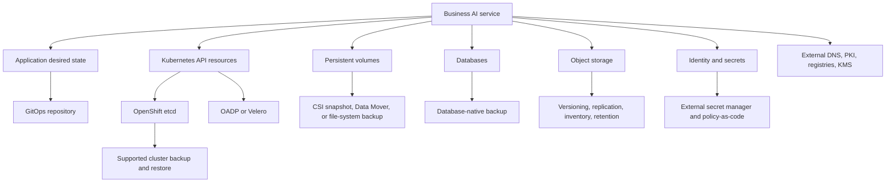

# 25. Backup failure troubleshooting

## Document purpose

This chapter teaches **systematic diagnosis of incomplete or unusable backups** from first principles through production implementation, recovery, validation, automation, security, monitoring, and troubleshooting.

### Corporate L3 outcome

The engineer identifies root cause, preserves evidence, implements a durable fix, and proves recoverability with a successful restore.

### Version and support notice

- Baseline used in this training pack: Red Hat OpenShift AI Self-Managed 3.5; OpenShift Container Platform 4.20-4.22 concepts; OADP/Velero and ODF features must be matched to the installed Operator/channel.
- OpenShift AI, OADP, Velero, KServe, CSI, ODF, and database schemas evolve.
- Run `oc api-resources`, inspect installed Operator CSVs, and read the documentation matching your exact channels before applying examples.
- Commands use placeholders and must be reviewed for the target platform, storage provider, security policy, and regulated-data requirements.
- Never run a destructive restore, prune, delete, failover, or credential-rotation command first in production.

## Learning objectives

By the end of this chapter, you will be able to:

1. Explain the business and technical purpose of Backup failure troubleshooting.
2. Inventory every protected resource and external dependency.
3. Select an appropriate consistency and protection mechanism.
4. Build the solution from scratch using production controls.
5. Execute backup and restore runbooks in dependency order.
6. Validate integrity, functionality, authorization, performance, RPO, and RTO.
7. Automate recurring operations without hiding failures.
8. Monitor protection health and troubleshoot senior-level failure scenarios.
9. Produce audit evidence and operational handover documentation.
10. Design a capstone implementation suitable for an enterprise platform team.

## Project to build from scratch

**Project statement:** Create a senior-engineer troubleshooting playbook and reproduce failures involving S3 credentials, CSI snapshots, quotas, and cross-cluster mapping.

**Definition of done:** The engineer identifies root cause, preserves evidence, implements a durable fix, and proves recoverability with a successful restore.
## Table of contents

1. Executive explanation
2. Architectural position
3. Protected asset inventory
4. Source-of-truth model
5. Threat and failure model
6. Consistency model
7. RPO, RTO, and retention
8. Prerequisites and lab design
9. Discovery and baseline commands
10. From-scratch implementation phases
11. Backup execution runbook
12. Restore execution runbook
13. Cross-cluster considerations
14. Security and compliance
15. GitOps and automation
16. Monitoring and alerting
17. Restore validation
18. Troubleshooting methodology
19. Production control catalog
20. Validation test catalog
21. Failure scenario catalog
22. Operational drills
23. Interview and design-review questions
24. Capstone project
25. Reference sources
## 1. Executive explanation

### 1.1 What this topic means

**Backup failure troubleshooting** is the engineering discipline used to protect, recover, and prove the recoverability of systematic diagnosis of incomplete or unusable backups.

A senior engineer does not begin by selecting a backup product. The correct order is:

1. Identify the business service.
2. Identify its complete dependency graph.
3. Classify each dependency as declarative configuration, Kubernetes API state, persistent volume data, database state, object data, identity state, external infrastructure, or control-plane state.
4. Assign a native backup and recovery mechanism to each class.
5. Define one mutually consistent recovery point.
6. Define restore order and ownership.
7. Automate evidence collection.
8. Prove recovery through repeated tests.

### 1.2 Core consistency principle

Start from the failed protection objective and trace the chain from policy to resource selection, data capture, transfer, storage, retention, and validation.

### 1.3 Core restore principle

After repair, rerun a controlled backup and prove the fix by restoring and validating the affected data type.

### 1.4 Senior-level cautions
- Do not close an incident after a backup turns green without a restore test.
- Avoid deleting failed objects before collecting logs and status.
- A timeout may represent bandwidth, API throttling, locks, snapshot readiness, or credentials—not only network failure.
### 1.5 Backup is not the same as high availability

High availability reduces downtime during component failures. Backup provides a recoverable historical copy. Replication creates another copy of changes, including potentially destructive changes. Disaster recovery combines people, process, infrastructure, data protection, traffic management, and validation to resume business service after a major event.

### 1.6 The six proofs of recoverability

A production design must prove:

- **Existence:** the backup object and its dependent data exist.
- **Completeness:** all required resources and data classes were captured.
- **Integrity:** content is not corrupted or silently changed.
- **Isolation:** the recovery copy survives loss or compromise of the primary failure domain.
- **Usability:** a supported restore procedure can consume the copy.
- **Business correctness:** the recovered AI service behaves as approved.
## 2. Architectural position

### 2.1 Layered recovery model



### 2.2 Dependency order

A safe generic restore order is:

1. Infrastructure and network prerequisites.
2. OpenShift cluster and control plane.
3. Storage, CSI, snapshot, ingress, DNS, certificate, KMS, and registry prerequisites.
4. Operators and CRDs at compatible versions.
5. GitOps controller and platform configuration.
6. Identity groups, secret sources, and minimum RBAC.
7. Databases and object buckets.
8. Persistent volume data.
9. Namespace-scoped OpenShift AI resources.
10. Workbenches, pipelines, registries, monitoring, and model serving.
11. Routes and traffic.
12. Technical and business validation.

### 2.3 Responsibility model

| Layer | Typical owner | Required evidence |
|---|---|---|
| Business service | Product owner | Tier, RPO, RTO, acceptance criteria |
| OpenShift AI configuration | AI platform team | Git commit, manifest version, reconciliation status |
| OADP service | Platform resilience team | DPA health, BSL availability, backup status |
| Storage and snapshots | Storage team | Snapshot readiness, offsite copy, capacity |
| Databases | DBA or service owner | Backup ID, transaction point, restore test |
| Object storage | Storage/cloud team | inventory, versioning, replication lag, retention |
| Identity and secrets | IAM/security team | vault version, rotation plan, access review |
| Network and DNS | Network/SRE team | route mapping, DNS TTL, certificate readiness |
| Validation | Service owner and QA | signed acceptance report |
## 3. Protected asset inventory

### 3.1 Topic-specific assets
1. **OADP and Velero CR status and logs**
   - Identify owner, namespace or external system, size, change rate, classification, and restore dependency for OADP and Velero CR status and logs.
   - Record the authoritative source and whether OADP and Velero CR status and logs is recreated, restored, regenerated, or intentionally excluded.
2. **BackupStorageLocation validation**
   - Identify owner, namespace or external system, size, change rate, classification, and restore dependency for BackupStorageLocation validation.
   - Record the authoritative source and whether BackupStorageLocation validation is recreated, restored, regenerated, or intentionally excluded.
3. **provider credentials and IAM**
   - Identify owner, namespace or external system, size, change rate, classification, and restore dependency for provider credentials and IAM.
   - Record the authoritative source and whether provider credentials and IAM is recreated, restored, regenerated, or intentionally excluded.
4. **CSI snapshot objects and driver logs**
   - Identify owner, namespace or external system, size, change rate, classification, and restore dependency for CSI snapshot objects and driver logs.
   - Record the authoritative source and whether CSI snapshot objects and driver logs is recreated, restored, regenerated, or intentionally excluded.
5. **Data Mover or node-agent pods**
   - Identify owner, namespace or external system, size, change rate, classification, and restore dependency for Data Mover or node-agent pods.
   - Record the authoritative source and whether Data Mover or node-agent pods is recreated, restored, regenerated, or intentionally excluded.
6. **PVC access and file-system errors**
   - Identify owner, namespace or external system, size, change rate, classification, and restore dependency for PVC access and file-system errors.
   - Record the authoritative source and whether PVC access and file-system errors is recreated, restored, regenerated, or intentionally excluded.
7. **database dump logs**
   - Identify owner, namespace or external system, size, change rate, classification, and restore dependency for database dump logs.
   - Record the authoritative source and whether database dump logs is recreated, restored, regenerated, or intentionally excluded.
8. **S3 replication and lifecycle state**
   - Identify owner, namespace or external system, size, change rate, classification, and restore dependency for S3 replication and lifecycle state.
   - Record the authoritative source and whether S3 replication and lifecycle state is recreated, restored, regenerated, or intentionally excluded.
9. **network, DNS, proxy, TLS, quota, and capacity evidence**
   - Identify owner, namespace or external system, size, change rate, classification, and restore dependency for network, DNS, proxy, TLS, quota, and capacity evidence.
   - Record the authoritative source and whether network, DNS, proxy, TLS, quota, and capacity evidence is recreated, restored, regenerated, or intentionally excluded.
### 3.2 Protection mechanisms available
1. **layered triage**
   - Document tool version, credentials, destination, encryption, retention, monitoring, and restore procedure.
   - Prove the mechanism with a restore test; successful creation alone is insufficient.
2. **status-condition analysis**
   - Document tool version, credentials, destination, encryption, retention, monitoring, and restore procedure.
   - Prove the mechanism with a restore test; successful creation alone is insufficient.
3. **must-gather and log collection**
   - Document tool version, credentials, destination, encryption, retention, monitoring, and restore procedure.
   - Prove the mechanism with a restore test; successful creation alone is insufficient.
4. **minimal reproduction backup**
   - Document tool version, credentials, destination, encryption, retention, monitoring, and restore procedure.
   - Prove the mechanism with a restore test; successful creation alone is insufficient.
5. **provider and CSI validation**
   - Document tool version, credentials, destination, encryption, retention, monitoring, and restore procedure.
   - Prove the mechanism with a restore test; successful creation alone is insufficient.
6. **throughput and capacity testing**
   - Document tool version, credentials, destination, encryption, retention, monitoring, and restore procedure.
   - Prove the mechanism with a restore test; successful creation alone is insufficient.
7. **restore-based proof**
   - Document tool version, credentials, destination, encryption, retention, monitoring, and restore procedure.
   - Prove the mechanism with a restore test; successful creation alone is insufficient.
### 3.3 Source-of-truth matrix template

| Asset | Authoritative source | Backup mechanism | Frequency | Retention | Restore owner | Validation |
|---|---|---|---|---|---|---|
| OADP and Velero CR status and logs | Define | Define | Define | Define | Define | Define |
| BackupStorageLocation validation | Define | Define | Define | Define | Define | Define |
| provider credentials and IAM | Define | Define | Define | Define | Define | Define |
| CSI snapshot objects and driver logs | Define | Define | Define | Define | Define | Define |
| Data Mover or node-agent pods | Define | Define | Define | Define | Define | Define |
| PVC access and file-system errors | Define | Define | Define | Define | Define | Define |
| database dump logs | Define | Define | Define | Define | Define | Define |
| S3 replication and lifecycle state | Define | Define | Define | Define | Define | Define |
| network, DNS, proxy, TLS, quota, and capacity evidence | Define | Define | Define | Define | Define | Define |
### 3.4 Include, regenerate, and exclude decisions

- **Include:** durable state that cannot be reconstructed within RTO.
- **Regenerate:** pods, replicas, endpoints, status subresources, caches, and operator-owned children when their controller is protected.
- **Rebuild from Git:** stable desired state, policies, and environment overlays.
- **Back up natively:** databases, object stores, and systems with their own transaction or version model.
- **Exclude carefully:** transient logs or large caches only when business and forensic requirements permit.
- **Record every exclusion:** undocumented exclusions become restore surprises.
## 4. Threat and failure model

A complete design covers more than accidental deletion.

| Failure class | Example | Protection response |
|---|---|---|
| Human error | namespace, model, secret, or object deleted | point-in-time backup and version retention |
| Application defect | pipeline writes corrupt metadata | database PITR and artifact versioning |
| Storage failure | volume or storage cluster unavailable | off-failure-domain copy and tested restore |
| Cluster failure | control plane or multiple nodes lost | etcd/control-plane procedure plus application backups |
| Site failure | data center unavailable | cross-cluster data portability and traffic failover |
| Security incident | ransomware or credential compromise | immutable copies, isolated credentials, clean-room restore |
| Supply-chain failure | runtime image or model source disappears | registry mirroring, signed immutable artifacts |
| Operator upgrade issue | CRD/schema incompatibility | pre-upgrade backups and version-aware rollback/recovery |
| Compliance event | evidence required for audit | retained reports, immutable logs, restore-test records |

### 4.1 Failure-domain questions

- Is the backup stored in the same cluster?
- Is it stored on the same storage system?
- Does it use the same cloud account or credentials?
- Can a compromised cluster delete the backup?
- Are encryption keys in the same failure domain?
- Can DNS, PKI, IAM, KMS, or container registry failure block recovery?
- Can the recovery team access procedures when the primary collaboration system is unavailable?

### 4.2 Clean-room recovery

For cyber recovery, restore into an isolated environment, use freshly issued credentials, scan images and artifacts, validate Git and model signatures, and prevent recovered workloads from contacting production systems until approved.
## 5. RPO, RTO, retention, and consistency

### 5.1 Recovery point objective

For Backup failure troubleshooting, the RPO must be measured from the newest **usable and mutually consistent** copy of all required dependencies.

### 5.2 Recovery time objective

RTO begins when the business declares the service unavailable and ends when the recovered service passes acceptance and is available to its approved consumers.

### 5.3 Example service tiers

| Tier | Example use | Target RPO | Target RTO | Typical controls |
|---|---|---:|---:|---|
| Tier 0 | regulated production inference | 5-15 min | 30-60 min | warm DR, replication, immutable versions, automated validation |
| Tier 1 | critical training/pipeline service | 1 hour | 4 hours | frequent DB/object backup, portable volume backup, prebuilt cluster |
| Tier 2 | shared workbench projects | 4-8 hours | 1 business day | scheduled OADP and daily offsite data copy |
| Tier 3 | disposable sandbox | 24 hours or none | best effort | Git rebuild and documented exclusion |

### 5.4 Retention example

- Hourly recovery points: 48 hours.
- Daily recovery points: 35 days.
- Weekly recovery points: 13 weeks.
- Monthly recovery points: 13 months.
- Annual or regulatory archives: according to legal policy.
- Immutable cyber-recovery copies: independently governed retention.

### 5.5 Consistency checkpoint record

Record at minimum:

- Checkpoint ID.
- UTC start and end time.
- Application pause or quiesce method.
- Database transaction or snapshot identifier.
- Object bucket inventory timestamp and version marker.
- PVC snapshot or backup identifier.
- Git commit and image/model digests.
- Kubernetes/OADP backup name.
- Exceptions and in-flight operations.
## 6. Prerequisites and lab design

### 6.1 Required access

- A non-production OpenShift cluster with OpenShift AI installed.
- `cluster-admin` for installation labs or delegated privileges for namespace labs.
- `oc`, `jq`, `yq`, `skopeo` or `podman`, S3 client, database client, Git, and checksum tools.
- A supported CSI storage class and snapshot class when snapshot labs are used.
- An S3-compatible backup destination isolated from the protected namespace.
- A Git repository for desired state and runbooks.
- A separate recovery namespace or recovery cluster.

### 6.2 Lab variables

```bash
export PRIMARY_CONTEXT=primary
export DR_CONTEXT=dr
export SOURCE_NS=rhoai-prod-team-a
export RESTORE_NS=rhoai-restore-team-a
export OADP_NS=openshift-adp
export BACKUP_NAME=team-a-$(date -u +%Y%m%dT%H%M%SZ)
export S3_ENDPOINT=https://s3.example.invalid
export BACKUP_BUCKET=rhoai-backups
export ARTIFACT_BUCKET=rhoai-artifacts
export GIT_REVISION=$(git rev-parse HEAD 2>/dev/null || echo define-me)
```

### 6.3 Safety gates

1. Confirm current context: `oc whoami --show-server`.
2. Confirm target namespace.
3. Confirm no command points to production when performing destructive tests.
4. Capture current manifests and status before changes.
5. Verify backups are stored outside the failure domain.
6. Set object-lock or immutability policy where required.
7. Obtain change approval for production restores or failovers.
8. Establish rollback and abort criteria.
## 7. Discovery and baseline commands

### 7.1 Cluster and Operator discovery
```bash
oc version
oc get clusterversion
oc get clusteroperators
oc get csv -A | egrep -i 'rhods|opendatahub|oadp|odf|ceph|gitops|kserve|serverless'
oc get subscriptions.operators.coreos.com -A
oc api-resources --verbs=list --namespaced=true | sort
oc api-resources --verbs=list --namespaced=false | sort
```
### 7.2 Namespace inventory
```bash
oc get ns "$SOURCE_NS" --show-labels
oc get all -n "$SOURCE_NS" -o wide
oc get pvc,pv -n "$SOURCE_NS" -o wide
oc get secret,configmap,serviceaccount,role,rolebinding -n "$SOURCE_NS"
oc get networkpolicy,resourcequota,limitrange -n "$SOURCE_NS"
oc get route,ingress -n "$SOURCE_NS"
oc get events -n "$SOURCE_NS" --sort-by=.lastTimestamp
```
### 7.3 OpenShift AI custom-resource discovery
```bash
for pattern in notebook workbench datascience pipeline modelregistry servingruntime inferenceservice trustyai; do
  echo "### $pattern"
  oc api-resources | grep -i "$pattern" || true
done
```
### 7.4 Storage and snapshot discovery
```bash
oc get storageclass
oc get volumesnapshotclass.snapshot.storage.k8s.io 2>/dev/null || true
oc get csidriver
oc get pvc -n "$SOURCE_NS" -o json | jq -r '.items[] | [.metadata.name,.spec.storageClassName,.spec.accessModes[0],.status.capacity.storage] | @tsv'
oc get pv -o custom-columns=NAME:.metadata.name,SC:.spec.storageClassName,CSI:.spec.csi.driver,RECLAIM:.spec.persistentVolumeReclaimPolicy
```
### 7.5 OADP discovery
```bash
oc get dataprotectionapplication.oadp.openshift.io -n "$OADP_NS" -o yaml 2>/dev/null || true
oc get backupstoragelocation.velero.io -n "$OADP_NS" -o wide 2>/dev/null || true
oc get volumesnapshotlocation.velero.io -n "$OADP_NS" -o wide 2>/dev/null || true
oc get backup.velero.io,restore.velero.io,schedule.velero.io -n "$OADP_NS" 2>/dev/null || true
oc get pods -n "$OADP_NS" -o wide 2>/dev/null || true
```
### 7.6 Export a normalized inventory
```bash
mkdir -p evidence/inventory
oc get ns "$SOURCE_NS" -o yaml > evidence/inventory/namespace.yaml
oc get pvc -n "$SOURCE_NS" -o yaml > evidence/inventory/pvcs.yaml
oc get role,rolebinding,serviceaccount -n "$SOURCE_NS" -o yaml > evidence/inventory/rbac.yaml
oc get secret -n "$SOURCE_NS" -o json \
  | jq 'del(.items[].data) | del(.items[].metadata.managedFields)' \
  > evidence/inventory/secret-metadata-redacted.json
oc get all -n "$SOURCE_NS" -o json \
  | jq 'del(.items[].metadata.managedFields,.items[].status)' \
  > evidence/inventory/workloads-normalized.json
sha256sum evidence/inventory/* > evidence/inventory/SHA256SUMS
```
## 8. From-scratch implementation

### Phase 1: Define the service boundary

1. Name the business service protected by Backup failure troubleshooting.
2. Identify business owner, technical owner, security owner, database owner, storage owner, and recovery commander.
3. Assign service tier, RPO, RTO, retention, confidentiality, integrity, and availability classifications.
4. Draw the dependency graph.
5. Record primary and DR cluster versions.
6. Record storage, database, object-store, registry, IAM, PKI, DNS, proxy, KMS, and network dependencies.
7. Obtain approval for exclusions.

### Phase 2: Establish authoritative sources

1. Put stable desired state in Git.
2. Pin operator channels and versions according to support policy.
3. Pin images by digest for critical runtimes.
4. Use immutable model artifact versions.
5. Store credentials in an external secret manager where possible.
6. Document database-native backup commands and managed-service snapshot APIs.
7. Enable object versioning and appropriate retention.
8. Define PVC protection class by storage capability.

### Phase 3: Build the backup destination

1. Create a dedicated backup account, project, or tenant.
2. Enable encryption in transit and at rest.
3. Restrict write/delete permissions.
4. Separate backup administration from workload administration.
5. Enable immutability or object lock for cyber-recovery tiers.
6. Configure lifecycle transitions only after restore compatibility is validated.
7. Monitor capacity, request failures, and replication lag.
8. Test read access from the recovery environment.

### Phase 4: Deploy or verify OADP

A representative DPA skeleton is shown below. Provider fields vary. Always use the documentation for the installed OADP version.
```yaml
apiVersion: oadp.openshift.io/v1alpha1
kind: DataProtectionApplication
metadata:
  name: enterprise-dpa
  namespace: openshift-adp
spec:
  configuration:
    velero:
      defaultPlugins:
        - openshift
        - aws
        - csi
      resourceTimeout: 10m
    nodeAgent:
      enable: true
      uploaderType: kopia
  backupLocations:
    - velero:
        provider: aws
        default: true
        credential:
          key: cloud
          name: cloud-credentials
        objectStorage:
          bucket: rhoai-backups
          prefix: primary-cluster
        config:
          region: minio
          s3ForcePathStyle: "true"
          s3Url: https://s3.example.invalid
```
### Phase 5: Verify the DPA and backup location
```bash
oc get dpa -n openshift-adp
oc describe dpa enterprise-dpa -n openshift-adp
oc get backupstoragelocation -n openshift-adp
oc describe backupstoragelocation -n openshift-adp
oc logs -n openshift-adp deploy/velero --tail=200
```
### Phase 6: Create a namespace-scoped backup policy
```yaml
apiVersion: velero.io/v1
kind: Schedule
metadata:
  name: rhoai-team-a-daily
  namespace: openshift-adp
spec:
  schedule: "0 1 * * *"
  template:
    includedNamespaces:
      - rhoai-prod-team-a
    snapshotMoveData: true
    defaultVolumesToFsBackup: false
    ttl: 720h0m0s
    metadata:
      labels:
        protection-tier: tier-1
        service: rhoai-team-a
```
### Phase 7: Add topic-specific consistency controls

The exact quiesce action depends on the asset. Examples include:

- Stop the workbench before a strict application-consistent PVC snapshot.
- Suspend pipeline schedules and wait for active runs to complete.
- Put a metadata service in maintenance mode or use a transactionally consistent database snapshot.
- Publish models through immutable versioned paths before backing them up.
- Capture object inventory after all multipart uploads complete.
- Record Git commit, image digest, model digest, and database checkpoint in one recovery manifest.

### Phase 8: Build a recovery manifest
```yaml
apiVersion: resilience.example.com/v1alpha1
kind: RecoveryManifest
metadata:
  name: backup-failure-troubleshooting-checkpoint
spec:
  topic: "Backup failure troubleshooting"
  checkpointUTC: "REPLACE"
  sourceCluster: "REPLACE"
  namespace: "${SOURCE_NS}"
  gitRevision: "${GIT_REVISION}"
  oadpBackup: "${BACKUP_NAME}"
  databaseBackupIDs: []
  bucketInventories: []
  volumeSnapshots: []
  imageDigests: []
  modelDigests: []
  exceptions: []
```
### Phase 9: Protect external dependencies

For each dependency outside Kubernetes:

1. Create a native backup or replicated copy.
2. Record its backup identifier.
3. Verify encryption key availability.
4. Export configuration and policy.
5. Record restore endpoint and credential process.
6. Add it to the recovery manifest.
7. Test restoration independently.
8. Test integration after the Kubernetes restore.

### Phase 10: Enforce retention and evidence

- Apply retention based on service tier.
- Prevent unreviewed deletion of immutable copies.
- Export backup status, logs, inventory, and checksums.
- Sign or hash the evidence bundle.
- Store the evidence separately from the workload cluster.
- Open an incident automatically for RPO breach or repeated failure.
## 9. Backup execution runbook

### 9.1 Pre-backup checks

1. Confirm the service and declared checkpoint.
2. Confirm current cluster context and namespace.
3. Confirm OADP pods are Ready.
4. Confirm BackupStorageLocation phase is Available.
5. Confirm snapshot classes and CSI driver health.
6. Confirm object-store capacity and credentials.
7. Confirm no unresolved previous backup failure.
8. Confirm database backup capability.
9. Confirm object versioning/retention state.
10. Confirm recovery manifest location.
11. Notify service owners if quiesce is required.
12. Record UTC start time.

### 9.2 Quiesce or checkpoint

Start from the failed protection objective and trace the chain from policy to resource selection, data capture, transfer, storage, retention, and validation.

Example coordination script skeleton:
```bash
set -euo pipefail
CHECKPOINT="$(date -u +%Y%m%dT%H%M%SZ)"
echo "$CHECKPOINT" | tee evidence/checkpoint.txt

# Replace these functions with service-specific actions.
quiesce_application() {
  echo "Quiesce application safely"
}

database_checkpoint() {
  echo "Create transactionally consistent database backup"
}

object_inventory() {
  echo "Create S3 object/version inventory"
}

quiesce_application
database_checkpoint
object_inventory
```
### 9.3 Create an on-demand OADP backup
```yaml
apiVersion: velero.io/v1
kind: Backup
metadata:
  name: team-a-manual-checkpoint
  namespace: openshift-adp
  labels:
    service: rhoai-team-a
    change-ticket: CHG-REPLACE
spec:
  includedNamespaces:
    - rhoai-prod-team-a
  snapshotMoveData: true
  ttl: 720h0m0s
```
```bash
oc apply -f backup.yaml
oc get backup -n openshift-adp team-a-manual-checkpoint -w
oc describe backup -n openshift-adp team-a-manual-checkpoint
oc logs -n openshift-adp deploy/velero --since=30m | tee evidence/velero-backup.log
```
### 9.4 Evaluate status

Treat these states deliberately:

- `Completed`: continue to data and restore-proof checks.
- `PartiallyFailed`: investigate every warning and error; do not treat as success by default.
- `Failed`: preserve status/logs, remediate, and rerun.
- `InProgress` beyond normal duration: inspect snapshots, data mover, repository, API throttling, network, and capacity.
- `Deleting`: confirm retention automation is expected.

### 9.5 Post-backup evidence

Capture:

- Backup CR YAML.
- `describe` output.
- Velero and plugin logs.
- Included and excluded resource counts.
- Snapshot and data-mover object status.
- Backup object-store path and immutable retention state.
- Database backup identifier.
- Bucket inventory and replication status.
- Checksums.
- Recovery manifest.
- Change or ticket reference.
- Owner approval.

### 9.6 Resume services

1. Confirm backup checkpoint completed.
2. Resume pipeline schedules or application writes.
3. Start stopped workbenches only after storage is healthy.
4. Verify no workload remains unintentionally paused.
5. Record UTC completion time and actual backup duration.
6. Update RPO evidence.
## 10. Restore execution runbook

### 10.1 Restore strategy

After repair, rerun a controlled backup and prove the fix by restoring and validating the affected data type.

### 10.2 Pre-restore gates

1. Obtain incident/change authorization.
2. Select the recovery point using the recovery manifest.
3. Validate backup status, age, integrity, and retention.
4. Confirm database and bucket backups match the same checkpoint.
5. Confirm target cluster version and API compatibility.
6. Install required operators and CRDs.
7. Confirm target storage classes and snapshot support.
8. Confirm target route domain, DNS, PKI, registry, KMS, and IAM.
9. Create isolated credentials for the recovery environment.
10. Prevent accidental writes to production external systems.
11. Define namespace, storage-class, route, and secret mappings.
12. Record UTC restore start.

### 10.3 Restore external data first when required

- Restore database to an isolated target.
- Restore or map object bucket data and versions.
- Restore model artifacts and images.
- Restore portable PVC data or make snapshots available.
- Recreate secrets from the authoritative vault.
- Verify network and TLS connectivity.

### 10.4 Example namespace-mapped restore
```yaml
apiVersion: velero.io/v1
kind: Restore
metadata:
  name: team-a-restore-drill
  namespace: openshift-adp
spec:
  backupName: team-a-manual-checkpoint
  namespaceMapping:
    rhoai-prod-team-a: rhoai-restore-team-a
  restorePVs: true
  existingResourcePolicy: update
```
```bash
oc apply -f restore.yaml
oc get restore -n openshift-adp team-a-restore-drill -w
oc describe restore -n openshift-adp team-a-restore-drill
oc logs -n openshift-adp deploy/velero --since=30m | tee evidence/velero-restore.log
```
### 10.5 Environment-specific transformations

Review and transform:

- Namespace names.
- StorageClass names.
- VolumeSnapshotClass names.
- Route hosts and wildcard domains.
- DNS records and TTL.
- Certificate secrets and issuers.
- Object-store endpoints and bucket names.
- Database endpoints.
- Proxy and no-proxy settings.
- Image registry paths and pull secrets.
- Node selectors, tolerations, GPU resources, and hardware profiles.
- Identity groups and RoleBinding subjects.
- Service account references.
- KMS key references.
- NetworkPolicy CIDRs and namespace selectors.

### 10.6 Post-restore stabilization

1. Check namespace events.
2. Check PVC and snapshot status.
3. Check operator and controller reconciliation.
4. Check pods, deployments, stateful sets, jobs, and routes.
5. Check secrets and config maps exist without exposing data.
6. Check external database and S3 connectivity.
7. Check runtime images and model artifacts are locally available.
8. Run smoke tests before enabling traffic.
9. Run full validation gates.
10. Record UTC service-ready and business-accepted times.

### 10.7 Abort criteria

Abort or hold traffic when:

- Backup integrity cannot be proven.
- The selected database and artifact recovery points are inconsistent.
- Restored workloads can write to production unintentionally.
- Required encryption keys are unavailable.
- The wrong model or runtime version loads.
- Critical RBAC negative tests fail.
- Data corruption or unacceptable loss exceeds RPO.
- Performance cannot meet the minimum service objective.
## 11. Security and compliance design

### 11.1 Access model

- Separate backup operator, restore operator, storage administrator, security approver, and auditor roles.
- Grant OADP only the permissions required by its supported installation.
- Restrict direct access to backup buckets.
- Require MFA and break-glass approval for restore and deletion.
- Audit all backup deletion, retention change, credential use, and restore actions.

### 11.2 Encryption

- TLS for API, S3, database, and replication traffic.
- Server-side or client-side encryption for backup objects.
- Independent KMS availability in the DR site.
- Key rotation plan that preserves decryptability of retained backups.
- Document key IDs in the recovery manifest without exposing key material.

### 11.3 Secrets handling

- Redact secret values from inventory and logs.
- Prefer external secret sources.
- Rotate credentials after a cyber incident.
- Do not restore cluster-generated tokens blindly across clusters.
- Test certificate trust chains and expiry during recovery.

### 11.4 Immutability and cyber recovery

- Use object lock or equivalent controls for critical tiers.
- Protect backup administrator credentials from the workload cluster.
- Maintain a clean-room recovery path.
- Scan restored images, models, and files.
- Validate signatures and provenance.
- Preserve forensic evidence before destructive remediation.

### 11.5 Compliance evidence checklist

- Approved policy and service tier.
- Backup schedule and retention.
- Successful job evidence.
- Failure and remediation evidence.
- Immutable retention proof.
- Access review.
- Restore drill report.
- RPO and RTO measurements.
- Exceptions and risk acceptance.
- Business-owner sign-off.
## 12. GitOps and automation

### 12.1 Repository layout

```text
rhoai-dr/
├── clusters/
│   ├── primary/
│   └── dr/
├── platform/
│   ├── operators/
│   ├── datasciencecluster/
│   ├── storage/
│   └── oadp/
├── tenants/
│   └── team-a/
│       ├── base/
│       └── overlays/
│           ├── production/
│           └── dr/
├── recovery/
│   ├── runbooks/
│   ├── validation/
│   └── manifests/
└── policies/
    ├── rpo-rto.yaml
    └── retention.yaml
```

### 12.2 Automation design rules

1. Make backup jobs idempotent.
2. Use unique checkpoint IDs.
3. Reject overlapping backups for the same stateful service unless supported.
4. Fail closed when prerequisite checks fail.
5. Emit structured status and metrics.
6. Store no plaintext secrets in pipeline logs.
7. Include a restore-test stage.
8. Require human approval before production traffic cutover.
9. Preserve artifacts and logs for audit.
10. Test rollback and cleanup.

### 12.3 Example backup orchestration pseudocode

```python
from dataclasses import dataclass
from datetime import datetime, timezone

@dataclass
class Checkpoint:
    service: str
    timestamp: str
    git_revision: str
    database_backup: str
    bucket_inventory: str
    oadp_backup: str


def create_checkpoint(service: str) -> Checkpoint:
    now = datetime.now(timezone.utc).strftime("%Y%m%dT%H%M%SZ")
    verify_prerequisites(service)
    quiesce(service)
    db_id = backup_database(service)
    inventory_id = inventory_bucket(service)
    backup_id = create_oadp_backup(service, now)
    wait_for_completion(backup_id)
    resume(service)
    validate_backup_metadata(backup_id)
    return Checkpoint(service, now, git_revision(), db_id, inventory_id, backup_id)
```

### 12.4 Automated restore rehearsal

- Create an isolated namespace or temporary cluster.
- Restore a selected recovery point.
- Apply DR overlays.
- Inject non-production credentials.
- Run integrity, function, security, and performance tests.
- Publish evidence.
- Destroy temporary resources only after evidence retention.
## 13. Monitoring, SLOs, and alerts

### 13.1 Minimum metrics

- Timestamp of last successful backup.
- Age of newest validated recovery point.
- Backup duration and size.
- Number of warnings and errors.
- PartiallyFailed and Failed counts.
- BackupStorageLocation availability.
- Snapshot and data-mover duration.
- Object-store request failure and capacity.
- Database backup success and replication lag.
- Object replication lag.
- Restore-test success and duration.
- Percentage of services meeting RPO and RTO.

### 13.2 Example SLOs

- 99% of scheduled Tier 1 backups complete within the expected window each month.
- No Tier 0 service exceeds its validated recovery-point age.
- Every Tier 0 service passes one automated restore validation per week.
- Every Tier 1 service passes one full DR exercise per quarter.
- Backup storage availability remains above 99.9%.

### 13.3 Alert logic examples

```yaml
groups:
  - name: rhoai-backup.rules
    rules:
      - alert: RHOAIBackupRecoveryPointTooOld
        expr: time() - rhoai_last_validated_recovery_point_timestamp_seconds > 3600
        for: 15m
        labels:
          severity: critical
        annotations:
          summary: "Validated recovery point exceeds Tier 1 RPO"
      - alert: RHOAIRestoreDrillFailed
        expr: increase(rhoai_restore_validation_failures_total[24h]) > 0
        labels:
          severity: warning
        annotations:
          summary: "An automated OpenShift AI restore validation failed"
```

### 13.4 Dashboard sections

1. Executive RPO/RTO compliance.
2. Service protection coverage.
3. Last valid recovery point by tenant.
4. OADP backup status and duration.
5. Snapshot and data-mover performance.
6. Database backup health.
7. Object replication and inventory health.
8. Backup storage capacity and retention.
9. Restore drill outcomes.
10. Open incidents and overdue corrective actions.
## 14. Restore validation framework

### Gate 1: Infrastructure readiness

- Target cluster healthy.
- Required operators available.
- Storage and snapshot classes mapped.
- DNS, route, certificate, registry, KMS, and IAM available.

### Gate 2: Resource completeness

- Expected namespaces and custom resources exist.
- Owner references and labels are correct.
- No critical resource remains in an unsupported API version.
- Operator-managed children reconcile successfully.

### Gate 3: Data integrity

- PVC file counts and sampled checksums match.
- Database schema, row counts, and transaction checkpoint match.
- Object counts, versions, sizes, and sampled checksums match.
- Model and image digests match the recovery manifest.

### Gate 4: Functional behavior

- Workbench starts and reads expected data.
- Pipeline UI and API show expected history.
- Pipeline artifact links resolve.
- Model registry shows expected versions and lineage.
- Serving runtime loads the exact model.
- Golden inference inputs return approved outputs.
- TrustyAI receives and displays expected observations.

### Gate 5: Security

- Authorized users succeed.
- Unauthorized users fail.
- Secrets are rotated where required.
- Network policies prevent unintended access.
- The DR environment cannot write to protected primary systems.

### Gate 6: Performance and resilience

- Endpoint latency and error rate meet the minimum DR SLO.
- Data transfer and model loading complete within RTO.
- Autoscaling and GPU scheduling work.
- Monitoring and alerting are active.

### Gate 7: Business acceptance

- Product owner validates service behavior.
- Data-loss statement is within RPO.
- Actual RTO is recorded.
- Residual risks are approved.
- Traffic cutover is authorized.
## 15. Senior troubleshooting methodology

### 15.1 Start with the protection objective

State exactly what failed:

- Resource selection.
- Kubernetes object serialization.
- Volume snapshot creation.
- Snapshot data movement.
- File-system backup.
- Database-native backup.
- Object replication.
- Backup upload.
- Retention.
- Restore.
- Post-restore reconciliation.
- Functional validation.

### 15.2 Collect evidence before changing state

```bash
mkdir -p evidence/troubleshooting
oc get backup,restore,schedule -n openshift-adp -o yaml > evidence/troubleshooting/velero-crs.yaml
oc get pods -n openshift-adp -o wide > evidence/troubleshooting/pods.txt
oc get events -n openshift-adp --sort-by=.lastTimestamp > evidence/troubleshooting/events.txt
oc logs -n openshift-adp deploy/velero --since=2h > evidence/troubleshooting/velero.log
oc get volumesnapshot,volumesnapshotcontent -A -o yaml > evidence/troubleshooting/snapshots.yaml 2>/dev/null || true
oc get pvc -n "$SOURCE_NS" -o yaml > evidence/troubleshooting/pvcs.yaml
oc adm must-gather --dest-dir=evidence/troubleshooting/must-gather
```

### 15.3 Layered decision tree

1. **Policy:** Was the correct namespace/resource selected?
2. **API:** Are CRDs, permissions, admission policies, and API versions valid?
3. **Controller:** Did OADP/Velero reconcile the request?
4. **Plugin:** Did provider and CSI plugins load and authenticate?
5. **Storage:** Did snapshot or file-system backup complete?
6. **Network:** Can components resolve and reach object storage?
7. **Security:** Are TLS, proxy, IAM, SCC/PSA, and KMS correct?
8. **Capacity:** Is there object, volume, node, memory, CPU, inode, or bandwidth capacity?
9. **Data:** Was application consistency achieved?
10. **Restore:** Can the backup be consumed and validated?

### 15.4 Root-cause discipline

- Separate symptom, contributing factors, root cause, and control gap.
- Avoid deleting failed CRs before collecting status and logs.
- Reproduce with the smallest representative namespace.
- Change one variable at a time.
- Prove repair through backup plus restore.
- Add a preventive alert or policy after remediation.
## 16. Production control catalog

The following controls are written as implementable review items. Adapt ownership and evidence to your organization.
### Control 001: Encrypt OADP and Velero CR status and logs
- **Requirement:** The platform team must encrypt `OADP and Velero CR status and logs` within the Backup failure troubleshooting design.
- **Implementation:** Use must-gather and log collection; record environment-specific parameters and dependency order.
- **Evidence:** Retain Prometheus metric with UTC timestamp, owner, service tier, and checkpoint ID.
- **Failure condition:** The asset is absent, stale, inaccessible, inconsistent, or cannot be restored inside the approved objective.
- **Review frequency:** At deployment, after material change, and during the scheduled resilience review.

### Control 002: Test Recovery Of BackupStorageLocation validation
- **Requirement:** The platform team must test recovery of `BackupStorageLocation validation` within the Backup failure troubleshooting design.
- **Implementation:** Use throughput and capacity testing; record environment-specific parameters and dependency order.
- **Evidence:** Retain Git commit with UTC timestamp, owner, service tier, and checkpoint ID.
- **Failure condition:** The asset is absent, stale, inaccessible, inconsistent, or cannot be restored inside the approved objective.
- **Review frequency:** At deployment, after material change, and during the scheduled resilience review.

### Control 003: Automate Validation Of provider credentials and IAM
- **Requirement:** The platform team must automate validation of `provider credentials and IAM` within the Backup failure troubleshooting design.
- **Implementation:** Use status-condition analysis; record environment-specific parameters and dependency order.
- **Evidence:** Retain access review with UTC timestamp, owner, service tier, and checkpoint ID.
- **Failure condition:** The asset is absent, stale, inaccessible, inconsistent, or cannot be restored inside the approved objective.
- **Review frequency:** At deployment, after material change, and during the scheduled resilience review.

### Control 004: Establish Clean-Room Handling For CSI snapshot objects and driver logs
- **Requirement:** The platform team must establish clean-room handling for `CSI snapshot objects and driver logs` within the Backup failure troubleshooting design.
- **Implementation:** Use provider and CSI validation; record environment-specific parameters and dependency order.
- **Evidence:** Retain database backup ID with UTC timestamp, owner, service tier, and checkpoint ID.
- **Failure condition:** The asset is absent, stale, inaccessible, inconsistent, or cannot be restored inside the approved objective.
- **Review frequency:** At deployment, after material change, and during the scheduled resilience review.

### Control 005: Encrypt Data Mover or node-agent pods
- **Requirement:** The platform team must encrypt `Data Mover or node-agent pods` within the Backup failure troubleshooting design.
- **Implementation:** Use layered triage; record environment-specific parameters and dependency order.
- **Evidence:** Retain checksum manifest with UTC timestamp, owner, service tier, and checkpoint ID.
- **Failure condition:** The asset is absent, stale, inaccessible, inconsistent, or cannot be restored inside the approved objective.
- **Review frequency:** At deployment, after material change, and during the scheduled resilience review.

### Control 006: Test Recovery Of PVC access and file-system errors
- **Requirement:** The platform team must test recovery of `PVC access and file-system errors` within the Backup failure troubleshooting design.
- **Implementation:** Use minimal reproduction backup; record environment-specific parameters and dependency order.
- **Evidence:** Retain snapshot ID with UTC timestamp, owner, service tier, and checkpoint ID.
- **Failure condition:** The asset is absent, stale, inaccessible, inconsistent, or cannot be restored inside the approved objective.
- **Review frequency:** At deployment, after material change, and during the scheduled resilience review.

### Control 007: Automate Validation Of database dump logs
- **Requirement:** The platform team must automate validation of `database dump logs` within the Backup failure troubleshooting design.
- **Implementation:** Use restore-based proof; record environment-specific parameters and dependency order.
- **Evidence:** Retain signed inventory with UTC timestamp, owner, service tier, and checkpoint ID.
- **Failure condition:** The asset is absent, stale, inaccessible, inconsistent, or cannot be restored inside the approved objective.
- **Review frequency:** At deployment, after material change, and during the scheduled resilience review.

### Control 008: Establish Clean-Room Handling For S3 replication and lifecycle state
- **Requirement:** The platform team must establish clean-room handling for `S3 replication and lifecycle state` within the Backup failure troubleshooting design.
- **Implementation:** Use must-gather and log collection; record environment-specific parameters and dependency order.
- **Evidence:** Retain restore-test report with UTC timestamp, owner, service tier, and checkpoint ID.
- **Failure condition:** The asset is absent, stale, inaccessible, inconsistent, or cannot be restored inside the approved objective.
- **Review frequency:** At deployment, after material change, and during the scheduled resilience review.

### Control 009: Encrypt network, DNS, proxy, TLS, quota, and capacity evidence
- **Requirement:** The platform team must encrypt `network, DNS, proxy, TLS, quota, and capacity evidence` within the Backup failure troubleshooting design.
- **Implementation:** Use throughput and capacity testing; record environment-specific parameters and dependency order.
- **Evidence:** Retain backup CR status with UTC timestamp, owner, service tier, and checkpoint ID.
- **Failure condition:** The asset is absent, stale, inaccessible, inconsistent, or cannot be restored inside the approved objective.
- **Review frequency:** At deployment, after material change, and during the scheduled resilience review.

### Control 010: Test Recovery Of OADP and Velero CR status and logs
- **Requirement:** The platform team must test recovery of `OADP and Velero CR status and logs` within the Backup failure troubleshooting design.
- **Implementation:** Use status-condition analysis; record environment-specific parameters and dependency order.
- **Evidence:** Retain change record with UTC timestamp, owner, service tier, and checkpoint ID.
- **Failure condition:** The asset is absent, stale, inaccessible, inconsistent, or cannot be restored inside the approved objective.
- **Review frequency:** At deployment, after material change, and during the scheduled resilience review.

### Control 011: Automate Validation Of BackupStorageLocation validation
- **Requirement:** The platform team must automate validation of `BackupStorageLocation validation` within the Backup failure troubleshooting design.
- **Implementation:** Use provider and CSI validation; record environment-specific parameters and dependency order.
- **Evidence:** Retain bucket inventory with UTC timestamp, owner, service tier, and checkpoint ID.
- **Failure condition:** The asset is absent, stale, inaccessible, inconsistent, or cannot be restored inside the approved objective.
- **Review frequency:** At deployment, after material change, and during the scheduled resilience review.

### Control 012: Establish Clean-Room Handling For provider credentials and IAM
- **Requirement:** The platform team must establish clean-room handling for `provider credentials and IAM` within the Backup failure troubleshooting design.
- **Implementation:** Use layered triage; record environment-specific parameters and dependency order.
- **Evidence:** Retain operator reconciliation evidence with UTC timestamp, owner, service tier, and checkpoint ID.
- **Failure condition:** The asset is absent, stale, inaccessible, inconsistent, or cannot be restored inside the approved objective.
- **Review frequency:** At deployment, after material change, and during the scheduled resilience review.

### Control 013: Encrypt CSI snapshot objects and driver logs
- **Requirement:** The platform team must encrypt `CSI snapshot objects and driver logs` within the Backup failure troubleshooting design.
- **Implementation:** Use minimal reproduction backup; record environment-specific parameters and dependency order.
- **Evidence:** Retain Prometheus metric with UTC timestamp, owner, service tier, and checkpoint ID.
- **Failure condition:** The asset is absent, stale, inaccessible, inconsistent, or cannot be restored inside the approved objective.
- **Review frequency:** At deployment, after material change, and during the scheduled resilience review.

### Control 014: Test Recovery Of Data Mover or node-agent pods
- **Requirement:** The platform team must test recovery of `Data Mover or node-agent pods` within the Backup failure troubleshooting design.
- **Implementation:** Use restore-based proof; record environment-specific parameters and dependency order.
- **Evidence:** Retain Git commit with UTC timestamp, owner, service tier, and checkpoint ID.
- **Failure condition:** The asset is absent, stale, inaccessible, inconsistent, or cannot be restored inside the approved objective.
- **Review frequency:** At deployment, after material change, and during the scheduled resilience review.

### Control 015: Automate Validation Of PVC access and file-system errors
- **Requirement:** The platform team must automate validation of `PVC access and file-system errors` within the Backup failure troubleshooting design.
- **Implementation:** Use must-gather and log collection; record environment-specific parameters and dependency order.
- **Evidence:** Retain access review with UTC timestamp, owner, service tier, and checkpoint ID.
- **Failure condition:** The asset is absent, stale, inaccessible, inconsistent, or cannot be restored inside the approved objective.
- **Review frequency:** At deployment, after material change, and during the scheduled resilience review.

### Control 016: Establish Clean-Room Handling For database dump logs
- **Requirement:** The platform team must establish clean-room handling for `database dump logs` within the Backup failure troubleshooting design.
- **Implementation:** Use throughput and capacity testing; record environment-specific parameters and dependency order.
- **Evidence:** Retain database backup ID with UTC timestamp, owner, service tier, and checkpoint ID.
- **Failure condition:** The asset is absent, stale, inaccessible, inconsistent, or cannot be restored inside the approved objective.
- **Review frequency:** At deployment, after material change, and during the scheduled resilience review.

### Control 017: Encrypt S3 replication and lifecycle state
- **Requirement:** The platform team must encrypt `S3 replication and lifecycle state` within the Backup failure troubleshooting design.
- **Implementation:** Use status-condition analysis; record environment-specific parameters and dependency order.
- **Evidence:** Retain checksum manifest with UTC timestamp, owner, service tier, and checkpoint ID.
- **Failure condition:** The asset is absent, stale, inaccessible, inconsistent, or cannot be restored inside the approved objective.
- **Review frequency:** At deployment, after material change, and during the scheduled resilience review.

### Control 018: Test Recovery Of network, DNS, proxy, TLS, quota, and capacity evidence
- **Requirement:** The platform team must test recovery of `network, DNS, proxy, TLS, quota, and capacity evidence` within the Backup failure troubleshooting design.
- **Implementation:** Use provider and CSI validation; record environment-specific parameters and dependency order.
- **Evidence:** Retain snapshot ID with UTC timestamp, owner, service tier, and checkpoint ID.
- **Failure condition:** The asset is absent, stale, inaccessible, inconsistent, or cannot be restored inside the approved objective.
- **Review frequency:** At deployment, after material change, and during the scheduled resilience review.

### Control 019: Automate Validation Of OADP and Velero CR status and logs
- **Requirement:** The platform team must automate validation of `OADP and Velero CR status and logs` within the Backup failure troubleshooting design.
- **Implementation:** Use layered triage; record environment-specific parameters and dependency order.
- **Evidence:** Retain signed inventory with UTC timestamp, owner, service tier, and checkpoint ID.
- **Failure condition:** The asset is absent, stale, inaccessible, inconsistent, or cannot be restored inside the approved objective.
- **Review frequency:** At deployment, after material change, and during the scheduled resilience review.

### Control 020: Establish Clean-Room Handling For BackupStorageLocation validation
- **Requirement:** The platform team must establish clean-room handling for `BackupStorageLocation validation` within the Backup failure troubleshooting design.
- **Implementation:** Use minimal reproduction backup; record environment-specific parameters and dependency order.
- **Evidence:** Retain restore-test report with UTC timestamp, owner, service tier, and checkpoint ID.
- **Failure condition:** The asset is absent, stale, inaccessible, inconsistent, or cannot be restored inside the approved objective.
- **Review frequency:** At deployment, after material change, and during the scheduled resilience review.

### Control 021: Encrypt provider credentials and IAM
- **Requirement:** The platform team must encrypt `provider credentials and IAM` within the Backup failure troubleshooting design.
- **Implementation:** Use restore-based proof; record environment-specific parameters and dependency order.
- **Evidence:** Retain backup CR status with UTC timestamp, owner, service tier, and checkpoint ID.
- **Failure condition:** The asset is absent, stale, inaccessible, inconsistent, or cannot be restored inside the approved objective.
- **Review frequency:** At deployment, after material change, and during the scheduled resilience review.

### Control 022: Test Recovery Of CSI snapshot objects and driver logs
- **Requirement:** The platform team must test recovery of `CSI snapshot objects and driver logs` within the Backup failure troubleshooting design.
- **Implementation:** Use must-gather and log collection; record environment-specific parameters and dependency order.
- **Evidence:** Retain change record with UTC timestamp, owner, service tier, and checkpoint ID.
- **Failure condition:** The asset is absent, stale, inaccessible, inconsistent, or cannot be restored inside the approved objective.
- **Review frequency:** At deployment, after material change, and during the scheduled resilience review.

### Control 023: Automate Validation Of Data Mover or node-agent pods
- **Requirement:** The platform team must automate validation of `Data Mover or node-agent pods` within the Backup failure troubleshooting design.
- **Implementation:** Use throughput and capacity testing; record environment-specific parameters and dependency order.
- **Evidence:** Retain bucket inventory with UTC timestamp, owner, service tier, and checkpoint ID.
- **Failure condition:** The asset is absent, stale, inaccessible, inconsistent, or cannot be restored inside the approved objective.
- **Review frequency:** At deployment, after material change, and during the scheduled resilience review.

### Control 024: Establish Clean-Room Handling For PVC access and file-system errors
- **Requirement:** The platform team must establish clean-room handling for `PVC access and file-system errors` within the Backup failure troubleshooting design.
- **Implementation:** Use status-condition analysis; record environment-specific parameters and dependency order.
- **Evidence:** Retain operator reconciliation evidence with UTC timestamp, owner, service tier, and checkpoint ID.
- **Failure condition:** The asset is absent, stale, inaccessible, inconsistent, or cannot be restored inside the approved objective.
- **Review frequency:** At deployment, after material change, and during the scheduled resilience review.

### Control 025: Encrypt database dump logs
- **Requirement:** The platform team must encrypt `database dump logs` within the Backup failure troubleshooting design.
- **Implementation:** Use provider and CSI validation; record environment-specific parameters and dependency order.
- **Evidence:** Retain Prometheus metric with UTC timestamp, owner, service tier, and checkpoint ID.
- **Failure condition:** The asset is absent, stale, inaccessible, inconsistent, or cannot be restored inside the approved objective.
- **Review frequency:** At deployment, after material change, and during the scheduled resilience review.

### Control 026: Test Recovery Of S3 replication and lifecycle state
- **Requirement:** The platform team must test recovery of `S3 replication and lifecycle state` within the Backup failure troubleshooting design.
- **Implementation:** Use layered triage; record environment-specific parameters and dependency order.
- **Evidence:** Retain Git commit with UTC timestamp, owner, service tier, and checkpoint ID.
- **Failure condition:** The asset is absent, stale, inaccessible, inconsistent, or cannot be restored inside the approved objective.
- **Review frequency:** At deployment, after material change, and during the scheduled resilience review.

### Control 027: Automate Validation Of network, DNS, proxy, TLS, quota, and capacity evidence
- **Requirement:** The platform team must automate validation of `network, DNS, proxy, TLS, quota, and capacity evidence` within the Backup failure troubleshooting design.
- **Implementation:** Use minimal reproduction backup; record environment-specific parameters and dependency order.
- **Evidence:** Retain access review with UTC timestamp, owner, service tier, and checkpoint ID.
- **Failure condition:** The asset is absent, stale, inaccessible, inconsistent, or cannot be restored inside the approved objective.
- **Review frequency:** At deployment, after material change, and during the scheduled resilience review.

### Control 028: Establish Clean-Room Handling For OADP and Velero CR status and logs
- **Requirement:** The platform team must establish clean-room handling for `OADP and Velero CR status and logs` within the Backup failure troubleshooting design.
- **Implementation:** Use restore-based proof; record environment-specific parameters and dependency order.
- **Evidence:** Retain database backup ID with UTC timestamp, owner, service tier, and checkpoint ID.
- **Failure condition:** The asset is absent, stale, inaccessible, inconsistent, or cannot be restored inside the approved objective.
- **Review frequency:** At deployment, after material change, and during the scheduled resilience review.

### Control 029: Encrypt BackupStorageLocation validation
- **Requirement:** The platform team must encrypt `BackupStorageLocation validation` within the Backup failure troubleshooting design.
- **Implementation:** Use must-gather and log collection; record environment-specific parameters and dependency order.
- **Evidence:** Retain checksum manifest with UTC timestamp, owner, service tier, and checkpoint ID.
- **Failure condition:** The asset is absent, stale, inaccessible, inconsistent, or cannot be restored inside the approved objective.
- **Review frequency:** At deployment, after material change, and during the scheduled resilience review.

### Control 030: Test Recovery Of provider credentials and IAM
- **Requirement:** The platform team must test recovery of `provider credentials and IAM` within the Backup failure troubleshooting design.
- **Implementation:** Use throughput and capacity testing; record environment-specific parameters and dependency order.
- **Evidence:** Retain snapshot ID with UTC timestamp, owner, service tier, and checkpoint ID.
- **Failure condition:** The asset is absent, stale, inaccessible, inconsistent, or cannot be restored inside the approved objective.
- **Review frequency:** At deployment, after material change, and during the scheduled resilience review.

### Control 031: Automate Validation Of CSI snapshot objects and driver logs
- **Requirement:** The platform team must automate validation of `CSI snapshot objects and driver logs` within the Backup failure troubleshooting design.
- **Implementation:** Use status-condition analysis; record environment-specific parameters and dependency order.
- **Evidence:** Retain signed inventory with UTC timestamp, owner, service tier, and checkpoint ID.
- **Failure condition:** The asset is absent, stale, inaccessible, inconsistent, or cannot be restored inside the approved objective.
- **Review frequency:** At deployment, after material change, and during the scheduled resilience review.

### Control 032: Establish Clean-Room Handling For Data Mover or node-agent pods
- **Requirement:** The platform team must establish clean-room handling for `Data Mover or node-agent pods` within the Backup failure troubleshooting design.
- **Implementation:** Use provider and CSI validation; record environment-specific parameters and dependency order.
- **Evidence:** Retain restore-test report with UTC timestamp, owner, service tier, and checkpoint ID.
- **Failure condition:** The asset is absent, stale, inaccessible, inconsistent, or cannot be restored inside the approved objective.
- **Review frequency:** At deployment, after material change, and during the scheduled resilience review.

### Control 033: Encrypt PVC access and file-system errors
- **Requirement:** The platform team must encrypt `PVC access and file-system errors` within the Backup failure troubleshooting design.
- **Implementation:** Use layered triage; record environment-specific parameters and dependency order.
- **Evidence:** Retain backup CR status with UTC timestamp, owner, service tier, and checkpoint ID.
- **Failure condition:** The asset is absent, stale, inaccessible, inconsistent, or cannot be restored inside the approved objective.
- **Review frequency:** At deployment, after material change, and during the scheduled resilience review.

### Control 034: Test Recovery Of database dump logs
- **Requirement:** The platform team must test recovery of `database dump logs` within the Backup failure troubleshooting design.
- **Implementation:** Use minimal reproduction backup; record environment-specific parameters and dependency order.
- **Evidence:** Retain change record with UTC timestamp, owner, service tier, and checkpoint ID.
- **Failure condition:** The asset is absent, stale, inaccessible, inconsistent, or cannot be restored inside the approved objective.
- **Review frequency:** At deployment, after material change, and during the scheduled resilience review.

### Control 035: Automate Validation Of S3 replication and lifecycle state
- **Requirement:** The platform team must automate validation of `S3 replication and lifecycle state` within the Backup failure troubleshooting design.
- **Implementation:** Use restore-based proof; record environment-specific parameters and dependency order.
- **Evidence:** Retain bucket inventory with UTC timestamp, owner, service tier, and checkpoint ID.
- **Failure condition:** The asset is absent, stale, inaccessible, inconsistent, or cannot be restored inside the approved objective.
- **Review frequency:** At deployment, after material change, and during the scheduled resilience review.

### Control 036: Establish Clean-Room Handling For network, DNS, proxy, TLS, quota, and capacity evidence
- **Requirement:** The platform team must establish clean-room handling for `network, DNS, proxy, TLS, quota, and capacity evidence` within the Backup failure troubleshooting design.
- **Implementation:** Use must-gather and log collection; record environment-specific parameters and dependency order.
- **Evidence:** Retain operator reconciliation evidence with UTC timestamp, owner, service tier, and checkpoint ID.
- **Failure condition:** The asset is absent, stale, inaccessible, inconsistent, or cannot be restored inside the approved objective.
- **Review frequency:** At deployment, after material change, and during the scheduled resilience review.

### Control 037: Encrypt OADP and Velero CR status and logs
- **Requirement:** The platform team must encrypt `OADP and Velero CR status and logs` within the Backup failure troubleshooting design.
- **Implementation:** Use throughput and capacity testing; record environment-specific parameters and dependency order.
- **Evidence:** Retain Prometheus metric with UTC timestamp, owner, service tier, and checkpoint ID.
- **Failure condition:** The asset is absent, stale, inaccessible, inconsistent, or cannot be restored inside the approved objective.
- **Review frequency:** At deployment, after material change, and during the scheduled resilience review.

### Control 038: Test Recovery Of BackupStorageLocation validation
- **Requirement:** The platform team must test recovery of `BackupStorageLocation validation` within the Backup failure troubleshooting design.
- **Implementation:** Use status-condition analysis; record environment-specific parameters and dependency order.
- **Evidence:** Retain Git commit with UTC timestamp, owner, service tier, and checkpoint ID.
- **Failure condition:** The asset is absent, stale, inaccessible, inconsistent, or cannot be restored inside the approved objective.
- **Review frequency:** At deployment, after material change, and during the scheduled resilience review.

### Control 039: Automate Validation Of provider credentials and IAM
- **Requirement:** The platform team must automate validation of `provider credentials and IAM` within the Backup failure troubleshooting design.
- **Implementation:** Use provider and CSI validation; record environment-specific parameters and dependency order.
- **Evidence:** Retain access review with UTC timestamp, owner, service tier, and checkpoint ID.
- **Failure condition:** The asset is absent, stale, inaccessible, inconsistent, or cannot be restored inside the approved objective.
- **Review frequency:** At deployment, after material change, and during the scheduled resilience review.

### Control 040: Establish Clean-Room Handling For CSI snapshot objects and driver logs
- **Requirement:** The platform team must establish clean-room handling for `CSI snapshot objects and driver logs` within the Backup failure troubleshooting design.
- **Implementation:** Use layered triage; record environment-specific parameters and dependency order.
- **Evidence:** Retain database backup ID with UTC timestamp, owner, service tier, and checkpoint ID.
- **Failure condition:** The asset is absent, stale, inaccessible, inconsistent, or cannot be restored inside the approved objective.
- **Review frequency:** At deployment, after material change, and during the scheduled resilience review.

### Control 041: Encrypt Data Mover or node-agent pods
- **Requirement:** The platform team must encrypt `Data Mover or node-agent pods` within the Backup failure troubleshooting design.
- **Implementation:** Use minimal reproduction backup; record environment-specific parameters and dependency order.
- **Evidence:** Retain checksum manifest with UTC timestamp, owner, service tier, and checkpoint ID.
- **Failure condition:** The asset is absent, stale, inaccessible, inconsistent, or cannot be restored inside the approved objective.
- **Review frequency:** At deployment, after material change, and during the scheduled resilience review.

### Control 042: Test Recovery Of PVC access and file-system errors
- **Requirement:** The platform team must test recovery of `PVC access and file-system errors` within the Backup failure troubleshooting design.
- **Implementation:** Use restore-based proof; record environment-specific parameters and dependency order.
- **Evidence:** Retain snapshot ID with UTC timestamp, owner, service tier, and checkpoint ID.
- **Failure condition:** The asset is absent, stale, inaccessible, inconsistent, or cannot be restored inside the approved objective.
- **Review frequency:** At deployment, after material change, and during the scheduled resilience review.

### Control 043: Automate Validation Of database dump logs
- **Requirement:** The platform team must automate validation of `database dump logs` within the Backup failure troubleshooting design.
- **Implementation:** Use must-gather and log collection; record environment-specific parameters and dependency order.
- **Evidence:** Retain signed inventory with UTC timestamp, owner, service tier, and checkpoint ID.
- **Failure condition:** The asset is absent, stale, inaccessible, inconsistent, or cannot be restored inside the approved objective.
- **Review frequency:** At deployment, after material change, and during the scheduled resilience review.

### Control 044: Establish Clean-Room Handling For S3 replication and lifecycle state
- **Requirement:** The platform team must establish clean-room handling for `S3 replication and lifecycle state` within the Backup failure troubleshooting design.
- **Implementation:** Use throughput and capacity testing; record environment-specific parameters and dependency order.
- **Evidence:** Retain restore-test report with UTC timestamp, owner, service tier, and checkpoint ID.
- **Failure condition:** The asset is absent, stale, inaccessible, inconsistent, or cannot be restored inside the approved objective.
- **Review frequency:** At deployment, after material change, and during the scheduled resilience review.

### Control 045: Encrypt network, DNS, proxy, TLS, quota, and capacity evidence
- **Requirement:** The platform team must encrypt `network, DNS, proxy, TLS, quota, and capacity evidence` within the Backup failure troubleshooting design.
- **Implementation:** Use status-condition analysis; record environment-specific parameters and dependency order.
- **Evidence:** Retain backup CR status with UTC timestamp, owner, service tier, and checkpoint ID.
- **Failure condition:** The asset is absent, stale, inaccessible, inconsistent, or cannot be restored inside the approved objective.
- **Review frequency:** At deployment, after material change, and during the scheduled resilience review.

### Control 046: Test Recovery Of OADP and Velero CR status and logs
- **Requirement:** The platform team must test recovery of `OADP and Velero CR status and logs` within the Backup failure troubleshooting design.
- **Implementation:** Use provider and CSI validation; record environment-specific parameters and dependency order.
- **Evidence:** Retain change record with UTC timestamp, owner, service tier, and checkpoint ID.
- **Failure condition:** The asset is absent, stale, inaccessible, inconsistent, or cannot be restored inside the approved objective.
- **Review frequency:** At deployment, after material change, and during the scheduled resilience review.

### Control 047: Automate Validation Of BackupStorageLocation validation
- **Requirement:** The platform team must automate validation of `BackupStorageLocation validation` within the Backup failure troubleshooting design.
- **Implementation:** Use layered triage; record environment-specific parameters and dependency order.
- **Evidence:** Retain bucket inventory with UTC timestamp, owner, service tier, and checkpoint ID.
- **Failure condition:** The asset is absent, stale, inaccessible, inconsistent, or cannot be restored inside the approved objective.
- **Review frequency:** At deployment, after material change, and during the scheduled resilience review.

### Control 048: Establish Clean-Room Handling For provider credentials and IAM
- **Requirement:** The platform team must establish clean-room handling for `provider credentials and IAM` within the Backup failure troubleshooting design.
- **Implementation:** Use minimal reproduction backup; record environment-specific parameters and dependency order.
- **Evidence:** Retain operator reconciliation evidence with UTC timestamp, owner, service tier, and checkpoint ID.
- **Failure condition:** The asset is absent, stale, inaccessible, inconsistent, or cannot be restored inside the approved objective.
- **Review frequency:** At deployment, after material change, and during the scheduled resilience review.

### Control 049: Encrypt CSI snapshot objects and driver logs
- **Requirement:** The platform team must encrypt `CSI snapshot objects and driver logs` within the Backup failure troubleshooting design.
- **Implementation:** Use restore-based proof; record environment-specific parameters and dependency order.
- **Evidence:** Retain Prometheus metric with UTC timestamp, owner, service tier, and checkpoint ID.
- **Failure condition:** The asset is absent, stale, inaccessible, inconsistent, or cannot be restored inside the approved objective.
- **Review frequency:** At deployment, after material change, and during the scheduled resilience review.

### Control 050: Test Recovery Of Data Mover or node-agent pods
- **Requirement:** The platform team must test recovery of `Data Mover or node-agent pods` within the Backup failure troubleshooting design.
- **Implementation:** Use must-gather and log collection; record environment-specific parameters and dependency order.
- **Evidence:** Retain Git commit with UTC timestamp, owner, service tier, and checkpoint ID.
- **Failure condition:** The asset is absent, stale, inaccessible, inconsistent, or cannot be restored inside the approved objective.
- **Review frequency:** At deployment, after material change, and during the scheduled resilience review.

### Control 051: Automate Validation Of PVC access and file-system errors
- **Requirement:** The platform team must automate validation of `PVC access and file-system errors` within the Backup failure troubleshooting design.
- **Implementation:** Use throughput and capacity testing; record environment-specific parameters and dependency order.
- **Evidence:** Retain access review with UTC timestamp, owner, service tier, and checkpoint ID.
- **Failure condition:** The asset is absent, stale, inaccessible, inconsistent, or cannot be restored inside the approved objective.
- **Review frequency:** At deployment, after material change, and during the scheduled resilience review.

### Control 052: Establish Clean-Room Handling For database dump logs
- **Requirement:** The platform team must establish clean-room handling for `database dump logs` within the Backup failure troubleshooting design.
- **Implementation:** Use status-condition analysis; record environment-specific parameters and dependency order.
- **Evidence:** Retain database backup ID with UTC timestamp, owner, service tier, and checkpoint ID.
- **Failure condition:** The asset is absent, stale, inaccessible, inconsistent, or cannot be restored inside the approved objective.
- **Review frequency:** At deployment, after material change, and during the scheduled resilience review.

### Control 053: Encrypt S3 replication and lifecycle state
- **Requirement:** The platform team must encrypt `S3 replication and lifecycle state` within the Backup failure troubleshooting design.
- **Implementation:** Use provider and CSI validation; record environment-specific parameters and dependency order.
- **Evidence:** Retain checksum manifest with UTC timestamp, owner, service tier, and checkpoint ID.
- **Failure condition:** The asset is absent, stale, inaccessible, inconsistent, or cannot be restored inside the approved objective.
- **Review frequency:** At deployment, after material change, and during the scheduled resilience review.

### Control 054: Test Recovery Of network, DNS, proxy, TLS, quota, and capacity evidence
- **Requirement:** The platform team must test recovery of `network, DNS, proxy, TLS, quota, and capacity evidence` within the Backup failure troubleshooting design.
- **Implementation:** Use layered triage; record environment-specific parameters and dependency order.
- **Evidence:** Retain snapshot ID with UTC timestamp, owner, service tier, and checkpoint ID.
- **Failure condition:** The asset is absent, stale, inaccessible, inconsistent, or cannot be restored inside the approved objective.
- **Review frequency:** At deployment, after material change, and during the scheduled resilience review.

### Control 055: Automate Validation Of OADP and Velero CR status and logs
- **Requirement:** The platform team must automate validation of `OADP and Velero CR status and logs` within the Backup failure troubleshooting design.
- **Implementation:** Use minimal reproduction backup; record environment-specific parameters and dependency order.
- **Evidence:** Retain signed inventory with UTC timestamp, owner, service tier, and checkpoint ID.
- **Failure condition:** The asset is absent, stale, inaccessible, inconsistent, or cannot be restored inside the approved objective.
- **Review frequency:** At deployment, after material change, and during the scheduled resilience review.

### Control 056: Establish Clean-Room Handling For BackupStorageLocation validation
- **Requirement:** The platform team must establish clean-room handling for `BackupStorageLocation validation` within the Backup failure troubleshooting design.
- **Implementation:** Use restore-based proof; record environment-specific parameters and dependency order.
- **Evidence:** Retain restore-test report with UTC timestamp, owner, service tier, and checkpoint ID.
- **Failure condition:** The asset is absent, stale, inaccessible, inconsistent, or cannot be restored inside the approved objective.
- **Review frequency:** At deployment, after material change, and during the scheduled resilience review.

### Control 057: Encrypt provider credentials and IAM
- **Requirement:** The platform team must encrypt `provider credentials and IAM` within the Backup failure troubleshooting design.
- **Implementation:** Use must-gather and log collection; record environment-specific parameters and dependency order.
- **Evidence:** Retain backup CR status with UTC timestamp, owner, service tier, and checkpoint ID.
- **Failure condition:** The asset is absent, stale, inaccessible, inconsistent, or cannot be restored inside the approved objective.
- **Review frequency:** At deployment, after material change, and during the scheduled resilience review.

### Control 058: Test Recovery Of CSI snapshot objects and driver logs
- **Requirement:** The platform team must test recovery of `CSI snapshot objects and driver logs` within the Backup failure troubleshooting design.
- **Implementation:** Use throughput and capacity testing; record environment-specific parameters and dependency order.
- **Evidence:** Retain change record with UTC timestamp, owner, service tier, and checkpoint ID.
- **Failure condition:** The asset is absent, stale, inaccessible, inconsistent, or cannot be restored inside the approved objective.
- **Review frequency:** At deployment, after material change, and during the scheduled resilience review.

### Control 059: Automate Validation Of Data Mover or node-agent pods
- **Requirement:** The platform team must automate validation of `Data Mover or node-agent pods` within the Backup failure troubleshooting design.
- **Implementation:** Use status-condition analysis; record environment-specific parameters and dependency order.
- **Evidence:** Retain bucket inventory with UTC timestamp, owner, service tier, and checkpoint ID.
- **Failure condition:** The asset is absent, stale, inaccessible, inconsistent, or cannot be restored inside the approved objective.
- **Review frequency:** At deployment, after material change, and during the scheduled resilience review.

### Control 060: Establish Clean-Room Handling For PVC access and file-system errors
- **Requirement:** The platform team must establish clean-room handling for `PVC access and file-system errors` within the Backup failure troubleshooting design.
- **Implementation:** Use provider and CSI validation; record environment-specific parameters and dependency order.
- **Evidence:** Retain operator reconciliation evidence with UTC timestamp, owner, service tier, and checkpoint ID.
- **Failure condition:** The asset is absent, stale, inaccessible, inconsistent, or cannot be restored inside the approved objective.
- **Review frequency:** At deployment, after material change, and during the scheduled resilience review.

### Control 061: Encrypt database dump logs
- **Requirement:** The platform team must encrypt `database dump logs` within the Backup failure troubleshooting design.
- **Implementation:** Use layered triage; record environment-specific parameters and dependency order.
- **Evidence:** Retain Prometheus metric with UTC timestamp, owner, service tier, and checkpoint ID.
- **Failure condition:** The asset is absent, stale, inaccessible, inconsistent, or cannot be restored inside the approved objective.
- **Review frequency:** At deployment, after material change, and during the scheduled resilience review.

### Control 062: Test Recovery Of S3 replication and lifecycle state
- **Requirement:** The platform team must test recovery of `S3 replication and lifecycle state` within the Backup failure troubleshooting design.
- **Implementation:** Use minimal reproduction backup; record environment-specific parameters and dependency order.
- **Evidence:** Retain Git commit with UTC timestamp, owner, service tier, and checkpoint ID.
- **Failure condition:** The asset is absent, stale, inaccessible, inconsistent, or cannot be restored inside the approved objective.
- **Review frequency:** At deployment, after material change, and during the scheduled resilience review.

### Control 063: Automate Validation Of network, DNS, proxy, TLS, quota, and capacity evidence
- **Requirement:** The platform team must automate validation of `network, DNS, proxy, TLS, quota, and capacity evidence` within the Backup failure troubleshooting design.
- **Implementation:** Use restore-based proof; record environment-specific parameters and dependency order.
- **Evidence:** Retain access review with UTC timestamp, owner, service tier, and checkpoint ID.
- **Failure condition:** The asset is absent, stale, inaccessible, inconsistent, or cannot be restored inside the approved objective.
- **Review frequency:** At deployment, after material change, and during the scheduled resilience review.

### Control 064: Establish Clean-Room Handling For OADP and Velero CR status and logs
- **Requirement:** The platform team must establish clean-room handling for `OADP and Velero CR status and logs` within the Backup failure troubleshooting design.
- **Implementation:** Use must-gather and log collection; record environment-specific parameters and dependency order.
- **Evidence:** Retain database backup ID with UTC timestamp, owner, service tier, and checkpoint ID.
- **Failure condition:** The asset is absent, stale, inaccessible, inconsistent, or cannot be restored inside the approved objective.
- **Review frequency:** At deployment, after material change, and during the scheduled resilience review.

### Control 065: Encrypt BackupStorageLocation validation
- **Requirement:** The platform team must encrypt `BackupStorageLocation validation` within the Backup failure troubleshooting design.
- **Implementation:** Use throughput and capacity testing; record environment-specific parameters and dependency order.
- **Evidence:** Retain checksum manifest with UTC timestamp, owner, service tier, and checkpoint ID.
- **Failure condition:** The asset is absent, stale, inaccessible, inconsistent, or cannot be restored inside the approved objective.
- **Review frequency:** At deployment, after material change, and during the scheduled resilience review.

### Control 066: Test Recovery Of provider credentials and IAM
- **Requirement:** The platform team must test recovery of `provider credentials and IAM` within the Backup failure troubleshooting design.
- **Implementation:** Use status-condition analysis; record environment-specific parameters and dependency order.
- **Evidence:** Retain snapshot ID with UTC timestamp, owner, service tier, and checkpoint ID.
- **Failure condition:** The asset is absent, stale, inaccessible, inconsistent, or cannot be restored inside the approved objective.
- **Review frequency:** At deployment, after material change, and during the scheduled resilience review.

### Control 067: Automate Validation Of CSI snapshot objects and driver logs
- **Requirement:** The platform team must automate validation of `CSI snapshot objects and driver logs` within the Backup failure troubleshooting design.
- **Implementation:** Use provider and CSI validation; record environment-specific parameters and dependency order.
- **Evidence:** Retain signed inventory with UTC timestamp, owner, service tier, and checkpoint ID.
- **Failure condition:** The asset is absent, stale, inaccessible, inconsistent, or cannot be restored inside the approved objective.
- **Review frequency:** At deployment, after material change, and during the scheduled resilience review.

### Control 068: Establish Clean-Room Handling For Data Mover or node-agent pods
- **Requirement:** The platform team must establish clean-room handling for `Data Mover or node-agent pods` within the Backup failure troubleshooting design.
- **Implementation:** Use layered triage; record environment-specific parameters and dependency order.
- **Evidence:** Retain restore-test report with UTC timestamp, owner, service tier, and checkpoint ID.
- **Failure condition:** The asset is absent, stale, inaccessible, inconsistent, or cannot be restored inside the approved objective.
- **Review frequency:** At deployment, after material change, and during the scheduled resilience review.

### Control 069: Encrypt PVC access and file-system errors
- **Requirement:** The platform team must encrypt `PVC access and file-system errors` within the Backup failure troubleshooting design.
- **Implementation:** Use minimal reproduction backup; record environment-specific parameters and dependency order.
- **Evidence:** Retain backup CR status with UTC timestamp, owner, service tier, and checkpoint ID.
- **Failure condition:** The asset is absent, stale, inaccessible, inconsistent, or cannot be restored inside the approved objective.
- **Review frequency:** At deployment, after material change, and during the scheduled resilience review.

### Control 070: Test Recovery Of database dump logs
- **Requirement:** The platform team must test recovery of `database dump logs` within the Backup failure troubleshooting design.
- **Implementation:** Use restore-based proof; record environment-specific parameters and dependency order.
- **Evidence:** Retain change record with UTC timestamp, owner, service tier, and checkpoint ID.
- **Failure condition:** The asset is absent, stale, inaccessible, inconsistent, or cannot be restored inside the approved objective.
- **Review frequency:** At deployment, after material change, and during the scheduled resilience review.

### Control 071: Automate Validation Of S3 replication and lifecycle state
- **Requirement:** The platform team must automate validation of `S3 replication and lifecycle state` within the Backup failure troubleshooting design.
- **Implementation:** Use must-gather and log collection; record environment-specific parameters and dependency order.
- **Evidence:** Retain bucket inventory with UTC timestamp, owner, service tier, and checkpoint ID.
- **Failure condition:** The asset is absent, stale, inaccessible, inconsistent, or cannot be restored inside the approved objective.
- **Review frequency:** At deployment, after material change, and during the scheduled resilience review.

### Control 072: Establish Clean-Room Handling For network, DNS, proxy, TLS, quota, and capacity evidence
- **Requirement:** The platform team must establish clean-room handling for `network, DNS, proxy, TLS, quota, and capacity evidence` within the Backup failure troubleshooting design.
- **Implementation:** Use throughput and capacity testing; record environment-specific parameters and dependency order.
- **Evidence:** Retain operator reconciliation evidence with UTC timestamp, owner, service tier, and checkpoint ID.
- **Failure condition:** The asset is absent, stale, inaccessible, inconsistent, or cannot be restored inside the approved objective.
- **Review frequency:** At deployment, after material change, and during the scheduled resilience review.

### Control 073: Encrypt OADP and Velero CR status and logs
- **Requirement:** The platform team must encrypt `OADP and Velero CR status and logs` within the Backup failure troubleshooting design.
- **Implementation:** Use status-condition analysis; record environment-specific parameters and dependency order.
- **Evidence:** Retain Prometheus metric with UTC timestamp, owner, service tier, and checkpoint ID.
- **Failure condition:** The asset is absent, stale, inaccessible, inconsistent, or cannot be restored inside the approved objective.
- **Review frequency:** At deployment, after material change, and during the scheduled resilience review.

### Control 074: Test Recovery Of BackupStorageLocation validation
- **Requirement:** The platform team must test recovery of `BackupStorageLocation validation` within the Backup failure troubleshooting design.
- **Implementation:** Use provider and CSI validation; record environment-specific parameters and dependency order.
- **Evidence:** Retain Git commit with UTC timestamp, owner, service tier, and checkpoint ID.
- **Failure condition:** The asset is absent, stale, inaccessible, inconsistent, or cannot be restored inside the approved objective.
- **Review frequency:** At deployment, after material change, and during the scheduled resilience review.

### Control 075: Automate Validation Of provider credentials and IAM
- **Requirement:** The platform team must automate validation of `provider credentials and IAM` within the Backup failure troubleshooting design.
- **Implementation:** Use layered triage; record environment-specific parameters and dependency order.
- **Evidence:** Retain access review with UTC timestamp, owner, service tier, and checkpoint ID.
- **Failure condition:** The asset is absent, stale, inaccessible, inconsistent, or cannot be restored inside the approved objective.
- **Review frequency:** At deployment, after material change, and during the scheduled resilience review.

### Control 076: Establish Clean-Room Handling For CSI snapshot objects and driver logs
- **Requirement:** The platform team must establish clean-room handling for `CSI snapshot objects and driver logs` within the Backup failure troubleshooting design.
- **Implementation:** Use minimal reproduction backup; record environment-specific parameters and dependency order.
- **Evidence:** Retain database backup ID with UTC timestamp, owner, service tier, and checkpoint ID.
- **Failure condition:** The asset is absent, stale, inaccessible, inconsistent, or cannot be restored inside the approved objective.
- **Review frequency:** At deployment, after material change, and during the scheduled resilience review.

### Control 077: Encrypt Data Mover or node-agent pods
- **Requirement:** The platform team must encrypt `Data Mover or node-agent pods` within the Backup failure troubleshooting design.
- **Implementation:** Use restore-based proof; record environment-specific parameters and dependency order.
- **Evidence:** Retain checksum manifest with UTC timestamp, owner, service tier, and checkpoint ID.
- **Failure condition:** The asset is absent, stale, inaccessible, inconsistent, or cannot be restored inside the approved objective.
- **Review frequency:** At deployment, after material change, and during the scheduled resilience review.

### Control 078: Test Recovery Of PVC access and file-system errors
- **Requirement:** The platform team must test recovery of `PVC access and file-system errors` within the Backup failure troubleshooting design.
- **Implementation:** Use must-gather and log collection; record environment-specific parameters and dependency order.
- **Evidence:** Retain snapshot ID with UTC timestamp, owner, service tier, and checkpoint ID.
- **Failure condition:** The asset is absent, stale, inaccessible, inconsistent, or cannot be restored inside the approved objective.
- **Review frequency:** At deployment, after material change, and during the scheduled resilience review.

### Control 079: Automate Validation Of database dump logs
- **Requirement:** The platform team must automate validation of `database dump logs` within the Backup failure troubleshooting design.
- **Implementation:** Use throughput and capacity testing; record environment-specific parameters and dependency order.
- **Evidence:** Retain signed inventory with UTC timestamp, owner, service tier, and checkpoint ID.
- **Failure condition:** The asset is absent, stale, inaccessible, inconsistent, or cannot be restored inside the approved objective.
- **Review frequency:** At deployment, after material change, and during the scheduled resilience review.

### Control 080: Establish Clean-Room Handling For S3 replication and lifecycle state
- **Requirement:** The platform team must establish clean-room handling for `S3 replication and lifecycle state` within the Backup failure troubleshooting design.
- **Implementation:** Use status-condition analysis; record environment-specific parameters and dependency order.
- **Evidence:** Retain restore-test report with UTC timestamp, owner, service tier, and checkpoint ID.
- **Failure condition:** The asset is absent, stale, inaccessible, inconsistent, or cannot be restored inside the approved objective.
- **Review frequency:** At deployment, after material change, and during the scheduled resilience review.

### Control 081: Encrypt network, DNS, proxy, TLS, quota, and capacity evidence
- **Requirement:** The platform team must encrypt `network, DNS, proxy, TLS, quota, and capacity evidence` within the Backup failure troubleshooting design.
- **Implementation:** Use provider and CSI validation; record environment-specific parameters and dependency order.
- **Evidence:** Retain backup CR status with UTC timestamp, owner, service tier, and checkpoint ID.
- **Failure condition:** The asset is absent, stale, inaccessible, inconsistent, or cannot be restored inside the approved objective.
- **Review frequency:** At deployment, after material change, and during the scheduled resilience review.

### Control 082: Test Recovery Of OADP and Velero CR status and logs
- **Requirement:** The platform team must test recovery of `OADP and Velero CR status and logs` within the Backup failure troubleshooting design.
- **Implementation:** Use layered triage; record environment-specific parameters and dependency order.
- **Evidence:** Retain change record with UTC timestamp, owner, service tier, and checkpoint ID.
- **Failure condition:** The asset is absent, stale, inaccessible, inconsistent, or cannot be restored inside the approved objective.
- **Review frequency:** At deployment, after material change, and during the scheduled resilience review.

### Control 083: Automate Validation Of BackupStorageLocation validation
- **Requirement:** The platform team must automate validation of `BackupStorageLocation validation` within the Backup failure troubleshooting design.
- **Implementation:** Use minimal reproduction backup; record environment-specific parameters and dependency order.
- **Evidence:** Retain bucket inventory with UTC timestamp, owner, service tier, and checkpoint ID.
- **Failure condition:** The asset is absent, stale, inaccessible, inconsistent, or cannot be restored inside the approved objective.
- **Review frequency:** At deployment, after material change, and during the scheduled resilience review.

### Control 084: Establish Clean-Room Handling For provider credentials and IAM
- **Requirement:** The platform team must establish clean-room handling for `provider credentials and IAM` within the Backup failure troubleshooting design.
- **Implementation:** Use restore-based proof; record environment-specific parameters and dependency order.
- **Evidence:** Retain operator reconciliation evidence with UTC timestamp, owner, service tier, and checkpoint ID.
- **Failure condition:** The asset is absent, stale, inaccessible, inconsistent, or cannot be restored inside the approved objective.
- **Review frequency:** At deployment, after material change, and during the scheduled resilience review.

### Control 085: Encrypt CSI snapshot objects and driver logs
- **Requirement:** The platform team must encrypt `CSI snapshot objects and driver logs` within the Backup failure troubleshooting design.
- **Implementation:** Use must-gather and log collection; record environment-specific parameters and dependency order.
- **Evidence:** Retain Prometheus metric with UTC timestamp, owner, service tier, and checkpoint ID.
- **Failure condition:** The asset is absent, stale, inaccessible, inconsistent, or cannot be restored inside the approved objective.
- **Review frequency:** At deployment, after material change, and during the scheduled resilience review.

## 17. Validation test catalog

Each test must produce machine-readable evidence and a clear pass/fail result.
### Test 001: Checksum Integrity for BackupStorageLocation validation
- **Objective:** Prove checksum integrity for `BackupStorageLocation validation` in the context of Backup failure troubleshooting.
- **Precondition:** A named recovery checkpoint and isolated target are available.
- **Action:** Restore or inspect the protected copy of `BackupStorageLocation validation` and compare it with the recovery manifest.
- **Expected result:** The observed state matches the approved baseline with no unexplained warning or dependency mismatch.
- **Evidence:** Command output, API status, logs, checksums, timing, and test-case identifier are retained.
- **Failure response:** Block promotion, open a defect, preserve evidence, and choose repair or an earlier recovery point.
- **Automation candidate:** Yes; keep destructive cutover under explicit approval.

### Test 002: Cross-Cluster Mapping for CSI snapshot objects and driver logs
- **Objective:** Prove cross-cluster mapping for `CSI snapshot objects and driver logs` in the context of Backup failure troubleshooting.
- **Precondition:** A named recovery checkpoint and isolated target are available.
- **Action:** Restore or inspect the protected copy of `CSI snapshot objects and driver logs` and compare it with the recovery manifest.
- **Expected result:** The observed state matches the approved baseline with no unexplained warning or dependency mismatch.
- **Evidence:** Command output, API status, logs, checksums, timing, and test-case identifier are retained.
- **Failure response:** Block promotion, open a defect, preserve evidence, and choose repair or an earlier recovery point.
- **Automation candidate:** Yes; keep destructive cutover under explicit approval.

### Test 003: Encryption for PVC access and file-system errors
- **Objective:** Prove encryption for `PVC access and file-system errors` in the context of Backup failure troubleshooting.
- **Precondition:** A named recovery checkpoint and isolated target are available.
- **Action:** Restore or inspect the protected copy of `PVC access and file-system errors` and compare it with the recovery manifest.
- **Expected result:** The observed state matches the approved baseline with no unexplained warning or dependency mismatch.
- **Evidence:** Command output, API status, logs, checksums, timing, and test-case identifier are retained.
- **Failure response:** Block promotion, open a defect, preserve evidence, and choose repair or an earlier recovery point.
- **Automation candidate:** Yes; keep destructive cutover under explicit approval.

### Test 004: Dependency Readiness for S3 replication and lifecycle state
- **Objective:** Prove dependency readiness for `S3 replication and lifecycle state` in the context of Backup failure troubleshooting.
- **Precondition:** A named recovery checkpoint and isolated target are available.
- **Action:** Restore or inspect the protected copy of `S3 replication and lifecycle state` and compare it with the recovery manifest.
- **Expected result:** The observed state matches the approved baseline with no unexplained warning or dependency mismatch.
- **Evidence:** Command output, API status, logs, checksums, timing, and test-case identifier are retained.
- **Failure response:** Block promotion, open a defect, preserve evidence, and choose repair or an earlier recovery point.
- **Automation candidate:** Yes; keep destructive cutover under explicit approval.

### Test 005: Monitoring for OADP and Velero CR status and logs
- **Objective:** Prove monitoring for `OADP and Velero CR status and logs` in the context of Backup failure troubleshooting.
- **Precondition:** A named recovery checkpoint and isolated target are available.
- **Action:** Restore or inspect the protected copy of `OADP and Velero CR status and logs` and compare it with the recovery manifest.
- **Expected result:** The observed state matches the approved baseline with no unexplained warning or dependency mismatch.
- **Evidence:** Command output, API status, logs, checksums, timing, and test-case identifier are retained.
- **Failure response:** Block promotion, open a defect, preserve evidence, and choose repair or an earlier recovery point.
- **Automation candidate:** Yes; keep destructive cutover under explicit approval.

### Test 006: Rollback for provider credentials and IAM
- **Objective:** Prove rollback for `provider credentials and IAM` in the context of Backup failure troubleshooting.
- **Precondition:** A named recovery checkpoint and isolated target are available.
- **Action:** Restore or inspect the protected copy of `provider credentials and IAM` and compare it with the recovery manifest.
- **Expected result:** The observed state matches the approved baseline with no unexplained warning or dependency mismatch.
- **Evidence:** Command output, API status, logs, checksums, timing, and test-case identifier are retained.
- **Failure response:** Block promotion, open a defect, preserve evidence, and choose repair or an earlier recovery point.
- **Automation candidate:** Yes; keep destructive cutover under explicit approval.

### Test 007: Existence for Data Mover or node-agent pods
- **Objective:** Prove existence for `Data Mover or node-agent pods` in the context of Backup failure troubleshooting.
- **Precondition:** A named recovery checkpoint and isolated target are available.
- **Action:** Restore or inspect the protected copy of `Data Mover or node-agent pods` and compare it with the recovery manifest.
- **Expected result:** The observed state matches the approved baseline with no unexplained warning or dependency mismatch.
- **Evidence:** Command output, API status, logs, checksums, timing, and test-case identifier are retained.
- **Failure response:** Block promotion, open a defect, preserve evidence, and choose repair or an earlier recovery point.
- **Automation candidate:** Yes; keep destructive cutover under explicit approval.

### Test 008: Authorization for database dump logs
- **Objective:** Prove authorization for `database dump logs` in the context of Backup failure troubleshooting.
- **Precondition:** A named recovery checkpoint and isolated target are available.
- **Action:** Restore or inspect the protected copy of `database dump logs` and compare it with the recovery manifest.
- **Expected result:** The observed state matches the approved baseline with no unexplained warning or dependency mismatch.
- **Evidence:** Command output, API status, logs, checksums, timing, and test-case identifier are retained.
- **Failure response:** Block promotion, open a defect, preserve evidence, and choose repair or an earlier recovery point.
- **Automation candidate:** Yes; keep destructive cutover under explicit approval.

### Test 009: Restore Duration for network, DNS, proxy, TLS, quota, and capacity evidence
- **Objective:** Prove restore duration for `network, DNS, proxy, TLS, quota, and capacity evidence` in the context of Backup failure troubleshooting.
- **Precondition:** A named recovery checkpoint and isolated target are available.
- **Action:** Restore or inspect the protected copy of `network, DNS, proxy, TLS, quota, and capacity evidence` and compare it with the recovery manifest.
- **Expected result:** The observed state matches the approved baseline with no unexplained warning or dependency mismatch.
- **Evidence:** Command output, API status, logs, checksums, timing, and test-case identifier are retained.
- **Failure response:** Block promotion, open a defect, preserve evidence, and choose repair or an earlier recovery point.
- **Automation candidate:** Yes; keep destructive cutover under explicit approval.

### Test 010: Retention for BackupStorageLocation validation
- **Objective:** Prove retention for `BackupStorageLocation validation` in the context of Backup failure troubleshooting.
- **Precondition:** A named recovery checkpoint and isolated target are available.
- **Action:** Restore or inspect the protected copy of `BackupStorageLocation validation` and compare it with the recovery manifest.
- **Expected result:** The observed state matches the approved baseline with no unexplained warning or dependency mismatch.
- **Evidence:** Command output, API status, logs, checksums, timing, and test-case identifier are retained.
- **Failure response:** Block promotion, open a defect, preserve evidence, and choose repair or an earlier recovery point.
- **Automation candidate:** Yes; keep destructive cutover under explicit approval.

### Test 011: Functional Behavior for CSI snapshot objects and driver logs
- **Objective:** Prove functional behavior for `CSI snapshot objects and driver logs` in the context of Backup failure troubleshooting.
- **Precondition:** A named recovery checkpoint and isolated target are available.
- **Action:** Restore or inspect the protected copy of `CSI snapshot objects and driver logs` and compare it with the recovery manifest.
- **Expected result:** The observed state matches the approved baseline with no unexplained warning or dependency mismatch.
- **Evidence:** Command output, API status, logs, checksums, timing, and test-case identifier are retained.
- **Failure response:** Block promotion, open a defect, preserve evidence, and choose repair or an earlier recovery point.
- **Automation candidate:** Yes; keep destructive cutover under explicit approval.

### Test 012: Clean-Room Isolation for PVC access and file-system errors
- **Objective:** Prove clean-room isolation for `PVC access and file-system errors` in the context of Backup failure troubleshooting.
- **Precondition:** A named recovery checkpoint and isolated target are available.
- **Action:** Restore or inspect the protected copy of `PVC access and file-system errors` and compare it with the recovery manifest.
- **Expected result:** The observed state matches the approved baseline with no unexplained warning or dependency mismatch.
- **Evidence:** Command output, API status, logs, checksums, timing, and test-case identifier are retained.
- **Failure response:** Block promotion, open a defect, preserve evidence, and choose repair or an earlier recovery point.
- **Automation candidate:** Yes; keep destructive cutover under explicit approval.

### Test 013: Failback for S3 replication and lifecycle state
- **Objective:** Prove failback for `S3 replication and lifecycle state` in the context of Backup failure troubleshooting.
- **Precondition:** A named recovery checkpoint and isolated target are available.
- **Action:** Restore or inspect the protected copy of `S3 replication and lifecycle state` and compare it with the recovery manifest.
- **Expected result:** The observed state matches the approved baseline with no unexplained warning or dependency mismatch.
- **Evidence:** Command output, API status, logs, checksums, timing, and test-case identifier are retained.
- **Failure response:** Block promotion, open a defect, preserve evidence, and choose repair or an earlier recovery point.
- **Automation candidate:** Yes; keep destructive cutover under explicit approval.

### Test 014: Completeness for OADP and Velero CR status and logs
- **Objective:** Prove completeness for `OADP and Velero CR status and logs` in the context of Backup failure troubleshooting.
- **Precondition:** A named recovery checkpoint and isolated target are available.
- **Action:** Restore or inspect the protected copy of `OADP and Velero CR status and logs` and compare it with the recovery manifest.
- **Expected result:** The observed state matches the approved baseline with no unexplained warning or dependency mismatch.
- **Evidence:** Command output, API status, logs, checksums, timing, and test-case identifier are retained.
- **Failure response:** Block promotion, open a defect, preserve evidence, and choose repair or an earlier recovery point.
- **Automation candidate:** Yes; keep destructive cutover under explicit approval.

### Test 015: Negative Authorization for provider credentials and IAM
- **Objective:** Prove negative authorization for `provider credentials and IAM` in the context of Backup failure troubleshooting.
- **Precondition:** A named recovery checkpoint and isolated target are available.
- **Action:** Restore or inspect the protected copy of `provider credentials and IAM` and compare it with the recovery manifest.
- **Expected result:** The observed state matches the approved baseline with no unexplained warning or dependency mismatch.
- **Evidence:** Command output, API status, logs, checksums, timing, and test-case identifier are retained.
- **Failure response:** Block promotion, open a defect, preserve evidence, and choose repair or an earlier recovery point.
- **Automation candidate:** Yes; keep destructive cutover under explicit approval.

### Test 016: Rpo Age for Data Mover or node-agent pods
- **Objective:** Prove RPO age for `Data Mover or node-agent pods` in the context of Backup failure troubleshooting.
- **Precondition:** A named recovery checkpoint and isolated target are available.
- **Action:** Restore or inspect the protected copy of `Data Mover or node-agent pods` and compare it with the recovery manifest.
- **Expected result:** The observed state matches the approved baseline with no unexplained warning or dependency mismatch.
- **Evidence:** Command output, API status, logs, checksums, timing, and test-case identifier are retained.
- **Failure response:** Block promotion, open a defect, preserve evidence, and choose repair or an earlier recovery point.
- **Automation candidate:** Yes; keep destructive cutover under explicit approval.

### Test 017: Immutability for database dump logs
- **Objective:** Prove immutability for `database dump logs` in the context of Backup failure troubleshooting.
- **Precondition:** A named recovery checkpoint and isolated target are available.
- **Action:** Restore or inspect the protected copy of `database dump logs` and compare it with the recovery manifest.
- **Expected result:** The observed state matches the approved baseline with no unexplained warning or dependency mismatch.
- **Evidence:** Command output, API status, logs, checksums, timing, and test-case identifier are retained.
- **Failure response:** Block promotion, open a defect, preserve evidence, and choose repair or an earlier recovery point.
- **Automation candidate:** Yes; keep destructive cutover under explicit approval.

### Test 018: Performance for network, DNS, proxy, TLS, quota, and capacity evidence
- **Objective:** Prove performance for `network, DNS, proxy, TLS, quota, and capacity evidence` in the context of Backup failure troubleshooting.
- **Precondition:** A named recovery checkpoint and isolated target are available.
- **Action:** Restore or inspect the protected copy of `network, DNS, proxy, TLS, quota, and capacity evidence` and compare it with the recovery manifest.
- **Expected result:** The observed state matches the approved baseline with no unexplained warning or dependency mismatch.
- **Evidence:** Command output, API status, logs, checksums, timing, and test-case identifier are retained.
- **Failure response:** Block promotion, open a defect, preserve evidence, and choose repair or an earlier recovery point.
- **Automation candidate:** Yes; keep destructive cutover under explicit approval.

### Test 019: Version Compatibility for BackupStorageLocation validation
- **Objective:** Prove version compatibility for `BackupStorageLocation validation` in the context of Backup failure troubleshooting.
- **Precondition:** A named recovery checkpoint and isolated target are available.
- **Action:** Restore or inspect the protected copy of `BackupStorageLocation validation` and compare it with the recovery manifest.
- **Expected result:** The observed state matches the approved baseline with no unexplained warning or dependency mismatch.
- **Evidence:** Command output, API status, logs, checksums, timing, and test-case identifier are retained.
- **Failure response:** Block promotion, open a defect, preserve evidence, and choose repair or an earlier recovery point.
- **Automation candidate:** Yes; keep destructive cutover under explicit approval.

### Test 020: Audit Evidence for CSI snapshot objects and driver logs
- **Objective:** Prove audit evidence for `CSI snapshot objects and driver logs` in the context of Backup failure troubleshooting.
- **Precondition:** A named recovery checkpoint and isolated target are available.
- **Action:** Restore or inspect the protected copy of `CSI snapshot objects and driver logs` and compare it with the recovery manifest.
- **Expected result:** The observed state matches the approved baseline with no unexplained warning or dependency mismatch.
- **Evidence:** Command output, API status, logs, checksums, timing, and test-case identifier are retained.
- **Failure response:** Block promotion, open a defect, preserve evidence, and choose repair or an earlier recovery point.
- **Automation candidate:** Yes; keep destructive cutover under explicit approval.

### Test 021: Checksum Integrity for PVC access and file-system errors
- **Objective:** Prove checksum integrity for `PVC access and file-system errors` in the context of Backup failure troubleshooting.
- **Precondition:** A named recovery checkpoint and isolated target are available.
- **Action:** Restore or inspect the protected copy of `PVC access and file-system errors` and compare it with the recovery manifest.
- **Expected result:** The observed state matches the approved baseline with no unexplained warning or dependency mismatch.
- **Evidence:** Command output, API status, logs, checksums, timing, and test-case identifier are retained.
- **Failure response:** Block promotion, open a defect, preserve evidence, and choose repair or an earlier recovery point.
- **Automation candidate:** Yes; keep destructive cutover under explicit approval.

### Test 022: Cross-Cluster Mapping for S3 replication and lifecycle state
- **Objective:** Prove cross-cluster mapping for `S3 replication and lifecycle state` in the context of Backup failure troubleshooting.
- **Precondition:** A named recovery checkpoint and isolated target are available.
- **Action:** Restore or inspect the protected copy of `S3 replication and lifecycle state` and compare it with the recovery manifest.
- **Expected result:** The observed state matches the approved baseline with no unexplained warning or dependency mismatch.
- **Evidence:** Command output, API status, logs, checksums, timing, and test-case identifier are retained.
- **Failure response:** Block promotion, open a defect, preserve evidence, and choose repair or an earlier recovery point.
- **Automation candidate:** Yes; keep destructive cutover under explicit approval.

### Test 023: Encryption for OADP and Velero CR status and logs
- **Objective:** Prove encryption for `OADP and Velero CR status and logs` in the context of Backup failure troubleshooting.
- **Precondition:** A named recovery checkpoint and isolated target are available.
- **Action:** Restore or inspect the protected copy of `OADP and Velero CR status and logs` and compare it with the recovery manifest.
- **Expected result:** The observed state matches the approved baseline with no unexplained warning or dependency mismatch.
- **Evidence:** Command output, API status, logs, checksums, timing, and test-case identifier are retained.
- **Failure response:** Block promotion, open a defect, preserve evidence, and choose repair or an earlier recovery point.
- **Automation candidate:** Yes; keep destructive cutover under explicit approval.

### Test 024: Dependency Readiness for provider credentials and IAM
- **Objective:** Prove dependency readiness for `provider credentials and IAM` in the context of Backup failure troubleshooting.
- **Precondition:** A named recovery checkpoint and isolated target are available.
- **Action:** Restore or inspect the protected copy of `provider credentials and IAM` and compare it with the recovery manifest.
- **Expected result:** The observed state matches the approved baseline with no unexplained warning or dependency mismatch.
- **Evidence:** Command output, API status, logs, checksums, timing, and test-case identifier are retained.
- **Failure response:** Block promotion, open a defect, preserve evidence, and choose repair or an earlier recovery point.
- **Automation candidate:** Yes; keep destructive cutover under explicit approval.

### Test 025: Monitoring for Data Mover or node-agent pods
- **Objective:** Prove monitoring for `Data Mover or node-agent pods` in the context of Backup failure troubleshooting.
- **Precondition:** A named recovery checkpoint and isolated target are available.
- **Action:** Restore or inspect the protected copy of `Data Mover or node-agent pods` and compare it with the recovery manifest.
- **Expected result:** The observed state matches the approved baseline with no unexplained warning or dependency mismatch.
- **Evidence:** Command output, API status, logs, checksums, timing, and test-case identifier are retained.
- **Failure response:** Block promotion, open a defect, preserve evidence, and choose repair or an earlier recovery point.
- **Automation candidate:** Yes; keep destructive cutover under explicit approval.

### Test 026: Rollback for database dump logs
- **Objective:** Prove rollback for `database dump logs` in the context of Backup failure troubleshooting.
- **Precondition:** A named recovery checkpoint and isolated target are available.
- **Action:** Restore or inspect the protected copy of `database dump logs` and compare it with the recovery manifest.
- **Expected result:** The observed state matches the approved baseline with no unexplained warning or dependency mismatch.
- **Evidence:** Command output, API status, logs, checksums, timing, and test-case identifier are retained.
- **Failure response:** Block promotion, open a defect, preserve evidence, and choose repair or an earlier recovery point.
- **Automation candidate:** Yes; keep destructive cutover under explicit approval.

### Test 027: Existence for network, DNS, proxy, TLS, quota, and capacity evidence
- **Objective:** Prove existence for `network, DNS, proxy, TLS, quota, and capacity evidence` in the context of Backup failure troubleshooting.
- **Precondition:** A named recovery checkpoint and isolated target are available.
- **Action:** Restore or inspect the protected copy of `network, DNS, proxy, TLS, quota, and capacity evidence` and compare it with the recovery manifest.
- **Expected result:** The observed state matches the approved baseline with no unexplained warning or dependency mismatch.
- **Evidence:** Command output, API status, logs, checksums, timing, and test-case identifier are retained.
- **Failure response:** Block promotion, open a defect, preserve evidence, and choose repair or an earlier recovery point.
- **Automation candidate:** Yes; keep destructive cutover under explicit approval.

### Test 028: Authorization for BackupStorageLocation validation
- **Objective:** Prove authorization for `BackupStorageLocation validation` in the context of Backup failure troubleshooting.
- **Precondition:** A named recovery checkpoint and isolated target are available.
- **Action:** Restore or inspect the protected copy of `BackupStorageLocation validation` and compare it with the recovery manifest.
- **Expected result:** The observed state matches the approved baseline with no unexplained warning or dependency mismatch.
- **Evidence:** Command output, API status, logs, checksums, timing, and test-case identifier are retained.
- **Failure response:** Block promotion, open a defect, preserve evidence, and choose repair or an earlier recovery point.
- **Automation candidate:** Yes; keep destructive cutover under explicit approval.

### Test 029: Restore Duration for CSI snapshot objects and driver logs
- **Objective:** Prove restore duration for `CSI snapshot objects and driver logs` in the context of Backup failure troubleshooting.
- **Precondition:** A named recovery checkpoint and isolated target are available.
- **Action:** Restore or inspect the protected copy of `CSI snapshot objects and driver logs` and compare it with the recovery manifest.
- **Expected result:** The observed state matches the approved baseline with no unexplained warning or dependency mismatch.
- **Evidence:** Command output, API status, logs, checksums, timing, and test-case identifier are retained.
- **Failure response:** Block promotion, open a defect, preserve evidence, and choose repair or an earlier recovery point.
- **Automation candidate:** Yes; keep destructive cutover under explicit approval.

### Test 030: Retention for PVC access and file-system errors
- **Objective:** Prove retention for `PVC access and file-system errors` in the context of Backup failure troubleshooting.
- **Precondition:** A named recovery checkpoint and isolated target are available.
- **Action:** Restore or inspect the protected copy of `PVC access and file-system errors` and compare it with the recovery manifest.
- **Expected result:** The observed state matches the approved baseline with no unexplained warning or dependency mismatch.
- **Evidence:** Command output, API status, logs, checksums, timing, and test-case identifier are retained.
- **Failure response:** Block promotion, open a defect, preserve evidence, and choose repair or an earlier recovery point.
- **Automation candidate:** Yes; keep destructive cutover under explicit approval.

### Test 031: Functional Behavior for S3 replication and lifecycle state
- **Objective:** Prove functional behavior for `S3 replication and lifecycle state` in the context of Backup failure troubleshooting.
- **Precondition:** A named recovery checkpoint and isolated target are available.
- **Action:** Restore or inspect the protected copy of `S3 replication and lifecycle state` and compare it with the recovery manifest.
- **Expected result:** The observed state matches the approved baseline with no unexplained warning or dependency mismatch.
- **Evidence:** Command output, API status, logs, checksums, timing, and test-case identifier are retained.
- **Failure response:** Block promotion, open a defect, preserve evidence, and choose repair or an earlier recovery point.
- **Automation candidate:** Yes; keep destructive cutover under explicit approval.

### Test 032: Clean-Room Isolation for OADP and Velero CR status and logs
- **Objective:** Prove clean-room isolation for `OADP and Velero CR status and logs` in the context of Backup failure troubleshooting.
- **Precondition:** A named recovery checkpoint and isolated target are available.
- **Action:** Restore or inspect the protected copy of `OADP and Velero CR status and logs` and compare it with the recovery manifest.
- **Expected result:** The observed state matches the approved baseline with no unexplained warning or dependency mismatch.
- **Evidence:** Command output, API status, logs, checksums, timing, and test-case identifier are retained.
- **Failure response:** Block promotion, open a defect, preserve evidence, and choose repair or an earlier recovery point.
- **Automation candidate:** Yes; keep destructive cutover under explicit approval.

### Test 033: Failback for provider credentials and IAM
- **Objective:** Prove failback for `provider credentials and IAM` in the context of Backup failure troubleshooting.
- **Precondition:** A named recovery checkpoint and isolated target are available.
- **Action:** Restore or inspect the protected copy of `provider credentials and IAM` and compare it with the recovery manifest.
- **Expected result:** The observed state matches the approved baseline with no unexplained warning or dependency mismatch.
- **Evidence:** Command output, API status, logs, checksums, timing, and test-case identifier are retained.
- **Failure response:** Block promotion, open a defect, preserve evidence, and choose repair or an earlier recovery point.
- **Automation candidate:** Yes; keep destructive cutover under explicit approval.

### Test 034: Completeness for Data Mover or node-agent pods
- **Objective:** Prove completeness for `Data Mover or node-agent pods` in the context of Backup failure troubleshooting.
- **Precondition:** A named recovery checkpoint and isolated target are available.
- **Action:** Restore or inspect the protected copy of `Data Mover or node-agent pods` and compare it with the recovery manifest.
- **Expected result:** The observed state matches the approved baseline with no unexplained warning or dependency mismatch.
- **Evidence:** Command output, API status, logs, checksums, timing, and test-case identifier are retained.
- **Failure response:** Block promotion, open a defect, preserve evidence, and choose repair or an earlier recovery point.
- **Automation candidate:** Yes; keep destructive cutover under explicit approval.

### Test 035: Negative Authorization for database dump logs
- **Objective:** Prove negative authorization for `database dump logs` in the context of Backup failure troubleshooting.
- **Precondition:** A named recovery checkpoint and isolated target are available.
- **Action:** Restore or inspect the protected copy of `database dump logs` and compare it with the recovery manifest.
- **Expected result:** The observed state matches the approved baseline with no unexplained warning or dependency mismatch.
- **Evidence:** Command output, API status, logs, checksums, timing, and test-case identifier are retained.
- **Failure response:** Block promotion, open a defect, preserve evidence, and choose repair or an earlier recovery point.
- **Automation candidate:** Yes; keep destructive cutover under explicit approval.

### Test 036: Rpo Age for network, DNS, proxy, TLS, quota, and capacity evidence
- **Objective:** Prove RPO age for `network, DNS, proxy, TLS, quota, and capacity evidence` in the context of Backup failure troubleshooting.
- **Precondition:** A named recovery checkpoint and isolated target are available.
- **Action:** Restore or inspect the protected copy of `network, DNS, proxy, TLS, quota, and capacity evidence` and compare it with the recovery manifest.
- **Expected result:** The observed state matches the approved baseline with no unexplained warning or dependency mismatch.
- **Evidence:** Command output, API status, logs, checksums, timing, and test-case identifier are retained.
- **Failure response:** Block promotion, open a defect, preserve evidence, and choose repair or an earlier recovery point.
- **Automation candidate:** Yes; keep destructive cutover under explicit approval.

### Test 037: Immutability for BackupStorageLocation validation
- **Objective:** Prove immutability for `BackupStorageLocation validation` in the context of Backup failure troubleshooting.
- **Precondition:** A named recovery checkpoint and isolated target are available.
- **Action:** Restore or inspect the protected copy of `BackupStorageLocation validation` and compare it with the recovery manifest.
- **Expected result:** The observed state matches the approved baseline with no unexplained warning or dependency mismatch.
- **Evidence:** Command output, API status, logs, checksums, timing, and test-case identifier are retained.
- **Failure response:** Block promotion, open a defect, preserve evidence, and choose repair or an earlier recovery point.
- **Automation candidate:** Yes; keep destructive cutover under explicit approval.

### Test 038: Performance for CSI snapshot objects and driver logs
- **Objective:** Prove performance for `CSI snapshot objects and driver logs` in the context of Backup failure troubleshooting.
- **Precondition:** A named recovery checkpoint and isolated target are available.
- **Action:** Restore or inspect the protected copy of `CSI snapshot objects and driver logs` and compare it with the recovery manifest.
- **Expected result:** The observed state matches the approved baseline with no unexplained warning or dependency mismatch.
- **Evidence:** Command output, API status, logs, checksums, timing, and test-case identifier are retained.
- **Failure response:** Block promotion, open a defect, preserve evidence, and choose repair or an earlier recovery point.
- **Automation candidate:** Yes; keep destructive cutover under explicit approval.

### Test 039: Version Compatibility for PVC access and file-system errors
- **Objective:** Prove version compatibility for `PVC access and file-system errors` in the context of Backup failure troubleshooting.
- **Precondition:** A named recovery checkpoint and isolated target are available.
- **Action:** Restore or inspect the protected copy of `PVC access and file-system errors` and compare it with the recovery manifest.
- **Expected result:** The observed state matches the approved baseline with no unexplained warning or dependency mismatch.
- **Evidence:** Command output, API status, logs, checksums, timing, and test-case identifier are retained.
- **Failure response:** Block promotion, open a defect, preserve evidence, and choose repair or an earlier recovery point.
- **Automation candidate:** Yes; keep destructive cutover under explicit approval.

### Test 040: Audit Evidence for S3 replication and lifecycle state
- **Objective:** Prove audit evidence for `S3 replication and lifecycle state` in the context of Backup failure troubleshooting.
- **Precondition:** A named recovery checkpoint and isolated target are available.
- **Action:** Restore or inspect the protected copy of `S3 replication and lifecycle state` and compare it with the recovery manifest.
- **Expected result:** The observed state matches the approved baseline with no unexplained warning or dependency mismatch.
- **Evidence:** Command output, API status, logs, checksums, timing, and test-case identifier are retained.
- **Failure response:** Block promotion, open a defect, preserve evidence, and choose repair or an earlier recovery point.
- **Automation candidate:** Yes; keep destructive cutover under explicit approval.

### Test 041: Checksum Integrity for OADP and Velero CR status and logs
- **Objective:** Prove checksum integrity for `OADP and Velero CR status and logs` in the context of Backup failure troubleshooting.
- **Precondition:** A named recovery checkpoint and isolated target are available.
- **Action:** Restore or inspect the protected copy of `OADP and Velero CR status and logs` and compare it with the recovery manifest.
- **Expected result:** The observed state matches the approved baseline with no unexplained warning or dependency mismatch.
- **Evidence:** Command output, API status, logs, checksums, timing, and test-case identifier are retained.
- **Failure response:** Block promotion, open a defect, preserve evidence, and choose repair or an earlier recovery point.
- **Automation candidate:** Yes; keep destructive cutover under explicit approval.

### Test 042: Cross-Cluster Mapping for provider credentials and IAM
- **Objective:** Prove cross-cluster mapping for `provider credentials and IAM` in the context of Backup failure troubleshooting.
- **Precondition:** A named recovery checkpoint and isolated target are available.
- **Action:** Restore or inspect the protected copy of `provider credentials and IAM` and compare it with the recovery manifest.
- **Expected result:** The observed state matches the approved baseline with no unexplained warning or dependency mismatch.
- **Evidence:** Command output, API status, logs, checksums, timing, and test-case identifier are retained.
- **Failure response:** Block promotion, open a defect, preserve evidence, and choose repair or an earlier recovery point.
- **Automation candidate:** Yes; keep destructive cutover under explicit approval.

### Test 043: Encryption for Data Mover or node-agent pods
- **Objective:** Prove encryption for `Data Mover or node-agent pods` in the context of Backup failure troubleshooting.
- **Precondition:** A named recovery checkpoint and isolated target are available.
- **Action:** Restore or inspect the protected copy of `Data Mover or node-agent pods` and compare it with the recovery manifest.
- **Expected result:** The observed state matches the approved baseline with no unexplained warning or dependency mismatch.
- **Evidence:** Command output, API status, logs, checksums, timing, and test-case identifier are retained.
- **Failure response:** Block promotion, open a defect, preserve evidence, and choose repair or an earlier recovery point.
- **Automation candidate:** Yes; keep destructive cutover under explicit approval.

### Test 044: Dependency Readiness for database dump logs
- **Objective:** Prove dependency readiness for `database dump logs` in the context of Backup failure troubleshooting.
- **Precondition:** A named recovery checkpoint and isolated target are available.
- **Action:** Restore or inspect the protected copy of `database dump logs` and compare it with the recovery manifest.
- **Expected result:** The observed state matches the approved baseline with no unexplained warning or dependency mismatch.
- **Evidence:** Command output, API status, logs, checksums, timing, and test-case identifier are retained.
- **Failure response:** Block promotion, open a defect, preserve evidence, and choose repair or an earlier recovery point.
- **Automation candidate:** Yes; keep destructive cutover under explicit approval.

### Test 045: Monitoring for network, DNS, proxy, TLS, quota, and capacity evidence
- **Objective:** Prove monitoring for `network, DNS, proxy, TLS, quota, and capacity evidence` in the context of Backup failure troubleshooting.
- **Precondition:** A named recovery checkpoint and isolated target are available.
- **Action:** Restore or inspect the protected copy of `network, DNS, proxy, TLS, quota, and capacity evidence` and compare it with the recovery manifest.
- **Expected result:** The observed state matches the approved baseline with no unexplained warning or dependency mismatch.
- **Evidence:** Command output, API status, logs, checksums, timing, and test-case identifier are retained.
- **Failure response:** Block promotion, open a defect, preserve evidence, and choose repair or an earlier recovery point.
- **Automation candidate:** Yes; keep destructive cutover under explicit approval.

### Test 046: Rollback for BackupStorageLocation validation
- **Objective:** Prove rollback for `BackupStorageLocation validation` in the context of Backup failure troubleshooting.
- **Precondition:** A named recovery checkpoint and isolated target are available.
- **Action:** Restore or inspect the protected copy of `BackupStorageLocation validation` and compare it with the recovery manifest.
- **Expected result:** The observed state matches the approved baseline with no unexplained warning or dependency mismatch.
- **Evidence:** Command output, API status, logs, checksums, timing, and test-case identifier are retained.
- **Failure response:** Block promotion, open a defect, preserve evidence, and choose repair or an earlier recovery point.
- **Automation candidate:** Yes; keep destructive cutover under explicit approval.

### Test 047: Existence for CSI snapshot objects and driver logs
- **Objective:** Prove existence for `CSI snapshot objects and driver logs` in the context of Backup failure troubleshooting.
- **Precondition:** A named recovery checkpoint and isolated target are available.
- **Action:** Restore or inspect the protected copy of `CSI snapshot objects and driver logs` and compare it with the recovery manifest.
- **Expected result:** The observed state matches the approved baseline with no unexplained warning or dependency mismatch.
- **Evidence:** Command output, API status, logs, checksums, timing, and test-case identifier are retained.
- **Failure response:** Block promotion, open a defect, preserve evidence, and choose repair or an earlier recovery point.
- **Automation candidate:** Yes; keep destructive cutover under explicit approval.

### Test 048: Authorization for PVC access and file-system errors
- **Objective:** Prove authorization for `PVC access and file-system errors` in the context of Backup failure troubleshooting.
- **Precondition:** A named recovery checkpoint and isolated target are available.
- **Action:** Restore or inspect the protected copy of `PVC access and file-system errors` and compare it with the recovery manifest.
- **Expected result:** The observed state matches the approved baseline with no unexplained warning or dependency mismatch.
- **Evidence:** Command output, API status, logs, checksums, timing, and test-case identifier are retained.
- **Failure response:** Block promotion, open a defect, preserve evidence, and choose repair or an earlier recovery point.
- **Automation candidate:** Yes; keep destructive cutover under explicit approval.

### Test 049: Restore Duration for S3 replication and lifecycle state
- **Objective:** Prove restore duration for `S3 replication and lifecycle state` in the context of Backup failure troubleshooting.
- **Precondition:** A named recovery checkpoint and isolated target are available.
- **Action:** Restore or inspect the protected copy of `S3 replication and lifecycle state` and compare it with the recovery manifest.
- **Expected result:** The observed state matches the approved baseline with no unexplained warning or dependency mismatch.
- **Evidence:** Command output, API status, logs, checksums, timing, and test-case identifier are retained.
- **Failure response:** Block promotion, open a defect, preserve evidence, and choose repair or an earlier recovery point.
- **Automation candidate:** Yes; keep destructive cutover under explicit approval.

### Test 050: Retention for OADP and Velero CR status and logs
- **Objective:** Prove retention for `OADP and Velero CR status and logs` in the context of Backup failure troubleshooting.
- **Precondition:** A named recovery checkpoint and isolated target are available.
- **Action:** Restore or inspect the protected copy of `OADP and Velero CR status and logs` and compare it with the recovery manifest.
- **Expected result:** The observed state matches the approved baseline with no unexplained warning or dependency mismatch.
- **Evidence:** Command output, API status, logs, checksums, timing, and test-case identifier are retained.
- **Failure response:** Block promotion, open a defect, preserve evidence, and choose repair or an earlier recovery point.
- **Automation candidate:** Yes; keep destructive cutover under explicit approval.

### Test 051: Functional Behavior for provider credentials and IAM
- **Objective:** Prove functional behavior for `provider credentials and IAM` in the context of Backup failure troubleshooting.
- **Precondition:** A named recovery checkpoint and isolated target are available.
- **Action:** Restore or inspect the protected copy of `provider credentials and IAM` and compare it with the recovery manifest.
- **Expected result:** The observed state matches the approved baseline with no unexplained warning or dependency mismatch.
- **Evidence:** Command output, API status, logs, checksums, timing, and test-case identifier are retained.
- **Failure response:** Block promotion, open a defect, preserve evidence, and choose repair or an earlier recovery point.
- **Automation candidate:** Yes; keep destructive cutover under explicit approval.

### Test 052: Clean-Room Isolation for Data Mover or node-agent pods
- **Objective:** Prove clean-room isolation for `Data Mover or node-agent pods` in the context of Backup failure troubleshooting.
- **Precondition:** A named recovery checkpoint and isolated target are available.
- **Action:** Restore or inspect the protected copy of `Data Mover or node-agent pods` and compare it with the recovery manifest.
- **Expected result:** The observed state matches the approved baseline with no unexplained warning or dependency mismatch.
- **Evidence:** Command output, API status, logs, checksums, timing, and test-case identifier are retained.
- **Failure response:** Block promotion, open a defect, preserve evidence, and choose repair or an earlier recovery point.
- **Automation candidate:** Yes; keep destructive cutover under explicit approval.

### Test 053: Failback for database dump logs
- **Objective:** Prove failback for `database dump logs` in the context of Backup failure troubleshooting.
- **Precondition:** A named recovery checkpoint and isolated target are available.
- **Action:** Restore or inspect the protected copy of `database dump logs` and compare it with the recovery manifest.
- **Expected result:** The observed state matches the approved baseline with no unexplained warning or dependency mismatch.
- **Evidence:** Command output, API status, logs, checksums, timing, and test-case identifier are retained.
- **Failure response:** Block promotion, open a defect, preserve evidence, and choose repair or an earlier recovery point.
- **Automation candidate:** Yes; keep destructive cutover under explicit approval.

### Test 054: Completeness for network, DNS, proxy, TLS, quota, and capacity evidence
- **Objective:** Prove completeness for `network, DNS, proxy, TLS, quota, and capacity evidence` in the context of Backup failure troubleshooting.
- **Precondition:** A named recovery checkpoint and isolated target are available.
- **Action:** Restore or inspect the protected copy of `network, DNS, proxy, TLS, quota, and capacity evidence` and compare it with the recovery manifest.
- **Expected result:** The observed state matches the approved baseline with no unexplained warning or dependency mismatch.
- **Evidence:** Command output, API status, logs, checksums, timing, and test-case identifier are retained.
- **Failure response:** Block promotion, open a defect, preserve evidence, and choose repair or an earlier recovery point.
- **Automation candidate:** Yes; keep destructive cutover under explicit approval.

### Test 055: Negative Authorization for BackupStorageLocation validation
- **Objective:** Prove negative authorization for `BackupStorageLocation validation` in the context of Backup failure troubleshooting.
- **Precondition:** A named recovery checkpoint and isolated target are available.
- **Action:** Restore or inspect the protected copy of `BackupStorageLocation validation` and compare it with the recovery manifest.
- **Expected result:** The observed state matches the approved baseline with no unexplained warning or dependency mismatch.
- **Evidence:** Command output, API status, logs, checksums, timing, and test-case identifier are retained.
- **Failure response:** Block promotion, open a defect, preserve evidence, and choose repair or an earlier recovery point.
- **Automation candidate:** Yes; keep destructive cutover under explicit approval.

### Test 056: Rpo Age for CSI snapshot objects and driver logs
- **Objective:** Prove RPO age for `CSI snapshot objects and driver logs` in the context of Backup failure troubleshooting.
- **Precondition:** A named recovery checkpoint and isolated target are available.
- **Action:** Restore or inspect the protected copy of `CSI snapshot objects and driver logs` and compare it with the recovery manifest.
- **Expected result:** The observed state matches the approved baseline with no unexplained warning or dependency mismatch.
- **Evidence:** Command output, API status, logs, checksums, timing, and test-case identifier are retained.
- **Failure response:** Block promotion, open a defect, preserve evidence, and choose repair or an earlier recovery point.
- **Automation candidate:** Yes; keep destructive cutover under explicit approval.

### Test 057: Immutability for PVC access and file-system errors
- **Objective:** Prove immutability for `PVC access and file-system errors` in the context of Backup failure troubleshooting.
- **Precondition:** A named recovery checkpoint and isolated target are available.
- **Action:** Restore or inspect the protected copy of `PVC access and file-system errors` and compare it with the recovery manifest.
- **Expected result:** The observed state matches the approved baseline with no unexplained warning or dependency mismatch.
- **Evidence:** Command output, API status, logs, checksums, timing, and test-case identifier are retained.
- **Failure response:** Block promotion, open a defect, preserve evidence, and choose repair or an earlier recovery point.
- **Automation candidate:** Yes; keep destructive cutover under explicit approval.

### Test 058: Performance for S3 replication and lifecycle state
- **Objective:** Prove performance for `S3 replication and lifecycle state` in the context of Backup failure troubleshooting.
- **Precondition:** A named recovery checkpoint and isolated target are available.
- **Action:** Restore or inspect the protected copy of `S3 replication and lifecycle state` and compare it with the recovery manifest.
- **Expected result:** The observed state matches the approved baseline with no unexplained warning or dependency mismatch.
- **Evidence:** Command output, API status, logs, checksums, timing, and test-case identifier are retained.
- **Failure response:** Block promotion, open a defect, preserve evidence, and choose repair or an earlier recovery point.
- **Automation candidate:** Yes; keep destructive cutover under explicit approval.

### Test 059: Version Compatibility for OADP and Velero CR status and logs
- **Objective:** Prove version compatibility for `OADP and Velero CR status and logs` in the context of Backup failure troubleshooting.
- **Precondition:** A named recovery checkpoint and isolated target are available.
- **Action:** Restore or inspect the protected copy of `OADP and Velero CR status and logs` and compare it with the recovery manifest.
- **Expected result:** The observed state matches the approved baseline with no unexplained warning or dependency mismatch.
- **Evidence:** Command output, API status, logs, checksums, timing, and test-case identifier are retained.
- **Failure response:** Block promotion, open a defect, preserve evidence, and choose repair or an earlier recovery point.
- **Automation candidate:** Yes; keep destructive cutover under explicit approval.

### Test 060: Audit Evidence for provider credentials and IAM
- **Objective:** Prove audit evidence for `provider credentials and IAM` in the context of Backup failure troubleshooting.
- **Precondition:** A named recovery checkpoint and isolated target are available.
- **Action:** Restore or inspect the protected copy of `provider credentials and IAM` and compare it with the recovery manifest.
- **Expected result:** The observed state matches the approved baseline with no unexplained warning or dependency mismatch.
- **Evidence:** Command output, API status, logs, checksums, timing, and test-case identifier are retained.
- **Failure response:** Block promotion, open a defect, preserve evidence, and choose repair or an earlier recovery point.
- **Automation candidate:** Yes; keep destructive cutover under explicit approval.

### Test 061: Checksum Integrity for Data Mover or node-agent pods
- **Objective:** Prove checksum integrity for `Data Mover or node-agent pods` in the context of Backup failure troubleshooting.
- **Precondition:** A named recovery checkpoint and isolated target are available.
- **Action:** Restore or inspect the protected copy of `Data Mover or node-agent pods` and compare it with the recovery manifest.
- **Expected result:** The observed state matches the approved baseline with no unexplained warning or dependency mismatch.
- **Evidence:** Command output, API status, logs, checksums, timing, and test-case identifier are retained.
- **Failure response:** Block promotion, open a defect, preserve evidence, and choose repair or an earlier recovery point.
- **Automation candidate:** Yes; keep destructive cutover under explicit approval.

### Test 062: Cross-Cluster Mapping for database dump logs
- **Objective:** Prove cross-cluster mapping for `database dump logs` in the context of Backup failure troubleshooting.
- **Precondition:** A named recovery checkpoint and isolated target are available.
- **Action:** Restore or inspect the protected copy of `database dump logs` and compare it with the recovery manifest.
- **Expected result:** The observed state matches the approved baseline with no unexplained warning or dependency mismatch.
- **Evidence:** Command output, API status, logs, checksums, timing, and test-case identifier are retained.
- **Failure response:** Block promotion, open a defect, preserve evidence, and choose repair or an earlier recovery point.
- **Automation candidate:** Yes; keep destructive cutover under explicit approval.

### Test 063: Encryption for network, DNS, proxy, TLS, quota, and capacity evidence
- **Objective:** Prove encryption for `network, DNS, proxy, TLS, quota, and capacity evidence` in the context of Backup failure troubleshooting.
- **Precondition:** A named recovery checkpoint and isolated target are available.
- **Action:** Restore or inspect the protected copy of `network, DNS, proxy, TLS, quota, and capacity evidence` and compare it with the recovery manifest.
- **Expected result:** The observed state matches the approved baseline with no unexplained warning or dependency mismatch.
- **Evidence:** Command output, API status, logs, checksums, timing, and test-case identifier are retained.
- **Failure response:** Block promotion, open a defect, preserve evidence, and choose repair or an earlier recovery point.
- **Automation candidate:** Yes; keep destructive cutover under explicit approval.

### Test 064: Dependency Readiness for BackupStorageLocation validation
- **Objective:** Prove dependency readiness for `BackupStorageLocation validation` in the context of Backup failure troubleshooting.
- **Precondition:** A named recovery checkpoint and isolated target are available.
- **Action:** Restore or inspect the protected copy of `BackupStorageLocation validation` and compare it with the recovery manifest.
- **Expected result:** The observed state matches the approved baseline with no unexplained warning or dependency mismatch.
- **Evidence:** Command output, API status, logs, checksums, timing, and test-case identifier are retained.
- **Failure response:** Block promotion, open a defect, preserve evidence, and choose repair or an earlier recovery point.
- **Automation candidate:** Yes; keep destructive cutover under explicit approval.

### Test 065: Monitoring for CSI snapshot objects and driver logs
- **Objective:** Prove monitoring for `CSI snapshot objects and driver logs` in the context of Backup failure troubleshooting.
- **Precondition:** A named recovery checkpoint and isolated target are available.
- **Action:** Restore or inspect the protected copy of `CSI snapshot objects and driver logs` and compare it with the recovery manifest.
- **Expected result:** The observed state matches the approved baseline with no unexplained warning or dependency mismatch.
- **Evidence:** Command output, API status, logs, checksums, timing, and test-case identifier are retained.
- **Failure response:** Block promotion, open a defect, preserve evidence, and choose repair or an earlier recovery point.
- **Automation candidate:** Yes; keep destructive cutover under explicit approval.

### Test 066: Rollback for PVC access and file-system errors
- **Objective:** Prove rollback for `PVC access and file-system errors` in the context of Backup failure troubleshooting.
- **Precondition:** A named recovery checkpoint and isolated target are available.
- **Action:** Restore or inspect the protected copy of `PVC access and file-system errors` and compare it with the recovery manifest.
- **Expected result:** The observed state matches the approved baseline with no unexplained warning or dependency mismatch.
- **Evidence:** Command output, API status, logs, checksums, timing, and test-case identifier are retained.
- **Failure response:** Block promotion, open a defect, preserve evidence, and choose repair or an earlier recovery point.
- **Automation candidate:** Yes; keep destructive cutover under explicit approval.

### Test 067: Existence for S3 replication and lifecycle state
- **Objective:** Prove existence for `S3 replication and lifecycle state` in the context of Backup failure troubleshooting.
- **Precondition:** A named recovery checkpoint and isolated target are available.
- **Action:** Restore or inspect the protected copy of `S3 replication and lifecycle state` and compare it with the recovery manifest.
- **Expected result:** The observed state matches the approved baseline with no unexplained warning or dependency mismatch.
- **Evidence:** Command output, API status, logs, checksums, timing, and test-case identifier are retained.
- **Failure response:** Block promotion, open a defect, preserve evidence, and choose repair or an earlier recovery point.
- **Automation candidate:** Yes; keep destructive cutover under explicit approval.

### Test 068: Authorization for OADP and Velero CR status and logs
- **Objective:** Prove authorization for `OADP and Velero CR status and logs` in the context of Backup failure troubleshooting.
- **Precondition:** A named recovery checkpoint and isolated target are available.
- **Action:** Restore or inspect the protected copy of `OADP and Velero CR status and logs` and compare it with the recovery manifest.
- **Expected result:** The observed state matches the approved baseline with no unexplained warning or dependency mismatch.
- **Evidence:** Command output, API status, logs, checksums, timing, and test-case identifier are retained.
- **Failure response:** Block promotion, open a defect, preserve evidence, and choose repair or an earlier recovery point.
- **Automation candidate:** Yes; keep destructive cutover under explicit approval.

### Test 069: Restore Duration for provider credentials and IAM
- **Objective:** Prove restore duration for `provider credentials and IAM` in the context of Backup failure troubleshooting.
- **Precondition:** A named recovery checkpoint and isolated target are available.
- **Action:** Restore or inspect the protected copy of `provider credentials and IAM` and compare it with the recovery manifest.
- **Expected result:** The observed state matches the approved baseline with no unexplained warning or dependency mismatch.
- **Evidence:** Command output, API status, logs, checksums, timing, and test-case identifier are retained.
- **Failure response:** Block promotion, open a defect, preserve evidence, and choose repair or an earlier recovery point.
- **Automation candidate:** Yes; keep destructive cutover under explicit approval.

### Test 070: Retention for Data Mover or node-agent pods
- **Objective:** Prove retention for `Data Mover or node-agent pods` in the context of Backup failure troubleshooting.
- **Precondition:** A named recovery checkpoint and isolated target are available.
- **Action:** Restore or inspect the protected copy of `Data Mover or node-agent pods` and compare it with the recovery manifest.
- **Expected result:** The observed state matches the approved baseline with no unexplained warning or dependency mismatch.
- **Evidence:** Command output, API status, logs, checksums, timing, and test-case identifier are retained.
- **Failure response:** Block promotion, open a defect, preserve evidence, and choose repair or an earlier recovery point.
- **Automation candidate:** Yes; keep destructive cutover under explicit approval.

## 18. Failure scenario catalog

Use these scenarios for game days, interview preparation, incident drills, and design reviews.
### Scenario 001: Backup Remains Inprogress
- **Affected asset:** Data Mover or node-agent pods.
- **Likely cause to test:** network policy denial.
- **First evidence:** Inspect CR conditions, events, controller/plugin logs, target-system logs, and the recovery manifest.
- **Isolation step:** Reproduce with one namespace, one PVC, or one object prefix without changing the known-good copy.
- **Corrective action:** Repair the failed layer, rerun the smallest backup, and confirm status contains no unexplained errors.
- **Proof of fix:** Restore into an isolated target and execute the relevant integrity and functional tests.
- **Preventive control:** Add policy validation, capacity guardrail, credential expiry alert, or compatibility check as appropriate.
- **Escalation:** Engage storage, DBA, network, security, or Red Hat support with a complete evidence bundle when ownership crosses teams.

### Scenario 002: Backup Is Partiallyfailed
- **Affected asset:** OADP and Velero CR status and logs.
- **Likely cause to test:** storage-class mismatch.
- **First evidence:** Inspect CR conditions, events, controller/plugin logs, target-system logs, and the recovery manifest.
- **Isolation step:** Reproduce with one namespace, one PVC, or one object prefix without changing the known-good copy.
- **Corrective action:** Repair the failed layer, rerun the smallest backup, and confirm status contains no unexplained errors.
- **Proof of fix:** Restore into an isolated target and execute the relevant integrity and functional tests.
- **Preventive control:** Add policy validation, capacity guardrail, credential expiry alert, or compatibility check as appropriate.
- **Escalation:** Engage storage, DBA, network, security, or Red Hat support with a complete evidence bundle when ownership crosses teams.

### Scenario 003: Restore Completes But Pods Crash
- **Affected asset:** PVC access and file-system errors.
- **Likely cause to test:** object lock governance conflict.
- **First evidence:** Inspect CR conditions, events, controller/plugin logs, target-system logs, and the recovery manifest.
- **Isolation step:** Reproduce with one namespace, one PVC, or one object prefix without changing the known-good copy.
- **Corrective action:** Repair the failed layer, rerun the smallest backup, and confirm status contains no unexplained errors.
- **Proof of fix:** Restore into an isolated target and execute the relevant integrity and functional tests.
- **Preventive control:** Add policy validation, capacity guardrail, credential expiry alert, or compatibility check as appropriate.
- **Escalation:** Engage storage, DBA, network, security, or Red Hat support with a complete evidence bundle when ownership crosses teams.

### Scenario 004: Pvc Remains Pending
- **Affected asset:** BackupStorageLocation validation.
- **Likely cause to test:** wrong model version.
- **First evidence:** Inspect CR conditions, events, controller/plugin logs, target-system logs, and the recovery manifest.
- **Isolation step:** Reproduce with one namespace, one PVC, or one object prefix without changing the known-good copy.
- **Corrective action:** Repair the failed layer, rerun the smallest backup, and confirm status contains no unexplained errors.
- **Proof of fix:** Restore into an isolated target and execute the relevant integrity and functional tests.
- **Preventive control:** Add policy validation, capacity guardrail, credential expiry alert, or compatibility check as appropriate.
- **Escalation:** Engage storage, DBA, network, security, or Red Hat support with a complete evidence bundle when ownership crosses teams.

### Scenario 005: Snapshot Is Not Readytouse
- **Affected asset:** database dump logs.
- **Likely cause to test:** missing CSI snapshot class.
- **First evidence:** Inspect CR conditions, events, controller/plugin logs, target-system logs, and the recovery manifest.
- **Isolation step:** Reproduce with one namespace, one PVC, or one object prefix without changing the known-good copy.
- **Corrective action:** Repair the failed layer, rerun the smallest backup, and confirm status contains no unexplained errors.
- **Proof of fix:** Restore into an isolated target and execute the relevant integrity and functional tests.
- **Preventive control:** Add policy validation, capacity guardrail, credential expiry alert, or compatibility check as appropriate.
- **Escalation:** Engage storage, DBA, network, security, or Red Hat support with a complete evidence bundle when ownership crosses teams.

### Scenario 006: Object Upload Receives Accessdenied
- **Affected asset:** provider credentials and IAM.
- **Likely cause to test:** replication lag.
- **First evidence:** Inspect CR conditions, events, controller/plugin logs, target-system logs, and the recovery manifest.
- **Isolation step:** Reproduce with one namespace, one PVC, or one object prefix without changing the known-good copy.
- **Corrective action:** Repair the failed layer, rerun the smallest backup, and confirm status contains no unexplained errors.
- **Proof of fix:** Restore into an isolated target and execute the relevant integrity and functional tests.
- **Preventive control:** Add policy validation, capacity guardrail, credential expiry alert, or compatibility check as appropriate.
- **Escalation:** Engage storage, DBA, network, security, or Red Hat support with a complete evidence bundle when ownership crosses teams.

### Scenario 007: Tls Verification Fails
- **Affected asset:** S3 replication and lifecycle state.
- **Likely cause to test:** insufficient GPU capacity.
- **First evidence:** Inspect CR conditions, events, controller/plugin logs, target-system logs, and the recovery manifest.
- **Isolation step:** Reproduce with one namespace, one PVC, or one object prefix without changing the known-good copy.
- **Corrective action:** Repair the failed layer, rerun the smallest backup, and confirm status contains no unexplained errors.
- **Proof of fix:** Restore into an isolated target and execute the relevant integrity and functional tests.
- **Preventive control:** Add policy validation, capacity guardrail, credential expiry alert, or compatibility check as appropriate.
- **Escalation:** Engage storage, DBA, network, security, or Red Hat support with a complete evidence bundle when ownership crosses teams.

### Scenario 008: Dns Resolution Times Out
- **Affected asset:** CSI snapshot objects and driver logs.
- **Likely cause to test:** KMS dependency loss.
- **First evidence:** Inspect CR conditions, events, controller/plugin logs, target-system logs, and the recovery manifest.
- **Isolation step:** Reproduce with one namespace, one PVC, or one object prefix without changing the known-good copy.
- **Corrective action:** Repair the failed layer, rerun the smallest backup, and confirm status contains no unexplained errors.
- **Proof of fix:** Restore into an isolated target and execute the relevant integrity and functional tests.
- **Preventive control:** Add policy validation, capacity guardrail, credential expiry alert, or compatibility check as appropriate.
- **Escalation:** Engage storage, DBA, network, security, or Red Hat support with a complete evidence bundle when ownership crosses teams.

### Scenario 009: Database Dump Is Inconsistent
- **Affected asset:** network, DNS, proxy, TLS, quota, and capacity evidence.
- **Likely cause to test:** insufficient IAM policy.
- **First evidence:** Inspect CR conditions, events, controller/plugin logs, target-system logs, and the recovery manifest.
- **Isolation step:** Reproduce with one namespace, one PVC, or one object prefix without changing the known-good copy.
- **Corrective action:** Repair the failed layer, rerun the smallest backup, and confirm status contains no unexplained errors.
- **Proof of fix:** Restore into an isolated target and execute the relevant integrity and functional tests.
- **Preventive control:** Add policy validation, capacity guardrail, credential expiry alert, or compatibility check as appropriate.
- **Escalation:** Engage storage, DBA, network, security, or Red Hat support with a complete evidence bundle when ownership crosses teams.

### Scenario 010: Bucket Inventory Is Missing Versions
- **Affected asset:** Data Mover or node-agent pods.
- **Likely cause to test:** database lock or transaction issue.
- **First evidence:** Inspect CR conditions, events, controller/plugin logs, target-system logs, and the recovery manifest.
- **Isolation step:** Reproduce with one namespace, one PVC, or one object prefix without changing the known-good copy.
- **Corrective action:** Repair the failed layer, rerun the smallest backup, and confirm status contains no unexplained errors.
- **Proof of fix:** Restore into an isolated target and execute the relevant integrity and functional tests.
- **Preventive control:** Add policy validation, capacity guardrail, credential expiry alert, or compatibility check as appropriate.
- **Escalation:** Engage storage, DBA, network, security, or Red Hat support with a complete evidence bundle when ownership crosses teams.

### Scenario 011: Model Checksum Differs
- **Affected asset:** OADP and Velero CR status and logs.
- **Likely cause to test:** immutable field conflict.
- **First evidence:** Inspect CR conditions, events, controller/plugin logs, target-system logs, and the recovery manifest.
- **Isolation step:** Reproduce with one namespace, one PVC, or one object prefix without changing the known-good copy.
- **Corrective action:** Repair the failed layer, rerun the smallest backup, and confirm status contains no unexplained errors.
- **Proof of fix:** Restore into an isolated target and execute the relevant integrity and functional tests.
- **Preventive control:** Add policy validation, capacity guardrail, credential expiry alert, or compatibility check as appropriate.
- **Escalation:** Engage storage, DBA, network, security, or Red Hat support with a complete evidence bundle when ownership crosses teams.

### Scenario 012: Route Returns 503
- **Affected asset:** PVC access and file-system errors.
- **Likely cause to test:** node pressure.
- **First evidence:** Inspect CR conditions, events, controller/plugin logs, target-system logs, and the recovery manifest.
- **Isolation step:** Reproduce with one namespace, one PVC, or one object prefix without changing the known-good copy.
- **Corrective action:** Repair the failed layer, rerun the smallest backup, and confirm status contains no unexplained errors.
- **Proof of fix:** Restore into an isolated target and execute the relevant integrity and functional tests.
- **Preventive control:** Add policy validation, capacity guardrail, credential expiry alert, or compatibility check as appropriate.
- **Escalation:** Engage storage, DBA, network, security, or Red Hat support with a complete evidence bundle when ownership crosses teams.

### Scenario 013: Workbench Starts With Empty Home Directory
- **Affected asset:** BackupStorageLocation validation.
- **Likely cause to test:** incorrect resource filter.
- **First evidence:** Inspect CR conditions, events, controller/plugin logs, target-system logs, and the recovery manifest.
- **Isolation step:** Reproduce with one namespace, one PVC, or one object prefix without changing the known-good copy.
- **Corrective action:** Repair the failed layer, rerun the smallest backup, and confirm status contains no unexplained errors.
- **Proof of fix:** Restore into an isolated target and execute the relevant integrity and functional tests.
- **Preventive control:** Add policy validation, capacity guardrail, credential expiry alert, or compatibility check as appropriate.
- **Escalation:** Engage storage, DBA, network, security, or Red Hat support with a complete evidence bundle when ownership crosses teams.

### Scenario 014: Pipeline History Exists But Artifacts Return 404
- **Affected asset:** database dump logs.
- **Likely cause to test:** proxy/no-proxy error.
- **First evidence:** Inspect CR conditions, events, controller/plugin logs, target-system logs, and the recovery manifest.
- **Isolation step:** Reproduce with one namespace, one PVC, or one object prefix without changing the known-good copy.
- **Corrective action:** Repair the failed layer, rerun the smallest backup, and confirm status contains no unexplained errors.
- **Proof of fix:** Restore into an isolated target and execute the relevant integrity and functional tests.
- **Preventive control:** Add policy validation, capacity guardrail, credential expiry alert, or compatibility check as appropriate.
- **Escalation:** Engage storage, DBA, network, security, or Red Hat support with a complete evidence bundle when ownership crosses teams.

### Scenario 015: Registry Metadata Points To Missing Model
- **Affected asset:** provider credentials and IAM.
- **Likely cause to test:** missing operator or CRD.
- **First evidence:** Inspect CR conditions, events, controller/plugin logs, target-system logs, and the recovery manifest.
- **Isolation step:** Reproduce with one namespace, one PVC, or one object prefix without changing the known-good copy.
- **Corrective action:** Repair the failed layer, rerun the smallest backup, and confirm status contains no unexplained errors.
- **Proof of fix:** Restore into an isolated target and execute the relevant integrity and functional tests.
- **Preventive control:** Add policy validation, capacity guardrail, credential expiry alert, or compatibility check as appropriate.
- **Escalation:** Engage storage, DBA, network, security, or Red Hat support with a complete evidence bundle when ownership crosses teams.

### Scenario 016: Trustyai Receives No New Observations
- **Affected asset:** S3 replication and lifecycle state.
- **Likely cause to test:** clock skew.
- **First evidence:** Inspect CR conditions, events, controller/plugin logs, target-system logs, and the recovery manifest.
- **Isolation step:** Reproduce with one namespace, one PVC, or one object prefix without changing the known-good copy.
- **Corrective action:** Repair the failed layer, rerun the smallest backup, and confirm status contains no unexplained errors.
- **Proof of fix:** Restore into an isolated target and execute the relevant integrity and functional tests.
- **Preventive control:** Add policy validation, capacity guardrail, credential expiry alert, or compatibility check as appropriate.
- **Escalation:** Engage storage, DBA, network, security, or Red Hat support with a complete evidence bundle when ownership crosses teams.

### Scenario 017: Gpu Model Pod Remains Pending
- **Affected asset:** CSI snapshot objects and driver logs.
- **Likely cause to test:** DNS cache or TTL.
- **First evidence:** Inspect CR conditions, events, controller/plugin logs, target-system logs, and the recovery manifest.
- **Isolation step:** Reproduce with one namespace, one PVC, or one object prefix without changing the known-good copy.
- **Corrective action:** Repair the failed layer, rerun the smallest backup, and confirm status contains no unexplained errors.
- **Proof of fix:** Restore into an isolated target and execute the relevant integrity and functional tests.
- **Preventive control:** Add policy validation, capacity guardrail, credential expiry alert, or compatibility check as appropriate.
- **Escalation:** Engage storage, DBA, network, security, or Red Hat support with a complete evidence bundle when ownership crosses teams.

### Scenario 018: Rbac Grants Excessive Access
- **Affected asset:** network, DNS, proxy, TLS, quota, and capacity evidence.
- **Likely cause to test:** storage quota exhaustion.
- **First evidence:** Inspect CR conditions, events, controller/plugin logs, target-system logs, and the recovery manifest.
- **Isolation step:** Reproduce with one namespace, one PVC, or one object prefix without changing the known-good copy.
- **Corrective action:** Repair the failed layer, rerun the smallest backup, and confirm status contains no unexplained errors.
- **Proof of fix:** Restore into an isolated target and execute the relevant integrity and functional tests.
- **Preventive control:** Add policy validation, capacity guardrail, credential expiry alert, or compatibility check as appropriate.
- **Escalation:** Engage storage, DBA, network, security, or Red Hat support with a complete evidence bundle when ownership crosses teams.

### Scenario 019: Secret Is Absent
- **Affected asset:** Data Mover or node-agent pods.
- **Likely cause to test:** wrong namespace mapping.
- **First evidence:** Inspect CR conditions, events, controller/plugin logs, target-system logs, and the recovery manifest.
- **Isolation step:** Reproduce with one namespace, one PVC, or one object prefix without changing the known-good copy.
- **Corrective action:** Repair the failed layer, rerun the smallest backup, and confirm status contains no unexplained errors.
- **Proof of fix:** Restore into an isolated target and execute the relevant integrity and functional tests.
- **Preventive control:** Add policy validation, capacity guardrail, credential expiry alert, or compatibility check as appropriate.
- **Escalation:** Engage storage, DBA, network, security, or Red Hat support with a complete evidence bundle when ownership crosses teams.

### Scenario 020: Retention Job Deletes A Required Checkpoint
- **Affected asset:** OADP and Velero CR status and logs.
- **Likely cause to test:** API version conversion.
- **First evidence:** Inspect CR conditions, events, controller/plugin logs, target-system logs, and the recovery manifest.
- **Isolation step:** Reproduce with one namespace, one PVC, or one object prefix without changing the known-good copy.
- **Corrective action:** Repair the failed layer, rerun the smallest backup, and confirm status contains no unexplained errors.
- **Proof of fix:** Restore into an isolated target and execute the relevant integrity and functional tests.
- **Preventive control:** Add policy validation, capacity guardrail, credential expiry alert, or compatibility check as appropriate.
- **Escalation:** Engage storage, DBA, network, security, or Red Hat support with a complete evidence bundle when ownership crosses teams.

### Scenario 021: Backup Location Becomes Unavailable
- **Affected asset:** PVC access and file-system errors.
- **Likely cause to test:** corrupt backup object.
- **First evidence:** Inspect CR conditions, events, controller/plugin logs, target-system logs, and the recovery manifest.
- **Isolation step:** Reproduce with one namespace, one PVC, or one object prefix without changing the known-good copy.
- **Corrective action:** Repair the failed layer, rerun the smallest backup, and confirm status contains no unexplained errors.
- **Proof of fix:** Restore into an isolated target and execute the relevant integrity and functional tests.
- **Preventive control:** Add policy validation, capacity guardrail, credential expiry alert, or compatibility check as appropriate.
- **Escalation:** Engage storage, DBA, network, security, or Red Hat support with a complete evidence bundle when ownership crosses teams.

### Scenario 022: Node-Agent Pod Is Evicted
- **Affected asset:** BackupStorageLocation validation.
- **Likely cause to test:** unsupported plugin version.
- **First evidence:** Inspect CR conditions, events, controller/plugin logs, target-system logs, and the recovery manifest.
- **Isolation step:** Reproduce with one namespace, one PVC, or one object prefix without changing the known-good copy.
- **Corrective action:** Repair the failed layer, rerun the smallest backup, and confirm status contains no unexplained errors.
- **Proof of fix:** Restore into an isolated target and execute the relevant integrity and functional tests.
- **Preventive control:** Add policy validation, capacity guardrail, credential expiry alert, or compatibility check as appropriate.
- **Escalation:** Engage storage, DBA, network, security, or Red Hat support with a complete evidence bundle when ownership crosses teams.

### Scenario 023: Data Mover Exhausts Capacity
- **Affected asset:** database dump logs.
- **Likely cause to test:** object lifecycle expiration.
- **First evidence:** Inspect CR conditions, events, controller/plugin logs, target-system logs, and the recovery manifest.
- **Isolation step:** Reproduce with one namespace, one PVC, or one object prefix without changing the known-good copy.
- **Corrective action:** Repair the failed layer, rerun the smallest backup, and confirm status contains no unexplained errors.
- **Proof of fix:** Restore into an isolated target and execute the relevant integrity and functional tests.
- **Preventive control:** Add policy validation, capacity guardrail, credential expiry alert, or compatibility check as appropriate.
- **Escalation:** Engage storage, DBA, network, security, or Red Hat support with a complete evidence bundle when ownership crosses teams.

### Scenario 024: Api Throttling Increases Duration
- **Affected asset:** provider credentials and IAM.
- **Likely cause to test:** restore ordering error.
- **First evidence:** Inspect CR conditions, events, controller/plugin logs, target-system logs, and the recovery manifest.
- **Isolation step:** Reproduce with one namespace, one PVC, or one object prefix without changing the known-good copy.
- **Corrective action:** Repair the failed layer, rerun the smallest backup, and confirm status contains no unexplained errors.
- **Proof of fix:** Restore into an isolated target and execute the relevant integrity and functional tests.
- **Preventive control:** Add policy validation, capacity guardrail, credential expiry alert, or compatibility check as appropriate.
- **Escalation:** Engage storage, DBA, network, security, or Red Hat support with a complete evidence bundle when ownership crosses teams.

### Scenario 025: Proxy Blocks S3
- **Affected asset:** S3 replication and lifecycle state.
- **Likely cause to test:** SCC or PSA denial.
- **First evidence:** Inspect CR conditions, events, controller/plugin logs, target-system logs, and the recovery manifest.
- **Isolation step:** Reproduce with one namespace, one PVC, or one object prefix without changing the known-good copy.
- **Corrective action:** Repair the failed layer, rerun the smallest backup, and confirm status contains no unexplained errors.
- **Proof of fix:** Restore into an isolated target and execute the relevant integrity and functional tests.
- **Preventive control:** Add policy validation, capacity guardrail, credential expiry alert, or compatibility check as appropriate.
- **Escalation:** Engage storage, DBA, network, security, or Red Hat support with a complete evidence bundle when ownership crosses teams.

### Scenario 026: Kms Key Is Unavailable
- **Affected asset:** CSI snapshot objects and driver logs.
- **Likely cause to test:** expired credentials.
- **First evidence:** Inspect CR conditions, events, controller/plugin logs, target-system logs, and the recovery manifest.
- **Isolation step:** Reproduce with one namespace, one PVC, or one object prefix without changing the known-good copy.
- **Corrective action:** Repair the failed layer, rerun the smallest backup, and confirm status contains no unexplained errors.
- **Proof of fix:** Restore into an isolated target and execute the relevant integrity and functional tests.
- **Preventive control:** Add policy validation, capacity guardrail, credential expiry alert, or compatibility check as appropriate.
- **Escalation:** Engage storage, DBA, network, security, or Red Hat support with a complete evidence bundle when ownership crosses teams.

### Scenario 027: Image Cannot Be Pulled
- **Affected asset:** network, DNS, proxy, TLS, quota, and capacity evidence.
- **Likely cause to test:** CA bundle mismatch.
- **First evidence:** Inspect CR conditions, events, controller/plugin logs, target-system logs, and the recovery manifest.
- **Isolation step:** Reproduce with one namespace, one PVC, or one object prefix without changing the known-good copy.
- **Corrective action:** Repair the failed layer, rerun the smallest backup, and confirm status contains no unexplained errors.
- **Proof of fix:** Restore into an isolated target and execute the relevant integrity and functional tests.
- **Preventive control:** Add policy validation, capacity guardrail, credential expiry alert, or compatibility check as appropriate.
- **Escalation:** Engage storage, DBA, network, security, or Red Hat support with a complete evidence bundle when ownership crosses teams.

### Scenario 028: Crd Version Is Incompatible
- **Affected asset:** Data Mover or node-agent pods.
- **Likely cause to test:** secret rotation without update.
- **First evidence:** Inspect CR conditions, events, controller/plugin logs, target-system logs, and the recovery manifest.
- **Isolation step:** Reproduce with one namespace, one PVC, or one object prefix without changing the known-good copy.
- **Corrective action:** Repair the failed layer, rerun the smallest backup, and confirm status contains no unexplained errors.
- **Proof of fix:** Restore into an isolated target and execute the relevant integrity and functional tests.
- **Preventive control:** Add policy validation, capacity guardrail, credential expiry alert, or compatibility check as appropriate.
- **Escalation:** Engage storage, DBA, network, security, or Red Hat support with a complete evidence bundle when ownership crosses teams.

### Scenario 029: Restore Writes To Primary External Service
- **Affected asset:** OADP and Velero CR status and logs.
- **Likely cause to test:** bandwidth saturation.
- **First evidence:** Inspect CR conditions, events, controller/plugin logs, target-system logs, and the recovery manifest.
- **Isolation step:** Reproduce with one namespace, one PVC, or one object prefix without changing the known-good copy.
- **Corrective action:** Repair the failed layer, rerun the smallest backup, and confirm status contains no unexplained errors.
- **Proof of fix:** Restore into an isolated target and execute the relevant integrity and functional tests.
- **Preventive control:** Add policy validation, capacity guardrail, credential expiry alert, or compatibility check as appropriate.
- **Escalation:** Engage storage, DBA, network, security, or Red Hat support with a complete evidence bundle when ownership crosses teams.

### Scenario 030: Rto Is Exceeded
- **Affected asset:** PVC access and file-system errors.
- **Likely cause to test:** unvalidated automation.
- **First evidence:** Inspect CR conditions, events, controller/plugin logs, target-system logs, and the recovery manifest.
- **Isolation step:** Reproduce with one namespace, one PVC, or one object prefix without changing the known-good copy.
- **Corrective action:** Repair the failed layer, rerun the smallest backup, and confirm status contains no unexplained errors.
- **Proof of fix:** Restore into an isolated target and execute the relevant integrity and functional tests.
- **Preventive control:** Add policy validation, capacity guardrail, credential expiry alert, or compatibility check as appropriate.
- **Escalation:** Engage storage, DBA, network, security, or Red Hat support with a complete evidence bundle when ownership crosses teams.

### Scenario 031: Backup Remains Inprogress
- **Affected asset:** BackupStorageLocation validation.
- **Likely cause to test:** network policy denial.
- **First evidence:** Inspect CR conditions, events, controller/plugin logs, target-system logs, and the recovery manifest.
- **Isolation step:** Reproduce with one namespace, one PVC, or one object prefix without changing the known-good copy.
- **Corrective action:** Repair the failed layer, rerun the smallest backup, and confirm status contains no unexplained errors.
- **Proof of fix:** Restore into an isolated target and execute the relevant integrity and functional tests.
- **Preventive control:** Add policy validation, capacity guardrail, credential expiry alert, or compatibility check as appropriate.
- **Escalation:** Engage storage, DBA, network, security, or Red Hat support with a complete evidence bundle when ownership crosses teams.

### Scenario 032: Backup Is Partiallyfailed
- **Affected asset:** database dump logs.
- **Likely cause to test:** storage-class mismatch.
- **First evidence:** Inspect CR conditions, events, controller/plugin logs, target-system logs, and the recovery manifest.
- **Isolation step:** Reproduce with one namespace, one PVC, or one object prefix without changing the known-good copy.
- **Corrective action:** Repair the failed layer, rerun the smallest backup, and confirm status contains no unexplained errors.
- **Proof of fix:** Restore into an isolated target and execute the relevant integrity and functional tests.
- **Preventive control:** Add policy validation, capacity guardrail, credential expiry alert, or compatibility check as appropriate.
- **Escalation:** Engage storage, DBA, network, security, or Red Hat support with a complete evidence bundle when ownership crosses teams.

### Scenario 033: Restore Completes But Pods Crash
- **Affected asset:** provider credentials and IAM.
- **Likely cause to test:** object lock governance conflict.
- **First evidence:** Inspect CR conditions, events, controller/plugin logs, target-system logs, and the recovery manifest.
- **Isolation step:** Reproduce with one namespace, one PVC, or one object prefix without changing the known-good copy.
- **Corrective action:** Repair the failed layer, rerun the smallest backup, and confirm status contains no unexplained errors.
- **Proof of fix:** Restore into an isolated target and execute the relevant integrity and functional tests.
- **Preventive control:** Add policy validation, capacity guardrail, credential expiry alert, or compatibility check as appropriate.
- **Escalation:** Engage storage, DBA, network, security, or Red Hat support with a complete evidence bundle when ownership crosses teams.

### Scenario 034: Pvc Remains Pending
- **Affected asset:** S3 replication and lifecycle state.
- **Likely cause to test:** wrong model version.
- **First evidence:** Inspect CR conditions, events, controller/plugin logs, target-system logs, and the recovery manifest.
- **Isolation step:** Reproduce with one namespace, one PVC, or one object prefix without changing the known-good copy.
- **Corrective action:** Repair the failed layer, rerun the smallest backup, and confirm status contains no unexplained errors.
- **Proof of fix:** Restore into an isolated target and execute the relevant integrity and functional tests.
- **Preventive control:** Add policy validation, capacity guardrail, credential expiry alert, or compatibility check as appropriate.
- **Escalation:** Engage storage, DBA, network, security, or Red Hat support with a complete evidence bundle when ownership crosses teams.

### Scenario 035: Snapshot Is Not Readytouse
- **Affected asset:** CSI snapshot objects and driver logs.
- **Likely cause to test:** missing CSI snapshot class.
- **First evidence:** Inspect CR conditions, events, controller/plugin logs, target-system logs, and the recovery manifest.
- **Isolation step:** Reproduce with one namespace, one PVC, or one object prefix without changing the known-good copy.
- **Corrective action:** Repair the failed layer, rerun the smallest backup, and confirm status contains no unexplained errors.
- **Proof of fix:** Restore into an isolated target and execute the relevant integrity and functional tests.
- **Preventive control:** Add policy validation, capacity guardrail, credential expiry alert, or compatibility check as appropriate.
- **Escalation:** Engage storage, DBA, network, security, or Red Hat support with a complete evidence bundle when ownership crosses teams.

### Scenario 036: Object Upload Receives Accessdenied
- **Affected asset:** network, DNS, proxy, TLS, quota, and capacity evidence.
- **Likely cause to test:** replication lag.
- **First evidence:** Inspect CR conditions, events, controller/plugin logs, target-system logs, and the recovery manifest.
- **Isolation step:** Reproduce with one namespace, one PVC, or one object prefix without changing the known-good copy.
- **Corrective action:** Repair the failed layer, rerun the smallest backup, and confirm status contains no unexplained errors.
- **Proof of fix:** Restore into an isolated target and execute the relevant integrity and functional tests.
- **Preventive control:** Add policy validation, capacity guardrail, credential expiry alert, or compatibility check as appropriate.
- **Escalation:** Engage storage, DBA, network, security, or Red Hat support with a complete evidence bundle when ownership crosses teams.

### Scenario 037: Tls Verification Fails
- **Affected asset:** Data Mover or node-agent pods.
- **Likely cause to test:** insufficient GPU capacity.
- **First evidence:** Inspect CR conditions, events, controller/plugin logs, target-system logs, and the recovery manifest.
- **Isolation step:** Reproduce with one namespace, one PVC, or one object prefix without changing the known-good copy.
- **Corrective action:** Repair the failed layer, rerun the smallest backup, and confirm status contains no unexplained errors.
- **Proof of fix:** Restore into an isolated target and execute the relevant integrity and functional tests.
- **Preventive control:** Add policy validation, capacity guardrail, credential expiry alert, or compatibility check as appropriate.
- **Escalation:** Engage storage, DBA, network, security, or Red Hat support with a complete evidence bundle when ownership crosses teams.

### Scenario 038: Dns Resolution Times Out
- **Affected asset:** OADP and Velero CR status and logs.
- **Likely cause to test:** KMS dependency loss.
- **First evidence:** Inspect CR conditions, events, controller/plugin logs, target-system logs, and the recovery manifest.
- **Isolation step:** Reproduce with one namespace, one PVC, or one object prefix without changing the known-good copy.
- **Corrective action:** Repair the failed layer, rerun the smallest backup, and confirm status contains no unexplained errors.
- **Proof of fix:** Restore into an isolated target and execute the relevant integrity and functional tests.
- **Preventive control:** Add policy validation, capacity guardrail, credential expiry alert, or compatibility check as appropriate.
- **Escalation:** Engage storage, DBA, network, security, or Red Hat support with a complete evidence bundle when ownership crosses teams.

### Scenario 039: Database Dump Is Inconsistent
- **Affected asset:** PVC access and file-system errors.
- **Likely cause to test:** insufficient IAM policy.
- **First evidence:** Inspect CR conditions, events, controller/plugin logs, target-system logs, and the recovery manifest.
- **Isolation step:** Reproduce with one namespace, one PVC, or one object prefix without changing the known-good copy.
- **Corrective action:** Repair the failed layer, rerun the smallest backup, and confirm status contains no unexplained errors.
- **Proof of fix:** Restore into an isolated target and execute the relevant integrity and functional tests.
- **Preventive control:** Add policy validation, capacity guardrail, credential expiry alert, or compatibility check as appropriate.
- **Escalation:** Engage storage, DBA, network, security, or Red Hat support with a complete evidence bundle when ownership crosses teams.

### Scenario 040: Bucket Inventory Is Missing Versions
- **Affected asset:** BackupStorageLocation validation.
- **Likely cause to test:** database lock or transaction issue.
- **First evidence:** Inspect CR conditions, events, controller/plugin logs, target-system logs, and the recovery manifest.
- **Isolation step:** Reproduce with one namespace, one PVC, or one object prefix without changing the known-good copy.
- **Corrective action:** Repair the failed layer, rerun the smallest backup, and confirm status contains no unexplained errors.
- **Proof of fix:** Restore into an isolated target and execute the relevant integrity and functional tests.
- **Preventive control:** Add policy validation, capacity guardrail, credential expiry alert, or compatibility check as appropriate.
- **Escalation:** Engage storage, DBA, network, security, or Red Hat support with a complete evidence bundle when ownership crosses teams.

### Scenario 041: Model Checksum Differs
- **Affected asset:** database dump logs.
- **Likely cause to test:** immutable field conflict.
- **First evidence:** Inspect CR conditions, events, controller/plugin logs, target-system logs, and the recovery manifest.
- **Isolation step:** Reproduce with one namespace, one PVC, or one object prefix without changing the known-good copy.
- **Corrective action:** Repair the failed layer, rerun the smallest backup, and confirm status contains no unexplained errors.
- **Proof of fix:** Restore into an isolated target and execute the relevant integrity and functional tests.
- **Preventive control:** Add policy validation, capacity guardrail, credential expiry alert, or compatibility check as appropriate.
- **Escalation:** Engage storage, DBA, network, security, or Red Hat support with a complete evidence bundle when ownership crosses teams.

### Scenario 042: Route Returns 503
- **Affected asset:** provider credentials and IAM.
- **Likely cause to test:** node pressure.
- **First evidence:** Inspect CR conditions, events, controller/plugin logs, target-system logs, and the recovery manifest.
- **Isolation step:** Reproduce with one namespace, one PVC, or one object prefix without changing the known-good copy.
- **Corrective action:** Repair the failed layer, rerun the smallest backup, and confirm status contains no unexplained errors.
- **Proof of fix:** Restore into an isolated target and execute the relevant integrity and functional tests.
- **Preventive control:** Add policy validation, capacity guardrail, credential expiry alert, or compatibility check as appropriate.
- **Escalation:** Engage storage, DBA, network, security, or Red Hat support with a complete evidence bundle when ownership crosses teams.

### Scenario 043: Workbench Starts With Empty Home Directory
- **Affected asset:** S3 replication and lifecycle state.
- **Likely cause to test:** incorrect resource filter.
- **First evidence:** Inspect CR conditions, events, controller/plugin logs, target-system logs, and the recovery manifest.
- **Isolation step:** Reproduce with one namespace, one PVC, or one object prefix without changing the known-good copy.
- **Corrective action:** Repair the failed layer, rerun the smallest backup, and confirm status contains no unexplained errors.
- **Proof of fix:** Restore into an isolated target and execute the relevant integrity and functional tests.
- **Preventive control:** Add policy validation, capacity guardrail, credential expiry alert, or compatibility check as appropriate.
- **Escalation:** Engage storage, DBA, network, security, or Red Hat support with a complete evidence bundle when ownership crosses teams.

### Scenario 044: Pipeline History Exists But Artifacts Return 404
- **Affected asset:** CSI snapshot objects and driver logs.
- **Likely cause to test:** proxy/no-proxy error.
- **First evidence:** Inspect CR conditions, events, controller/plugin logs, target-system logs, and the recovery manifest.
- **Isolation step:** Reproduce with one namespace, one PVC, or one object prefix without changing the known-good copy.
- **Corrective action:** Repair the failed layer, rerun the smallest backup, and confirm status contains no unexplained errors.
- **Proof of fix:** Restore into an isolated target and execute the relevant integrity and functional tests.
- **Preventive control:** Add policy validation, capacity guardrail, credential expiry alert, or compatibility check as appropriate.
- **Escalation:** Engage storage, DBA, network, security, or Red Hat support with a complete evidence bundle when ownership crosses teams.

### Scenario 045: Registry Metadata Points To Missing Model
- **Affected asset:** network, DNS, proxy, TLS, quota, and capacity evidence.
- **Likely cause to test:** missing operator or CRD.
- **First evidence:** Inspect CR conditions, events, controller/plugin logs, target-system logs, and the recovery manifest.
- **Isolation step:** Reproduce with one namespace, one PVC, or one object prefix without changing the known-good copy.
- **Corrective action:** Repair the failed layer, rerun the smallest backup, and confirm status contains no unexplained errors.
- **Proof of fix:** Restore into an isolated target and execute the relevant integrity and functional tests.
- **Preventive control:** Add policy validation, capacity guardrail, credential expiry alert, or compatibility check as appropriate.
- **Escalation:** Engage storage, DBA, network, security, or Red Hat support with a complete evidence bundle when ownership crosses teams.

### Scenario 046: Trustyai Receives No New Observations
- **Affected asset:** Data Mover or node-agent pods.
- **Likely cause to test:** clock skew.
- **First evidence:** Inspect CR conditions, events, controller/plugin logs, target-system logs, and the recovery manifest.
- **Isolation step:** Reproduce with one namespace, one PVC, or one object prefix without changing the known-good copy.
- **Corrective action:** Repair the failed layer, rerun the smallest backup, and confirm status contains no unexplained errors.
- **Proof of fix:** Restore into an isolated target and execute the relevant integrity and functional tests.
- **Preventive control:** Add policy validation, capacity guardrail, credential expiry alert, or compatibility check as appropriate.
- **Escalation:** Engage storage, DBA, network, security, or Red Hat support with a complete evidence bundle when ownership crosses teams.

### Scenario 047: Gpu Model Pod Remains Pending
- **Affected asset:** OADP and Velero CR status and logs.
- **Likely cause to test:** DNS cache or TTL.
- **First evidence:** Inspect CR conditions, events, controller/plugin logs, target-system logs, and the recovery manifest.
- **Isolation step:** Reproduce with one namespace, one PVC, or one object prefix without changing the known-good copy.
- **Corrective action:** Repair the failed layer, rerun the smallest backup, and confirm status contains no unexplained errors.
- **Proof of fix:** Restore into an isolated target and execute the relevant integrity and functional tests.
- **Preventive control:** Add policy validation, capacity guardrail, credential expiry alert, or compatibility check as appropriate.
- **Escalation:** Engage storage, DBA, network, security, or Red Hat support with a complete evidence bundle when ownership crosses teams.

### Scenario 048: Rbac Grants Excessive Access
- **Affected asset:** PVC access and file-system errors.
- **Likely cause to test:** storage quota exhaustion.
- **First evidence:** Inspect CR conditions, events, controller/plugin logs, target-system logs, and the recovery manifest.
- **Isolation step:** Reproduce with one namespace, one PVC, or one object prefix without changing the known-good copy.
- **Corrective action:** Repair the failed layer, rerun the smallest backup, and confirm status contains no unexplained errors.
- **Proof of fix:** Restore into an isolated target and execute the relevant integrity and functional tests.
- **Preventive control:** Add policy validation, capacity guardrail, credential expiry alert, or compatibility check as appropriate.
- **Escalation:** Engage storage, DBA, network, security, or Red Hat support with a complete evidence bundle when ownership crosses teams.

### Scenario 049: Secret Is Absent
- **Affected asset:** BackupStorageLocation validation.
- **Likely cause to test:** wrong namespace mapping.
- **First evidence:** Inspect CR conditions, events, controller/plugin logs, target-system logs, and the recovery manifest.
- **Isolation step:** Reproduce with one namespace, one PVC, or one object prefix without changing the known-good copy.
- **Corrective action:** Repair the failed layer, rerun the smallest backup, and confirm status contains no unexplained errors.
- **Proof of fix:** Restore into an isolated target and execute the relevant integrity and functional tests.
- **Preventive control:** Add policy validation, capacity guardrail, credential expiry alert, or compatibility check as appropriate.
- **Escalation:** Engage storage, DBA, network, security, or Red Hat support with a complete evidence bundle when ownership crosses teams.

### Scenario 050: Retention Job Deletes A Required Checkpoint
- **Affected asset:** database dump logs.
- **Likely cause to test:** API version conversion.
- **First evidence:** Inspect CR conditions, events, controller/plugin logs, target-system logs, and the recovery manifest.
- **Isolation step:** Reproduce with one namespace, one PVC, or one object prefix without changing the known-good copy.
- **Corrective action:** Repair the failed layer, rerun the smallest backup, and confirm status contains no unexplained errors.
- **Proof of fix:** Restore into an isolated target and execute the relevant integrity and functional tests.
- **Preventive control:** Add policy validation, capacity guardrail, credential expiry alert, or compatibility check as appropriate.
- **Escalation:** Engage storage, DBA, network, security, or Red Hat support with a complete evidence bundle when ownership crosses teams.

### Scenario 051: Backup Location Becomes Unavailable
- **Affected asset:** provider credentials and IAM.
- **Likely cause to test:** corrupt backup object.
- **First evidence:** Inspect CR conditions, events, controller/plugin logs, target-system logs, and the recovery manifest.
- **Isolation step:** Reproduce with one namespace, one PVC, or one object prefix without changing the known-good copy.
- **Corrective action:** Repair the failed layer, rerun the smallest backup, and confirm status contains no unexplained errors.
- **Proof of fix:** Restore into an isolated target and execute the relevant integrity and functional tests.
- **Preventive control:** Add policy validation, capacity guardrail, credential expiry alert, or compatibility check as appropriate.
- **Escalation:** Engage storage, DBA, network, security, or Red Hat support with a complete evidence bundle when ownership crosses teams.

### Scenario 052: Node-Agent Pod Is Evicted
- **Affected asset:** S3 replication and lifecycle state.
- **Likely cause to test:** unsupported plugin version.
- **First evidence:** Inspect CR conditions, events, controller/plugin logs, target-system logs, and the recovery manifest.
- **Isolation step:** Reproduce with one namespace, one PVC, or one object prefix without changing the known-good copy.
- **Corrective action:** Repair the failed layer, rerun the smallest backup, and confirm status contains no unexplained errors.
- **Proof of fix:** Restore into an isolated target and execute the relevant integrity and functional tests.
- **Preventive control:** Add policy validation, capacity guardrail, credential expiry alert, or compatibility check as appropriate.
- **Escalation:** Engage storage, DBA, network, security, or Red Hat support with a complete evidence bundle when ownership crosses teams.

### Scenario 053: Data Mover Exhausts Capacity
- **Affected asset:** CSI snapshot objects and driver logs.
- **Likely cause to test:** object lifecycle expiration.
- **First evidence:** Inspect CR conditions, events, controller/plugin logs, target-system logs, and the recovery manifest.
- **Isolation step:** Reproduce with one namespace, one PVC, or one object prefix without changing the known-good copy.
- **Corrective action:** Repair the failed layer, rerun the smallest backup, and confirm status contains no unexplained errors.
- **Proof of fix:** Restore into an isolated target and execute the relevant integrity and functional tests.
- **Preventive control:** Add policy validation, capacity guardrail, credential expiry alert, or compatibility check as appropriate.
- **Escalation:** Engage storage, DBA, network, security, or Red Hat support with a complete evidence bundle when ownership crosses teams.

### Scenario 054: Api Throttling Increases Duration
- **Affected asset:** network, DNS, proxy, TLS, quota, and capacity evidence.
- **Likely cause to test:** restore ordering error.
- **First evidence:** Inspect CR conditions, events, controller/plugin logs, target-system logs, and the recovery manifest.
- **Isolation step:** Reproduce with one namespace, one PVC, or one object prefix without changing the known-good copy.
- **Corrective action:** Repair the failed layer, rerun the smallest backup, and confirm status contains no unexplained errors.
- **Proof of fix:** Restore into an isolated target and execute the relevant integrity and functional tests.
- **Preventive control:** Add policy validation, capacity guardrail, credential expiry alert, or compatibility check as appropriate.
- **Escalation:** Engage storage, DBA, network, security, or Red Hat support with a complete evidence bundle when ownership crosses teams.

### Scenario 055: Proxy Blocks S3
- **Affected asset:** Data Mover or node-agent pods.
- **Likely cause to test:** SCC or PSA denial.
- **First evidence:** Inspect CR conditions, events, controller/plugin logs, target-system logs, and the recovery manifest.
- **Isolation step:** Reproduce with one namespace, one PVC, or one object prefix without changing the known-good copy.
- **Corrective action:** Repair the failed layer, rerun the smallest backup, and confirm status contains no unexplained errors.
- **Proof of fix:** Restore into an isolated target and execute the relevant integrity and functional tests.
- **Preventive control:** Add policy validation, capacity guardrail, credential expiry alert, or compatibility check as appropriate.
- **Escalation:** Engage storage, DBA, network, security, or Red Hat support with a complete evidence bundle when ownership crosses teams.

### Scenario 056: Kms Key Is Unavailable
- **Affected asset:** OADP and Velero CR status and logs.
- **Likely cause to test:** expired credentials.
- **First evidence:** Inspect CR conditions, events, controller/plugin logs, target-system logs, and the recovery manifest.
- **Isolation step:** Reproduce with one namespace, one PVC, or one object prefix without changing the known-good copy.
- **Corrective action:** Repair the failed layer, rerun the smallest backup, and confirm status contains no unexplained errors.
- **Proof of fix:** Restore into an isolated target and execute the relevant integrity and functional tests.
- **Preventive control:** Add policy validation, capacity guardrail, credential expiry alert, or compatibility check as appropriate.
- **Escalation:** Engage storage, DBA, network, security, or Red Hat support with a complete evidence bundle when ownership crosses teams.

### Scenario 057: Image Cannot Be Pulled
- **Affected asset:** PVC access and file-system errors.
- **Likely cause to test:** CA bundle mismatch.
- **First evidence:** Inspect CR conditions, events, controller/plugin logs, target-system logs, and the recovery manifest.
- **Isolation step:** Reproduce with one namespace, one PVC, or one object prefix without changing the known-good copy.
- **Corrective action:** Repair the failed layer, rerun the smallest backup, and confirm status contains no unexplained errors.
- **Proof of fix:** Restore into an isolated target and execute the relevant integrity and functional tests.
- **Preventive control:** Add policy validation, capacity guardrail, credential expiry alert, or compatibility check as appropriate.
- **Escalation:** Engage storage, DBA, network, security, or Red Hat support with a complete evidence bundle when ownership crosses teams.

### Scenario 058: Crd Version Is Incompatible
- **Affected asset:** BackupStorageLocation validation.
- **Likely cause to test:** secret rotation without update.
- **First evidence:** Inspect CR conditions, events, controller/plugin logs, target-system logs, and the recovery manifest.
- **Isolation step:** Reproduce with one namespace, one PVC, or one object prefix without changing the known-good copy.
- **Corrective action:** Repair the failed layer, rerun the smallest backup, and confirm status contains no unexplained errors.
- **Proof of fix:** Restore into an isolated target and execute the relevant integrity and functional tests.
- **Preventive control:** Add policy validation, capacity guardrail, credential expiry alert, or compatibility check as appropriate.
- **Escalation:** Engage storage, DBA, network, security, or Red Hat support with a complete evidence bundle when ownership crosses teams.

### Scenario 059: Restore Writes To Primary External Service
- **Affected asset:** database dump logs.
- **Likely cause to test:** bandwidth saturation.
- **First evidence:** Inspect CR conditions, events, controller/plugin logs, target-system logs, and the recovery manifest.
- **Isolation step:** Reproduce with one namespace, one PVC, or one object prefix without changing the known-good copy.
- **Corrective action:** Repair the failed layer, rerun the smallest backup, and confirm status contains no unexplained errors.
- **Proof of fix:** Restore into an isolated target and execute the relevant integrity and functional tests.
- **Preventive control:** Add policy validation, capacity guardrail, credential expiry alert, or compatibility check as appropriate.
- **Escalation:** Engage storage, DBA, network, security, or Red Hat support with a complete evidence bundle when ownership crosses teams.

### Scenario 060: Rto Is Exceeded
- **Affected asset:** provider credentials and IAM.
- **Likely cause to test:** unvalidated automation.
- **First evidence:** Inspect CR conditions, events, controller/plugin logs, target-system logs, and the recovery manifest.
- **Isolation step:** Reproduce with one namespace, one PVC, or one object prefix without changing the known-good copy.
- **Corrective action:** Repair the failed layer, rerun the smallest backup, and confirm status contains no unexplained errors.
- **Proof of fix:** Restore into an isolated target and execute the relevant integrity and functional tests.
- **Preventive control:** Add policy validation, capacity guardrail, credential expiry alert, or compatibility check as appropriate.
- **Escalation:** Engage storage, DBA, network, security, or Red Hat support with a complete evidence bundle when ownership crosses teams.

## 19. Operational drills

Complete these drills in a lab and retain evidence. They intentionally progress from discovery to full recovery leadership.
### Drill 001: Snapshot provider credentials and IAM
1. State the objective and failure mode for `provider credentials and IAM`.
2. Use `minimal reproduction backup` as the primary technique or justify a better supported alternative.
3. Capture pre-change inventory, UTC timestamps, and checksums where applicable.
4. Execute the backup or recovery action in an isolated environment.
5. Run at least one positive and one negative validation test.
6. Record actual RPO, actual duration, errors, and manual intervention.
7. Propose one automation or control improvement.

### Drill 002: Alert on PVC access and file-system errors
1. State the objective and failure mode for `PVC access and file-system errors`.
2. Use `layered triage` as the primary technique or justify a better supported alternative.
3. Capture pre-change inventory, UTC timestamps, and checksums where applicable.
4. Execute the backup or recovery action in an isolated environment.
5. Run at least one positive and one negative validation test.
6. Record actual RPO, actual duration, errors, and manual intervention.
7. Propose one automation or control improvement.

### Drill 003: Audit network, DNS, proxy, TLS, quota, and capacity evidence
1. State the objective and failure mode for `network, DNS, proxy, TLS, quota, and capacity evidence`.
2. Use `provider and CSI validation` as the primary technique or justify a better supported alternative.
3. Capture pre-change inventory, UTC timestamps, and checksums where applicable.
4. Execute the backup or recovery action in an isolated environment.
5. Run at least one positive and one negative validation test.
6. Record actual RPO, actual duration, errors, and manual intervention.
7. Propose one automation or control improvement.

### Drill 004: Snapshot provider credentials and IAM
1. State the objective and failure mode for `provider credentials and IAM`.
2. Use `status-condition analysis` as the primary technique or justify a better supported alternative.
3. Capture pre-change inventory, UTC timestamps, and checksums where applicable.
4. Execute the backup or recovery action in an isolated environment.
5. Run at least one positive and one negative validation test.
6. Record actual RPO, actual duration, errors, and manual intervention.
7. Propose one automation or control improvement.

### Drill 005: Alert on PVC access and file-system errors
1. State the objective and failure mode for `PVC access and file-system errors`.
2. Use `throughput and capacity testing` as the primary technique or justify a better supported alternative.
3. Capture pre-change inventory, UTC timestamps, and checksums where applicable.
4. Execute the backup or recovery action in an isolated environment.
5. Run at least one positive and one negative validation test.
6. Record actual RPO, actual duration, errors, and manual intervention.
7. Propose one automation or control improvement.

### Drill 006: Audit network, DNS, proxy, TLS, quota, and capacity evidence
1. State the objective and failure mode for `network, DNS, proxy, TLS, quota, and capacity evidence`.
2. Use `must-gather and log collection` as the primary technique or justify a better supported alternative.
3. Capture pre-change inventory, UTC timestamps, and checksums where applicable.
4. Execute the backup or recovery action in an isolated environment.
5. Run at least one positive and one negative validation test.
6. Record actual RPO, actual duration, errors, and manual intervention.
7. Propose one automation or control improvement.

### Drill 007: Snapshot provider credentials and IAM
1. State the objective and failure mode for `provider credentials and IAM`.
2. Use `restore-based proof` as the primary technique or justify a better supported alternative.
3. Capture pre-change inventory, UTC timestamps, and checksums where applicable.
4. Execute the backup or recovery action in an isolated environment.
5. Run at least one positive and one negative validation test.
6. Record actual RPO, actual duration, errors, and manual intervention.
7. Propose one automation or control improvement.

### Drill 008: Alert on PVC access and file-system errors
1. State the objective and failure mode for `PVC access and file-system errors`.
2. Use `minimal reproduction backup` as the primary technique or justify a better supported alternative.
3. Capture pre-change inventory, UTC timestamps, and checksums where applicable.
4. Execute the backup or recovery action in an isolated environment.
5. Run at least one positive and one negative validation test.
6. Record actual RPO, actual duration, errors, and manual intervention.
7. Propose one automation or control improvement.

### Drill 009: Audit network, DNS, proxy, TLS, quota, and capacity evidence
1. State the objective and failure mode for `network, DNS, proxy, TLS, quota, and capacity evidence`.
2. Use `layered triage` as the primary technique or justify a better supported alternative.
3. Capture pre-change inventory, UTC timestamps, and checksums where applicable.
4. Execute the backup or recovery action in an isolated environment.
5. Run at least one positive and one negative validation test.
6. Record actual RPO, actual duration, errors, and manual intervention.
7. Propose one automation or control improvement.

### Drill 010: Snapshot provider credentials and IAM
1. State the objective and failure mode for `provider credentials and IAM`.
2. Use `provider and CSI validation` as the primary technique or justify a better supported alternative.
3. Capture pre-change inventory, UTC timestamps, and checksums where applicable.
4. Execute the backup or recovery action in an isolated environment.
5. Run at least one positive and one negative validation test.
6. Record actual RPO, actual duration, errors, and manual intervention.
7. Propose one automation or control improvement.

### Drill 011: Alert on PVC access and file-system errors
1. State the objective and failure mode for `PVC access and file-system errors`.
2. Use `status-condition analysis` as the primary technique or justify a better supported alternative.
3. Capture pre-change inventory, UTC timestamps, and checksums where applicable.
4. Execute the backup or recovery action in an isolated environment.
5. Run at least one positive and one negative validation test.
6. Record actual RPO, actual duration, errors, and manual intervention.
7. Propose one automation or control improvement.

### Drill 012: Audit network, DNS, proxy, TLS, quota, and capacity evidence
1. State the objective and failure mode for `network, DNS, proxy, TLS, quota, and capacity evidence`.
2. Use `throughput and capacity testing` as the primary technique or justify a better supported alternative.
3. Capture pre-change inventory, UTC timestamps, and checksums where applicable.
4. Execute the backup or recovery action in an isolated environment.
5. Run at least one positive and one negative validation test.
6. Record actual RPO, actual duration, errors, and manual intervention.
7. Propose one automation or control improvement.

### Drill 013: Snapshot provider credentials and IAM
1. State the objective and failure mode for `provider credentials and IAM`.
2. Use `must-gather and log collection` as the primary technique or justify a better supported alternative.
3. Capture pre-change inventory, UTC timestamps, and checksums where applicable.
4. Execute the backup or recovery action in an isolated environment.
5. Run at least one positive and one negative validation test.
6. Record actual RPO, actual duration, errors, and manual intervention.
7. Propose one automation or control improvement.

### Drill 014: Alert on PVC access and file-system errors
1. State the objective and failure mode for `PVC access and file-system errors`.
2. Use `restore-based proof` as the primary technique or justify a better supported alternative.
3. Capture pre-change inventory, UTC timestamps, and checksums where applicable.
4. Execute the backup or recovery action in an isolated environment.
5. Run at least one positive and one negative validation test.
6. Record actual RPO, actual duration, errors, and manual intervention.
7. Propose one automation or control improvement.

### Drill 015: Audit network, DNS, proxy, TLS, quota, and capacity evidence
1. State the objective and failure mode for `network, DNS, proxy, TLS, quota, and capacity evidence`.
2. Use `minimal reproduction backup` as the primary technique or justify a better supported alternative.
3. Capture pre-change inventory, UTC timestamps, and checksums where applicable.
4. Execute the backup or recovery action in an isolated environment.
5. Run at least one positive and one negative validation test.
6. Record actual RPO, actual duration, errors, and manual intervention.
7. Propose one automation or control improvement.

### Drill 016: Snapshot provider credentials and IAM
1. State the objective and failure mode for `provider credentials and IAM`.
2. Use `layered triage` as the primary technique or justify a better supported alternative.
3. Capture pre-change inventory, UTC timestamps, and checksums where applicable.
4. Execute the backup or recovery action in an isolated environment.
5. Run at least one positive and one negative validation test.
6. Record actual RPO, actual duration, errors, and manual intervention.
7. Propose one automation or control improvement.

### Drill 017: Alert on PVC access and file-system errors
1. State the objective and failure mode for `PVC access and file-system errors`.
2. Use `provider and CSI validation` as the primary technique or justify a better supported alternative.
3. Capture pre-change inventory, UTC timestamps, and checksums where applicable.
4. Execute the backup or recovery action in an isolated environment.
5. Run at least one positive and one negative validation test.
6. Record actual RPO, actual duration, errors, and manual intervention.
7. Propose one automation or control improvement.

### Drill 018: Audit network, DNS, proxy, TLS, quota, and capacity evidence
1. State the objective and failure mode for `network, DNS, proxy, TLS, quota, and capacity evidence`.
2. Use `status-condition analysis` as the primary technique or justify a better supported alternative.
3. Capture pre-change inventory, UTC timestamps, and checksums where applicable.
4. Execute the backup or recovery action in an isolated environment.
5. Run at least one positive and one negative validation test.
6. Record actual RPO, actual duration, errors, and manual intervention.
7. Propose one automation or control improvement.

### Drill 019: Snapshot provider credentials and IAM
1. State the objective and failure mode for `provider credentials and IAM`.
2. Use `throughput and capacity testing` as the primary technique or justify a better supported alternative.
3. Capture pre-change inventory, UTC timestamps, and checksums where applicable.
4. Execute the backup or recovery action in an isolated environment.
5. Run at least one positive and one negative validation test.
6. Record actual RPO, actual duration, errors, and manual intervention.
7. Propose one automation or control improvement.

### Drill 020: Alert on PVC access and file-system errors
1. State the objective and failure mode for `PVC access and file-system errors`.
2. Use `must-gather and log collection` as the primary technique or justify a better supported alternative.
3. Capture pre-change inventory, UTC timestamps, and checksums where applicable.
4. Execute the backup or recovery action in an isolated environment.
5. Run at least one positive and one negative validation test.
6. Record actual RPO, actual duration, errors, and manual intervention.
7. Propose one automation or control improvement.

### Drill 021: Audit network, DNS, proxy, TLS, quota, and capacity evidence
1. State the objective and failure mode for `network, DNS, proxy, TLS, quota, and capacity evidence`.
2. Use `restore-based proof` as the primary technique or justify a better supported alternative.
3. Capture pre-change inventory, UTC timestamps, and checksums where applicable.
4. Execute the backup or recovery action in an isolated environment.
5. Run at least one positive and one negative validation test.
6. Record actual RPO, actual duration, errors, and manual intervention.
7. Propose one automation or control improvement.

### Drill 022: Snapshot provider credentials and IAM
1. State the objective and failure mode for `provider credentials and IAM`.
2. Use `minimal reproduction backup` as the primary technique or justify a better supported alternative.
3. Capture pre-change inventory, UTC timestamps, and checksums where applicable.
4. Execute the backup or recovery action in an isolated environment.
5. Run at least one positive and one negative validation test.
6. Record actual RPO, actual duration, errors, and manual intervention.
7. Propose one automation or control improvement.

### Drill 023: Alert on PVC access and file-system errors
1. State the objective and failure mode for `PVC access and file-system errors`.
2. Use `layered triage` as the primary technique or justify a better supported alternative.
3. Capture pre-change inventory, UTC timestamps, and checksums where applicable.
4. Execute the backup or recovery action in an isolated environment.
5. Run at least one positive and one negative validation test.
6. Record actual RPO, actual duration, errors, and manual intervention.
7. Propose one automation or control improvement.

### Drill 024: Audit network, DNS, proxy, TLS, quota, and capacity evidence
1. State the objective and failure mode for `network, DNS, proxy, TLS, quota, and capacity evidence`.
2. Use `provider and CSI validation` as the primary technique or justify a better supported alternative.
3. Capture pre-change inventory, UTC timestamps, and checksums where applicable.
4. Execute the backup or recovery action in an isolated environment.
5. Run at least one positive and one negative validation test.
6. Record actual RPO, actual duration, errors, and manual intervention.
7. Propose one automation or control improvement.

### Drill 025: Snapshot provider credentials and IAM
1. State the objective and failure mode for `provider credentials and IAM`.
2. Use `status-condition analysis` as the primary technique or justify a better supported alternative.
3. Capture pre-change inventory, UTC timestamps, and checksums where applicable.
4. Execute the backup or recovery action in an isolated environment.
5. Run at least one positive and one negative validation test.
6. Record actual RPO, actual duration, errors, and manual intervention.
7. Propose one automation or control improvement.

### Drill 026: Alert on PVC access and file-system errors
1. State the objective and failure mode for `PVC access and file-system errors`.
2. Use `throughput and capacity testing` as the primary technique or justify a better supported alternative.
3. Capture pre-change inventory, UTC timestamps, and checksums where applicable.
4. Execute the backup or recovery action in an isolated environment.
5. Run at least one positive and one negative validation test.
6. Record actual RPO, actual duration, errors, and manual intervention.
7. Propose one automation or control improvement.

### Drill 027: Audit network, DNS, proxy, TLS, quota, and capacity evidence
1. State the objective and failure mode for `network, DNS, proxy, TLS, quota, and capacity evidence`.
2. Use `must-gather and log collection` as the primary technique or justify a better supported alternative.
3. Capture pre-change inventory, UTC timestamps, and checksums where applicable.
4. Execute the backup or recovery action in an isolated environment.
5. Run at least one positive and one negative validation test.
6. Record actual RPO, actual duration, errors, and manual intervention.
7. Propose one automation or control improvement.

### Drill 028: Snapshot provider credentials and IAM
1. State the objective and failure mode for `provider credentials and IAM`.
2. Use `restore-based proof` as the primary technique or justify a better supported alternative.
3. Capture pre-change inventory, UTC timestamps, and checksums where applicable.
4. Execute the backup or recovery action in an isolated environment.
5. Run at least one positive and one negative validation test.
6. Record actual RPO, actual duration, errors, and manual intervention.
7. Propose one automation or control improvement.

### Drill 029: Alert on PVC access and file-system errors
1. State the objective and failure mode for `PVC access and file-system errors`.
2. Use `minimal reproduction backup` as the primary technique or justify a better supported alternative.
3. Capture pre-change inventory, UTC timestamps, and checksums where applicable.
4. Execute the backup or recovery action in an isolated environment.
5. Run at least one positive and one negative validation test.
6. Record actual RPO, actual duration, errors, and manual intervention.
7. Propose one automation or control improvement.

### Drill 030: Audit network, DNS, proxy, TLS, quota, and capacity evidence
1. State the objective and failure mode for `network, DNS, proxy, TLS, quota, and capacity evidence`.
2. Use `layered triage` as the primary technique or justify a better supported alternative.
3. Capture pre-change inventory, UTC timestamps, and checksums where applicable.
4. Execute the backup or recovery action in an isolated environment.
5. Run at least one positive and one negative validation test.
6. Record actual RPO, actual duration, errors, and manual intervention.
7. Propose one automation or control improvement.

### Drill 031: Snapshot provider credentials and IAM
1. State the objective and failure mode for `provider credentials and IAM`.
2. Use `provider and CSI validation` as the primary technique or justify a better supported alternative.
3. Capture pre-change inventory, UTC timestamps, and checksums where applicable.
4. Execute the backup or recovery action in an isolated environment.
5. Run at least one positive and one negative validation test.
6. Record actual RPO, actual duration, errors, and manual intervention.
7. Propose one automation or control improvement.

### Drill 032: Alert on PVC access and file-system errors
1. State the objective and failure mode for `PVC access and file-system errors`.
2. Use `status-condition analysis` as the primary technique or justify a better supported alternative.
3. Capture pre-change inventory, UTC timestamps, and checksums where applicable.
4. Execute the backup or recovery action in an isolated environment.
5. Run at least one positive and one negative validation test.
6. Record actual RPO, actual duration, errors, and manual intervention.
7. Propose one automation or control improvement.

### Drill 033: Audit network, DNS, proxy, TLS, quota, and capacity evidence
1. State the objective and failure mode for `network, DNS, proxy, TLS, quota, and capacity evidence`.
2. Use `throughput and capacity testing` as the primary technique or justify a better supported alternative.
3. Capture pre-change inventory, UTC timestamps, and checksums where applicable.
4. Execute the backup or recovery action in an isolated environment.
5. Run at least one positive and one negative validation test.
6. Record actual RPO, actual duration, errors, and manual intervention.
7. Propose one automation or control improvement.

### Drill 034: Snapshot provider credentials and IAM
1. State the objective and failure mode for `provider credentials and IAM`.
2. Use `must-gather and log collection` as the primary technique or justify a better supported alternative.
3. Capture pre-change inventory, UTC timestamps, and checksums where applicable.
4. Execute the backup or recovery action in an isolated environment.
5. Run at least one positive and one negative validation test.
6. Record actual RPO, actual duration, errors, and manual intervention.
7. Propose one automation or control improvement.

### Drill 035: Alert on PVC access and file-system errors
1. State the objective and failure mode for `PVC access and file-system errors`.
2. Use `restore-based proof` as the primary technique or justify a better supported alternative.
3. Capture pre-change inventory, UTC timestamps, and checksums where applicable.
4. Execute the backup or recovery action in an isolated environment.
5. Run at least one positive and one negative validation test.
6. Record actual RPO, actual duration, errors, and manual intervention.
7. Propose one automation or control improvement.

### Drill 036: Audit network, DNS, proxy, TLS, quota, and capacity evidence
1. State the objective and failure mode for `network, DNS, proxy, TLS, quota, and capacity evidence`.
2. Use `minimal reproduction backup` as the primary technique or justify a better supported alternative.
3. Capture pre-change inventory, UTC timestamps, and checksums where applicable.
4. Execute the backup or recovery action in an isolated environment.
5. Run at least one positive and one negative validation test.
6. Record actual RPO, actual duration, errors, and manual intervention.
7. Propose one automation or control improvement.

### Drill 037: Snapshot provider credentials and IAM
1. State the objective and failure mode for `provider credentials and IAM`.
2. Use `layered triage` as the primary technique or justify a better supported alternative.
3. Capture pre-change inventory, UTC timestamps, and checksums where applicable.
4. Execute the backup or recovery action in an isolated environment.
5. Run at least one positive and one negative validation test.
6. Record actual RPO, actual duration, errors, and manual intervention.
7. Propose one automation or control improvement.

### Drill 038: Alert on PVC access and file-system errors
1. State the objective and failure mode for `PVC access and file-system errors`.
2. Use `provider and CSI validation` as the primary technique or justify a better supported alternative.
3. Capture pre-change inventory, UTC timestamps, and checksums where applicable.
4. Execute the backup or recovery action in an isolated environment.
5. Run at least one positive and one negative validation test.
6. Record actual RPO, actual duration, errors, and manual intervention.
7. Propose one automation or control improvement.

### Drill 039: Audit network, DNS, proxy, TLS, quota, and capacity evidence
1. State the objective and failure mode for `network, DNS, proxy, TLS, quota, and capacity evidence`.
2. Use `status-condition analysis` as the primary technique or justify a better supported alternative.
3. Capture pre-change inventory, UTC timestamps, and checksums where applicable.
4. Execute the backup or recovery action in an isolated environment.
5. Run at least one positive and one negative validation test.
6. Record actual RPO, actual duration, errors, and manual intervention.
7. Propose one automation or control improvement.

### Drill 040: Snapshot provider credentials and IAM
1. State the objective and failure mode for `provider credentials and IAM`.
2. Use `throughput and capacity testing` as the primary technique or justify a better supported alternative.
3. Capture pre-change inventory, UTC timestamps, and checksums where applicable.
4. Execute the backup or recovery action in an isolated environment.
5. Run at least one positive and one negative validation test.
6. Record actual RPO, actual duration, errors, and manual intervention.
7. Propose one automation or control improvement.

### Drill 041: Alert on PVC access and file-system errors
1. State the objective and failure mode for `PVC access and file-system errors`.
2. Use `must-gather and log collection` as the primary technique or justify a better supported alternative.
3. Capture pre-change inventory, UTC timestamps, and checksums where applicable.
4. Execute the backup or recovery action in an isolated environment.
5. Run at least one positive and one negative validation test.
6. Record actual RPO, actual duration, errors, and manual intervention.
7. Propose one automation or control improvement.

### Drill 042: Audit network, DNS, proxy, TLS, quota, and capacity evidence
1. State the objective and failure mode for `network, DNS, proxy, TLS, quota, and capacity evidence`.
2. Use `restore-based proof` as the primary technique or justify a better supported alternative.
3. Capture pre-change inventory, UTC timestamps, and checksums where applicable.
4. Execute the backup or recovery action in an isolated environment.
5. Run at least one positive and one negative validation test.
6. Record actual RPO, actual duration, errors, and manual intervention.
7. Propose one automation or control improvement.

### Drill 043: Snapshot provider credentials and IAM
1. State the objective and failure mode for `provider credentials and IAM`.
2. Use `minimal reproduction backup` as the primary technique or justify a better supported alternative.
3. Capture pre-change inventory, UTC timestamps, and checksums where applicable.
4. Execute the backup or recovery action in an isolated environment.
5. Run at least one positive and one negative validation test.
6. Record actual RPO, actual duration, errors, and manual intervention.
7. Propose one automation or control improvement.

### Drill 044: Alert on PVC access and file-system errors
1. State the objective and failure mode for `PVC access and file-system errors`.
2. Use `layered triage` as the primary technique or justify a better supported alternative.
3. Capture pre-change inventory, UTC timestamps, and checksums where applicable.
4. Execute the backup or recovery action in an isolated environment.
5. Run at least one positive and one negative validation test.
6. Record actual RPO, actual duration, errors, and manual intervention.
7. Propose one automation or control improvement.

### Drill 045: Audit network, DNS, proxy, TLS, quota, and capacity evidence
1. State the objective and failure mode for `network, DNS, proxy, TLS, quota, and capacity evidence`.
2. Use `provider and CSI validation` as the primary technique or justify a better supported alternative.
3. Capture pre-change inventory, UTC timestamps, and checksums where applicable.
4. Execute the backup or recovery action in an isolated environment.
5. Run at least one positive and one negative validation test.
6. Record actual RPO, actual duration, errors, and manual intervention.
7. Propose one automation or control improvement.

### Drill 046: Snapshot provider credentials and IAM
1. State the objective and failure mode for `provider credentials and IAM`.
2. Use `status-condition analysis` as the primary technique or justify a better supported alternative.
3. Capture pre-change inventory, UTC timestamps, and checksums where applicable.
4. Execute the backup or recovery action in an isolated environment.
5. Run at least one positive and one negative validation test.
6. Record actual RPO, actual duration, errors, and manual intervention.
7. Propose one automation or control improvement.

### Drill 047: Alert on PVC access and file-system errors
1. State the objective and failure mode for `PVC access and file-system errors`.
2. Use `throughput and capacity testing` as the primary technique or justify a better supported alternative.
3. Capture pre-change inventory, UTC timestamps, and checksums where applicable.
4. Execute the backup or recovery action in an isolated environment.
5. Run at least one positive and one negative validation test.
6. Record actual RPO, actual duration, errors, and manual intervention.
7. Propose one automation or control improvement.

### Drill 048: Audit network, DNS, proxy, TLS, quota, and capacity evidence
1. State the objective and failure mode for `network, DNS, proxy, TLS, quota, and capacity evidence`.
2. Use `must-gather and log collection` as the primary technique or justify a better supported alternative.
3. Capture pre-change inventory, UTC timestamps, and checksums where applicable.
4. Execute the backup or recovery action in an isolated environment.
5. Run at least one positive and one negative validation test.
6. Record actual RPO, actual duration, errors, and manual intervention.
7. Propose one automation or control improvement.

### Drill 049: Snapshot provider credentials and IAM
1. State the objective and failure mode for `provider credentials and IAM`.
2. Use `restore-based proof` as the primary technique or justify a better supported alternative.
3. Capture pre-change inventory, UTC timestamps, and checksums where applicable.
4. Execute the backup or recovery action in an isolated environment.
5. Run at least one positive and one negative validation test.
6. Record actual RPO, actual duration, errors, and manual intervention.
7. Propose one automation or control improvement.

### Drill 050: Alert on PVC access and file-system errors
1. State the objective and failure mode for `PVC access and file-system errors`.
2. Use `minimal reproduction backup` as the primary technique or justify a better supported alternative.
3. Capture pre-change inventory, UTC timestamps, and checksums where applicable.
4. Execute the backup or recovery action in an isolated environment.
5. Run at least one positive and one negative validation test.
6. Record actual RPO, actual duration, errors, and manual intervention.
7. Propose one automation or control improvement.

### Drill 051: Audit network, DNS, proxy, TLS, quota, and capacity evidence
1. State the objective and failure mode for `network, DNS, proxy, TLS, quota, and capacity evidence`.
2. Use `layered triage` as the primary technique or justify a better supported alternative.
3. Capture pre-change inventory, UTC timestamps, and checksums where applicable.
4. Execute the backup or recovery action in an isolated environment.
5. Run at least one positive and one negative validation test.
6. Record actual RPO, actual duration, errors, and manual intervention.
7. Propose one automation or control improvement.

### Drill 052: Snapshot provider credentials and IAM
1. State the objective and failure mode for `provider credentials and IAM`.
2. Use `provider and CSI validation` as the primary technique or justify a better supported alternative.
3. Capture pre-change inventory, UTC timestamps, and checksums where applicable.
4. Execute the backup or recovery action in an isolated environment.
5. Run at least one positive and one negative validation test.
6. Record actual RPO, actual duration, errors, and manual intervention.
7. Propose one automation or control improvement.

### Drill 053: Alert on PVC access and file-system errors
1. State the objective and failure mode for `PVC access and file-system errors`.
2. Use `status-condition analysis` as the primary technique or justify a better supported alternative.
3. Capture pre-change inventory, UTC timestamps, and checksums where applicable.
4. Execute the backup or recovery action in an isolated environment.
5. Run at least one positive and one negative validation test.
6. Record actual RPO, actual duration, errors, and manual intervention.
7. Propose one automation or control improvement.

### Drill 054: Audit network, DNS, proxy, TLS, quota, and capacity evidence
1. State the objective and failure mode for `network, DNS, proxy, TLS, quota, and capacity evidence`.
2. Use `throughput and capacity testing` as the primary technique or justify a better supported alternative.
3. Capture pre-change inventory, UTC timestamps, and checksums where applicable.
4. Execute the backup or recovery action in an isolated environment.
5. Run at least one positive and one negative validation test.
6. Record actual RPO, actual duration, errors, and manual intervention.
7. Propose one automation or control improvement.

### Drill 055: Snapshot provider credentials and IAM
1. State the objective and failure mode for `provider credentials and IAM`.
2. Use `must-gather and log collection` as the primary technique or justify a better supported alternative.
3. Capture pre-change inventory, UTC timestamps, and checksums where applicable.
4. Execute the backup or recovery action in an isolated environment.
5. Run at least one positive and one negative validation test.
6. Record actual RPO, actual duration, errors, and manual intervention.
7. Propose one automation or control improvement.

## 20. Interview and design-review questions

Use these questions to practice senior-level reasoning. A strong answer should mention dependencies, consistency, evidence, security, and restore proof.
### Question 001
**Q:** How would you secure backups of `BackupStorageLocation validation` using must-gather and log collection?
**Answer framework:**
1. Define service tier, RPO, RTO, retention, and failure domains.
2. Identify authoritative source and mutable data dependencies.
3. Select a supported backup method and consistency checkpoint.
4. Define restore order, transformations, and security controls.
5. Prove the design with integrity, function, authorization, and performance tests.

### Question 002
**Q:** How would you make a cross-cluster restore portable for `CSI snapshot objects and driver logs` using throughput and capacity testing?
**Answer framework:**
1. Define service tier, RPO, RTO, retention, and failure domains.
2. Identify authoritative source and mutable data dependencies.
3. Select a supported backup method and consistency checkpoint.
4. Define restore order, transformations, and security controls.
5. Prove the design with integrity, function, authorization, and performance tests.

### Question 003
**Q:** How would you design protection for `PVC access and file-system errors` using status-condition analysis?
**Answer framework:**
1. Define service tier, RPO, RTO, retention, and failure domains.
2. Identify authoritative source and mutable data dependencies.
3. Select a supported backup method and consistency checkpoint.
4. Define restore order, transformations, and security controls.
5. Prove the design with integrity, function, authorization, and performance tests.

### Question 004
**Q:** How would you troubleshoot a failed restore of `S3 replication and lifecycle state` using provider and CSI validation?
**Answer framework:**
1. Define service tier, RPO, RTO, retention, and failure domains.
2. Identify authoritative source and mutable data dependencies.
3. Select a supported backup method and consistency checkpoint.
4. Define restore order, transformations, and security controls.
5. Prove the design with integrity, function, authorization, and performance tests.

### Question 005
**Q:** How would you meet a 15-minute RPO for `OADP and Velero CR status and logs` using layered triage?
**Answer framework:**
1. Define service tier, RPO, RTO, retention, and failure domains.
2. Identify authoritative source and mutable data dependencies.
3. Select a supported backup method and consistency checkpoint.
4. Define restore order, transformations, and security controls.
5. Prove the design with integrity, function, authorization, and performance tests.

### Question 006
**Q:** How would you prove recoverability of `provider credentials and IAM` using minimal reproduction backup?
**Answer framework:**
1. Define service tier, RPO, RTO, retention, and failure domains.
2. Identify authoritative source and mutable data dependencies.
3. Select a supported backup method and consistency checkpoint.
4. Define restore order, transformations, and security controls.
5. Prove the design with integrity, function, authorization, and performance tests.

### Question 007
**Q:** How would you monitor `Data Mover or node-agent pods` using restore-based proof?
**Answer framework:**
1. Define service tier, RPO, RTO, retention, and failure domains.
2. Identify authoritative source and mutable data dependencies.
3. Select a supported backup method and consistency checkpoint.
4. Define restore order, transformations, and security controls.
5. Prove the design with integrity, function, authorization, and performance tests.

### Question 008
**Q:** How would you reduce RTO for `database dump logs` using must-gather and log collection?
**Answer framework:**
1. Define service tier, RPO, RTO, retention, and failure domains.
2. Identify authoritative source and mutable data dependencies.
3. Select a supported backup method and consistency checkpoint.
4. Define restore order, transformations, and security controls.
5. Prove the design with integrity, function, authorization, and performance tests.

### Question 009
**Q:** What would you exclude when protecting `network, DNS, proxy, TLS, quota, and capacity evidence` using throughput and capacity testing?
**Answer framework:**
1. Define service tier, RPO, RTO, retention, and failure domains.
2. Identify authoritative source and mutable data dependencies.
3. Select a supported backup method and consistency checkpoint.
4. Define restore order, transformations, and security controls.
5. Prove the design with integrity, function, authorization, and performance tests.

### Question 010
**Q:** How would you test application consistency for `BackupStorageLocation validation` using status-condition analysis?
**Answer framework:**
1. Define service tier, RPO, RTO, retention, and failure domains.
2. Identify authoritative source and mutable data dependencies.
3. Select a supported backup method and consistency checkpoint.
4. Define restore order, transformations, and security controls.
5. Prove the design with integrity, function, authorization, and performance tests.

### Question 011
**Q:** How would you secure backups of `CSI snapshot objects and driver logs` using provider and CSI validation?
**Answer framework:**
1. Define service tier, RPO, RTO, retention, and failure domains.
2. Identify authoritative source and mutable data dependencies.
3. Select a supported backup method and consistency checkpoint.
4. Define restore order, transformations, and security controls.
5. Prove the design with integrity, function, authorization, and performance tests.

### Question 012
**Q:** How would you make a cross-cluster restore portable for `PVC access and file-system errors` using layered triage?
**Answer framework:**
1. Define service tier, RPO, RTO, retention, and failure domains.
2. Identify authoritative source and mutable data dependencies.
3. Select a supported backup method and consistency checkpoint.
4. Define restore order, transformations, and security controls.
5. Prove the design with integrity, function, authorization, and performance tests.

### Question 013
**Q:** How would you design protection for `S3 replication and lifecycle state` using minimal reproduction backup?
**Answer framework:**
1. Define service tier, RPO, RTO, retention, and failure domains.
2. Identify authoritative source and mutable data dependencies.
3. Select a supported backup method and consistency checkpoint.
4. Define restore order, transformations, and security controls.
5. Prove the design with integrity, function, authorization, and performance tests.

### Question 014
**Q:** How would you troubleshoot a failed restore of `OADP and Velero CR status and logs` using restore-based proof?
**Answer framework:**
1. Define service tier, RPO, RTO, retention, and failure domains.
2. Identify authoritative source and mutable data dependencies.
3. Select a supported backup method and consistency checkpoint.
4. Define restore order, transformations, and security controls.
5. Prove the design with integrity, function, authorization, and performance tests.

### Question 015
**Q:** How would you meet a 15-minute RPO for `provider credentials and IAM` using must-gather and log collection?
**Answer framework:**
1. Define service tier, RPO, RTO, retention, and failure domains.
2. Identify authoritative source and mutable data dependencies.
3. Select a supported backup method and consistency checkpoint.
4. Define restore order, transformations, and security controls.
5. Prove the design with integrity, function, authorization, and performance tests.

### Question 016
**Q:** How would you prove recoverability of `Data Mover or node-agent pods` using throughput and capacity testing?
**Answer framework:**
1. Define service tier, RPO, RTO, retention, and failure domains.
2. Identify authoritative source and mutable data dependencies.
3. Select a supported backup method and consistency checkpoint.
4. Define restore order, transformations, and security controls.
5. Prove the design with integrity, function, authorization, and performance tests.

### Question 017
**Q:** How would you monitor `database dump logs` using status-condition analysis?
**Answer framework:**
1. Define service tier, RPO, RTO, retention, and failure domains.
2. Identify authoritative source and mutable data dependencies.
3. Select a supported backup method and consistency checkpoint.
4. Define restore order, transformations, and security controls.
5. Prove the design with integrity, function, authorization, and performance tests.

### Question 018
**Q:** How would you reduce RTO for `network, DNS, proxy, TLS, quota, and capacity evidence` using provider and CSI validation?
**Answer framework:**
1. Define service tier, RPO, RTO, retention, and failure domains.
2. Identify authoritative source and mutable data dependencies.
3. Select a supported backup method and consistency checkpoint.
4. Define restore order, transformations, and security controls.
5. Prove the design with integrity, function, authorization, and performance tests.

### Question 019
**Q:** What would you exclude when protecting `BackupStorageLocation validation` using layered triage?
**Answer framework:**
1. Define service tier, RPO, RTO, retention, and failure domains.
2. Identify authoritative source and mutable data dependencies.
3. Select a supported backup method and consistency checkpoint.
4. Define restore order, transformations, and security controls.
5. Prove the design with integrity, function, authorization, and performance tests.

### Question 020
**Q:** How would you test application consistency for `CSI snapshot objects and driver logs` using minimal reproduction backup?
**Answer framework:**
1. Define service tier, RPO, RTO, retention, and failure domains.
2. Identify authoritative source and mutable data dependencies.
3. Select a supported backup method and consistency checkpoint.
4. Define restore order, transformations, and security controls.
5. Prove the design with integrity, function, authorization, and performance tests.

### Question 021
**Q:** How would you secure backups of `PVC access and file-system errors` using restore-based proof?
**Answer framework:**
1. Define service tier, RPO, RTO, retention, and failure domains.
2. Identify authoritative source and mutable data dependencies.
3. Select a supported backup method and consistency checkpoint.
4. Define restore order, transformations, and security controls.
5. Prove the design with integrity, function, authorization, and performance tests.

### Question 022
**Q:** How would you make a cross-cluster restore portable for `S3 replication and lifecycle state` using must-gather and log collection?
**Answer framework:**
1. Define service tier, RPO, RTO, retention, and failure domains.
2. Identify authoritative source and mutable data dependencies.
3. Select a supported backup method and consistency checkpoint.
4. Define restore order, transformations, and security controls.
5. Prove the design with integrity, function, authorization, and performance tests.

### Question 023
**Q:** How would you design protection for `OADP and Velero CR status and logs` using throughput and capacity testing?
**Answer framework:**
1. Define service tier, RPO, RTO, retention, and failure domains.
2. Identify authoritative source and mutable data dependencies.
3. Select a supported backup method and consistency checkpoint.
4. Define restore order, transformations, and security controls.
5. Prove the design with integrity, function, authorization, and performance tests.

### Question 024
**Q:** How would you troubleshoot a failed restore of `provider credentials and IAM` using status-condition analysis?
**Answer framework:**
1. Define service tier, RPO, RTO, retention, and failure domains.
2. Identify authoritative source and mutable data dependencies.
3. Select a supported backup method and consistency checkpoint.
4. Define restore order, transformations, and security controls.
5. Prove the design with integrity, function, authorization, and performance tests.

### Question 025
**Q:** How would you meet a 15-minute RPO for `Data Mover or node-agent pods` using provider and CSI validation?
**Answer framework:**
1. Define service tier, RPO, RTO, retention, and failure domains.
2. Identify authoritative source and mutable data dependencies.
3. Select a supported backup method and consistency checkpoint.
4. Define restore order, transformations, and security controls.
5. Prove the design with integrity, function, authorization, and performance tests.

### Question 026
**Q:** How would you prove recoverability of `database dump logs` using layered triage?
**Answer framework:**
1. Define service tier, RPO, RTO, retention, and failure domains.
2. Identify authoritative source and mutable data dependencies.
3. Select a supported backup method and consistency checkpoint.
4. Define restore order, transformations, and security controls.
5. Prove the design with integrity, function, authorization, and performance tests.

### Question 027
**Q:** How would you monitor `network, DNS, proxy, TLS, quota, and capacity evidence` using minimal reproduction backup?
**Answer framework:**
1. Define service tier, RPO, RTO, retention, and failure domains.
2. Identify authoritative source and mutable data dependencies.
3. Select a supported backup method and consistency checkpoint.
4. Define restore order, transformations, and security controls.
5. Prove the design with integrity, function, authorization, and performance tests.

### Question 028
**Q:** How would you reduce RTO for `BackupStorageLocation validation` using restore-based proof?
**Answer framework:**
1. Define service tier, RPO, RTO, retention, and failure domains.
2. Identify authoritative source and mutable data dependencies.
3. Select a supported backup method and consistency checkpoint.
4. Define restore order, transformations, and security controls.
5. Prove the design with integrity, function, authorization, and performance tests.

### Question 029
**Q:** What would you exclude when protecting `CSI snapshot objects and driver logs` using must-gather and log collection?
**Answer framework:**
1. Define service tier, RPO, RTO, retention, and failure domains.
2. Identify authoritative source and mutable data dependencies.
3. Select a supported backup method and consistency checkpoint.
4. Define restore order, transformations, and security controls.
5. Prove the design with integrity, function, authorization, and performance tests.

### Question 030
**Q:** How would you test application consistency for `PVC access and file-system errors` using throughput and capacity testing?
**Answer framework:**
1. Define service tier, RPO, RTO, retention, and failure domains.
2. Identify authoritative source and mutable data dependencies.
3. Select a supported backup method and consistency checkpoint.
4. Define restore order, transformations, and security controls.
5. Prove the design with integrity, function, authorization, and performance tests.

### Question 031
**Q:** How would you secure backups of `S3 replication and lifecycle state` using status-condition analysis?
**Answer framework:**
1. Define service tier, RPO, RTO, retention, and failure domains.
2. Identify authoritative source and mutable data dependencies.
3. Select a supported backup method and consistency checkpoint.
4. Define restore order, transformations, and security controls.
5. Prove the design with integrity, function, authorization, and performance tests.

### Question 032
**Q:** How would you make a cross-cluster restore portable for `OADP and Velero CR status and logs` using provider and CSI validation?
**Answer framework:**
1. Define service tier, RPO, RTO, retention, and failure domains.
2. Identify authoritative source and mutable data dependencies.
3. Select a supported backup method and consistency checkpoint.
4. Define restore order, transformations, and security controls.
5. Prove the design with integrity, function, authorization, and performance tests.

### Question 033
**Q:** How would you design protection for `provider credentials and IAM` using layered triage?
**Answer framework:**
1. Define service tier, RPO, RTO, retention, and failure domains.
2. Identify authoritative source and mutable data dependencies.
3. Select a supported backup method and consistency checkpoint.
4. Define restore order, transformations, and security controls.
5. Prove the design with integrity, function, authorization, and performance tests.

### Question 034
**Q:** How would you troubleshoot a failed restore of `Data Mover or node-agent pods` using minimal reproduction backup?
**Answer framework:**
1. Define service tier, RPO, RTO, retention, and failure domains.
2. Identify authoritative source and mutable data dependencies.
3. Select a supported backup method and consistency checkpoint.
4. Define restore order, transformations, and security controls.
5. Prove the design with integrity, function, authorization, and performance tests.

### Question 035
**Q:** How would you meet a 15-minute RPO for `database dump logs` using restore-based proof?
**Answer framework:**
1. Define service tier, RPO, RTO, retention, and failure domains.
2. Identify authoritative source and mutable data dependencies.
3. Select a supported backup method and consistency checkpoint.
4. Define restore order, transformations, and security controls.
5. Prove the design with integrity, function, authorization, and performance tests.

### Question 036
**Q:** How would you prove recoverability of `network, DNS, proxy, TLS, quota, and capacity evidence` using must-gather and log collection?
**Answer framework:**
1. Define service tier, RPO, RTO, retention, and failure domains.
2. Identify authoritative source and mutable data dependencies.
3. Select a supported backup method and consistency checkpoint.
4. Define restore order, transformations, and security controls.
5. Prove the design with integrity, function, authorization, and performance tests.

### Question 037
**Q:** How would you monitor `BackupStorageLocation validation` using throughput and capacity testing?
**Answer framework:**
1. Define service tier, RPO, RTO, retention, and failure domains.
2. Identify authoritative source and mutable data dependencies.
3. Select a supported backup method and consistency checkpoint.
4. Define restore order, transformations, and security controls.
5. Prove the design with integrity, function, authorization, and performance tests.

### Question 038
**Q:** How would you reduce RTO for `CSI snapshot objects and driver logs` using status-condition analysis?
**Answer framework:**
1. Define service tier, RPO, RTO, retention, and failure domains.
2. Identify authoritative source and mutable data dependencies.
3. Select a supported backup method and consistency checkpoint.
4. Define restore order, transformations, and security controls.
5. Prove the design with integrity, function, authorization, and performance tests.

### Question 039
**Q:** What would you exclude when protecting `PVC access and file-system errors` using provider and CSI validation?
**Answer framework:**
1. Define service tier, RPO, RTO, retention, and failure domains.
2. Identify authoritative source and mutable data dependencies.
3. Select a supported backup method and consistency checkpoint.
4. Define restore order, transformations, and security controls.
5. Prove the design with integrity, function, authorization, and performance tests.

### Question 040
**Q:** How would you test application consistency for `S3 replication and lifecycle state` using layered triage?
**Answer framework:**
1. Define service tier, RPO, RTO, retention, and failure domains.
2. Identify authoritative source and mutable data dependencies.
3. Select a supported backup method and consistency checkpoint.
4. Define restore order, transformations, and security controls.
5. Prove the design with integrity, function, authorization, and performance tests.

### Question 041
**Q:** How would you secure backups of `OADP and Velero CR status and logs` using minimal reproduction backup?
**Answer framework:**
1. Define service tier, RPO, RTO, retention, and failure domains.
2. Identify authoritative source and mutable data dependencies.
3. Select a supported backup method and consistency checkpoint.
4. Define restore order, transformations, and security controls.
5. Prove the design with integrity, function, authorization, and performance tests.

### Question 042
**Q:** How would you make a cross-cluster restore portable for `provider credentials and IAM` using restore-based proof?
**Answer framework:**
1. Define service tier, RPO, RTO, retention, and failure domains.
2. Identify authoritative source and mutable data dependencies.
3. Select a supported backup method and consistency checkpoint.
4. Define restore order, transformations, and security controls.
5. Prove the design with integrity, function, authorization, and performance tests.

### Question 043
**Q:** How would you design protection for `Data Mover or node-agent pods` using must-gather and log collection?
**Answer framework:**
1. Define service tier, RPO, RTO, retention, and failure domains.
2. Identify authoritative source and mutable data dependencies.
3. Select a supported backup method and consistency checkpoint.
4. Define restore order, transformations, and security controls.
5. Prove the design with integrity, function, authorization, and performance tests.

### Question 044
**Q:** How would you troubleshoot a failed restore of `database dump logs` using throughput and capacity testing?
**Answer framework:**
1. Define service tier, RPO, RTO, retention, and failure domains.
2. Identify authoritative source and mutable data dependencies.
3. Select a supported backup method and consistency checkpoint.
4. Define restore order, transformations, and security controls.
5. Prove the design with integrity, function, authorization, and performance tests.

### Question 045
**Q:** How would you meet a 15-minute RPO for `network, DNS, proxy, TLS, quota, and capacity evidence` using status-condition analysis?
**Answer framework:**
1. Define service tier, RPO, RTO, retention, and failure domains.
2. Identify authoritative source and mutable data dependencies.
3. Select a supported backup method and consistency checkpoint.
4. Define restore order, transformations, and security controls.
5. Prove the design with integrity, function, authorization, and performance tests.

### Question 046
**Q:** How would you prove recoverability of `BackupStorageLocation validation` using provider and CSI validation?
**Answer framework:**
1. Define service tier, RPO, RTO, retention, and failure domains.
2. Identify authoritative source and mutable data dependencies.
3. Select a supported backup method and consistency checkpoint.
4. Define restore order, transformations, and security controls.
5. Prove the design with integrity, function, authorization, and performance tests.

### Question 047
**Q:** How would you monitor `CSI snapshot objects and driver logs` using layered triage?
**Answer framework:**
1. Define service tier, RPO, RTO, retention, and failure domains.
2. Identify authoritative source and mutable data dependencies.
3. Select a supported backup method and consistency checkpoint.
4. Define restore order, transformations, and security controls.
5. Prove the design with integrity, function, authorization, and performance tests.

### Question 048
**Q:** How would you reduce RTO for `PVC access and file-system errors` using minimal reproduction backup?
**Answer framework:**
1. Define service tier, RPO, RTO, retention, and failure domains.
2. Identify authoritative source and mutable data dependencies.
3. Select a supported backup method and consistency checkpoint.
4. Define restore order, transformations, and security controls.
5. Prove the design with integrity, function, authorization, and performance tests.

### Question 049
**Q:** What would you exclude when protecting `S3 replication and lifecycle state` using restore-based proof?
**Answer framework:**
1. Define service tier, RPO, RTO, retention, and failure domains.
2. Identify authoritative source and mutable data dependencies.
3. Select a supported backup method and consistency checkpoint.
4. Define restore order, transformations, and security controls.
5. Prove the design with integrity, function, authorization, and performance tests.

### Question 050
**Q:** How would you test application consistency for `OADP and Velero CR status and logs` using must-gather and log collection?
**Answer framework:**
1. Define service tier, RPO, RTO, retention, and failure domains.
2. Identify authoritative source and mutable data dependencies.
3. Select a supported backup method and consistency checkpoint.
4. Define restore order, transformations, and security controls.
5. Prove the design with integrity, function, authorization, and performance tests.

## 21. Capstone project

### 21.1 Scenario

Create a senior-engineer troubleshooting playbook and reproduce failures involving S3 credentials, CSI snapshots, quotas, and cross-cluster mapping.

### 21.2 Required deliverables

1. Business impact and service-tier document.
2. Architecture and dependency diagram.
3. Asset inventory and data-classification matrix.
4. RPO, RTO, retention, and consistency design.
5. GitOps repository with environment overlays.
6. OADP configuration and backup policy.
7. Database-native backup plan where applicable.
8. Object-store versioning, replication, and inventory design.
9. PVC snapshot, Data Mover, or file-system backup design.
10. Secrets and RBAC recovery design.
11. Backup execution runbook.
12. Restore and cross-cluster runbook.
13. Automated validation suite.
14. Monitoring dashboard and alert rules.
15. DR exercise report with measured RPO and RTO.
16. Troubleshooting evidence for at least four injected failures.
17. Security review and threat model.
18. Operations handover and support escalation matrix.

### 21.3 Mandatory failure injections

- Expire or revoke the test backup credential.
- Break the S3 CA trust or endpoint mapping.
- Remove or misconfigure a snapshot class.
- Introduce a namespace or storage-class mismatch.
- Restore with one intentionally missing secret.
- Make one model artifact checksum fail.
- Delay object replication beyond RPO.
- Exhaust temporary recovery capacity.

### 21.4 Assessment rubric

| Area | Weight | Excellent evidence |
|---|---:|---|
| Architecture and scope | 15% | complete dependency graph and correct protection boundaries |
| Implementation | 20% | reproducible supported configuration with secure defaults |
| Data consistency | 15% | coordinated checkpoint across metadata, volumes, and object data |
| Restore and validation | 20% | automated evidence and business acceptance |
| Security | 10% | isolated immutable copies, least privilege, safe secret recovery |
| Observability | 10% | RPO/RTO dashboards and actionable alerts |
| Troubleshooting | 10% | root cause, proof of fix, preventive control |

### 21.5 Final acceptance

The engineer identifies root cause, preserves evidence, implements a durable fix, and proves recoverability with a successful restore.
## 22. Reference sources

Use the documentation version that matches the installed product. The links below are starting points, not a substitute for the active support matrix.
- [Red Hat OpenShift AI Self-Managed 3.5 documentation](https://docs.redhat.com/en/documentation/red_hat_openshift_ai_self-managed/3.5/)
- [OpenShift AI: AI pipelines](https://docs.redhat.com/en/documentation/red_hat_openshift_ai_self-managed/3.5/html/working_with_ai_pipelines/)
- [OpenShift AI: model registries](https://docs.redhat.com/en/documentation/red_hat_openshift_ai_self-managed/3.5/html/managing_model_registries/)
- [OpenShift AI: TrustyAI monitoring](https://docs.redhat.com/en/documentation/red_hat_openshift_ai_self-managed/3.4/html/monitoring_your_ai_systems/)
- [OpenShift Container Platform 4.20 backup and restore](https://docs.redhat.com/en/documentation/openshift_container_platform/4.20/html/backup_and_restore/)
- [OpenShift API for Data Protection application backup and restore](https://docs.redhat.com/en/documentation/openshift_container_platform/4.20/html/backup_and_restore/oadp-application-backup-and-restore)
- [OpenShift Data Foundation disaster recovery](https://docs.redhat.com/en/documentation/red_hat_openshift_data_foundation/4.20/html/configuring_openshift_data_foundation_disaster_recovery_for_openshift_workloads/)
- [Velero documentation](https://velero.io/docs/v1.18/)
- [Kubernetes Volume Snapshots](https://kubernetes.io/docs/concepts/storage/volume-snapshots/)
- [Kubernetes Secrets good practices](https://kubernetes.io/docs/concepts/security/secrets-good-practices/)
## 23. Final senior-engineer checklist

- [ ] Business service and owner are named.
- [ ] Dependency graph is current.
- [ ] Every asset has an authoritative source.
- [ ] Backup method matches the data consistency model.
- [ ] Recovery copies are isolated from the primary failure domain.
- [ ] Encryption and key recovery are tested.
- [ ] Secrets are not exposed in Git or logs.
- [ ] RPO and RTO are measurable.
- [ ] Restore order is documented.
- [ ] Cross-cluster mappings are documented.
- [ ] Backup failures generate actionable alerts.
- [ ] Retention does not remove the last known-good recovery point.
- [ ] A restore test proves each critical backup class.
- [ ] Business acceptance is included.
- [ ] Corrective actions from DR tests are tracked to closure.

---

**End of chapter.**
